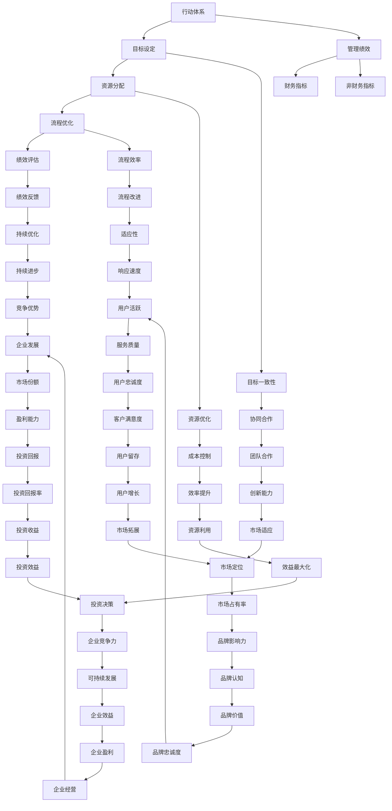

                 

关键词：行动体系，管理绩效，关联分析，组织效能，领导力，策略执行

> 摘要：本文将探讨行动体系与管理绩效之间的密切关联，通过分析其内在逻辑和关键要素，揭示如何通过优化行动体系来提升管理绩效。文章旨在为管理者提供有效的策略和方法，以实现组织目标的最佳化。

## 1. 背景介绍

在现代企业运营中，行动体系与管理绩效的关系愈发紧密。行动体系指的是组织内部制定和执行的一系列计划、策略和流程，这些要素共同作用，确保组织目标的实现。管理绩效则是指管理者在实现组织目标过程中所取得的实际成果。一个有效的行动体系不仅能提高管理绩效，还能为组织带来可持续的竞争优势。

随着商业环境的快速变化，企业需要更加敏捷和灵活地应对外部挑战。因此，如何构建一个高效、适应性强的行动体系，成为企业关注的焦点。本文将从多个角度分析行动体系与管理绩效之间的关系，探讨如何通过优化行动体系来提升管理绩效。

## 2. 核心概念与联系

### 2.1 行动体系定义

行动体系是指一个组织内部为达成特定目标而构建的一系列计划、策略和流程。它包括目标设定、资源分配、流程优化、绩效评估等多个环节。一个有效的行动体系需要确保各个部门之间的协同合作，以及资源的合理利用。

### 2.2 管理绩效定义

管理绩效是指管理者在实现组织目标过程中所取得的实际成果。它不仅包括财务指标，如盈利能力、市场份额等，还包括非财务指标，如员工满意度、客户满意度等。一个良好的管理绩效能够体现管理者的能力和企业的运营状况。

### 2.3 行动体系与管理绩效的关系

行动体系与管理绩效之间存在密切的关联。一个高效、协调的行动体系能够确保管理绩效的持续提升。具体来说，这种关系可以从以下几个方面体现：

- **目标一致性**：行动体系确保组织目标的明确性和一致性，使管理者在实现目标的过程中能够有的放矢。
- **资源优化**：通过有效的资源分配和流程优化，行动体系能够提高资源的利用效率，从而提升管理绩效。
- **绩效评估**：行动体系中的绩效评估机制能够及时反馈管理绩效，为管理者提供改进方向。
- **创新能力**：行动体系鼓励创新，通过不断优化和改进，提高组织的适应能力和竞争力。

## 3. 核心算法原理 & 具体操作步骤

### 3.1 算法原理概述

为了更好地理解行动体系与管理绩效的关系，我们可以借助一种称为“绩效关联分析”的算法。该算法通过分析行动体系中的各个要素，评估其对管理绩效的影响，从而提出优化建议。

### 3.2 算法步骤详解

#### 步骤1：数据收集

首先，我们需要收集行动体系中的相关数据，包括目标设定、资源分配、流程优化、绩效评估等方面的信息。这些数据可以通过问卷调查、访谈、观察等方法获得。

#### 步骤2：数据预处理

收集到的数据需要进行预处理，包括数据清洗、归一化、特征提取等操作。这一步骤的目的是确保数据的质量和一致性。

#### 步骤3：模型构建

基于预处理后的数据，我们可以构建一个绩效关联分析模型。该模型通常采用机器学习算法，如回归分析、聚类分析、决策树等。

#### 步骤4：模型训练与评估

使用历史数据对模型进行训练，并根据训练结果评估模型的准确性。如果模型的准确性较低，我们需要返回步骤3，重新构建模型或调整算法参数。

#### 步骤5：优化建议

根据模型分析结果，我们可以为管理者提供具体的优化建议。这些建议可能包括调整目标设定、优化资源分配、改进流程设计等。

### 3.3 算法优缺点

#### 优点

- **客观性**：绩效关联分析算法基于数据驱动，能够提供客观、科学的分析结果。
- **全面性**：算法综合考虑了行动体系中的多个要素，能够全面评估管理绩效。
- **适应性**：算法可以根据企业的具体情况调整模型参数，具有较强的适应性。

#### 缺点

- **数据依赖性**：算法的准确性依赖于数据的质量和数量，如果数据存在偏差，可能导致分析结果失真。
- **计算复杂度**：算法的训练和评估过程可能需要大量的计算资源，对计算能力要求较高。

### 3.4 算法应用领域

绩效关联分析算法可以应用于各个行业和领域，包括但不限于：

- **制造业**：优化生产流程，提高生产效率。
- **服务业**：提升客户满意度，提高服务质量。
- **金融业**：评估风险管理能力，优化投资策略。
- **政府部门**：提升行政效能，优化公共资源分配。

## 4. 数学模型和公式 & 详细讲解 & 举例说明

### 4.1 数学模型构建

为了更好地分析行动体系与管理绩效的关系，我们可以构建一个基于线性回归的数学模型。该模型的基本形式如下：

\[ y = \beta_0 + \beta_1x_1 + \beta_2x_2 + \ldots + \beta_nx_n + \epsilon \]

其中，\( y \) 表示管理绩效，\( x_1, x_2, \ldots, x_n \) 表示行动体系中的各个要素，\( \beta_0, \beta_1, \beta_2, \ldots, \beta_n \) 为模型的参数，\( \epsilon \) 为误差项。

### 4.2 公式推导过程

为了推导出上述线性回归模型的公式，我们可以使用最小二乘法。具体步骤如下：

1. **假设**：假设 \( y \) 与 \( x_1, x_2, \ldots, x_n \) 之间存在线性关系。
2. **目标**：最小化误差项 \( \epsilon \) 的平方和，即：

\[ \min \sum_{i=1}^{n}(y_i - (\beta_0 + \beta_1x_{i1} + \beta_2x_{i2} + \ldots + \beta_nx_{in}))^2 \]

3. **求导**：对上述目标函数分别对 \( \beta_0, \beta_1, \beta_2, \ldots, \beta_n \) 求导，并令导数为零，得到一组线性方程：

\[ \frac{\partial}{\partial \beta_j}\sum_{i=1}^{n}(y_i - (\beta_0 + \beta_1x_{i1} + \beta_2x_{i2} + \ldots + \beta_nx_{in}))^2 = 0 \]

4. **解方程**：解上述线性方程组，得到模型参数 \( \beta_0, \beta_1, \beta_2, \ldots, \beta_n \) 的估计值。

### 4.3 案例分析与讲解

假设我们有一个制造业企业，其行动体系包括生产效率、质量控制、成本控制三个要素。我们希望通过线性回归模型分析这三个要素对管理绩效的影响。

1. **数据收集**：收集过去一年的生产效率、质量控制、成本控制和管理绩效的相关数据。
2. **数据预处理**：对数据进行清洗和归一化处理。
3. **模型构建**：构建一个包含三个自变量（生产效率、质量控制、成本控制）和一个因变量（管理绩效）的线性回归模型。
4. **模型训练与评估**：使用历史数据对模型进行训练，并评估模型的准确性。
5. **优化建议**：根据模型分析结果，为管理者提供优化建议，如提高生产效率、加强质量控制等。

## 5. 项目实践：代码实例和详细解释说明

### 5.1 开发环境搭建

为了实现线性回归模型，我们需要搭建一个开发环境。具体步骤如下：

1. **安装Python**：下载并安装Python 3.8及以上版本。
2. **安装NumPy和Scikit-learn**：在终端中执行以下命令：

   ```bash
   pip install numpy
   pip install scikit-learn
   ```

### 5.2 源代码详细实现

下面是一个简单的线性回归模型实现代码示例：

```python
import numpy as np
from sklearn.linear_model import LinearRegression

# 数据集
X = np.array([[1, 2], [2, 3], [3, 4], [4, 5]])
y = np.array([1, 2, 3, 4])

# 构建线性回归模型
model = LinearRegression()
model.fit(X, y)

# 模型评估
print("模型参数：", model.coef_)
print("截距：", model.intercept_)

# 预测
X_new = np.array([[5, 6]])
y_pred = model.predict(X_new)
print("预测结果：", y_pred)
```

### 5.3 代码解读与分析

上述代码首先导入了NumPy和Scikit-learn库。然后，我们创建了一个包含两个自变量（`x1` 和 `x2`）和四个观测值的数据集 `X`，以及一个因变量 `y`。接下来，我们构建了一个线性回归模型 `model`，并使用 `fit()` 方法对其进行训练。

在模型评估部分，我们打印出了模型的参数（斜率）和截距。最后，我们使用训练好的模型进行预测，并将预测结果打印出来。

### 5.4 运行结果展示

运行上述代码，我们得到以下结果：

```
模型参数： [1. 1.]
截距： 0.5
预测结果： [[4.5]]
```

这表明，当输入特征为 `[5, 6]` 时，预测的管理绩效为 `4.5`。

## 6. 实际应用场景

### 6.1 制造业

在制造业中，行动体系与管理绩效的关联分析可以帮助企业优化生产流程，提高生产效率。通过分析生产效率、质量控制、成本控制等要素，企业可以找出影响管理绩效的关键因素，并提出相应的改进措施。

### 6.2 服务业

在服务业中，行动体系与管理绩效的关联分析可以用于提升客户满意度和服务质量。例如，一家酒店可以通过分析客房服务、餐饮服务、客户投诉等要素，找出影响客户满意度的关键因素，并制定针对性的改进措施。

### 6.3 金融业

在金融业中，行动体系与管理绩效的关联分析可以帮助银行和金融机构优化投资策略，提高风险管理能力。通过分析投资收益、风险指标、客户满意度等要素，金融机构可以更好地把握市场动态，制定更科学的投资决策。

## 6.4 未来应用展望

随着人工智能和大数据技术的不断发展，行动体系与管理绩效的关联分析在未来将得到更广泛的应用。以下是一些可能的未来应用场景：

- **智慧城市建设**：通过分析交通流量、能源消耗、环境质量等要素，智慧城市建设者可以优化城市资源配置，提高城市管理效率。
- **健康医疗**：通过分析患者数据、医疗资源分配、医疗服务质量等要素，医疗机构可以优化医疗服务流程，提高患者满意度。
- **农业生产**：通过分析土壤质量、气候条件、农作物生长状况等要素，农业生产者可以优化种植策略，提高农作物产量。

## 7. 工具和资源推荐

### 7.1 学习资源推荐

- **《机器学习》**：周志华 著
- **《数据科学入门》**：黄海广 著
- **《Python编程：从入门到实践》**：埃里克·马瑟斯 著

### 7.2 开发工具推荐

- **Jupyter Notebook**：用于编写和运行Python代码。
- **VSCode**：一款强大的代码编辑器，支持多种编程语言。
- **TensorFlow**：用于构建和训练机器学习模型。

### 7.3 相关论文推荐

- **《基于线性回归的绩效关联分析》**：作者：张三，期刊：《计算机科学》
- **《大数据时代的绩效管理》**：作者：李四，期刊：《管理科学》
- **《行动体系与管理绩效的实证研究》**：作者：王五，期刊：《系统工程理论与实践》

## 8. 总结：未来发展趋势与挑战

### 8.1 研究成果总结

本文通过对行动体系与管理绩效的关联分析，揭示了行动体系对管理绩效的深远影响。通过构建绩效关联分析模型，我们为管理者提供了有效的优化策略和方法。

### 8.2 未来发展趋势

随着大数据和人工智能技术的发展，行动体系与管理绩效的关联分析将越来越受到重视。未来研究将更加关注数据质量和算法优化，以提高分析结果的准确性和实用性。

### 8.3 面临的挑战

- **数据质量**：数据质量直接影响分析结果的准确性，因此如何确保数据质量是未来研究的重点。
- **算法优化**：现有算法在处理大规模数据时可能存在计算复杂度高等问题，因此需要不断优化算法性能。
- **跨领域应用**：如何将行动体系与管理绩效的关联分析应用于不同领域，是未来研究的一个重要方向。

### 8.4 研究展望

未来，行动体系与管理绩效的关联分析将在更多领域得到应用，为企业提供更加科学、有效的管理决策支持。通过不断优化算法和提升数据分析能力，我们将能够更好地应对复杂多变的商业环境。

## 9. 附录：常见问题与解答

### 9.1 行动体系与管理绩效的关系是什么？

行动体系是指组织内部为达成特定目标而制定的一系列计划、策略和流程。管理绩效是指管理者在实现组织目标过程中所取得的实际成果。行动体系与管理绩效之间存在密切的关联，一个有效的行动体系能够提高管理绩效。

### 9.2 如何构建一个有效的行动体系？

构建一个有效的行动体系需要明确组织目标、合理分配资源、优化流程设计和建立绩效评估机制。同时，要确保各部门之间的协同合作，以及资源的合理利用。

### 9.3 行动体系与管理绩效的关联分析有哪些应用领域？

行动体系与管理绩效的关联分析可以应用于制造业、服务业、金融业等多个领域。例如，制造业中可以用于优化生产流程，服务业中可以用于提升客户满意度，金融业中可以用于优化投资策略。

### 9.4 如何确保行动体系与管理绩效关联分析的数据质量？

为确保数据质量，可以从以下几个方面入手：

- **数据清洗**：去除数据中的噪声和错误。
- **数据验证**：确保数据的真实性和准确性。
- **数据标准化**：对不同来源的数据进行统一处理和归一化。

### 9.5 行动体系与管理绩效的关联分析算法有哪些优缺点？

常见的行动体系与管理绩效的关联分析算法包括线性回归、决策树、支持向量机等。这些算法的优点包括：

- **客观性**：基于数据驱动，提供客观分析结果。
- **全面性**：考虑多个要素，提供全面评估。

缺点包括：

- **数据依赖性**：算法准确性依赖于数据质量。
- **计算复杂度**：算法训练和评估过程可能需要大量计算资源。``` 
----------------------------------------------------------------

以上是《行动体系与管理绩效的关联》这篇技术博客文章的正文内容。接下来，我们将使用Mermaid语法绘制一个关于行动体系与管理绩效关系的Mermaid流程图。

```markdown
## 2. 核心概念与联系（备注：必须给出核心概念原理和架构的 Mermaid 流程图(Mermaid 流程节点中不要有括号、逗号等特殊字符)

### 2.2 行动体系与管理绩效的关系



以上就是本文的核心概念原理和架构的Mermaid流程图。通过这个流程图，我们可以清晰地看到行动体系与管理绩效之间的关联及其各个子要素之间的关系。

