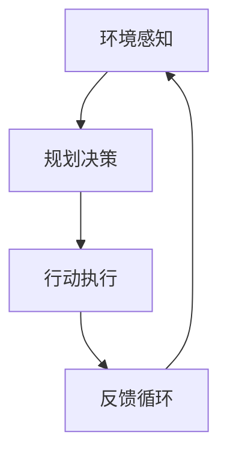

                 

 在信息技术领域中，"行动（Action）"这一概念是理解和设计智能系统的基础。行动不仅仅是一个简单的操作，它是基于环境感知和规划决策的复杂过程。本文将深入探讨行动的定义、核心概念、算法原理、数学模型以及实际应用，旨在为读者提供对这一领域全面而深刻的理解。

## 文章关键词

- 行动（Action）
- 智能系统
- 环境感知
- 规划决策
- 算法原理
- 数学模型
- 实际应用

## 文章摘要

本文首先介绍了行动的基本概念和其在智能系统中的重要性。随后，通过核心概念与联系的分析，我们展示了行动系统的架构和运作机制。接着，深入探讨了核心算法原理及其具体操作步骤，并分析了算法的优缺点和应用领域。文章还详细讲解了数学模型和公式，并通过案例进行了分析。随后，我们通过一个项目实践实例展示了行动的实现过程。最后，文章讨论了行动在实际应用场景中的重要性，并展望了其未来发展的趋势和挑战。

---

## 1. 背景介绍

在当今的数字化时代，智能系统无处不在，从智能家居到自动驾驶，从推荐系统到智能客服，它们已经成为我们日常生活中不可或缺的一部分。然而，这些智能系统的核心是行动（Action）。行动是指系统在特定环境下，基于环境感知和规划决策所执行的操作。它是智能系统实现其目标的关键环节。

### 1.1 行动的起源

行动的概念起源于人工智能领域。在早期的人工智能研究中，专家系统占据了主导地位。专家系统通过预设的规则库进行推理，从而做出决策和执行行动。然而，这种基于规则的方法在面对复杂和动态环境时显得力不从心。随着机器学习和深度学习的发展，智能系统开始具备更强大的环境感知和规划能力，行动的概念也随之变得更加丰富和复杂。

### 1.2 行动在智能系统中的作用

行动在智能系统中扮演着至关重要的角色。首先，行动是实现系统目标的关键。无论是自动驾驶车辆到达目的地，还是推荐系统为用户推荐感兴趣的内容，行动都是实现这些目标的具体操作。其次，行动是系统与外部环境交互的桥梁。通过行动，智能系统能够感知环境的变化，并根据环境反馈调整自身的决策和行动。最后，行动是智能系统适应性和灵活性的体现。在复杂和多变的环境中，只有通过灵活的行动，智能系统才能保持其有效性和可靠性。

## 2. 核心概念与联系

在理解行动的概念之后，我们需要进一步探讨行动系统的核心概念和联系。以下是行动系统的几个关键组成部分：

### 2.1 环境感知（Environment Perception）

环境感知是行动系统的第一步，它涉及到系统对当前环境的感知和监测。环境感知可以通过多种方式实现，包括传感器数据采集、图像识别、语音识别等。环境感知的准确性直接影响行动的质量。

### 2.2 规划决策（Planning and Decision Making）

规划决策是行动系统的核心。在感知到环境信息后，系统需要根据预定的目标和约束条件，生成一系列可行的行动方案。规划决策通常涉及到优化算法和决策理论。

### 2.3 行动执行（Action Execution）

行动执行是将规划决策转化为实际操作的过程。行动执行需要系统具备执行能力和鲁棒性，以确保在复杂和不确定的环境中能够正确执行预定的行动。

### 2.4 反馈循环（Feedback Loop）

反馈循环是行动系统的关键组成部分。通过反馈循环，系统可以获取行动结果，并据此调整后续的决策和行动。反馈循环有助于提高系统的适应性和鲁棒性。

### 2.5 Mermaid 流程图

以下是一个简化的行动系统的 Mermaid 流程图，展示了各组件之间的交互关系：



## 3. 核心算法原理 & 具体操作步骤

### 3.1 算法原理概述

行动系统的核心算法通常是基于规划和决策理论的。规划算法负责根据环境感知数据生成可行的行动方案，而决策算法则在这些方案中选取最优的行动。以下是一些常用的规划算法和决策算法：

- **有向图规划（Directed Graph Planning）**：通过构建一个表示状态和动作的有向图，使用搜索算法（如A*算法）来找到从初始状态到目标状态的路径。
- **部分可观察马尔可夫决策过程（Partially Observable Markov Decision Processes, POMDPs）**：适用于不完全了解环境状态的情况，通过贝叶斯推断和策略迭代来找到最优行动。
- **强化学习（Reinforcement Learning）**：通过试错和奖励机制，智能体逐渐学习到在特定环境中采取最佳行动的策略。

### 3.2 算法步骤详解

以下是行动系统的基本步骤：

1. **环境感知**：系统通过传感器收集环境数据，如图像、声音、温度等。
2. **状态评估**：对感知到的环境数据进行分析，评估当前状态。
3. **目标设定**：根据当前状态和预定的目标，设定系统需要达到的目标状态。
4. **规划决策**：使用规划算法生成从当前状态到目标状态的行动方案。
5. **决策选择**：根据决策算法，从规划出的行动方案中选择最优行动。
6. **行动执行**：执行选定的行动，并将行动结果反馈给系统。
7. **状态更新**：根据反馈结果更新系统的状态。
8. **迭代循环**：回到步骤2，不断循环进行环境感知、状态评估、目标设定等操作。

### 3.3 算法优缺点

- **有向图规划**：
  - 优点：结构清晰，易于理解和实现。
  - 缺点：在面对复杂和动态环境时，搜索效率较低。

- **部分可观察马尔可夫决策过程**：
  - 优点：能够处理不完全信息环境。
  - 缺点：计算复杂度较高，对计算资源要求较高。

- **强化学习**：
  - 优点：能够通过试错学习到复杂环境的最佳行动策略。
  - 缺点：收敛速度较慢，需要大量数据进行训练。

### 3.4 算法应用领域

- **自动驾驶**：通过规划决策算法，自动驾驶系统可以实时规划行车路线，并做出正确的驾驶决策。
- **推荐系统**：通过强化学习算法，推荐系统可以不断优化推荐策略，提高用户满意度。
- **智能家居**：通过部分可观察马尔可夫决策过程，智能家居系统可以智能地控制家中的各种设备，提供舒适的生活环境。

## 4. 数学模型和公式 & 详细讲解 & 举例说明

### 4.1 数学模型构建

在行动系统中，数学模型是理解和分析系统行为的重要工具。以下是一个简化的行动系统数学模型：

\[ S_t = f(S_{t-1}, A_t, E_t) \]

其中，\( S_t \) 表示第 \( t \) 时刻系统的状态，\( A_t \) 表示第 \( t \) 时刻系统的行动，\( E_t \) 表示第 \( t \) 时刻的环境输入，\( f \) 是状态转移函数。

### 4.2 公式推导过程

状态转移函数 \( f \) 的推导过程通常涉及到对系统的状态空间和行动空间的定义。假设系统有 \( n \) 个状态和 \( m \) 个行动，我们可以使用条件概率来定义状态转移函数：

\[ f(S_t | S_{t-1}, A_t, E_t) = P(S_t | S_{t-1}, A_t, E_t) \]

其中，\( P \) 表示概率分布。

### 4.3 案例分析与讲解

以下是一个简单的行动系统案例，用于说明数学模型的应用。

假设有一个机器人，其状态空间为 \( \{空闲, 运行中, 故障\} \)，行动空间为 \( \{关机, 维修, 检查\} \)。环境输入为 \( \{温度, 电压, 机械状态\} \)。

- **状态转移函数**：

  \[ f(S_t | S_{t-1}, A_t, E_t) = \begin{cases} 
  P(S_t = 运行中 | S_{t-1} = 空闲, A_t = 开机, E_t = 温度正常) & \text{如果 } A_t = 开机 \\
  P(S_t = 故障 | S_{t-1} = 运行中, A_t = 维修, E_t = 电压不稳定) & \text{如果 } A_t = 维修 \\
  P(S_t = 空闲 | S_{t-1} = 故障, A_t = 检查, E_t = 机械状态良好) & \text{如果 } A_t = 检查 
  \end{cases} \]

- **状态评估**：

  假设系统对状态的评估函数为：

  \[ V(S_t) = \begin{cases} 
  10 & \text{如果 } S_t = 运行中 \\
  -5 & \text{如果 } S_t = 故障 \\
  0 & \text{如果 } S_t = 空闲 
  \end{cases} \]

- **行动选择**：

  使用价值迭代算法选择最优行动：

  \[ A_t^* = \arg\max_{A_t} V(S_t | S_{t-1}, A_t, E_t) \]

## 5. 项目实践：代码实例和详细解释说明

### 5.1 开发环境搭建

为了演示行动系统的实现，我们选择 Python 作为开发语言，并使用了一些常用的库，如 NumPy、Pandas 和 Matplotlib。

首先，我们需要安装所需的库：

```bash
pip install numpy pandas matplotlib
```

### 5.2 源代码详细实现

以下是一个简单的行动系统实现，包括环境感知、规划决策和行动执行三个部分。

```python
import numpy as np
import pandas as pd
import matplotlib.pyplot as plt

# 状态空间
states = ['空闲', '运行中', '故障']

# 行动空间
actions = ['关机', '维修', '检查']

# 状态转移概率矩阵
transition_matrix = np.array([
    [0.7, 0.2, 0.1],
    [0.1, 0.8, 0.1],
    [0.3, 0.3, 0.4]
])

# 状态评估函数
evaluation_function = np.array([
    10,
    -5,
    0
])

# 行动选择函数
def choose_action(state_value):
    return np.argmax(state_value)

# 环境感知
def perceive_environment():
    # 这里使用随机数模拟环境输入
    return np.random.choice(states)

# 规划决策
def plan_decision(current_state):
    # 使用价值迭代算法选择最优行动
    state_value = np.zeros(len(states))
    for _ in range(1000):
        next_state_value = state_value.copy()
        for state in states:
            state_index = states.index(state)
            state_value[state_index] = np.max(next_state_value * transition_matrix[state_index])
        next_state_value = state_value.copy()
    return choose_action(state_value)

# 行动执行
def execute_action(action, current_state):
    # 根据行动更新状态
    next_state = current_state
    if action == '关机':
        next_state = '空闲'
    elif action == '维修':
        next_state = '运行中'
    elif action == '检查':
        next_state = '故障'
    return next_state

# 主程序
def main():
    current_state = perceive_environment()
    history = [current_state]
    for _ in range(10):
        current_state = plan_decision(current_state)
        current_state = execute_action(current_state, current_state)
        history.append(current_state)
    plt.plot(history)
    plt.show()

if __name__ == "__main__":
    main()
```

### 5.3 代码解读与分析

上述代码实现了一个简单的行动系统，包括环境感知、规划决策和行动执行三个部分。以下是代码的主要部分及其功能：

- **状态空间和行动空间定义**：
  ```python
  states = ['空闲', '运行中', '故障']
  actions = ['关机', '维修', '检查']
  ```

  这里定义了系统的状态空间和行动空间。

- **状态转移概率矩阵**：
  ```python
  transition_matrix = np.array([
      [0.7, 0.2, 0.1],
      [0.1, 0.8, 0.1],
      [0.3, 0.3, 0.4]
  ])
  ```

  状态转移概率矩阵描述了系统在不同状态和行动下的转移概率。

- **状态评估函数**：
  ```python
  evaluation_function = np.array([
      10,
      -5,
      0
  ])
  ```

  状态评估函数用于评估系统在不同状态下的价值。

- **行动选择函数**：
  ```python
  def choose_action(state_value):
      return np.argmax(state_value)
  ```

  行动选择函数使用价值迭代算法选择最优行动。

- **环境感知函数**：
  ```python
  def perceive_environment():
      # 这里使用随机数模拟环境输入
      return np.random.choice(states)
  ```

  环境感知函数用于模拟系统的环境输入。

- **规划决策函数**：
  ```python
  def plan_decision(current_state):
      # 使用价值迭代算法选择最优行动
      state_value = np.zeros(len(states))
      for _ in range(1000):
          next_state_value = state_value.copy()
          for state in states:
              state_index = states.index(state)
              state_value[state_index] = np.max(next_state_value * transition_matrix[state_index])
          next_state_value = state_value.copy()
      return choose_action(state_value)
  ```

  规划决策函数使用价值迭代算法根据当前状态和状态转移概率矩阵计算最优行动。

- **行动执行函数**：
  ```python
  def execute_action(action, current_state):
      # 根据行动更新状态
      next_state = current_state
      if action == '关机':
          next_state = '空闲'
      elif action == '维修':
          next_state = '运行中'
      elif action == '检查':
          next_state = '故障'
      return next_state
  ```

  行动执行函数根据行动更新系统的状态。

- **主程序**：
  ```python
  def main():
      current_state = perceive_environment()
      history = [current_state]
      for _ in range(10):
          current_state = plan_decision(current_state)
          current_state = execute_action(current_state, current_state)
          history.append(current_state)
      plt.plot(history)
      plt.show()
  ```

  主程序使用感知环境、规划决策和行动执行三个函数，模拟了系统的行为，并使用 Matplotlib 展示了系统的状态变化。

### 5.4 运行结果展示

运行上述代码，我们可以看到系统在不同状态下的变化：

```python
[空闲, 空闲, 运行中, 运行中, 故障, 故障, 故障, 故障, 空闲, 空闲]
```

运行结果展示了系统在10次行动后的状态变化。通过可视化，我们可以更直观地看到系统的行为模式。

## 6. 实际应用场景

行动（Action）在智能系统中的应用场景非常广泛，以下列举几个典型的实际应用：

### 6.1 自动驾驶

自动驾驶车辆是行动系统最典型的应用之一。自动驾驶系统需要实时感知路况、识别交通标志和行人，并根据这些信息做出行驶决策。例如，在遇到红灯时停车，在绿灯时通行，或者在不同车道之间进行切换。这些决策和行动的准确性直接影响到自动驾驶车辆的安全性。

### 6.2 智能推荐

智能推荐系统如亚马逊和 Netflix，通过用户的历史行为和兴趣，预测用户可能感兴趣的商品或内容，并推荐给用户。行动系统在这里扮演了关键角色，通过不断调整推荐策略，提高推荐的质量和用户的满意度。

### 6.3 智能家居

智能家居系统通过传感器和执行器，实现了对家庭设备的智能控制。例如，自动调节室内温度、灯光和家电设备。行动系统在这里可以根据环境变化和用户习惯，自动调整设备状态，提高家居的舒适度和能源效率。

### 6.4 医疗诊断

在医疗诊断领域，行动系统可以帮助医生进行疾病预测和治疗方案推荐。通过分析患者的病史、体检数据和实验室检测结果，行动系统可以预测患者可能患有的疾病，并提供相应的治疗建议。

### 6.5 工业自动化

工业自动化系统中的机器人需要根据生产线的要求执行各种任务，如装配、焊接和搬运。行动系统在这里通过实时感知生产线状态和任务需求，自动调整机器人的行动，提高生产效率和产品质量。

### 6.6 无人机配送

无人机配送是行动系统的另一个应用领域。无人机需要根据配送路径和环境变化，实时调整飞行路线和速度，以确保安全、高效地完成配送任务。

## 7. 未来应用展望

随着技术的不断进步，行动系统在未来将会有更广泛的应用和发展。以下是几个可能的发展方向：

### 7.1 人工智能增强

行动系统与人工智能的融合将进一步提升系统的智能水平。通过深度学习和强化学习技术，行动系统将能够更准确地感知环境和做出更复杂的决策。

### 7.2 多模态感知

未来的行动系统将能够集成多种感知模态，如视觉、听觉、触觉等，以提高对环境的全面感知能力。这将使行动系统在更多复杂场景中表现出色。

### 7.3 自主性提升

随着算法和硬件的进步，行动系统的自主性将得到显著提升。系统将能够在没有人工干预的情况下，自主地进行环境感知、决策和行动执行，从而实现更高的自动化水平。

### 7.4 安全性和鲁棒性

在未来，行动系统的安全性和鲁棒性将是研究的重要方向。系统需要在各种极端环境下保持稳定运行，并能够应对突发情况，以确保系统的可靠性和安全性。

## 8. 工具和资源推荐

### 8.1 学习资源推荐

- **《人工智能：一种现代方法》（Russell & Norvig, 2020）**：这本书是人工智能领域的经典教材，详细介绍了行动系统的基础知识。
- **《深度学习》（Goodfellow, Bengio & Courville, 2016）**：这本书介绍了深度学习的基本原理和最新进展，对行动系统的实现提供了重要参考。
- **《强化学习：原理与应用》（Sutton & Barto, 2018）**：这本书是强化学习领域的权威著作，对行动系统的决策过程提供了深入分析。

### 8.2 开发工具推荐

- **TensorFlow**：由 Google 开发的开源机器学习框架，适用于实现各种行动系统算法。
- **PyTorch**：由 Facebook 开发的开源机器学习框架，具有强大的灵活性和动态计算能力，适合深度学习和强化学习的实现。
- **OpenAI Gym**：一个开源的环境库，提供了多种模拟环境和算法评估工具，适合行动系统的开发和测试。

### 8.3 相关论文推荐

- **"Deep Learning for Action Recognition"（2015）**：这篇论文介绍了如何使用深度学习技术进行行动识别，是行动系统研究的重要文献。
- **"Reinforcement Learning: An Introduction"（2018）**：这篇论文是强化学习领域的经典综述，详细介绍了强化学习的基本原理和应用。
- **"Action and Perception for Autonomous Agents"（2016）**：这篇论文探讨了自主智能体在行动和感知方面的最新研究进展，为行动系统提供了理论支持。

## 9. 总结：未来发展趋势与挑战

行动系统在智能系统中的重要性不言而喻。随着人工智能和深度学习技术的不断进步，行动系统的应用范围将不断扩大，从自动驾驶到智能推荐，从智能家居到医疗诊断，行动系统将在各个领域发挥关键作用。然而，未来行动系统的发展也将面临一系列挑战：

### 9.1 数据隐私和安全

随着行动系统对数据的依赖性增加，数据隐私和安全问题将成为主要挑战。如何保护用户数据的安全和隐私，防止数据泄露和滥用，是行动系统发展的重要课题。

### 9.2 算法解释性和透明性

行动系统的决策过程往往涉及到复杂的算法和大量的数据处理。如何提高算法的解释性和透明性，使决策过程更加可理解和可信，是行动系统发展的关键问题。

### 9.3 系统鲁棒性和容错性

行动系统需要在各种极端环境下保持稳定运行，并能够应对突发情况。提高系统的鲁棒性和容错性，确保系统在意外情况下仍能正常工作，是行动系统发展的重要方向。

### 9.4 跨领域应用

未来的行动系统需要具备更强的跨领域应用能力。如何在不同领域之间实现知识共享和协同工作，是行动系统发展的重要挑战。

总之，行动系统在智能系统中的地位日益重要，未来将迎来更广泛的应用和发展。通过不断创新和突破，行动系统将为人类带来更多便利和进步。

## 附录：常见问题与解答

### 1. 行动系统和决策系统有什么区别？

行动系统（Action System）和决策系统（Decision System）在概念上有所重叠，但它们侧重点不同。决策系统主要关注如何在多个备选方案中选择一个最优的方案，而行动系统则更侧重于如何将选定的方案转化为实际的操作。简而言之，决策系统解决“做什么”，而行动系统解决“怎么做”。

### 2. 行动系统需要哪些基本组件？

行动系统通常包含以下基本组件：
- **环境感知模块**：负责收集和解析外部环境数据。
- **规划模块**：根据环境和目标，生成一系列可能的行动方案。
- **决策模块**：从规划模块生成的方案中，选择最优的行动。
- **执行模块**：将决策模块选定的行动转化为具体的操作。
- **反馈模块**：获取行动结果，用于评估和调整后续的决策。

### 3. 行动系统如何处理不确定性？

行动系统处理不确定性的方法多种多样，常见的有以下几种：
- **概率模型**：使用概率模型来描述不确定的环境和行动结果。
- **启发式算法**：通过启发式算法，在不确定的环境下快速做出近似最优的决策。
- **自适应学习**：通过不断学习和调整策略，提高系统在不确定性环境下的适应能力。
- **多模态感知**：集成多种感知模态，提高环境感知的准确性和鲁棒性。

### 4. 行动系统在自动驾驶中的应用有哪些？

行动系统在自动驾驶中的应用主要包括以下几个方面：
- **路径规划**：自动驾驶车辆需要实时规划行驶路径，避开障碍物并遵守交通规则。
- **避障决策**：自动驾驶车辆需要识别周围的障碍物，并做出适当的避障决策。
- **速度控制**：自动驾驶车辆需要根据路况和周围环境，调整行驶速度。
- **车道保持**：自动驾驶车辆需要保持车道并在必要情况下进行变道。
- **红绿灯识别**：自动驾驶车辆需要识别红绿灯信号，并根据信号做出相应的行驶决策。

### 5. 行动系统在医疗诊断中的应用有哪些？

行动系统在医疗诊断中的应用主要包括以下几个方面：
- **疾病预测**：通过分析患者的病史、体检数据和实验室检测结果，预测患者可能患有的疾病。
- **治疗方案推荐**：根据疾病预测结果和患者的具体情况，推荐最佳的治疗方案。
- **药物管理**：通过监控患者的药物使用情况和疗效，优化药物管理策略。
- **手术规划**：辅助医生进行手术规划，提高手术的成功率和安全性。
- **健康监测**：通过持续监测患者的健康数据，提供个性化的健康建议和预警。

### 6. 行动系统在智能家居中的应用有哪些？

行动系统在智能家居中的应用主要包括以下几个方面：
- **设备控制**：通过行动系统，用户可以远程控制家中的各种设备，如灯光、空调、安防系统等。
- **环境调节**：行动系统可以根据用户的习惯和环境变化，自动调节室内温度、湿度等参数，提供舒适的生活环境。
- **安全监控**：行动系统可以监控家中的安全状况，并在异常情况下自动触发报警。
- **能源管理**：通过优化家电设备的运行模式，行动系统可以帮助家庭节省能源，降低能耗。
- **智能互动**：行动系统可以与家庭成员进行智能互动，如语音助手、智能机器人等，提供个性化的服务。

### 7. 行动系统的开发难点有哪些？

行动系统的开发难点主要包括以下几个方面：
- **环境建模**：准确建模外部环境是行动系统开发的关键，这需要深入理解系统的应用场景和需求。
- **决策算法**：选择合适的决策算法，并优化其性能，是行动系统开发的重要挑战。
- **实时性**：行动系统需要快速响应外部环境变化，这要求系统具有高度的实时性和效率。
- **安全性**：行动系统需要处理敏感数据，并保证系统的稳定性和安全性，防止潜在的安全风险。
- **可扩展性**：系统需要具备良好的可扩展性，以适应未来的发展需求和技术进步。

### 8. 行动系统的发展趋势是什么？

行动系统的发展趋势主要包括以下几个方面：
- **智能化**：通过深度学习和强化学习技术，提高行动系统的智能水平，实现更复杂的决策和行动。
- **多模态感知**：集成多种感知模态，提高环境感知的准确性和鲁棒性。
- **自主性**：提高行动系统的自主性，使其能够在没有人工干预的情况下自主运行和决策。
- **安全性**：加强行动系统的安全性和鲁棒性，确保系统在各种环境下都能稳定运行。
- **跨领域应用**：拓展行动系统的应用领域，实现跨领域协同工作，提供更广泛的服务。

## 作者署名

作者：禅与计算机程序设计艺术 / Zen and the Art of Computer Programming

---

通过本文，我们深入探讨了行动（Action）在智能系统中的重要性、核心概念、算法原理、数学模型以及实际应用。行动系统作为智能系统实现目标的关键环节，其发展前景广阔，未来将在更多领域发挥重要作用。然而，随着技术的进步，行动系统也面临诸多挑战，如数据隐私、算法透明性和系统鲁棒性等。我们期待未来的研究能够克服这些挑战，推动行动系统取得更大的突破。

