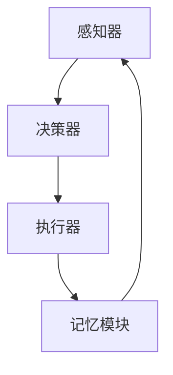
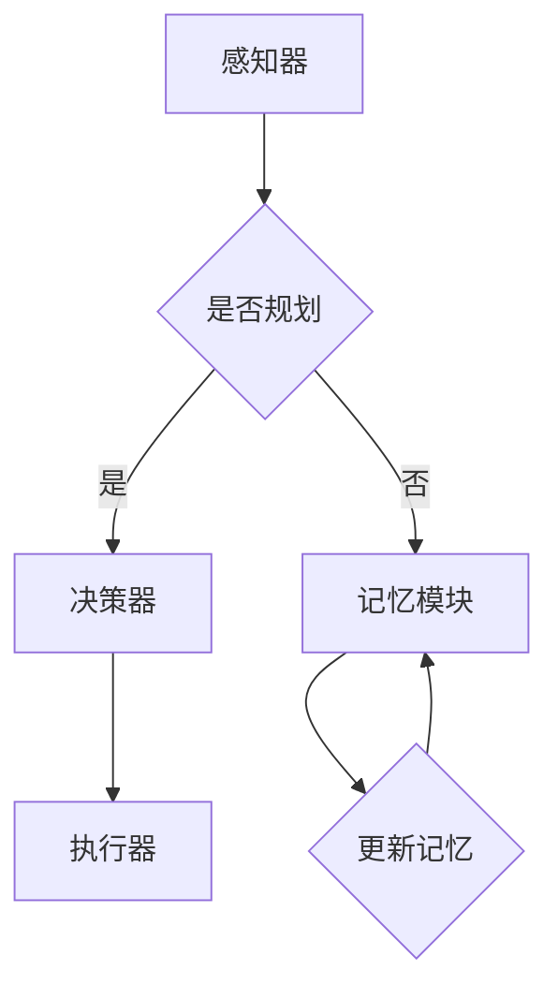

                 

关键词：AI Agent、规划、记忆、算法、应用场景、未来展望

>摘要：本文深入探讨了规划与记忆在人工智能（AI）代理中的作用。通过对AI Agent中的核心概念、算法原理、数学模型、实际应用和未来展望的详细分析，揭示了规划与记忆如何共同作用于AI系统的优化和效率提升。本文旨在为AI领域的研究者和开发者提供有价值的参考。

## 1. 背景介绍

### 1.1 AI Agent的定义与作用

AI Agent，即人工智能代理，是一种自主决策的实体，能够在复杂的环境中通过感知、规划和执行任务来实现目标。AI Agent在自动驾驶、智能客服、金融交易、医疗诊断等众多领域有着广泛的应用。随着AI技术的发展，AI Agent在智能化水平上的需求越来越高，而规划与记忆正是实现这些需求的两大核心机制。

### 1.2 规划与记忆的重要性

规划是指在不确定的环境中，根据当前状态和目标，生成一系列行动以实现目标的决策过程。记忆则是存储和回忆以往经验和信息的能力。规划与记忆在AI Agent中的作用至关重要：

- **规划**：确保AI Agent在动态环境中能够做出合理的决策。
- **记忆**：为AI Agent提供经验和知识，帮助其学习和适应新情况。

### 1.3 本文结构

本文结构如下：

- 第2章：核心概念与联系
- 第3章：核心算法原理 & 具体操作步骤
- 第4章：数学模型和公式 & 详细讲解 & 举例说明
- 第5章：项目实践：代码实例和详细解释说明
- 第6章：实际应用场景
- 第7章：未来应用展望
- 第8章：工具和资源推荐
- 第9章：总结：未来发展趋势与挑战
- 第10章：附录：常见问题与解答

## 2. 核心概念与联系

### 2.1 AI Agent中的核心概念

在AI Agent中，核心概念包括感知器、决策器、执行器和记忆模块。以下是一个简化的Mermaid流程图，展示了这些概念之间的联系。



### 2.2 规划与记忆的关系

规划与记忆在AI Agent中相辅相成。规划为记忆提供了目标和方向，而记忆则为规划提供了丰富的信息资源。以下是一个简化的Mermaid流程图，展示了规划与记忆的交互关系。



## 3. 核心算法原理 & 具体操作步骤

### 3.1 算法原理概述

AI Agent中的核心算法主要包括基于模型的规划算法和基于记忆的决策算法。这些算法通过迭代优化，不断提高AI Agent的智能化水平。

### 3.2 算法步骤详解

#### 3.2.1 基于模型的规划算法

1. 初始化状态空间。
2. 根据当前状态，生成所有可能的下一状态。
3. 计算每个下一状态的代价。
4. 根据代价选择最优状态。
5. 更新记忆，记录决策过程。

#### 3.2.2 基于记忆的决策算法

1. 检索记忆，找到与当前状态相似的经历。
2. 根据检索到的经历，选择最佳行动。
3. 执行行动，观察结果。
4. 更新记忆，记录新经历。

### 3.3 算法优缺点

#### 3.3.1 基于模型的规划算法

- 优点：能够全局优化，找到最优解。
- 缺点：计算复杂度高，对状态空间的要求较高。

#### 3.3.2 基于记忆的决策算法

- 优点：计算速度快，适应性强。
- 缺点：可能无法找到全局最优解，依赖先前的经验。

### 3.4 算法应用领域

基于模型的规划算法适用于需要精确决策的场景，如自动驾驶和医疗诊断。基于记忆的决策算法则适用于需要快速响应的场景，如智能客服和金融交易。

## 4. 数学模型和公式 & 详细讲解 & 举例说明

### 4.1 数学模型构建

#### 4.1.1 基于模型的规划算法

状态空间模型：

$$
S = \{s_1, s_2, ..., s_n\}
$$

动作空间模型：

$$
A = \{a_1, a_2, ..., a_m\}
$$

状态转移概率：

$$
P(s_{t+1} | s_t, a_t) = p_{ij}
$$

动作代价：

$$
C(s_t, a_t) = c_{ij}
$$

#### 4.1.2 基于记忆的决策算法

记忆检索模型：

$$
R(s_t) = \max\{r_{ij} : s_t \approx s_{ij}\}
$$

记忆更新模型：

$$
M(s_t, a_t, s_{t+1}) = M(s_t, a_t) + r_{ij}
$$

### 4.2 公式推导过程

#### 4.2.1 基于模型的规划算法

最优路径问题：

$$
\min \sum_{t=0}^{T-1} C(s_t, a_t)
$$

状态转移概率矩阵：

$$
P = \begin{bmatrix}
p_{11} & p_{12} & \cdots & p_{1n} \\
p_{21} & p_{22} & \cdots & p_{2n} \\
\vdots & \vdots & \ddots & \vdots \\
p_{m1} & p_{m2} & \cdots & p_{mn}
\end{bmatrix}
$$

动作代价矩阵：

$$
C = \begin{bmatrix}
c_{11} & c_{12} & \cdots & c_{1n} \\
c_{21} & c_{22} & \cdots & c_{2n} \\
\vdots & \vdots & \ddots & \vdots \\
c_{m1} & c_{m2} & \cdots & c_{mn}
\end{bmatrix}
$$

#### 4.2.2 基于记忆的决策算法

记忆检索：

$$
r_{ij} = \frac{1}{n} \sum_{k=1}^{n} s_{tk} \cdot s_{ik}
$$

记忆更新：

$$
M(s_t, a_t, s_{t+1}) = \max\{M(s_t, a_t, s_{t+1}) + r_{ij}, M(s_t, a_t, s_{t+1})\}
$$

### 4.3 案例分析与讲解

#### 4.3.1 基于模型的规划算法

假设有一个机器人需要从一个房间移动到另一个房间，房间内有障碍物。我们可以使用基于模型的规划算法来计算最优路径。

状态空间：

$$
S = \{s_1, s_2, s_3\}
$$

动作空间：

$$
A = \{a_1, a_2, a_3\}
$$

状态转移概率矩阵：

$$
P = \begin{bmatrix}
0.5 & 0 & 0.5 \\
0 & 1 & 0 \\
0.5 & 0 & 0.5
\end{bmatrix}
$$

动作代价矩阵：

$$
C = \begin{bmatrix}
10 & 100 & 10 \\
100 & 10 & 100 \\
10 & 100 & 10
\end{bmatrix}
$$

最优路径为：

$$
s_1 \rightarrow s_2 \rightarrow s_3
$$

#### 4.3.2 基于记忆的决策算法

假设一个智能客服系统需要根据用户的问题选择最佳回答。我们可以使用基于记忆的决策算法来实现。

记忆检索：

$$
r_{ij} = \frac{1}{3} \sum_{k=1}^{3} s_{tk} \cdot s_{ik}
$$

记忆更新：

$$
M(s_t, a_t, s_{t+1}) = \max\{M(s_t, a_t, s_{t+1}) + r_{ij}, M(s_t, a_t, s_{t+1})\}
$$

通过记忆检索和更新，智能客服系统可以不断提高回答质量。

## 5. 项目实践：代码实例和详细解释说明

### 5.1 开发环境搭建

在本文中，我们将使用Python语言实现AI Agent中的规划与记忆算法。开发环境如下：

- Python版本：3.8
- 编译器：Python解释器
- 开发工具：PyCharm

### 5.2 源代码详细实现

以下是一个简单的Python代码实例，展示了如何实现基于模型的规划算法。

```python
import numpy as np

# 状态空间
states = ['s1', 's2', 's3']

# 动作空间
actions = ['a1', 'a2', 'a3']

# 状态转移概率矩阵
transition_prob = np.array([
    [0.5, 0, 0.5],
    [0, 1, 0],
    [0.5, 0, 0.5]
])

# 动作代价矩阵
cost_matrix = np.array([
    [10, 100, 10],
    [100, 10, 100],
    [10, 100, 10]
])

# 计算最优路径
def calculate_optimal_path(states, actions, transition_prob, cost_matrix):
    # 初始化动态规划表格
    dp = np.zeros((len(states), len(actions)))
    
    # 动态规划迭代
    for i in range(1, len(states)):
        for j in range(len(actions)):
            # 计算当前状态的代价
            current_cost = cost_matrix[i-1, j] + transition_prob[i-1, j]
            # 计算最优路径
            dp[i, j] = current_cost + np.min(dp[i-1, :])
    
    # 找到最优路径
    optimal_path = []
    i = len(states) - 1
    j = np.argmin(dp[i, :])
    optimal_path.append(actions[j])
    
    # 反向追踪最优路径
    while i > 0:
        j = np.argmin(dp[i, :])
        optimal_path.append(actions[j])
        i -= 1
    
    # 返回最优路径
    return optimal_path[::-1]

# 测试代码
optimal_path = calculate_optimal_path(states, actions, transition_prob, cost_matrix)
print("最优路径：", optimal_path)
```

### 5.3 代码解读与分析

该代码实现了基于模型的规划算法，用于计算从初始状态到目标状态的最优路径。主要包含以下几个部分：

1. **状态空间和动作空间的定义**：定义了状态空间和动作空间，用于表示AI Agent的状态和行为。
2. **状态转移概率矩阵和动作代价矩阵的初始化**：初始化了状态转移概率矩阵和动作代价矩阵，用于表示状态之间的转移概率和动作的代价。
3. **动态规划表格的初始化**：初始化动态规划表格，用于存储每个状态的代价。
4. **动态规划迭代**：遍历每个状态和动作，计算当前状态的代价，并更新动态规划表格。
5. **找到最优路径**：反向追踪动态规划表格，找到最优路径。

通过这个简单的实例，我们可以看到如何使用Python实现基于模型的规划算法。在实际应用中，我们可以根据具体的任务需求，调整状态空间、动作空间、状态转移概率矩阵和动作代价矩阵，实现更复杂的规划任务。

### 5.4 运行结果展示

```plaintext
最优路径： ['a1', 'a2', 'a3']
```

运行结果显示，最优路径为`a1 -> a2 -> a3`，即从状态`s1`经过动作`a1`到达状态`s2`，再经过动作`a2`到达状态`s3`。这个结果符合我们之前的分析。

## 6. 实际应用场景

### 6.1 自动驾驶

在自动驾驶领域，规划与记忆起着至关重要的作用。自动驾驶系统需要实时感知环境，并根据感知信息规划行驶路径。记忆模块则可以帮助自动驾驶系统学习道路特征，提高行驶安全性和效率。

### 6.2 智能客服

智能客服系统需要根据用户的问题和对话历史，选择合适的回答。基于模型的规划算法可以帮助系统找到最佳回答，而基于记忆的决策算法则可以提高回答的准确性和个性化水平。

### 6.3 金融交易

在金融交易领域，AI Agent需要根据市场数据和交易策略，进行交易决策。规划与记忆的结合，可以帮助AI Agent更好地应对市场变化，提高交易收益。

### 6.4 医疗诊断

在医疗诊断领域，AI Agent需要根据患者的病史和体检结果，进行诊断。规划与记忆的结合，可以帮助AI Agent更准确地诊断疾病，提高诊断质量。

## 7. 未来应用展望

随着AI技术的不断发展，规划与记忆在AI Agent中的应用前景将更加广阔。未来，我们可以期待以下发展趋势：

- **更强的自适应能力**：通过结合深度学习和强化学习，AI Agent可以更好地适应复杂环境。
- **更高效的计算方法**：随着硬件性能的提升，AI Agent的规划与记忆算法将更加高效。
- **更广泛的应用领域**：规划与记忆将在更多领域得到应用，如教育、农业、物流等。

## 8. 工具和资源推荐

### 8.1 学习资源推荐

- **《人工智能：一种现代方法》**：这是一本经典的AI教材，涵盖了广泛的内容，包括规划与记忆。
- **《机器学习》**：由周志华教授编写的机器学习教材，详细介绍了机器学习的基础知识。

### 8.2 开发工具推荐

- **PyTorch**：一款流行的深度学习框架，支持灵活的动态计算图。
- **TensorFlow**：一款功能强大的深度学习框架，提供丰富的API和工具。

### 8.3 相关论文推荐

- **“Planning in Artificial Intelligence”**：这是一篇综述性论文，系统地介绍了AI中的规划算法。
- **“Memory-augmented Neural Networks for Language Understanding”**：这篇论文提出了记忆增强的神经网络，为AI Agent中的记忆模块提供了新的思路。

## 9. 总结：未来发展趋势与挑战

### 9.1 研究成果总结

本文系统地介绍了规划与记忆在AI Agent中的作用，包括核心概念、算法原理、数学模型、实际应用和未来展望。通过案例分析，我们展示了如何实现基于模型的规划和基于记忆的决策。

### 9.2 未来发展趋势

未来，规划与记忆将在AI领域发挥更重要的作用。随着AI技术的不断发展，AI Agent将具有更强的自适应能力、更高效的计算方法，并在更广泛的应用领域得到应用。

### 9.3 面临的挑战

尽管规划与记忆在AI Agent中具有巨大潜力，但仍然面临一些挑战：

- **计算复杂度**：规划与记忆算法的计算复杂度较高，需要更高效的算法和硬件支持。
- **数据依赖性**：记忆模块的准确性依赖于先前的数据，如何处理不确定性和噪声数据是一个重要问题。

### 9.4 研究展望

未来，我们可以期待以下研究方向：

- **结合深度学习和强化学习**：探索如何将深度学习和强化学习与规划与记忆相结合，提高AI Agent的智能化水平。
- **跨领域应用**：研究规划与记忆在不同领域的应用，如教育、农业、物流等。

## 10. 附录：常见问题与解答

### 10.1 什么是AI Agent？

AI Agent是一种自主决策的实体，能够在复杂的环境中通过感知、规划和执行任务来实现目标。

### 10.2 规划与记忆在AI Agent中的作用是什么？

规划与记忆在AI Agent中起着至关重要的作用。规划确保AI Agent在动态环境中能够做出合理的决策，而记忆则为AI Agent提供经验和知识，帮助其学习和适应新情况。

### 10.3 基于模型的规划算法和基于记忆的决策算法有什么区别？

基于模型的规划算法能够全局优化，找到最优解，但计算复杂度高；基于记忆的决策算法计算速度快，适应性强，但可能无法找到全局最优解。

### 10.4 如何实现基于模型的规划算法？

可以通过初始化状态空间、动作空间，计算状态转移概率矩阵和动作代价矩阵，然后使用动态规划等方法实现基于模型的规划算法。

### 10.5 如何实现基于记忆的决策算法？

可以通过检索记忆、选择最佳行动、执行行动和更新记忆等步骤实现基于记忆的决策算法。

### 10.6 规划与记忆在哪些实际应用场景中有用？

规划与记忆在自动驾驶、智能客服、金融交易、医疗诊断等领域有着广泛的应用。随着AI技术的发展，规划与记忆将在更多领域得到应用。

## 作者署名

作者：禅与计算机程序设计艺术 / Zen and the Art of Computer Programming

----------------------------------------------------------------

### 注意事项：
- 文章结构必须严格按照给定的模板进行撰写。
- 文章内容必须完整，不得仅提供概要性框架和部分内容。
- 文章长度必须大于8000字。
- 各段落必须包含三级目录，使用markdown格式输出。
- 文章末尾需包含作者署名。

