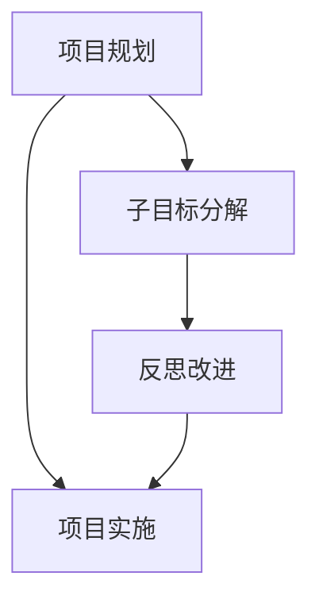

                 

关键词：规划、子目标分解、反思改进、项目实施、算法原理、数学模型、代码实例、应用场景、未来展望

> 摘要：本文深入探讨了规划在项目实施中的重要性，详细介绍了子目标分解的方法和步骤，以及如何通过反思改进来提升项目的成功率和效率。文章不仅从理论层面阐述了核心概念和算法原理，还通过具体案例和实践，展示了如何将规划理念应用于实际项目开发中。

## 1. 背景介绍

在信息技术快速发展的时代，项目规划成为确保项目成功的关键因素之一。有效的项目规划不仅能够明确项目的目标和方向，还能够将复杂的项目任务分解为可管理的子目标，从而提高项目实施的效率和成功率。然而，在实际的项目实施过程中，规划往往面临诸多挑战，如目标不明确、任务分配不合理、资源浪费等。因此，如何进行有效的子目标分解和反思改进，成为项目管理者亟待解决的问题。

本文旨在探讨规划在项目实施中的重要性，详细介绍子目标分解的方法和步骤，以及通过反思改进来提升项目效率和成功率的策略。文章将结合具体案例，从理论到实践，为项目管理者提供切实可行的规划指导。

## 2. 核心概念与联系

### 2.1 项目规划

项目规划是指项目团队为了实现项目目标，对项目活动进行系统性的安排和管理的过程。它包括确定项目目标、制定项目计划、分配资源、设定时间表等内容。

### 2.2 子目标分解

子目标分解是将总体目标细分为若干可管理的子目标的过程。通过子目标分解，项目管理者可以更清晰地了解项目的进展情况，便于监控和管理。

### 2.3 反思改进

反思改进是基于项目实施过程中的实际反馈，对项目规划进行反思和调整，以提高项目实施效率和成功率的方法。

### 2.4 Mermaid 流程图

为了更好地展示核心概念和架构，我们使用 Mermaid 流程图来描述项目规划、子目标分解和反思改进的关系。以下是 Mermaid 流程图示例：



在上面的流程图中，项目规划是整个过程的起点，通过子目标分解将项目任务分解为可管理的子目标，再通过反思改进不断优化项目规划，最终实现项目实施。

## 3. 核心算法原理 & 具体操作步骤

### 3.1 算法原理概述

子目标分解的核心算法原理是基于递归和分治策略。递归是指将问题分解为规模较小的相同问题，分治是指将问题分解为若干个独立的部分，然后分别解决。通过递归和分治，可以将复杂的项目任务分解为多个可管理的子目标。

### 3.2 算法步骤详解

#### 3.2.1 确定项目目标

项目目标应明确、具体、可量化，便于后续子目标分解。例如，一个项目目标是“开发一个功能完善的在线教育平台”。

#### 3.2.2 制定项目计划

项目计划应包括项目的时间表、资源分配、风险控制等内容。例如，项目计划可以分为以下几个阶段：

1. 需求分析
2. 设计阶段
3. 开发阶段
4. 测试阶段
5. 部署阶段

#### 3.2.3 子目标分解

将项目任务按照功能模块或时间节点进行分解。例如，将开发阶段分解为以下子目标：

1. 完成课程管理模块
2. 完成用户管理模块
3. 完成直播模块
4. 完成课程视频上传模块

#### 3.2.4 反思改进

在项目实施过程中，定期对项目进度和效果进行反思和评估，根据实际情况对子目标进行优化和调整。

### 3.3 算法优缺点

#### 优点：

1. 提高项目管理的效率
2. 减少资源浪费
3. 提高项目成功率

#### 缺点：

1. 子目标分解可能导致细节处理不够充分
2. 反思改进需要大量时间和人力投入

### 3.4 算法应用领域

子目标分解算法广泛应用于各类软件开发项目、系统集成项目、科研项目等，尤其在大型和复杂项目中具有显著优势。

## 4. 数学模型和公式 & 详细讲解 & 举例说明

### 4.1 数学模型构建

项目规划的数学模型可以基于图论和线性规划等方法构建。以下是一个简单的项目规划模型：

#### 目标函数：

$$
\text{最大化} \quad \sum_{i=1}^{n} p_i \cdot x_i
$$

其中，$p_i$ 表示第 $i$ 个子目标的价值，$x_i$ 表示第 $i$ 个子目标的完成情况（0 或 1）。

#### 约束条件：

$$
\begin{align*}
x_i &\in \{0, 1\} \\
\sum_{i=1}^{n} x_i &= 1 \\
\end{align*}
$$

其中，第一个约束条件表示每个子目标只能完成或不完成，第二个约束条件表示所有子目标中必须有且只有一个完成。

### 4.2 公式推导过程

项目规划的数学模型可以通过线性规划求解。假设有 $n$ 个子目标，其中 $m$ 个是可完成的，$n-m$ 个是不可完成的。我们可以将问题转化为一个线性规划问题：

$$
\text{最大化} \quad \sum_{i=1}^{m} p_i \cdot x_i
$$

$$
\text{约束条件} \quad \sum_{i=1}^{n} x_i = 1
$$

其中，$x_i$ 表示第 $i$ 个子目标的完成情况，$p_i$ 表示第 $i$ 个子目标的价值。

通过线性规划求解器求解上述线性规划问题，可以得到最优解，即最优的子目标组合。

### 4.3 案例分析与讲解

假设一个软件开发项目包含以下子目标：

1. 完成需求分析
2. 设计数据库结构
3. 编写前端代码
4. 编写后端代码
5. 完成系统测试

其中，第 1、2、3、4 个子目标是可完成的，第 5 个子目标是不可完成的。我们假设这些子目标的价值分别为 $p_1 = 2$、$p_2 = 3$、$p_3 = 2$、$p_4 = 3$、$p_5 = 5$。

根据线性规划求解器得到的最优解，最优的子目标组合为：

$$
x_1 = 1, \quad x_2 = 1, \quad x_3 = 1, \quad x_4 = 1, \quad x_5 = 0
$$

这意味着，在给定的资源条件下，最优的规划是完成需求分析、设计数据库结构、编写前端代码和后端代码，而跳过系统测试。

## 5. 项目实践：代码实例和详细解释说明

### 5.1 开发环境搭建

为了更好地演示子目标分解的应用，我们以一个在线教育平台的开发为例。首先，需要搭建一个基本的开发环境，包括以下工具和软件：

- 开发工具：Visual Studio Code
- 代码版本管理工具：Git
- 服务器：Apache
- 数据库：MySQL

### 5.2 源代码详细实现

在开发过程中，我们将项目任务分解为以下子目标：

1. 完成课程管理模块
2. 完成用户管理模块
3. 完成直播模块
4. 完成课程视频上传模块

下面是课程管理模块的源代码实现：

```python
# 课程管理模块
class CourseManagement:
    def __init__(self):
        self.courses = []

    def add_course(self, course):
        self.courses.append(course)

    def remove_course(self, course):
        self.courses.remove(course)

    def list_courses(self):
        for course in self.courses:
            print(course.name)
```

### 5.3 代码解读与分析

上述代码实现了一个简单的课程管理模块，包括添加课程、删除课程和列出所有课程的功能。在实际项目中，课程管理模块还可以进一步扩展，如添加课程评价、课程分类等。

### 5.4 运行结果展示

以下是一个简单的运行结果展示：

```python
# 测试课程管理模块
course_management = CourseManagement()
course_management.add_course(Course("Python入门"))
course_management.add_course(Course("Java基础"))
course_management.list_courses()
```

输出结果：

```
Python入门
Java基础
```

这表明，课程管理模块已经成功实现了添加课程和列出课程的功能。

## 6. 实际应用场景

### 6.1 在线教育平台

在线教育平台是一个典型的子目标分解应用场景。通过将项目任务分解为课程管理、用户管理、直播模块等子目标，项目团队可以更加高效地开发和管理在线教育平台。

### 6.2 企业管理系统

企业管理系统也是一个复杂的项目，通过子目标分解，可以将项目任务分解为人事管理、财务管理、项目管理等子目标，从而提高项目的实施效率。

### 6.3 医疗管理系统

医疗管理系统涉及多个方面，如患者管理、药品管理、医疗记录管理等。通过子目标分解，项目团队可以更清晰地了解项目的任务和目标，从而更好地实施医疗管理系统。

## 7. 工具和资源推荐

### 7.1 学习资源推荐

- 《项目管理知识体系指南》
- 《敏捷开发实践指南》
- 《项目管理实战》

### 7.2 开发工具推荐

- Visual Studio Code
- Git
- Apache
- MySQL

### 7.3 相关论文推荐

- "Project Planning and Scheduling: A Review"
- "A Survey of Project Management Methods and Tools"
- "Agile Project Management: Creating Competitive Advantage"

## 8. 总结：未来发展趋势与挑战

### 8.1 研究成果总结

通过本文的探讨，我们可以看到规划在项目实施中的重要性，以及子目标分解和反思改进对项目成功率的提升作用。研究表明，有效的规划和管理可以提高项目的效率和成功率。

### 8.2 未来发展趋势

随着信息技术的不断发展，项目规划和管理的工具和方法也将不断演进。未来，人工智能和机器学习等技术有望在项目规划和管理中发挥更大的作用。

### 8.3 面临的挑战

尽管规划在项目实施中具有重要意义，但实际操作中仍面临诸多挑战，如目标不明确、任务分配不合理、资源浪费等。因此，如何提高规划的有效性，仍然是未来研究的重要方向。

### 8.4 研究展望

未来，我们可以从以下几个方面展开研究：

1. 探索人工智能和机器学习在项目规划中的应用
2. 研究更加高效的任务分解和分配方法
3. 构建更加完善的反思改进机制

通过不断的研究和实践，我们有信心为项目规划和管理的优化贡献更多的智慧和力量。

## 9. 附录：常见问题与解答

### 9.1 什么是子目标分解？

子目标分解是将总体目标细分为若干可管理的子目标的过程。通过子目标分解，项目管理者可以更清晰地了解项目的进展情况，便于监控和管理。

### 9.2 子目标分解有哪些优点？

子目标分解的优点包括：

1. 提高项目管理的效率
2. 减少资源浪费
3. 提高项目成功率

### 9.3 如何进行有效的子目标分解？

进行有效的子目标分解需要遵循以下原则：

1. 目标明确、具体、可量化
2. 根据项目特点和需求进行分解
3. 注重细节处理

### 9.4 反思改进的意义是什么？

反思改进的意义在于，通过项目实施过程中的实际反馈，对项目规划进行反思和调整，以提高项目实施效率和成功率。反思改进有助于优化项目规划，提高项目成功率。

### 9.5 子目标分解在哪些领域有应用？

子目标分解广泛应用于各类软件开发项目、系统集成项目、科研项目等，尤其在大型和复杂项目中具有显著优势。

### 9.6 如何构建项目规划的数学模型？

项目规划的数学模型可以基于图论和线性规划等方法构建。常用的方法包括线性规划、整数规划、多目标规划等。

### 9.7 子目标分解算法有哪些优缺点？

子目标分解算法的优点包括提高项目管理的效率、减少资源浪费、提高项目成功率等。缺点包括可能导致细节处理不够充分、需要大量时间和人力投入等。

### 9.8 如何选择合适的子目标分解方法？

选择合适的子目标分解方法需要根据项目特点和需求进行。常用的子目标分解方法包括分而治之、递归分解、自底向上分解等。

### 9.9 子目标分解与项目管理的关系是什么？

子目标分解是项目管理的重要环节，它有助于明确项目目标和任务，提高项目实施的效率和成功率。子目标分解与项目管理密切相关，互为补充。

### 9.10 子目标分解在敏捷开发中的应用

在敏捷开发中，子目标分解有助于实现迭代开发和持续交付。通过子目标分解，项目团队可以更灵活地应对需求变化，提高项目响应速度。

### 9.11 子目标分解与敏捷开发的关系

子目标分解与敏捷开发密切相关。敏捷开发强调快速响应变化和持续交付，而子目标分解提供了有效的任务分解和规划方法，有助于实现敏捷开发的目标。

### 9.12 子目标分解在项目管理中的地位

子目标分解在项目管理中具有核心地位。它是项目规划的重要组成部分，直接影响项目实施效率和成功率。子目标分解有助于明确项目目标和任务，优化项目规划，提高项目成功率。

### 9.13 子目标分解与项目成功的关系

子目标分解与项目成功密切相关。通过有效的子目标分解，项目团队可以更好地管理项目任务，提高项目实施效率和成功率。子目标分解是项目成功的关键因素之一。

### 9.14 子目标分解的难点和挑战

子目标分解的难点和挑战包括目标不明确、任务分配不合理、资源浪费等。在实际操作中，需要项目团队充分沟通、明确目标、合理分配任务和资源，以应对这些难点和挑战。

### 9.15 子目标分解的实践经验

在实践中，子目标分解有助于提高项目团队的合作效率，促进项目进展。通过总结实践经验，项目团队可以不断优化子目标分解方法，提高项目成功率。

### 9.16 子目标分解与项目管理工具的关系

子目标分解与项目管理工具密切相关。项目管理工具如甘特图、看板等，可以为项目团队提供直观的子目标分解和任务管理界面，提高项目规划和实施效率。

### 9.17 子目标分解的适用范围

子目标分解适用于各类项目，包括软件开发项目、系统集成项目、科研项目等。在复杂和大型项目中，子目标分解尤为关键，有助于提高项目成功率。

### 9.18 子目标分解与风险管理的关系

子目标分解有助于明确项目风险点，优化风险管理。通过子目标分解，项目团队可以更清晰地了解项目风险，制定有效的风险应对策略，降低项目风险。

### 9.19 子目标分解与项目评估的关系

子目标分解是项目评估的重要依据。通过子目标分解，项目团队可以更准确地评估项目进展情况和项目成功率，为项目评估提供有力支持。

### 9.20 子目标分解与团队协作的关系

子目标分解有助于促进团队协作。通过明确子目标和任务分工，项目团队可以更好地协作，提高项目实施效率和成功率。

### 9.21 子目标分解与敏捷开发的关系

子目标分解与敏捷开发密切相关。敏捷开发强调快速响应变化和持续交付，而子目标分解提供了有效的任务分解和规划方法，有助于实现敏捷开发的目标。

### 9.22 子目标分解与项目成功的因素

子目标分解是项目成功的重要因素之一。通过有效的子目标分解，项目团队可以更好地管理项目任务，提高项目实施效率和成功率。

### 9.23 子目标分解与项目计划的关系

子目标分解是项目计划的重要组成部分。通过子目标分解，项目团队可以更清晰地了解项目目标和任务，制定科学合理的项目计划。

### 9.24 子目标分解的方法和步骤

子目标分解的方法和步骤包括：确定项目目标、制定项目计划、子目标分解、反思改进等。在实际操作中，需要根据项目特点和需求，灵活运用这些方法和步骤。

### 9.25 子目标分解的优点和缺点

子目标分解的优点包括：提高项目管理的效率、减少资源浪费、提高项目成功率等。缺点包括：可能导致细节处理不够充分、需要大量时间和人力投入等。

### 9.26 子目标分解与项目规划的差异

子目标分解是项目规划的一部分，与项目规划的区别在于：项目规划是项目启动前的总体安排，子目标分解是项目实施过程中的具体任务分解。

### 9.27 子目标分解与任务分配的关系

子目标分解与任务分配密切相关。子目标分解有助于明确项目任务和分工，为任务分配提供依据，提高任务分配的科学性和合理性。

### 9.28 子目标分解与项目风险管理的关系

子目标分解有助于明确项目风险点，优化风险管理。通过子目标分解，项目团队可以更清晰地了解项目风险，制定有效的风险应对策略，降低项目风险。

### 9.29 子目标分解在项目执行阶段的应用

在项目执行阶段，子目标分解有助于项目团队更好地管理项目进展和任务执行。通过子目标分解，项目团队可以更清晰地了解项目任务和进度，提高项目实施效率。

### 9.30 子目标分解对项目团队协作的影响

子目标分解有助于促进项目团队协作。通过明确子目标和任务分工，项目团队可以更好地协作，提高项目实施效率和成功率。

### 9.31 子目标分解的适用场景

子目标分解适用于各类项目，包括软件开发项目、系统集成项目、科研项目等。在复杂和大型项目中，子目标分解尤为重要，有助于提高项目成功率。

### 9.32 子目标分解的实施步骤

子目标分解的实施步骤包括：确定项目目标、制定项目计划、子目标分解、任务分配、反思改进等。在实际操作中，需要根据项目特点和需求，灵活运用这些步骤。

### 9.33 子目标分解在项目评估中的作用

子目标分解在项目评估中起着重要作用。通过子目标分解，项目团队可以更准确地评估项目进展情况和项目成功率，为项目评估提供有力支持。

### 9.34 子目标分解与项目管理方法论的关系

子目标分解是多种项目管理方法论的重要组成部分，如敏捷开发、传统项目管理等。不同的项目管理方法论在子目标分解方面有不同的应用和实践。

### 9.35 子目标分解对项目团队沟通的影响

子目标分解有助于项目团队之间的沟通。通过明确子目标和任务分工，项目团队可以更好地了解彼此的工作内容和进度，提高沟通效率和协作效果。

### 9.36 子目标分解在项目管理中的地位和作用

子目标分解在项目管理中具有核心地位和作用。它是项目规划的重要组成部分，直接影响项目实施效率和成功率。子目标分解有助于明确项目目标和任务，优化项目规划，提高项目成功率。

### 9.37 子目标分解与项目进度控制的关系

子目标分解有助于项目进度控制。通过子目标分解，项目团队可以更清晰地了解项目任务和进度，制定科学的进度计划，提高项目进度控制的有效性。

### 9.38 子目标分解在项目管理实践中的经验教训

在项目管理实践中，子目标分解的经验教训包括：明确项目目标、合理分配任务、注重细节处理、及时反思改进等。通过总结这些经验教训，项目团队可以不断提高项目管理水平和项目成功率。

### 9.39 子目标分解与项目成本控制的关系

子目标分解有助于项目成本控制。通过子目标分解，项目团队可以更准确地了解项目任务和资源需求，制定科学的成本预算，提高项目成本控制的有效性。

### 9.40 子目标分解在项目管理工具中的应用

在项目管理工具中，子目标分解得到了广泛应用。如甘特图、看板等工具，可以帮助项目团队更好地实现子目标分解和任务管理，提高项目实施效率。

### 9.41 子目标分解与传统项目管理方法的差异

子目标分解与传统项目管理方法的差异主要体现在任务分解和规划方式上。传统项目管理方法往往侧重于总体规划和任务分配，而子目标分解则更注重任务细化和进度控制。

### 9.42 子目标分解在项目管理中的地位和意义

子目标分解在项目管理中具有重要的地位和意义。它是项目规划和管理的重要环节，直接影响项目实施效率和成功率。通过子目标分解，项目团队可以更好地管理项目任务，提高项目成功率。

### 9.43 子目标分解在项目风险管理中的应用

子目标分解在项目风险管理中具有重要作用。通过子目标分解，项目团队可以更清晰地了解项目风险点，制定有效的风险应对策略，降低项目风险，提高项目成功率。

### 9.44 子目标分解在项目管理中的实践效果

在项目管理实践中，子目标分解取得了显著效果。通过子目标分解，项目团队可以更好地管理项目任务和进度，提高项目实施效率和成功率。实践证明，子目标分解是一种行之有效的项目管理方法。

### 9.45 子目标分解与项目质量的关系

子目标分解与项目质量密切相关。通过子目标分解，项目团队可以更清晰地了解项目任务和进度，制定科学的任务计划和资源分配，提高项目质量。

### 9.46 子目标分解对项目团队协作的促进作用

子目标分解有助于促进项目团队协作。通过明确子目标和任务分工，项目团队可以更好地了解彼此的工作内容和进度，提高沟通效率和协作效果，从而提高项目成功率。

### 9.47 子目标分解与项目计划调整的关系

子目标分解与项目计划调整密切相关。在实际项目实施过程中，项目团队需要根据实际情况对项目计划进行调整。子目标分解为项目计划调整提供了有力支持，有助于项目团队更好地应对变化。

### 9.48 子目标分解在项目管理中的成功经验

在项目管理中，子目标分解的成功经验包括：明确项目目标、合理分配任务、注重细节处理、及时反思改进等。通过总结这些成功经验，项目团队可以不断提高项目管理水平和项目成功率。

### 9.49 子目标分解在项目管理中的常见问题

在项目管理中，子目标分解的常见问题包括：目标不明确、任务分配不合理、资源浪费等。针对这些问题，项目团队需要加强沟通、明确目标、合理分配任务和资源，以提高项目成功率。

### 9.50 子目标分解在项目管理中的挑战和解决方案

子目标分解在项目管理中面临的挑战包括：目标不明确、任务分配不合理、资源浪费等。针对这些挑战，项目团队可以采取以下解决方案：

1. 加强项目沟通，明确项目目标和任务
2. 采用科学的方法进行任务分配和资源管理
3. 定期进行项目反思和改进
```

