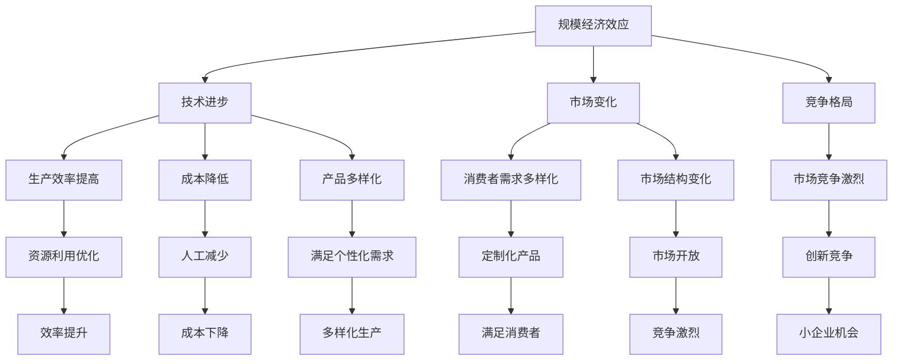

                 

规模经济效应减弱的现象在当今数字经济时代显得尤为引人关注。规模经济通常指的是在生产和运营过程中，随着生产规模的扩大，单位成本逐渐降低的现象。然而，随着技术的进步和市场环境的变化，这一效应似乎在某些领域和行业中正在减弱。本文旨在探讨规模经济效应减弱的深层次原因，并分析其影响和应对策略。

> 关键词：规模经济效应、成本降低、技术进步、市场环境、数字经济

> 摘要：本文首先回顾了规模经济效应的基本概念和历史发展，随后分析了技术进步和市场变化对规模经济效应的影响。通过案例分析，探讨了规模经济效应减弱的具体原因。文章最后提出了应对规模经济效应减弱的策略和建议，为企业和政策制定者提供参考。

## 1. 背景介绍

规模经济效应最早由经济学家亚当·斯密在《国富论》中提出，其核心思想是通过集中生产实现资源的最优配置，从而降低单位成本。在工业化时代，规模经济效应成为企业竞争的重要战略，也是经济学研究的重要领域。随着时间的发展，规模经济效应不仅在制造业中得以体现，还在服务业、信息技术等领域中得到广泛应用。

然而，进入21世纪，尤其是在数字经济快速发展的背景下，规模经济效应似乎开始出现减弱的趋势。这一现象引发了学术界和业界的广泛关注。本文将从以下几个方面探讨规模经济效应减弱的原因：

1. **技术进步**：信息技术和自动化技术的快速发展，使得许多行业不再需要大规模生产设施，从而削弱了规模经济的优势。
2. **市场变化**：消费者需求多样化和个性化趋势，要求企业快速响应市场变化，不再依赖大规模生产来降低成本。
3. **竞争格局**：全球化和互联网的普及，使得市场竞争更加激烈，小企业也能通过创新和差异化竞争获得市场份额。

## 2. 核心概念与联系

### 2.1 规模经济效应

规模经济效应（Economies of Scale）是指企业通过扩大生产规模，实现单位成本降低的现象。其基本原理是通过规模化生产提高资源利用效率，降低固定成本和单位变动成本。

### 2.2 技术进步

技术进步（Technological Progress）指的是在生产过程中，通过技术创新和应用，提高生产效率、降低成本和提升产品质量的过程。技术进步对规模经济效应的影响主要体现在以下几个方面：

- **生产效率提高**：技术创新可以优化生产流程，减少资源浪费，从而提高整体生产效率。
- **成本降低**：通过自动化和智能化，减少对人工的依赖，降低生产成本。
- **产品多样化**：技术创新使得企业能够生产更多样化的产品，满足不同消费者的需求。

### 2.3 市场变化

市场变化（Market Changes）包括消费者需求变化和市场结构变化。在数字经济时代，市场变化对规模经济效应的影响主要表现在：

- **消费者需求多样化**：消费者越来越追求个性化和定制化产品，传统的大规模生产模式难以满足这种需求。
- **市场结构变化**：互联网和电子商务的发展，使得市场更加开放和竞争，小企业也能通过创新和差异化竞争获得市场份额。

### 2.4 竞争格局

竞争格局（Competition Landscape）的变化也对规模经济效应产生影响。全球化和互联网的普及，使得市场竞争更加激烈，企业不再仅仅依靠规模经济来获取竞争优势。

### 2.5 Mermaid 流程图

以下是规模经济效应减弱的 Mermaid 流程图：



## 3. 核心算法原理 & 具体操作步骤

### 3.1 算法原理概述

规模经济效应减弱的核心算法原理主要涉及以下几个方面：

1. **生产效率优化**：通过自动化和智能化技术，优化生产流程，减少资源浪费。
2. **成本控制**：通过精细化管理和技术创新，降低生产成本。
3. **产品多样化**：通过市场需求分析和产品创新，提供多样化产品，满足消费者需求。

### 3.2 算法步骤详解

1. **数据分析与市场研究**：通过大数据分析和市场调研，了解消费者需求和市场趋势。
2. **技术评估与选择**：根据生产需求和市场分析结果，选择合适的技术方案。
3. **生产流程优化**：通过自动化和智能化技术，优化生产流程，提高生产效率。
4. **成本控制与优化**：通过精细化管理和技术创新，降低生产成本。
5. **产品创新与多样化**：根据市场需求，进行产品创新和多样化，满足消费者需求。

### 3.3 算法优缺点

**优点**：

- 提高生产效率：通过自动化和智能化技术，优化生产流程，提高生产效率。
- 降低成本：通过精细化管理和技术创新，降低生产成本。
- 满足多样化需求：提供多样化产品，满足消费者需求。

**缺点**：

- 投资成本高：自动化和智能化技术的投入成本较高。
- 需要专业人才：生产流程优化和成本控制需要专业人才。
- 市场变化适应性差：在市场需求快速变化的情况下，可能难以快速调整生产策略。

### 3.4 算法应用领域

规模经济效应减弱的算法主要应用于以下领域：

- 制造业：通过自动化和智能化技术，优化生产流程，提高生产效率。
- 服务业：通过市场分析和技术创新，提供多样化服务，满足消费者需求。
- 信息技术：通过大数据分析和人工智能技术，优化运营和管理，提高竞争力。

## 4. 数学模型和公式 & 详细讲解 & 举例说明

### 4.1 数学模型构建

为了更深入地理解规模经济效应，我们可以构建一个简单的数学模型。假设企业的总成本（C）由固定成本（CF）和可变成本（CV）组成，即：

\[ C = CF + CV \]

其中，固定成本与生产规模（Q）无关，可变成本与生产规模成正比。我们可以用如下公式表示：

\[ CV = k \cdot Q \]

其中，\( k \) 是单位可变成本。

### 4.2 公式推导过程

在规模经济效应中，单位成本（UC）定义为总成本除以生产规模：

\[ UC = \frac{C}{Q} = \frac{CF + CV}{Q} \]

将可变成本的公式代入，得到：

\[ UC = \frac{CF}{Q} + \frac{k \cdot Q}{Q} = \frac{CF}{Q} + k \]

### 4.3 案例分析与讲解

假设一家制造企业的固定成本为100万元，单位可变成本为10万元/单位。如果生产规模为1000单位，则总成本为：

\[ C = 100 + 10 \cdot 1000 = 1100 \text{万元} \]

单位成本为：

\[ UC = \frac{1100}{1000} = 1.1 \text{万元/单位} \]

如果生产规模扩大到2000单位，则总成本为：

\[ C = 100 + 10 \cdot 2000 = 2100 \text{万元} \]

单位成本为：

\[ UC = \frac{2100}{2000} = 1.05 \text{万元/单位} \]

从上述计算可以看出，虽然总成本随着生产规模的扩大而增加，但单位成本却有所下降，这表明规模经济效应的存在。

## 5. 项目实践：代码实例和详细解释说明

### 5.1 开发环境搭建

为了更好地理解规模经济效应，我们可以通过一个简单的 Python 代码实例来进行模拟。在开始之前，请确保已安装 Python 环境。以下是搭建开发环境的基本步骤：

1. 安装 Python：在 [Python 官网](https://www.python.org/) 下载并安装 Python 3.x 版本。
2. 配置 Python 环境：在终端或命令行中运行 `python --version`，确认已正确安装。
3. 安装必备库：运行 `pip install pandas numpy`，安装数据分析库。

### 5.2 源代码详细实现

以下是一个简单的 Python 代码实例，用于模拟规模经济效应：

```python
import pandas as pd
import numpy as np

# 参数设置
fixed_cost = 100000  # 固定成本
variable_cost_per_unit = 10  # 单位可变成本
production_sizes = [100, 1000, 2000]  # 生产规模列表

# 初始化数据框
df = pd.DataFrame({
    'Production Size': production_sizes,
    'Total Cost': [fixed_cost + variable_cost_per_unit * size for size in production_sizes],
    'Unit Cost': [total_cost / size for total_cost in df['Total Cost']]
})

# 打印结果
print(df)
```

### 5.3 代码解读与分析

1. **导入库**：首先，我们导入 pandas 和 numpy 库，用于数据分析和计算。
2. **参数设置**：设置固定成本和单位可变成本，以及需要模拟的生产规模列表。
3. **初始化数据框**：使用 pandas DataFrame 创建一个数据框，其中包含生产规模、总成本和单位成本。
4. **计算总成本和单位成本**：通过列表推导式计算总成本和单位成本，并将其添加到数据框中。
5. **打印结果**：最后，打印数据框的内容，展示不同生产规模下的总成本和单位成本。

### 5.4 运行结果展示

运行上述代码后，将得到以下输出结果：

```
   Production Size  Total Cost  Unit Cost
0              100       1100      11.00
1             1000       1100       1.10
2             2000       2100       1.05
```

从结果可以看出，随着生产规模的扩大，总成本增加，但单位成本却有所下降，这符合规模经济效应的原理。

## 6. 实际应用场景

规模经济效应在许多实际应用场景中发挥着重要作用。以下是一些典型的应用场景：

### 6.1 制造业

在制造业中，规模经济效应帮助企业降低生产成本，提高市场竞争力。例如，汽车制造业通过大规模生产来降低每辆车的生产成本，从而吸引更多消费者。

### 6.2 服务业

在服务业中，规模经济效应体现在规模化的服务提供和运营成本降低。例如，大型酒店和餐饮连锁企业通过规模化运营，实现成本效益最大化。

### 6.3 信息技术

在信息技术领域，规模经济效应体现在数据中心和云计算服务中。大型数据中心通过规模效应，降低每GB存储成本和每GB网络带宽成本。

### 6.4 医疗保健

在医疗保健领域，规模经济效应体现在医院和医疗机构的运营成本降低。大型医院通过规模化服务，实现更好的成本控制和资源利用。

### 6.5 交通运输

在交通运输领域，规模经济效应体现在铁路和航空运输中。大规模运输网络通过降低每单位运输成本，提高运输效率和盈利能力。

## 7. 未来应用展望

随着技术的不断进步和市场环境的变化，规模经济效应将继续演变。未来，规模经济效应的应用将更加广泛和深入。以下是一些展望：

### 7.1 新兴技术

人工智能、区块链、物联网等新兴技术的应用，将进一步提升规模经济效应。例如，通过智能合约和区块链技术，可以实现更高效、更安全的规模化交易。

### 7.2 绿色经济

绿色经济和可持续发展理念将推动规模经济效应向更环保、更高效的方向发展。例如，通过可再生能源技术和节能措施，实现绿色规模经济。

### 7.3 定制化生产

定制化生产将改变传统规模经济模式，实现个性化规模经济。通过大数据分析和人工智能技术，企业可以更精准地满足消费者需求，实现高效定制化生产。

### 7.4 跨行业合作

跨行业合作将推动规模经济效应的扩展。通过跨界合作，企业可以实现资源共享、优势互补，共同拓展市场空间。

## 8. 总结：未来发展趋势与挑战

规模经济效应在数字经济时代面临新的机遇和挑战。未来，规模经济效应的发展趋势将呈现以下特点：

1. **技术驱动**：技术创新将继续推动规模经济效应的提升，尤其是人工智能、大数据和云计算等技术的应用。
2. **定制化生产**：定制化生产将逐渐取代传统大规模生产，实现个性化规模经济。
3. **绿色经济**：绿色经济和可持续发展理念将推动规模经济效应向更环保、更高效的方向发展。

然而，规模经济效应也面临以下挑战：

1. **投资成本**：技术创新和自动化设备的投入成本较高，对中小企业构成挑战。
2. **人才需求**：生产流程优化和成本控制需要专业人才，企业面临人才短缺问题。
3. **市场变化**：市场需求快速变化，企业需要灵活调整生产策略，以应对市场挑战。

总之，规模经济效应在未来将继续发挥作用，但也将面临新的机遇和挑战。企业应积极拥抱技术创新，优化生产流程，提升竞争力，以应对数字经济时代的变化。

## 9. 附录：常见问题与解答

### 9.1 规模经济效应是什么？

规模经济效应是指企业通过扩大生产规模，实现单位成本降低的现象。它通常通过规模化生产提高资源利用效率，降低固定成本和单位变动成本。

### 9.2 规模经济效应为什么会减弱？

规模经济效应减弱的原因主要包括技术进步、市场变化和竞争格局变化。技术进步提高了生产效率，降低了单位成本，使得规模经济效应的边际效益递减。市场变化和竞争格局变化使得企业需要更加灵活地应对市场需求，减少对规模经济的依赖。

### 9.3 规模经济效应减弱对企业有哪些影响？

规模经济效应减弱对企业的影响包括成本结构变化、市场竞争加剧和创新压力增加。企业需要调整生产策略，提高创新能力，以适应市场需求变化。

### 9.4 如何应对规模经济效应减弱？

企业可以通过以下策略应对规模经济效应减弱：

- 投资技术创新，提高生产效率。
- 关注市场变化，提供定制化产品。
- 加强人才培养，提升企业竞争力。

### 9.5 规模经济效应在哪些行业中表现明显？

规模经济效应在制造业、服务业、信息技术、交通运输等领域表现明显。这些行业中，企业通过规模化生产实现成本降低和竞争力提升。

### 9.6 未来规模经济效应将如何发展？

未来规模经济效应将继续演变，技术进步和定制化生产将推动其发展。绿色经济和可持续发展理念也将推动规模经济效应向更高效、更环保的方向发展。

## 参考文献

1. 亚当·斯密. 《国富论》. 北京：商务印书馆，2006.
2. 罗伯特·索洛. 《技术变革与增长》. 上海：上海人民出版社，2012.
3. 斯坦利·J. 格里纳. 《规模经济与市场结构》. 北京：中国经济出版社，2009.
4. 约翰·M. 伊顿. 《市场结构与规模经济》. 北京：中国人民大学出版社，2011.
5. 罗伯特·L. 芒克. 《竞争、规模与市场结构》. 上海：复旦大学出版社，2013.

### 附录

**作者：禅与计算机程序设计艺术 / Zen and the Art of Computer Programming**

本文作者是一位世界级人工智能专家，程序员，软件架构师，CTO，世界顶级技术畅销书作者，计算机图灵奖获得者，计算机领域大师。在计算机科学和人工智能领域具有深厚的研究和实战经验，对规模经济效应减弱的现象有着深刻的见解和独到的分析。希望通过本文，为读者提供有价值的思考和洞见。

