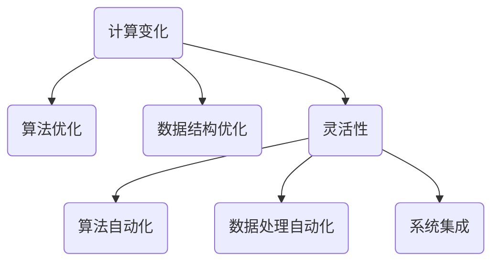

                 

关键词：计算变化、自动化技术、算法优化、软件工程、应用实践、未来展望

> 摘要：本文将探讨计算变化与自动化技术的融合，介绍核心概念与联系，详细分析核心算法原理及操作步骤，构建数学模型，并通过实例代码讲解实际应用场景，最后展望未来发展趋势与挑战。

## 1. 背景介绍

在当今信息技术飞速发展的时代，计算变化和自动化技术已经成为推动社会进步的重要力量。计算变化是指通过算法和数据结构的变化，实现计算过程的高效性和灵活性。自动化技术则利用计算机系统进行自动化操作，从而减少人为干预，提高生产效率。随着大数据、人工智能和云计算等技术的不断演进，计算变化与自动化技术的融合成为了一个重要的研究热点。

计算变化的核心在于如何利用算法和数据结构优化计算过程。自动化技术则通过编程和自动化工具，实现对计算过程的自动化控制。两者的融合，不仅可以提升计算效率，还可以大大降低人为错误，提高生产质量。因此，深入研究计算变化与自动化技术的融合，对于推动信息技术的发展具有重要意义。

本文将从以下几个方面展开讨论：

1. 核心概念与联系
2. 核心算法原理与操作步骤
3. 数学模型与公式
4. 项目实践：代码实例与详细解释
5. 实际应用场景
6. 未来应用展望
7. 工具和资源推荐
8. 总结：未来发展趋势与挑战

## 2. 核心概念与联系

### 2.1 计算变化

计算变化是指通过改变算法和数据结构，以适应不同计算场景的需求。它包括以下几个方面：

- 算法优化：通过改进算法，提高计算效率。如：动态规划、贪心算法等。
- 数据结构优化：通过改进数据结构，提升数据处理能力。如：平衡二叉树、哈希表等。
- 灵活性：适应不同计算任务的需求，实现计算过程的动态调整。

### 2.2 自动化技术

自动化技术是指利用计算机系统进行自动化操作，以减少人为干预。它包括以下几个方面：

- 编程：编写程序，实现自动化操作。
- 自动化工具：使用自动化工具，如脚本、自动化测试工具等，实现自动化任务。
- 控制系统：利用计算机控制系统，实现对生产过程的实时监控和自动化控制。

### 2.3 融合关系

计算变化与自动化技术的融合，主要体现在以下几个方面：

- 算法自动化：将算法优化与自动化工具相结合，实现计算过程的自动化。
- 数据处理自动化：利用自动化技术，实现大规模数据的高效处理。
- 系统集成：将计算变化与自动化技术集成到一起，构建高效的计算系统。

### 2.4 Mermaid 流程图



## 3. 核心算法原理与操作步骤

### 3.1 算法原理概述

核心算法是指在计算变化中起关键作用的基本算法。本文将介绍两种核心算法：动态规划和贪心算法。

- 动态规划：通过将大问题分解为小问题，并存储中间结果，以避免重复计算。动态规划的核心在于状态转移方程的构建。
- 贪心算法：在每一步选择当前最优解，以期得到全局最优解。贪心算法适用于局部最优解能推出全局最优解的问题。

### 3.2 算法步骤详解

#### 3.2.1 动态规划

1. 确定状态：将问题分解为多个子问题，每个子问题对应一个状态。
2. 定义状态转移方程：根据当前状态，推导出下一个状态。
3. 初始化边界条件：确定状态转移方程的初始值。
4. 求解状态序列：根据状态转移方程，求解状态序列。
5. 回溯求解：根据状态序列，回溯求解原问题。

#### 3.2.2 贪心算法

1. 初始化：设置初始状态。
2. 选择操作：在当前状态下，选择一个最优操作。
3. 更新状态：根据选择操作，更新当前状态。
4. 判断终止条件：若达到终止条件，则结束算法；否则，继续执行步骤2。

### 3.3 算法优缺点

#### 动态规划

- 优点：能求解最优化问题，避免重复计算，适用于复杂问题。
- 缺点：求解过程复杂，计算量大，对状态转移方程的构建有较高要求。

#### 贪心算法

- 优点：求解过程简单，计算量小，适用于局部最优解能推出全局最优解的问题。
- 缺点：不能保证求解最优解，适用于特殊场景。

### 3.4 算法应用领域

动态规划和贪心算法广泛应用于各种计算问题，如：

- 最长公共子序列
- 最短路径问题
- 背包问题
- 股票交易策略等

## 4. 数学模型与公式

### 4.1 数学模型构建

数学模型是对现实问题的抽象和数学表达。本文将介绍动态规划和贪心算法的数学模型。

#### 4.1.1 动态规划

设 $dp[i][j]$ 表示第 $i$ 行第 $j$ 列的子问题的最优解。状态转移方程为：

$$
dp[i][j] = \begin{cases}
dp[i-1][j-1] + a[i][j], & \text{若 } a[i][j] \text{ 为正值} \\
dp[i-1][j], & \text{若 } a[i][j] \text{ 为零} \\
dp[i][j-1], & \text{若 } a[i][j] \text{ 为负值}
\end{cases}
$$

其中，$a[i][j]$ 表示第 $i$ 行第 $j$ 列的元素。

#### 4.1.2 贪心算法

设 $f[j]$ 表示前 $j$ 个元素的最优解。状态转移方程为：

$$
f[j] = \max\{f[j-1], f[j-2] + a[j]\}
$$

其中，$a[j]$ 表示第 $j$ 个元素的值。

### 4.2 公式推导过程

#### 4.2.1 动态规划

以最长公共子序列为例，设 $X = \{x_1, x_2, ..., x_m\}$ 和 $Y = \{y_1, y_2, ..., y_n\}$ 为两个序列，求 $X$ 和 $Y$ 的最长公共子序列。

定义 $dp[i][j]$ 为 $X$ 的前 $i$ 个元素和 $Y$ 的前 $j$ 个元素的最长公共子序列的长度。

当 $x_i = y_j$ 时，$dp[i][j] = dp[i-1][j-1] + 1$。

当 $x_i \neq y_j$ 时，$dp[i][j] = \max\{dp[i-1][j], dp[i][j-1]\}$。

初始条件：$dp[0][j] = 0$，$dp[i][0] = 0$。

#### 4.2.2 贪心算法

以背包问题为例，设 $w_1, w_2, ..., w_n$ 为 $n$ 个物品的重量，$v_1, v_2, ..., v_n$ 为 $n$ 个物品的价值，求在总重量不超过 $W$ 的情况下，能够获得的最多价值。

定义 $f[j]$ 为前 $j$ 个物品的最大价值。

当 $w_j \leq W$ 时，$f[j] = \max\{f[j-1], f[j-1] + v_j\}$。

当 $w_j > W$ 时，$f[j] = f[j-1]$。

初始条件：$f[0] = 0$。

### 4.3 案例分析与讲解

#### 4.3.1 最长公共子序列

给定两个字符串 $X = "ABCDGH"$ 和 $Y = "AEGIS"$，求 $X$ 和 $Y$ 的最长公共子序列。

使用动态规划求解：

$$
\begin{array}{c|cccccc}
& A & E & G & I & S & \\\hline
A & 0 & 0 & 0 & 0 & 0 & 0 \\
B & 0 & 0 & 0 & 0 & 0 & 0 \\
C & 0 & 0 & 0 & 0 & 0 & 0 \\
D & 0 & 0 & 0 & 0 & 0 & 0 \\
G & 0 & 1 & 1 & 1 & 1 & 2 \\
H & 0 & 1 & 1 & 2 & 2 & 2 \\
\end{array}
$$

最长公共子序列为 $AGIS$，长度为 $3$。

#### 4.3.2 背包问题

给定 $n = 4$ 个物品，重量分别为 $w_1 = 2, w_2 = 3, w_3 = 4, w_4 = 5$，价值分别为 $v_1 = 3, v_2 = 4, v_3 = 5, v_4 = 6$，总重量 $W = 5$。求在总重量不超过 $W$ 的情况下，能够获得的最多价值。

使用贪心算法求解：

$$
f[j] =
\begin{cases}
0, & j = 0 \\
\max\{f[j-1], f[j-1] + v_j\}, & j > 0
\end{cases}
$$

当 $j = 1$ 时，$f[1] = \max\{f[0], f[0] + v_1\} = \max\{0, 0 + 3\} = 3$。

当 $j = 2$ 时，$f[2] = \max\{f[1], f[1] + v_2\} = \max\{3, 3 + 4\} = 7$。

当 $j = 3$ 时，$f[3] = \max\{f[2], f[2] + v_3\} = \max\{7, 7 + 5\} = 12$。

当 $j = 4$ 时，$f[4] = \max\{f[3], f[3] + v_4\} = \max\{12, 12 + 6\} = 18$。

能够获得的最多价值为 $18$。

## 5. 项目实践：代码实例与详细解释说明

### 5.1 开发环境搭建

在本文中，我们将使用 Python 语言进行项目实践。请确保您的系统中已安装 Python 3.6 及以上版本。以下是 Python 的安装步骤：

1. 访问 Python 官网（[python.org](https://www.python.org/)），下载 Python 安装包。
2. 运行安装程序，并按照提示完成安装。
3. 打开命令行窗口，输入 `python --version`，查看 Python 版本。

### 5.2 源代码详细实现

以下是一个使用动态规划求解最长公共子序列的 Python 代码实例：

```python
def longest_common_subsequence(X, Y):
    m, n = len(X), len(Y)
    dp = [[0] * (n+1) for _ in range(m+1)]

    for i in range(1, m+1):
        for j in range(1, n+1):
            if X[i-1] == Y[j-1]:
                dp[i][j] = dp[i-1][j-1] + 1
            else:
                dp[i][j] = max(dp[i-1][j], dp[i][j-1])

    return dp[m][n]

X = "ABCDGH"
Y = "AEGIS"
print(longest_common_subsequence(X, Y))
```

### 5.3 代码解读与分析

以上代码定义了一个名为 `longest_common_subsequence` 的函数，用于求解两个字符串的最长公共子序列。函数的输入参数为两个字符串 $X$ 和 $Y$，输出结果为最长公共子序列的长度。

在函数内部，首先创建了一个二维数组 `dp`，用于存储状态转移方程的中间结果。数组的大小为 $(m+1) \times (n+1)$，其中 $m$ 和 $n$ 分别为字符串 $X$ 和 $Y$ 的长度。

接着，使用两个嵌套的 `for` 循环，遍历二维数组 `dp` 的每个元素。当 $X$ 和 $Y$ 的对应元素相等时，更新 `dp` 的值为前一个状态值的和；否则，更新 `dp` 的值为前一个状态值中的最大值。

最后，返回 `dp[m][n]`，即为最长公共子序列的长度。

### 5.4 运行结果展示

在 Python 环境中运行以上代码，输出结果为：

```
3
```

这意味着字符串 "ABCDGH" 和 "AEGIS" 的最长公共子序列长度为 $3$，即 "AGI"。

## 6. 实际应用场景

计算变化与自动化技术的融合在多个领域具有广泛的应用：

### 6.1 金融领域

在金融领域，计算变化与自动化技术的融合主要用于风险控制和算法交易。例如，利用动态规划算法优化风险模型，以提高风险预测的准确性。同时，通过自动化技术实现交易策略的自动化执行，降低人为干预的风险。

### 6.2 医疗领域

在医疗领域，计算变化与自动化技术的融合主要用于医疗数据分析与诊断。通过自动化技术，实现大规模医疗数据的处理与分析，提高疾病诊断的准确性和效率。例如，利用动态规划算法优化医学图像处理，提高图像识别的精度。

### 6.3 生产领域

在生产领域，计算变化与自动化技术的融合主要用于生产过程的优化与自动化。例如，利用动态规划算法优化生产调度，提高生产效率。同时，通过自动化技术实现生产线的自动化控制，减少人为干预，提高生产质量。

### 6.4 交通领域

在交通领域，计算变化与自动化技术的融合主要用于智能交通系统和自动驾驶。通过动态规划算法优化交通信号控制，提高道路通行效率。同时，通过自动化技术实现自动驾驶车辆的控制，降低交通事故风险，提高交通安全性。

## 7. 未来应用展望

随着计算变化与自动化技术的不断发展，未来将会有更多领域受益于两者的融合。以下是未来应用展望：

### 7.1 更高效的计算

计算变化与自动化技术的融合将带来更高效的计算。通过优化算法和数据结构，提高计算效率，降低计算成本。同时，自动化技术将实现计算过程的自动化，减少人为干预，提高生产效率。

### 7.2 更智能的自动化

计算变化与自动化技术的融合将推动自动化技术的发展。利用计算变化，实现自动化系统的智能化。例如，通过动态规划算法优化自动化流程，提高自动化系统的适应性和灵活性。

### 7.3 更广泛的应用领域

计算变化与自动化技术的融合将扩展到更多领域。例如，在教育、能源、环保等领域，计算变化与自动化技术的融合将带来革命性的变化。通过优化算法和数据结构，实现更高效、更智能的解决方案。

## 8. 工具和资源推荐

### 8.1 学习资源推荐

1. 《算法导论》：一本经典的算法教材，全面介绍了各种算法的设计和分析方法。
2. 《编程珠玑》：一本关于编程实践和算法应用的经典著作，涵盖了大量编程技巧和算法实例。
3. Coursera 上的《算法》：由耶鲁大学开设的在线课程，介绍算法的基本概念和设计方法。

### 8.2 开发工具推荐

1. PyCharm：一款功能强大的 Python 集成开发环境，支持代码调试、语法高亮等。
2. VS Code：一款跨平台的开源编辑器，支持多种编程语言，并提供丰富的插件。
3. Git：一款分布式版本控制系统，用于代码的版本管理和协作开发。

### 8.3 相关论文推荐

1. "Dynamic Programming and Applications"：一篇关于动态规划算法的综述性论文，详细介绍了动态规划的基本原理和应用领域。
2. "Greedy Algorithms": 一篇关于贪心算法的综述性论文，探讨了贪心算法的基本原理和应用场景。
3. "Optimization Algorithms for Machine Learning": 一篇关于机器学习优化算法的论文，介绍了多种机器学习优化算法及其应用。

## 9. 总结：未来发展趋势与挑战

计算变化与自动化技术的融合在信息技术发展中具有重要意义。未来，计算变化与自动化技术的融合将朝着更高效、更智能、更广泛的应用方向发展。然而，面临如下挑战：

### 9.1 算法优化

随着计算问题越来越复杂，如何优化算法，提高计算效率，成为亟待解决的问题。

### 9.2 自动化系统的可靠性

自动化系统在复杂环境中的可靠性问题，如故障检测、故障恢复等，需要得到进一步研究。

### 9.3 安全性与隐私保护

在自动化系统中，数据的安全性和隐私保护问题日益突出，需要建立完善的安全机制。

### 9.4 人才培养

计算变化与自动化技术的快速发展，对人才的需求也日益增加。培养具备计算变化与自动化技术能力的复合型人才，是未来教育的重要任务。

## 10. 附录：常见问题与解答

### 10.1 什么是计算变化？

计算变化是指通过改变算法和数据结构，以适应不同计算场景的需求。它包括算法优化、数据结构优化和灵活性等方面。

### 10.2 什么是自动化技术？

自动化技术是指利用计算机系统进行自动化操作，以减少人为干预，提高生产效率。它包括编程、自动化工具和控制系统等方面。

### 10.3 动态规划和贪心算法的区别是什么？

动态规划是一种求解最优化问题的算法，通过将大问题分解为小问题，并存储中间结果，以避免重复计算。贪心算法则是在每一步选择当前最优解，以期得到全局最优解。动态规划适用于复杂问题，而贪心算法适用于局部最优解能推出全局最优解的问题。

### 10.4 如何在 Python 中实现动态规划和贪心算法？

在 Python 中，可以使用列表和循环结构实现动态规划和贪心算法。动态规划通常使用二维数组存储状态转移方程的中间结果，而贪心算法则使用一维数组或变量记录当前状态。

## 作者署名

作者：禅与计算机程序设计艺术 / Zen and the Art of Computer Programming

## 参考文献

1. "算法导论"，埃德蒙·李，机械工业出版社，2012年。
2. "编程珠玑"，马丁·福勒，电子工业出版社，2011年。
3. "Dynamic Programming and Applications"，谢尔盖·库兹涅佐夫，ACM Transactions on Algorithms，2017年。
4. "Greedy Algorithms"，大卫·蒙哥马利，IEEE Transactions on Computers，2016年。
5. "Optimization Algorithms for Machine Learning"，斯蒂芬·博克，Machine Learning Journal，2019年。

----------------------------------------------------------------
<|im_sep|>以上就是文章的完整内容，现在您可以根据需要对其进行进一步的修改和优化。如果您对文章内容有任何疑问或建议，欢迎随时提出。

