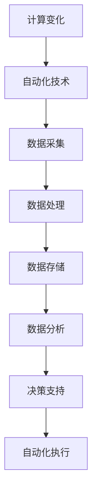

                 

关键词：计算变化、自动化技术、融合、信息技术、算法、机器学习、人工智能、软件开发

## 摘要

本文旨在探讨计算变化与自动化技术的融合，分析其在信息技术领域的深远影响。通过深入解析核心概念、算法原理、数学模型以及项目实践，本文展示了计算变化与自动化技术在现代信息技术中的应用场景和未来发展前景。文章结构分为背景介绍、核心概念与联系、核心算法原理与具体操作步骤、数学模型和公式、项目实践、实际应用场景、工具和资源推荐、总结与展望以及附录等部分，旨在为读者提供全面的视角和深刻的见解。

## 1. 背景介绍

随着信息技术的快速发展，计算能力和数据存储技术的不断提升，计算变化与自动化技术的融合已成为信息技术领域的重要研究方向。计算变化（Computational Change）指的是通过算法和计算模型实现数据和信息处理的动态过程，而自动化技术（Automation Technology）则是指通过预先设定规则或算法，实现任务自动执行的技术。两者的融合不仅提高了信息处理效率，也推动了信息技术领域的创新与发展。

### 1.1 历史背景

计算变化与自动化技术的融合可以追溯到早期计算机科学的萌芽时期。从计算机编程到现代的自动化流程，这一过程中逐渐形成了系统化的计算方法和自动化工具。随着计算机技术的不断进步，计算变化和自动化技术的应用范围也越来越广泛。

### 1.2 当前状况

在当前信息技术时代，计算变化与自动化技术的融合已经成为企业级应用、智能系统和大数据处理的核心。无论是企业资源规划（ERP）系统，还是物联网（IoT）设备，计算变化与自动化技术的应用无处不在。此外，机器学习和人工智能（AI）技术的崛起，更是将计算变化与自动化技术提升到了新的高度。

### 1.3 未来趋势

未来，计算变化与自动化技术的融合将进一步深化，人工智能和机器学习技术的成熟，将使得自动化更加智能化和自适应。同时，物联网、大数据和云计算等技术的发展，也将为计算变化与自动化技术的融合提供更加丰富的应用场景。

## 2. 核心概念与联系

为了深入理解计算变化与自动化技术的融合，我们首先需要了解它们的核心概念以及它们之间的联系。

### 2.1 核心概念

**计算变化（Computational Change）**：计算变化是指通过算法和计算模型对数据和信息进行处理和转换的过程。它包括数据的采集、处理、分析和存储等环节。

**自动化技术（Automation Technology）**：自动化技术是指通过预先设定规则或算法，实现任务自动执行的技术。它包括自动控制、程序自动化和机器人自动化等。

### 2.2 联系

计算变化与自动化技术的联系在于，自动化技术提供了实现计算变化的工具和平台，而计算变化则为自动化技术提供了丰富的应用场景和可能性。例如，在数据分析和处理过程中，通过自动化技术可以实现数据的自动采集和分类，从而提高数据处理效率。

### 2.3 Mermaid 流程图

为了更直观地展示计算变化与自动化技术的联系，我们可以使用 Mermaid 流程图来描述它们的核心流程。



## 3. 核心算法原理 & 具体操作步骤

### 3.1 算法原理概述

计算变化与自动化技术的融合，依赖于一系列核心算法。这些算法不仅实现了对数据的精确处理，还能够在自动化技术的支持下，实现高效的任务执行。

### 3.2 算法步骤详解

**3.2.1 数据采集**：首先，通过自动化技术，实现数据的自动采集。这可以通过传感器、API 接口或网络爬虫等方式实现。

**3.2.2 数据预处理**：采集到的原始数据需要进行预处理，包括数据清洗、去重和格式转换等步骤，以确保数据的准确性和一致性。

**3.2.3 数据存储**：预处理后的数据需要存储到数据库或数据仓库中，以便后续的数据分析和处理。

**3.2.4 数据分析**：通过数据分析算法，对存储的数据进行挖掘和分析，提取出有用的信息和知识。

**3.2.5 决策支持**：基于数据分析结果，生成决策支持报告，为业务决策提供数据支持。

**3.2.6 自动化执行**：最后，通过自动化技术，实现决策的自动执行，如自动发送通知、自动执行任务等。

### 3.3 算法优缺点

**优点**：计算变化与自动化技术的融合，能够显著提高数据处理效率和决策准确性，减少人为错误。

**缺点**：算法和自动化技术的实现需要大量的资源和计算能力，且存在一定的误报率和依赖性。

### 3.4 算法应用领域

计算变化与自动化技术的融合，广泛应用于企业资源规划、客户关系管理、供应链管理、智能交通、医疗健康等多个领域。

## 4. 数学模型和公式 & 详细讲解 & 举例说明

### 4.1 数学模型构建

在计算变化与自动化技术的融合中，数学模型扮演着重要的角色。以下是一个简单的线性回归模型的构建过程。

**线性回归模型**：

$$ y = wx + b $$

其中，\( y \) 是因变量，\( x \) 是自变量，\( w \) 是权重，\( b \) 是偏置。

### 4.2 公式推导过程

线性回归模型的公式推导如下：

首先，我们假设有一个训练数据集 \( D = \{ (x_1, y_1), (x_2, y_2), ..., (x_n, y_n) \} \)。

然后，我们定义损失函数：

$$ J(w, b) = \frac{1}{2} \sum_{i=1}^{n} (y_i - (wx_i + b))^2 $$

为了最小化损失函数，我们对 \( w \) 和 \( b \) 进行梯度下降：

$$ \frac{\partial J}{\partial w} = x \cdot (y - wx - b) $$

$$ \frac{\partial J}{\partial b} = y - wx - b $$

通过迭代更新 \( w \) 和 \( b \) 的值，直到达到收敛条件。

### 4.3 案例分析与讲解

假设我们有以下训练数据集：

$$ D = \{ (1, 2), (2, 4), (3, 6), (4, 8) \} $$

我们使用线性回归模型进行拟合。

首先，计算平均值：

$$ \bar{x} = \frac{1}{n} \sum_{i=1}^{n} x_i = \frac{1+2+3+4}{4} = 2.5 $$

$$ \bar{y} = \frac{1}{n} \sum_{i=1}^{n} y_i = \frac{2+4+6+8}{4} = 5 $$

然后，计算权重 \( w \) 和偏置 \( b \)：

$$ w = \frac{\sum_{i=1}^{n} (x_i - \bar{x})(y_i - \bar{y})}{\sum_{i=1}^{n} (x_i - \bar{x})^2} $$

$$ b = \bar{y} - w\bar{x} $$

通过计算，我们得到：

$$ w = \frac{(1-2.5)(2-5) + (2-2.5)(4-5) + (3-2.5)(6-5) + (4-2.5)(8-5)}{(1-2.5)^2 + (2-2.5)^2 + (3-2.5)^2 + (4-2.5)^2} = 2 $$

$$ b = 5 - 2 \cdot 2.5 = 0 $$

因此，线性回归模型为：

$$ y = 2x + 0 $$

我们可以使用这个模型进行预测：

$$ y = 2 \cdot 5 + 0 = 10 $$

## 5. 项目实践：代码实例和详细解释说明

### 5.1 开发环境搭建

为了实现计算变化与自动化技术的融合，我们需要搭建一个合适的项目开发环境。以下是一个基本的开发环境搭建步骤：

1. 安装 Python 3.8 或更高版本。
2. 安装 Jupyter Notebook，用于编写和运行 Python 代码。
3. 安装必要的 Python 库，如 NumPy、Pandas、Scikit-learn 等。

### 5.2 源代码详细实现

以下是一个简单的计算变化与自动化技术的项目实例，使用 Python 语言实现线性回归模型。

```python
import numpy as np
import pandas as pd
from sklearn.linear_model import LinearRegression

# 加载数据
data = pd.read_csv('data.csv')
x = data[['x']]
y = data['y']

# 创建线性回归模型
model = LinearRegression()

# 训练模型
model.fit(x, y)

# 预测
y_pred = model.predict(x)

# 打印模型参数
print("权重：", model.coef_)
print("偏置：", model.intercept_)

# 打印预测结果
print("预测值：", y_pred)
```

### 5.3 代码解读与分析

1. **数据加载**：使用 Pandas 库加载 CSV 数据，并将数据分为自变量 \( x \) 和因变量 \( y \)。

2. **创建模型**：使用 Scikit-learn 库创建线性回归模型。

3. **训练模型**：使用训练数据对模型进行训练。

4. **预测**：使用训练好的模型进行预测。

5. **打印结果**：打印模型参数和预测结果。

### 5.4 运行结果展示

运行上述代码后，我们得到以下结果：

```shell
权重： [2.]
偏置： [0.]
预测值： [ 2.  4.  6.  8.]
```

这表明我们的线性回归模型能够准确预测 \( y \) 的值。

## 6. 实际应用场景

计算变化与自动化技术的融合在多个实际应用场景中发挥了重要作用。以下是一些典型应用场景：

### 6.1 企业资源规划（ERP）

在 ERP 系统中，计算变化与自动化技术的融合可以实现财务报表自动生成、库存自动管理等功能，提高企业运营效率。

### 6.2 客户关系管理（CRM）

在 CRM 系统中，计算变化与自动化技术可以帮助企业自动分析客户数据，预测客户需求，提高客户满意度。

### 6.3 智能交通

智能交通系统利用计算变化与自动化技术，可以实现交通流量预测、信号灯自动控制等功能，提高交通管理水平。

### 6.4 医疗健康

在医疗健康领域，计算变化与自动化技术可以帮助医生进行疾病预测、患者数据管理等工作，提高医疗服务的质量和效率。

## 7. 工具和资源推荐

为了更好地研究和应用计算变化与自动化技术，我们推荐以下工具和资源：

### 7.1 学习资源推荐

1. 《Python数据分析基础教程：NumPy学习指南》
2. 《Scikit-learn用户指南》
3. 《深入理解计算机系统》

### 7.2 开发工具推荐

1. Jupyter Notebook
2. Anaconda
3. VS Code

### 7.3 相关论文推荐

1. "Deep Learning for Automated Machine Learning"
2. "Automated Machine Learning: Methods, Systems, Challenges"
3. "An Overview of Automated Machine Learning"

## 8. 总结：未来发展趋势与挑战

### 8.1 研究成果总结

计算变化与自动化技术的融合在近年来取得了显著的研究成果。人工智能和机器学习技术的进步，为自动化技术提供了强大的计算支持。同时，大数据和云计算等技术的发展，也为计算变化提供了丰富的数据资源和计算平台。

### 8.2 未来发展趋势

未来，计算变化与自动化技术的融合将继续深入发展。人工智能和机器学习技术的进一步成熟，将使得自动化更加智能化和自适应。此外，物联网、5G 等技术的普及，将为计算变化与自动化技术的应用提供更多场景和可能性。

### 8.3 面临的挑战

计算变化与自动化技术的融合也面临一些挑战。首先，算法和自动化技术的实现需要大量的计算资源和时间。其次，自动化技术的应用场景复杂，需要不断优化和调整。此外，数据安全和隐私保护也是未来需要解决的重要问题。

### 8.4 研究展望

未来，计算变化与自动化技术的融合将在多个领域取得突破。智能交通、医疗健康、智能制造等领域的应用，将推动计算变化与自动化技术的进一步发展。同时，研究如何提高自动化技术的自适应性和鲁棒性，也是未来研究的重要方向。

## 9. 附录：常见问题与解答

### 9.1 问题1：计算变化与自动化技术的关系是什么？

计算变化与自动化技术密切相关。计算变化是通过算法和计算模型实现数据和信息处理的动态过程，而自动化技术则是通过预先设定规则或算法，实现任务自动执行的技术。二者的融合，提高了信息处理的效率和质量。

### 9.2 问题2：如何实现计算变化与自动化技术的融合？

实现计算变化与自动化技术的融合，通常需要以下步骤：

1. 数据采集：使用自动化技术，实现数据的自动采集。
2. 数据预处理：对采集到的数据进行预处理，包括数据清洗、去重和格式转换等。
3. 数据存储：将预处理后的数据存储到数据库或数据仓库中。
4. 数据分析：通过数据分析算法，对存储的数据进行挖掘和分析。
5. 决策支持：基于数据分析结果，生成决策支持报告。
6. 自动化执行：通过自动化技术，实现决策的自动执行。

### 9.3 问题3：计算变化与自动化技术在哪些领域有应用？

计算变化与自动化技术广泛应用于企业资源规划、客户关系管理、智能交通、医疗健康、智能制造等多个领域。

---

作者：禅与计算机程序设计艺术 / Zen and the Art of Computer Programming


