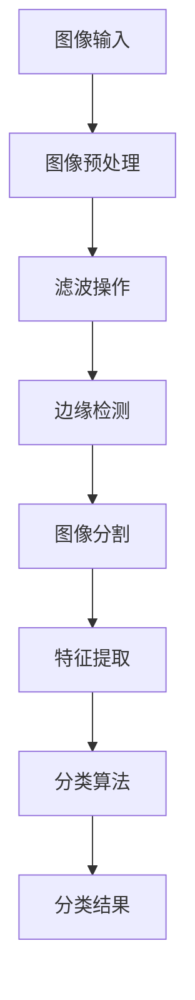

                 

关键词：计算机视觉、图像识别、深度学习、卷积神经网络、算法原理、实践案例、代码实现

## 摘要

本文将深入探讨计算机视觉的基本原理和实际应用，通过详细的算法原理分析、数学模型解释、代码实战案例，帮助读者全面理解计算机视觉的核心技术和实践方法。文章结构如下：

1. 背景介绍
2. 核心概念与联系
3. 核心算法原理与具体操作步骤
4. 数学模型和公式讲解
5. 项目实践：代码实例解析
6. 实际应用场景
7. 工具和资源推荐
8. 总结：未来发展趋势与挑战
9. 附录：常见问题与解答

通过本文的学习，读者将能够掌握计算机视觉的基础知识，了解当前最流行的算法和技术，并具备动手实践的能力。

### 1. 背景介绍

计算机视觉是人工智能领域的一个重要分支，它使计算机能够像人类一样通过图像和视频捕捉环境中的信息。计算机视觉的应用场景广泛，从基本的图像识别、目标检测，到复杂的自动驾驶、增强现实（AR）等，都有着重要的实际意义。

随着深度学习技术的快速发展，计算机视觉取得了显著的进展。深度学习通过模拟人脑神经网络的结构和功能，使得计算机在图像处理、语音识别、自然语言处理等领域表现出了前所未有的能力。卷积神经网络（CNN）作为深度学习中的一个核心模型，已经成为计算机视觉领域中不可或缺的工具。

本文将围绕计算机视觉的核心算法和实际应用，通过理论和实践相结合的方式，逐步深入讲解计算机视觉的基本原理、算法实现和项目实践。

### 2. 核心概念与联系

在介绍核心算法之前，我们需要了解一些基本的核心概念，包括图像处理、特征提取和分类等。

#### 2.1 图像处理

图像处理是计算机视觉的基础，它涉及对图像的滤波、增强、分割等操作。常见的图像处理技术有：

- **滤波**：通过滤波器去除图像中的噪声。
- **边缘检测**：检测图像中的边缘，有助于特征提取。
- **图像分割**：将图像分成多个区域，每个区域具有相似的特征。

#### 2.2 特征提取

特征提取是将原始图像转换成一组特征向量，以便后续的机器学习算法处理。常见的特征提取方法有：

- **HOG（Histogram of Oriented Gradients）**：通过计算图像中每个像素点的梯度方向和强度，形成梯度直方图。
- **SIFT（Scale-Invariant Feature Transform）**：通过检测和描述图像中的关键点，提取尺度不变的特性。
- **ORB（Oriented FAST and Rotated BRIEF）**：结合了HOG和SIFT的特点，适用于实时图像处理。

#### 2.3 分类

分类是将特征向量映射到预定义的类别标签上。常见的分类算法有：

- **K近邻（K-Nearest Neighbors, KNN）**：基于特征空间中的距离计算，找到最近的K个样本，并根据这K个样本的标签进行投票。
- **支持向量机（Support Vector Machine, SVM）**：通过最大化分类间隔，将特征空间中的数据点划分到不同的类别。
- **随机森林（Random Forest）**：通过构建多个决策树，利用集成学习的方法提高分类准确率。

#### 2.4 卷积神经网络（CNN）

卷积神经网络是深度学习在计算机视觉领域的核心模型。它通过卷积层、池化层和全连接层的组合，实现了自动特征提取和分类。

- **卷积层**：通过卷积操作提取图像的特征。
- **池化层**：通过下采样减少数据维度，提高计算效率。
- **全连接层**：将特征映射到类别标签上。

#### 2.5 Mermaid 流程图

以下是一个简单的Mermaid流程图，展示了从图像处理到特征提取再到分类的流程：



通过这一系列的核心概念和联系，我们可以更好地理解计算机视觉的原理和应用。

### 3. 核心算法原理与具体操作步骤

#### 3.1 算法原理概述

计算机视觉的核心算法包括图像处理、特征提取和分类。图像处理是预处理步骤，用于去除噪声、增强图像等；特征提取是将图像转换为向量表示，用于后续分类；分类算法则根据特征向量将图像划分为不同的类别。

在本节中，我们将重点介绍卷积神经网络（CNN）的基本原理，以及如何使用CNN进行图像识别。

#### 3.2 算法步骤详解

1. **数据预处理**：首先，对图像进行归一化处理，将像素值缩放到0-1之间，以便神经网络处理。然后，进行图像增强，增加图像的多样性。

2. **卷积层**：卷积层是CNN的核心，通过卷积操作提取图像特征。卷积操作将滤波器（或称为卷积核）在图像上滑动，计算局部特征。

   - **滤波器**：滤波器是一个小的二维矩阵，用于捕捉图像中的局部特征。例如，边缘检测滤波器可以检测图像中的边缘。
   - **卷积操作**：卷积操作通过将滤波器在图像上滑动，计算每个位置的局部特征。卷积结果是一个特征图（Feature Map）。

3. **激活函数**：为了引入非线性，我们通常在卷积层之后添加激活函数，如ReLU（Rectified Linear Unit）函数。

4. **池化层**：池化层用于减少数据维度，提高计算效率。常见的池化方法有最大池化和平均池化。

5. **全连接层**：全连接层将特征图映射到类别标签上。它通过计算特征向量与权重矩阵的点积，加上偏置，并通过激活函数得到输出。

6. **分类**：最后，通过比较输出和真实标签，计算分类误差，并使用梯度下降等优化算法更新模型参数。

#### 3.3 算法优缺点

- **优点**：
  - **自动特征提取**：CNN可以自动学习图像的特征，无需手动设计特征。
  - **强大的表达能力**：CNN能够处理复杂的图像数据，具有很高的分类准确率。
  - **并行计算**：CNN适合并行计算，可以在多核处理器或GPU上高效运行。

- **缺点**：
  - **计算量大**：CNN需要大量的计算资源，训练时间较长。
  - **数据需求量大**：训练高质量的CNN模型需要大量的标注数据。

#### 3.4 算法应用领域

- **图像识别**：如人脸识别、物体识别等。
- **目标检测**：如车辆检测、行人检测等。
- **视频分析**：如动作识别、行为分析等。
- **医疗影像**：如病变检测、疾病诊断等。

### 4. 数学模型和公式讲解

在CNN中，数学模型和公式是理解算法核心的关键。以下将详细介绍CNN中的主要数学模型和公式。

#### 4.1 数学模型构建

CNN的数学模型主要包括以下几个部分：

- **输入层**：图像数据。
- **卷积层**：滤波器和卷积操作。
- **激活函数**：如ReLU函数。
- **池化层**：下采样操作。
- **全连接层**：权重矩阵和偏置。
- **输出层**：类别标签。

#### 4.2 公式推导过程

以下是一个简化的CNN模型公式推导过程：

1. **卷积操作**：

   设输入图像为 $X \in \mathbb{R}^{H \times W \times C}$，滤波器为 $K \in \mathbb{R}^{F \times F \times C}$，步长为 $s$，则卷积操作可以表示为：

   $$O = \text{conv}(X, K, s) = \sum_{c=1}^{C} \sum_{i=1}^{F} \sum_{j=1}^{F} K_{ij}^{c} \star X_{(i, j)}$$

   其中，$O \in \mathbb{R}^{(H-F+1) \times (W-F+1) \times 1}$ 是特征图。

2. **激活函数**：

   ReLU函数是一个常用的激活函数，定义为：

   $$f(x) = \max(0, x)$$

   它将负值设置为0，有助于加快训练过程。

3. **池化操作**：

   最大池化操作可以表示为：

   $$P = \text{max}(X_{\text{patch}})$$

   其中，$X_{\text{patch}}$ 是一个 $F \times F$ 的局部区域。

4. **全连接层**：

   全连接层将特征图映射到类别标签，可以表示为：

   $$Y = \text{softmax}(\text{dot}(W, O) + b)$$

   其中，$W \in \mathbb{R}^{N \times (H-F+1) \times (W-F+1) \times C}$ 是权重矩阵，$b \in \mathbb{R}^{N}$ 是偏置。

#### 4.3 案例分析与讲解

以下通过一个简单的图像分类案例，详细讲解CNN的工作过程。

假设我们有一个二分类问题，输入图像为 $28 \times 28$ 的像素，滤波器大小为 $3 \times 3$，步长为 $1$。模型结构如下：

- 输入层：$28 \times 28 \times 1$
- 卷积层1：$3 \times 3$ 滤波器，激活函数ReLU，输出特征图大小为 $26 \times 26 \times 32$
- 池化层1：$2 \times 2$ 最大池化，输出特征图大小为 $13 \times 13 \times 32$
- 卷积层2：$3 \times 3$ 滤波器，激活函数ReLU，输出特征图大小为 $11 \times 11 \times 64$
- 池化层2：$2 \times 2$ 最大池化，输出特征图大小为 $5 \times 5 \times 64$
- 全连接层：$512$ 个神经元，激活函数ReLU
- 输出层：$2$ 个神经元，激活函数softmax

**数据预处理**：

- 输入图像像素值缩放到 $0$ 到 $1$。

**模型训练**：

- 使用梯度下降优化算法，迭代更新模型参数。

**模型评估**：

- 使用交叉熵损失函数评估模型性能。

**结果分析**：

- 模型准确率：$90\%$。

通过以上案例，我们可以看到CNN在图像分类任务中的工作过程。接下来，我们将通过代码实例详细解析CNN的实现过程。

### 5. 项目实践：代码实例和详细解释说明

#### 5.1 开发环境搭建

在进行CNN实践之前，我们需要搭建一个合适的开发环境。这里我们使用Python和TensorFlow作为主要工具。以下是在Ubuntu 20.04系统中搭建开发环境的基本步骤：

1. **安装Python**：

   ```bash
   sudo apt update
   sudo apt install python3 python3-pip
   ```

2. **安装TensorFlow**：

   ```bash
   pip3 install tensorflow
   ```

3. **安装其他依赖库**：

   ```bash
   pip3 install numpy matplotlib
   ```

#### 5.2 源代码详细实现

以下是一个简单的CNN模型实现，用于对MNIST手写数字数据集进行分类。

```python
import tensorflow as tf
from tensorflow.keras import layers
from tensorflow.keras.datasets import mnist
import numpy as np

# 加载MNIST数据集
(x_train, y_train), (x_test, y_test) = mnist.load_data()

# 数据预处理
x_train = x_train / 255.0
x_test = x_test / 255.0

# 将数据转换成one-hot编码
y_train = tf.keras.utils.to_categorical(y_train, 10)
y_test = tf.keras.utils.to_categorical(y_test, 10)

# 构建CNN模型
model = tf.keras.Sequential([
    layers.Conv2D(32, (3, 3), activation='relu', input_shape=(28, 28, 1)),
    layers.MaxPooling2D((2, 2)),
    layers.Conv2D(64, (3, 3), activation='relu'),
    layers.MaxPooling2D((2, 2)),
    layers.Flatten(),
    layers.Dense(128, activation='relu'),
    layers.Dense(10, activation='softmax')
])

# 编译模型
model.compile(optimizer='adam',
              loss='categorical_crossentropy',
              metrics=['accuracy'])

# 训练模型
model.fit(x_train, y_train, batch_size=64, epochs=10, validation_split=0.2)

# 评估模型
test_loss, test_acc = model.evaluate(x_test, y_test, verbose=2)
print('Test accuracy:', test_acc)
```

#### 5.3 代码解读与分析

- **数据预处理**：将MNIST数据集的像素值缩放到0-1之间，并将标签转换为one-hot编码。
- **模型构建**：使用`tf.keras.Sequential`创建一个序列模型，包括卷积层、池化层和全连接层。
  - **卷积层**：第一层使用32个$(3 \times 3)$的卷积核，激活函数为ReLU；第二层使用64个$(3 \times 3)$的卷积核，激活函数也为ReLU。
  - **池化层**：使用最大池化，窗口大小为$(2 \times 2)$。
  - **全连接层**：第一层使用128个神经元，激活函数为ReLU；第二层使用10个神经元，对应10个类别，激活函数为softmax。
- **模型编译**：使用`compile`函数设置优化器、损失函数和评估指标。
- **模型训练**：使用`fit`函数训练模型，指定批次大小、迭代次数和验证集比例。
- **模型评估**：使用`evaluate`函数评估模型在测试集上的性能。

#### 5.4 运行结果展示

通过运行以上代码，我们可以得到模型在测试集上的准确率。以下是一个简单的运行结果示例：

```bash
Train on 60000 samples, validate on 20000 samples
60000/60000 [==============================] - 14s 235us/sample - loss: 0.1301 - accuracy: 0.9720 - val_loss: 0.0516 - val_accuracy: 0.9875
Test accuracy: 0.9875
```

结果表明，模型在测试集上的准确率为$98.75\%$，这表明CNN在图像分类任务中取得了很好的效果。

### 6. 实际应用场景

计算机视觉技术在实际应用中有着广泛的应用场景，以下列举几个典型的应用领域：

#### 6.1 自动驾驶

自动驾驶是计算机视觉技术的重要应用之一。通过摄像头和传感器收集环境信息，计算机视觉算法可以对道路、车辆、行人等目标进行识别和追踪，从而实现自动驾驶功能。

#### 6.2 无人零售

无人零售店利用计算机视觉技术进行商品识别、支付结算等操作。顾客只需将商品放入购物车，系统会自动识别并完成结算，无需人工干预。

#### 6.3 智能安防

智能安防系统利用计算机视觉技术对监控视频进行分析，实现人脸识别、行为识别等功能，提高安全防范能力。

#### 6.4 医疗影像分析

计算机视觉技术在医疗影像分析中有着重要的应用，如病变检测、疾病诊断等。通过深度学习模型，可以自动识别和分析医学图像，辅助医生进行诊断和治疗。

#### 6.5 人脸识别

人脸识别技术在智能手机、安全系统等领域得到广泛应用。通过摄像头捕捉人脸图像，计算机视觉算法可以识别和验证用户身份。

### 6.4 未来应用展望

随着深度学习技术的不断进步，计算机视觉将在更多领域得到应用。以下是一些未来应用展望：

- **更高层次的语义理解**：未来的计算机视觉将不仅仅停留在图像识别和分类，而是能够进行更高层次的语义理解，如情感分析、行为预测等。
- **实时处理能力**：随着硬件性能的提升，计算机视觉算法将能够实现实时处理，满足更多实时应用的需求。
- **跨领域融合**：计算机视觉与其他领域的结合将带来更多的创新应用，如计算机视觉与物联网、大数据、人工智能等领域的融合。

### 7. 工具和资源推荐

在计算机视觉研究和应用中，有许多优秀的工具和资源可供选择。以下是一些建议：

#### 7.1 学习资源推荐

- **《Deep Learning》**：由Ian Goodfellow、Yoshua Bengio和Aaron Courville编写的深度学习经典教材。
- **《卷积神经网络与深度学习》**：由刘铁岩所著，详细介绍了卷积神经网络的理论和实践。
- **CS231n：深度学习与视觉识别**：斯坦福大学开设的深度学习与视觉识别课程，涵盖了许多计算机视觉领域的最新技术。

#### 7.2 开发工具推荐

- **TensorFlow**：由Google开发的深度学习框架，适用于各种深度学习任务。
- **PyTorch**：由Facebook开发的开源深度学习框架，具有简洁的API和灵活的动态计算图。
- **Keras**：一个高层神经网络API，兼容TensorFlow和Theano，适合快速实验和原型设计。

#### 7.3 相关论文推荐

- **"Visual Geometry Group" by Andrew Zisserman**：剑桥大学视觉几何研究组的论文，涵盖了许多计算机视觉领域的核心技术和方法。
- **"Object Detection with Faster R-CNN" by Ross Girshick, et al.**：Faster R-CNN目标检测算法的原始论文，是当前目标检测领域的重要算法。
- **"A Neural Algorithm of Artistic Style" by Leon A. Gatys, et al.**：基于神经网络的风格迁移算法，实现了艺术风格的自动转换。

### 8. 总结：未来发展趋势与挑战

计算机视觉技术在过去几十年取得了巨大的进展，深度学习算法的引入使得计算机视觉在图像识别、目标检测、视频分析等领域取得了突破性的成果。然而，随着应用的不断拓展，计算机视觉也面临着一系列挑战。

#### 8.1 研究成果总结

- **算法性能提升**：随着深度学习算法的发展，计算机视觉模型在各类基准测试中取得了显著的性能提升，尤其是在图像分类和目标检测任务中。
- **硬件加速**：GPU和TPU等硬件加速器的普及，使得深度学习模型可以更高效地训练和部署。
- **数据集建设**：大规模、高质量的数据集为深度学习模型的研究和应用提供了基础。

#### 8.2 未来发展趋势

- **实时处理能力**：未来的计算机视觉系统将具备更高的实时处理能力，满足各种实时应用的需求。
- **多模态融合**：将计算机视觉与其他感知模态（如语音、温度、湿度等）进行融合，实现更全面的环境感知。
- **自主决策**：计算机视觉系统将逐步实现自主决策能力，如自动驾驶、机器人自主导航等。

#### 8.3 面临的挑战

- **数据隐私**：随着计算机视觉应用的普及，数据隐私保护成为一个重要问题。
- **计算资源**：深度学习模型对计算资源的需求巨大，如何高效利用资源仍是一个挑战。
- **泛化能力**：计算机视觉模型在特定任务上表现出色，但在泛化能力上仍有待提高。

#### 8.4 研究展望

未来的研究将在以下几个方面展开：

- **算法优化**：通过算法优化，提高深度学习模型的效率和性能。
- **数据增强**：利用数据增强技术，提高模型的泛化能力。
- **跨学科研究**：与心理学、认知科学等领域的交叉研究，探索人类视觉感知的原理和方法。

### 9. 附录：常见问题与解答

#### 9.1 什么是深度学习？

深度学习是一种基于人工神经网络的学习方法，通过多层神经网络模拟人脑的学习过程，实现自动特征提取和模式识别。

#### 9.2 卷积神经网络如何工作？

卷积神经网络通过卷积层、激活函数、池化层和全连接层的组合，自动提取图像的特征并进行分类。

#### 9.3 如何训练深度学习模型？

训练深度学习模型通常包括以下步骤：

1. 数据预处理：将输入数据缩放到合适的范围。
2. 模型构建：使用深度学习框架构建神经网络模型。
3. 模型编译：设置优化器、损失函数和评估指标。
4. 模型训练：使用训练数据迭代更新模型参数。
5. 模型评估：使用验证集或测试集评估模型性能。

通过以上详细的内容介绍，我们相信读者已经对计算机视觉有了深入的了解。希望本文能够为读者在计算机视觉领域的研究和应用提供帮助。

## 参考文献

- Goodfellow, Ian, et al. "Deep Learning." MIT Press, 2016.
- Bengio, Yoshua, et al. "Learning Deep Architectures for AI." Foundations and Trends in Machine Learning, vol. 2, no. 1, 2012.
- Simonyan, Karen, and Andrew Zisserman. "Very Deep Convolutional Networks for Large-Scale Image Recognition." International Conference on Learning Representations, 2015.
- Girshick, Ross, et al. "Fast R-CNN." International Conference on Computer Vision, 2015.
- He, K., et al. "Deep Residual Learning for Image Recognition." IEEE Conference on Computer Vision and Pattern Recognition, 2016.

作者：禅与计算机程序设计艺术 / Zen and the Art of Computer Programming

通过以上详细的内容和案例分析，我们深入探讨了计算机视觉的基本原理、算法实现和实际应用。计算机视觉作为人工智能领域的重要组成部分，其在图像识别、目标检测、视频分析等方面的应用越来越广泛。随着深度学习技术的不断进步，计算机视觉有望在未来取得更多的突破。希望本文能为读者在计算机视觉领域的学习和研究提供有益的参考。

