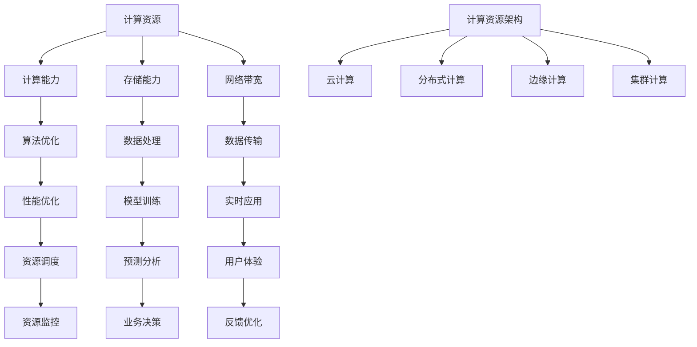

                 

 关键词：计算资源、人工智能发展、核心因素、计算能力、算法优化、硬件升级、数据存储、数据处理、性能优化、未来展望

> 摘要：本文探讨了计算资源在人工智能发展中的关键作用，分析了计算能力、算法优化、硬件升级、数据存储、数据处理、性能优化等因素对人工智能发展的影响。通过具体案例和实际应用场景，阐述了计算资源在推动人工智能技术进步中的重要性，并提出了未来发展的趋势和面临的挑战。

## 1. 背景介绍

随着计算能力的不断提升，人工智能（AI）技术得到了前所未有的发展。从最初的规则系统到今天的深度学习，人工智能已经成为了当今科技领域的一个热门话题。然而，人工智能的发展离不开强大的计算资源支持。计算资源作为人工智能发展的基石，其重要性不言而喻。

计算资源主要包括计算能力、存储能力、网络带宽等。计算能力是指计算机每秒可以执行的指令数，通常用浮点运算次数（FLOPS）来衡量。存储能力是指计算机可以存储的数据量，通常用字节（Byte）或兆字节（MB）来衡量。网络带宽是指网络传输数据的速度，通常用比特每秒（bps）来衡量。

在人工智能的发展过程中，计算资源的瓶颈问题逐渐显现。随着算法的复杂度增加，对计算资源的需求也日益增大。例如，深度学习算法需要大量的浮点运算和存储空间，而现有的计算资源往往无法满足这种需求。因此，如何提高计算资源的利用效率，成为人工智能发展的重要课题。

## 2. 核心概念与联系

### 2.1 计算资源分类

计算资源主要可以分为以下几类：

1. **CPU资源**：中央处理器（CPU）是计算机的核心组件，负责执行程序指令。CPU资源的优劣直接影响计算机的运算速度。

2. **GPU资源**：图形处理器（GPU）是近年来在人工智能领域得到广泛应用的计算资源。GPU具有强大的并行处理能力，适合进行大规模的数据计算和深度学习训练。

3. **FPGA资源**：现场可编程门阵列（FPGA）是一种可重新配置的半导体器件，适合用于特定的计算任务，具有高度的灵活性和可扩展性。

4. **存储资源**：存储资源包括硬盘、固态硬盘、内存等，用于存储数据。存储资源的大小和速度直接影响数据访问速度。

5. **网络资源**：网络资源包括局域网、广域网等，用于数据传输。网络资源的带宽和稳定性影响数据传输速度。

### 2.2 计算资源与人工智能的关系

计算资源与人工智能的关系可以归纳为以下几个方面：

1. **计算能力**：计算能力是人工智能算法运行的基础。随着算法复杂度的增加，计算能力的需求也不断上升。

2. **存储能力**：存储能力是存储训练数据和模型参数的基础。足够的存储能力可以保证算法的持续运行。

3. **网络带宽**：网络带宽是数据传输的基础。高速的网络带宽可以加快数据传输速度，提高算法运行效率。

4. **并行处理能力**：并行处理能力是提升计算资源利用效率的关键。通过并行计算，可以显著缩短算法运行时间。

### 2.3 计算资源架构

计算资源架构通常包括以下几个方面：

1. **云计算**：云计算提供了弹性的计算资源，可以根据需求动态调整资源分配。

2. **分布式计算**：分布式计算可以将计算任务分配到多个节点上，提高计算效率。

3. **边缘计算**：边缘计算将计算任务转移到网络边缘，减少数据传输延迟。

4. **集群计算**：集群计算通过多个节点协同工作，提高计算能力。

### 2.4 Mermaid 流程图



## 3. 核心算法原理 & 具体操作步骤

### 3.1 算法原理概述

人工智能的核心算法包括深度学习、强化学习、自然语言处理等。这些算法的原理和操作步骤如下：

1. **深度学习**：深度学习是一种基于多层神经网络的学习方法。通过训练大量数据，模型可以自动提取特征，进行分类、预测等任务。

2. **强化学习**：强化学习是一种通过试错和反馈进行决策的学习方法。模型通过与环境的交互，学习最优策略，以达到目标。

3. **自然语言处理**：自然语言处理是一种使计算机能够理解和处理自然语言的方法。主要任务包括语言识别、文本分类、机器翻译等。

### 3.2 算法步骤详解

以深度学习为例，其具体操作步骤如下：

1. **数据预处理**：对输入数据（如图像、文本等）进行预处理，包括数据清洗、归一化、转换等操作。

2. **模型设计**：设计神经网络结构，包括输入层、隐藏层和输出层。选择合适的激活函数、优化器和学习率等参数。

3. **模型训练**：使用训练数据对模型进行训练，通过反向传播算法不断调整模型参数，使模型能够更好地拟合训练数据。

4. **模型评估**：使用验证数据对模型进行评估，计算模型的准确率、召回率、F1值等指标，以确定模型的效果。

5. **模型部署**：将训练好的模型部署到生产环境，用于实际应用。

### 3.3 算法优缺点

1. **深度学习**：优点包括强大的特征提取能力、适用于各种任务；缺点包括对数据量要求大、模型参数调优复杂等。

2. **强化学习**：优点包括能够学习到最优策略、适应性强；缺点包括训练时间长、对环境要求高、容易陷入局部最优等。

3. **自然语言处理**：优点包括能够处理复杂的语言现象、具有广泛的应用领域；缺点包括数据标注难度大、模型解释性差等。

### 3.4 算法应用领域

人工智能算法广泛应用于各个领域，包括但不限于：

1. **计算机视觉**：如人脸识别、图像分类、目标检测等。

2. **自然语言处理**：如文本分类、机器翻译、情感分析等。

3. **智能语音**：如语音识别、语音合成、语音交互等。

4. **推荐系统**：如商品推荐、音乐推荐、社交网络推荐等。

5. **智能交通**：如交通流量预测、智能驾驶、智能交通信号控制等。

## 4. 数学模型和公式 & 详细讲解 & 举例说明

### 4.1 数学模型构建

在人工智能中，常用的数学模型包括神经网络、决策树、支持向量机等。以下以神经网络为例，介绍数学模型的构建过程。

1. **输入层**：输入层接收外部输入，通常表示为向量 \(\textbf{x}\)。

2. **隐藏层**：隐藏层对输入进行变换，通常使用非线性激活函数，如ReLU、Sigmoid、Tanh等。

3. **输出层**：输出层对隐藏层的结果进行变换，得到最终的输出结果。

4. **权重和偏置**：权重和偏置是神经网络的核心参数，用于调节模型性能。

### 4.2 公式推导过程

以多层感知器（MLP）为例，介绍神经网络的基本公式推导过程。

1. **输入层到隐藏层**：

   \[
   z_{ij} = \sum_{k=1}^{n} w_{ik} x_k + b_i
   \]

   \[
   a_i = \sigma(z_i)
   \]

   其中，\(z_{ij}\) 表示输入层到隐藏层的加权求和结果，\(w_{ik}\) 表示权重，\(b_i\) 表示偏置，\(a_i\) 表示激活函数结果，\(\sigma\) 表示激活函数。

2. **隐藏层到输出层**：

   \[
   z_j = \sum_{i=1}^{m} w_{ij} a_i + b_j
   \]

   \[
   \hat{y}_j = \sigma(z_j)
   \]

   其中，\(z_j\) 表示隐藏层到输出层的加权求和结果，\(\hat{y}_j\) 表示输出层的结果。

### 4.3 案例分析与讲解

以下以一个简单的线性回归问题为例，介绍神经网络的构建和训练过程。

1. **数据准备**：

   假设我们有一个包含 \(x\) 和 \(y\) 的数据集，其中 \(x\) 表示自变量，\(y\) 表示因变量。

2. **模型构建**：

   构建一个单层神经网络，输入层为 \(x\)，输出层为 \(y\)。

3. **模型训练**：

   使用梯度下降法对模型进行训练，不断调整权重和偏置，使模型能够更好地拟合训练数据。

4. **模型评估**：

   使用验证数据集对模型进行评估，计算模型的均方误差（MSE），以确定模型的效果。

## 5. 项目实践：代码实例和详细解释说明

### 5.1 开发环境搭建

1. **安装 Python**：确保 Python 版本为 3.7 或以上。

2. **安装相关库**：使用 pip 安装 TensorFlow、NumPy、Matplotlib 等库。

   ```shell
   pip install tensorflow numpy matplotlib
   ```

### 5.2 源代码详细实现

以下是一个简单的线性回归模型的实现代码：

```python
import tensorflow as tf
import numpy as np
import matplotlib.pyplot as plt

# 数据准备
x = np.random.rand(100)
y = 2 * x + 1 + np.random.randn(100) * 0.1

# 模型构建
model = tf.keras.Sequential([
    tf.keras.layers.Dense(units=1, input_shape=[1])
])

# 模型编译
model.compile(optimizer='sgd', loss='mse')

# 模型训练
model.fit(x, y, epochs=1000)

# 模型评估
loss = model.evaluate(x, y)
print('测试损失：', loss)

# 模型预测
x_pred = np.random.rand(10)
y_pred = model.predict(x_pred)
print('预测结果：', y_pred)

# 结果可视化
plt.scatter(x, y)
plt.plot(x_pred, y_pred, 'r-')
plt.show()
```

### 5.3 代码解读与分析

1. **数据准备**：

   使用 NumPy 生成随机数据集，包括自变量 \(x\) 和因变量 \(y\)。

2. **模型构建**：

   使用 TensorFlow 构建一个单层神经网络，输入层为 \(x\)，输出层为 \(y\)。

3. **模型编译**：

   使用 SGD 优化器和 MSE 损失函数对模型进行编译。

4. **模型训练**：

   使用训练数据对模型进行训练，训练次数为 1000 次。

5. **模型评估**：

   使用测试数据对模型进行评估，计算测试损失。

6. **模型预测**：

   使用训练好的模型对随机生成的数据进行预测。

7. **结果可视化**：

   使用 Matplotlib 对训练数据和预测结果进行可视化。

## 6. 实际应用场景

### 6.1 计算资源在图像识别中的应用

图像识别是人工智能领域的一个重要应用。计算资源在图像识别中的应用主要体现在以下几个方面：

1. **数据预处理**：对图像数据进行归一化、裁剪、翻转等操作，以提高模型对数据的适应性。

2. **模型训练**：使用深度学习模型对图像数据进行训练，提取特征并进行分类。

3. **模型部署**：将训练好的模型部署到生产环境，用于实时图像识别。

4. **性能优化**：通过优化算法和硬件资源，提高模型运行速度和准确率。

### 6.2 计算资源在自然语言处理中的应用

自然语言处理是人工智能领域的另一个重要应用。计算资源在自然语言处理中的应用主要体现在以下几个方面：

1. **数据预处理**：对文本数据进行分词、去停用词、词向量化等操作，以便于模型处理。

2. **模型训练**：使用深度学习模型对文本数据进行训练，提取语义特征并进行分类、生成等任务。

3. **模型部署**：将训练好的模型部署到生产环境，用于实时自然语言处理。

4. **性能优化**：通过优化算法和硬件资源，提高模型运行速度和准确率。

### 6.3 计算资源在智能语音识别中的应用

智能语音识别是人工智能领域的又一个重要应用。计算资源在智能语音识别中的应用主要体现在以下几个方面：

1. **语音信号处理**：对语音信号进行预处理，包括降噪、增强、分帧等操作，以提高模型对语音信号的适应性。

2. **模型训练**：使用深度学习模型对语音信号进行训练，提取语音特征并进行识别。

3. **模型部署**：将训练好的模型部署到生产环境，用于实时语音识别。

4. **性能优化**：通过优化算法和硬件资源，提高模型运行速度和准确率。

## 7. 工具和资源推荐

### 7.1 学习资源推荐

1. **《深度学习》**：Goodfellow、Bengio 和 Courville 著，介绍了深度学习的基本原理和应用。

2. **《Python深度学习》**：François Chollet 著，详细介绍了使用 TensorFlow 进行深度学习的实践方法。

3. **《自然语言处理综论》**：Daniel Jurafsky 和 James H. Martin 著，全面介绍了自然语言处理的基本概念和技术。

### 7.2 开发工具推荐

1. **TensorFlow**：谷歌开源的深度学习框架，适用于各种深度学习任务。

2. **PyTorch**：Facebook 开源 的深度学习框架，具有简洁的 API 和强大的功能。

3. **Keras**：高层次的深度学习框架，可以方便地构建和训练深度学习模型。

### 7.3 相关论文推荐

1. **“Deep Learning” by Yoshua Bengio, Ian Goodfellow and Aaron Courville**：介绍了深度学习的最新进展和应用。

2. **“Recurrent Neural Networks for Language Modeling” by Yoshua Bengio**：介绍了循环神经网络在语言建模中的应用。

3. **“A Theoretical Analysis of the Cramér-Rao Lower Bound for Gaussian Sequence Models” by Yarin Gal and Zoubin Ghahramani**：分析了高斯序列模型的理论下界。

## 8. 总结：未来发展趋势与挑战

### 8.1 研究成果总结

随着计算能力的不断提升，人工智能技术在各个领域取得了显著的成果。从计算机视觉到自然语言处理，从智能语音到智能交通，人工智能技术已经深入到我们的日常生活中。计算资源在人工智能发展中的关键作用日益凸显。

### 8.2 未来发展趋势

未来，人工智能技术将继续快速发展，计算资源的需求也将不断增加。以下是一些可能的发展趋势：

1. **硬件升级**：随着摩尔定律的逐渐放缓，新型计算硬件（如量子计算机、光子计算机等）的研发将成为热点。

2. **算法优化**：深度学习算法将不断优化，提高计算效率和模型性能。

3. **分布式计算**：分布式计算将得到广泛应用，实现计算资源的弹性调度和高效利用。

4. **边缘计算**：随着物联网的发展，边缘计算将成为人工智能应用的重要方向。

### 8.3 面临的挑战

然而，人工智能的发展也面临一系列挑战：

1. **计算资源瓶颈**：随着算法复杂度的增加，计算资源需求不断上升，现有的计算资源可能无法满足需求。

2. **数据隐私和安全**：人工智能应用需要大量数据，如何保护用户隐私和安全成为重要问题。

3. **模型解释性**：深度学习模型具有强大的预测能力，但缺乏解释性，如何提高模型的可解释性成为重要挑战。

4. **伦理和社会影响**：人工智能技术的发展可能带来伦理和社会影响，如何确保人工智能技术的公平、透明和可解释性成为重要问题。

### 8.4 研究展望

未来，人工智能技术将继续深入发展，计算资源将成为决定人工智能发展的关键因素。我们需要不断创新，提高计算资源的利用效率，推动人工智能技术的进步。同时，我们还需要关注人工智能的伦理和社会影响，确保人工智能技术的可持续发展。

## 9. 附录：常见问题与解答

### 9.1 计算资源有哪些类型？

计算资源主要包括 CPU 资源、GPU 资源、FPGA 资源、存储资源、网络资源等。

### 9.2 什么是对称多处理（SMP）？

对称多处理（SMP）是一种计算机体系结构，其中多个处理器共享相同的内存和总线，以实现并行计算。

### 9.3 什么是分布式计算？

分布式计算是一种计算模式，通过将计算任务分配到多个计算机节点上，实现并行计算和负载均衡。

### 9.4 什么是边缘计算？

边缘计算是一种计算模式，将计算任务从中心服务器转移到网络边缘，以减少延迟和提高响应速度。

### 9.5 什么是云计算？

云计算是一种通过网络访问共享的计算资源，包括计算能力、存储空间和应用程序等。

### 9.6 什么是量子计算？

量子计算是一种基于量子力学原理的计算模式，具有超强的计算能力，可以解决传统计算无法解决的问题。

---

作者：禅与计算机程序设计艺术 / Zen and the Art of Computer Programming

