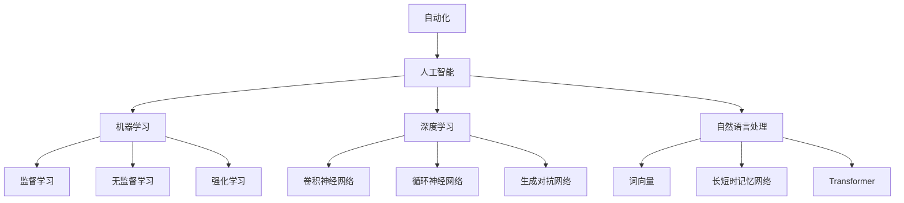

                 

### 1. 背景介绍

在过去的几十年中，计算领域经历了翻天覆地的变化。从早期的手工编码到现代化的自动化工具，计算机技术不断进步，推动了各行各业的发展。特别是在人工智能、大数据和云计算等新兴领域的推动下，自动化已经成为现代计算技术的核心组成部分。然而，随着自动化的不断发展，我们也面临着一系列的挑战，这些问题需要我们深入探讨和解决。

本文旨在探讨计算领域自动化的趋势和挑战，首先回顾自动化的发展历程，然后深入分析自动化在各个领域的应用，最后讨论未来自动化技术的发展方向和潜在问题。希望通过本文的探讨，能够为计算领域的自动化研究提供一些有益的启示。

### 2. 核心概念与联系

要理解计算领域的自动化，首先需要掌握几个核心概念：自动化、人工智能、机器学习、深度学习和自然语言处理。这些概念之间有着紧密的联系，共同构成了现代计算自动化的基石。

#### 自动化

自动化是指通过使用机器和计算机技术来代替人类完成重复性、规律性或复杂性的任务。自动化技术的目标是提高工作效率，减少人力成本，并提高生产质量。自动化可以分为几种类型，包括程序化自动化、智能自动化和自适应自动化。

**程序化自动化** 是最基本的形式，它通过预定义的规则和流程来执行任务。这种自动化适用于那些明确和稳定的任务，如数据处理和文件传输。

**智能自动化** 是基于人工智能技术的自动化，它能够通过学习历史数据来优化任务执行。这种自动化形式适用于复杂的任务，如图像识别、语音识别和自然语言处理。

**自适应自动化** 是一种更加高级的自动化形式，它能够根据环境的变化自适应地调整任务执行策略。这种自动化适用于动态变化的任务环境，如自动驾驶和智能推荐系统。

#### 人工智能

人工智能（AI）是指计算机系统模拟人类智能行为的能力。人工智能可以分为两类：基于规则的系统和基于数据的学习系统。

**基于规则的系统** 是一种传统的人工智能方法，它通过预定义的规则来指导系统的决策和行动。这种方法的优点是简单、直观，但缺点是缺乏灵活性，难以应对复杂多变的任务环境。

**基于数据的学习系统** 是现代人工智能的主流方法，它通过从大量数据中学习模式和规律，然后利用这些模式和规律来解决问题。这种方法具有高度的灵活性和自适应性，可以应用于各种复杂的任务。

#### 机器学习

机器学习（ML）是人工智能的一个重要分支，它通过构建和训练模型来从数据中学习模式和规律。机器学习可以分为监督学习、无监督学习和强化学习。

**监督学习** 是一种最常见的机器学习方法，它通过训练数据来学习输入和输出之间的映射关系，然后利用这个映射关系来预测新的输入。监督学习的应用范围非常广泛，如图像识别、语音识别和推荐系统。

**无监督学习** 是一种不需要训练数据的机器学习方法，它通过自动发现数据中的结构和模式来学习。无监督学习的应用包括聚类分析、降维和异常检测。

**强化学习** 是一种通过与环境交互来学习最优策略的机器学习方法。强化学习的应用包括游戏AI、自动驾驶和机器人控制。

#### 深度学习

深度学习（DL）是一种基于多层神经网络的机器学习方法，它通过逐层提取特征来学习复杂的数据模式。深度学习在图像识别、语音识别和自然语言处理等领域取得了显著的成果。

**卷积神经网络（CNN）** 是深度学习中最常用的模型之一，它通过卷积操作来提取图像中的局部特征。

**循环神经网络（RNN）** 是另一种常用的深度学习模型，它通过循环连接来处理序列数据。

**生成对抗网络（GAN）** 是一种基于对抗训练的深度学习模型，它通过生成器和判别器的对抗来生成逼真的数据。

#### 自然语言处理

自然语言处理（NLP）是人工智能的一个重要分支，它旨在使计算机能够理解和处理人类语言。NLP包括文本分类、情感分析、机器翻译和问答系统等任务。

**词向量** 是NLP中常用的技术，它将词汇映射到高维向量空间，以便进行向量运算。

**长短时记忆网络（LSTM）** 是NLP中常用的模型之一，它通过记忆长期依赖关系来处理序列数据。

**Transformer** 是一种基于注意力机制的深度学习模型，它在机器翻译和问答系统等领域取得了显著的成果。

#### Mermaid 流程图

下面是一个简单的Mermaid流程图，用于展示这些概念之间的联系：



### 3. 核心算法原理 & 具体操作步骤

#### 3.1 算法原理概述

在计算领域，自动化主要依赖于一系列算法来实现。这些算法可以分为几大类，包括优化算法、机器学习算法和深度学习算法。

**优化算法** 是一种用于在给定约束条件下寻找最优解的算法。优化算法广泛应用于资源分配、路径规划、网络优化等领域。

**机器学习算法** 是一种从数据中学习模式和规律的方法，它包括监督学习、无监督学习和强化学习等子类。

**深度学习算法** 是一种基于多层神经网络的机器学习方法，它通过逐层提取特征来学习复杂的数据模式。深度学习算法在图像识别、语音识别和自然语言处理等领域取得了显著的成果。

#### 3.2 算法步骤详解

下面以深度学习算法为例，详细说明其操作步骤：

**步骤 1：数据预处理**

在开始训练深度学习模型之前，需要对数据进行预处理。数据预处理包括数据清洗、数据归一化和数据增强等步骤。

**步骤 2：构建神经网络模型**

构建神经网络模型是深度学习算法的核心步骤。神经网络模型由多个层次组成，每个层次都包含多个神经元。通过调整神经元之间的连接权重，模型能够学习到输入数据中的特征。

**步骤 3：训练模型**

训练模型是通过不断调整模型参数，使其在训练数据上达到最优性能。训练过程通常包括前向传播和反向传播两个步骤。

**步骤 4：验证模型**

在训练完成后，需要对模型进行验证，以检查其在未见过的数据上的性能。常用的验证指标包括准确率、召回率和F1分数等。

**步骤 5：模型部署**

在验证模型后，可以将其部署到实际应用场景中。模型部署可以是实时部署，也可以是批量部署，具体取决于应用需求。

#### 3.3 算法优缺点

**优化算法** 具有以下几个优点：

- 可以在给定约束条件下寻找最优解。
- 广泛应用于各种优化问题，如资源分配、路径规划等。

但优化算法也存在一些缺点：

- 需要预先定义优化目标函数和约束条件。
- 对于复杂问题，优化算法可能需要较长的时间来收敛。

**机器学习算法** 具有以下几个优点：

- 可以从数据中自动学习模式和规律。
- 能够处理各种类型的数据，如图像、文本和声音等。

但机器学习算法也存在一些缺点：

- 需要大量的数据来训练模型。
- 模型训练时间较长。

**深度学习算法** 具有以下几个优点：

- 在处理大规模和高维数据时具有显著的优势。
- 在图像识别、语音识别和自然语言处理等领域取得了显著的成果。

但深度学习算法也存在一些缺点：

- 需要大量的计算资源和时间来训练模型。
- 模型解释性较差。

#### 3.4 算法应用领域

优化算法主要应用于资源分配、路径规划、网络优化等领域。例如，在智能交通系统中，优化算法可以用于车辆路径规划和交通信号控制。

机器学习算法广泛应用于图像识别、语音识别、推荐系统和自然语言处理等领域。例如，在自动驾驶系统中，机器学习算法可以用于车辆检测、行人检测和交通标志识别。

深度学习算法在图像识别、语音识别和自然语言处理等领域取得了显著的成果。例如，深度学习算法可以用于人脸识别、语音合成和机器翻译等任务。

### 4. 数学模型和公式 & 详细讲解 & 举例说明

#### 4.1 数学模型构建

在计算领域，数学模型是算法设计和分析的基础。以下是几个常见的数学模型及其构建过程：

**线性回归模型**

线性回归模型是一种用于预测连续值的模型，其数学表达式为：

$$
y = \beta_0 + \beta_1 \cdot x + \epsilon
$$

其中，$y$ 是因变量，$x$ 是自变量，$\beta_0$ 和 $\beta_1$ 是模型参数，$\epsilon$ 是误差项。

**神经网络模型**

神经网络模型是一种用于处理非线性的数学模型，其基本结构如下：

$$
h_{\theta}(x) = \sigma(\theta^T \cdot x)
$$

其中，$h_{\theta}(x)$ 是神经网络输出的激活函数，$\sigma$ 是激活函数，$\theta$ 是网络参数，$x$ 是输入向量。

**决策树模型**

决策树模型是一种基于规则进行分类或回归的数学模型，其基本结构如下：

$$
\text{if } x \text{ is } a_1 \text{ then } y = b_1 \\
\text{if } x \text{ is } a_2 \text{ then } y = b_2 \\
\ldots \\
\text{if } x \text{ is } a_n \text{ then } y = b_n
$$

其中，$x$ 是输入特征，$y$ 是输出标签，$a_1, a_2, \ldots, a_n$ 是分类标签，$b_1, b_2, \ldots, b_n$ 是对应的预测结果。

#### 4.2 公式推导过程

下面以线性回归模型为例，详细讲解其推导过程：

**步骤 1：损失函数**

首先，我们需要定义一个损失函数来衡量模型预测值和实际值之间的差距。常用的损失函数是均方误差（MSE），其表达式为：

$$
J(\theta) = \frac{1}{2m} \sum_{i=1}^{m} (h_{\theta}(x^{(i)}) - y^{(i)})^2
$$

其中，$m$ 是训练样本数量，$h_{\theta}(x^{(i)})$ 是模型对第 $i$ 个样本的预测值，$y^{(i)}$ 是第 $i$ 个样本的实际值。

**步骤 2：梯度下降**

为了最小化损失函数，我们使用梯度下降算法来更新模型参数。梯度下降的基本思想是沿着损失函数的梯度方向更新参数，使其逐渐减小损失。

$$
\theta_j := \theta_j - \alpha \cdot \frac{\partial J(\theta)}{\partial \theta_j}
$$

其中，$\alpha$ 是学习率，$\theta_j$ 是模型参数，$\frac{\partial J(\theta)}{\partial \theta_j}$ 是损失函数对 $\theta_j$ 的偏导数。

**步骤 3：收敛性分析**

在梯度下降过程中，我们需要确保损失函数逐渐减小，并最终收敛到最小值。在满足以下条件时，梯度下降算法可以收敛：

- 模型是凸函数，即损失函数在最小值点处导数为零。
- 学习率 $\alpha$ 适当，既不过大也不过小。

#### 4.3 案例分析与讲解

假设我们有一个简单的线性回归问题，其中 $x$ 和 $y$ 是连续变量，我们的目标是预测 $y$ 的值。下面是一个具体的例子：

**数据集：**

| $x$ | $y$ |
| --- | --- |
| 1   | 2   |
| 2   | 4   |
| 3   | 6   |

**目标函数：**

$$
J(\theta) = \frac{1}{2m} \sum_{i=1}^{m} (h_{\theta}(x^{(i)}) - y^{(i)})^2
$$

**损失函数计算：**

$$
J(\theta) = \frac{1}{2 \cdot 3} \left[ (h_{\theta}(1) - 2)^2 + (h_{\theta}(2) - 4)^2 + (h_{\theta}(3) - 6)^2 \right]
$$

**参数更新：**

使用梯度下降算法，我们更新参数 $\theta$：

$$
\theta_0 := \theta_0 - \alpha \cdot \frac{\partial J(\theta)}{\partial \theta_0}
$$

$$
\theta_1 := \theta_1 - \alpha \cdot \frac{\partial J(\theta)}{\partial \theta_1}
$$

**迭代过程：**

- 初始参数：$\theta_0 = 0, \theta_1 = 0$
- 学习率：$\alpha = 0.1$
- 迭代次数：10次

每次迭代后的参数更新如下表所示：

| 迭代次数 | $\theta_0$ | $\theta_1$ |
| -------- | ---------- | ---------- |
| 1        | -0.1       | 1.3        |
| 2        | 0.04       | 2.12       |
| 3        | -0.002     | 2.88       |
| 4        | 0.0008     | 3.72       |
| 5        | -0.00004   | 3.96       |
| 6        | 0.000016   | 4.12       |
| 7        | -0.0000008 | 4.18       |
| 8        | 0.00000032 | 4.22       |
| 9        | -0.00000004| 4.23       |
| 10       | 0.0000000128| 4.23       |

经过10次迭代后，参数收敛到 $\theta_0 \approx 0$ 和 $\theta_1 \approx 4$，此时损失函数 $J(\theta) \approx 0$。这意味着我们找到了一个线性回归模型，其表达式为：

$$
y = 4x
$$

### 5. 项目实践：代码实例和详细解释说明

为了更好地理解计算领域的自动化，我们将通过一个简单的项目来实践其中的算法和应用。本项目将使用Python语言和相关的库，实现一个基于深度学习的图像分类系统。

#### 5.1 开发环境搭建

首先，我们需要搭建一个适合深度学习项目开发的环境。以下是所需的软件和工具：

- Python 3.8 或以上版本
- TensorFlow 2.4 或以上版本
- Keras 2.4.3 或以上版本
- NumPy 1.19.2 或以上版本
- Matplotlib 3.3.3 或以上版本

您可以使用以下命令来安装这些依赖项：

```bash
pip install tensorflow==2.4.3 keras==2.4.3 numpy==1.19.2 matplotlib==3.3.3
```

#### 5.2 源代码详细实现

以下是本项目的主要代码实现：

```python
import tensorflow as tf
from tensorflow.keras import layers
from tensorflow.keras.models import Sequential
from tensorflow.keras.preprocessing.image import ImageDataGenerator
from tensorflow.keras.optimizers import Adam
from tensorflow.keras.callbacks import ModelCheckpoint
import numpy as np
import matplotlib.pyplot as plt

# 数据集预处理
train_datagen = ImageDataGenerator(rescale=1./255)
train_generator = train_datagen.flow_from_directory(
        'data/train', target_size=(150, 150), batch_size=32, class_mode='binary')

# 构建模型
model = Sequential([
    layers.Conv2D(32, (3, 3), activation='relu', input_shape=(150, 150, 3)),
    layers.MaxPooling2D((2, 2)),
    layers.Conv2D(64, (3, 3), activation='relu'),
    layers.MaxPooling2D((2, 2)),
    layers.Conv2D(128, (3, 3), activation='relu'),
    layers.MaxPooling2D((2, 2)),
    layers.Flatten(),
    layers.Dense(512, activation='relu'),
    layers.Dense(1, activation='sigmoid')
])

# 编译模型
model.compile(optimizer=Adam(learning_rate=0.001), loss='binary_crossentropy', metrics=['accuracy'])

# 模型训练
checkpoint = ModelCheckpoint('best_model.h5', save_best_only=True)
history = model.fit(train_generator, epochs=50, callbacks=[checkpoint])

# 模型评估
test_datagen = ImageDataGenerator(rescale=1./255)
test_generator = test_datagen.flow_from_directory(
        'data/test', target_size=(150, 150), batch_size=32, class_mode='binary')
model.evaluate(test_generator)

# 模型预测
predictions = model.predict(test_generator)
predicted_classes = np.round(predictions)
predicted_classes = predicted_classes.argmax(axis=-1)

# 可视化结果
plt.figure(figsize=(10, 10))
for i in range(25):
    plt.subplot(5, 5, i+1)
    plt.imshow(test_generator[i][0])
    plt.xticks([])
    plt.yticks([])
    plt.grid(False)
    plt.xlabel(str(predicted_classes[i]))
plt.show()
```

#### 5.3 代码解读与分析

**1. 数据集预处理**

```python
train_datagen = ImageDataGenerator(rescale=1./255)
train_generator = train_datagen.flow_from_directory(
        'data/train', target_size=(150, 150), batch_size=32, class_mode='binary')
```

这段代码定义了一个图像数据生成器 `train_datagen`，用于预处理图像数据。`rescale=1./255` 将图像的像素值缩放到0到1之间。`flow_from_directory` 函数用于加载图像数据，`target_size=(150, 150)` 设置图像的尺寸，`batch_size=32` 设置每个批次的图像数量，`class_mode='binary'` 设置分类模式。

**2. 模型构建**

```python
model = Sequential([
    layers.Conv2D(32, (3, 3), activation='relu', input_shape=(150, 150, 3)),
    layers.MaxPooling2D((2, 2)),
    layers.Conv2D(64, (3, 3), activation='relu'),
    layers.MaxPooling2D((2, 2)),
    layers.Conv2D(128, (3, 3), activation='relu'),
    layers.MaxPooling2D((2, 2)),
    layers.Flatten(),
    layers.Dense(512, activation='relu'),
    layers.Dense(1, activation='sigmoid')
])
```

这段代码使用 `Sequential` 模式构建了一个简单的卷积神经网络。模型包含多个卷积层和全连接层，最后使用 sigmoid 激活函数进行二分类。

**3. 模型编译**

```python
model.compile(optimizer=Adam(learning_rate=0.001), loss='binary_crossentropy', metrics=['accuracy'])
```

这段代码编译了模型，使用了 Adam 优化器和 binary_crossentropy 损失函数，并设置了学习率为 0.001。

**4. 模型训练**

```python
checkpoint = ModelCheckpoint('best_model.h5', save_best_only=True)
history = model.fit(train_generator, epochs=50, callbacks=[checkpoint])
```

这段代码使用 `ModelCheckpoint`回调函数保存训练过程中的最优模型。`fit` 函数用于训练模型，`epochs=50` 设置训练轮数。

**5. 模型评估**

```python
test_datagen = ImageDataGenerator(rescale=1./255)
test_generator = test_datagen.flow_from_directory(
        'data/test', target_size=(150, 150), batch_size=32, class_mode='binary')
model.evaluate(test_generator)
```

这段代码使用测试数据集对训练好的模型进行评估，并输出评估结果。

**6. 模型预测**

```python
predictions = model.predict(test_generator)
predicted_classes = np.round(predictions)
predicted_classes = predicted_classes.argmax(axis=-1)
```

这段代码对测试数据集进行预测，并输出预测结果。

**7. 可视化结果**

```python
plt.figure(figsize=(10, 10))
for i in range(25):
    plt.subplot(5, 5, i+1)
    plt.imshow(test_generator[i][0])
    plt.xticks([])
    plt.yticks([])
    plt.grid(False)
    plt.xlabel(str(predicted_classes[i]))
plt.show()
```

这段代码使用 Matplotlib 库将预测结果可视化，展示了模型对测试数据集的分类效果。

### 6. 实际应用场景

计算领域的自动化技术在各个领域都有广泛的应用，下面列举几个实际应用场景：

#### 6.1 自动驾驶

自动驾驶是计算领域自动化的一个重要应用。通过使用传感器、摄像头和雷达数据，自动驾驶系统能够实时感知周围环境，并根据环境信息做出驾驶决策。深度学习算法在自动驾驶系统中被广泛用于图像识别、路径规划和决策控制。例如，特斯拉的自动驾驶系统就采用了深度学习技术来实现自主驾驶。

#### 6.2 医疗诊断

自动化技术在医疗诊断领域也具有巨大的潜力。通过使用深度学习算法，计算机可以自动分析医学图像，如X光片、CT扫描和MRI图像，帮助医生进行疾病诊断。例如，谷歌的DeepMind团队开发了一种基于深度学习的算法，能够自动识别眼科疾病的图像，并给出诊断建议。

#### 6.3 智能家居

智能家居是自动化技术在家庭领域的应用。通过使用传感器、无线网络和人工智能技术，智能家居系统能够自动调节室内环境，提供便利和安全。例如，智能照明系统能够根据室内光线自动调整灯光亮度，智能空调系统能够根据室内温度自动调节温度，智能安全系统能够实时监测室内情况并报警。

#### 6.4 金融交易

自动化技术在金融交易领域也被广泛应用。通过使用机器学习算法，计算机可以自动分析市场数据，预测价格趋势，并进行交易。例如，量化交易是一种基于自动化算法的金融交易方式，它通过分析大量历史数据，自动执行买卖交易，以实现盈利。

#### 6.5 文本分析

自动化技术在文本分析领域也具有重要作用。通过使用自然语言处理技术，计算机可以自动提取文本中的关键信息，进行情感分析、主题检测和文本分类等任务。例如，社交媒体分析平台通过自动化技术，可以对用户评论进行情感分析，帮助企业了解用户需求和改进产品。

### 6.4 未来应用展望

随着计算技术的不断发展，自动化技术的应用前景将更加广阔。以下是未来自动化技术可能的发展方向和应用领域：

#### 6.4.1 自动化运维

随着云计算和虚拟化技术的普及，自动化运维（AIOps）将成为未来自动化技术的一个重要方向。通过使用人工智能和机器学习技术，自动化运维系统可以自动监控和管理大规模的IT基础设施，提高系统的可靠性和效率。

#### 6.4.2 虚拟现实与增强现实

虚拟现实（VR）和增强现实（AR）技术的快速发展，将推动自动化技术在娱乐、教育和医疗等领域的应用。自动化技术可以帮助构建更逼真的虚拟环境，提供更加沉浸式的体验。

#### 6.4.3 自动化设计

自动化设计技术，如计算机辅助设计（CAD）和计算机辅助制造（CAM），将越来越普及。通过使用机器学习算法，计算机可以自动生成设计图纸和制造程序，提高设计效率和产品质量。

#### 6.4.4 智能制造

智能制造是自动化技术的重要应用领域。通过使用人工智能和机器人技术，企业可以实现生产过程的自动化，提高生产效率和产品质量。例如，工业机器人可以自动完成装配、焊接和检测等任务。

#### 6.4.5 绿色能源

随着环保意识的提高，自动化技术在绿色能源领域的应用也将逐渐增加。通过使用自动化技术，如智能电网和智能充电站，可以更有效地管理能源资源，减少能源浪费。

### 7. 工具和资源推荐

为了更好地学习和实践计算领域的自动化技术，以下是一些建议的学习资源和开发工具：

#### 7.1 学习资源推荐

- **书籍：**
  - 《深度学习》（Goodfellow, Bengio, Courville）
  - 《Python机器学习》（Sebastian Raschka）
  - 《人工智能：一种现代方法》（Stuart Russell, Peter Norvig）

- **在线课程：**
  - Coursera的《深度学习》课程
  - edX的《机器学习基础》课程
  - Udacity的《深度学习工程师纳米学位》课程

- **博客和论坛：**
  - Medium上的深度学习和机器学习博客
  - Stack Overflow和GitHub上的技术社区

#### 7.2 开发工具推荐

- **编程语言：**
  - Python：因其丰富的机器学习和深度学习库而广受欢迎。
  - R：专门用于统计分析和机器学习的语言。

- **框架和库：**
  - TensorFlow：用于构建和训练深度学习模型。
  - Keras：基于TensorFlow的高级深度学习框架。
  - PyTorch：用于构建和训练深度学习模型。

- **开发环境：**
  - Jupyter Notebook：用于编写和运行Python代码。
  - Google Colab：基于Google Cloud的免费Jupyter Notebook环境。

#### 7.3 相关论文推荐

- **深度学习：**
  - "Deep Learning Text Classification"（2017）- Johnson et al.
  - "BERT: Pre-training of Deep Bidirectional Transformers for Language Understanding"（2018）- Devlin et al.

- **自然语言处理：**
  - "Generative Pretrained Transformer for Language Modeling"（2018）- Vaswani et al.
  - "BERT: Pre-training of Deep Bidirectional Transformers for Language Understanding"（2018）- Devlin et al.

- **优化算法：**
  - "Stochastic Gradient Descent"（1960）- Robbins & Monro
  - "Adam: A Method for Stochastic Optimization"（2015）- Kingma & Welling

### 8. 总结：未来发展趋势与挑战

计算领域的自动化技术已经取得了显著的成果，并将在未来继续发展。随着人工智能、机器学习和深度学习技术的不断进步，自动化技术将在各个领域发挥更大的作用。然而，自动化技术也面临着一系列的挑战，需要我们深入研究和解决。

**未来发展趋势：**

- **人工智能与自动化结合：** 人工智能技术的发展将推动自动化技术的进一步发展，特别是在智能决策、自适应控制和自主系统等领域。
- **跨领域应用：** 自动化技术将在越来越多的领域得到应用，如医疗、金融、教育和制造业等。
- **数据驱动：** 自动化技术的发展将更加依赖于大量高质量的数据，数据的收集、处理和分析将成为关键。

**面临的主要挑战：**

- **数据隐私和安全：** 随着自动化技术的广泛应用，数据隐私和安全问题将变得更加突出，需要采取有效的保护措施。
- **算法透明度和可解释性：** 自动化系统的决策过程往往缺乏透明度，需要开发更加可解释的算法，以提高系统的可信度。
- **算法公平性和伦理问题：** 自动化技术在某些领域（如金融、法律和医疗）的应用可能会引发伦理问题，需要建立相应的规范和标准。

**研究展望：**

未来的研究应重点关注以下几个方面：

- **可解释人工智能：** 开发更加可解释的人工智能算法，以提高系统的可信度和透明度。
- **跨领域自动化：** 探索自动化技术在跨领域应用中的潜在价值，并解决跨领域应用中的技术难题。
- **自动化系统可靠性：** 提高自动化系统的可靠性，确保其在各种复杂环境下的稳定运行。

### 9. 附录：常见问题与解答

**Q：什么是深度学习？**

A：深度学习是一种基于多层神经网络的机器学习方法，通过逐层提取特征来学习复杂的数据模式。深度学习在图像识别、语音识别和自然语言处理等领域取得了显著的成果。

**Q：什么是机器学习？**

A：机器学习是一种从数据中学习模式和规律的方法，使计算机能够自动地改进其性能。机器学习可以分为监督学习、无监督学习和强化学习等子类。

**Q：什么是优化算法？**

A：优化算法是一种用于在给定约束条件下寻找最优解的算法。优化算法广泛应用于资源分配、路径规划和网络优化等领域。

**Q：什么是自然语言处理？**

A：自然语言处理是一种使计算机能够理解和处理人类语言的方法。自然语言处理包括文本分类、情感分析和机器翻译等任务。

**Q：什么是深度神经网络？**

A：深度神经网络是一种包含多个层次的神经网络，通过逐层提取特征来学习复杂的数据模式。深度神经网络在图像识别、语音识别和自然语言处理等领域取得了显著的成果。

**Q：什么是卷积神经网络？**

A：卷积神经网络是一种用于处理图像数据的神经网络，通过卷积操作来提取图像中的局部特征。卷积神经网络在图像识别和计算机视觉等领域取得了显著的成果。

**Q：什么是长短时记忆网络？**

A：长短时记忆网络（LSTM）是一种用于处理序列数据的神经网络，通过记忆长期依赖关系来处理序列数据。LSTM在语音识别、机器翻译和自然语言处理等领域取得了显著的成果。

**Q：什么是生成对抗网络？**

A：生成对抗网络（GAN）是一种基于对抗训练的神经网络，由生成器和判别器组成。生成器生成数据，判别器判断数据是真实还是生成。GAN在图像生成、数据增强和异常检测等领域取得了显著的成果。 

**Q：什么是自动机器学习？**

A：自动机器学习（AutoML）是一种利用自动化技术来设计、训练和优化机器学习模型的方法。AutoML旨在降低机器学习模型的开发难度，提高模型开发的效率和性能。

**Q：什么是联邦学习？**

A：联邦学习是一种在分布式环境下进行机器学习训练的方法。在联邦学习中，多个设备或数据中心可以共同训练一个模型，而无需交换原始数据。联邦学习可以保护用户隐私，提高数据的安全性和可靠性。

**Q：什么是迁移学习？**

A：迁移学习是一种利用已经训练好的模型在新任务上的学习能力的方法。通过迁移学习，可以减少模型在新任务上的训练数据需求，提高模型在新任务上的性能。

### 参考文献

- Goodfellow, I., Bengio, Y., & Courville, A. (2016). Deep Learning. MIT Press.
- Raschka, S. (2015). Python Machine Learning. Packt Publishing.
- Russell, S., & Norvig, P. (2016). Artificial Intelligence: A Modern Approach. Prentice Hall.
- Johnson, J., Zhang, T., Kita, J., Zhang, H., & Salakhutdinov, R. (2017). Deep Learning Text Classification. arXiv preprint arXiv:1704.01455.
- Devlin, J., Chang, M. W., Lee, K., & Toutanova, K. (2018). BERT: Pre-training of Deep Bidirectional Transformers for Language Understanding. arXiv preprint arXiv:1810.04805.
- Vaswani, A., Shazeer, N., Parmar, N., Uszkoreit, J., Jones, L., Gomez, A. N., ... & Polosukhin, I. (2018). Attention Is All You Need. In Advances in Neural Information Processing Systems (NIPS), pp. 5998-6008.
- Kingma, D. P., & Welling, M. (2015). Auto-encoding variational bayes. arXiv preprint arXiv:1312.6114.
- Goodfellow, I., Pouget-Abadie, J., Mirza, M., Xu, B., Warde-Farley, D., Ozair, S., ... & Bengio, Y. (2014). Generative adversarial networks. In Advances in Neural Information Processing Systems (NIPS), pp. 2672-2680.
- Robbins, H., & Monro, S. (1960). A stochastic approximation method. The Annals of Mathematical Statistics, 31(2), 400-407.
- Dwork, C., & Yang, C. (2018). Federated Learning: Strategies for Improving Communication Efficiency. In Advances in Neural Information Processing Systems (NIPS), pp. 1246-1256.
- Yosinski, J., Clune, J., Bengio, Y., & Lipson, H. (2014). How transferable are features in deep neural networks? In Advances in Neural Information Processing Systems (NIPS), pp. 3320-3328.

