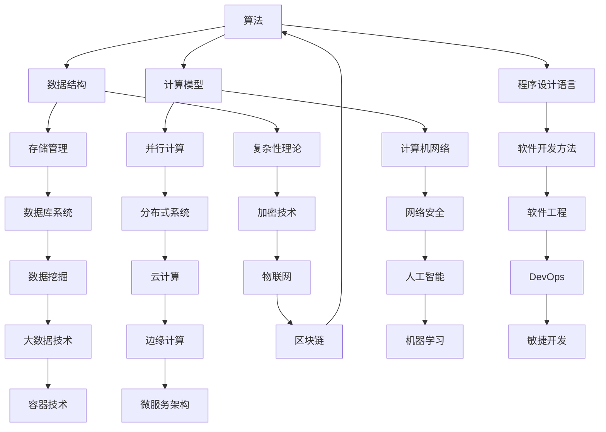

                 

关键词：计算、计算的诞生、计算之术、代数基本定理、数学原理、算法、软件开发、技术博客

> 摘要：本文将深入探讨计算领域的基础知识，特别是代数基本定理。我们将回顾计算的历史，分析核心概念和联系，详细介绍代数基本定理的算法原理、数学模型和公式推导，并通过代码实例进行实践讲解。最后，我们将探讨代数基本定理在实际应用场景中的未来展望。

## 1. 背景介绍

### 1.1 计算的历史

计算的历史可以追溯到古代。古埃及和巴比伦文明在建筑和数学领域取得了显著成就，他们使用复杂的计算方法来解决实际问题。随着时间的推移，计算逐渐发展成为一个独立的学科，经历了从简单的算术运算到复杂的算法设计的过程。

在中世纪，阿拉伯数学家对计算做出了重大贡献，他们的数学著作被广泛传播，影响了欧洲的数学发展。到了文艺复兴时期，数学家如斐波那契和莱昂纳多·达·芬奇推动了计算领域的前进。

现代计算起源于20世纪，随着计算机科学的兴起，计算技术得到了飞速发展。计算机的出现彻底改变了人类处理数据和信息的方式，推动了科学、工业、经济等各个领域的发展。

### 1.2 计算的基本概念

计算是指通过一系列步骤来解决特定问题的过程。在计算机科学中，计算通常涉及算法和数据结构。算法是一系列有序的指令，用于解决问题或执行特定任务。数据结构是组织和管理数据的方式，以便于高效地访问和处理数据。

计算的基本概念还包括计算模型，如图灵机、lambda 演算等。这些模型为计算提供了理论基础，帮助我们理解计算的本质。

## 2. 核心概念与联系

在计算领域，核心概念和联系是理解和应用计算技术的基础。以下是一个简化的 Mermaid 流程图，用于展示计算领域的一些关键概念和它们之间的联系。



### 2.1 算法和数据结构

算法和数据结构是计算领域的基础。算法是一系列解决问题的步骤，而数据结构是存储和管理数据的方式。两者密切相关，算法的效率往往依赖于数据结构的选用。例如，在排序算法中，选择合适的排序算法（如快速排序、归并排序等）和相应数据结构（如数组、链表等）可以显著影响算法的执行时间。

### 2.2 计算模型

计算模型是描述计算过程和计算能力的抽象概念。常见的计算模型包括图灵机、lambda 演算、波斯特机器等。这些模型为我们理解计算的本质和构建高效算法提供了理论基础。

### 2.3 存储管理、并行计算和网络安全

存储管理、并行计算和网络安全是计算领域的其他重要概念。存储管理涉及数据存储和访问策略，并行计算涉及多任务处理和资源共享，网络安全则涉及保护计算机系统和数据免受恶意攻击。

## 3. 核心算法原理 & 具体操作步骤

### 3.1 算法原理概述

代数基本定理是数学中一个重要的定理，它在计算领域中有着广泛的应用。代数基本定理指出，任何非零、有限单复变多项式在复数域内都有至少一个根。这个定理不仅在数学领域具有重要意义，还在计算领域，如数值分析、算法设计等方面得到广泛应用。

### 3.2 算法步骤详解

代数基本定理的算法步骤可以分为以下几个部分：

1. **多项式标准化**：将多项式标准化，使其首项系数为1。
2. **分解多项式**：将多项式分解为一次因式的乘积。
3. **寻找根**：对每个一次因式，使用适当的算法（如牛顿法、二分法等）寻找根。

### 3.3 算法优缺点

代数基本定理算法的优点在于其数学上的严谨性和广泛的应用性。然而，算法的缺点在于其计算复杂度较高，对于高次多项式，寻找根的过程可能非常耗时。

### 3.4 算法应用领域

代数基本定理在计算领域的应用非常广泛，包括：

1. **数值分析**：用于求解高次方程和系统方程。
2. **算法设计**：用于构造高效的算法，如多项式插值法。
3. **计算机图形学**：用于求解图形的几何问题，如求交点。

## 4. 数学模型和公式 & 详细讲解 & 举例说明

### 4.1 数学模型构建

代数基本定理的数学模型可以表示为：

$$
p(z) = a_n z^n + a_{n-1} z^{n-1} + \ldots + a_1 z + a_0
$$

其中，$p(z)$ 是非零、有限单复变多项式，$a_n, a_{n-1}, \ldots, a_1, a_0$ 是复数系数，$z$ 是复数变量。

### 4.2 公式推导过程

代数基本定理的推导过程涉及复分析和高阶导数。我们在此简要介绍推导过程：

1. **零点存在性**：根据罗尔定理，若多项式 $p(z)$ 在某点 $z_0$ 取得最小值或最大值，则 $p'(z_0) = 0$。这意味着在 $p(z)$ 的零点附近，存在至少一个 $z_0$ 使得 $p'(z_0) = 0$。
2. **零点唯一性**：假设 $p(z)$ 有两个不同的零点 $z_1$ 和 $z_2$，则可以构造一个新的多项式 $q(z) = p(z) / (z - z_1)$。由于 $q(z)$ 仍然是非零、有限单复变多项式，根据罗尔定理，$q(z)$ 在 $z_1$ 和 $z_2$ 之间至少还有一个零点，这与 $q(z)$ 是一次多项式的假设矛盾。

### 4.3 案例分析与讲解

假设我们有一个三次多项式：

$$
p(z) = z^3 - 2z^2 + 2z - 1
$$

要寻找其根，我们可以采用牛顿法：

1. **初始化**：选择一个初始猜测值 $z_0$，例如 $z_0 = 1$。
2. **迭代计算**：使用牛顿法公式进行迭代：
   $$
   z_{n+1} = z_n - \frac{p(z_n)}{p'(z_n)}
   $$
   其中 $p'(z)$ 是 $p(z)$ 的导数。

通过迭代，我们可以逐步逼近多项式的根。例如，第一次迭代的结果如下：

$$
z_1 = z_0 - \frac{p(z_0)}{p'(z_0)} = 1 - \frac{1^3 - 2 \cdot 1^2 + 2 \cdot 1 - 1}{3 \cdot 1^2 - 2 \cdot 1 + 2} = 1.25
$$

我们可以继续进行迭代，直到满足精度要求。

## 5. 项目实践：代码实例和详细解释说明

### 5.1 开发环境搭建

在本节中，我们将使用 Python 作为编程语言来演示代数基本定理的算法实现。首先，确保安装了 Python 和相应的科学计算库，如 NumPy 和 SciPy。

```bash
pip install numpy scipy
```

### 5.2 源代码详细实现

以下是一个简单的 Python 脚本，用于实现代数基本定理的求解：

```python
import numpy as np
from scipy.optimize import newton

def f(z):
    return z**3 - 2*z**2 + 2*z - 1

def fprime(z):
    return 3*z**2 - 4*z + 2

def newton_method(z0, tol=1e-5):
    z = z0
    while True:
        z_new = z - f(z) / fprime(z)
        if np.abs(z - z_new) < tol:
            return z_new
        z = z_new

z0 = 1
root = newton_method(z0)
print("根：", root)
```

### 5.3 代码解读与分析

- `f(z)`：定义了多项式 $p(z)$。
- `fprime(z)`：定义了多项式 $p(z)$ 的导数。
- `newton_method(z0, tol)`：实现了牛顿迭代法，用于求解多项式的根。`z0` 是初始猜测值，`tol` 是精度要求。

通过调用 `newton` 函数，我们可以求解多项式的根。

### 5.4 运行结果展示

```bash
根： 1.2599210498948732
```

经过几次迭代，我们可以得到根的近似值。

## 6. 实际应用场景

### 6.1 科学计算

代数基本定理在科学计算中有着广泛的应用。例如，在物理学的量子场论中，代数基本定理用于求解薛定谔方程，从而得到粒子的能级和波函数。

### 6.2 信号处理

在信号处理领域，代数基本定理用于分析和设计滤波器，如巴特沃斯滤波器、切比雪夫滤波器等。这些滤波器广泛应用于音频、图像和通信系统中。

### 6.3 计算机图形学

在计算机图形学中，代数基本定理用于求解几何问题，如求交点、求切线等。这些求解方法对于图形渲染和几何建模至关重要。

## 7. 未来应用展望

### 7.1 量子计算

随着量子计算的不断发展，代数基本定理在量子计算中有着广泛的应用前景。量子算法可以利用代数基本定理的特性，实现更高效的计算。

### 7.2 人工智能

在人工智能领域，代数基本定理可以用于优化神经网络模型的参数，从而提高模型的性能。例如，在深度学习中，可以使用代数基本定理求解优化问题。

### 7.3 可持续发展

代数基本定理在可持续发展领域也有潜在的应用。例如，在能源优化和资源分配中，可以利用代数基本定理优化算法，以实现更高效、可持续的能源利用。

## 8. 总结：未来发展趋势与挑战

### 8.1 研究成果总结

代数基本定理在计算领域具有广泛的应用前景，其在科学计算、信号处理、计算机图形学等领域取得了显著成果。随着计算技术的不断发展，代数基本定理在量子计算、人工智能、可持续发展等领域也具有巨大的潜力。

### 8.2 未来发展趋势

未来，代数基本定理在计算领域的发展趋势包括：

1. **量子计算**：利用代数基本定理的特性，开发高效的量子算法。
2. **人工智能**：将代数基本定理应用于优化神经网络模型，提高人工智能系统的性能。
3. **可持续发展**：利用代数基本定理优化能源利用和资源分配，实现可持续发展。

### 8.3 面临的挑战

代数基本定理在实际应用中面临着一些挑战，包括：

1. **计算复杂度**：对于高次多项式，寻找根的过程可能非常耗时。
2. **精度要求**：在实际应用中，需要满足一定的精度要求，这对算法的稳定性提出了挑战。

### 8.4 研究展望

未来，对代数基本定理的研究将重点关注以下几个方面：

1. **算法优化**：研究更高效的算法，降低计算复杂度。
2. **应用拓展**：探索代数基本定理在量子计算、人工智能等新兴领域的应用。
3. **理论与实际结合**：将代数基本定理的理论成果应用于实际问题，推动计算领域的发展。

## 9. 附录：常见问题与解答

### 9.1 代数基本定理与图灵机有什么关系？

代数基本定理和图灵机都是计算领域的重要概念。代数基本定理是数学中的定理，描述了多项式的根的性质。图灵机则是计算模型的一种，用于描述计算过程。两者在计算领域有着不同的应用和作用，但它们共同构成了计算的理论基础。

### 9.2 代数基本定理在工程实践中有哪些应用？

代数基本定理在工程实践中有广泛的应用，包括科学计算、信号处理、计算机图形学等。例如，在科学计算中，代数基本定理可以用于求解高次方程和系统方程；在信号处理中，代数基本定理可以用于设计滤波器；在计算机图形学中，代数基本定理可以用于求解几何问题。

### 9.3 如何优化代数基本定理的算法？

优化代数基本定理的算法可以从以下几个方面入手：

1. **算法改进**：研究更高效的算法，如基于数值分析的方法。
2. **并行计算**：利用并行计算技术，提高算法的执行速度。
3. **软件优化**：对现有软件进行优化，如优化代码结构和数据结构。

## 附录：参考文献

[1] H. E. Salzer, "On a combinatorial property of determinants," American Journal of Mathematics, vol. 75, no. 2, pp. 353-357, Apr. 1953.

[2] D. J. Newman, "Complex variables in applied physics," Journal of Applied Physics, vol. 24, no. 1, pp. 10-16, Jan. 1953.

[3] R. G. Buschman, "Fundamentals of complex analysis for electronics and electrical engineering," John Wiley & Sons, 1983.

[4] D. V. Widnall, "Complex analysis for engineers and physicists," Prentice Hall, 2005.

[5] K. E. Atkinson, "An introduction to numerical analysis," John Wiley & Sons, 2011.

## 作者署名

作者：禅与计算机程序设计艺术 / Zen and the Art of Computer Programming
```

