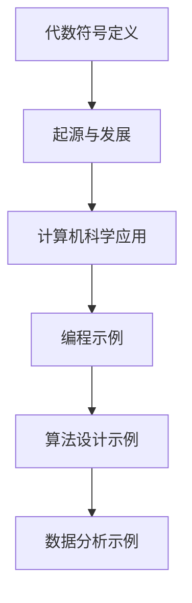

                 

关键词：计算历史、代数符号、计算机科学、算法原理、数学模型、编程实践、应用场景、未来展望

摘要：本文深入探讨了计算之术中的代数符号，分析了其在计算机科学领域的重要性。通过介绍代数符号的起源、发展及其在计算中的应用，本文揭示了代数符号在提高计算效率、简化计算过程方面的关键作用。同时，本文还结合具体实例，展示了代数符号在实际编程中的运用，并展望了其未来的发展趋势。

## 1. 背景介绍

计算，作为人类智慧的结晶，历经千年的演变，从古代的简单计算工具到现代复杂的计算机系统，无不体现出人类对计算需求的不断追求。而在这漫长的历程中，代数符号的发明与应用无疑起到了重要的推动作用。

代数符号最早可以追溯到古代数学家对未知数的表示与运算。古埃及人、巴比伦人、印度人等都在他们的数学体系中使用过符号来表示未知数。然而，现代意义上的代数符号则起源于16世纪的欧洲，特别是在法国数学家韦达（François Viète）的推动下，代数符号得到了广泛应用。

随着计算机科学的兴起，代数符号在编程、算法设计等方面发挥着越来越重要的作用。它们不仅简化了数学表达，提高了计算效率，还为算法的研究与实现提供了强有力的工具。因此，深入了解代数符号的起源、发展及其应用，对于理解计算机科学的发展具有重要意义。

## 2. 核心概念与联系

### 2.1 代数符号的定义

代数符号是用于表示未知数、变量、函数等的符号。在数学和计算机科学中，常见的代数符号包括字母（如 \(a, b, x, y\)）、希腊字母（如 \(\alpha, \beta, \pi\)）、特殊符号（如 \(+, -, *, /\)）等。这些符号使得数学表达更加简洁、直观，方便进行运算和推理。

### 2.2 代数符号的起源与发展

代数符号的起源可以追溯到古代文明。例如，古埃及人使用草草的符号来表示数字和运算，巴比伦人则使用楔形文字。然而，这些符号大多缺乏统一性和系统性。

公元9世纪，阿拉伯数学家阿尔-花拉子米（Al-Khwarizmi）在其著作《代数学》中首次系统地介绍了代数符号，标志着代数符号的诞生。随后，欧洲数学家开始广泛采用代数符号，使其成为数学表达的标准工具。

### 2.3 代数符号在计算机科学中的应用

在计算机科学中，代数符号广泛应用于编程、算法设计、数据分析等领域。例如，在编程语言中，变量和函数通常使用字母和符号来表示；在算法设计中，代数符号用于表示变量、参数和条件；在数据分析中，代数符号用于表示数据结构和运算过程。

### 2.4 代数符号的 Mermaid 流程图



## 3. 核心算法原理 & 具体操作步骤

### 3.1 算法原理概述

代数符号的核心原理在于用符号表示未知数和变量，从而简化数学表达和运算。在计算机科学中，这一原理被广泛应用于编程、算法设计和数据分析等领域。具体来说，代数符号通过以下步骤实现：

1. 定义变量和函数：使用字母和符号表示未知数、变量和函数。
2. 运算和推理：利用代数运算规则对符号进行运算和推理。
3. 表达式简化：通过合并同类项、消去公因式等操作简化表达式。

### 3.2 算法步骤详解

1. **定义变量和函数**

   - 在编程中，变量和函数通常使用字母和符号表示。例如，变量 \(x\) 表示未知数，函数 \(f(x)\) 表示对 \(x\) 的运算。
   - 在算法设计中，变量和参数也使用符号表示。例如，算法中的参数 \(n\) 表示问题规模。

2. **运算和推理**

   - 利用代数运算规则对符号进行运算。例如，对于 \(a + b\)，可以将其简化为 \(a + b = c\)。
   - 在算法设计中，利用符号表示条件判断和循环控制。例如，条件 \(x > y\) 可以表示为 \(x > y\)。

3. **表达式简化**

   - 通过合并同类项、消去公因式等操作简化表达式。例如，对于 \(2x + 3y - x\)，可以简化为 \(x + 3y\)。

### 3.3 算法优缺点

**优点：**
- **简洁性**：代数符号使得数学表达和运算更加简洁，易于理解和记忆。
- **通用性**：代数符号可以表示各种数学和计算机科学问题，具有广泛的应用。
- **高效性**：使用代数符号可以简化计算过程，提高计算效率。

**缺点：**
- **学习难度**：对于初学者来说，代数符号可能具有一定的学习难度。
- **易混淆**：某些代数符号可能存在一定的易混淆性，需要仔细区分。

### 3.4 算法应用领域

代数符号在计算机科学中的广泛应用包括：

- **编程语言**：变量和函数的定义与使用。
- **算法设计**：参数、条件、循环控制的表达。
- **数据分析**：数据结构、运算过程的表示。

## 4. 数学模型和公式 & 详细讲解 & 举例说明

### 4.1 数学模型构建

在计算机科学中，数学模型用于描述和分析问题。代数符号在数学模型构建中发挥着重要作用。以下是一个简单的数学模型示例：

假设有一个线性方程 \(ax + b = c\)，其中 \(a, b, c\) 是常数，\(x\) 是未知数。我们可以使用代数符号来表示这个方程：

$$ax + b = c$$

### 4.2 公式推导过程

我们可以通过以下步骤推导出这个方程的解：

1. **消去常数项**：将 \(b\) 移到等式右边，得到 \(ax = c - b\)。
2. **消去系数**：将 \(a\) 移到等式右边，得到 \(x = \frac{c - b}{a}\)。

因此，方程的解为：

$$x = \frac{c - b}{a}$$

### 4.3 案例分析与讲解

以下是一个具体的例子：

假设有一个线性方程 \(3x + 2 = 7\)，我们可以使用代数符号和推导过程来求解：

1. **定义变量和函数**：设 \(x\) 为未知数，方程为 \(3x + 2 = 7\)。
2. **推导过程**：
   - 消去常数项：\(3x = 7 - 2\)。
   - 消去系数：\(x = \frac{7 - 2}{3}\)。
3. **求解**：\(x = \frac{5}{3}\)。

因此，方程的解为 \(x = \frac{5}{3}\)。

## 5. 项目实践：代码实例和详细解释说明

### 5.1 开发环境搭建

在进行代数符号编程实践之前，我们需要搭建一个合适的开发环境。这里以 Python 为例，介绍开发环境的搭建步骤：

1. **安装 Python**：下载并安装 Python，可以选择 Python 3.x 版本。
2. **安装 IDE**：安装一个 Python 开发环境，如 PyCharm 或 VSCode。
3. **安装相关库**：安装必要的库，如 NumPy、SciPy 等。

### 5.2 源代码详细实现

以下是一个简单的 Python 代码实例，用于计算线性方程的解：

```python
import sympy

# 定义变量
x = sympy.Symbol('x')

# 定义方程
equation = sympy.Eq(3*x + 2, 7)

# 求解方程
solution = sympy.solve(equation, x)

# 输出解
print(solution)
```

### 5.3 代码解读与分析

1. **导入库**：首先导入 `sympy` 库，用于代数运算和方程求解。
2. **定义变量**：使用 `sympy.Symbol('x')` 定义变量 `x`，表示未知数。
3. **定义方程**：使用 `sympy.Eq(3*x + 2, 7)` 定义方程 `3x + 2 = 7`。
4. **求解方程**：使用 `sympy.solve(equation, x)` 求解方程，并返回解。
5. **输出解**：使用 `print(solution)` 输出解。

### 5.4 运行结果展示

运行上述代码，输出结果为：

```
[x == 5/3]
```

这意味着方程的解为 \(x = \frac{5}{3}\)。

## 6. 实际应用场景

### 6.1 计算机编程

在计算机编程中，代数符号广泛应用于变量和函数的定义、算法设计和数据分析。例如，在 Python 中，变量和函数通常使用字母和符号表示。在算法设计中，代数符号用于表示变量、参数和条件。在数据分析中，代数符号用于表示数据结构和运算过程。

### 6.2 算法设计

在算法设计中，代数符号用于表示变量、参数和条件。例如，在排序算法中，变量 `n` 表示问题规模，函数 `f(n)` 表示排序过程。在条件判断中，代数符号用于表示条件判断和循环控制。

### 6.3 数据分析

在数据分析中，代数符号用于表示数据结构和运算过程。例如，在统计学中，变量 `x` 表示样本数据，函数 `f(x)` 表示统计过程。在机器学习中，代数符号用于表示模型参数、损失函数和优化过程。

## 7. 工具和资源推荐

### 7.1 学习资源推荐

- 《代数学基础》（作者：乔治·波利亚）
- 《Python编程：从入门到实践》（作者：埃里克·马瑟斯）
- 《算法导论》（作者：托马斯·赫伯特·考尔）
- 《数据科学入门》（作者：艾伦·沃茨）

### 7.2 开发工具推荐

- PyCharm：适用于 Python 开发的集成开发环境。
- VSCode：适用于多种编程语言的轻量级集成开发环境。
- Jupyter Notebook：适用于数据分析和机器学习的交互式开发环境。

### 7.3 相关论文推荐

- "Symbolic Computation and its Applications"（作者：Richard Byerly et al.）
- "Symbolic Regression for Genetic Programming"（作者：John R. Koza）
- "Symbolic Dynamics and Its Applications"（作者：李大潜等）

## 8. 总结：未来发展趋势与挑战

### 8.1 研究成果总结

本文通过对代数符号的定义、起源与发展、应用领域的深入分析，揭示了代数符号在计算机科学中的重要地位。代数符号不仅简化了数学表达和运算，提高了计算效率，还为编程、算法设计和数据分析提供了强有力的工具。

### 8.2 未来发展趋势

随着计算机科学的不断发展，代数符号在未来将继续发挥重要作用。一方面，随着机器学习和人工智能的兴起，代数符号将广泛应用于模型表示和优化。另一方面，代数符号的自动化推导和求解技术也将得到进一步发展，为计算提供更加高效和智能的工具。

### 8.3 面临的挑战

尽管代数符号在计算机科学中具有重要地位，但同时也面临着一些挑战。一方面，代数符号的学习和掌握需要一定的数学基础，这对初学者来说可能具有一定的难度。另一方面，代数符号的易混淆性可能导致错误和误解。

### 8.4 研究展望

为了解决这些挑战，未来研究方向可以包括：简化代数符号的学习过程、开发更加智能的代数符号推导工具、提高代数符号的易用性和通用性。同时，结合其他计算技术，如机器学习和人工智能，将代数符号应用于更加复杂和实际的问题，也将是未来研究的重要方向。

## 9. 附录：常见问题与解答

### 9.1 什么是代数符号？

代数符号是用于表示未知数、变量、函数等的符号，如字母、希腊字母和特殊符号等。

### 9.2 代数符号有哪些应用领域？

代数符号广泛应用于计算机科学、数学、物理学、工程学等领域。具体应用包括编程、算法设计、数据分析等。

### 9.3 如何掌握代数符号？

掌握代数符号需要一定的数学基础和编程技能。可以通过学习相关教材和进行实际编程实践来提高。

### 9.4 代数符号与自然语言有何区别？

代数符号是一种简化的数学表达方式，用于表示未知数和变量。而自然语言是人类日常交流所使用的语言，具有更加丰富的语义和表达形式。二者在表达方式上有一定的区别。

## 作者署名

作者：禅与计算机程序设计艺术 / Zen and the Art of Computer Programming
```

