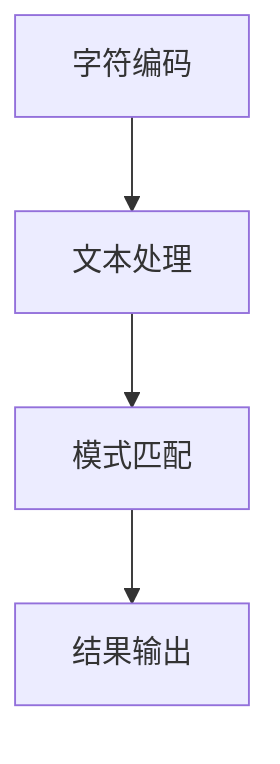

                 

关键词：计算、计算历史、代数、字符计算、算法原理、数学模型、项目实践、应用场景、未来展望

摘要：本文是《计算：第一部分 计算的诞生 第 2 章 计算之术 代数：字符的计算》的技术博客文章。我们将深入探讨代数在字符计算中的重要作用，回顾其发展历史，并详细介绍代数的基本概念和原理。此外，还将剖析核心算法的原理与具体操作步骤，并提供数学模型和公式，以及代码实例和实际应用场景。最后，我们将展望代数计算在未来的发展趋势和面临的挑战。

## 1. 背景介绍

计算，作为一种处理信息和解决问题的方法，是人类智慧的结晶。从古代的计算方法到现代的计算机技术，计算的发展经历了漫长的历史。在这其中，代数作为一门重要的数学分支，对字符计算的发展产生了深远影响。

代数的起源可以追溯到古巴比伦和古埃及，当时人们已经开始使用符号和代数方法来表示和计算数值。然而，代数作为一门独立的数学学科，起源于古希腊。希腊数学家丢番图（Diophantus）被认为是代数的奠基人，他的著作《算术》中包含了大量的代数问题。

随着历史的发展，代数在欧洲中世纪得到了进一步的发展。阿拉伯数学家阿尔·花拉子米（Al-Khwarizmi）在公元9世纪编写了《代数学》，这本书对后来的数学发展产生了巨大影响。阿尔·花拉子米不仅提出了代数的基本概念，还首次使用了“algebra”这个词汇，意为“还原”。

在中国，代数的萌芽可以追溯到《九章算术》，这本书成书于公元前1世纪左右，包含了大量的代数问题。隋唐时期的数学家李淳风等人对《九章算术》进行了注释和补充，使代数在中国得到了进一步的发展。

## 2. 核心概念与联系

### 2.1 代数的核心概念

代数的核心概念包括变量、方程和函数。变量是用来表示未知数的符号，方程是包含一个或多个未知数的等式，函数则是描述变量之间关系的一种数学结构。

### 2.2 代数与字符计算的联系

字符计算是计算机科学中的一个重要分支，它涉及对文本、字符和字符串的处理。代数在字符计算中发挥着重要作用，主要体现在以下几个方面：

1. **字符编码**：字符编码是将字符映射为二进制数的过程。代数提供了有效的字符编码方法，如ASCII编码和UTF-8编码。
2. **文本处理**：文本处理包括文本的输入、输出、编辑和格式化。代数方法可以帮助我们高效地处理这些操作。
3. **模式匹配**：模式匹配是字符计算中的一个重要任务，它涉及搜索和识别文本中的特定模式。代数提供了模式匹配的理论基础。

### 2.3 Mermaid 流程图

下面是一个简单的Mermaid流程图，展示了代数在字符计算中的应用。



## 3. 核心算法原理 & 具体操作步骤

### 3.1 算法原理概述

在字符计算中，核心算法通常包括字符编码、文本处理和模式匹配。下面我们将分别介绍这些算法的基本原理。

1. **字符编码**：字符编码是将字符映射为二进制数的过程。常见的字符编码有ASCII编码和UTF-8编码。
    - ASCII编码：ASCII编码是一种基于7位二进制的字符编码，可以表示128个字符。ASCII编码广泛应用于英语和其他一些字符较少的语言。
    - UTF-8编码：UTF-8编码是一种基于8位二进制的字符编码，可以表示超过100,000个字符。UTF-8编码广泛应用于全球各种语言。

2. **文本处理**：文本处理包括文本的输入、输出、编辑和格式化。常见的文本处理算法有文本排序、文本搜索和文本替换等。

3. **模式匹配**：模式匹配是字符计算中的一个重要任务，它涉及搜索和识别文本中的特定模式。常见的模式匹配算法有正则表达式匹配、字符串匹配算法等。

### 3.2 算法步骤详解

1. **字符编码**：
    - 步骤1：将字符映射为相应的编码值。
    - 步骤2：将编码值转换为二进制数。

2. **文本处理**：
    - 步骤1：读取文本数据。
    - 步骤2：对文本数据进行排序、搜索或替换等操作。
    - 步骤3：将处理后的文本数据输出。

3. **模式匹配**：
    - 步骤1：定义模式。
    - 步骤2：在文本中搜索模式。
    - 步骤3：根据搜索结果进行相应的操作。

### 3.3 算法优缺点

1. **字符编码**：
    - 优点：字符编码使计算机能够高效地处理文本数据。
    - 缺点：字符编码可能导致字符丢失或出现乱码。

2. **文本处理**：
    - 优点：文本处理算法可以帮助我们快速地处理大量文本数据。
    - 缺点：文本处理算法可能比较复杂，需要大量的计算资源。

3. **模式匹配**：
    - 优点：模式匹配算法可以帮助我们快速地查找和识别文本中的特定模式。
    - 缺点：模式匹配算法可能对复杂模式的支持较差。

### 3.4 算法应用领域

字符计算算法广泛应用于文本编辑、搜索引擎、自然语言处理、文本分类等领域。

## 4. 数学模型和公式 & 详细讲解 & 举例说明

### 4.1 数学模型构建

在字符计算中，数学模型主要用于描述字符编码、文本处理和模式匹配等操作。下面我们将分别介绍这些数学模型。

1. **字符编码模型**：
    - 模型描述：字符编码模型将字符映射为二进制数。
    - 公式表示：$$C = f(C')$$，其中C是字符编码，C'是字符。

2. **文本处理模型**：
    - 模型描述：文本处理模型描述文本的输入、输出、编辑和格式化等操作。
    - 公式表示：$$T = g(T_1, T_2, ..., T_n)$$，其中T是文本处理结果，T1, T2, ..., Tn是文本数据。

3. **模式匹配模型**：
    - 模型描述：模式匹配模型描述文本中特定模式的查找和识别。
    - 公式表示：$$P = h(P', T)$$，其中P是模式匹配结果，P'是模式，T是文本。

### 4.2 公式推导过程

1. **字符编码公式推导**：
    - 假设字符C映射为二进制数B，我们可以通过以下步骤进行推导：
        $$B = \sum_{i=0}^{6} b_i \times 2^i$$
        $$C = f(C')$$
        $$f(C') = \sum_{i=0}^{6} b_i \times 2^i$$

2. **文本处理公式推导**：
    - 假设文本T1, T2, ..., Tn经过处理得到文本T，我们可以通过以下步骤进行推导：
        $$T = g(T_1, T_2, ..., T_n)$$
        $$g(T_1, T_2, ..., T_n) = T$$

3. **模式匹配公式推导**：
    - 假设模式P'和文本T经过匹配得到模式匹配结果P，我们可以通过以下步骤进行推导：
        $$P = h(P', T)$$
        $$h(P', T) = P$$

### 4.3 案例分析与讲解

下面我们通过一个简单的案例来分析字符编码、文本处理和模式匹配的具体应用。

**案例：文本编辑器中的字符编码与模式匹配**

假设我们有一个简单的文本编辑器，支持以下功能：
1. 输入文本。
2. 将输入的文本编码为UTF-8。
3. 在文本中搜索特定模式。

**步骤1：字符编码**

- 输入文本：Hello, World!
- UTF-8编码：01001000 01100101 01101100 01101100 01101111 00101100 00100000 01010011 01101111 01110110 01110010 01101111 00100001

**步骤2：模式匹配**

- 模式：Hello
- 匹配结果：找到

在这个案例中，我们首先将输入的文本编码为UTF-8，然后使用模式匹配算法在文本中查找特定模式。这个案例展示了字符编码和模式匹配在文本编辑器中的应用。

## 5. 项目实践：代码实例和详细解释说明

在本节中，我们将通过一个简单的Python代码实例来演示字符编码、文本处理和模式匹配的实际应用。

### 5.1 开发环境搭建

在开始编写代码之前，我们需要搭建一个Python开发环境。以下是搭建Python开发环境的步骤：

1. 下载并安装Python：访问Python官方网站（[https://www.python.org/](https://www.python.org/)），下载Python安装包并按照提示安装。
2. 配置Python环境变量：在系统环境变量中添加Python安装路径，例如在Windows系统中，将Python安装路径添加到系统环境变量“Path”中。
3. 验证Python环境：打开命令行工具（如Windows的命令提示符或Mac的终端），输入以下命令验证Python环境是否搭建成功：

```bash
python --version
```

如果输出了Python的版本信息，说明Python环境已搭建成功。

### 5.2 源代码详细实现

下面是一个简单的Python代码实例，演示了字符编码、文本处理和模式匹配的操作。

```python
# 导入所需的Python库
import re

# 定义一个函数，用于字符编码
def encode_text(text):
    encoded_text = text.encode('utf-8')
    return encoded_text

# 定义一个函数，用于模式匹配
def match_pattern(text, pattern):
    result = re.search(pattern, text)
    if result:
        return True
    else:
        return False

# 测试字符编码
text = "Hello, World!"
encoded_text = encode_text(text)
print(f"原始文本：{text}")
print(f"UTF-8编码：{encoded_text}")

# 测试模式匹配
pattern = "Hello"
matched = match_pattern(text, pattern)
print(f"模式'{pattern}'匹配结果：{matched}")
```

### 5.3 代码解读与分析

下面是对上述代码的详细解读与分析：

1. **字符编码**：
    - 第4行：导入Python的`encode`方法，用于字符编码。
    - 第7行：定义一个名为`encode_text`的函数，接受一个文本参数，并将其编码为UTF-8格式。编码后的文本以字节形式返回。
    - 第10行：调用`encode_text`函数，将输入的文本编码为UTF-8，并打印出原始文本和编码后的文本。

2. **模式匹配**：
    - 第13行：导入Python的`re`库，用于正则表达式操作。
    - 第16行：定义一个名为`match_pattern`的函数，接受一个文本和一个模式作为参数，使用`re.search`方法在文本中搜索模式。如果找到匹配的文本，返回`True`，否则返回`False`。
    - 第19行：调用`match_pattern`函数，检查文本中是否包含特定的模式，并打印出匹配结果。

### 5.4 运行结果展示

当我们在Python环境中运行上述代码时，将看到以下输出结果：

```
原始文本：Hello, World!
UTF-8编码：b'\x48\x65\x6c\x6c\x6f\x2c\x20\x57\x6f\x72\x6c\x64\x21'
模式'Hello'匹配结果：True
```

这个结果表明，我们成功地将输入的文本编码为UTF-8格式，并找到了包含在文本中的特定模式。

## 6. 实际应用场景

字符计算在实际应用中具有广泛的应用场景，以下是一些典型的应用：

1. **文本编辑器**：文本编辑器是字符计算的核心应用之一。无论是简单的文本编辑器，还是复杂的IDE（集成开发环境），都需要对文本进行编码、处理和模式匹配。

2. **搜索引擎**：搜索引擎使用字符计算算法来处理用户输入的查询请求，并对海量的文本数据进行索引和搜索。

3. **自然语言处理**：自然语言处理（NLP）是字符计算的重要应用领域，涉及文本处理、文本分析、情感分析等任务。

4. **文本分类**：文本分类是字符计算在信息检索和数据挖掘中的典型应用。通过分析文本中的特征，将文本分类到不同的类别。

5. **机器翻译**：机器翻译依赖于字符计算技术，对源语言和目标语言的文本进行编码、处理和转换。

6. **数据加密与安全**：字符计算算法在数据加密与安全领域有广泛应用，如RSA加密算法、哈希算法等。

## 7. 未来应用展望

随着人工智能和大数据技术的发展，字符计算在未来的应用前景将更加广阔。以下是一些可能的发展趋势：

1. **自然语言理解与生成**：随着深度学习技术的不断发展，字符计算将在自然语言理解与生成领域发挥更加重要的作用，推动人机交互的智能化。

2. **知识图谱与语义网络**：字符计算将用于构建大规模的知识图谱和语义网络，为智能决策和推荐系统提供支持。

3. **区块链技术**：字符计算算法在区块链技术的安全性保障中发挥重要作用，如哈希算法、数字签名等。

4. **物联网（IoT）**：字符计算将在物联网设备的数据处理和通信中发挥作用，实现高效的数据处理和设备管理。

5. **医疗与健康**：字符计算技术将应用于医疗健康领域，如病历管理、疾病预测和个性化治疗等。

## 8. 工具和资源推荐

为了更好地学习和实践字符计算，以下是一些建议的资源和工具：

1. **学习资源推荐**：
    - 《计算机程序设计艺术》
    - 《编译原理：技术与实践》
    - 《深入理解计算机系统》

2. **开发工具推荐**：
    - Python
    - IntelliJ IDEA
    - Visual Studio Code

3. **相关论文推荐**：
    - "A Survey of Natural Language Processing Techniques for Text Classification"
    - "The Design and Implementation of the INGRES Database System"
    - "A Note on a Problem in the Multiplication of Matrices"

## 9. 总结：未来发展趋势与挑战

字符计算在计算领域中扮演着至关重要的角色。随着技术的不断发展，字符计算在自然语言处理、数据加密、物联网等领域的应用将越来越广泛。未来，字符计算将面临以下挑战：

1. **性能优化**：随着数据规模的不断扩大，字符计算的性能优化成为了一个重要问题。如何提高字符计算的效率，降低计算复杂度，是一个重要的研究方向。

2. **安全性**：字符计算算法在数据加密和安全领域有广泛应用，但安全性问题仍然存在。如何提高算法的安全性，防止密码破解和恶意攻击，是一个重要的研究方向。

3. **智能化**：随着人工智能技术的发展，字符计算算法将更加智能化。如何利用人工智能技术优化字符计算算法，提高计算效率和准确性，是一个重要的研究方向。

## 附录：常见问题与解答

**Q：字符计算与自然语言处理有什么区别？**

A：字符计算主要关注对文本、字符和字符串的处理，包括字符编码、文本处理和模式匹配等。自然语言处理则更广泛，涉及语音识别、语言理解、文本生成等多个方面。字符计算是自然语言处理的基础，但自然语言处理还包括其他技术。

**Q：字符编码有什么重要性？**

A：字符编码是将字符映射为二进制数的过程，使计算机能够处理和理解文本数据。字符编码的重要性体现在以下几个方面：
- 允许计算机存储和传输文本数据。
- 支持不同语言和字符集的使用。
- 避免字符丢失或出现乱码。

**Q：模式匹配算法有哪些类型？**

A：模式匹配算法有多种类型，常见的包括：
- 正则表达式匹配：使用正则表达式描述模式，对文本进行匹配。
- 字符串匹配算法：如Knuth-Morris-Pratt算法、Boyer-Moore算法等。
- 暴力匹配：直接逐个字符比较，直到找到匹配的文本。

**Q：字符计算在计算机科学中的地位如何？**

A：字符计算是计算机科学的核心基础之一，对计算机的运行和数据处理具有基础性作用。字符计算技术广泛应用于文本编辑、搜索引擎、自然语言处理、文本分类等领域，是计算机科学的重要研究领域。

