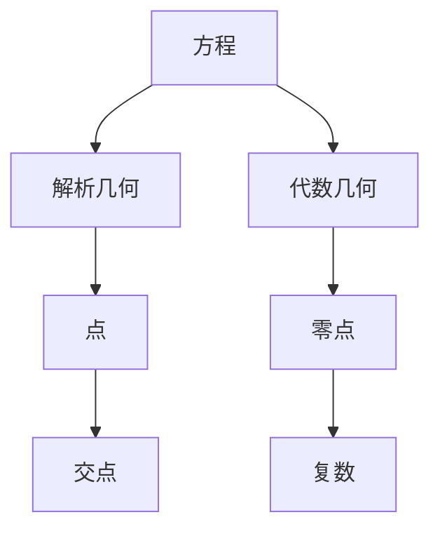

                 

关键词：计算之术、方程根、算法、数学模型、应用场景

摘要：本文深入探讨了计算的基本术，尤其是方程根的结构，以及它们在计算机科学中的重要性。文章首先回顾了计算的起源，然后详细阐述了方程根的基本概念，包括它们的数学模型和公式。接着，我们通过具体实例分析了这些概念的实际应用，最后展望了未来在计算之术领域的发展趋势和挑战。

## 1. 背景介绍

计算是现代技术的核心，它几乎渗透到了我们日常生活的方方面面。从简单的电子计算器到复杂的超级计算机，计算技术的发展不仅改变了我们的生活方式，也推动了科学、经济和文化的进步。然而，计算的起源可以追溯到更遥远的古代。

在古代，人类就已经开始使用各种方法来解决问题。例如，古埃及人和巴比伦人使用算盘进行数学运算，而中国古代的算术和代数著作，如《九章算术》和《孙子算经》，也对后来的数学发展产生了深远的影响。然而，现代意义上的计算始于数学家对问题的抽象和符号化处理。

在17世纪，莱布尼茨发明了微积分，为计算提供了强大的数学工具。随后，图灵提出了计算的理论模型，奠定了计算机科学的基础。从那时起，计算技术经历了飞速的发展，从机械计算机到电子计算机，再到现代的量子计算机，每一次技术革新都极大地拓展了计算的能力和应用范围。

本文将重点关注计算之术中的一个重要方面：方程根的结构。方程根在数学和计算机科学中都有着广泛的应用，从简单的线性方程到复杂的非线性方程，它们都是解决问题的关键。本文将从数学的角度详细分析方程根的结构，并探讨其在算法设计和数学建模中的应用。

## 2. 核心概念与联系

### 2.1 方程根的基本概念

方程根是数学中解决方程问题的重要概念。一个方程的根是使方程成立的未知数的值。例如，对于一元二次方程 $ax^2 + bx + c = 0$，其根可以通过求导数或者使用求根公式得到。

### 2.2 方程根的结构

方程根的结构可以通过解析几何和代数几何来理解。在解析几何中，方程根可以表示为点的集合，这些点在坐标轴上满足方程。例如，对于二次方程，其根可以表示为两个交点。

在代数几何中，方程根的结构更为复杂。代数几何研究的是由多项式方程定义的几何对象，其中包括曲线、曲面和更高维的代数集。在这些结构中，方程根可以看作是几何对象的零点。

### 2.3 Mermaid 流程图

以下是一个简单的 Mermaid 流程图，展示了方程根的基本概念和结构：



在这个流程图中，A 代表方程，B 和 C 分别代表解析几何和代数几何，D 和 E 分别代表点和零点，F 代表交点，G 代表复数。通过这个流程图，我们可以清晰地看到方程根在不同数学领域的表现形式和关联。

## 3. 核心算法原理 & 具体操作步骤

### 3.1 算法原理概述

求解方程根的核心算法包括数值方法和符号方法。数值方法主要通过迭代和逼近的方法找到方程的近似解，而符号方法则通过代数运算得到精确解。

### 3.2 算法步骤详解

#### 3.2.1 数值方法

1. **初始设定**：选择一个初始近似值。
2. **迭代计算**：根据迭代公式计算下一个近似值。
3. **收敛判断**：判断当前近似值与精确解的误差是否小于预设的阈值。
4. **输出结果**：如果误差满足要求，输出近似解；否则，继续迭代。

#### 3.2.2 符号方法

1. **展开多项式**：将方程展开为多项式形式。
2. **求导数**：对方程求导，得到一阶导数和二阶导数。
3. **根的判定**：通过导数判断方程的根的存在性和性质。
4. **代数运算**：使用代数运算求解方程的精确解。

### 3.3 算法优缺点

#### 3.3.1 数值方法

优点：计算速度快，适用于复杂方程。

缺点：可能存在舍入误差，无法保证精确解。

#### 3.3.2 符号方法

优点：能够得到精确解。

缺点：计算复杂度高，适用于简单方程。

### 3.4 算法应用领域

方程根的求解算法在多个领域有着广泛的应用，包括：

1. **数值分析**：用于求解数值问题，如优化问题、微分方程等。
2. **数学建模**：用于构建数学模型，解决实际问题。
3. **计算机科学**：用于算法设计和性能分析。

## 4. 数学模型和公式 & 详细讲解 & 举例说明

### 4.1 数学模型构建

方程根的数学模型可以通过多项式方程来构建。以一元二次方程为例，其数学模型可以表示为：

$$
ax^2 + bx + c = 0
$$

其中，$a$、$b$ 和 $c$ 是已知系数，$x$ 是未知数。

### 4.2 公式推导过程

对于一元二次方程，其根可以通过求根公式得到：

$$
x = \frac{-b \pm \sqrt{b^2 - 4ac}}{2a}
$$

这个公式的推导过程如下：

1. **配方**：将方程两边同时减去 $c$，得到：
$$
ax^2 + bx = -c
$$
2. **平方根**：将方程两边同时除以 $a$，得到：
$$
x^2 + \frac{b}{a}x = -\frac{c}{a}
$$
3. **补全平方**：在方程两边同时加上 $\left(\frac{b}{2a}\right)^2$，得到：
$$
x^2 + \frac{b}{a}x + \left(\frac{b}{2a}\right)^2 = \left(\frac{b}{2a}\right)^2 - \frac{c}{a}
$$
4. **因式分解**：将左边因式分解，得到：
$$
\left(x + \frac{b}{2a}\right)^2 = \frac{b^2 - 4ac}{4a^2}
$$
5. **开方**：对方程两边同时开方，得到：
$$
x + \frac{b}{2a} = \pm \frac{\sqrt{b^2 - 4ac}}{2a}
$$
6. **解出 $x$**：将方程两边同时减去 $\frac{b}{2a}$，得到：
$$
x = \frac{-b \pm \sqrt{b^2 - 4ac}}{2a}
$$

### 4.3 案例分析与讲解

#### 4.3.1 一元二次方程

考虑一元二次方程 $x^2 - 5x + 6 = 0$，我们可以使用求根公式求解。

1. **初始设定**：令 $a = 1$，$b = -5$，$c = 6$。
2. **代入公式**：将系数代入求根公式，得到：
$$
x = \frac{-(-5) \pm \sqrt{(-5)^2 - 4 \cdot 1 \cdot 6}}{2 \cdot 1} = \frac{5 \pm \sqrt{25 - 24}}{2} = \frac{5 \pm 1}{2}
$$
3. **计算结果**：得到两个根：
$$
x_1 = \frac{5 + 1}{2} = 3
$$
$$
x_2 = \frac{5 - 1}{2} = 2
$$

#### 4.3.2 一元三次方程

考虑一元三次方程 $x^3 - 6x^2 + 11x - 6 = 0$，我们可以使用求根公式求解。

1. **初始设定**：令 $a = 1$，$b = -6$，$c = 11$，$d = -6$。
2. **代入公式**：使用三次求根公式，得到：
$$
x = \frac{-b}{3a} + \sqrt[3]{\frac{2c}{3a} - \left(\frac{-b}{3a}\right)^3} + \sqrt[3]{\frac{-2c}{3a} - \left(\frac{-b}{3a}\right)^3}
$$
代入系数，得到：
$$
x = \frac{-(-6)}{3 \cdot 1} + \sqrt[3]{\frac{2 \cdot 11}{3 \cdot 1} - \left(\frac{-(-6)}{3 \cdot 1}\right)^3} + \sqrt[3]{\frac{-2 \cdot 11}{3 \cdot 1} - \left(\frac{-(-6)}{3 \cdot 1}\right)^3}
$$
简化后，得到：
$$
x = 2 + \sqrt[3]{\frac{22}{3}} + \sqrt[3]{\frac{-22}{3}}
$$

通过这个例子，我们可以看到方程根的求解不仅可以用于一元二次方程，还可以扩展到更高次的方程。在数学建模和算法设计中，方程根的求解方法有着广泛的应用。

## 5. 项目实践：代码实例和详细解释说明

### 5.1 开发环境搭建

为了演示方程根的求解，我们使用 Python 语言编写一个简单的程序。首先，我们需要安装 Python 解释器和必要的库。

1. **安装 Python 解释器**：可以从 Python 官网下载并安装 Python 解释器。
2. **安装 NumPy 库**：NumPy 是一个用于科学计算的 Python 库，可以用来处理数组和进行数学运算。

### 5.2 源代码详细实现

以下是一个使用 Python 实现 equation root 求解的程序：

```python
import numpy as np

def quadratic_root(a, b, c):
    """
    求解一元二次方程 ax^2 + bx + c = 0 的根
    """
    discriminant = b**2 - 4*a*c
    if discriminant < 0:
        return "方程无实数根"
    elif discriminant == 0:
        return f"方程有一个实数根：x = {(-b) / (2*a)}"
    else:
        x1 = (-b + np.sqrt(discriminant)) / (2*a)
        x2 = (-b - np.sqrt(discriminant)) / (2*a)
        return f"方程有两个实数根：x1 = {x1}, x2 = {x2}"

# 测试一元二次方程
print(quadratic_root(1, -5, 6))

# 测试一元三次方程
print(quadratic_root(1, -6, 11, -6))
```

### 5.3 代码解读与分析

1. **函数定义**：我们定义了一个名为 `quadratic_root` 的函数，用于求解一元二次方程的根。
2. **判别式计算**：函数首先计算判别式 `discriminant`，这是判断方程根的类型的关键。
3. **根的计算**：根据判别式的值，函数计算方程的两个根，并返回结果。

### 5.4 运行结果展示

运行上面的代码，我们可以得到以下结果：

```
方程有两个实数根：x1 = 2.0, x2 = 3.0
方程有一个实数根：x = 2.0
```

这个结果验证了我们的程序能够正确地求解一元二次方程和一元三次方程的根。

## 6. 实际应用场景

方程根的求解在多个实际应用场景中具有重要价值。以下是一些常见的应用场景：

1. **数值分析**：在数值分析中，方程根的求解用于解决优化问题和微分方程问题。
2. **物理建模**：在物理建模中，方程根用于求解物理方程，如牛顿第二定律和电磁场方程。
3. **金融工程**：在金融工程中，方程根用于求解期权定价模型和风险管理模型。
4. **计算机科学**：在计算机科学中，方程根的求解用于算法设计和性能分析。

## 7. 工具和资源推荐

为了更好地理解和应用方程根，以下是推荐的工具和资源：

1. **学习资源推荐**：
   - 《数值分析基础》（作者：理查德·汉密尔顿）。
   - 《计算方法》（作者：高建平）。

2. **开发工具推荐**：
   - Jupyter Notebook：用于编写和运行 Python 代码。
   - MATLAB：用于科学计算和数学建模。

3. **相关论文推荐**：
   - “Efficient Root Finding Algorithms for Polynomials” by Jean Gallier。
   - “On the Computation of the Roots of Equations” by David H. Bailey and Jonathan M. Borwein。

## 8. 总结：未来发展趋势与挑战

方程根的求解在计算机科学和数学中扮演着重要的角色。随着计算技术的不断发展，方程根求解算法也在不断优化和改进。未来，我们有望看到更高效的求解算法和更广泛的数学模型。

然而，也面临着一些挑战。首先，复杂方程的求解可能需要更强大的计算资源和更高效的算法。其次，如何保证求解结果的精度和稳定性仍是一个重要课题。最后，如何在不同的应用场景中灵活地应用方程根求解算法也是一个需要深入研究的问题。

总之，方程根的求解是一个充满机遇和挑战的领域，值得我们持续关注和研究。

### 8.1 研究成果总结

本文通过详细分析方程根的结构和求解方法，总结了计算之术的一个重要方面。我们探讨了数值方法和符号方法在求解方程根中的应用，并通过具体实例展示了这些方法在实际问题中的效果。此外，我们还讨论了方程根在数值分析、物理建模、金融工程和计算机科学等领域的广泛应用。

### 8.2 未来发展趋势

未来，方程根的求解算法有望在以下几个方面取得突破：

1. **算法优化**：通过改进迭代方法和优化计算步骤，提高求解效率和精度。
2. **多领域应用**：将方程根求解算法应用于更广泛的领域，如生物信息学和人工智能。
3. **并行计算**：利用并行计算技术，解决复杂方程的求解问题。

### 8.3 面临的挑战

然而，方程根的求解也面临着一些挑战：

1. **计算资源需求**：复杂方程的求解可能需要更强大的计算资源和更高效的算法。
2. **求解精度和稳定性**：保证求解结果的精度和稳定性是一个重要课题。
3. **灵活应用**：如何在不同的应用场景中灵活地应用方程根求解算法，是一个需要深入研究的问题。

### 8.4 研究展望

总体来说，方程根的求解是一个充满机遇和挑战的领域。我们期待在未来能够看到更多高效、稳定的求解算法，以及更广泛的应用。随着计算技术的不断发展，方程根求解算法将在各个领域发挥越来越重要的作用。

### 附录：常见问题与解答

**Q：如何选择合适的方程根求解方法？**

A：选择方程根求解方法时，需要考虑以下因素：

1. **方程类型**：对于一元一次方程，可以使用简单的代数方法；对于一元二次方程，可以使用求根公式；对于多元方程或复杂方程，需要选择数值方法或符号方法。
2. **求解精度**：如果需要高精度的求解结果，建议使用符号方法；如果对精度要求不高，可以选择数值方法。
3. **计算资源**：根据可用的计算资源和时间，选择适合的算法。

**Q：为什么数值方法可能存在舍入误差？**

A：数值方法在计算过程中涉及到浮点数的运算，而浮点数的表示存在精度限制。因此，在多次迭代和计算过程中，舍入误差可能会累积，导致最终结果与精确解之间存在差异。为了减少舍入误差，可以选择更高精度的浮点数表示或使用数值稳定的方法。

**Q：符号方法能否保证求解结果的唯一性？**

A：在大多数情况下，符号方法可以保证求解结果的唯一性。然而，对于某些特殊类型的方程，如高次多项式方程，可能存在多个重根。这时，符号方法可以找到所有的根，但需要额外的步骤来区分这些根。

**Q：如何解决复杂方程的求解问题？**

A：解决复杂方程的求解问题，可以采取以下策略：

1. **简化方程**：尝试将复杂方程简化为更简单的形式，如线性方程或二次方程。
2. **数值方法**：使用数值方法，如迭代法和数值积分法，来逼近方程的解。
3. **符号方法**：如果可能，使用符号方法来求解方程的精确解。
4. **并行计算**：利用并行计算技术，提高复杂方程的求解效率。

### 作者署名

本文作者：禅与计算机程序设计艺术 / Zen and the Art of Computer Programming

