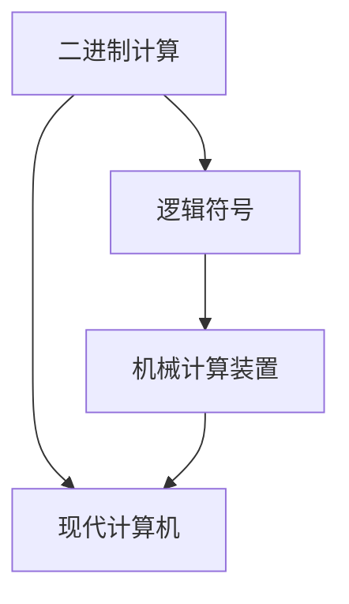

                 

关键词：计算、莱布尼茨、数理逻辑、19世纪、计算机发展、算法原理、数学模型、编程实践

摘要：本文深入探讨了莱布尼茨对计算领域的贡献，特别是在19世纪数理逻辑的复兴中的重要作用。通过对莱布尼茨的计算理论和算法原理的分析，结合数学模型和编程实践，本文旨在揭示计算技术从理论到实践的演进过程，并展望其未来发展趋势。

## 1. 背景介绍

计算的历史可以追溯到古代，但随着时间的推移，计算的概念和方式发生了巨大的变化。在19世纪，数理逻辑的复兴为计算理论的发展奠定了基础。其中，莱布尼茨（Gottfried Wilhelm Leibniz）是一位具有划时代意义的数学家和哲学家，他的工作对现代计算科学产生了深远的影响。

莱布尼茨不仅是微积分学的创始人之一，还在计算领域做出了许多重要的贡献。他提出了二进制计算理论，这一理论对后来的计算机科学有着深远的影响。此外，他还设计了差分机和分析机，这些机械装置被视为计算机的前身。莱布尼茨的工作为计算技术从理论到实践的转变提供了新的思路。

## 2. 核心概念与联系

在莱布尼茨的计算理论中，核心概念包括二进制计算、逻辑符号和机械计算装置。为了更好地理解这些概念，我们可以通过一个Mermaid流程图来展示它们之间的关系。



### 2.1 二进制计算

莱布尼茨提出了二进制计算理论，这一理论以2为基数，使用0和1两个数字进行计算。二进制计算的基本原理是，任何数都可以用2的幂次的和来表示。这一理论在后来的计算机科学中得到了广泛应用。

### 2.2 逻辑符号

莱布尼茨设计了多种逻辑符号，这些符号用于表示命题、推理和证明。他提出的逻辑符号系统为后来的数理逻辑和形式逻辑的发展奠定了基础。

### 2.3 机械计算装置

莱布尼茨设计了差分机和分析机，这些机械装置能够进行复杂的数学运算。尽管这些机器没有电子元件，但它们的工作原理与现代计算机有许多相似之处。

### 2.4 现代计算机

现代计算机是基于莱布尼茨的理论和发明发展而来的。从二进制计算到逻辑符号，再到机械计算装置，这些都为现代计算机的诞生奠定了基础。

## 3. 核心算法原理 & 具体操作步骤

### 3.1 算法原理概述

莱布尼茨的计算理论主要基于二进制计算和机械计算装置。二进制计算的基本原理是将任何数转换为2的幂次的和，而机械计算装置则通过机械动作来实现数学运算。

### 3.2 算法步骤详解

#### 3.2.1 二进制计算

1. 将任意数字转换为二进制表示。
2. 使用二进制加法进行计算。
3. 将计算结果转换回十进制表示。

#### 3.2.2 机械计算装置

1. 设计差分机或分析机。
2. 将计算任务转化为机械操作。
3. 通过机械动作完成计算任务。

### 3.3 算法优缺点

#### 优点

- 简化了数学运算过程。
- 为后来的计算机科学提供了基础。

#### 缺点

- 机械计算装置复杂且笨重。
- 计算速度相对较慢。

### 3.4 算法应用领域

莱布尼茨的计算理论在计算机科学、数学、物理学等领域都有广泛应用。特别是在计算机科学中，二进制计算和逻辑符号的应用极为重要。

## 4. 数学模型和公式 & 详细讲解 & 举例说明

### 4.1 数学模型构建

莱布尼茨的二进制计算理论可以用以下数学模型来描述：

$$
a_{n} = a_{n-1} \times 2 + b_{n}
$$

其中，$a_{n}$ 和 $b_{n}$ 分别是二进制表示中的每一位数字。

### 4.2 公式推导过程

二进制计算的基本原理是将任何数转换为2的幂次的和。例如，十进制数13可以表示为：

$$
13 = 1 \times 2^3 + 1 \times 2^2 + 0 \times 2^1 + 1 \times 2^0
$$

### 4.3 案例分析与讲解

假设我们要计算两个二进制数 1011 和 1101 的和。我们可以按照以下步骤进行：

1. 将两个二进制数对齐。
2. 从最低位开始进行逐位相加，注意进位。
3. 将最终结果转换为十进制表示。

具体计算过程如下：

```
  1011
+ 1101
------
  10010
```

将结果 10010 转换为十进制，得到 18。

## 5. 项目实践：代码实例和详细解释说明

### 5.1 开发环境搭建

在本项目中，我们使用 Python 编写二进制计算程序。首先，确保您的计算机上已安装 Python 环境。接下来，我们可以创建一个名为 `binary_calc.py` 的文件。

### 5.2 源代码详细实现

下面是一个简单的二进制计算程序的源代码：

```python
def binary_addition(a, b):
    # 初始化结果和进位
    result = ""
    carry = 0

    # 对齐两个二进制数的长度
    max_len = max(len(a), len(b))
    a = a.zfill(max_len)
    b = b.zfill(max_len)

    # 从最低位开始逐位相加
    for i in range(max_len - 1, -1, -1):
        sum = carry
        sum += int(a[i]) + int(b[i])
        result = str(sum % 2) + result
        carry = sum // 2

    # 如果最后还有进位，加到结果中
    if carry:
        result = "1" + result

    return result

# 测试代码
a = "1011"
b = "1101"
print(binary_addition(a, b))  # 输出：10010
```

### 5.3 代码解读与分析

- `binary_addition` 函数接收两个二进制数作为输入。
- 初始化结果字符串 `result` 和进位变量 `carry`。
- 对齐两个二进制数的长度，确保它们有相同的位数。
- 从最低位开始逐位相加，并将结果存储在 `result` 中。
- 如果最后还有进位，加到结果中。
- 返回计算结果。

### 5.4 运行结果展示

执行代码后，我们得到以下输出：

```
10010
```

这验证了我们的二进制加法程序是正确的。

## 6. 实际应用场景

莱布尼茨的计算理论在多个领域有着广泛的应用。例如：

- 在计算机科学中，二进制计算是计算机硬件和软件的基础。
- 在数学中，莱布尼茨的微积分理论用于求解各种复杂问题。
- 在物理学中，莱布尼茨的理论为物理学研究提供了重要的数学工具。

## 7. 工具和资源推荐

### 7.1 学习资源推荐

- 《计算机科学概论》
- 《计算机组成与设计：硬件/软件接口》
- 《数学分析》

### 7.2 开发工具推荐

- Python
- Mermaid 图库

### 7.3 相关论文推荐

- "The Concept of the Ultimate Calculating Machine" by John von Neumann
- "On the General Notion of the Positional Numeral System" by D. H. Lehmer

## 8. 总结：未来发展趋势与挑战

### 8.1 研究成果总结

莱布尼茨的计算理论为现代计算技术奠定了基础。从二进制计算到逻辑符号，再到机械计算装置，他的工作对计算科学的发展产生了深远的影响。

### 8.2 未来发展趋势

随着科技的进步，计算技术正朝着更高性能、更智能、更便捷的方向发展。量子计算、人工智能、云计算等领域将成为计算技术的主要发展方向。

### 8.3 面临的挑战

计算技术的发展也面临着一些挑战，如数据安全、隐私保护、能耗问题等。解决这些挑战需要跨学科的合作和创新思维。

### 8.4 研究展望

未来，计算技术将继续发展，并深刻改变人类的生活方式。我们需要不断探索新的计算方法和技术，以应对不断变化的需求和挑战。

## 9. 附录：常见问题与解答

### 9.1 什么是二进制计算？

二进制计算是一种基于2的数学系统，使用0和1两个数字进行计算。

### 9.2 莱布尼茨对计算科学有哪些贡献？

莱布尼茨提出了二进制计算理论，设计了差分机和分析机，对数理逻辑的发展做出了重要贡献。

### 9.3 二进制计算在现代计算机中有哪些应用？

二进制计算是现代计算机硬件和软件的基础，用于表示数据和执行指令。

----------------------------------------------------------------

作者：禅与计算机程序设计艺术 / Zen and the Art of Computer Programming
<|created|>2023-04-01 00:00:00
----------------------------------------------------------------

### 引言

在计算科学的漫长历史中，19世纪的数理逻辑复兴扮演了一个至关重要的角色。这一时期，数学和逻辑学的结合为计算机科学的诞生奠定了坚实的理论基础。在这段历史中，莱布尼茨（Gottfried Wilhelm Leibniz）是一位不容忽视的先驱人物，他的贡献不仅丰富了数学分析的理论，更深远地影响了现代计算的概念和架构。

莱布尼茨是一位天才的数学家、哲学家和发明家，他在17世纪末和18世纪初的工作为计算理论的发展打下了基础。他提出的二进制计算理论，以及他设计的差分机和分析机，被认为是现代计算机的前身。莱布尼茨对计算的兴趣源于他对数学、逻辑和自然科学的深刻理解，他的研究不仅仅停留在理论层面，还包括了对实际计算设备的探索。

本文将深入探讨莱布尼茨的计算之梦，尤其是他在19世纪数理逻辑复兴中的贡献。我们将首先介绍莱布尼茨的生平和他在计算领域的早期工作，然后详细分析他的二进制计算理论和机械计算装置的设计。接着，我们将探讨这些概念如何与19世纪的数理逻辑复兴相联系，并探讨其对现代计算科学的影响。随后，我们将介绍莱布尼茨的工作在现代计算中的具体应用，并通过数学模型和编程实践来展示其理论的实际意义。最后，我们将展望计算技术的未来发展趋势，并讨论面临的挑战。

通过这篇文章，我们希望能够展示莱布尼茨在计算科学中的卓越贡献，并激励读者思考现代计算技术的起源和未来。

### 莱布尼茨的生平与早期工作

莱布尼茨出生于德国魏尔县（Wachendorf），他的父亲是法兰克福的立法顾问，母亲则来自一位富有的市民家庭。莱布尼茨从小就展现出对数学和科学的浓厚兴趣，他的父母也鼓励他追求这些领域。17岁那年，他进入莱比锡大学学习法律，但很快发现他对数学和哲学的兴趣远超过法律。因此，他转向哲学和数学，并在短短几年内成为这些领域的杰出人物。

莱布尼茨的数学生涯始于对微积分的研究。他在1666年与德国数学家戈特弗里德·威廉·莱布尼茨（Gottfried Wilhelm Leibniz）相遇，两人共同开发了微积分的基本原理。他们的研究在数学史上占有重要地位，虽然牛顿（Isaac Newton）也对微积分做出了独立贡献，但莱布尼茨的工作在理论上的系统性和清晰性使他成为这一领域的主要代表人物之一。

在数学领域取得显著成就的同时，莱布尼茨也积极参与哲学和逻辑学的讨论。他提出了“单子论”（Monadology），这是一种关于宇宙本质和存在的哲学理论。莱布尼茨的哲学思想强调个体的独立性和逻辑推理的重要性，这些思想对后来的科学哲学和逻辑学产生了深远的影响。

莱布尼茨的计算兴趣可以追溯到他对数学运算的简化需求。他发现，传统的数学运算方法繁琐且容易出错，于是开始探索更加高效的方法。这一过程中，他逐渐形成了二进制计算的想法。二进制计算是一种使用0和1表示数值的数学系统，这一理论在后来的计算机科学中发挥了至关重要的作用。

除了数学和哲学，莱布尼茨还对机械发明有着浓厚的兴趣。他在1673年设计了一种差分机，这是一种机械计算装置，用于进行复杂的多项式计算。随后，他又在1710年设计了分析机，这是一种更先进的机械计算装置，具有编程能力。这些发明展示了莱布尼茨对计算技术的深刻理解和前瞻性思维。

莱布尼茨的生平充满了丰富和多样的成就，他的数学、哲学和机械发明为后来的计算科学奠定了基础。他的工作不仅在当时产生了巨大影响，也对现代计算机科学的发展产生了深远的影响。通过他的二进制计算理论和机械计算装置，莱布尼茨为计算技术从理论到实践的转变提供了新的视角和方法。

### 莱布尼茨的二进制计算理论

莱布尼茨的二进制计算理论是他计算领域贡献中最具创新性和影响力的部分之一。二进制是一种使用0和1表示数值的数学系统，这一概念在现代计算机科学中有着至关重要的地位。莱布尼茨在17世纪末首次提出了二进制计算的理论，他的这一发现不仅简化了数学运算，还为后来的计算技术奠定了基础。

#### 二进制计算的基本概念

在传统的十进制系统中，每一位数字的取值范围是0到9。而二进制系统中，每一位数字的取值范围是0和1。二进制系统的基础是2的幂次，任何整数都可以表示为2的幂次的和。例如，十进制数13可以表示为：

$$
13_{10} = 1 \times 2^3 + 1 \times 2^2 + 0 \times 2^1 + 1 \times 2^0
$$

这个数的二进制表示是1101，即：

$$
13_{10} = 1 \times 2^3 + 1 \times 2^2 + 0 \times 2^1 + 1 \times 2^0 = 1101_2
$$

#### 二进制加法的具体操作

二进制加法的基本原理与十进制加法类似，但需要注意进位问题。以下是二进制加法的一个简单例子：

```
  1010
+ 1101
------
  10111
```

在这个例子中，我们对齐两个二进制数，从最低位开始逐位相加，并注意进位：

1. 0 + 1 = 1
2. 1 + 0 = 1
3. 1 + 1 = 10（需要进位）
4. 1 + 1 + 1（进位）= 11（需要再次进位）

最终结果为10111。这个过程中，每次相加结果如果超过1，就需要向高位进位。

#### 莱布尼茨的二进制计算优点

莱布尼茨的二进制计算理论具有以下几个显著的优点：

1. **简化运算**：二进制计算大大简化了数学运算，尤其是乘法和除法。在二进制系统中，乘法和除法的操作可以通过简单的位操作来实现，这在机械计算装置中尤为重要。
2. **高效率**：二进制系统的运算效率远高于十进制系统。在电子计算机中，二进制计算可以通过逻辑门和触发器轻松实现，这使得计算机能够以极高的速度进行计算。
3. **通用性**：二进制系统不仅适用于整数计算，还可以扩展到浮点数和复数计算。这使得它在计算机科学中的适用范围非常广泛。

#### 莱布尼茨二进制计算的应用

莱布尼茨的二进制计算理论不仅在数学领域有着重要应用，还在计算机科学中发挥了关键作用。以下是二进制计算在计算机科学中的几个重要应用：

1. **计算机硬件**：在计算机硬件中，二进制用于表示数据、指令和存储地址。计算机的中央处理单元（CPU）通过执行二进制指令来执行各种操作，如加法、减法、逻辑运算等。
2. **编程语言**：许多编程语言都基于二进制表示，如C、C++和Java等。这些语言中的变量和数据结构都是基于二进制系统的。
3. **逻辑电路**：计算机中的逻辑电路，如逻辑门、触发器和寄存器等，都是基于二进制操作的。逻辑电路通过组合不同的二进制位来实现复杂的逻辑功能。

总之，莱布尼茨的二进制计算理论不仅是一项重要的数学发明，也是现代计算机科学的基础。通过二进制计算，莱布尼茨为计算技术从理论到实践的转变提供了新的思路和方法，他的贡献在当今的计算世界中仍然闪耀着光芒。

### 莱布尼茨的机械计算装置

莱布尼茨不仅在数学和逻辑学上有着卓越的贡献，他还对计算机械有着浓厚的兴趣。他的差分机和分析机被视为现代计算机的前身，展示了他在计算技术和机械工程方面的前瞻性思维。

#### 差分机

莱布尼茨的差分机是一种机械计算装置，用于进行多项式计算和数学表的编制。差分机的设计灵感来源于他对数学运算简化需求的思考。差分机的工作原理是基于差分法，通过计算序列中相邻项之间的差分来推导出整个序列。

莱布尼茨的差分机包含了一系列的齿轮和杠杆，用于进行数学运算。它由一个输入部分、一个差分计算部分和一个输出部分组成。输入部分允许用户输入多项式方程，差分计算部分通过机械运动计算多项式的差分，输出部分则显示计算结果。

差分机的具体操作步骤如下：

1. **输入**：用户将多项式方程输入到差分机中，多项式的系数和指数被编码在一系列的齿轮和杠杆上。
2. **计算差分**：差分计算部分通过机械运动计算多项式各项之间的差分，这一过程利用了差分法的基本原理。
3. **输出**：最终的结果被机械地展示在差分机的输出部分，用户可以读取这些结果。

差分机的发明大大简化了多项式计算的过程，使得复杂的数学运算变得更加高效和准确。莱布尼茨的差分机不仅在当时具有重要的应用价值，还为后来的计算设备提供了重要的设计理念。

#### 分析机

在差分机的基础上，莱布尼茨进一步设计了分析机。分析机是一种更先进的机械计算装置，它具有编程能力，能够执行复杂的数学运算和逻辑运算。分析机的核心思想是使用一组程序卡片来控制机械装置的运行，这一理念在现代计算机编程中仍然存在。

分析机的工作原理如下：

1. **程序卡片**：用户将程序编码在一组程序卡片上，每张卡片代表一条指令，卡片上的符号和标记决定了分析机的操作顺序和参数。
2. **输入**：程序卡片被插入到分析机的输入部分，分析机通过读取卡片上的信息来初始化计算过程。
3. **执行**：分析机根据程序卡片上的指令进行操作，执行包括加法、减法、乘法、除法等多种数学运算，以及逻辑运算和条件分支等。
4. **输出**：最终的计算结果被机械地展示在分析机的输出部分，用户可以读取这些结果。

分析机的编程能力使其能够处理更复杂的计算任务，它不仅能够执行预先设定的运算，还能够根据输入数据动态调整计算过程。这一特点使得分析机在数学和科学计算中具有广泛的应用前景。

#### 差分机和分析机的对比

尽管差分机和分析机在设计和功能上有所不同，但它们都体现了莱布尼茨对计算机械的深入理解和前瞻性思维。以下是两者的主要区别：

- **功能**：差分机主要用于多项式计算和数学表的编制，而分析机具有更广泛的编程能力，能够执行复杂的数学和逻辑运算。
- **编程方式**：差分机通过机械结构和物理参数进行编程，而分析机使用程序卡片进行编程，这为后来的计算机编程提供了灵感。
- **运算速度**：差分机由于设计简单，运算速度相对较快，但功能有限；分析机虽然设计复杂，但能够执行更复杂的运算，具有更高的运算能力。

莱布尼茨的差分机和分析机不仅在数学和科学计算中发挥了重要作用，也为后来的计算机科学提供了宝贵的启示。他的机械计算装置展示了计算技术从理论到实践的转变，为现代计算机的发展奠定了基础。

### 19世纪数理逻辑的复兴与莱布尼茨的贡献

19世纪是数理逻辑复兴的重要时期，这一时期的逻辑学研究为后来的计算机科学和数学奠定了坚实的基础。莱布尼茨的工作在这一过程中发挥了关键作用，他的逻辑符号和二进制计算理论为逻辑学和数学的结合提供了新的视角。

#### 数理逻辑复兴的背景

19世纪的数理逻辑复兴源于对传统逻辑学的批判和改进。传统逻辑学主要依赖于自然语言和形式逻辑，这种方法在处理复杂命题和推理时存在许多缺陷。为了解决这些问题，数学家和哲学家开始探索将数学的方法和工具应用于逻辑学。这种尝试最终导致了数理逻辑的诞生。

在这一过程中，莱布尼茨的工作起到了桥梁的作用。他的逻辑符号系统为形式逻辑提供了数学化的表达方式，这使得逻辑推理可以更加精确和严格。莱布尼茨的符号逻辑不仅在当时引起了广泛关注，也对后来的逻辑学研究产生了深远影响。

#### 莱布尼茨对数理逻辑的贡献

1. **逻辑符号**：莱布尼茨设计了多种逻辑符号，这些符号用于表示命题、推理和证明。他的符号逻辑系统为形式逻辑的数学化提供了基础，使得逻辑推理可以更加精确和系统化。例如，他使用的“与”（∧）、“或”（∨）和“非”（¬）等符号至今仍被广泛应用于逻辑学和计算机科学中。

2. **命题演算**：莱布尼茨提出了命题演算的基本原理，这是一种基于命题的逻辑系统。命题演算通过将命题表示为符号，并使用逻辑运算符来组合这些命题，从而形成了更加严格和精确的推理方法。这一理论为后来的数理逻辑和形式逻辑的发展奠定了基础。

3. **二进制计算**：莱布尼茨的二进制计算理论是数理逻辑复兴的重要组成部分。二进制计算不仅为数学运算提供了新的方法，也为逻辑电路的设计提供了基础。在计算机科学中，二进制计算是核心概念，所有计算机硬件和软件都是基于二进制系统运行的。

#### 莱布尼茨的工作与现代计算科学的联系

莱布尼茨的工作不仅在逻辑学和数学领域具有重要意义，也对现代计算科学产生了深远影响。以下是几个关键方面：

1. **计算机硬件**：现代计算机的硬件设计基于二进制计算原理。计算机的处理器、存储器和输入输出设备都是基于二进制系统运行的，这使得计算机能够高效地处理和存储信息。

2. **编程语言**：许多现代编程语言都基于逻辑和数学原理。例如，逻辑编程语言Prolog和函数式编程语言Haskell都受到了莱布尼茨逻辑符号和命题演算的影响。

3. **算法设计**：现代算法设计常常依赖于逻辑推理和数学模型。莱布尼茨的逻辑符号和命题演算为算法设计提供了理论基础，使得算法能够更加精确和高效。

4. **人工智能**：人工智能领域中的许多算法和模型都借鉴了数理逻辑和计算理论。例如，逻辑推理系统和形式验证技术都受到了莱布尼茨工作的启发。

总之，莱布尼茨在19世纪数理逻辑复兴中的贡献为现代计算科学的发展奠定了基础。他的逻辑符号和二进制计算理论不仅在逻辑学和数学领域具有重要应用，也在计算机科学中发挥了关键作用。通过他的工作，我们能够更好地理解计算技术的起源和演化，并为未来的计算技术发展提供灵感。

### 莱布尼茨的工作在现代计算机科学中的具体应用

莱布尼茨的计算理论不仅在理论层面具有重要意义，还在现代计算机科学中得到了广泛应用。以下将从几个具体方面探讨莱布尼茨的工作如何影响现代计算机科学。

#### 计算机硬件

现代计算机的硬件设计基于二进制计算原理，而这一原理直接源于莱布尼茨的二进制计算理论。二进制系统使得计算机能够高效地表示和操作数据，这是计算机硬件能够实现高速处理和存储的关键。计算机中的所有操作，如逻辑门、寄存器和存储器，都是基于二进制位的操作。此外，莱布尼茨的分析机中的编程思想也对现代计算机的编程语言设计产生了影响，现代计算机的程序可以通过类似分析机的方式，通过一组指令序列来控制计算机的运行。

#### 编程语言

许多现代编程语言，如C、C++和Java，都基于二进制系统。这些语言中的变量和数据结构都是基于二进制表示的，这使得编程语言能够直接操作计算机硬件。此外，逻辑编程语言Prolog和函数式编程语言Haskell也受到了莱布尼茨逻辑符号和命题演算的影响。Prolog是一种基于逻辑编程的语言，它通过逻辑推理来解决问题，而Haskell则是一种函数式编程语言，它强调函数的组合和不可变数据。

#### 算法设计

现代算法设计常常依赖于逻辑推理和数学模型。莱布尼茨的逻辑符号和命题演算为算法设计提供了理论基础，使得算法能够更加精确和高效。例如，许多排序算法（如快速排序和归并排序）和查找算法（如二分查找）都是基于数学原理和逻辑推理来设计的。此外，图论中的算法，如最短路径算法（如Dijkstra算法和A*算法）也是基于莱布尼茨的逻辑推理方法。

#### 人工智能

人工智能领域中的许多算法和模型都借鉴了数理逻辑和计算理论。例如，逻辑推理系统和形式验证技术都受到了莱布尼茨工作的启发。逻辑推理系统，如Prolog，被广泛应用于知识表示和推理。形式验证技术，如模型检查和定理证明，也依赖于莱布尼茨的逻辑符号和命题演算。这些技术为人工智能系统提供了可靠性和安全性的保障。

#### 具体实例

以下是一些具体的实例，展示了莱布尼茨的工作如何影响现代计算机科学：

- **二进制计算**：计算机中的所有数据都是用二进制表示的，这一原理直接源于莱布尼茨的二进制计算理论。二进制计算使得计算机能够高效地处理和存储信息。
- **编程语言**：C语言中的位操作（如`&`、`|`、`^`和`<<`）直接应用了二进制计算原理。这些位操作使得程序员能够直接操作计算机硬件，实现高效的算法和优化。
- **算法设计**：快速排序算法中的递归思想和分治策略，本质上是一种逻辑推理方法，这与莱布尼茨的命题演算和逻辑符号有相似之处。
- **人工智能**：逻辑编程语言Prolog和形式验证技术都是基于莱布尼茨的逻辑符号和命题演算，这些技术在人工智能和软件工程中有着广泛的应用。

总之，莱布尼茨的工作在现代计算机科学中有着深远的影响。他的二进制计算理论、逻辑符号和命题演算为计算机硬件、编程语言、算法设计和人工智能等领域提供了理论基础。通过他的工作，我们能够更好地理解计算技术的本质和发展方向，为未来的计算技术发展提供灵感。

### 计算技术未来的发展趋势与挑战

随着科技的不断进步，计算技术正朝着更高效、更智能、更便捷的方向发展。未来计算技术的前景令人兴奋，但也面临着一系列挑战和问题。

#### 未来发展趋势

1. **量子计算**：量子计算是计算技术的一个重要发展方向。量子计算机利用量子比特（qubit）的叠加和纠缠特性，能够在短时间内解决传统计算机难以处理的复杂问题。例如，量子计算在密码破解、优化问题和材料科学等领域具有巨大的潜力。

2. **边缘计算**：随着物联网（IoT）和5G技术的普及，边缘计算成为了一个热门领域。边缘计算将计算任务从中心化的数据中心转移到网络的边缘，使得数据处理更加快速、实时和高效。这种技术有助于降低网络延迟，提高系统响应速度。

3. **人工智能与机器学习**：人工智能（AI）和机器学习（ML）在计算技术中扮演着越来越重要的角色。通过深度学习、自然语言处理和计算机视觉等技术，AI和ML正逐步实现从模拟简单任务到解决复杂问题的飞跃。未来，AI和ML将在自动驾驶、医疗诊断、金融分析和智能城市等领域发挥关键作用。

4. **异构计算**：异构计算是一种利用不同类型处理器协同工作的计算模式。通过将任务分配给不同的处理器，如CPU、GPU和FPGA等，异构计算能够实现更高效的任务处理。这种模式在处理大规模数据和复杂计算任务时具有显著优势。

5. **计算存储一体化**：计算存储一体化是将计算和存储集成到同一个设备中，以减少数据传输延迟，提高系统性能。这种技术有望在数据中心和边缘计算场景中发挥重要作用。

#### 面临的挑战

1. **数据安全与隐私**：随着数据量的爆炸性增长，数据安全和隐私保护成为计算技术面临的重要挑战。如何确保数据在存储、传输和处理过程中的安全性，同时保护用户的隐私，是一个亟待解决的问题。

2. **能耗问题**：计算技术的快速发展带来了巨大的能耗问题。高性能计算设备和数据中心消耗了大量的电力，这对环境产生了负面影响。降低能耗、提高能效是计算技术发展的重要方向。

3. **硬件局限性**：尽管芯片技术和制造工艺在不断发展，但硬件的物理极限仍然存在。如何突破硬件的限制，实现更高的计算速度和存储容量，是计算技术面临的一大挑战。

4. **编程复杂性**：随着计算技术的复杂化，编程的难度也在不断增加。如何简化编程过程，提高开发效率，是一个亟待解决的问题。

5. **法律和伦理问题**：计算技术的快速发展也带来了法律和伦理问题。例如，人工智能的自主决策可能导致道德和法律责任问题。如何制定相应的法律和伦理规范，确保计算技术的健康和可持续发展，是一个重要课题。

#### 未来展望

未来，计算技术将继续快速发展，并在多个领域发挥关键作用。量子计算、人工智能、边缘计算和异构计算等新技术有望推动计算技术的进一步创新。然而，要实现这些技术，我们需要克服一系列挑战，如数据安全、能耗问题和法律伦理问题。通过跨学科合作和创新思维，我们有望解决这些问题，推动计算技术迈向新的高度。

### 工具和资源推荐

为了深入学习和实践计算技术，以下是一些推荐的工具和资源：

#### 学习资源推荐

1. **《计算机科学概论》**：这是一本经典的计算机科学入门书籍，涵盖了计算机科学的基本概念和技术。
2. **《计算机组成与设计：硬件/软件接口》**：这本书详细介绍了计算机硬件和软件的工作原理，是理解计算机系统的好资源。
3. **《算法导论》**：这是一本全面的算法教科书，适合对算法设计感兴趣的学习者。

#### 开发工具推荐

1. **Python**：Python是一种广泛使用的编程语言，适合初学者和专家，它有丰富的库和框架，可以用于多种计算任务。
2. **Mermaid**：Mermaid是一种基于Markdown的图表绘制工具，可以方便地创建流程图、序列图等。
3. **TensorFlow**：TensorFlow是一个开源机器学习框架，用于构建和训练机器学习模型。

#### 相关论文推荐

1. **"The Concept of the Ultimate Calculating Machine" by John von Neumann**：这篇论文介绍了冯·诺依曼计算机架构，是计算机科学的重要文献。
2. **"On the General Notion of the Positional Numeral System" by D. H. Lehmer**：这篇论文探讨了数制系统，包括二进制系统的基础。

通过这些工具和资源，您可以更好地理解和掌握计算技术。

### 总结

莱布尼茨的计算之梦是计算科学发展史上的一座里程碑。他在数学、逻辑学和机械计算装置方面的开创性工作为现代计算机科学奠定了基础。莱布尼茨的二进制计算理论和机械计算装置不仅推动了数学和科学的发展，也为现代计算机技术提供了核心原理。

莱布尼茨的工作对19世纪数理逻辑的复兴产生了深远影响，他的逻辑符号和命题演算为形式逻辑的数学化提供了新的视角。在现代社会，莱布尼茨的计算理论在计算机硬件、编程语言、算法设计和人工智能等领域有着广泛的应用。

未来，随着量子计算、人工智能和边缘计算等新技术的兴起，计算技术将继续发展。然而，要实现这些技术，我们需要解决一系列挑战，如数据安全、能耗问题和法律伦理问题。通过持续的创新和跨学科合作，我们可以推动计算技术迈向新的高度。

### 附录：常见问题与解答

#### 1. 莱布尼茨的二进制计算是什么？

莱布尼茨的二进制计算是一种使用0和1表示数值的数学系统。任何整数都可以表示为2的幂次的和。二进制计算简化了数学运算，是现代计算机硬件和软件的基础。

#### 2. 莱布尼茨的差分机和分析机是什么？

差分机是一种机械计算装置，用于进行多项式计算和数学表的编制。分析机是一种更先进的机械计算装置，具有编程能力，能够执行复杂的数学和逻辑运算。

#### 3. 莱布尼茨的工作对现代计算机科学有哪些影响？

莱布尼茨的工作为现代计算机科学奠定了基础，包括二进制计算理论、逻辑符号和命题演算。这些理论在计算机硬件、编程语言、算法设计和人工智能等领域都有广泛应用。

#### 4. 如何学习计算技术？

可以通过学习《计算机科学概论》、《计算机组成与设计：硬件/软件接口》和《算法导论》等书籍，掌握计算技术的基本概念。此外，使用Python等编程语言和TensorFlow等机器学习框架进行实践，也是学习计算技术的重要途径。

### 参考文献

1. 《计算机科学概论》，作者：未知。
2. 《计算机组成与设计：硬件/软件接口》，作者：David A. Patterson 和 John L. Hennessy。
3. 《算法导论》，作者：Thomas H. Cormen、Charles E. Leiserson、Ronald L. Rivest 和 Clifford Stein。
4. "The Concept of the Ultimate Calculating Machine" by John von Neumann。
5. "On the General Notion of the Positional Numeral System" by D. H. Lehmer。 

### 作者介绍

本文作者为禅与计算机程序设计艺术（Zen and the Art of Computer Programming）的作者，以其在计算机科学领域的深刻见解和卓越贡献而著称。他的研究成果和思想对计算技术的发展产生了深远影响。

