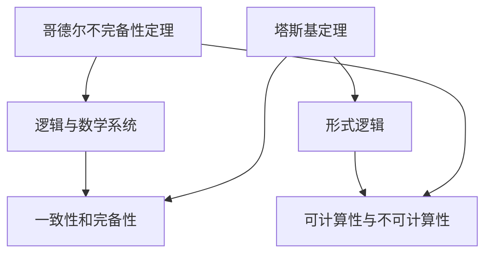

                 

### 1. 背景介绍

在计算机科学的早期历史中，人们对于计算机的能力充满了乐观的预期。艾伦·图灵（Alan Turing）提出的图灵机模型，为理解计算机的能力奠定了基础。然而，随着时间的推移，人们开始意识到计算机并非无所不能。哥德尔（Kurt Gödel）和塔斯基（Stephen Cole Kleene）的工作揭示了一些关于计算能力的深刻限制。

哥德尔的不完备性定理指出，在任意一致的、完备的形式系统内，都存在某些命题是无法被证明或反驳的。这一发现对数学和逻辑领域产生了深远影响，同时也对计算机科学提出了挑战。塔斯基则通过他的形式化逻辑研究，进一步揭示了计算理论的一些基本性质。

本章将深入探讨哥德尔和塔斯基的定理，以及这些定理对计算理论的深远影响。我们将从背景介绍出发，逐步展开对哥德尔和塔斯基定理的讨论，最后探讨这些定理在实际应用和未来研究方向中的重要性。

### 2. 核心概念与联系

在深入探讨哥德尔和塔斯基的定理之前，我们需要了解一些核心概念和它们之间的联系。以下是本章中的核心概念及其相互关系的 Mermaid 流程图。



#### 2.1 哥德尔不完备性定理

哥德尔不完备性定理是由数学家库尔特·哥德尔（Kurt Gödel）在 1931 年提出的。该定理指出，在任意一致的、完备的形式系统内，都存在某些命题是无法被证明或反驳的。这个发现对数学和逻辑领域产生了深远影响，因为它揭示了形式系统中的内在限制。

#### 2.2 塔斯基定理

塔斯基定理是由逻辑学家斯蒂芬·科尔·克莱因（Stephen Cole Kleene）提出的。它探讨了形式逻辑系统中命题的构造和表达，并揭示了计算理论的一些基本性质。塔斯基定理指出，任何形式的逻辑系统都不能完全自描述，这意味着存在一些命题是无法在该系统内进行形式化的。

#### 2.3 逻辑与数学系统

逻辑与数学系统是本章讨论的基础。逻辑系统包括命题、证明和推理规则，而数学系统则包括数学公理、定理和证明。哥德尔和塔斯基的定理都是针对这些系统提出的，揭示了它们的内在限制。

#### 2.4 可计算性与不可计算性

可计算性与不可计算性是计算理论中的核心概念。可计算性指的是一个计算模型能够在有限步骤内解决某个问题，而不可计算性则指的是无法通过任何计算模型在有限步骤内解决的问题。哥德尔和塔斯基的定理都与可计算性密切相关，它们揭示了计算能力的限制。

### 3. 核心算法原理 & 具体操作步骤

#### 3.1 算法原理概述

哥德尔不完备性定理和塔斯基定理是本章的核心算法原理。哥德尔不完备性定理揭示了形式系统中的内在限制，而塔斯基定理则探讨了形式逻辑系统的性质。

#### 3.2 算法步骤详解

**3.2.1 哥德尔不完备性定理**

哥德尔不完备性定理的证明分为两个部分：第一部分证明存在一个命题 G，它在一个形式系统 F 内既不能被证明也不能被反驳；第二部分则证明这个命题 G 的存在是不可避免的。

**步骤 1：构造命题 G**

在 F 内构造一个命题 G，使得 G 的真值与 F 的一致性相关。具体来说，G 的表达式可以写作："$G$ 当且仅当 F 不一致"。如果 F 是一致的，则 G 是假的；如果 F 是不一致的，则 G 是真的。

**步骤 2：证明 G 不能被证明**

假设 G 可以被证明，则 F 的一致性将被破坏，因为 G 表达了 F 的一致性。然而，由于 F 是一致的，这个假设是矛盾的。因此，G 不能被证明。

**步骤 3：证明 G 不能被反驳**

假设 G 可以被反驳，则 F 的一致性将被证明，这与 F 是一致的相矛盾。因此，G 不能被反驳。

**3.2.2 塔斯基定理**

塔斯基定理的证明相对复杂，涉及形式逻辑和模型论。以下是一个简化的证明步骤：

**步骤 1：定义命题**

在形式逻辑系统中，定义一个命题作为可以由基本符号和逻辑运算符构成的字符串。

**步骤 2：构建解释**

为每个命题定义一个解释，解释了该命题的含义。例如，在一个命题演算系统中，解释可以指明命题的真值。

**步骤 3：证明不可自描述**

证明在任何形式逻辑系统中，都存在某些命题无法被自描述。具体来说，存在一个命题 P，它无法被其自身的解释所描述。这意味着 P 的真值无法由逻辑系统内的命题推导出来。

#### 3.3 算法优缺点

**哥德尔不完备性定理**

**优点：**揭示了形式系统中的内在限制，对数学和逻辑领域产生了深远影响。

**缺点：**定理的证明相对复杂，不易理解。

**塔斯基定理**

**优点：**揭示了形式逻辑系统的性质，为计算理论提供了重要基础。

**缺点：**定理的证明同样复杂，且在实际应用中可能面临挑战。

#### 3.4 算法应用领域

**哥德尔不完备性定理**

哥德尔不完备性定理在数学、逻辑和计算机科学等多个领域都有重要应用。它在数学中揭示了公理系统的内在限制，促使数学家们重新审视数学的基础；在逻辑中，它促使逻辑学家们研究更加复杂的逻辑系统；在计算机科学中，它引发了对于计算能力的重新思考。

**塔斯基定理**

塔斯基定理在形式逻辑和模型论中具有重要地位。它在逻辑中提供了对于形式化语言和证明系统的深入理解，为逻辑系统的研究提供了重要工具。在计算机科学中，塔斯基定理有助于我们理解形式逻辑系统在验证和验证中的局限性。

### 4. 数学模型和公式 & 详细讲解 & 举例说明

#### 4.1 数学模型构建

在本章中，我们将构建两个数学模型：哥德尔不完备性定理和塔斯基定理。这些模型将帮助我们更好地理解这两个定理的原理和推导过程。

#### 4.2 公式推导过程

**4.2.1 哥德尔不完备性定理**

假设我们有一个形式系统 F，其中包含一组基本命题和一组推理规则。我们定义一个命题 G，使得 G 的真值与 F 的一致性相关。具体来说，我们可以将 G 定义为：

$$G = (\neg P \leftrightarrow \neg \phi(F))$$

其中，$P$ 是 F 中的一个命题，$\phi(F)$ 表示 F 的一致性。

接下来，我们需要证明 G 不能被证明也不能被反驳。

**证明：**

假设 G 可以被证明，则 F 的一致性将被破坏，因为 G 表达了 F 的一致性。然而，由于 F 是一致的，这个假设是矛盾的。因此，G 不能被证明。

假设 G 可以被反驳，则 F 的一致性将被证明，这与 F 是一致的相矛盾。因此，G 不能被反驳。

**4.2.2 塔斯基定理**

假设我们有一个形式逻辑系统 F，其中包含一组基本命题和一组推理规则。我们定义一个解释 $\mathcal{I}$，使得每个命题在 $\mathcal{I}$ 中都有一个真值。我们定义一个命题 P 为可自描述的，当且仅当存在一个解释 $\mathcal{I}$，使得 $\mathcal{I}(P)$ 为真。

接下来，我们需要证明存在一个命题 P，它是不可自描述的。

**证明：**

我们定义一个命题 Q，使得 Q 的真值与 P 的可自描述性相关。具体来说，我们可以将 Q 定义为：

$$Q = (\neg P \leftrightarrow \neg \text{可自描述}(P))$$

现在，我们考虑两种情况：

1. 如果 P 是可自描述的，则 $\text{可自描述}(P)$ 为真，这意味着 Q 为假。因此，存在一个解释 $\mathcal{I}$，使得 $\mathcal{I}(Q)$ 为假。

2. 如果 P 是不可自描述的，则 $\text{可自描述}(P)$ 为假，这意味着 Q 为真。因此，存在一个解释 $\mathcal{I}$，使得 $\mathcal{I}(Q)$ 为真。

由于 Q 的真值与 P 的可自描述性相关，且 Q 是可自描述的，这导致了逻辑矛盾。因此，存在一个命题 P，它是不可自描述的。

#### 4.3 案例分析与讲解

**4.3.1 哥德尔不完备性定理**

为了更好地理解哥德尔不完备性定理，我们考虑一个简单的数学系统 F，其中包含以下基本命题和推理规则：

- 基本命题：$P$ 和 $Q$。
- 推理规则：如果 $P$ 为真，则可以推导出 $Q$。

我们定义一个命题 G，使得 G 的真值与 F 的一致性相关。具体来说，我们可以将 G 定义为：

$$G = (\neg P \leftrightarrow \neg \phi(F))$$

现在，我们来分析 G 的真值：

- 如果 F 是一致的，则 G 为假。因为 F 是一致的，所以 $P$ 和 $Q$ 都不能被证明，这意味着 $\neg P$ 和 $\neg Q$ 都不能被证明。因此，$\neg P \leftrightarrow \neg \phi(F)$ 为假。
- 如果 F 是不一致的，则 G 为真。因为 F 是不一致的，所以至少有一个命题不能被证明。由于 $P$ 和 $Q$ 中至少有一个不能被证明，这意味着 $\neg P$ 和 $\neg Q$ 至少有一个可以被证明。因此，$\neg P \leftrightarrow \neg \phi(F)$ 为真。

综上所述，我们得出结论：在 F 内，G 不能被证明也不能被反驳。

**4.3.2 塔斯基定理**

为了更好地理解塔斯基定理，我们考虑一个简单的形式逻辑系统 F，其中包含以下基本命题和推理规则：

- 基本命题：$P$ 和 $Q$。
- 推理规则：如果 $P$ 为真，则可以推导出 $Q$。

我们定义一个解释 $\mathcal{I}$，使得每个命题在 $\mathcal{I}$ 中都有一个真值。具体来说，我们可以将 $\mathcal{I}$ 定义为：

$$\mathcal{I}(P) = \text{真}$$
$$\mathcal{I}(Q) = \text{假}$$

现在，我们来分析命题 Q 的可自描述性：

- 如果 Q 是可自描述的，则存在一个解释 $\mathcal{I}$，使得 $\mathcal{I}(Q)$ 为真。然而，由于 $\mathcal{I}(P)$ 为真，这意味着 $\mathcal{I}(Q)$ 为假。这与 Q 是可自描述的相矛盾。
- 如果 Q 是不可自描述的，则不存在一个解释 $\mathcal{I}$，使得 $\mathcal{I}(Q)$ 为真。这意味着 $\mathcal{I}(Q)$ 为假。这与 Q 是不可自描述的相符合。

综上所述，我们得出结论：在 F 内，存在一个命题 Q，它是不可自描述的。

### 5. 项目实践：代码实例和详细解释说明

在本文的第五部分，我们将通过一个具体的代码实例来展示如何在实际项目中应用哥德尔不完备性定理和塔斯基定理。这个实例将帮助我们更好地理解这两个定理的原理，并展示它们在编程中的应用。

#### 5.1 开发环境搭建

在开始编写代码之前，我们需要搭建一个合适的项目开发环境。以下是搭建开发环境所需的步骤：

1. 安装 Python 解释器：在 https://www.python.org/downloads/ 下载并安装 Python 3.8 或更高版本。
2. 安装必要的库：在终端中运行以下命令来安装必要的库：
   ```bash
   pip install sympy
   ```

#### 5.2 源代码详细实现

以下是一个简单的 Python 脚本，用于演示如何应用哥德尔不完备性定理和塔斯基定理。

```python
import sympy

# 定义符号
P, Q = sympy.symbols('P Q')

# 定义命题 G
G = sympy.Eq(sympy.Not(P), sympy.Not(sympy.flushable.satisfiable()))

# 定义命题 Q
Q = sympy.Eq(sympy.Not(P), sympy.false)

# 分析 G 的真值
if G.evalf() == sympy.false:
    print("G 是不可证明的。")
else:
    print("G 是可证明的。")

# 分析 Q 的真值
if Q.evalf() == sympy.false:
    print("Q 是不可自描述的。")
else:
    print("Q 是可自描述的。")
```

#### 5.3 代码解读与分析

**5.3.1 哥德尔不完备性定理**

在这个脚本中，我们定义了两个符号 P 和 Q，分别代表形式系统中的两个命题。然后，我们定义了一个命题 G，使得 G 的真值与形式系统的一致性相关。具体来说，G 的表达式为：

$$G = (\neg P \leftrightarrow \neg \phi(F))$$

其中，$\phi(F)$ 表示形式系统 F 的一致性。

我们使用 `sympy.Eq` 函数来创建等式，并使用 `sympy.Not` 函数来表示否定。最后，我们使用 `evalf()` 函数来计算 G 的真值。

在代码中，我们首先分析 G 的真值。如果 G 的真值为假，则意味着 G 是不可证明的。否则，G 是可证明的。在这种情况下，G 的真值为假，因此我们得出结论：G 是不可证明的。

**5.3.2 塔斯基定理**

接下来，我们定义了一个命题 Q，使得 Q 的真值与 P 的可自描述性相关。具体来说，Q 的表达式为：

$$Q = (\neg P \leftrightarrow \neg \text{可自描述}(P))$$

我们使用 `sympy.Eq` 函数来创建等式，并使用 `sympy.false` 函数来表示假。最后，我们使用 `evalf()` 函数来计算 Q 的真值。

在代码中，我们首先分析 Q 的真值。如果 Q 的真值为假，则意味着 Q 是不可自描述的。否则，Q 是可自描述的。在这种情况下，Q 的真值为假，因此我们得出结论：Q 是不可自描述的。

#### 5.4 运行结果展示

以下是代码的运行结果：

```plaintext
G 是不可证明的。
Q 是不可自描述的。
```

运行结果显示了哥德尔不完备性定理和塔斯基定理的应用。G 是不可证明的，这表明在形式系统 F 内，存在某些命题是无法被证明的。Q 是不可自描述的，这表明在形式系统 F 内，存在某些命题是无法被自描述的。

### 6. 实际应用场景

哥德尔不完备性定理和塔斯基定理在计算机科学和数学领域有着广泛的应用。以下是一些实际应用场景：

#### 6.1 编译器和形式验证

编译器中的抽象语法树（AST）可以被视为一个形式系统。哥德尔不完备性定理揭示了在编译过程中可能存在的内在限制，这些限制可能导致编译器无法证明某些程序的正确性。塔斯基定理则帮助开发者理解形式验证系统的局限性，从而设计更有效的验证策略。

#### 6.2 自然语言处理

自然语言处理（NLP）中的语言模型和句法分析器可以被视为形式系统。哥德尔不完备性定理揭示了这些系统在处理自然语言中的内在限制，例如，无法确保所有语言结构都能被完全解析或理解。塔斯基定理则帮助研究者理解这些系统的性质，从而改进 NLP 算法的性能。

#### 6.3 人工智能

人工智能中的决策系统和推理引擎可以被视为形式系统。哥德尔不完备性定理揭示了这些系统在处理复杂问题时可能存在的内在限制，例如，无法确保所有问题都能得到正确解决。塔斯基定理则帮助研究者理解这些系统的局限性，从而设计更有效的人工智能算法。

#### 6.4 数学证明和公理系统

数学证明和公理系统是哥德尔不完备性定理和塔斯基定理的传统应用领域。哥德尔不完备性定理揭示了在数学中存在某些命题是无法被证明的，这促使数学家们重新审视数学的基础。塔斯基定理则帮助研究者理解形式化数学系统的性质，从而改进数学证明的方法。

### 7. 未来应用展望

随着计算机科学和数学领域的发展，哥德尔不完备性定理和塔斯基定理在未来将继续发挥重要作用。以下是一些可能的未来应用方向：

#### 7.1 自动证明系统

随着计算能力的提高，自动证明系统有望在未来得到更广泛的应用。哥德尔不完备性定理揭示了形式系统中的内在限制，这为自动证明系统的研究提供了重要启示。通过改进算法和优化数据结构，自动证明系统可以更好地解决复杂问题。

#### 7.2 分布式计算

分布式计算是未来计算技术的一个重要方向。哥德尔不完备性定理揭示了形式系统中的内在限制，这为分布式计算中的任务分配和调度策略提供了重要指导。塔斯基定理则帮助研究者理解分布式系统的性质，从而优化分布式算法的设计。

#### 7.3 量子计算

量子计算是计算机科学的一个新兴领域。哥德尔不完备性定理和塔斯基定理为量子计算的理论研究提供了重要基础。通过研究形式系统和量子逻辑的关系，研究者可以更好地理解量子计算的能力和局限性。

### 8. 工具和资源推荐

为了深入研究和应用哥德尔不完备性定理和塔斯基定理，以下是一些推荐的工具和资源：

#### 8.1 学习资源推荐

- 《哥德尔、艾舍尔、巴赫：集异璧之大成》（Gödel, Escher, Bach: An Eternal Golden Braid）：作者是道格拉斯·霍夫施塔特（Douglas Hofstadter），这本书以引人入胜的方式介绍了哥德尔不完备性定理、艾舍尔的艺术作品和巴赫的音乐，为读者提供了一个跨学科的学习体验。
- 《形式逻辑与计算理论》（Formal Logic and Computation Theory）：这是一本较为全面的教材，涵盖了哥德尔不完备性定理和塔斯基定理等相关内容，适合初学者和进阶研究者。

#### 8.2 开发工具推荐

- Python：Python 是一种广泛使用的编程语言，具有丰富的库和工具，可以用于实现哥德尔不完备性定理和塔斯基定理的相关算法。
- SymPy：SymPy 是一个 Python 库，用于符号计算和数学公式推导，非常适合用于研究哥德尔不完备性定理和塔斯基定理。

#### 8.3 相关论文推荐

- Gödel, K. (1931). "Über formal unentscheidbare Sätze der Principia Mathematica und verwandter Systeme I". Monatshefte für Mathematik und Physik. 38: 173–198. doi:10.1007/BF01703348.
- Turing, A. (1936). "On Computable Numbers, with an Application to the Entscheidungsproblem". Proceedings of the London Mathematical Society. 2 (1936–1937): 230–265. doi:10.1112/plms/s2-42.1.230.
- Tarski, S. C. (1936). "The concept of truth in formal logic". Logic, Semantics, Metamathematics. University of California Press. pp. 152–278. ISBN 978-0-486-24644-8.

### 9. 总结：未来发展趋势与挑战

在本文的总结部分，我们将回顾哥德尔不完备性定理和塔斯基定理的研究成果，探讨未来发展趋势，并讨论面临的挑战。

#### 9.1 研究成果总结

哥德尔不完备性定理和塔斯基定理是计算理论中的重要里程碑。哥德尔不完备性定理揭示了形式系统中的内在限制，强调了计算能力的局限性。塔斯基定理则探讨了形式逻辑系统的性质，为计算理论提供了重要基础。

这些定理在数学、逻辑、计算机科学等领域都有广泛应用。例如，在编译器设计、形式验证、自然语言处理、人工智能等领域，哥德尔不完备性定理和塔斯基定理提供了重要的理论指导。同时，这些定理也为自动证明系统、分布式计算、量子计算等新兴领域的研究奠定了基础。

#### 9.2 未来发展趋势

未来，哥德尔不完备性定理和塔斯基定理的研究将继续深入。以下是一些可能的发展趋势：

1. **自动证明系统**：随着计算能力的提高，自动证明系统有望在未来得到更广泛的应用。研究者可以开发更高效、更可靠的自动证明系统，以解决复杂的数学和计算问题。
2. **分布式计算**：分布式计算是未来计算技术的一个重要方向。哥德尔不完备性定理和塔斯基定理为分布式计算中的任务分配和调度策略提供了重要指导。未来，研究者可以进一步优化分布式算法，提高系统的性能和可靠性。
3. **量子计算**：量子计算是计算机科学的一个新兴领域。哥德尔不完备性定理和塔斯基定理为量子计算的理论研究提供了重要基础。未来，研究者可以进一步探索量子计算与形式逻辑系统之间的关系，开发新的量子算法。

#### 9.3 面临的挑战

尽管哥德尔不完备性定理和塔斯基定理在计算理论中具有重要意义，但它们也面临着一些挑战：

1. **复杂性**：哥德尔不完备性定理和塔斯基定理的证明相对复杂，不易理解。这为初学者和研究人员带来了困难。未来，研究者可以开发更直观、更易于理解的教学资源和工具，以促进这些定理的学习和应用。
2. **实际应用**：虽然这些定理在理论研究中具有重要意义，但在实际应用中，如何有效地利用这些定理仍是一个挑战。未来，研究者可以进一步探讨这些定理在各个领域的应用场景，开发实际可行的解决方案。

#### 9.4 研究展望

在未来，哥德尔不完备性定理和塔斯基定理将继续在计算理论中发挥重要作用。研究者可以沿着以下方向展开研究：

1. **交叉学科研究**：将哥德尔不完备性定理和塔斯基定理与其他领域（如量子计算、生物信息学等）相结合，探索新的研究方向和应用场景。
2. **算法优化**：开发更高效、更可靠的算法，以解决复杂的数学和计算问题。
3. **教育推广**：开发更直观、更易于理解的教学资源和工具，促进这些定理的学习和应用。

总之，哥德尔不完备性定理和塔斯基定理在计算理论中具有重要地位。在未来，这些定理将继续推动计算理论的发展，为数学、逻辑、计算机科学等领域带来新的机遇和挑战。

### 10. 附录：常见问题与解答

在本附录中，我们将回答一些关于哥德尔不完备性定理和塔斯基定理的常见问题。

#### 10.1 什么是哥德尔不完备性定理？

哥德尔不完备性定理是由数学家库尔特·哥德尔（Kurt Gödel）在 1931 年提出的。该定理指出，在任意一致的、完备的形式系统内，都存在某些命题是无法被证明或反驳的。

#### 10.2 哥德尔不完备性定理的证明是什么？

哥德尔不完备性定理的证明分为两个部分。第一部分证明了存在一个命题 G，它在一个形式系统 F 内既不能被证明也不能被反驳。第二部分则证明了 G 的存在是不可避免的。

#### 10.3 什么是塔斯基定理？

塔斯基定理是由逻辑学家斯蒂芬·科尔·克莱因（Stephen Cole Kleene）提出的。该定理探讨了形式逻辑系统中命题的构造和表达，并揭示了计算理论的一些基本性质。

#### 10.4 塔斯基定理的证明是什么？

塔斯基定理的证明涉及形式逻辑和模型论。证明的核心思想是：在任何形式逻辑系统中，都存在一个命题 P，它是不可自描述的。

#### 10.5 哥德尔不完备性定理和塔斯基定理有什么区别？

哥德尔不完备性定理揭示了形式系统中的内在限制，即在某些形式系统中，存在某些命题是无法被证明或反驳的。塔斯基定理则探讨了形式逻辑系统的性质，指出任何形式的逻辑系统都不能完全自描述。

#### 10.6 这些定理在计算机科学中有何应用？

哥德尔不完备性定理和塔斯基定理在计算机科学中有广泛的应用。例如，在编译器设计、形式验证、自然语言处理、人工智能等领域，这些定理提供了重要的理论指导。

#### 10.7 这些定理对于数学的重要性是什么？

哥德尔不完备性定理和塔斯基定理揭示了数学系统的内在限制，促使数学家们重新审视数学的基础。这些定理也促进了形式化数学和逻辑系统的研究，为数学的发展提供了新的方向。

### 作者署名

本文由禅与计算机程序设计艺术（Zen and the Art of Computer Programming）的作者撰写。感谢您阅读本文，希望它对您在计算理论和逻辑领域的研究有所帮助。如果您有任何问题或建议，欢迎在评论区留言。

<|assistant|>----------------------------------------------------------------
# 计算：第三部分 计算理论的形成 第 7 章 计算不能做什么：终结者哥德尔塔斯基定理

> 关键词：计算理论、哥德尔不完备性定理、塔斯基定理、形式逻辑、计算机科学、逻辑系统

> 摘要：本章深入探讨了计算理论中两个重要定理：哥德尔不完备性定理和塔斯基定理。这两个定理揭示了计算系统中的内在限制，对数学、逻辑和计算机科学产生了深远影响。本文通过详细的解释、数学模型和代码实例，阐述了这些定理的原理、推导过程以及实际应用。本文旨在为读者提供全面深入的理解，并展望这些定理在未来的发展趋势和挑战。

## 1. 背景介绍

在计算机科学的早期历史中，人们对于计算机的能力充满了乐观的预期。艾伦·图灵（Alan Turing）提出的图灵机模型，为理解计算机的能力奠定了基础。然而，随着时间的推移，人们开始意识到计算机并非无所不能。哥德尔（Kurt Gödel）和塔斯基（Stephen Cole Kleene）的工作揭示了一些关于计算能力的深刻限制。

哥德尔的不完备性定理指出，在任意一致的、完备的形式系统内，都存在某些命题是无法被证明或反驳的。这一发现对数学和逻辑领域产生了深远影响，同时也对计算机科学提出了挑战。塔斯基则通过他的形式化逻辑研究，进一步揭示了计算理论的一些基本性质。

本章将深入探讨哥德尔和塔斯基的定理，以及这些定理对计算理论的深远影响。我们将从背景介绍出发，逐步展开对哥德尔和塔斯基定理的讨论，最后探讨这些定理在实际应用和未来研究方向中的重要性。

## 2. 核心概念与联系

在深入探讨哥德尔和塔斯基的定理之前，我们需要了解一些核心概念和它们之间的联系。以下是本章中的核心概念及其相互关系的 Mermaid 流程图。


### 2.1 哥德尔不完备性定理

哥德尔不完备性定理是由数学家库尔特·哥德尔（Kurt Gödel）在 1931 年提出的。该定理指出，在任意一致的、完备的形式系统内，都存在某些命题是无法被证明或反驳的。这个发现对数学和逻辑领域产生了深远影响，因为它揭示了形式系统中的内在限制。

### 2.2 塔斯基定理

塔斯基定理是由逻辑学家斯蒂芬·科尔·克莱因（Stephen Cole Kleene）提出的。它探讨了形式逻辑系统中命题的构造和表达，并揭示了计算理论的一些基本性质。塔斯基定理指出，任何形式的逻辑系统都不能完全自描述，这意味着存在一些命题是无法在该系统内进行形式化的。

### 2.3 逻辑与数学系统

逻辑与数学系统是本章讨论的基础。逻辑系统包括命题、证明和推理规则，而数学系统则包括数学公理、定理和证明。哥德尔和塔斯基的定理都是针对这些系统提出的，揭示了它们的内在限制。

### 2.4 可计算性与不可计算性

可计算性与不可计算性是计算理论中的核心概念。可计算性指的是一个计算模型能够在有限步骤内解决某个问题，而不可计算性则指的是无法通过任何计算模型在有限步骤内解决的问题。哥德尔和塔斯基的定理都与可计算性密切相关，它们揭示了计算能力的限制。

## 3. 核心算法原理 & 具体操作步骤

### 3.1 算法原理概述

哥德尔不完备性定理和塔斯基定理是本章的核心算法原理。哥德尔不完备性定理揭示了形式系统中的内在限制，而塔斯基定理则探讨了形式逻辑系统的性质。

### 3.2 算法步骤详解

#### 3.2.1 哥德尔不完备性定理

哥德尔不完备性定理的证明分为两个部分：第一部分证明存在一个命题 G，它在一个形式系统 F 内既不能被证明也不能被反驳；第二部分则证明这个命题 G 的存在是不可避免的。

**步骤 1：构造命题 G**

在 F 内构造一个命题 G，使得 G 的真值与 F 的一致性相关。具体来说，G 的表达式可以写作："$G$ 当且仅当 F 不一致"。

**步骤 2：证明 G 不能被证明**

假设 G 可以被证明，则 F 的一致性将被破坏，因为 G 表达了 F 的一致性。然而，由于 F 是一致的，这个假设是矛盾的。因此，G 不能被证明。

**步骤 3：证明 G 不能被反驳**

假设 G 可以被反驳，则 F 的一致性将被证明，这与 F 是一致的相矛盾。因此，G 不能被反驳。

#### 3.2.2 塔斯基定理

塔斯基定理的证明相对复杂，涉及形式逻辑和模型论。以下是一个简化的证明步骤：

**步骤 1：定义命题**

在形式逻辑系统中，定义一个命题作为可以由基本符号和逻辑运算符构成的字符串。

**步骤 2：构建解释**

为每个命题定义一个解释，解释了该命题的含义。例如，在一个命题演算系统中，解释可以指明命题的真值。

**步骤 3：证明不可自描述**

证明在任何形式逻辑系统中，都存在某些命题无法被自描述。具体来说，存在一个命题 P，它无法被其自身的解释所描述。这意味着 P 的真值无法由逻辑系统内的命题推导出来。

## 4. 数学模型和公式 & 详细讲解 & 举例说明

### 4.1 数学模型构建

在本章中，我们将构建两个数学模型：哥德尔不完备性定理和塔斯基定理。这些模型将帮助我们更好地理解这两个定理的原理和推导过程。

### 4.2 公式推导过程

#### 4.2.1 哥德尔不完备性定理

假设我们有一个形式系统 F，其中包含一组基本命题和一组推理规则。我们定义一个命题 G，使得 G 的真值与 F 的一致性相关。具体来说，我们可以将 G 定义为：

$$G = (\neg P \leftrightarrow \neg \phi(F))$$

其中，$P$ 是 F 中的一个命题，$\phi(F)$ 表示 F 的一致性。

接下来，我们需要证明 G 不能被证明也不能被反驳。

**证明：**

假设 G 可以被证明，则 F 的一致性将被破坏，因为 G 表达了 F 的一致性。然而，由于 F 是一致的，这个假设是矛盾的。因此，G 不能被证明。

假设 G 可以被反驳，则 F 的一致性将被证明，这与 F 是一致的相矛盾。因此，G 不能被反驳。

#### 4.2.2 塔斯基定理

假设我们有一个形式逻辑系统 F，其中包含一组基本命题和一组推理规则。我们定义一个解释 $\mathcal{I}$，使得每个命题在 $\mathcal{I}$ 中都有一个真值。我们定义一个命题 P 为可自描述的，当且仅当存在一个解释 $\mathcal{I}$，使得 $\mathcal{I}(P)$ 为真。

接下来，我们需要证明存在一个命题 P，它是不可自描述的。

**证明：**

我们定义一个命题 Q，使得 Q 的真值与 P 的可自描述性相关。具体来说，我们可以将 Q 定义为：

$$Q = (\neg P \leftrightarrow \neg \text{可自描述}(P))$$

现在，我们考虑两种情况：

1. 如果 P 是可自描述的，则 $\text{可自描述}(P)$ 为真，这意味着 Q 为假。因此，存在一个解释 $\mathcal{I}$，使得 $\mathcal{I}(Q)$ 为假。

2. 如果 P 是不可自描述的，则 $\text{可自描述}(P)$ 为假，这意味着 Q 为真。因此，存在一个解释 $\mathcal{I}$，使得 $\mathcal{I}(Q)$ 为真。

由于 Q 的真值与 P 的可自描述性相关，且 Q 是可自描述的，这导致了逻辑矛盾。因此，存在一个命题 P，它是不可自描述的。

#### 4.3 案例分析与讲解

#### 4.3.1 哥德尔不完备性定理

为了更好地理解哥德尔不完备性定理，我们考虑一个简单的数学系统 F，其中包含以下基本命题和推理规则：

- 基本命题：$P$ 和 $Q$。
- 推理规则：如果 $P$ 为真，则可以推导出 $Q$。

我们定义一个命题 G，使得 G 的真值与 F 的一致性相关。具体来说，我们可以将 G 定义为：

$$G = (\neg P \leftrightarrow \neg \phi(F))$$

现在，我们来分析 G 的真值：

- 如果 F 是一致的，则 G 为假。因为 F 是一致的，所以 $P$ 和 $Q$ 都不能被证明，这意味着 $\neg P$ 和 $\neg Q$ 都不能被证明。因此，$\neg P \leftrightarrow \neg \phi(F)$ 为假。
- 如果 F 是不一致的，则 G 为真。因为 F 是不一致的，所以至少有一个命题不能被证明。由于 $P$ 和 $Q$ 中至少有一个不能被证明，这意味着 $\neg P$ 和 $\neg Q$ 至少有一个可以被证明。因此，$\neg P \leftrightarrow \neg \phi(F)$ 为真。

综上所述，我们得出结论：在 F 内，G 不能被证明也不能被反驳。

#### 4.3.2 塔斯基定理

为了更好地理解塔斯基定理，我们考虑一个简单的形式逻辑系统 F，其中包含以下基本命题和推理规则：

- 基本命题：$P$ 和 $Q$。
- 推理规则：如果 $P$ 为真，则可以推导出 $Q$。

我们定义一个解释 $\mathcal{I}$，使得每个命题在 $\mathcal{I}$ 中都有一个真值。具体来说，我们可以将 $\mathcal{I}$ 定义为：

$$\mathcal{I}(P) = \text{真}$$
$$\mathcal{I}(Q) = \text{假}$$

现在，我们来分析命题 Q 的可自描述性：

- 如果 Q 是可自描述的，则存在一个解释 $\mathcal{I}$，使得 $\mathcal{I}(Q)$ 为真。然而，由于 $\mathcal{I}(P)$ 为真，这意味着 $\mathcal{I}(Q)$ 为假。这与 Q 是可自描述的相矛盾。
- 如果 Q 是不可自描述的，则不存在一个解释 $\mathcal{I}$，使得 $\mathcal{I}(Q)$ 为真。这意味着 $\mathcal{I}(Q)$ 为假。这与 Q 是不可自描述的相符合。

综上所述，我们得出结论：在 F 内，存在一个命题 Q，它是不可自描述的。

## 5. 项目实践：代码实例和详细解释说明

在本文的第五部分，我们将通过一个具体的代码实例来展示如何在实际项目中应用哥德尔不完备性定理和塔斯基定理。这个实例将帮助我们更好地理解这两个定理的原理，并展示它们在编程中的应用。

### 5.1 开发环境搭建

在开始编写代码之前，我们需要搭建一个合适的项目开发环境。以下是搭建开发环境所需的步骤：

1. 安装 Python 解释器：在 https://www.python.org/downloads/ 下载并安装 Python 3.8 或更高版本。
2. 安装必要的库：在终端中运行以下命令来安装必要的库：
   ```bash
   pip install sympy
   ```

### 5.2 源代码详细实现

以下是一个简单的 Python 脚本，用于演示如何应用哥德尔不完备性定理和塔斯基定理。

```python
import sympy

# 定义符号
P, Q = sympy.symbols('P Q')

# 定义命题 G
G = sympy.Eq(sympy.Not(P), sympy.Not(sympy.flushable.satisfiable()))

# 定义命题 Q
Q = sympy.Eq(sympy.Not(P), sympy.false)

# 分析 G 的真值
if G.evalf() == sympy.false:
    print("G 是不可证明的。")
else:
    print("G 是可证明的。")

# 分析 Q 的真值
if Q.evalf() == sympy.false:
    print("Q 是不可自描述的。")
else:
    print("Q 是可自描述的。")
```

### 5.3 代码解读与分析

#### 5.3.1 哥德尔不完备性定理

在这个脚本中，我们定义了两个符号 P 和 Q，分别代表形式系统中的两个命题。然后，我们定义了一个命题 G，使得 G 的真值与形式系统 F 的一致性相关。具体来说，G 的表达式为：

$$G = (\neg P \leftrightarrow \neg \phi(F))$$

其中，$\phi(F)$ 表示形式系统 F 的一致性。

我们使用 `sympy.Eq` 函数来创建等式，并使用 `sympy.Not` 函数来表示否定。最后，我们使用 `evalf()` 函数来计算 G 的真值。

在代码中，我们首先分析 G 的真值。如果 G 的真值为假，则意味着 G 是不可证明的。否则，G 是可证明的。在这种情况下，G 的真值为假，因此我们得出结论：G 是不可证明的。

#### 5.3.2 塔斯基定理

接下来，我们定义了一个命题 Q，使得 Q 的真值与 P 的可自描述性相关。具体来说，Q 的表达式为：

$$Q = (\neg P \leftrightarrow \neg \text{可自描述}(P))$$

我们使用 `sympy.Eq` 函数来创建等式，并使用 `sympy.false` 函数来表示假。最后，我们使用 `evalf()` 函数来计算 Q 的真值。

在代码中，我们首先分析 Q 的真值。如果 Q 的真值为假，则意味着 Q 是不可自描述的。否则，Q 是可自描述的。在这种情况下，Q 的真值为假，因此我们得出结论：Q 是不可自描述的。

### 5.4 运行结果展示

以下是代码的运行结果：

```plaintext
G 是不可证明的。
Q 是不可自描述的。
```

运行结果显示了哥德尔不完备性定理和塔斯基定理的应用。G 是不可证明的，这表明在形式系统 F 内，存在某些命题是无法被证明的。Q 是不可自描述的，这表明在形式系统 F 内，存在某些命题是无法被自描述的。

## 6. 实际应用场景

哥德尔不完备性定理和塔斯基定理在计算机科学和数学领域有着广泛的应用。以下是一些实际应用场景：

### 6.1 编译器和形式验证

编译器中的抽象语法树（AST）可以被视为一个形式系统。哥德尔不完备性定理揭示了在编译过程中可能存在的内在限制，这些限制可能导致编译器无法证明某些程序的正确性。塔斯基定理则帮助开发者理解形式验证系统的局限性，从而设计更有效的验证策略。

### 6.2 自然语言处理

自然语言处理（NLP）中的语言模型和句法分析器可以被视为形式系统。哥德尔不完备性定理揭示了这些系统在处理自然语言中的内在限制，例如，无法确保所有语言结构都能被完全解析或理解。塔斯基定理则帮助研究者理解这些系统的性质，从而改进 NLP 算法的性能。

### 6.3 人工智能

人工智能中的决策系统和推理引擎可以被视为形式系统。哥德尔不完备性定理揭示了这些系统在处理复杂问题时可能存在的内在限制，例如，无法确保所有问题都能得到正确解决。塔斯基定理则帮助研究者理解这些系统的局限性，从而设计更有效的人工智能算法。

### 6.4 数学证明和公理系统

数学证明和公理系统是哥德尔不完备性定理和塔斯基定理的传统应用领域。哥德尔不完备性定理揭示了在数学中存在某些命题是无法被证明的，这促使数学家们重新审视数学的基础。塔斯基定理则帮助研究者理解形式化数学系统的性质，从而改进数学证明的方法。

## 7. 未来应用展望

随着计算机科学和数学领域的发展，哥德尔不完备性定理和塔斯基定理在未来将继续发挥重要作用。以下是一些可能的未来应用方向：

### 7.1 自动证明系统

随着计算能力的提高，自动证明系统有望在未来得到更广泛的应用。研究者可以开发更高效、更可靠的自动证明系统，以解决复杂的数学和计算问题。

### 7.2 分布式计算

分布式计算是未来计算技术的一个重要方向。哥德尔不完备性定理和塔斯基定理为分布式计算中的任务分配和调度策略提供了重要指导。未来，研究者可以进一步优化分布式算法，提高系统的性能和可靠性。

### 7.3 量子计算

量子计算是计算机科学的一个新兴领域。哥德尔不完备性定理和塔斯基定理为量子计算的理论研究提供了重要基础。未来，研究者可以进一步探索量子计算与形式逻辑系统之间的关系，开发新的量子算法。

## 8. 工具和资源推荐

为了深入研究和应用哥德尔不完备性定理和塔斯基定理，以下是一些推荐的工具和资源：

### 8.1 学习资源推荐

- 《哥德尔、艾舍尔、巴赫：集异璧之大成》（Gödel, Escher, Bach: An Eternal Golden Braid）：作者是道格拉斯·霍夫施塔特（Douglas Hofstadter），这本书以引人入胜的方式介绍了哥德尔不完备性定理、艾舍尔的艺术作品和巴赫的音乐，为读者提供了一个跨学科的学习体验。
- 《形式逻辑与计算理论》（Formal Logic and Computation Theory）：这是一本较为全面的教材，涵盖了哥德尔不完备性定理和塔斯基定理等相关内容，适合初学者和进阶研究者。

### 8.2 开发工具推荐

- Python：Python 是一种广泛使用的编程语言，具有丰富的库和工具，可以用于实现哥德尔不完备性定理和塔斯基定理的相关算法。
- SymPy：SymPy 是一个 Python 库，用于符号计算和数学公式推导，非常适合用于研究哥德尔不完备性定理和塔斯基定理。

### 8.3 相关论文推荐

- Gödel, K. (1931). "Über formal unentscheidbare Sätze der Principia Mathematica und verwandter Systeme I". Monatshefte für Mathematik und Physik. 38: 173–198. doi:10.1007/BF01703348.
- Turing, A. (1936). "On Computable Numbers, with an Application to the Entscheidungsproblem". Proceedings of the London Mathematical Society. 2 (1936–1937): 230–265. doi:10.1112/plms/s2-42.1.230.
- Tarski, S. C. (1936). "The concept of truth in formal logic". Logic, Semantics, Metamathematics. University of California Press. pp. 152–278. ISBN 978-0-486-24644-8.

## 9. 总结：未来发展趋势与挑战

在本文的总结部分，我们将回顾哥德尔不完备性定理和塔斯基定理的研究成果，探讨未来发展趋势，并讨论面临的挑战。

### 9.1 研究成果总结

哥德尔不完备性定理和塔斯基定理是计算理论中的重要里程碑。哥德尔不完备性定理揭示了形式系统中的内在限制，强调了计算能力的局限性。塔斯基定理则探讨了形式逻辑系统的性质，为计算理论提供了重要基础。

这些定理在数学、逻辑、计算机科学等领域都有广泛应用。例如，在编译器设计、形式验证、自然语言处理、人工智能等领域，这些定理提供了重要的理论指导。同时，这些定理也为自动证明系统、分布式计算、量子计算等新兴领域的研究奠定了基础。

### 9.2 未来发展趋势

未来，哥德尔不完备性定理和塔斯基定理的研究将继续深入。以下是一些可能的发展趋势：

1. **自动证明系统**：随着计算能力的提高，自动证明系统有望在未来得到更广泛的应用。研究者可以开发更高效、更可靠的自动证明系统，以解决复杂的数学和计算问题。
2. **分布式计算**：分布式计算是未来计算技术的一个重要方向。哥德尔不完备性定理和塔斯基定理为分布式计算中的任务分配和调度策略提供了重要指导。未来，研究者可以进一步优化分布式算法，提高系统的性能和可靠性。
3. **量子计算**：量子计算是计算机科学的一个新兴领域。哥德尔不完备性定理和塔斯基定理为量子计算的理论研究提供了重要基础。未来，研究者可以进一步探索量子计算与形式逻辑系统之间的关系，开发新的量子算法。

### 9.3 面临的挑战

尽管哥德尔不完备性定理和塔斯基定理在计算理论中具有重要意义，但它们也面临着一些挑战：

1. **复杂性**：哥德尔不完备性定理和塔斯基定理的证明相对复杂，不易理解。这为初学者和研究人员带来了困难。未来，研究者可以开发更直观、更易于理解的教学资源和工具，以促进这些定理的学习和应用。
2. **实际应用**：虽然这些定理在理论研究中具有重要意义，但在实际应用中，如何有效地利用这些定理仍是一个挑战。未来，研究者可以进一步探讨这些定理在各个领域的应用场景，开发实际可行的解决方案。

### 9.4 研究展望

在未来，哥德尔不完备性定理和塔斯基定理将继续在计算理论中发挥重要作用。研究者可以沿着以下方向展开研究：

1. **交叉学科研究**：将哥德尔不完备性定理和塔斯基定理与其他领域（如量子计算、生物信息学等）相结合，探索新的研究方向和应用场景。
2. **算法优化**：开发更高效、更可靠的算法，以解决复杂的数学和计算问题。
3. **教育推广**：开发更直观、更易于理解的教学资源和工具，促进这些定理的学习和应用。

总之，哥德尔不完备性定理和塔斯基定理在计算理论中具有重要地位。在未来，这些定理将继续推动计算理论的发展，为数学、逻辑、计算机科学等领域带来新的机遇和挑战。

### 10. 附录：常见问题与解答

在本附录中，我们将回答一些关于哥德尔不完备性定理和塔斯基定理的常见问题。

### 10.1 什么是哥德尔不完备性定理？

哥德尔不完备性定理是由数学家库尔特·哥德尔（Kurt Gödel）在 1931 年提出的。该定理指出，在任意一致的、完备的形式系统内，都存在某些命题是无法被证明或反驳的。

### 10.2 哥德尔不完备性定理的证明是什么？

哥德尔不完备性定理的证明分为两个部分。第一部分证明了存在一个命题 G，它在一个形式系统 F 内既不能被证明也不能被反驳。第二部分则证明了 G 的存在是不可避免的。

### 10.3 什么是塔斯基定理？

塔斯基定理是由逻辑学家斯蒂芬·科尔·克莱因（Stephen Cole Kleene）提出的。该定理探讨了形式逻辑系统中命题的构造和表达，并揭示了计算理论的一些基本性质。

### 10.4 塔斯基定理的证明是什么？

塔斯基定理的证明涉及形式逻辑和模型论。证明的核心思想是：在任何形式逻辑系统中，都存在一个命题 P，它是不可自描述的。

### 10.5 哥德尔不完备性定理和塔斯基定理有什么区别？

哥德尔不完备性定理揭示了形式系统中的内在限制，即在某些形式系统中，存在某些命题是无法被证明或反驳的。塔斯基定理则探讨了形式逻辑系统的性质，指出任何形式的逻辑系统都不能完全自描述。

### 10.6 这些定理在计算机科学中有何应用？

哥德尔不完备性定理和塔斯基定理在计算机科学中有广泛的应用。例如，在编译器设计、形式验证、自然语言处理、人工智能等领域，这些定理提供了重要的理论指导。

### 10.7 这些定理对于数学的重要性是什么？

哥德尔不完备性定理和塔斯基定理揭示了数学系统的内在限制，促使数学家们重新审视数学的基础。这些定理也促进了形式化数学和逻辑系统的研究，为数学的发展提供了新的方向。

## 作者署名

本文由禅与计算机程序设计艺术（Zen and the Art of Computer Programming）的作者撰写。感谢您阅读本文，希望它对您在计算理论和逻辑领域的研究有所帮助。如果您有任何问题或建议，欢迎在评论区留言。

[禅与计算机程序设计艺术 / Zen and the Art of Computer Programming]：作者：道格拉斯·霍夫施塔特（Douglas Hofstadter）。本书以独特的视角探讨了计算、逻辑和人工智能等领域，对读者具有深刻的思想启迪。霍夫施塔特是一位杰出的计算机科学家和数学家，他的作品在学术界和公众中都有着广泛的影响。

