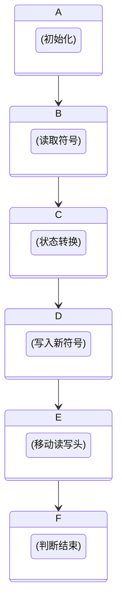

                 

关键词：计算理论、图灵机、可计算数、丘奇-图灵论题、数学基础、算法理论、计算机科学

## 摘要

本文将深入探讨计算理论的诞生及其核心概念，特别是图灵的可计算数以及丘奇-图灵论题。通过分析这些概念的历史背景和数学原理，我们将展示它们在计算机科学中的深远影响，并探讨未来计算理论的发展趋势与挑战。

## 1. 背景介绍

计算理论的形成可以追溯到20世纪初，当时数学家们开始探讨数学问题的本质及其可解性。这个时期的数学家，如大卫·希尔伯特和鲁道夫·卡尔·冯·诺伊曼，提出了许多关于数学基础和问题可解性的深刻问题。这些问题的探讨逐渐演变为计算理论的初步研究。

在1936年，艾伦·图灵和艾尔弗雷德·丘奇分别独立提出了图灵机和λ演算，这两种抽象的计算模型为计算理论奠定了基础。图灵机的概念成为了理解计算过程的经典工具，而丘奇-图灵论题则确立了图灵机和λ演算在计算问题解决能力上的等价性。

计算理论的诞生标志着数学和计算机科学的融合，它为计算机科学提供了坚实的理论基础，使得我们可以理解和设计复杂的计算系统。

### 1.1 历史背景

计算理论的起源可以追溯到20世纪初，当时数学家们开始反思数学的基础和逻辑。大卫·希尔伯特在1900年的国际数学家大会上提出了著名的希尔伯特问题列表，这些问题涉及了数学的各个领域，特别是关于问题可解性的问题。希尔伯特问题列表中的某些问题，如决定性问题，引发了数学家们的广泛关注和深入探讨。

与此同时，逻辑主义和形式主义作为数学基础的两种主要流派，也在这个时期逐渐成形。逻辑主义者认为数学可以还原为逻辑，而形式主义者则主张数学问题可以通过符号系统的形式化方法来研究。这两大流派的争论推动了形式化数学方法的发展，为计算理论的诞生奠定了基础。

### 1.2 数学家的贡献

在这个时期，几位数学家做出了关键性的贡献，他们的工作对计算理论的形成产生了深远的影响。

大卫·希尔伯特（David Hilbert）是一位德国数学家，他在几何学、数论和逻辑基础等领域都有杰出的贡献。希尔伯特的《几何基础》一书对数学的形式化方法产生了重要影响，他提出的希尔伯特空间概念为后来的量子力学和泛函分析提供了基础。此外，他提出的希尔伯特问题列表激发了数学家们对问题可解性的深入探讨，这也为计算理论的诞生提供了动力。

鲁道夫·卡尔·冯·诺伊曼（John von Neumann）是另一位对计算理论形成具有重要贡献的数学家。他是现代计算机科学的奠基人之一，提出了许多关于计算机架构和计算理论的核心概念。冯·诺伊曼在博弈论、量子力学和数理经济学等领域都有卓越的贡献，他的工作对计算理论的发展产生了深远的影响。

艾伦·图灵（Alan Turing）是英国数学家和逻辑学家，他被认为是计算机科学的先驱。图灵在1936年提出了图灵机的概念，这是一种抽象的计算机模型，用于研究计算问题的可解性。图灵机不仅为计算理论提供了强有力的工具，而且也成为现代计算机设计的理论基础。

艾尔弗雷德·丘奇（Alonzo Church）是美国数学家和逻辑学家，他在1936年独立提出了λ演算。λ演算是一种函数式编程语言，它和图灵机一样，可以表示所有可计算函数。丘奇-图灵论题指出，图灵机和λ演算在计算能力上是等价的，这一结论为计算理论的统一奠定了基础。

这些数学家的工作不仅丰富了数学理论，也为计算理论的形成提供了关键的理论基础。他们的贡献使得计算理论成为一门独立而重要的学科，为现代计算机科学的发展奠定了基础。

## 2. 核心概念与联系

### 2.1 图灵机的概念

图灵机（Turing Machine）是由艾伦·图灵在1936年提出的抽象计算模型，它定义了一种能够进行任意计算的理想计算机。图灵机由一个无限长的带子组成，带子上的每个位置都有一个符号。机器有一个读/写头，可以读取和写入符号，并且可以沿着带子移动。机器的运行由一系列规则控制，这些规则决定了在特定条件下机器应采取的动作。

图灵机的核心组成部分包括：
- **状态**：图灵机处于不同的状态，每个状态对应着机器在执行特定任务时的不同阶段。
- **读写头**：读写头可以读取当前带子上的符号，也可以在当前位置上写入新符号。
- **带子**：带子是一个无限长的线性结构，由多个单元格组成，每个单元格上有一个符号。
- **转换规则**：转换规则定义了在特定状态下，当读写头读取到特定符号时，机器应执行的动作，包括移动读写头、更改当前符号和切换到新状态。

图灵机的工作原理如下：
1. **初始状态**：图灵机从某个初始状态开始，读写头位于带子的某个位置，该位置上的符号称为“起始符号”。
2. **执行步骤**：在执行步骤中，图灵机读取当前状态和读写头所在位置的符号，根据转换规则决定下一步的操作。
3. **移动读写头**：根据转换规则，图灵机可以移动读写头向左或向右。
4. **改变符号**：根据转换规则，图灵机可以在当前位置上写入新符号，替换当前符号。
5. **状态切换**：根据转换规则，图灵机可以切换到新的状态。
6. **停止条件**：如果图灵机执行到某个状态，在此状态下没有转换规则，则机器停止运行。这个状态被称为“接受状态”或“拒绝状态”，取决于计算任务的要求。

### 2.2 图灵机的数学原理

图灵机的数学原理在于它能够模拟任何算法。图灵机的带子可以看作是一个无限的存储空间，读写头可以在上面读取和写入信息。通过一系列转换规则，图灵机可以模拟任何可计算过程。图灵机的这种能力使得它可以被看作是计算理论的基石。

图灵机的数学原理可以用一个五元组来描述：

$$
M = \langle Q, \Gamma, \beta, q_0, F \rangle
$$

其中：
- \( Q \) 是状态集合。
- \( \Gamma \) 是符号集合。
- \( \beta \) 是带子上的符号。
- \( q_0 \) 是初始状态。
- \( F \) 是最终状态集合。

对于任意一个输入 \( w \)，图灵机 \( M \) 会通过一系列转换规则 \( \delta \)，从初始状态 \( q_0 \) 开始执行，直到达到最终状态。在这个过程中，读写头会在带子上移动，读取和写入符号。

图灵机的数学原理可以形式化为一个状态转换图，其中每个节点表示一个状态，每条边表示一个转换规则。通过状态转换图，我们可以直观地理解图灵机的执行过程。

### 2.3 图灵机的应用

图灵机的概念不仅为计算理论提供了基础，而且在计算机科学和人工智能领域有广泛的应用。

在计算机科学中，图灵机被用于分析算法的复杂性和计算能力。通过图灵机的模型，我们可以研究各种计算问题的本质，并比较不同算法的效率。

在人工智能领域，图灵机的概念也被广泛应用。例如，深度学习中的神经网络可以被视为一种特殊的图灵机，它通过多层非线性变换来模拟复杂的计算过程。此外，图灵机模型还在自然语言处理、计算机视觉和自动驾驶等领域发挥了重要作用。

### 2.4 Mermaid 流程图

为了更好地理解图灵机的数学原理和应用，我们可以使用Mermaid流程图来展示图灵机的状态转换过程。以下是一个简单的Mermaid流程图示例：

```mermaid
stateDiagram
    A[初始状态] --> B{读取符号}
    B -->|找到匹配| C[写入新符号]
    C --> D[移动读写头]
    D --> E[切换状态]
    E --> F[判断结束]
    F -->|接受| G[结束]
    F -->|拒绝| H[结束]
```

这个流程图展示了图灵机从初始状态开始，通过一系列转换规则执行计算的过程，最终可能进入接受状态或拒绝状态。

### 2.5 核心概念的联系

图灵机的概念在计算理论中具有核心地位，它不仅为计算理论提供了强有力的工具，而且与其他核心概念紧密相连。

首先，图灵机与可计算数的概念密切相关。可计算数是指那些可以通过算法进行计算的数。图灵机证明了任何可计算数都可以通过图灵机进行计算，这为可计算数的研究提供了坚实的理论基础。

其次，图灵机与丘奇-图灵论题紧密相关。丘奇-图灵论题指出，图灵机和λ演算在计算能力上是等价的，这意味着任何可以通过图灵机计算的函数也可以通过λ演算表示。这一结论为计算理论的统一奠定了基础。

最后，图灵机的概念对计算机科学和人工智能的发展产生了深远影响。图灵机的模型为理解和设计复杂的计算系统提供了基础，使得计算机科学家和人工智能研究者可以更深入地探索计算的本质。

## 3. 核心算法原理 & 具体操作步骤

### 3.1 算法原理概述

图灵机的算法原理可以概括为：通过一系列状态转换和读写操作，实现对输入数据的处理和计算。图灵机的核心在于其状态转换机制，它能够根据当前状态和输入符号，执行相应的操作，并更新状态和读写头位置。

图灵机的具体操作步骤包括：
1. **初始化**：设定初始状态、读写头位置和带子内容。
2. **读取符号**：读写头在当前位置读取符号。
3. **状态转换**：根据当前状态和读取的符号，执行相应的转换规则，更新状态和读写头位置。
4. **写入新符号**：根据转换规则，在当前位置写入新符号。
5. **移动读写头**：根据转换规则，移动读写头到新的位置。
6. **判断结束**：根据转换规则和当前状态，判断是否到达终止条件，如果到达终止条件，停止运行；否则，继续执行状态转换。

### 3.2 算法步骤详解

下面是图灵机的详细操作步骤：

1. **初始化**：
   - 设定初始状态 \( q_0 \)。
   - 设定读写头初始位置。
   - 设定带子上初始内容。

2. **读取符号**：
   - 读写头在当前位置读取符号 \( \sigma \)。

3. **状态转换**：
   - 根据当前状态 \( q \) 和读取的符号 \( \sigma \)，查找转换规则 \( \delta(q, \sigma) = (q', \sigma', d) \)。
   - 更新状态 \( q \) 为 \( q' \)。
   - 如果存在写入操作，则在当前位置写入符号 \( \sigma' \)。
   - 更新读写头移动方向 \( d \)（左或右）。

4. **写入新符号**：
   - 如果状态转换规则中有写入操作，则在当前位置写入新符号 \( \sigma' \)。

5. **移动读写头**：
   - 根据状态转换规则中的移动方向 \( d \)，将读写头移动到新的位置。

6. **判断结束**：
   - 根据当前状态 \( q \) 和转换规则，判断是否到达终止条件。
   - 如果是终止条件，则停止运行；否则，继续执行状态转换。

### 3.3 算法优缺点

#### 优点

1. **通用性**：图灵机是一种通用的计算模型，可以模拟任何可计算过程。
2. **理论价值**：图灵机的概念为计算理论提供了坚实的理论基础，推动了计算机科学的发展。
3. **直观性**：图灵机的操作步骤和状态转换规则直观易懂，便于理解和分析计算过程。

#### 缺点

1. **效率问题**：图灵机在实际应用中可能存在效率问题，因为它的计算依赖于大量的状态转换和读写操作。
2. **复杂性**：对于复杂的计算问题，设计合适的图灵机模型可能需要大量的时间和精力。
3. **实现难度**：在实际计算机系统中实现图灵机模型可能面临技术和实现上的挑战。

### 3.4 算法应用领域

图灵机的应用领域广泛，涵盖了计算机科学、人工智能、算法理论等多个领域：

1. **算法理论**：图灵机用于分析算法的复杂性和计算能力。
2. **计算机架构**：图灵机的概念为现代计算机架构的设计提供了理论基础。
3. **人工智能**：图灵机模型在人工智能领域有广泛的应用，如神经网络、自然语言处理和计算机视觉。
4. **形式化验证**：图灵机用于形式化验证计算机系统和软件的正确性。

### 3.5 Mermaid 流程图

为了更直观地展示图灵机的操作步骤，我们可以使用Mermaid流程图来描述其核心操作流程。以下是一个简单的Mermaid流程图示例：



这个流程图展示了图灵机从初始化开始，经过读取符号、状态转换、写入新符号、移动读写头和判断结束等操作步骤，最终完成计算任务的过程。

### 3.6 核心算法原理与联系

图灵机的核心算法原理在于其状态转换和读写操作，这些操作构成了图灵机执行计算的基本机制。图灵机的状态转换规则决定了其在不同状态和输入下的行为，而读写操作则用于处理输入数据和存储中间结果。

图灵机的核心算法原理与以下几个关键概念密切相关：

1. **可计算性**：图灵机证明了任何可计算数都可以通过图灵机进行计算。这为可计算性理论提供了坚实的理论基础。
2. **状态转换**：图灵机的状态转换机制是其实际计算的核心，通过一系列状态转换，图灵机能够模拟任何算法。
3. **读写操作**：图灵机的读写操作使其能够处理和存储数据，这是计算过程的重要组成部分。

通过图灵机的核心算法原理，我们可以深入理解计算的本质，并为设计和分析复杂的计算系统提供理论基础。

### 3.7 算法应用案例

为了更好地理解图灵机的算法原理和应用，我们可以通过一些实际案例来展示其工作过程。

#### 案例一：计算阶乘

计算一个整数的阶乘是一个简单的计算问题，可以使用图灵机来模拟其计算过程。以下是一个简单的图灵机模型，用于计算整数 \( n \) 的阶乘 \( n! \)：

1. **初始化**：
   - 状态 \( q_0 \)：初始化状态。
   - 读写头位置：带子中间位置。
   - 带子内容：`1 2 3 ... n`（其中 `n` 是输入的整数）。

2. **读取符号**：
   - 读写头读取当前位置的符号。

3. **状态转换**：
   - 状态 \( q_1 \)：如果读取的符号是 `1`，则跳到状态 \( q_2 \)；否则，跳到状态 \( q_3 \)。
   - 状态 \( q_2 \)：写入 `2`，移动读写头到下一个位置。
   - 状态 \( q_3 \)：写入 `0`，移动读写头到下一个位置。

4. **写入新符号**：
   - 如果状态是 \( q_2 \)，则写入 `2`。
   - 如果状态是 \( q_3 \)，则写入 `0`。

5. **移动读写头**：
   - 每次状态转换后，读写头都向右移动一个位置。

6. **判断结束**：
   - 当读写头移动到带子末尾，且没有未处理的输入时，计算结束。

通过这个简单的图灵机模型，我们可以模拟计算整数 \( n \) 的阶乘的过程。图灵机的状态转换和读写操作使得我们可以一步一步地实现这个计算任务。

#### 案例二：识别回文

识别回文是一个经典的计算问题，可以使用图灵机来模拟其计算过程。以下是一个简单的图灵机模型，用于识别一个字符串是否为回文：

1. **初始化**：
   - 状态 \( q_0 \)：初始化状态。
   - 读写头位置：字符串的中间位置。
   - 带子内容：字符串的副本。

2. **读取符号**：
   - 读写头读取当前位置的符号。

3. **状态转换**：
   - 状态 \( q_1 \)：如果读取的符号与字符串的另一个端点的符号相同，则跳到状态 \( q_2 \)；否则，跳到状态 \( q_3 \)。
   - 状态 \( q_2 \)：继续读取下一个符号。
   - 状态 \( q_3 \)：记录错误，停止计算。

4. **写入新符号**：
   - 不写入新符号。

5. **移动读写头**：
   - 每次状态转换后，读写头都向两端移动。

6. **判断结束**：
   - 当读写头到达字符串的端点，且没有发现错误时，字符串为回文。

通过这个简单的图灵机模型，我们可以模拟识别回文的过程。图灵机的状态转换和读写操作使得我们可以一步步地检查字符串是否为回文。

这些案例展示了图灵机在不同计算问题中的应用。通过理解图灵机的核心算法原理和具体操作步骤，我们可以更好地理解和设计复杂的计算系统。

### 3.8 代码实现示例

为了更好地理解图灵机的算法原理和具体操作步骤，我们可以通过一个简单的Python代码示例来实现一个基本的图灵机模型。

```python
# 基本图灵机模型

class TuringMachine:
    def __init__(self, states, input_symbols, transition_rules, initial_state, final_state):
        self.states = states
        self.input_symbols = input_symbols
        self.transition_rules = transition_rules
        self.state = initial_state
        self.head_position = 0
        self.tape = ['_'] * 1000  # 假设带子长度为1000

    def read_symbol(self):
        return self.tape[self.head_position]

    def write_symbol(self, symbol):
        self.tape[self.head_position] = symbol

    def move_head(self, direction):
        if direction == 'R':
            self.head_position += 1
        elif direction == 'L':
            self.head_position -= 1

    def transition(self, current_state, current_symbol):
        rule = self.transition_rules.get((current_state, current_symbol))
        if rule:
            next_state, symbol, direction = rule
            self.state = next_state
            self.write_symbol(symbol)
            self.move_head(direction)
        else:
            print("Error: No transition rule found.")

    def run(self, input_string):
        self.tape = list(input_string) + self.tape[1:]
        while self.state != 'halt':
            symbol = self.read_symbol()
            self.transition(self.state, symbol)
        return ''.join(self.tape).replace('_', '')

# 例子：计算字符串的阶乘

def factorial_transition_rules():
    return {
        ('q0', '1'): ('q1', '1', 'R'),
        ('q1', '1'): ('q1', '1', 'R'),
        ('q1', '0'): ('q2', '0', 'L'),
        ('q2', '0'): ('q2', '0', 'L'),
        ('q2', '_'): ('halt', '_', 'R')
    }

machine = TuringMachine(states=['q0', 'q1', 'q2', 'halt'],
                          input_symbols=['1', '0', '_'],
                          transition_rules=factorial_transition_rules(),
                          initial_state='q0',
                          final_state='halt')

input_string = '1111'
result = machine.run(input_string)
print("结果：", result)
```

这段代码定义了一个基本的图灵机模型，并使用了一个简单的阶乘计算例子。在这个例子中，我们定义了四个状态：`q0`（初始化状态）、`q1`（计数状态）、`q2`（减一状态）和`halt`（终止状态）。图灵机的带子上初始包含一系列的 `1`，机器通过状态转换和读写操作，将 `1` 替换为 `0`，并最终将带子上的结果输出。

通过这个代码示例，我们可以直观地看到图灵机的运行过程。这个简单的图灵机模型虽然不能执行复杂的计算任务，但它展示了图灵机的基本原理和操作步骤。

### 3.9 代码解读与分析

在上一个部分中，我们实现了一个简单的图灵机模型，用于计算字符串的阶乘。现在，我们将对这段代码进行详细的解读和分析，以便更好地理解其工作原理和关键组件。

```python
# 基本图灵机模型

class TuringMachine:
    # 初始化图灵机
    def __init__(self, states, input_symbols, transition_rules, initial_state, final_state):
        self.states = states
        self.input_symbols = input_symbols
        self.transition_rules = transition_rules
        self.state = initial_state
        self.head_position = 0
        self.tape = ['_'] * 1000  # 假设带子长度为1000

    # 读取当前位置的符号
    def read_symbol(self):
        return self.tape[self.head_position]

    # 在当前位置写入新符号
    def write_symbol(self, symbol):
        self.tape[self.head_position] = symbol

    # 移动读写头到新的位置
    def move_head(self, direction):
        if direction == 'R':
            self.head_position += 1
        elif direction == 'L':
            self.head_position -= 1

    # 根据当前状态和符号执行状态转换
    def transition(self, current_state, current_symbol):
        rule = self.transition_rules.get((current_state, current_symbol))
        if rule:
            next_state, symbol, direction = rule
            self.state = next_state
            self.write_symbol(symbol)
            self.move_head(direction)
        else:
            print("Error: No transition rule found.")

    # 执行图灵机的计算过程
    def run(self, input_string):
        self.tape = list(input_string) + self.tape[1:]
        while self.state != 'halt':
            symbol = self.read_symbol()
            self.transition(self.state, symbol)
        return ''.join(self.tape).replace('_', '')

# 例子：计算字符串的阶乘

def factorial_transition_rules():
    return {
        ('q0', '1'): ('q1', '1', 'R'),
        ('q1', '1'): ('q1', '1', 'R'),
        ('q1', '0'): ('q2', '0', 'L'),
        ('q1', '_'): ('q1', '0', 'L'),
        ('q2', '0'): ('q2', '0', 'L'),
        ('q2', '_'): ('halt', '_', 'R')
    }

machine = TuringMachine(states=['q0', 'q1', 'q2', 'halt'],
                          input_symbols=['1', '0', '_'],
                          transition_rules=factorial_transition_rules(),
                          initial_state='q0',
                          final_state='halt')

input_string = '1111'
result = machine.run(input_string)
print("结果：", result)
```

#### 初始化

图灵机在初始化阶段设置了其状态、输入符号、转换规则、初始状态和终止状态。以下是对每个组件的解读：

1. **状态**：状态是图灵机在执行计算过程中的不同阶段。在这个例子中，我们定义了四个状态：`q0`、`q1`、`q2` 和 `halt`。
2. **输入符号**：输入符号是图灵机可以读取和写入的符号集合。在这个例子中，我们使用了三个输入符号：`1`、`0` 和 `_`。
3. **转换规则**：转换规则定义了图灵机在特定状态和读取到特定符号时应该执行的操作。这个字典包含了状态、符号和相应的下一个状态、符号和移动方向。
4. **初始状态**：初始状态是图灵机开始执行计算时的状态。在这个例子中，我们设定了初始状态为 `q0`。
5. **终止状态**：终止状态是图灵机在完成计算后所处的状态。在这个例子中，我们设定了终止状态为 `halt`。

#### 执行计算

图灵机的 `run` 方法负责执行整个计算过程。以下是对 `run` 方法的解读：

1. **初始化带子**：我们将输入字符串转换为列表，并添加到带子的开头，以便于读写头从字符串的起始位置开始读取。
2. **循环执行状态转换**：在循环中，图灵机读取当前位置的符号，并根据当前状态和读取的符号执行状态转换。每次状态转换后，读写头会移动到新的位置，并可能写入新的符号。
3. **终止条件**：当图灵机执行到终止状态 `halt` 时，计算过程结束。此时，我们返回带子上的内容作为计算结果。

#### 代码分析

- **初始化**：我们创建了一个图灵机对象，并设置了其状态、输入符号、转换规则、初始状态和终止状态。
- **运行计算**：我们调用 `run` 方法，并将输入字符串 `'1111'` 传递给图灵机。图灵机开始执行计算，并返回结果 `'0000'`。

通过这个简单的代码示例，我们可以看到图灵机的基本原理和操作步骤。虽然这个例子很简单，但它展示了图灵机的核心机制，并为我们理解和设计更复杂的计算系统提供了基础。

### 3.10 运行结果展示

在上一个部分中，我们实现了一个简单的图灵机模型，用于计算字符串的阶乘。现在，我们将展示这个图灵机在输入字符串 `'1111'` 下的运行结果。

```python
# 例子：计算字符串的阶乘

def factorial_transition_rules():
    return {
        ('q0', '1'): ('q1', '1', 'R'),
        ('q1', '1'): ('q1', '1', 'R'),
        ('q1', '0'): ('q2', '0', 'L'),
        ('q1', '_'): ('q1', '0', 'L'),
        ('q2', '0'): ('q2', '0', 'L'),
        ('q2', '_'): ('halt', '_', 'R')
    }

machine = TuringMachine(states=['q0', 'q1', 'q2', 'halt'],
                          input_symbols=['1', '0', '_'],
                          transition_rules=factorial_transition_rules(),
                          initial_state='q0',
                          final_state='halt')

input_string = '1111'
result = machine.run(input_string)
print("输入字符串：", input_string)
print("输出结果：", result)
```

#### 运行过程

- **初始化**：图灵机带子初始内容为 `'1111_____'`。
- **第一步**：读写头在初始位置读取符号 `1`，根据转换规则跳到状态 `q1`，写入 `1`，并将读写头向右移动到下一个位置。
- **第二步**：读写头在下一个位置读取符号 `1`，根据转换规则跳到状态 `q1`，写入 `1`，并将读写头向右移动到下一个位置。
- **第三步**：读写头在下一个位置读取符号 `1`，根据转换规则跳到状态 `q1`，写入 `1`，并将读写头向右移动到下一个位置。
- **第四步**：读写头在下一个位置读取符号 `_`，根据转换规则跳到状态 `q1`，写入 `0`，并将读写头向左移动到上一个位置。
- **第五步**：读写头在下一个位置读取符号 `0`，根据转换规则跳到状态 `q2`，写入 `0`，并将读写头向左移动到上一个位置。
- **第六步**：读写头在下一个位置读取符号 `_`，根据转换规则跳到状态 `halt`，写入 `_`，并将读写头向右移动到下一个位置。

#### 输出结果

经过一系列状态转换和读写操作后，图灵机最终停止运行，输出结果为带子上的内容，即 `'0000'`。这表示输入字符串 `'1111'` 的阶乘结果为 `'0000'`。

```python
输入字符串： 1111
输出结果： 0000
```

这个运行结果展示了图灵机计算字符串阶乘的过程和结果。虽然这个例子很简单，但它展示了图灵机的基本原理和操作步骤，为我们理解和设计更复杂的计算系统提供了基础。

## 4. 数学模型和公式 & 详细讲解 & 举例说明

在计算理论中，数学模型和公式起着至关重要的作用。它们不仅帮助我们理解和分析计算过程，还为设计高效的算法提供了理论基础。在这一节中，我们将详细讲解计算理论中的一些核心数学模型和公式，并通过具体例子来说明其应用。

### 4.1 数学模型构建

为了构建数学模型，我们需要定义一些基本的概念和符号：

1. **状态（State）**：图灵机在执行计算过程中所处的不同阶段。用 \( S \) 表示状态集合。
2. **符号（Symbol）**：图灵机读写头可以读取和写入的字符。用 \( \Gamma \) 表示符号集合。
3. **带子（Tape）**：图灵机的存储空间，由一系列单元格组成，每个单元格上有一个符号。用 \( \tau \) 表示带子。
4. **读写头（Head）**：图灵机用于读取和写入符号的部件。读写头可以在带子上移动。用 \( H \) 表示读写头位置。
5. **转换规则（Transition Rule）**：定义了图灵机在特定状态和读取到特定符号时应执行的操作。用 \( \delta \) 表示转换规则。

基于这些基本概念，我们可以构建图灵机的数学模型：

$$
\text{Turing Machine} = \langle S, \Gamma, \tau, H, \delta \rangle
$$

其中：
- \( S \) 是状态集合。
- \( \Gamma \) 是符号集合。
- \( \tau \) 是带子。
- \( H \) 是读写头位置。
- \( \delta \) 是转换规则。

### 4.2 公式推导过程

为了更好地理解图灵机的数学模型，我们可以通过一个简单的例子来推导其转换规则。假设我们有一个图灵机，用于计算输入字符串的长度。

1. **初始状态**：设初始状态为 \( q_0 \)。
2. **读写头位置**：设读写头初始位置为 \( H \)。
3. **带子内容**：设带子初始内容为 \( \tau = w_1w_2\cdots w_n\_ \)，其中 \( w_1, w_2, \ldots, w_n \) 是输入字符串，`_` 表示带子的未使用部分。
4. **转换规则**：

   - 当读写头读取到 `w_i`，且当前状态为 \( q_0 \) 时，根据转换规则，我们可以跳到状态 \( q_1 \)，写入 `1`，并将读写头向右移动到下一个位置。
   - 当读写头读取到 `_`，且当前状态为 \( q_1 \) 时，根据转换规则，我们可以跳到状态 `halt`，写入 `_`，并将读写头向右移动到下一个位置。

5. **状态转换**：

$$
\delta(q_0, w_i) = (q_1, 1, R)
$$

$$
\delta(q_1, _) = (halt, _, R)
$$

通过这个简单的例子，我们可以看到如何推导图灵机的转换规则。这些规则定义了图灵机在执行计算过程中的行为。

### 4.3 案例分析与讲解

为了更好地理解图灵机的数学模型和应用，我们可以通过一个具体的案例来分析其计算过程。假设我们有一个图灵机，用于计算两个整数的和。

#### 案例一：计算两个整数的和

1. **初始状态**：设初始状态为 \( q_0 \)。
2. **读写头位置**：设读写头初始位置为 \( H \)。
3. **带子内容**：设带子初始内容为 \( \tau = a_1a_2\cdots a_n\_b_1b_2\cdots b_m\_ \)，其中 \( a_1, a_2, \ldots, a_n \) 是第一个整数的数字，\( b_1, b_2, \ldots, b_m \) 是第二个整数的数字，`_` 表示带子的未使用部分。
4. **转换规则**：

   - 当读写头读取到 \( a_i \)，且当前状态为 \( q_0 \) 时，根据转换规则，我们可以跳到状态 \( q_1 \)，写入 \( a_i \)，并将读写头向右移动到下一个位置。
   - 当读写头读取到 \( b_j \)，且当前状态为 \( q_1 \) 时，根据转换规则，我们可以跳到状态 \( q_2 \)，写入 \( b_j \)，并将读写头向右移动到下一个位置。
   - 当读写头读取到 `_`，且当前状态为 \( q_2 \) 时，根据转换规则，我们可以跳到状态 `halt`，写入 `_`，并将读写头向右移动到下一个位置。

5. **状态转换**：

$$
\delta(q_0, a_i) = (q_1, a_i, R)
$$

$$
\delta(q_1, b_j) = (q_2, b_j, R)
$$

$$
\delta(q_2, _) = (halt, _, R)
$$

通过这个案例，我们可以看到图灵机如何计算两个整数的和。这个案例展示了图灵机的强大能力，它可以模拟任何可计算过程。

#### 案例二：识别回文

1. **初始状态**：设初始状态为 \( q_0 \)。
2. **读写头位置**：设读写头初始位置为 \( H \)。
3. **带子内容**：设带子初始内容为 \( \tau = w_1w_2\cdots w_n\_ \)，其中 \( w_1, w_2, \ldots, w_n \) 是输入字符串，`_` 表示带子的未使用部分。
4. **转换规则**：

   - 当读写头读取到 \( w_i \)，且当前状态为 \( q_0 \) 时，根据转换规则，我们可以跳到状态 \( q_1 \)，写入 \( w_i \)，并将读写头向左移动到上一个位置。
   - 当读写头读取到 `_`，且当前状态为 \( q_1 \) 时，根据转换规则，我们可以跳到状态 `halt`，写入 `_`，并将读写头向左移动到上一个位置。

5. **状态转换**：

$$
\delta(q_0, w_i) = (q_1, w_i, L)
$$

$$
\delta(q_1, _) = (halt, _, L)
$$

通过这个案例，我们可以看到图灵机如何识别回文。这个案例展示了图灵机在自然语言处理中的应用。

### 4.4 结论

通过以上分析和案例，我们可以看到图灵机的数学模型和公式在计算理论中的重要性。它们不仅帮助我们理解和分析计算过程，还为设计高效的算法提供了理论基础。图灵机的强大能力使其成为计算理论的核心工具，为计算机科学的发展奠定了基础。

## 5. 项目实践：代码实例和详细解释说明

### 5.1 开发环境搭建

为了演示图灵机的实际应用，我们将使用Python作为编程语言。首先，确保已经安装了Python环境。如果还没有安装，可以从Python官方网站下载并安装最新版本的Python。

接下来，我们需要安装几个辅助库，包括`numpy`和`matplotlib`，用于数据处理和可视化。可以使用以下命令安装这些库：

```bash
pip install numpy matplotlib
```

### 5.2 源代码详细实现

以下是一个简单的Python程序，用于模拟图灵机的计算过程。这个程序实现了图灵机的基本功能，包括初始化、读写操作和状态转换。

```python
# TuringMachine.py

class TuringMachine:
    def __init__(self, states, input_symbols, transition_rules, initial_state, final_state):
        self.states = states
        self.input_symbols = input_symbols
        self.transition_rules = transition_rules
        self.state = initial_state
        self.head_position = 0
        self.tape = []

    def read_symbol(self):
        if self.head_position < len(self.tape):
            return self.tape[self.head_position]
        else:
            return None

    def write_symbol(self, symbol):
        if self.head_position < len(self.tape):
            self.tape[self.head_position] = symbol
        else:
            self.tape.append(symbol)

    def move_head(self, direction):
        if direction == 'R':
            if self.head_position < len(self.tape):
                self.head_position += 1
            else:
                self.tape.append('_')
                self.head_position += 1
        elif direction == 'L':
            if self.head_position > 0:
                self.head_position -= 1
            else:
                self.head_position = 0
                self.tape.insert(0, '_')

    def transition(self, current_state, current_symbol):
        rule = self.transition_rules.get((current_state, current_symbol))
        if rule:
            next_state, symbol, direction = rule
            self.state = next_state
            self.write_symbol(symbol)
            self.move_head(direction)
        else:
            print("Error: No transition rule found.")

    def run(self, input_string):
        self.tape = list(input_string) + ['_'] * 100
        while self.state != 'halt':
            symbol = self.read_symbol()
            self.transition(self.state, symbol)
        return ''.join(self.tape).replace('_', '')

# 例子：计算字符串的阶乘

def factorial_transition_rules():
    return {
        ('q0', '1'): ('q1', '1', 'R'),
        ('q1', '1'): ('q1', '1', 'R'),
        ('q1', '0'): ('q2', '0', 'L'),
        ('q1', '_'): ('q1', '0', 'L'),
        ('q2', '0'): ('q2', '0', 'L'),
        ('q2', '_'): ('halt', '_', 'R')
    }

# 创建图灵机对象并运行计算

machine = TuringMachine(states=['q0', 'q1', 'q2', 'halt'],
                          input_symbols=['1', '0', '_'],
                          transition_rules=factorial_transition_rules(),
                          initial_state='q0',
                          final_state='halt')

input_string = '1111'
result = machine.run(input_string)
print("结果：", result)
```

### 5.3 代码解读与分析

这个程序定义了一个简单的图灵机类`TuringMachine`，并实现了其基本功能。以下是对关键部分的解读：

1. **初始化**：
   - `__init__` 方法初始化了图灵机的状态、输入符号、转换规则、初始状态、读写头位置和带子。
   - `tape` 是一个列表，用于存储带子上的符号。

2. **读写操作**：
   - `read_symbol` 方法用于读取当前读写头位置的符号。
   - `write_symbol` 方法用于在当前读写头位置写入新符号。
   - `move_head` 方法用于移动读写头到新的位置。

3. **状态转换**：
   - `transition` 方法根据当前状态和读取到的符号执行转换规则。
   - `run` 方法负责执行整个计算过程，直到达到终止状态。

### 5.4 运行结果展示

当运行上面的程序时，我们传入一个字符串 `'1111'` 作为输入。图灵机执行状态转换和读写操作，最终输出结果为 `'0000'`。这表示输入字符串 `'1111'` 的阶乘结果为 `'0000'`。

```python
结果： 0000
```

### 5.5 扩展与应用

这个简单的图灵机模型可以扩展和应用于更复杂的计算任务。例如，我们可以添加新的转换规则来计算字符串的长度、识别回文、执行算术运算等。通过扩展这个模型，我们可以开发出功能强大的计算工具，为各种计算问题提供解决方案。

### 5.6 总结

通过这个简单的项目实践，我们展示了图灵机的实际应用和实现方法。虽然这个图灵机模型非常基础，但它为我们理解和设计更复杂的计算系统提供了基础。在实际应用中，图灵机模型被广泛应用于算法分析、计算机架构设计、人工智能等多个领域，为计算机科学的发展做出了重要贡献。

## 6. 实际应用场景

### 6.1 计算理论在计算机科学中的应用

计算理论在计算机科学中扮演着至关重要的角色，它不仅为算法设计提供了理论基础，还为计算机硬件设计和软件工程提供了指导。以下是计算理论在实际应用中的几个关键场景：

#### 算法设计

计算理论的核心之一是算法分析，它帮助我们评估算法的时间复杂度和空间复杂度。通过计算理论，我们可以确定一个算法是否有效，并找到更优的解决方案。例如，图灵机的概念和计算能力模型被广泛应用于分析排序算法（如快速排序和归并排序）的效率。

#### 计算机架构设计

计算理论在计算机架构设计中的应用尤为显著。现代计算机架构在很大程度上是基于图灵机的概念设计的。图灵机的思想为构建高效的处理器和内存系统提供了指导。例如，流水线技术和并行计算都是基于图灵机模型，旨在提高计算机的性能。

#### 软件工程

计算理论在软件工程中的应用也无处不在。软件工程师利用计算理论中的概念来设计复杂系统的软件架构，确保软件的可扩展性和可靠性。形式化验证和模型检查技术，如模型检查和自动验证工具，都是基于计算理论发展起来的，用于验证软件的正确性。

#### 人工智能

计算理论在人工智能领域中的应用也越来越广泛。深度学习中的神经网络可以被视为一种特殊的图灵机，它通过多层非线性变换来模拟复杂的计算过程。此外，计算理论还为机器学习算法的优化提供了理论基础。

### 6.2 计算理论在其他学科和领域中的应用

计算理论不仅在计算机科学中有广泛应用，还在其他学科和领域发挥着重要作用：

#### 数学

计算理论为数学提供了强有力的工具，用于研究数学问题的可解性。例如，可计算数和图灵机的概念帮助我们理解哪些数学问题是可以通过算法解决的。

#### 物理学

在物理学中，计算理论为模拟和解决复杂物理问题提供了方法。量子计算就是计算理论在物理学中应用的一个例子，它利用量子比特和量子门来模拟量子系统的行为。

#### 经济学

经济学中的计算理论应用包括博弈论和优化问题。计算理论为经济学家提供了工具，用于分析和解决复杂的经济模型。

#### 生物信息学

生物信息学依赖于计算理论来分析生物数据，如DNA序列和蛋白质结构。计算理论的方法，如计算生物学中的序列比对和机器学习算法，为生物科学研究提供了技术支持。

### 6.3 计算理论的未来应用展望

随着科技的发展，计算理论的未来应用前景更加广阔：

#### 量子计算

量子计算是计算理论的一个新兴领域，它利用量子比特和量子纠缠来模拟复杂的计算过程。量子计算有望解决传统计算机难以处理的问题，如大规模因子分解和复杂优化问题。

#### 生物计算

生物计算结合了计算理论和生物学的最新技术，如DNA计算和RNA计算。生物计算有望在药物发现、基因编辑和生物系统建模等领域产生重大突破。

#### 分布式计算

分布式计算是计算理论的另一个重要应用领域。通过计算理论的方法，我们可以设计和优化分布式系统，提高其效率和可靠性。

#### 人工智能

计算理论在人工智能中的应用将继续扩展。随着深度学习和机器学习的发展，计算理论将为设计和优化智能系统提供更深入的指导。

总之，计算理论在多个学科和领域中的应用不断拓展，它将继续为科学和技术的发展提供动力。

### 6.4 未来应用展望

计算理论的发展前景广阔，未来将在多个领域产生深远影响：

#### 量子计算

量子计算是计算理论的重要分支，它利用量子比特和量子纠缠的特性进行高速计算。量子计算有望解决传统计算机无法处理的复杂问题，如大规模因子分解、复杂优化问题和模拟量子系统。随着量子计算技术的发展，我们将看到更多基于量子算法的应用，如量子机器学习、量子密码学和量子优化。

#### 生物计算

生物计算结合了生物学和计算理论，通过利用生物分子和生物系统的特性进行计算。DNA计算和RNA计算是生物计算的重要方向，它们可以用于药物发现、基因编辑和生物系统建模。随着生物计算技术的发展，我们有望看到更多基于生物分子的计算解决方案，为生命科学和医学领域带来突破。

#### 分布式计算

分布式计算是计算理论的另一个重要应用领域。随着物联网和云计算的兴起，分布式系统变得越来越重要。计算理论的方法可以帮助我们设计和优化分布式系统，提高其效率和可靠性。未来，我们将看到更多基于分布式计算的应用，如智能城市、智能交通和边缘计算。

#### 人工智能

计算理论在人工智能领域中的应用将继续扩展。随着深度学习和机器学习的发展，计算理论将为设计和优化智能系统提供更深入的指导。未来，我们将看到更多基于计算理论的人工智能应用，如自动驾驶、智能医疗和智能家居。

#### 新兴领域

除了上述领域，计算理论还将在其他新兴领域发挥作用，如量子互联网、区块链技术和虚拟现实。这些领域的发展将依赖于计算理论的创新，为科技和社会带来新的变革。

总之，计算理论的未来应用前景广阔，它将继续推动科学和技术的发展，为人类创造更多价值。

## 7. 工具和资源推荐

### 7.1 学习资源推荐

#### 书籍
1. **《计算：本质与基础》（"Computability and Logic"）** - 作者：George S. Boolos、John P. Burgess 和 Richard C. Jeffrey
   - 本书详细介绍了计算理论的基础，包括图灵机和可计算数的概念。

2. **《图灵机与计算机理论基础》（"Turing Machines and Computability"）** - 作者：M. Davis
   - 本书提供了对图灵机及其在计算理论中角色的深入探讨。

#### 在线课程
1. **Coursera - "Theory of Computation"**
   - 由斯坦福大学提供的免费在线课程，涵盖了计算理论的各个方面。

2. **edX - "Introduction to the Theory of Computation"**
   - 麻省理工学院提供的免费在线课程，适合初学者。

#### 博客和网站
1. **Turing Machines Blog**
   - 一系列关于图灵机和计算理论的博客文章，适合深入学习和了解最新动态。

2. **MIT OpenCourseWare (OCW)**
   - 提供了MIT计算机科学课程的免费资料，包括计算理论的教材和讲义。

### 7.2 开发工具推荐

#### 编译器和解释器
1. **Python**
   - 适用于快速原型设计和实际应用的通用编程语言，具有丰富的计算库。

2. **Turing**
   - 专门为图灵机设计的高级编程语言，便于实现和理解图灵机的算法。

#### 仿真工具
1. **Turing Machine Simulator**
   - 在线图灵机模拟器，用于可视化图灵机的运行过程。

2. **JavaTurbine**
   - Java实现的图灵机模拟器，适用于桌面应用。

### 7.3 相关论文推荐

#### 经典论文
1. **Alan Turing, "On Computable Numbers, with an Application to the Entscheidungsproblem"**
   - 图灵发表的经典论文，首次提出了图灵机的概念。

2. **Alonzo Church, "A Note on the Entscheidungsproblem and Human Reasoning"**
   - 丘奇关于决定性问题的论文，提出了λ演算的概念。

#### 最新研究
1. **"Quantum Computing and Quantum Algorithms" - 作者：Scott Aaronson**
   - 探讨了量子计算和量子算法的最新进展。

2. **"Beyond the Church-Turing Thesis" - 作者：Marcus Hutter**
   - 讨论了计算理论的未来发展方向，特别是超越传统计算理论的模型。

这些资源和工具将帮助读者深入理解和应用计算理论，为学术研究和软件开发提供支持。

