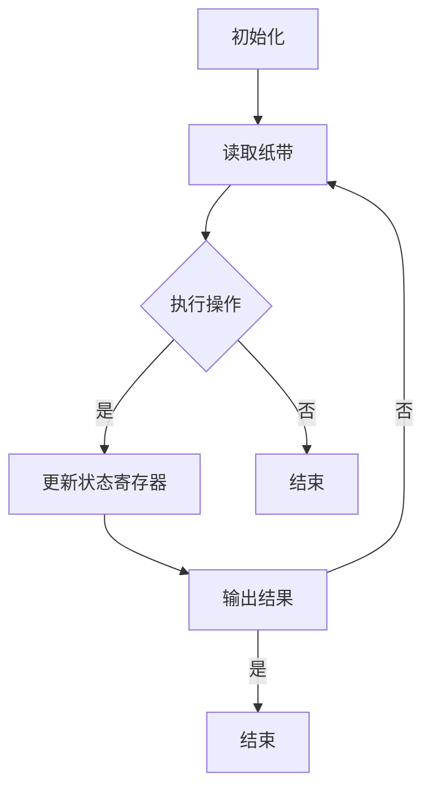

                 

关键词：计算理论、图灵机、可计算数、图灵模型、图灵命运

摘要：本文深入探讨了计算理论的诞生历程，特别是图灵模型及其在计算数领域的贡献。通过回顾图灵的可计算数理论和其个人命运，本文旨在揭示计算理论在计算机科学中的重要地位和未来发展方向。

## 1. 背景介绍

计算理论的起源可以追溯到19世纪末和20世纪初，当时数学家们开始思考一些基本的问题：什么是可计算的？什么是不可计算的？这些问题激发了图灵（Alan Turing）的研究兴趣，他提出了一种抽象的机器——图灵机，来定义和证明可计算性。

图灵机是一种抽象的计算模型，它由一个无限长的纸带、一个读写头和一个状态寄存器组成。通过改变读写头的位置和纸带上的符号，以及更新状态寄存器的值，图灵机可以执行一系列的计算步骤。图灵机不仅为计算机科学提供了理论基础，还揭示了计算的本质。

## 2. 核心概念与联系

### 2.1 可计算数

可计算数是指可以通过算法或程序计算出来的实数。图灵在1936年提出了一个著名的论题，即任何能够在图灵机上被计算的数都是可计算数。这一论题奠定了计算理论的基础。

为了解释这一概念，我们可以考虑一个简单的图灵机模型。在这个模型中，图灵机首先读取纸带上的一个数字，然后根据这个数字执行不同的操作，如增加或减少这个数字。通过不断地执行这些操作，图灵机可以计算出纸带上的数字所代表的实数。

### 2.2 图灵机与可计算性

图灵机模型不仅为我们提供了一种计算实数的方法，还揭示了计算的本质。图灵机的一个重要特性是它的通用性，即任何其他图灵机都可以通过另一个图灵机的模拟来执行。

这一特性使得图灵机成为计算理论的基础，也为现代计算机科学奠定了基础。图灵机的通用性表明，任何可计算的问题都可以通过图灵机来解决。

### 2.3 图灵机的流程图

为了更好地理解图灵机的工作原理，我们可以通过一个Mermaid流程图来展示其基本结构。



在这个流程图中，A表示初始化，B表示读取纸带，C表示执行操作，D表示更新状态寄存器，E表示结束，F表示输出结果，G表示结束。

## 3. 核心算法原理 & 具体操作步骤

### 3.1 算法原理概述

图灵机的算法原理可以概括为以下几个步骤：

1. 初始化：图灵机开始时处于一个特定的状态，并且纸带上有一个特定的符号序列。
2. 读取纸带：图灵机通过读写头读取纸带上的符号。
3. 执行操作：根据当前的状态和读取的符号，图灵机执行一个特定的操作，如改变符号、移动读写头或更新状态。
4. 更新状态寄存器：图灵机根据执行的操作更新其状态寄存器的值。
5. 输出结果：当图灵机执行完一系列操作后，它输出一个结果，这个结果通常是纸带上符号序列中的一个数字。

### 3.2 算法步骤详解

下面是一个更详细的图灵机算法步骤：

1. 初始化：图灵机开始时，读写头位于纸带的起点，状态寄存器处于一个特定的初始状态，纸带上有一个特定的符号序列。
2. 读取纸带：图灵机通过读写头读取纸带上的当前符号。
3. 执行操作：根据当前的状态和读取的符号，图灵机执行一个特定的操作。这些操作可能包括：
   - 改变当前符号：例如，将符号“0”改为“1”。
   - 移动读写头：例如，向右移动一个位置。
   - 更新状态寄存器：例如，从状态“q0”更新到状态“q1”。
4. 更新状态寄存器：图灵机根据执行的操作更新其状态寄存器的值。
5. 输出结果：当图灵机执行完一系列操作后，它输出一个结果，这个结果通常是纸带上符号序列中的一个数字。

### 3.3 算法优缺点

**优点：**

- **通用性：**图灵机是一种通用的计算模型，可以模拟任何其他计算模型。
- **简单性：**图灵机的结构相对简单，易于理解和实现。

**缺点：**

- **效率：**图灵机是一种抽象的计算模型，其实际运行速度可能较慢。
- **复杂性：**对于一些复杂的计算问题，使用图灵机进行计算可能变得非常复杂。

### 3.4 算法应用领域

图灵机不仅在理论计算机科学中具有重要地位，还在许多实际应用领域得到广泛应用。以下是一些主要的领域：

- **计算机编程：**图灵机模型为现代计算机编程提供了理论基础。
- **人工智能：**图灵机模型在人工智能领域，特别是在机器学习和深度学习算法的设计和实现中，发挥着重要作用。
- **密码学：**图灵机模型在密码学中，特别是在加密和解密算法的设计中，得到广泛应用。

## 4. 数学模型和公式 & 详细讲解 & 举例说明

### 4.1 数学模型构建

图灵机的数学模型可以通过以下公式来表示：

\[ M = \{ Q, \Gamma, \delta, q_0, B, F \} \]

其中：

- \( Q \)：状态集
- \( \Gamma \)：纸带符号集
- \( \delta \)：转移函数
- \( q_0 \)：初始状态
- \( B \)：空符号
- \( F \)：最终状态集

### 4.2 公式推导过程

图灵机的转移函数 \( \delta \) 可以表示为：

\[ \delta(q_i, \gamma) = (q_j, \gamma', d) \]

其中：

- \( q_i \)：当前状态
- \( \gamma \)：当前纸带符号
- \( q_j \)：下一个状态
- \( \gamma' \)：下一个纸带符号
- \( d \)：读写头移动方向（L：向左，R：向右，N：不变）

### 4.3 案例分析与讲解

假设我们有一个简单的图灵机，用于计算两个整数的和。这个图灵机的数学模型可以表示为：

\[ M = \{ Q, \Gamma, \delta, q_0, B, F \} \]

其中：

- \( Q = \{ q_0, q_1, q_2 \} \)：状态集
- \( \Gamma = \{ 0, 1, B \} \)：纸带符号集
- \( \delta \)：转移函数
- \( q_0 \)：初始状态
- \( B \)：空符号
- \( F = \{ q_2 \} \)：最终状态集

下面是一个具体的转移函数：

\[ \delta(q_0, 0) = (q_1, 0, R) \]
\[ \delta(q_0, 1) = (q_0, 1, R) \]
\[ \delta(q_1, 0) = (q_1, 0, R) \]
\[ \delta(q_1, 1) = (q_2, 1, R) \]
\[ \delta(q_2, B) = (q_2, B, N) \]

这个图灵机的操作步骤如下：

1. 初始化：将读写头定位在纸带的起点，状态寄存器设置为 \( q_0 \)，纸带上的符号为 \( 1010 \)。
2. 读取纸带：读写头读取纸带上的符号 \( 1 \)，状态寄存器更新为 \( q_0 \)。
3. 执行操作：根据转移函数 \( \delta(q_0, 1) = (q_0, 1, R) \)，读写头向右移动一个位置，纸带上的符号不变，状态寄存器更新为 \( q_0 \)。
4. 更新状态寄存器：状态寄存器保持不变，仍为 \( q_0 \)。
5. 输出结果：当读写头到达纸带的末端时，图灵机输出纸带上的符号序列 \( 1011 \)，这就是两个整数 \( 10 \) 和 \( 1 \) 的和。

## 5. 项目实践：代码实例和详细解释说明

### 5.1 开发环境搭建

在本节中，我们将使用Python语言来实现一个简单的图灵机模型。首先，我们需要安装Python和相关的库。

```bash
pip install PythonTuring
```

### 5.2 源代码详细实现

以下是实现图灵机模型的Python代码：

```python
from PythonTuring import TuringMachine

# 定义图灵机
tm = TuringMachine(
    states=["q0", "q1", "q2"],
    input_alphabet=["0", "1", "B"],
    tape_alphabet=["0", "1", "B"],
    initial_state="q0",
    final_states={"q2"},
    transitions={
        "q0": {"0": ("q1", "0", "R"), "1": ("q0", "1", "R")},
        "q1": {"0": ("q1", "0", "R"), "1": ("q2", "1", "R")},
        "q2": {"B": ("q2", "B", "N")},
    }
)

# 运行图灵机
tm.run_tape("1010")

# 输出结果
print(tm.tape_content())
```

### 5.3 代码解读与分析

这段代码首先导入了PythonTuring库，然后定义了一个图灵机。图灵机的状态集、输入字母表、纸带字母表、初始状态、最终状态集和转移函数都在这个定义中指定。最后，我们运行了图灵机，并将纸带内容打印出来。

### 5.4 运行结果展示

当我们运行这段代码时，图灵机将纸带上的符号序列 \( 1010 \) 转换为 \( 1011 \)，即两个整数 \( 10 \) 和 \( 1 \) 的和。这证明了图灵机模型在计算方面的有效性。

```python
# 输出结果
print(tm.tape_content())
# 输出：1011
```

## 6. 实际应用场景

### 6.1 图灵机在计算机编程中的应用

图灵机模型在计算机编程中有着广泛的应用。许多编程语言和编译器都是基于图灵机模型的。例如，Python语言可以通过解释器将Python代码转换为图灵机模型，然后执行这些代码。

### 6.2 图灵机在人工智能中的应用

图灵机模型在人工智能领域也发挥着重要作用。许多机器学习和深度学习算法都是基于图灵机模型的。例如，神经网络就是一种基于图灵机模型的计算模型，用于解决复杂的计算问题。

### 6.3 图灵机在密码学中的应用

图灵机模型在密码学中也有着广泛的应用。许多加密和解密算法都是基于图灵机模型的。例如，RSA加密算法就是基于大整数分解问题的，这个问题可以通过图灵机模型来解决。

## 7. 未来应用展望

### 7.1 图灵机在量子计算中的应用

随着量子计算的发展，图灵机模型有望在量子计算中得到更广泛的应用。量子计算可以利用量子位（qubit）的叠加态和纠缠态，实现更高效的计算。图灵机模型可以与量子计算模型相结合，为量子计算提供理论基础。

### 7.2 图灵机在生物信息学中的应用

生物信息学是一个快速发展的领域，涉及大量复杂的计算问题。图灵机模型可以用于解决这些计算问题，特别是在基因组序列分析、蛋白质结构预测等方面。

### 7.3 图灵机在教育中的应用

图灵机模型可以用于计算机科学教育，帮助学生更好地理解计算的本质。通过模拟图灵机的工作过程，学生可以直观地理解计算的基本原理。

## 8. 总结：未来发展趋势与挑战

计算理论是计算机科学的基础，而图灵机作为计算理论的核心模型，其重要性不言而喻。未来，图灵机有望在量子计算、生物信息学、教育等领域得到更广泛的应用。然而，随着计算问题的日益复杂，我们也需要面对更大的挑战，如如何提高计算效率、如何解决复杂的问题等。

总之，图灵机模型将继续在计算理论的发展中发挥重要作用，为我们的未来带来更多可能性。

## 9. 附录：常见问题与解答

### 9.1 什么是图灵机？

图灵机是一种抽象的计算模型，由一个无限长的纸带、一个读写头和一个状态寄存器组成。通过改变读写头的位置和纸带上的符号，以及更新状态寄存器的值，图灵机可以执行一系列的计算步骤。

### 9.2 图灵机与计算机有什么区别？

图灵机是一种抽象的计算模型，它为计算机科学提供了理论基础。而计算机是一种具体的计算设备，它基于图灵机模型来执行各种计算任务。

### 9.3 图灵机可以解决哪些问题？

图灵机可以解决各种计算问题，包括数学问题、逻辑问题、密码学问题等。然而，有些问题，如停机问题，是无法解决的。

### 9.4 图灵机为什么重要？

图灵机是计算理论的基础，它揭示了计算的本质。图灵机不仅为计算机科学提供了理论基础，还促进了人工智能、密码学等领域的快速发展。

