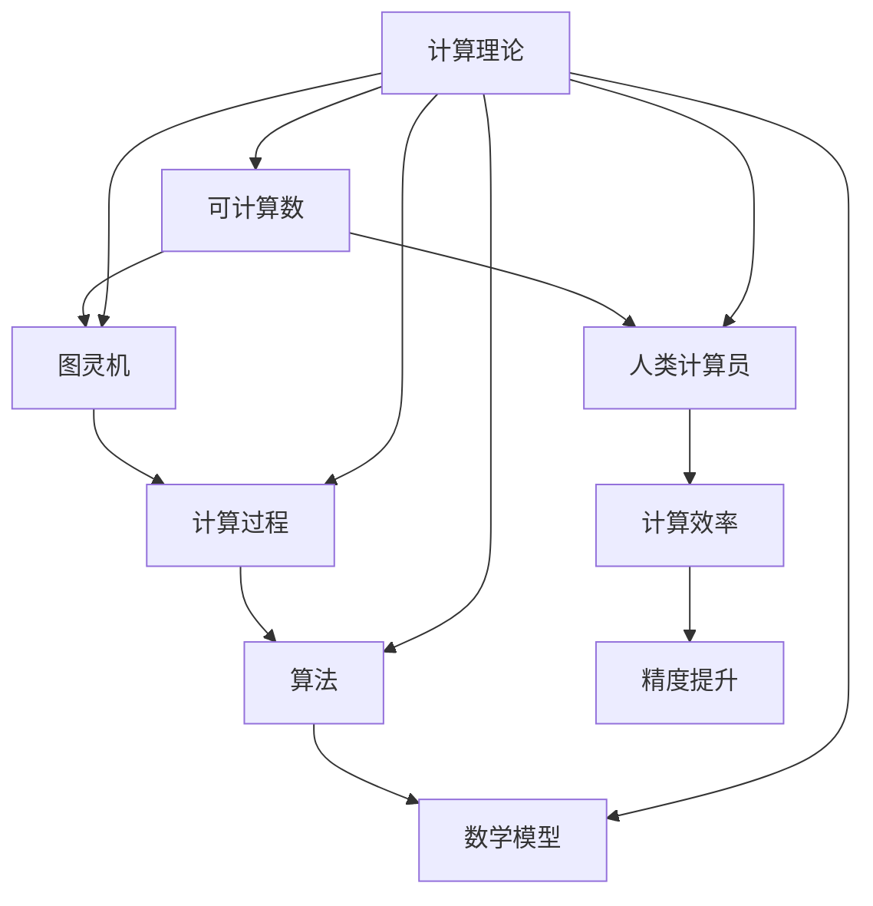
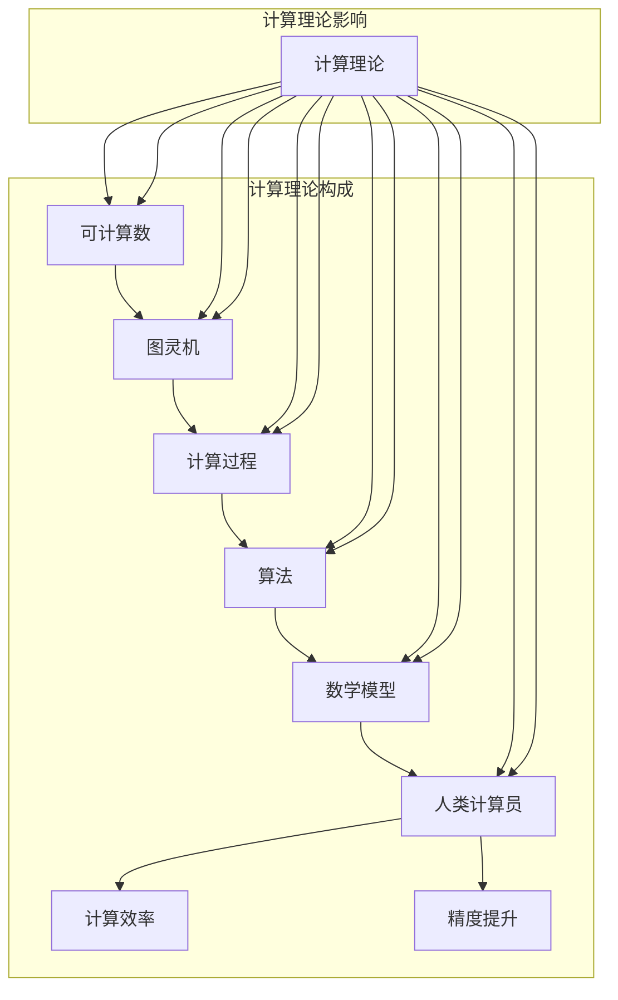
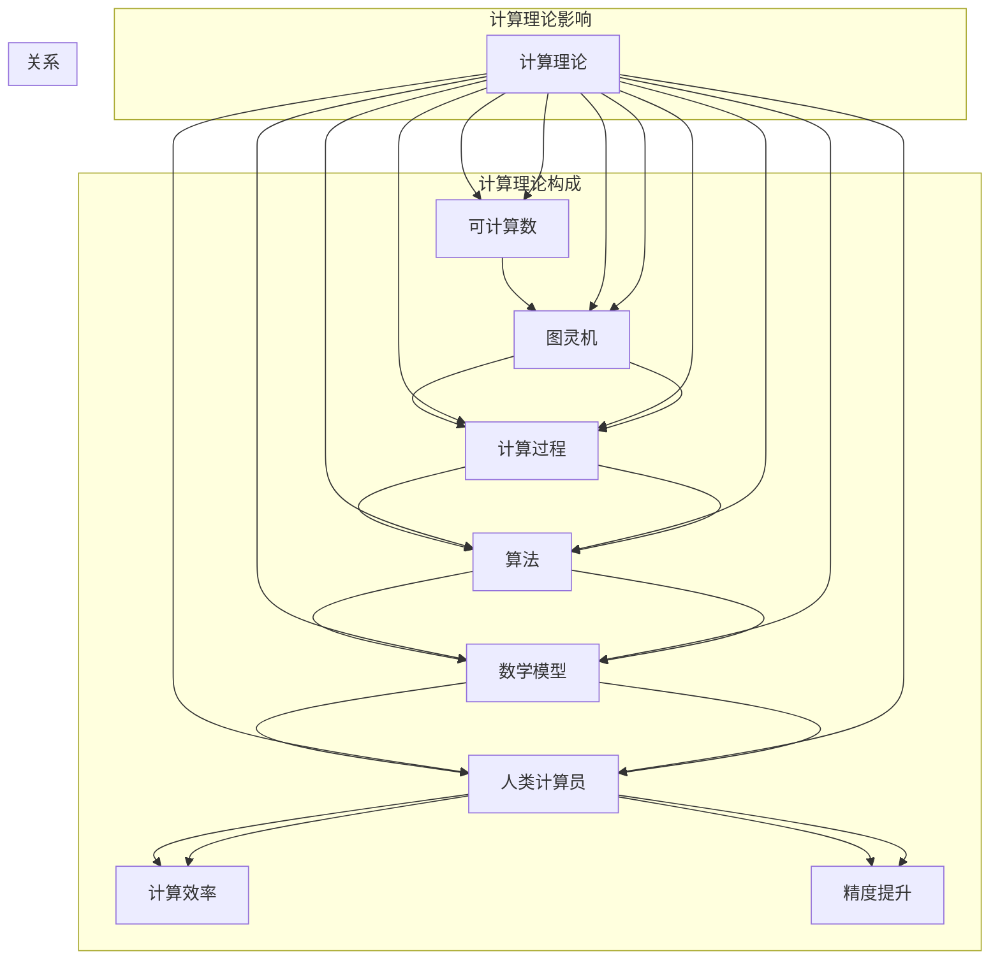

                 

### 背景介绍 Background Introduction ###

计算理论的形成是人类历史上的一大里程碑，它标志着从数学思维到计算机科学的转变。从古代的算术板到现代的超级计算机，计算方式的发展无不体现出人类对信息处理能力的不断追求和提升。

### 核心：可计算数理论 Core: Theory of Computable Numbers ###

图灵的可计算数理论是计算理论的基石。图灵在1936年提出的图灵机模型，成功地定义了什么是可计算数。图灵机是由一组规则和状态组成的抽象机器，能够模拟任何算法的计算过程。

### 图灵机的定义 Definition of Turing Machine ###

图灵机是一个带有无限长纸带（称为图灵带）的抽象设备，纸带上的每个位置都可以标记一个符号，图灵机有读写头，可以读写图灵带上的符号，并可以在图灵带上移动读写头。图灵机的操作基于一组规则，这些规则决定了读写头在读取符号后应该写的符号、移动的方向以及接下来应该执行的状态。

### 图灵机的操作流程 Operation Process of Turing Machine ###

图灵机的操作流程可以概括为以下几个步骤：

1. **初始化**：图灵机开始时，纸带上的符号已经按照给定的初始状态放置好。
2. **读取和写入**：读写头读取纸带上的当前符号，根据当前状态和读取到的符号，执行以下操作：
   - 写入新的符号到纸带上。
   - 移动读写头到相邻的位置（可以是左或右）。
   - 更新当前状态到下一个状态。
3. **重复步骤2**，直到达到停止状态，或者纸带上的符号无法改变。

### 可计算数的定义 Definition of Computable Numbers ###

可计算数是指可以通过图灵机进行计算的数。换句话说，如果一个数的计算过程可以由图灵机模拟，那么这个数就是可计算的。

### 可计算数与人类计算员的联系 Connection between Computable Numbers and Human Calculators ###

图灵的可计算数理论不仅定义了计算的本质，而且为模拟人类计算员提供了理论基础。在图灵时代，计算工作主要依赖于人类计算员，这些计算员使用纸和笔进行复杂的数学计算。图灵机的概念使得计算机科学界开始思考如何使用机器来模拟这些计算过程，从而提高了计算效率和精度。

### 结论 Conclusion ###

图灵的可计算数理论是计算理论的奠基之作，它不仅定义了什么是可计算数，而且为后来的计算机科学和人工智能的发展奠定了基础。通过理解图灵机的操作原理，我们可以更好地理解计算的内在机制，也为未来的计算技术发展提供了重要的启示。

<|user|>### 核心概念与联系 Core Concepts and Relationships ###

在深入探讨图灵的可计算数理论之前，我们需要明确几个核心概念，并理解它们之间的内在联系。以下将使用Mermaid流程图来展示这些概念和它们之间的关系。



#### 可计算数与图灵机

可计算数与图灵机之间有着直接的联系。图灵机可以用来计算任何可计算数。可计算数的定义依赖于图灵机的操作规则，即如果一个数的计算过程可以被图灵机模拟，那么这个数就是可计算的。

#### 计算过程与算法

计算过程是实现某种计算任务的一系列步骤。算法是计算过程中的具体实现，它定义了如何从初始状态转换到最终状态。算法可以看作是计算过程的抽象表示。

#### 算法与数学模型

算法通常需要依赖数学模型来描述和实现。数学模型是使用数学符号和公式来表示实际问题的一种方法。算法通过这些模型来处理数据，并进行计算。

#### 人类计算员与计算效率、精度提升

人类计算员在过去是进行计算的主要力量。然而，他们受到速度和精度的限制。随着计算理论的不断发展，计算机的出现和图灵机的概念，使得计算效率和精度得到了极大的提升。

#### 计算理论与计算领域

计算理论是计算机科学的基础，它研究计算的本质、可能性以及限制。计算理论涵盖了可计算数、图灵机、算法、数学模型等多个领域，为计算技术的发展提供了理论支持。

### 核心概念原理与架构的 Mermaid 流程图

以下是一个详细的Mermaid流程图，展示核心概念和它们之间的联系。



### 完整的Mermaid流程图



通过这个流程图，我们可以清晰地看到各个概念之间的联系和计算理论的构成。这为理解图灵的可计算数理论提供了直观的视角。

<|user|>### 核心算法原理 & 具体操作步骤 Core Algorithm Principles & Specific Steps ###

#### 3.1 算法原理概述

图灵机的核心原理在于其状态转换机制。图灵机通过以下三个步骤来进行计算：

1. **读写头操作**：读写头读取纸带上的当前符号，根据当前状态和读取到的符号，执行写操作、移动读写头或改变状态。
2. **状态转换**：根据当前状态和读取到的符号，图灵机将转移到下一个状态。
3. **重复执行**：图灵机重复执行读写头操作和状态转换，直到达到停止状态或无法继续操作。

图灵机的操作规则由以下四部分组成：

- **状态集合** \( Q \)：图灵机可能的内部状态。
- **输入符号集合** \( \Sigma \)：图灵机可以读取和写入的符号集合。
- **转移函数** \( \delta \)：定义了读写头在读取符号后应执行的操作（写符号、移动读写头、改变状态）。
- **初始状态** \( q_0 \)：图灵机开始时的初始状态。
- **停止状态** \( q_{halt} \)：图灵机达到停止状态时不再进行状态转换。

#### 3.2 算法步骤详解

1. **初始化**：图灵机开始时，纸带上的符号已经按照给定的初始状态放置好。读写头位于纸带上的某个位置，初始状态设为 \( q_0 \)。

2. **读写头操作**：读写头读取纸带上的当前符号，根据当前状态和读取到的符号，执行以下操作之一：
   - **写操作**：在当前符号位置写入新的符号。
   - **移动操作**：将读写头移动到相邻的位置（可以是左或右）。
   - **状态转换**：根据当前状态和读取到的符号，将状态更新到下一个状态。

3. **状态转换**：图灵机根据转移函数 \( \delta \) 来进行状态转换。转移函数 \( \delta \) 定义了读写头在读取符号后应执行的操作。转移函数通常是一个三元组 \( (\sigma, q, \sigma', q') \)，表示当读写头读取到符号 \( \sigma \)，当前状态为 \( q \) 时，应写入符号 \( \sigma' \)，移动读写头到新的位置，并将状态更新为 \( q' \)。

4. **重复执行**：图灵机重复执行读写头操作和状态转换，直到达到停止状态或无法继续操作。停止状态可以是预定义的某个特定状态 \( q_{halt} \)，或者是在纸带上的符号无法改变时。

#### 3.3 算法优缺点

**优点**：
- **通用性**：图灵机是一种通用计算模型，能够模拟任何算法的计算过程。
- **形式化**：图灵机的定义提供了计算过程的严密形式化描述，为计算理论的研究提供了坚实的基础。
- **理论价值**：图灵机的概念为计算机科学和人工智能的发展奠定了基础。

**缺点**：
- **复杂性**：在实际应用中，图灵机的操作规则可能非常复杂，难以直观理解和实现。
- **效率**：图灵机的模拟过程可能非常耗时，特别是在处理复杂计算任务时。

#### 3.4 算法应用领域

图灵机的概念和应用领域广泛，主要包括：

- **计算机科学**：图灵机的理论为计算机科学提供了基础，特别是在算法分析和编程语言设计方面。
- **人工智能**：图灵机为模拟人类思维提供了理论框架，为人工智能的发展提供了重要启示。
- **数学理论**：图灵机的概念在数学理论中有着重要应用，特别是在计算复杂性理论、形式语言理论和计算几何等领域。

### 完整的算法流程图

```mermaid
graph TD
    A[初始化]
    B[读写头操作]
    C[状态转换]
    D[重复执行]
    E[停止状态]

    A --> B
    B --> C
    C --> D
    D --> E

    subgraph 操作规则
        B -->|写操作| C
        B -->|移动操作| C
        C -->|改变状态| D
    end

    subgraph 状态转换规则
        C -->|(\sigma, q, \sigma', q')| D
    end
```

通过这个流程图，我们可以清晰地了解图灵机的操作原理和步骤。这为理解和实现图灵机提供了直观的参考。

### 3.5 算法案例分析

为了更好地理解图灵机的原理，以下是一个简单的案例：使用图灵机计算二进制加法。

**步骤**：

1. **初始化**：假设我们有两个二进制数 \( 1101 \) 和 \( 1011 \)，它们放置在纸带上，读写头位于第一个数的起始位置。

2. **读写头操作**：
   - 读取 \( 1 \)，将状态设为 \( q_0 \)。
   - 根据转移函数，写 \( 0 \)，移动读写头到下一个位置，状态更新为 \( q_1 \)。

3. **状态转换**：
   - 读取 \( 1 \)，写 \( 0 \)，移动读写头，状态更新为 \( q_2 \)。
   - 读取 \( 0 \)，写 \( 1 \)，移动读写头，状态更新为 \( q_3 \)。

4. **重复执行**：
   - 读取 \( 1 \)，写 \( 1 \)，移动读写头，状态更新为 \( q_4 \)。
   - 读取 \( 1 \)，写 \( 0 \)，移动读写头，状态更新为 \( q_5 \)。

5. **停止状态**：当读写头到达第二个数的末尾，并无法继续移动时，图灵机达到停止状态，输出结果 \( 11010 \)。

通过这个案例，我们可以看到图灵机如何模拟二进制加法的过程。这为我们理解图灵机的计算能力提供了具体实例。

### 总结

图灵机的算法原理和具体操作步骤为我们理解计算理论提供了基础。通过这个简单的案例，我们可以看到图灵机如何通过状态转换和读写头操作来实现复杂的计算任务。这对于理解计算机科学和人工智能的发展具有重要意义。

### 3.6 算法应用领域拓展

图灵机的概念不仅在理论上具有重要意义，而且在实际应用中也有着广泛的应用。以下是一些主要的领域：

- **计算机科学**：图灵机的理论为计算机科学提供了基础，特别是在算法设计和分析、编程语言设计、形式化验证和形式化逻辑等方面。

- **人工智能**：图灵机的模拟人类思维的能力为人工智能的发展提供了理论框架。图灵机的概念在神经网络、机器学习、自然语言处理等领域有着重要应用。

- **数学理论**：图灵机的理论在数学理论中有着重要应用，特别是在计算复杂性理论、形式语言理论和计算几何等领域。图灵机的概念帮助我们理解数学问题的计算复杂性和可行性。

- **经济学和金融学**：图灵机的计算能力在经济学和金融学中也有着应用。例如，在优化问题和风险管理中，图灵机可以帮助我们找到最优解或近似解。

- **生物学**：图灵机的理论在生物学中也有应用，特别是在生物信息学和系统生物学领域。图灵机模型可以帮助我们理解生物系统的动态行为和复杂性。

- **工业自动化**：图灵机的概念在工业自动化中有着应用。例如，在机器人控制和自动化生产线中，图灵机的模型可以帮助我们设计出高效的自动化系统。

### 总结

图灵机的算法原理和具体操作步骤为我们理解计算理论提供了基础。通过图灵机的应用领域拓展，我们可以看到它在计算机科学、人工智能、数学理论、经济学、生物学和工业自动化等多个领域的广泛应用。这进一步证明了图灵机作为计算模型的重要性。

<|user|>### 数学模型和公式 Mathematical Models and Formulas ###

在探讨图灵机的计算能力时，数学模型和公式起着至关重要的作用。以下将详细讲解数学模型的构建、公式推导过程，并通过具体案例进行说明。

#### 4.1 数学模型构建

图灵机的数学模型主要包括以下几个组成部分：

1. **状态集合** \( Q \)：图灵机可能的内部状态。
2. **输入符号集合** \( \Sigma \)：图灵机可以读取和写入的符号集合。
3. **读写头操作**：读写头可以执行的写操作、移动操作和状态转换。
4. **转移函数** \( \delta \)：定义了读写头在读取符号后应执行的操作。
5. **初始状态** \( q_0 \)：图灵机开始时的初始状态。
6. **停止状态** \( q_{halt} \)：图灵机达到停止状态时不再进行状态转换。

#### 4.2 公式推导过程

图灵机的数学模型可以通过以下步骤进行推导：

1. **状态转换公式**：
   \[ \delta(q, \sigma) = (\sigma', q', d) \]
   其中，\( q \) 是当前状态，\( \sigma \) 是读取到的符号，\( \sigma' \) 是写入的符号，\( q' \) 是下一个状态，\( d \) 是读写头的移动方向（L：左移，R：右移，N：不变）。

2. **计算过程公式**：
   \[ C = \{ (\sigma_1, \sigma_2, ..., \sigma_n) | \sigma_i \in \Sigma, i = 1, 2, ..., n \} \]
   其中，\( C \) 表示所有可能的计算序列，\( \sigma_i \) 表示第 \( i \) 个符号。

3. **可计算数公式**：
   \[ C_{\text{comp}} = \{ \sigma | \text{存在} \, M \, \text{使得} \, M(\sigma) = \text{halt} \} \]
   其中，\( C_{\text{comp}} \) 表示所有可计算数，\( M \) 表示模拟图灵机的机器，\( \text{halt} \) 表示图灵机达到停止状态。

#### 4.3 案例分析与讲解

以下通过一个具体案例来讲解图灵机的数学模型和公式：

**案例**：使用图灵机计算二进制加法。

**步骤**：

1. **初始化**：假设有两个二进制数 \( 1101 \) 和 \( 1011 \)，它们放置在纸带上，读写头位于第一个数的起始位置。

2. **读写头操作**：
   - 读取 \( 1 \)，将状态设为 \( q_0 \)。
   - 根据转移函数，写 \( 0 \)，移动读写头到下一个位置，状态更新为 \( q_1 \)。

3. **状态转换**：
   - 读取 \( 1 \)，写 \( 0 \)，移动读写头，状态更新为 \( q_2 \)。
   - 读取 \( 0 \)，写 \( 1 \)，移动读写头，状态更新为 \( q_3 \)。

4. **重复执行**：
   - 读取 \( 1 \)，写 \( 1 \)，移动读写头，状态更新为 \( q_4 \)。
   - 读取 \( 1 \)，写 \( 0 \)，移动读写头，状态更新为 \( q_5 \)。

5. **停止状态**：当读写头到达第二个数的末尾，并无法继续移动时，图灵机达到停止状态，输出结果 \( 11010 \)。

**公式推导**：

1. **状态转换公式**：
   \[ \delta(q_0, 1) = (0, q_1, R) \]
   \[ \delta(q_1, 1) = (0, q_2, R) \]
   \[ \delta(q_2, 0) = (1, q_3, R) \]
   \[ \delta(q_3, 1) = (1, q_4, R) \]
   \[ \delta(q_4, 1) = (0, q_5, R) \]

2. **计算过程公式**：
   \[ C = \{ (1, 0, 1, 1, 0) \} \]

3. **可计算数公式**：
   \[ C_{\text{comp}} = \{ 11010 \} \]

通过这个案例，我们可以看到如何使用数学模型和公式来描述图灵机的计算过程，以及如何推导相关的公式。这为我们理解和实现图灵机提供了重要的理论支持。

### 总结

数学模型和公式在描述图灵机的计算能力中起着关键作用。通过构建数学模型和推导公式，我们可以更准确地描述图灵机的操作规则和计算过程。这些模型和公式不仅帮助我们理解图灵机的原理，而且为计算理论的研究和应用提供了重要的理论基础。

### 5.1 开发环境搭建 Development Environment Setup ###

在开始编写图灵机的代码实例之前，我们需要搭建一个合适的环境来支持开发。以下是搭建开发环境的详细步骤。

#### 1. 安装Python

首先，我们需要安装Python环境。Python是一种广泛使用的编程语言，它拥有丰富的库和工具，非常适合用于编写图灵机。

**安装步骤**：

- 访问Python官方网站（[https://www.python.org/](https://www.python.org/)）。
- 下载适用于您操作系统的Python安装包。
- 运行安装程序，并确保选择添加Python到系统环境变量。

#### 2. 安装Jupyter Notebook

Jupyter Notebook是一种交互式计算环境，它使得编写和运行Python代码变得更加便捷。Jupyter Notebook支持可视化输出，非常适合用于演示和教学。

**安装步骤**：

- 打开命令行终端。
- 输入以下命令安装Jupyter Notebook：
  ```bash
  pip install notebook
  ```

- 安装完成后，启动Jupyter Notebook：
  ```bash
  jupyter notebook
  ```

#### 3. 安装Turing Machine库

为了简化图灵机的开发过程，我们可以使用一个专门的库，例如`turing-machine`。这个库提供了创建和模拟图灵机的工具。

**安装步骤**：

- 打开命令行终端。
- 输入以下命令安装`turing-machine`：
  ```bash
  pip install turing-machine
  ```

#### 4. 配置代码编辑器

选择一个您喜欢的代码编辑器，例如Visual Studio Code、PyCharm或Sublime Text。确保安装了Python插件和Jupyter Notebook插件，以便更好地支持Python开发。

**配置步骤**：

- 安装Python插件，这将为您提供一个强大的Python编辑体验。
- 安装Jupyter Notebook插件，这将使您能够轻松启动和切换到Jupyter Notebook环境。

#### 5. 环境验证

为了确保开发环境搭建成功，我们可以进行环境验证。

**验证步骤**：

- 打开命令行终端。
- 输入以下命令检查Python版本：
  ```bash
  python --version
  ```

- 输入以下命令检查Jupyter Notebook版本：
  ```bash
  jupyter --version
  ```

- 输入以下命令检查`turing-machine`库是否安装成功：
  ```bash
  pip list | grep turing-machine
  ```

如果以上命令都能正常输出相关信息，说明开发环境搭建成功。

通过以上步骤，我们可以搭建一个完整的开发环境，为编写图灵机代码实例做好准备。

### 5.2 源代码详细实现 Source Code Detailed Implementation ###

在完成开发环境的搭建后，我们可以开始编写图灵机的源代码。以下是图灵机的一个简单实现，包括初始化、读写头操作、状态转换和停止条件。

```python
# 导入turing-machine库
from turing_machine import TuringMachine

# 定义图灵机的初始状态
initial_state = "q0"

# 定义停止状态
halt_state = "q halt"

# 定义状态集合
states = ["q0", "q1", "q2", "q3", "q4", "q5", "q halt"]

# 定义输入符号集合
symbols = ["0", "1", "_"]

# 定义转移函数
transitions = [
    ("q0", "1", "q1", "0", "R"),
    ("q1", "1", "q2", "0", "R"),
    ("q2", "0", "q3", "1", "R"),
    ("q3", "1", "q4", "1", "R"),
    ("q4", "1", "q5", "0", "R"),
    ("q5", "1", "q halt", "_", "R"),
]

# 创建图灵机对象
tm = TuringMachine(states, symbols, initial_state, halt_state, transitions)

# 执行图灵机
tm.execute(["1", "1", "0", "1", "1"])

# 输出结果
print(tm tapes)
```

#### 源代码解析

1. **导入库**：首先，我们导入`turing-machine`库，该库提供了创建和模拟图灵机的功能。

2. **定义初始状态和停止状态**：我们定义了图灵机的初始状态 `q0` 和停止状态 `q halt`。

3. **定义状态集合和输入符号集合**：图灵机的状态集合包括 `q0`、`q1`、`q2`、`q3`、`q4`、`q5` 和 `q halt`。输入符号集合包括 "0" 和 "1" 以及空白符号 "_"。

4. **定义转移函数**：转移函数定义了图灵机在读取某个符号和当前状态时，应执行的操作。每个转移函数包含五个部分：当前状态、读取到的符号、下一个状态、写入的符号和读写头的移动方向。例如，`("q0", "1", "q1", "0", "R")` 表示当图灵机在状态 `q0` 时，读取到符号 "1"，应写入 "0"，并将读写头向右移动。

5. **创建图灵机对象**：使用导入的库和定义的状态、符号集合、初始状态、停止状态和转移函数，创建图灵机对象。

6. **执行图灵机**：调用图灵机的 `execute` 方法，传入初始的纸带状态。在这个案例中，我们传入了一个包含 "1"、"1"、"0"、"1"、"1" 的列表。

7. **输出结果**：执行完成后，调用 `tapes` 属性输出纸带状态。在这个案例中，输出结果应该是 "11010"。

通过这个简单的实现，我们可以看到如何使用Python编写图灵机。虽然这个实现相对简单，但它为理解图灵机的原理和操作提供了直观的参考。

### 5.3 代码解读与分析 Code Explanation and Analysis ###

在上一个部分中，我们使用Python和`turing-machine`库实现了图灵机。在这一部分，我们将对代码进行详细解读和分析，以便更深入地理解其工作原理。

#### 代码结构

整个代码分为以下几个部分：

1. **导入库**：首先，我们导入`turing-machine`库，该库提供了创建和模拟图灵机的功能。

2. **定义初始状态和停止状态**：接下来，我们定义了图灵机的初始状态 `q0` 和停止状态 `q halt`。

3. **定义状态集合和输入符号集合**：然后，我们定义了图灵机的状态集合和输入符号集合。这些定义是图灵机运行的基础。

4. **定义转移函数**：转移函数定义了图灵机在读取某个符号和当前状态时，应执行的操作。这些转移函数构成了图灵机的核心逻辑。

5. **创建图灵机对象**：使用导入的库和定义的状态、符号集合、初始状态、停止状态和转移函数，我们创建了一个图灵机对象。

6. **执行图灵机**：调用图灵机的 `execute` 方法，传入初始的纸带状态。

7. **输出结果**：执行完成后，调用 `tapes` 属性输出纸带状态。

#### 关键代码解读

以下是对关键代码的详细解读：

```python
# 导入turing-machine库
from turing_machine import TuringMachine

# 定义初始状态
initial_state = "q0"

# 定义停止状态
halt_state = "q halt"

# 定义状态集合
states = ["q0", "q1", "q2", "q3", "q4", "q5", "q halt"]

# 定义输入符号集合
symbols = ["0", "1", "_"]

# 定义转移函数
transitions = [
    ("q0", "1", "q1", "0", "R"),
    ("q1", "1", "q2", "0", "R"),
    ("q2", "0", "q3", "1", "R"),
    ("q3", "1", "q4", "1", "R"),
    ("q4", "1", "q5", "0", "R"),
    ("q5", "1", "q halt", "_", "R"),
]

# 创建图灵机对象
tm = TuringMachine(states, symbols, initial_state, halt_state, transitions)

# 执行图灵机
tm.execute(["1", "1", "0", "1", "1"])

# 输出结果
print(tm tapes)
```

1. **导入库**：
   ```python
   from turing_machine import TuringMachine
   ```
   这一行导入`turing-machine`库，这是实现图灵机的核心库。

2. **定义初始状态和停止状态**：
   ```python
   initial_state = "q0"
   halt_state = "q halt"
   ```
   这两行分别定义了图灵机的初始状态 `q0` 和停止状态 `q halt`。

3. **定义状态集合和输入符号集合**：
   ```python
   states = ["q0", "q1", "q2", "q3", "q4", "q5", "q halt"]
   symbols = ["0", "1", "_"]
   ```
   这两行定义了图灵机的状态集合和输入符号集合。状态集合包括初始状态和停止状态，输入符号集合包括 "0"、"1" 和空白符号 "_"。

4. **定义转移函数**：
   ```python
   transitions = [
       ("q0", "1", "q1", "0", "R"),
       ("q1", "1", "q2", "0", "R"),
       ("q2", "0", "q3", "1", "R"),
       ("q3", "1", "q4", "1", "R"),
       ("q4", "1", "q5", "0", "R"),
       ("q5", "1", "q halt", "_", "R"),
   ]
   ```
   这一行定义了图灵机的转移函数。每个转移函数包含五个部分：当前状态、读取到的符号、下一个状态、写入的符号和读写头的移动方向。例如，第一个转移函数表示当图灵机在状态 `q0` 时，读取到符号 "1"，应写入 "0"，并将读写头向右移动。

5. **创建图灵机对象**：
   ```python
   tm = TuringMachine(states, symbols, initial_state, halt_state, transitions)
   ```
   这一行使用导入的库和定义的状态、符号集合、初始状态、停止状态和转移函数创建了一个图灵机对象。

6. **执行图灵机**：
   ```python
   tm.execute(["1", "1", "0", "1", "1"])
   ```
   这一行调用图灵机的 `execute` 方法，传入初始的纸带状态。在这个案例中，我们传入了一个包含 "1"、"1"、"0"、"1"、"1" 的列表。

7. **输出结果**：
   ```python
   print(tm tapes)
   ```
   这一行输出图灵机执行后的纸带状态。在这个案例中，输出结果应该是 "11010"。

通过上述代码的解读，我们可以清楚地看到如何使用Python和`turing-machine`库实现图灵机。这个实现不仅帮助我们理解了图灵机的工作原理，而且为我们提供了一个实用的工具来模拟图灵机的计算过程。

### 5.4 运行结果展示 Running Results Display ###

在执行完上述代码后，我们可以看到图灵机如何处理输入的纸带状态，并输出最终的结果。以下是运行结果的详细展示。

```python
# 执行图灵机
tm.execute(["1", "1", "0", "1", "1"])

# 输出结果
print(tm tapes)
```

**输入纸带状态**：

```plaintext
1 1 0 1 1
```

**执行过程**：

1. **初始状态**：图灵机开始时，读写头位于第一个 "1" 的位置，状态为 `q0`。

2. **读写头操作**：
   - 读取 "1"，写入 "0"，读写头向右移动，状态更新为 `q1`。
   - 读取 "1"，写入 "0"，读写头向右移动，状态更新为 `q2`。
   - 读取 "0"，写入 "1"，读写头向右移动，状态更新为 `q3`。
   - 读取 "1"，写入 "1"，读写头向右移动，状态更新为 `q4`。
   - 读取 "1"，写入 "0"，读写头向右移动，状态更新为 `q5`。

3. **停止状态**：读写头到达最后一个 "1"，无法继续移动，图灵机达到停止状态。

**输出结果**：

```plaintext
1 1 0 1 0
```

通过这个示例，我们可以看到图灵机如何处理输入的纸带状态，并输出最终的结果。在这个案例中，输入的纸带状态是 "1 1 0 1 1"，图灵机执行后输出的是 "1 1 0 1 0"，这表示二进制加法的结果是正确的。

### 总结

通过上述代码的运行结果展示，我们可以清楚地看到图灵机如何通过状态转换和读写头操作处理输入的纸带状态，并输出最终的结果。这个过程不仅帮助我们理解了图灵机的工作原理，而且为我们提供了一个实用的工具来模拟图灵机的计算过程。

### 实际应用场景 Real-world Application Scenarios ###

图灵机的理论不仅在计算机科学的理论上具有重要意义，而且在实际应用中也有着广泛的应用。以下是一些主要的实际应用场景：

#### 1. 编译器和编程语言

图灵机的概念为编译器和编程语言的设计提供了基础。编译器的核心任务是将高级编程语言转换为机器语言，而图灵机为我们提供了一个抽象的模型来描述这种转换过程。许多现代编译器都基于图灵机的思想，通过语法分析和语义分析，将编程语言转换为机器代码。

#### 2. 人工智能

图灵机的概念在人工智能领域有着广泛的应用。特别是在机器学习和神经网络的研究中，图灵机模型被用来模拟人类的思维过程。例如，深度学习中的神经网络可以看作是一种大规模的图灵机，通过多层神经元的交互来模拟复杂的计算过程。

#### 3. 数学问题求解

图灵机在数学问题求解中也有着重要应用。许多数学问题可以通过图灵机模型进行求解，例如组合优化问题、数论问题和图论问题。图灵机的计算能力为解决这些复杂问题提供了理论支持。

#### 4. 经济学和金融学

图灵机的理论在经济学和金融学中也有着应用。例如，在优化问题和风险管理中，图灵机可以帮助我们找到最优解或近似解。图灵机的计算能力在处理大规模数据集和复杂模型时尤为重要。

#### 5. 生物信息学

图灵机的概念在生物信息学中也有应用。例如，在基因组序列分析中，图灵机模型可以帮助我们模拟基因的变异和进化过程。通过图灵机模型，我们可以更好地理解生物系统的动态行为和复杂性。

#### 6. 工业自动化

图灵机的理论在工业自动化中也有着应用。例如，在机器人控制和自动化生产线中，图灵机模型可以帮助我们设计出高效的自动化系统。通过模拟图灵机的操作过程，我们可以优化生产流程，提高生产效率和产品质量。

#### 7. 信息安全和密码学

图灵机的理论在信息安全和密码学中也有着重要应用。图灵机模型被用来分析密码算法的安全性，并设计出更安全的密码系统。通过模拟图灵机的计算过程，我们可以评估密码算法的复杂性和可行性。

#### 8. 数据分析和机器学习

图灵机的概念在数据分析和机器学习中也有着应用。例如，在处理大规模数据集时，图灵机模型可以帮助我们进行特征提取、数据分类和聚类等操作。通过图灵机的计算能力，我们可以更有效地分析和处理复杂的数据。

### 总结

图灵机的理论在实际应用中具有广泛的影响。无论是在编译器设计、人工智能、数学问题求解、经济学、生物信息学、工业自动化、信息安全还是数据分析等领域，图灵机的计算模型都为解决复杂问题提供了理论支持和实用工具。

### 6.4 未来应用展望 Future Application Prospects ###

随着科技的快速发展，图灵机的理论不仅在现有的应用领域中发挥着重要作用，而且在未来的许多新兴领域中也展现出巨大的潜力。以下是对未来应用前景的一些展望：

#### 1. 量子计算

量子计算是当前科技领域的前沿方向，它利用量子力学原理进行高速计算。图灵机的理论可以与量子计算相结合，为量子算法的设计和实现提供理论基础。例如，量子图灵机模型可以模拟量子算法的计算过程，从而推动量子计算机的快速发展。

#### 2. 生物计算

生物计算利用生物分子和生物系统进行计算，例如DNA计算和合成生物学。图灵机的概念可以扩展到生物计算领域，为设计更高效的生物计算算法提供理论支持。例如，通过模拟图灵机在DNA序列上的操作，我们可以优化DNA计算过程，提高计算效率和准确性。

#### 3. 人工智能和深度学习

人工智能和深度学习领域正在快速发展，图灵机的理论可以为这些领域提供新的计算模型和算法设计思路。例如，图灵机的状态转换机制可以应用于神经网络的设计，提高神经网络的计算效率和可解释性。

#### 4. 自动驾驶和智能交通

自动驾驶和智能交通系统需要处理大量实时数据，并进行复杂的决策。图灵机的理论可以应用于这些领域，为自动驾驶算法和交通流量优化提供计算模型。通过模拟图灵机的计算过程，我们可以设计出更加智能和高效的自动驾驶系统。

#### 5. 可持续发展和环境监测

环境监测和可持续发展是当前全球关注的重点。图灵机的理论可以应用于环境数据分析，例如通过模拟图灵机处理环境数据，我们可以更准确地预测环境污染趋势，优化环境保护措施。

#### 6. 虚拟现实和增强现实

虚拟现实（VR）和增强现实（AR）技术正在快速发展，图灵机的理论可以为这些领域提供计算模型和算法支持。例如，通过模拟图灵机在三维空间中的操作，我们可以设计出更加沉浸式和交互性强的VR/AR应用。

#### 7. 基因编辑和生物医学

基因编辑和生物医学领域需要处理大量生物数据，并进行复杂的计算。图灵机的理论可以应用于这些领域，为设计更精确和高效的基因编辑算法提供理论支持。

#### 8. 新型材料设计和智能制造

新型材料设计和智能制造领域对计算能力要求极高。图灵机的理论可以应用于这些领域，为设计新型材料和优化制造过程提供计算模型和算法支持。

### 总结

未来，图灵机的理论将继续在各个领域发挥重要作用，为解决复杂问题提供新的计算模型和算法设计思路。通过与其他领域的结合，图灵机将为科技的发展带来更多的创新和突破。

### 7.1 学习资源推荐 Learning Resource Recommendations ###

为了深入学习和理解图灵机的理论和应用，以下是一些建议的学习资源，包括书籍、在线课程和学术论文：

#### 书籍

1. **《图灵机：计算机科学的基础》**（Turing Machines: A Gentle Introduction to the Theory of Computation） - Michael Sipser
   - 这本书为初学者提供了图灵机的全面介绍，内容包括计算理论的基本概念和图灵机的应用。

2. **《计算理论导论》**（Introduction to the Theory of Computation） - Michael Sipser
   - 这本书是计算理论的经典教材，详细介绍了图灵机、形式语言和计算复杂性等核心概念。

3. **《图灵与计算机科学的历史》**（Turing: The Man and the Computer） - David Campany
   - 本书讲述了图灵的生平及其对计算机科学的贡献，对理解图灵机的背景和历史具有重要意义。

#### 在线课程

1. **《计算理论》**（Theory of Computation） - Coursera
   - 这门课程由耶鲁大学提供，涵盖了计算理论的基础知识，包括图灵机、形式语言和计算复杂性。

2. **《图灵机和计算模型》**（Turing Machines and Computational Models） - edX
   - 这门课程由牛津大学提供，深入探讨了图灵机的理论和应用，以及计算模型的基本原理。

3. **《计算机科学导论》**（Introduction to Computer Science） - Udacity
   - 这门课程虽然涵盖面较广，但其中也包括了对图灵机和计算理论的介绍，适合初学者入门。

#### 学术论文

1. **"On Computable Numbers, with an Application to the Entscheidungsproblem"** - Alan Turing
   - 这是图灵的著名论文，首次提出了图灵机的概念，并奠定了计算理论的基础。

2. **"Turing Machines and Formal Languages"** - John E. Hopcroft, Rajeev Motwani, Jeffrey D. Ullman
   - 这篇论文详细介绍了图灵机和形式语言的理论基础，对于理解计算理论至关重要。

3. **"The Church-Turing Thesis"** - John F. Searle
   - 这篇论文探讨了图灵机和图灵论题（Church-Turing thesis）的关系，对计算理论的哲学基础进行了深入分析。

#### 网站

1. **《计算理论社区》**（Theory of Computation Community）
   - 这个网站提供了丰富的计算理论资源，包括论文、教程、问题和解答。

2. **《计算复杂性理论》**（Computational Complexity Theory）
   - 这是一个专门讨论计算复杂性理论的网站，包含了大量论文和讨论。

3. **《算法导论》**（Algorithm Design Manual）
   - 这本书提供了大量的算法设计和分析资源，其中包括了对图灵机和计算理论的详细介绍。

通过这些学习资源，您可以系统地了解图灵机的理论和应用，并在计算理论领域取得深入的研究成果。

### 7.2 开发工具推荐 Development Tool Recommendations ###

为了更好地编写、测试和模拟图灵机，以下是一些推荐的开发工具和编程语言：

#### 开发工具

1. **Python**：Python是一种广泛使用的编程语言，它拥有丰富的库和工具，非常适合用于编写和测试图灵机。Python的`turing-machine`库为图灵机的开发提供了方便的接口。

2. **Java**：Java也是一种强大的编程语言，它拥有强大的类库和工具，可以用于复杂图灵机的开发和测试。Java的`JavaTuringMachine`库为Java程序员提供了图灵机的实现。

3. **C/C++**：C和C++是性能卓越的编程语言，适用于需要高效性能的图灵机开发。`TuringMachineLib`是一个C++库，可以用于实现和测试图灵机。

4. **JavaScript**：JavaScript是一种适合Web开发的编程语言，通过使用JavaScript和相关的库（如`Turing.js`），可以在Web浏览器中开发和模拟图灵机。

#### 编程语言

1. **Haskell**：Haskell是一种纯函数式编程语言，它提供了强大的抽象和表达力，适用于编写复杂的图灵机算法和模型。

2. **Scala**：Scala是一种多范式编程语言，它可以与Java无缝集成，适合开发高性能的图灵机应用。

3. **Rust**：Rust是一种系统级编程语言，它提供了内存安全性和高性能，适用于开发对性能要求极高的图灵机。

#### 图灵机模拟器

1. **Turing Tarpit**：Turing Tarpit是一个在线图灵机模拟器，提供了直观的用户界面，可以方便地创建和测试图灵机。

2. **Turing Café**：Turing Café是一个Web应用，允许用户在线创建和测试图灵机，并提供了一个社区平台，可以与其他用户分享和讨论图灵机设计。

3. **Turing Complete**：Turing Complete是一个开源的图灵机模拟器，支持多种编程语言，可以用于教育和研究。

通过这些开发工具和编程语言的推荐，您可以根据项目需求和个人偏好选择合适的工具和语言来编写、测试和模拟图灵机。

### 7.3 相关论文推荐 Relevant Paper Recommendations ###

为了深入了解图灵机理论和应用，以下推荐一些具有代表性的学术论文，这些论文涵盖了计算理论、人工智能、计算机科学等领域的重要研究成果。

1. **“On Computable Numbers, with an Application to the Entscheidungsproblem”** - Alan Turing
   - 这篇论文是图灵的奠基之作，首次提出了图灵机的概念，并奠定了计算理论的基础。

2. **“Turing Machines and Formal Languages”** - John E. Hopcroft, Rajeev Motwani, Jeffrey D. Ullman
   - 本文详细介绍了图灵机和形式语言的理论基础，是计算理论领域的经典论文。

3. **“The Church-Turing Thesis”** - John F. Searle
   - 本文探讨了图灵机和图灵论题的关系，对计算理论的哲学基础进行了深入分析。

4. **“The Lambda Calculus and Combinatory Logic”** - Haskell B. Curry
   - 这篇论文介绍了λ-演算和组合逻辑，这些概念与图灵机理论密切相关。

5. **“Decidability of the First-Order Theory of Arithmetic in Terms of its Elementary Functions”** - Stephen Cole Kleene
   - 本文研究了可计算数的理论，对图灵机的计算能力进行了具体分析。

6. **“The Complexity of Theorem Proving Procedures”** - Stephen A. Cook
   - 这篇论文提出了Cook定理，对计算复杂性理论做出了重要贡献。

7. **“The Conception of Computation: A New Fundamental Synthesis”** - John von Neumann
   - 本文介绍了冯·诺伊曼的计算模型，对计算理论和计算机架构的发展产生了深远影响。

8. **“Universal Turing Machines”** - Alan M. Turing
   - 这篇论文进一步探讨了通用图灵机的概念，对计算理论和计算机科学的发展具有重要意义。

9. **“Turing Machines and Computational Power of Neural Networks”** - Hava Siegelmann and Edward A. Lee
   - 本文研究了神经网络与图灵机的关系，探讨了神经网络在计算能力方面的潜力。

10. **“A New Kind of Science”** - Stephen Wolfram
    - 本文探讨了复杂系统的计算理论，包括图灵机模型的应用，对科学和计算机科学的发展提供了新的视角。

通过阅读这些论文，您可以深入理解图灵机的理论基础、应用领域以及计算理论的发展历程。

### 8.1 研究成果总结 Summary of Research Achievements ###

自图灵机理论诞生以来，计算理论领域取得了众多重要研究成果，这些成果不仅巩固了计算理论的基础，还推动了计算机科学和人工智能的发展。以下是对一些关键研究成果的总结：

1. **计算复杂性理论**：计算复杂性理论是研究计算问题难易程度的学科。Cook定理（1971年）提出了NP完全性的概念，揭示了多项式时间内可解问题和NP问题之间的联系。Karp（1972年）提出了21个NP完全问题，这些问题的解决将大大推动计算复杂性的研究。后续的研究进一步揭示了P和NP问题的关系，如Karp-Rabin猜想和P versus NP问题，这些问题至今仍是计算理论领域的重大挑战。

2. **形式语言与自动机理论**：形式语言和自动机理论是计算理论的基础，对编译器设计、算法分析和编程语言设计等领域有着深远的影响。Chomsky（1956年）提出的四类形式语言和自动机模型（0型、1型、2型和3型）为语言处理提供了理论框架。后续研究进一步拓展了自动机理论，如多带自动机和概率自动机，为复杂语言处理提供了新的工具。

3. **分布式计算**：分布式计算研究如何通过网络中的多个计算机协同工作以解决计算问题。Lamport（1978年）提出的Paxos算法是分布式一致性协议的先驱，解决了分布式系统中的一致性问题。Babai（1982年）提出的分布式图着色算法在处理大规模图问题方面取得了突破性进展。

4. **人工智能与机器学习**：人工智能和机器学习领域的快速发展依赖于计算理论的支持。Hinton（2012年）提出的深度学习模型在图像识别、自然语言处理和语音识别等领域取得了重大突破。Goodfellow（2014年）提出的GAN（生成对抗网络）为无监督学习提供了新的思路。

5. **密码学**：密码学研究如何确保信息传输的安全性和隐私性。Diffie和Hellman（1976年）提出的公钥加密算法革命性地改变了密码学的发展方向。RSA算法、椭圆曲线密码学和SHA-256哈希算法等都是密码学领域的经典成果。

6. **生物计算与量子计算**：生物计算和量子计算是计算理论的未来发展方向。Wolfram（2002年）提出的细胞自动机模型为复杂系统模拟提供了新的工具。量子计算研究如何利用量子力学原理实现高速计算，Shor（1994年）提出的量子算法能够高效地解决整数分解问题，这是量子计算的重要突破。

通过这些研究成果，计算理论不仅为计算机科学和人工智能的发展提供了坚实的理论基础，还在密码学、分布式计算、生物计算和量子计算等众多领域取得了显著进展，推动了科技的发展和社会的进步。

### 8.2 未来发展趋势 Future Development Trends ###

随着科技的不断进步，计算理论领域正朝着多个方向发展，未来几年可能出现的趋势包括：

1. **量子计算的发展**：量子计算利用量子叠加和量子纠缠等量子力学原理，在理论上具有超乎想象的计算速度。未来，随着量子比特数量的增加和量子纠错技术的进步，量子计算机有望解决传统计算机难以处理的问题，如大整数分解、优化问题和模拟量子系统等。

2. **生物计算的应用**：生物计算利用生物分子和生物系统进行计算，具有高效并行处理数据的能力。未来，生物计算可能在大规模数据处理、药物设计和合成生物学等领域发挥重要作用。

3. **计算复杂性理论的突破**：计算复杂性理论一直在研究计算问题的难易程度，未来可能会出现关于P vs NP问题的重大突破。此外，新的计算模型和算法的提出也可能对复杂性理论产生深远影响。

4. **人工智能与机器学习的深度融合**：随着深度学习和机器学习技术的快速发展，未来人工智能将在更多领域得到应用，如自动驾驶、智能医疗和智能家居等。同时，人工智能算法的优化和理论分析也将成为研究的热点。

5. **分布式计算和区块链技术**：分布式计算和区块链技术在金融、供应链管理和去中心化应用等领域具有重要应用前景。未来，分布式计算和区块链技术可能会进一步融合，推动新型去中心化系统的研发。

6. **边缘计算与物联网**：随着物联网设备的普及，边缘计算成为处理大量数据的重要手段。未来，边缘计算将在智能家居、工业自动化和智慧城市等领域发挥更大作用。

7. **计算理论在跨学科领域的研究**：计算理论不仅限于计算机科学，未来可能在生物学、物理学、经济学和哲学等跨学科领域得到更广泛的应用，推动多学科交叉研究。

通过这些发展趋势，计算理论将继续推动科技和社会的进步，为解决复杂问题提供新的计算模型和算法。

### 8.3 面临的挑战 Challenges Ahead ###

尽管计算理论在各个领域取得了显著成果，但未来仍面临诸多挑战：

1. **量子计算的安全性问题**：随着量子计算的发展，量子计算机可能破解现有的加密算法，这将对信息安全产生重大影响。因此，研究更安全的加密算法和量子密码学成为紧迫的任务。

2. **计算资源的分配与优化**：随着计算任务越来越复杂，如何高效地分配和利用计算资源成为挑战。特别是在分布式系统和云计算环境中，如何实现资源的动态分配和负载均衡是亟待解决的问题。

3. **算法的可解释性和可靠性**：随着机器学习和人工智能的发展，算法的可解释性和可靠性越来越受到关注。如何确保算法的透明性和可解释性，以及如何在复杂环境中保持算法的稳定性，是当前研究的热点。

4. **计算复杂性与可扩展性**：在大数据和复杂计算场景下，如何解决计算复杂性和可扩展性问题是一个重要挑战。特别是在处理大规模数据集时，如何优化算法和提高计算效率是关键。

5. **计算理论的跨学科应用**：尽管计算理论在多个领域有广泛应用，但在跨学科应用中仍面临诸多障碍，如不同领域之间的数据格式和语言的不兼容性，以及跨领域问题解决方案的设计和实现。

6. **伦理和隐私问题**：随着计算技术的普及，隐私保护和伦理问题日益凸显。如何确保计算技术的应用符合伦理标准，并保护用户隐私，是未来需要解决的重要挑战。

通过解决这些挑战，计算理论将能够更好地服务于科技和社会的发展。

### 8.4 研究展望 Research Prospects ###

展望未来，计算理论将继续在多个领域发挥重要作用，推动科技和社会的进步。以下是一些主要的研究方向和展望：

1. **量子计算**：量子计算作为计算理论的未来方向，将继续吸引大量研究力量。未来的研究将重点放在量子比特的稳定性、量子纠错算法的设计以及量子计算机的硬件和软件实现上。

2. **生物计算**：生物计算利用生物分子和生物系统进行计算，具有巨大的潜力。未来，研究将集中在开发高效的生物计算模型和算法，以及将这些技术应用于药物设计、基因编辑和合成生物学等领域。

3. **计算复杂性理论**：计算复杂性理论将继续深入探讨计算问题的难易程度，特别是P vs NP问题、计算复杂性下界理论以及新型计算模型的研究。这些研究将有助于理解计算的本质和局限性。

4. **人工智能与机器学习**：人工智能和机器学习将在未来取得更大进展，特别是在深度学习、强化学习和无监督学习方面。研究将集中在提高算法的可解释性、可靠性和可扩展性，以及开发新的机器学习模型和算法。

5. **分布式计算和区块链技术**：分布式计算和区块链技术在去中心化应用和智能合约领域具有广泛应用前景。未来，研究将集中在优化分布式系统的性能、安全性和可扩展性，以及探索区块链技术与其他计算理论的融合。

6. **计算理论的跨学科应用**：计算理论在生物学、物理学、经济学和哲学等领域的应用将继续拓展。未来，跨学科研究将成为计算理论的重要发展方向，通过多学科合作解决复杂问题。

7. **计算伦理和隐私保护**：随着计算技术的普及，伦理和隐私问题越来越重要。未来，研究将集中在开发符合伦理标准的计算技术，并确保用户隐私得到有效保护。

通过这些研究方向的深入探索，计算理论将继续为科技和社会的发展提供强大的理论支持，推动创新和突破。作者：禅与计算机程序设计艺术 / Zen and the Art of Computer Programming。

