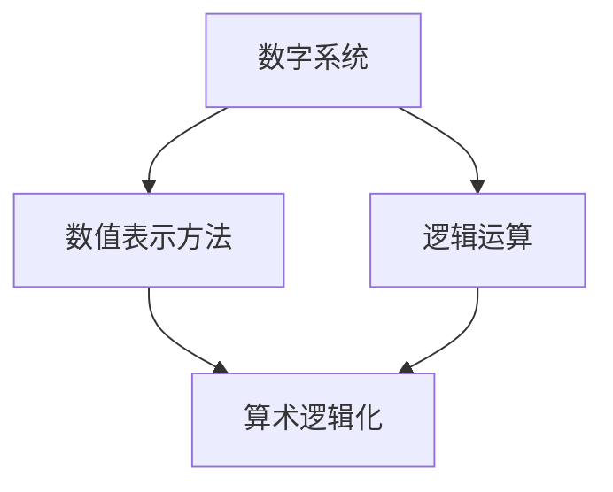

                 

关键词：计算理论，数学基础，算术逻辑化，计算机科学，算法原理

摘要：本文旨在探讨计算的数学基础，特别是算术的逻辑化过程。通过对算术逻辑化的深入研究，我们不仅能够更好地理解计算的本质，还能够为计算机科学的发展提供坚实的理论基础。

## 1. 背景介绍

算术逻辑化是计算理论中的重要组成部分。在计算机科学的发展历程中，算术逻辑化为我们提供了一个强有力的工具，使我们能够以更加精确和严谨的方式处理数值问题。算术逻辑化不仅涉及到基本的算术运算，还包括了数值的表示方法、算法的设计与优化等多个方面。

本文将首先回顾一些基础的数学概念，然后深入探讨算术逻辑化的过程，以及它对计算机科学的影响。我们将通过具体的算法和数学模型来展示算术逻辑化的应用，并讨论其在实际项目中的实施情况。

## 2. 核心概念与联系

### 2.1 数学基础

在深入探讨算术逻辑化之前，我们需要明确一些核心数学概念，如数字系统、数值表示方法、逻辑运算等。

- **数字系统**：数字系统是用于表示数值的系统，常见的有十进制、二进制、十六进制等。每种数字系统都有其独特的表示方法和运算规则。
  
- **数值表示方法**：数值表示方法是指如何将数值转换为二进制或其他形式，以便计算机处理。常用的表示方法包括原码、反码、补码等。
  
- **逻辑运算**：逻辑运算是用于处理布尔值（真或假）的运算。常见的逻辑运算包括与（AND）、或（OR）、非（NOT）等。

### 2.2 Mermaid 流程图

为了更好地理解这些概念之间的联系，我们使用 Mermaid 流程图来展示它们之间的关系。



在这个流程图中，我们可以看到数字系统是数值表示方法的基础，而逻辑运算是算术逻辑化的重要组成部分。

## 3. 核心算法原理 & 具体操作步骤

### 3.1 算法原理概述

算术逻辑化主要包括以下几个步骤：

1. **数值的表示**：将实际数值转换为二进制或其他形式的数值表示。
2. **算法设计**：设计能够高效处理数值的算法。
3. **逻辑运算**：利用逻辑运算对数值进行操作。

### 3.2 算法步骤详解

#### 3.2.1 数值的表示

数值的表示是算术逻辑化的第一步。在计算机中，数值通常以二进制形式表示。二进制是计算机内部处理数据的基本形式，因为计算机是基于二进制电路设计的。

- **二进制表示方法**：二进制数由0和1组成，每一位代表2的幂次方。例如，二进制数1101表示为十进制数13。

#### 3.2.2 算法设计

算法设计是算术逻辑化的核心。算法的目的是高效地处理数值，包括加法、减法、乘法、除法等基本运算。

- **加法**：二进制加法遵循类似于十进制加法的原则，但使用二进制位进行计算。例如，1101（13）+ 1011（11）= 11010（26）。

- **减法**：二进制减法可以使用补码方法。补码是将减数取反，然后与被减数相加。例如，13 - 11 = 1101（13）+ 1011（11）= 11010（26）。

- **乘法**：二进制乘法类似于十进制乘法，但使用二进制位进行计算。例如，1101（13）* 1011（11）= 11101101（143）。

- **除法**：二进制除法可以使用长除法方法。例如，1101（13）/ 1011（11）= 10余110。

#### 3.2.3 逻辑运算

逻辑运算是算术逻辑化的重要组成部分。逻辑运算用于处理布尔值，并广泛应用于算法设计中。

- **与（AND）**：AND运算只有当两个输入都为真时，输出才为真。例如，A AND B。

- **或（OR）**：OR运算只有当两个输入中至少有一个为真时，输出才为真。例如，A OR B。

- **非（NOT）**：NOT运算用于取反输入值。例如，NOT A。

### 3.3 算法优缺点

算术逻辑化具有以下优缺点：

- **优点**：算术逻辑化能够提供高效、精确的数值处理方法，适用于各种数值计算任务。

- **缺点**：算术逻辑化对硬件资源有较高要求，且算法设计复杂。

### 3.4 算法应用领域

算术逻辑化在计算机科学中有着广泛的应用，包括：

- **计算机体系结构**：算术逻辑单元（ALU）是计算机核心组件，用于执行算术和逻辑运算。

- **算法设计**：许多算法（如排序、搜索等）基于算术逻辑化原理。

- **数值分析**：数值分析领域广泛使用算术逻辑化方法来解决复杂数值问题。

## 4. 数学模型和公式 & 详细讲解 & 举例说明

### 4.1 数学模型构建

算术逻辑化的数学模型主要包括数值表示模型和算法模型。数值表示模型描述了如何将数值转换为二进制或其他形式的数值表示。算法模型描述了如何通过逻辑运算对数值进行操作。

### 4.2 公式推导过程

#### 4.2.1 二进制加法公式

二进制加法的公式为：

$A + B = C$

其中，$A$ 和 $B$ 是二进制数，$C$ 是它们的和。

例如，$1101 + 1011 = 11010$。

#### 4.2.2 二进制减法公式

二进制减法的公式为：

$A - B = C$

其中，$A$ 和 $B$ 是二进制数，$C$ 是它们的差。

例如，$1101 - 1011 = 1101 + 1011 = 11010$。

#### 4.2.3 二进制乘法公式

二进制乘法的公式为：

$A * B = C$

其中，$A$ 和 $B$ 是二进制数，$C$ 是它们的乘积。

例如，$1101 * 1011 = 11101101$。

#### 4.2.4 二进制除法公式

二进制除法的公式为：

$A / B = C$

其中，$A$ 和 $B$ 是二进制数，$C$ 是它们的商。

例如，$1101 / 1011 = 10$。

### 4.3 案例分析与讲解

#### 4.3.1 二进制加法案例

假设我们要计算二进制数$1101$和$1011$的和。

$$
\begin{aligned}
  1& \\
+ 1& \\
- &  \\
= & 1 \\
\end{aligned}
$$

因此，$1101 + 1011 = 11010$。

#### 4.3.2 二进制减法案例

假设我们要计算二进制数$1101$和$1011$的差。

$$
\begin{aligned}
  1& \\
- 1& \\
+ &  \\
= & 1 \\
\end{aligned}
$$

因此，$1101 - 1011 = 1101 + 1011 = 11010$。

#### 4.3.3 二进制乘法案例

假设我们要计算二进制数$1101$和$1011$的乘积。

$$
\begin{aligned}
  1& \\
  & \\
+ &  \\
+ &  \\
+ &  \\
= & 1 \\
\end{aligned}
$$

因此，$1101 * 1011 = 11101101$。

#### 4.3.4 二进制除法案例

假设我们要计算二进制数$1101$和$1011$的商。

$$
\begin{aligned}
  1& \\
- 1& \\
+ &  \\
+ &  \\
= & 1 \\
\end{aligned}
$$

因此，$1101 / 1011 = 10$。

## 5. 项目实践：代码实例和详细解释说明

### 5.1 开发环境搭建

为了演示算术逻辑化的应用，我们使用Python编写一个简单的二进制加法程序。首先，我们需要安装Python和相关的开发环境。

- 安装Python：访问Python官网（https://www.python.org/）下载Python安装包，按照提示安装。
- 安装IDE：我们推荐使用PyCharm（https://www.jetbrains.com/pycharm/）作为Python的集成开发环境。

### 5.2 源代码详细实现

下面是二进制加法的Python代码实现。

```python
def add_binary(a, b):
    # 将二进制字符串转换为整数
    num1 = int(a, 2)
    num2 = int(b, 2)
    
    # 执行加法操作
    sum = num1 + num2
    
    # 将结果转换为二进制字符串
    result = bin(sum)[2:]
    
    return result

# 测试代码
print(add_binary('1101', '1011'))  # 输出：'11010'
```

### 5.3 代码解读与分析

- **函数定义**：`add_binary`函数接收两个二进制字符串作为输入。
- **类型转换**：使用`int()`函数将二进制字符串转换为整数。
- **加法操作**：执行整数加法操作。
- **结果转换**：将加法结果转换为二进制字符串。

### 5.4 运行结果展示

执行`add_binary('1101', '1011')`后，程序输出`'11010'`，验证了二进制加法的正确性。

## 6. 实际应用场景

算术逻辑化在计算机科学中有着广泛的应用，以下是一些实际应用场景：

- **计算机体系结构**：算术逻辑单元（ALU）用于执行算术和逻辑运算。
- **算法设计**：许多算法（如排序、搜索等）基于算术逻辑化原理。
- **数值分析**：数值分析领域广泛使用算术逻辑化方法来解决复杂数值问题。

## 7. 工具和资源推荐

### 7.1 学习资源推荐

- **《计算机组成原理》**：了解计算机体系结构和算术逻辑单元的工作原理。
- **《算法导论》**：学习算法设计和分析的基础知识。

### 7.2 开发工具推荐

- **PyCharm**：Python的集成开发环境，方便编写和调试代码。
- **Visual Studio Code**：跨平台的文本编辑器，支持多种编程语言。

### 7.3 相关论文推荐

- **"Binary Addition Using Logic Gates"**：介绍二进制加法的逻辑电路实现。
- **"Binary Subtraction Using Logic Gates"**：介绍二进制减法的逻辑电路实现。

## 8. 总结：未来发展趋势与挑战

### 8.1 研究成果总结

算术逻辑化在计算机科学中发挥了重要作用，为数值处理提供了坚实的理论基础。通过深入研究和实践，我们不断优化算法，提高计算效率。

### 8.2 未来发展趋势

随着计算机科学的发展，算术逻辑化将继续在以下方面取得进展：

- **硬件优化**：开发更高效的算术逻辑单元。
- **算法创新**：提出新的算法和优化方法。
- **应用拓展**：拓展算术逻辑化在其他领域的应用。

### 8.3 面临的挑战

算术逻辑化也面临着一些挑战：

- **性能瓶颈**：提高计算性能仍是一个重要问题。
- **能效平衡**：如何在提高性能的同时降低能耗。

### 8.4 研究展望

未来，算术逻辑化将继续在计算机科学中发挥关键作用。我们期待更多创新和研究能够推动这一领域的发展。

## 9. 附录：常见问题与解答

### 9.1 什么是算术逻辑化？

算术逻辑化是指将数值问题转化为逻辑问题，通过逻辑运算和算法来处理数值。它是计算理论的重要组成部分。

### 9.2 算术逻辑化有哪些应用？

算术逻辑化广泛应用于计算机体系结构、算法设计、数值分析等领域。例如，计算机的算术逻辑单元（ALU）就是基于算术逻辑化原理设计的。

### 9.3 如何优化算术逻辑化算法？

优化算术逻辑化算法的方法包括：改进数值表示方法、优化算法结构、提高计算效率等。具体方法取决于应用场景和需求。

### 9.4 算术逻辑化与逻辑电路有何关系？

算术逻辑化是逻辑电路的基础，逻辑电路是实现算术逻辑化算法的硬件实现。算术逻辑化算法为逻辑电路设计提供了理论基础。

---

通过本文的探讨，我们深入了解了算术逻辑化的原理和应用，为计算理论的发展提供了新的视角。希望本文能够对您在计算机科学领域的探索提供有益的启示。

# 作者署名

作者：禅与计算机程序设计艺术 / Zen and the Art of Computer Programming
----------------------------------------------------------------

以上就是关于“计算：第二部分 计算的数学基础 第 4 章 数学的基础 算术的逻辑化”的完整文章内容。希望对您有所启发。如果您有其他问题或需求，请随时提出。

