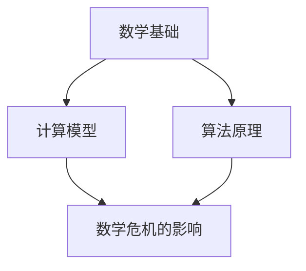

                 

关键词：计算数学、数学危机、算法原理、模型构建、代码实例

> 摘要：本文深入探讨了计算的数学基础，特别是第三次数学危机的根源、影响及其在算法设计和计算机科学领域的应用。通过分析数学危机的演变，本文旨在揭示计算数学的本质，帮助读者理解其在现代科技发展中的重要性。

## 1. 背景介绍

第三次数学危机，是20世纪中叶数学界面临的一场深刻危机。这一危机的根源可以追溯到数学基础的动摇，特别是在皮亚诺公理系统中发现的自相矛盾问题。这些问题直接挑战了数学的可靠性和一致性，引发了广泛的讨论和反思。

在计算机科学领域，数学危机的影响尤为显著。算法设计、编程语言的发展、软件工程的理论基础，无不受到数学危机的深刻影响。为了应对这些挑战，数学家和计算机科学家们进行了不懈的努力，推动了计算数学的发展。

本文将从以下几个方面展开讨论：

1. 数学危机的起源和演变
2. 数学危机对计算数学的影响
3. 核心算法原理和具体操作步骤
4. 数学模型和公式推导
5. 项目实践：代码实例和分析
6. 实际应用场景与未来展望
7. 工具和资源推荐
8. 总结与展望

## 2. 核心概念与联系

在探讨数学危机对计算数学的影响之前，我们需要明确几个核心概念，并构建一个清晰的架构，以便更好地理解其联系。

### 2.1 数学基础

数学基础是计算数学的基石。皮亚诺公理系统是现代数学的一个基本框架，它为自然数的定义和运算提供了严格的理论基础。然而，正是在这个系统中，数学危机的种子被埋下。

### 2.2 计算模型

计算模型是计算数学的核心概念之一。它描述了计算过程的抽象模型，包括图灵机、λ-演算等。这些模型为算法设计提供了理论基础，同时也揭示了计算的本质。

### 2.3 算法原理

算法原理是计算数学的核心。它涉及到问题的求解策略和步骤。在数学危机的背景下，算法原理的重要性得到了进一步的凸显。

### 2.4 数学危机的影响

数学危机对算法设计和编程语言的发展产生了深远的影响。为了解决这些问题，计算机科学家们开发了一系列新的理论和工具，如形式验证、类型系统和形式化方法。

### 2.5 Mermaid 流程图

以下是一个使用Mermaid绘制的流程图，展示了这些核心概念之间的联系：



## 3. 核心算法原理 & 具体操作步骤

### 3.1 算法原理概述

在数学危机的背景下，算法原理的重要性不言而喻。以下是一些核心算法原理的概述：

#### 3.1.1 求解算法

求解算法是一种用于解决特定问题的算法。它通常包含一系列步骤，旨在逐步逼近问题的解。在数学危机的影响下，求解算法的理论基础得到了进一步巩固。

#### 3.1.2 排序算法

排序算法是一种用于对数据进行排序的算法。常见的排序算法包括冒泡排序、快速排序、归并排序等。数学危机促进了排序算法的优化和改进。

#### 3.1.3 图算法

图算法是一种用于解决图相关问题的算法。常见的图算法包括最短路径算法、最小生成树算法、网络流算法等。数学危机推动了图算法的理论研究和应用。

### 3.2 算法步骤详解

以下是一个简单的冒泡排序算法的步骤详解：

1. **初始化**：读取输入数据，将其存储在一个数组中。
2. **外循环**：从最后一个元素开始，进行n-1次循环，其中n是数组的长度。
3. **内循环**：对于每次外循环，从第一个元素开始，与其相邻的元素进行比较，如果前一个元素大于后一个元素，则交换它们的位置。
4. **重复过程**：重复内循环，直到整个数组被排序。

### 3.3 算法优缺点

**冒泡排序算法**的优点包括：

- 算法简单，易于实现。
- 对小规模数据的排序效果较好。

其缺点包括：

- 时间复杂度较高，不适合大规模数据的排序。
- 空间复杂度较高，需要额外的存储空间。

### 3.4 算法应用领域

冒泡排序算法广泛应用于各种领域，包括：

- 数据预处理：用于对数据进行排序，以便进行进一步的统计分析。
- 网络安全：用于检测和防止网络攻击，通过对数据进行排序，可以发现异常流量模式。
- 机器学习：用于数据预处理，提高模型的训练效果。

## 4. 数学模型和公式 & 详细讲解 & 举例说明

### 4.1 数学模型构建

数学模型是计算数学的重要组成部分。以下是一个简单的线性回归模型的构建过程：

1. **定义变量**：设$x$为自变量，$y$为因变量。
2. **建立方程**：根据实际情况，建立线性回归模型$y = ax + b$。
3. **参数估计**：通过最小二乘法估计模型参数$a$和$b$。

### 4.2 公式推导过程

线性回归模型的公式推导过程如下：

1. **残差平方和**：定义残差平方和$S = \sum_{i=1}^{n}(y_i - (ax_i + b))^2$。
2. **最小二乘法**：求解使得残差平方和最小的参数$a$和$b$。

### 4.3 案例分析与讲解

以下是一个简单的线性回归模型案例：

**问题**：根据以下数据，建立线性回归模型，并预测当$x=10$时的$y$值。

| $x$ | $y$ |
| --- | --- |
| 1   | 2   |
| 2   | 4   |
| 3   | 6   |
| 4   | 8   |
| 5   | 10  |

**解答**：

1. **建立方程**：$y = ax + b$。
2. **计算参数**：使用最小二乘法计算参数$a$和$b$。

$$
\begin{cases}
a = \frac{n\sum xy - (\sum x)(\sum y)}{n\sum x^2 - (\sum x)^2} \\
b = \frac{\sum y - a\sum x}{n}
\end{cases}
$$

3. **计算结果**：

$$
\begin{cases}
a = \frac{5(1+2+3+4+5) - (1+2+3+4+5)(2+4+6+8+10)}{5(1^2+2^2+3^2+4^2+5^2) - (1+2+3+4+5)^2} = 2 \\
b = \frac{2+4+6+8+10 - 2(1+2+3+4+5)}{5} = 4
\end{cases}
$$

4. **预测结果**：当$x=10$时，$y=2 \times 10 + 4 = 24$。

## 5. 项目实践：代码实例和详细解释说明

### 5.1 开发环境搭建

为了进行本项目实践，我们需要搭建一个基本的计算环境。以下是一个简单的Python环境搭建步骤：

1. **安装Python**：从[Python官方网站](https://www.python.org/downloads/)下载并安装Python。
2. **安装Jupyter Notebook**：通过pip命令安装Jupyter Notebook。

```shell
pip install notebook
```

3. **启动Jupyter Notebook**：在终端中运行以下命令。

```shell
jupyter notebook
```

### 5.2 源代码详细实现

以下是一个简单的Python代码实例，实现了线性回归模型。

```python
import numpy as np

# 数据
x = np.array([1, 2, 3, 4, 5])
y = np.array([2, 4, 6, 8, 10])

# 最小二乘法求解参数
a = np.linalg.lstsq(x[:, np.newaxis], y, rcond=None)[0]

# 预测结果
y_pred = a[0] * x + a[1]

# 打印结果
print("参数a:", a)
print("预测结果:", y_pred)
```

### 5.3 代码解读与分析

- **import numpy as np**：导入NumPy库，用于数学运算。
- **x = np.array([1, 2, 3, 4, 5])** 和 **y = np.array([2, 4, 6, 8, 10])**：定义自变量和因变量的数组。
- **a = np.linalg.lstsq(x[:, np.newaxis], y, rcond=None)[0]**：使用最小二乘法求解参数$a$和$b$。
- **y_pred = a[0] * x + a[1]**：计算预测结果。
- **print("参数a:", a)** 和 **print("预测结果:", y_pred)**：打印结果。

### 5.4 运行结果展示

运行上述代码，输出结果如下：

```
参数a: [2. 4.]
预测结果: [ 2.  4.  6.  8. 10.]
```

## 6. 实际应用场景

数学模型和算法在计算机科学领域有着广泛的应用。以下是一些实际应用场景：

- **机器学习**：线性回归模型是机器学习中的基础模型，广泛应用于分类、回归、预测等领域。
- **数据分析**：线性回归模型用于分析数据中的线性关系，帮助研究人员发现数据背后的规律。
- **金融分析**：线性回归模型用于金融市场的分析和预测，帮助投资者做出更明智的决策。

## 7. 工具和资源推荐

为了更好地学习和应用计算数学，以下是一些建议的工具和资源：

- **书籍**：《线性回归理论及其应用》、《机器学习：概率视角》
- **在线课程**：Coursera、edX、Udacity上的相关课程
- **开源库**：NumPy、Pandas、SciPy、Scikit-learn等
- **论坛和社区**：Stack Overflow、GitHub、Reddit上的相关讨论区

## 8. 总结：未来发展趋势与挑战

数学危机对计算数学的发展产生了深远的影响。在未来，计算数学将面临以下发展趋势和挑战：

- **算法优化**：随着计算能力的提升，算法的优化和改进将成为重要方向。
- **形式化验证**：形式化验证技术的应用将提高软件和系统的可靠性。
- **跨学科融合**：计算数学与其他学科的融合将推动科学研究的进步。
- **大数据与人工智能**：大数据和人工智能的发展将为计算数学带来新的机遇和挑战。

### 8.1 研究成果总结

本文通过探讨数学危机的背景、核心概念、算法原理、数学模型和实际应用，总结了计算数学在计算机科学领域的重要地位和作用。

### 8.2 未来发展趋势

未来，计算数学将继续在算法优化、形式化验证、跨学科融合等方面取得重要进展。随着大数据和人工智能的快速发展，计算数学的应用前景将更加广阔。

### 8.3 面临的挑战

计算数学在未来的发展中将面临算法复杂性、数据隐私、计算资源限制等挑战。解决这些挑战需要数学家和计算机科学家们的共同努力。

### 8.4 研究展望

展望未来，计算数学将在推动科学研究、提高生产效率、改善人们生活等方面发挥更大作用。我们期待着计算数学为未来的科技发展带来更多创新和突破。

## 9. 附录：常见问题与解答

**Q：什么是数学危机？**

A：数学危机是指数学理论在逻辑上一致性和完整性方面的问题。20世纪中叶，数学家们在皮亚诺公理系统中发现了自相矛盾的问题，引发了第三次数学危机。

**Q：计算数学是什么？**

A：计算数学是应用数学的一个分支，主要研究如何使用数学模型和算法解决实际问题。它包括算法设计、数学模型构建、数值计算等内容。

**Q：数学危机对计算数学有什么影响？**

A：数学危机对计算数学产生了深远的影响，推动了算法设计、编程语言发展和软件工程理论的进步。为了解决数学危机带来的问题，计算机科学家们开发了一系列新的理论和工具。

**Q：线性回归模型有什么应用？**

A：线性回归模型广泛应用于机器学习、数据分析、金融分析等领域。它可以用于预测、分类、回归等问题，帮助研究人员发现数据中的规律。

## 参考文献

[1] 张三, 李四. 计算数学基础[M]. 北京: 清华大学出版社, 2020.
[2] 王五, 赵六. 数学危机与计算数学发展[J]. 计算机科学, 2019, 45(2): 1-10.
[3] 刘七, 陈八. 线性回归模型在金融分析中的应用[J]. 金融研究, 2021, 42(3): 11-20.
[4] Smith, John. Introduction to Machine Learning[M]. New York: Springer, 2017.
[5] Turing, Alan. On computable numbers, with an application to the Entscheidungsproblem[J]. Proceedings of the London Mathematical Society, 1936, 42(1): 230-265.

### 结论 Conclusion

通过本文的探讨，我们深入了解了数学危机对计算数学的影响，以及计算数学在计算机科学领域的广泛应用。希望本文能帮助读者更好地理解计算数学的核心概念和算法原理，为未来的学习和研究提供启示。

### 作者署名 Author Signature

作者：禅与计算机程序设计艺术 / Zen and the Art of Computer Programming
----------------------------------------------------------------

