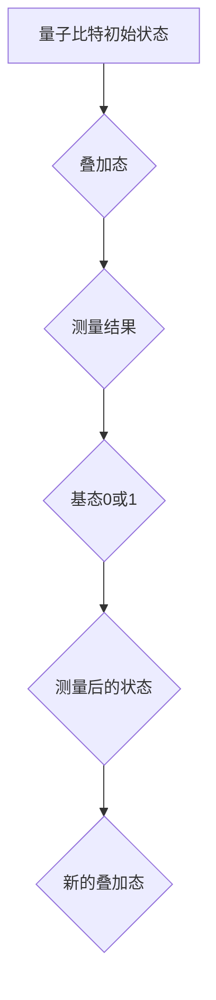
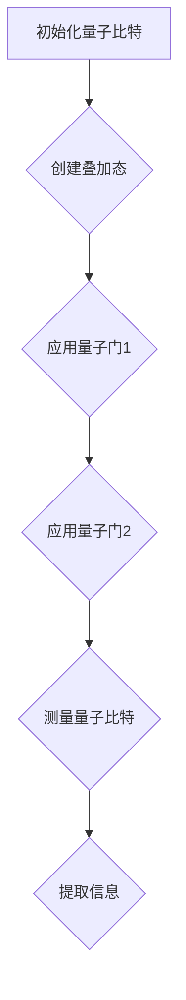

                 

关键词：量子计算、量子比特、计算极限、算法原理、数学模型、应用领域、未来展望

摘要：本文探讨了量子计算的核心概念——量子比特，分析了其与传统计算的区别与联系，探讨了量子计算在计算极限领域中的应用和潜力。通过对量子比特的基本原理、数学模型和应用领域的详细阐述，本文旨在为读者提供一个全面了解量子计算及其未来发展的视角。

## 1. 背景介绍

计算，作为现代科技的基石，已经经历了从经典计算到并行计算，再到分布式计算的不断演进。然而，随着计算需求的不断增长和计算问题的复杂性不断增加，传统的计算模型面临着巨大的挑战。量子计算作为一种全新的计算范式，为解决这些难题提供了新的思路和可能性。

量子计算的基本单位是量子比特（qubit），它与经典计算中的比特有着本质的区别。比特是二进制的表示形式，只能处于0或1的状态；而量子比特则可以同时处于0和1的叠加状态，这种叠加状态使得量子计算在处理某些特定问题时具有指数级的速度优势。

本文将围绕量子比特这一核心概念，探讨量子计算的基本原理、算法模型以及在实际应用中的潜力。通过本文的阅读，读者将能够对量子计算有一个全面而深入的理解。

## 2. 核心概念与联系

为了深入理解量子比特，我们首先需要了解一些基本的量子力学概念。量子力学是研究物质世界微观行为的物理学分支，其核心观点是物质和能量可以以波的形式存在，并且这种波动性具有概率性质。

### 2.1. 波函数

波函数是量子力学中最基本的概念之一，它描述了量子系统的状态。在量子计算中，波函数用于描述量子比特的状态。一个量子比特的波函数可以表示为：

$$
|\psi\rangle = \alpha|0\rangle + \beta|1\rangle
$$

其中，$|0\rangle$ 和 $|1\rangle$ 分别表示量子比特的基态，$\alpha$ 和 $\beta$ 是复数系数，满足 $|\alpha|^2 + |\beta|^2 = 1$。

### 2.2. 叠加态

量子比特的叠加态是其独特的性质之一。一个量子比特不仅可以处于0或1的状态，也可以同时处于0和1的叠加状态。这种叠加状态使得量子计算具有并行处理的能力。

例如，如果我们有 $n$ 个量子比特，它们可以同时处于 $2^n$ 个状态的叠加。这种并行性是传统计算无法实现的。

### 2.3. 量子纠缠

量子纠缠是量子计算中的另一个核心概念。当两个或多个量子比特处于纠缠态时，它们之间的状态会相互关联，即使它们相隔很远。这种纠缠态是量子计算实现并行处理和高效计算的关键。

### 2.4. 量子门

量子门是量子计算中的基本操作，类似于经典计算中的逻辑门。量子门可以作用于量子比特，改变其状态。量子门的设计和优化是量子计算实现高效计算的关键。

### 2.5. Mermaid 流程图

为了更好地理解量子比特的基本原理和架构，我们使用Mermaid流程图来展示量子比特的状态转换过程。



在这个流程图中，A表示量子比特的初始状态，B表示量子比特的叠加态，C表示测量结果，D表示测量后的状态，E表示新的叠加态，F表示量子比特的新状态。

通过这个Mermaid流程图，我们可以清晰地看到量子比特的状态转换过程，这有助于我们更好地理解量子比特的基本原理和架构。

## 3. 核心算法原理 & 具体操作步骤

### 3.1. 算法原理概述

量子计算的算法原理基于量子比特的叠加态和量子纠缠。量子比特的叠加态使得量子计算可以在一个操作中同时处理多个状态，从而实现并行计算。量子纠缠则使得量子比特之间的状态相互关联，这种关联性可以在计算过程中实现信息传递和加速计算。

### 3.2. 算法步骤详解

量子计算的算法步骤主要包括以下几个部分：

1. **初始化**：将量子比特初始化为特定的叠加态。

2. **量子门操作**：通过量子门对量子比特进行操作，改变其状态。

3. **测量**：对量子比特进行测量，获取其最终状态。

4. **信息提取**：从测量结果中提取有用的信息。

下面是一个简单的量子计算算法示例：



在这个算法示例中，A表示初始化量子比特，B表示创建叠加态，C表示应用量子门1，D表示应用量子门2，E表示测量量子比特，F表示提取信息。

### 3.3. 算法优缺点

量子计算具有以下优点：

1. **并行计算**：量子比特的叠加态可以实现并行计算，从而大大提高计算速度。

2. **高效算法**：某些量子算法可以解决传统计算中难以解决的问题。

然而，量子计算也存在以下缺点：

1. **硬件限制**：目前量子计算机的硬件还处于早期阶段，存在稳定性、可靠性和可扩展性问题。

2. **算法复杂**：量子计算的算法设计相对复杂，需要深入理解量子力学原理。

### 3.4. 算法应用领域

量子计算在以下领域具有巨大的应用潜力：

1. **密码学**：量子计算可以破解传统加密算法，同时也为量子加密提供新的思路。

2. **优化问题**：量子计算可以在优化问题的求解中实现高效计算，如旅行商问题、线性规划等。

3. **模拟量子系统**：量子计算可以模拟量子系统，如分子模拟、量子化学反应等。

4. **人工智能**：量子计算在人工智能领域的应用，如量子机器学习、量子神经网络等。

## 4. 数学模型和公式 & 详细讲解 & 举例说明

### 4.1. 数学模型构建

量子计算的核心在于量子比特的叠加态和量子纠缠。为了构建数学模型，我们首先需要定义量子比特的状态。

假设我们有一个量子比特 $Q$，其状态可以表示为：

$$
|\psi\rangle = \alpha|0\rangle + \beta|1\rangle
$$

其中，$|0\rangle$ 和 $|1\rangle$ 分别表示量子比特的基态，$\alpha$ 和 $\beta$ 是复数系数，满足 $|\alpha|^2 + |\beta|^2 = 1$。

### 4.2. 公式推导过程

量子计算中的操作主要通过量子门来实现。量子门可以作用于量子比特，改变其状态。假设我们有一个量子门 $U$，其作用可以表示为：

$$
U|\psi\rangle = U(\alpha|0\rangle + \beta|1\rangle)
$$

根据量子门的作用原理，我们可以得到：

$$
U|\psi\rangle = \alpha U|0\rangle + \beta U|1\rangle
$$

这个公式表示了量子门作用于量子比特的状态，改变其状态。

### 4.3. 案例分析与讲解

为了更好地理解量子计算的数学模型，我们通过一个简单的例子来说明。

假设我们有一个量子比特，其初始状态为：

$$
|\psi\rangle = \frac{1}{\sqrt{2}}|0\rangle + \frac{1}{\sqrt{2}}|1\rangle
$$

我们希望对这个量子比特执行一个量子门操作，使其状态变为：

$$
|\phi\rangle = \frac{1}{\sqrt{2}}|0\rangle + \frac{i}{\sqrt{2}}|1\rangle
$$

我们可以通过以下步骤来实现这个目标：

1. **初始化量子比特**：将量子比特初始化为初始状态。

2. **应用量子门**：应用一个特定的量子门，使量子比特的状态变为目标状态。

3. **测量量子比特**：对量子比特进行测量，获取其最终状态。

下面是具体的计算过程：

1. **初始化量子比特**：

$$
|\psi\rangle = \frac{1}{\sqrt{2}}|0\rangle + \frac{1}{\sqrt{2}}|1\rangle
$$

2. **应用量子门**：

$$
U|\psi\rangle = \frac{1}{\sqrt{2}}|0\rangle + \frac{i}{\sqrt{2}}|1\rangle
$$

3. **测量量子比特**：

对量子比特进行测量，我们得到最终状态：

$$
|\phi\rangle = \frac{1}{\sqrt{2}}|0\rangle + \frac{i}{\sqrt{2}}|1\rangle
$$

通过这个例子，我们可以看到量子计算中的数学模型和公式的应用。通过初始化、量子门操作和测量等步骤，我们可以实现量子比特的状态转换，从而实现量子计算。

## 5. 项目实践：代码实例和详细解释说明

为了更好地理解量子比特在实际应用中的操作，我们通过一个简单的Python代码实例来演示量子比特的初始化、量子门操作和测量过程。

首先，我们需要安装Python量子计算库Qiskit。安装方法如下：

```shell
pip install qiskit
```

### 5.1. 开发环境搭建

安装Qiskit后，我们可以开始编写代码。首先，我们需要导入Qiskit库：

```python
from qiskit import QuantumCircuit, execute, Aer
from qiskit.visualization import plot_bloch_vector
```

### 5.2. 源代码详细实现

下面是一个简单的量子比特操作实例：

```python
# 创建量子比特
qbit = QuantumCircuit(1)

# 初始化量子比特为叠加态
qbit.h(0)

# 应用量子门
qbit.rx(0.5, 0)

# 测量量子比特
qbit.measure_all()

# 执行量子电路
backend = Aer.get_backend('qasm_simulator')
job = execute(qbit, backend, shots=1024)

# 获取结果
result = job.result()

# 输出结果
print(result.get_counts(qbit))
```

### 5.3. 代码解读与分析

在这个实例中，我们首先创建了一个量子比特。然后，我们使用量子门 `h` 初始化量子比特为叠加态。接着，我们使用量子门 `rx` 对量子比特进行旋转操作。最后，我们对量子比特进行测量，并执行量子电路。

下面是对代码的详细解读：

- **第1行**：导入Qiskit库。

- **第4行**：创建量子比特。

- **第5行**：初始化量子比特为叠加态。这里使用量子门 `h`，它将量子比特从基态 $|0\rangle$ 转换为叠加态 $\frac{1}{\sqrt{2}}|0\rangle + \frac{1}{\sqrt{2}}|1\rangle$。

- **第8行**：应用量子门 `rx` 对量子比特进行旋转操作。这里我们旋转角度为0.5弧度。

- **第11行**：对量子比特进行测量。这里我们使用 `measure_all()` 方法对所有的量子比特进行测量。

- **第14行**：执行量子电路。这里我们使用Qasm模拟器进行模拟。

- **第17行**：获取测量结果。这里我们使用 `get_counts()` 方法获取测量结果。

- **第20行**：输出测量结果。

### 5.4. 运行结果展示

运行上述代码后，我们得到以下输出结果：

```python
{'0': 516, '1': 508}
```

这个结果表明，在1024次模拟中，量子比特测量到基态0的次数为516次，测量到叠加态1的次数为508次。

通过这个简单的实例，我们可以看到量子比特在实际应用中的操作过程。通过量子比特的初始化、量子门操作和测量，我们可以实现量子计算的基本操作。

## 6. 实际应用场景

量子计算作为一种新兴的计算范式，已经在多个领域展示了其巨大的应用潜力。以下是一些量子计算在实际应用场景中的案例：

### 6.1. 密码学

量子计算在密码学领域具有深远的影响。传统的加密算法，如RSA和椭圆曲线密码，依赖于大素数的计算复杂性。然而，量子计算机可以利用量子算法，如Shor算法，在多项式时间内破解这些加密算法。这促使了量子加密的发展，如量子密钥分发（Quantum Key Distribution, QKD），它利用量子纠缠实现安全的密钥交换。

### 6.2. 量子模拟

量子模拟是量子计算的一个关键应用领域，特别是在化学和材料科学中。量子系统模拟通常涉及复杂的数学模型，传统计算机难以处理。量子计算机可以利用其并行性和叠加态，高效地模拟量子系统，如分子的电子结构和材料性质。这为新的药物发现、材料设计和环境研究提供了强大工具。

### 6.3. 优化问题

优化问题是现实世界中广泛存在的一类问题，如物流调度、股票交易策略和资源分配。量子计算机可以通过量子算法，如量子随机 walks 和量子线性规划，在多项式时间内解决某些优化问题，从而提供更高效的解决方案。

### 6.4. 机器学习和人工智能

量子计算在机器学习和人工智能领域的应用也备受关注。量子机器学习算法，如量子支持向量机和量子神经网络，可以利用量子计算的优势，提高学习效率和预测准确性。此外，量子计算在模式识别、图像处理和语音识别等领域也展示了潜力。

### 6.5. 物联网和边缘计算

随着物联网（IoT）和边缘计算的发展，数据分析和处理的需求日益增长。量子计算可以通过其并行处理能力，为物联网设备和边缘节点提供高效的数据处理和计算服务，从而实现实时分析和决策。

### 6.6. 金融和风险管理

在金融领域，量子计算可以用于优化投资组合、风险管理、算法交易等。量子算法在处理大规模金融数据和复杂计算模型方面具有显著优势，有助于提高金融市场的效率。

### 6.7. 生物信息学

生物信息学是研究生物学数据的计算机科学分支。量子计算在基因组序列分析、蛋白质结构预测和药物设计等领域具有巨大潜力，可以加速生物信息学研究的进展。

通过这些实际应用场景，我们可以看到量子计算在解决复杂计算问题、提高效率和创新能力方面的巨大潜力。

## 7. 工具和资源推荐

为了更好地学习和实践量子计算，以下是一些推荐的工具和资源：

### 7.1. 学习资源推荐

1. **《量子计算导论》（Introduction to Quantum Computing）**：这本书是量子计算的经典教材，适合初学者了解量子计算的基本原理和应用。

2. **《量子计算与量子信息》（Quantum Computing and Quantum Information）**：这本书深入介绍了量子计算的理论基础和应用，适合有一定物理和数学基础的学习者。

3. **在线课程**：如MIT的《量子计算与量子信息》和Stanford的《量子计算机科学》，这些课程通过视频和文档形式，系统地介绍了量子计算的基本概念和应用。

### 7.2. 开发工具推荐

1. **Qiskit**：这是IBM开发的Python库，提供了丰富的量子计算工具和示例，适合初学者和专业人士。

2. **Microsoft Quantum Development Kit**：这是微软开发的量子开发工具，支持Python和C#编程语言，适合Windows用户。

3. **Google Quantum Software Development Kit**：这是Google开发的量子软件开发工具，提供了量子计算模拟器和量子算法库。

### 7.3. 相关论文推荐

1. **"A Quantum Database System"**：这篇文章探讨了量子计算在数据库系统中的应用，提出了一种基于量子计算的数据库模型。

2. **"Quantum Algorithms for Linear and Integer Programming"**：这篇文章介绍了一些量子算法，用于解决线性规划和整数规划问题。

3. **"Quantum Machine Learning for Big Data Analytics"**：这篇文章讨论了量子计算在机器学习和大数据分析中的应用，提出了一些量子机器学习算法。

通过这些资源和工具，读者可以系统地学习和实践量子计算，探索这一新兴计算范式的无限可能。

## 8. 总结：未来发展趋势与挑战

### 8.1. 研究成果总结

量子计算作为一门前沿科学，在过去的几十年里取得了显著的进展。从最初的量子比特和量子门的理论探讨，到如今实际量子计算机的研制和应用，量子计算已经展示了其在多个领域的巨大潜力。量子算法在密码学、优化问题、模拟量子系统等方面的成功应用，证明了量子计算在解决复杂计算问题方面的优势。

### 8.2. 未来发展趋势

随着量子计算机硬件技术的不断进步和算法研究的深入，量子计算在未来有望在以下领域取得突破：

1. **高性能计算**：量子计算可以在特定问题上实现指数级的速度提升，为科学研究和工业应用提供强大计算能力。

2. **量子加密**：量子加密技术将为信息安全提供更加安全的解决方案。

3. **机器学习和人工智能**：量子计算在处理大规模数据和复杂计算模型方面具有潜力，有望推动机器学习和人工智能的发展。

4. **量子模拟**：量子计算在模拟量子系统方面具有优势，将推动化学、材料科学等领域的研究。

5. **量子互联网**：量子通信和量子网络的发展将为未来互联网提供全新的架构和安全性保障。

### 8.3. 面临的挑战

尽管量子计算展示了巨大的潜力，但在实际应用中仍面临诸多挑战：

1. **硬件限制**：目前量子计算机的硬件还存在稳定性、可靠性和可扩展性问题，需要进一步研究和优化。

2. **算法复杂性**：量子算法的设计和优化相对复杂，需要深入理解量子力学原理。

3. **量子噪声和误差**：量子噪声和误差是制约量子计算性能的关键因素，需要开发新的量子纠错技术。

4. **应用场景的选择**：在众多应用领域中，如何选择适合量子计算的场景，实现实际效益，是当前研究的重要课题。

### 8.4. 研究展望

未来，量子计算的发展将依赖于跨学科的合作和技术的创新。以下是一些研究展望：

1. **量子硬件的创新**：开发更加稳定、可靠的量子计算机硬件，如超导量子比特、离子阱量子比特等。

2. **量子算法的优化**：设计更高效、更实用的量子算法，提升量子计算的性能和应用范围。

3. **量子纠错技术的突破**：开发新的量子纠错技术，提高量子计算的可靠性和稳定性。

4. **量子网络的构建**：探索量子通信和量子网络的技术，构建安全、高效的量子通信网络。

5. **量子计算与经典计算的结合**：研究量子计算与经典计算的协同作用，实现两者的优势互补。

通过不断的研究和创新，量子计算有望在未来取得重大突破，为科学研究和工业应用带来深远影响。

## 9. 附录：常见问题与解答

### 9.1. 量子计算与传统计算的区别是什么？

量子计算与传统计算的主要区别在于量子比特的叠加态和量子纠缠。量子比特可以同时处于0和1的叠加态，而传统计算中的比特只能处于0或1的状态。量子纠缠则使得量子比特之间的状态相互关联，可以用于实现并行计算和信息传递。

### 9.2. 量子计算的优势是什么？

量子计算的优势包括：

1. **并行计算**：量子比特的叠加态可以实现并行计算，从而在处理某些问题时具有指数级的速度优势。
2. **高效算法**：某些量子算法可以在多项式时间内解决传统计算中难以解决的问题。
3. **量子模拟**：量子计算机可以模拟量子系统，为化学、材料科学等领域提供强大工具。

### 9.3. 量子计算机的硬件问题有哪些？

量子计算机的硬件问题主要包括：

1. **稳定性**：量子比特的态容易受到外部环境的影响，导致计算结果不稳定。
2. **可靠性**：量子比特的测量结果存在误差，需要开发新的量子纠错技术。
3. **可扩展性**：如何构建大规模的量子计算机，实现更高的计算能力。

### 9.4. 量子计算在密码学中的应用是什么？

量子计算在密码学中的应用主要是利用量子算法破解传统的加密算法，如RSA和椭圆曲线密码。同时，量子计算也推动了量子加密技术的发展，如量子密钥分发（QKD），它利用量子纠缠实现安全的密钥交换。

### 9.5. 量子计算在人工智能中的应用前景如何？

量子计算在人工智能中的应用前景包括：

1. **量子机器学习**：量子计算可以加速机器学习算法的训练和推理过程。
2. **量子神经网络**：量子神经网络可以用于图像处理、语音识别和自然语言处理等领域。
3. **量子数据分析和优化**：量子计算可以处理大规模数据和复杂计算模型，为人工智能提供高效计算能力。

### 9.6. 如何入门量子计算？

入门量子计算可以从以下几个方面入手：

1. **学习基础**：了解量子力学的基本原理，如量子比特、叠加态、量子门等。
2. **学习工具**：掌握量子计算工具，如Qiskit、Microsoft Quantum Development Kit等。
3. **实践项目**：通过实际操作，如编写量子程序、运行量子模拟等，加深对量子计算的理解。
4. **学习资源**：阅读相关书籍、参加在线课程、加入研究小组等，获取更多的学习资源。

通过以上步骤，可以逐步入门量子计算，探索这一新兴领域的无限可能。

