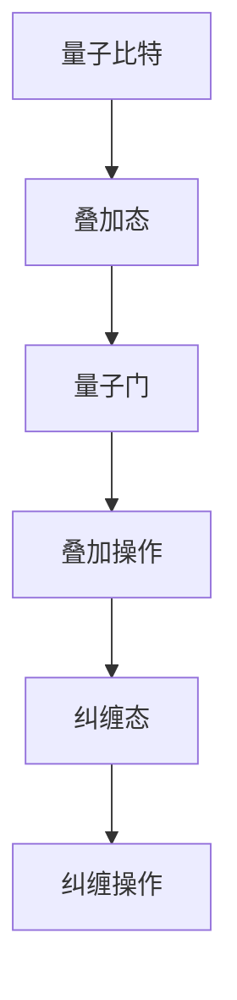

                 

 关键词：量子计算，算法，计算极限，量子算法，量子力学，量子门，量子比特，量子叠加，量子纠缠，Shor算法，Grover算法，量子搜索算法，量子并行计算，量子模拟，量子通信，量子密码学。

> 摘要：本文深入探讨了量子计算领域，特别是量子算法的概念、原理和应用。通过介绍Shor算法和Grover算法，展示了量子计算在求解经典计算难题中的优势。此外，本文还分析了量子算法的数学模型、应用领域以及面临的技术挑战，为未来量子计算的发展提供了指导。

## 1. 背景介绍

计算作为现代科技的核心，已经深刻地改变了人类社会的各个方面。然而，随着计算问题的复杂度不断增加，传统计算方法面临着巨大的挑战。经典计算机依赖于位（bit）作为信息存储和处理的单位，每一位只能表示0或1两种状态。这种二进制限制使得经典计算机在处理某些问题时效率低下。例如，大整数的质因数分解是一个典型的难题，使用经典算法需要耗费巨大的时间和计算资源。

量子计算的出现为解决这些问题带来了新的希望。量子计算机利用量子力学原理，以量子比特（qubit）作为信息存储和处理的基本单位。量子比特可以同时存在于0和1的叠加态，这一特性使得量子计算机能够在某些问题上实现并行计算，从而大大提高计算效率。

量子算法作为量子计算的核心，通过巧妙地利用量子比特的叠加和纠缠特性，实现了对某些问题的指数级加速。本文将详细介绍两个典型的量子算法——Shor算法和Grover算法，并分析其原理和应用。

## 2. 核心概念与联系

在探讨量子算法之前，我们需要理解几个核心概念：量子比特、量子门、量子叠加和量子纠缠。

### 2.1 量子比特

量子比特（qubit）是量子计算机中的基本单元，类似于经典计算机中的比特。然而，量子比特可以同时存在于0和1的叠加态，这种叠加态可以用一个复数系数来描述。数学上，一个量子比特的叠加态可以表示为：

$$
\alpha|0\rangle + \beta|1\rangle
$$

其中，$\alpha$和$\beta$是复数，满足$|\alpha|^2 + |\beta|^2 = 1$。这种叠加态使得量子比特可以同时代表多个状态，从而实现并行计算。

### 2.2 量子门

量子门是作用于量子比特的线性变换，类似于经典计算机中的逻辑门。量子门可以改变量子比特的状态，实现量子计算的操作。常见的量子门包括Hadamard门、Pauli门和 Controlled-NOT（CNOT）门。

Hadamard门（H）是一个单位ary量子门，将一个量子比特的状态叠加到正交态上。数学上，Hadamard门的作用可以表示为：

$$
H = \frac{1}{\sqrt{2}}\begin{pmatrix} 1 & 1 \\ 1 & -1 \end{pmatrix}
$$

Pauli门包括X门、Y门和Z门，分别作用于量子比特的X、Y和Z分量。X门将量子比特的状态翻转，Y门和Z门则旋转量子比特的状态。

CNOT门是一个二ary量子门，将一个量子比特的状态控制地作用于另一个量子比特上。CNOT门的作用可以表示为：

$$
CNOT = \begin{pmatrix} 1 & 0 & 0 & 0 \\ 0 & 1 & 0 & 0 \\ 0 & 0 & 0 & 1 \\ 0 & 0 & 1 & 0 \end{pmatrix}
$$

### 2.3 量子叠加

量子叠加是量子计算的核心原理之一。量子比特可以同时存在于多个状态的叠加态，这种叠加态使得量子计算机可以实现并行计算。例如，一个具有n个量子比特的量子计算机可以同时表示$2^n$个状态。

### 2.4 量子纠缠

量子纠缠是量子计算中的另一个重要原理。两个或多个量子比特在相互作用后，会形成一种特殊的关系，即使它们相隔很远，它们的状态也会相互依赖。这种依赖关系使得量子计算机可以实现对复杂问题的快速求解。

下面是一个Mermaid流程图，展示了量子比特的叠加和纠缠：



## 3. 核心算法原理 & 具体操作步骤

### 3.1  算法原理概述

量子计算的核心算法包括Shor算法和Grover算法。Shor算法是一种利用量子计算机求解大整数质因数分解的算法，而Grover算法是一种用于优化搜索问题的量子算法。

Shor算法的原理是基于量子叠加和量子纠缠。通过一系列的量子操作，Shor算法可以将一个数分解为其质因数。Grover算法则利用量子纠缠和叠加态，加速在未排序数据库中的搜索过程。

### 3.2  算法步骤详解

#### 3.2.1 Shor算法

Shor算法分为以下几个步骤：

1. **初始化**：创建一个具有n个量子比特的量子计算机，初始状态为$|0\rangle^{\otimes n}$。

2. **构建哈密顿量**：将问题转化为量子态的叠加。例如，对于大整数N的质因数分解问题，我们可以构建一个哈密顿量H，使得$|\psi_N\rangle$是H的本征态，对应的本征值为0。

3. **迭代操作**：对量子计算机进行一系列迭代操作，使得量子计算机的状态接近$|\psi_N\rangle$。

4. **测量**：对量子计算机进行测量，得到一个本征值。通过对测量结果的统计，可以得到N的一个质因数。

5. **重复步骤3和4**：重复上述步骤，直到找到N的所有质因数。

#### 3.2.2 Grover算法

Grover算法分为以下几个步骤：

1. **初始化**：创建一个具有n个量子比特的量子计算机，初始状态为$|0\rangle^{\otimes n}$。

2. **构建叠加态**：对量子计算机进行一系列操作，使得其状态为$|0\rangle^{\otimes n} + |1\rangle^{\otimes n}$。

3. **构建Grover迭代器**：构建一个Grover迭代器，用于在未排序数据库中搜索目标状态。

4. **迭代操作**：对量子计算机进行一系列迭代操作，使得其状态接近目标状态。

5. **测量**：对量子计算机进行测量，得到目标状态的概率分布。

6. **重复步骤4和5**：重复上述步骤，直到找到目标状态。

### 3.3  算法优缺点

Shor算法的优点在于其能够在指数级时间内求解大整数质因数分解问题，这对于密码学等领域具有重要意义。然而，Shor算法的缺点是其实验实现难度较高，需要精确控制量子比特的叠加和纠缠状态。

Grover算法的优点在于其能够加速在未排序数据库中的搜索过程，其加速比为$\sqrt{N}$，其中N是数据库中的元素数量。Grover算法的缺点是其实际应用场景较为有限，仅适用于某些特定的问题。

### 3.4  算法应用领域

Shor算法和Grover算法在多个领域具有广泛的应用前景。Shor算法可以用于破解密码学中的RSA加密算法，对于网络安全具有重要意义。Grover算法则可以用于优化搜索算法，提高数据处理的效率。

## 4. 数学模型和公式 & 详细讲解 & 举例说明

### 4.1  数学模型构建

量子算法的数学模型基于量子力学原理，主要包括量子态的叠加、量子门的操作以及量子测量。以下是一个简单的数学模型：

1. **量子态的叠加**：量子态可以用一个复数系数的线性组合表示。例如，一个具有两个量子比特的量子态可以表示为：

   $$
   \frac{1}{\sqrt{2}}(|00\rangle + |11\rangle)
   $$

2. **量子门的操作**：量子门可以作用于量子比特，改变其状态。例如，Hadamard门作用于一个量子比特，将其状态从$|0\rangle$变为$\frac{1}{\sqrt{2}}(|0\rangle + |1\rangle)$。

3. **量子测量**：量子测量会导致量子态的坍缩，测量结果为量子态的一个本征值。例如，对上述量子态进行测量，结果为$|0\rangle$或$|1\rangle$的概率分别为$\frac{1}{2}$。

### 4.2  公式推导过程

以下是一个简单的量子算法的公式推导过程：

假设我们有一个包含n个量子比特的量子计算机，初始状态为$|0\rangle^{\otimes n}$。我们希望求解一个特定的问题，例如，找到一个满足特定条件的数字。

1. **构建叠加态**：首先，我们对量子计算机进行一系列操作，使得其状态为$|0\rangle^{\otimes n} + |1\rangle^{\otimes n}$。

2. **构建Grover迭代器**：接下来，我们构建一个Grover迭代器，用于在未排序数据库中搜索目标状态。Grover迭代器的公式为：

   $$
   U_G = (I + 2\frac{|\psi\rangle\langle\psi|}{2\pi})^n
   $$

   其中，$|\psi\rangle$是目标状态，$I$是单位矩阵。

3. **迭代操作**：对量子计算机进行一系列迭代操作，使得其状态接近目标状态。每次迭代操作后，我们计算$U_G$的指数幂，并将其应用于量子计算机。

4. **测量**：最后，我们对量子计算机进行测量，得到目标状态的概率分布。测量结果为$|0\rangle$或$|1\rangle$的概率分别为$\frac{1}{2}$。

### 4.3  案例分析与讲解

以下是一个简单的案例，展示如何使用量子算法求解一个特定问题：

假设我们有一个包含三个量子比特的量子计算机，初始状态为$|0\rangle^{\otimes 3}$。我们希望找到一个满足特定条件的数字，例如，找到一个数字x，使得$x^2 \equiv 1 \pmod{15}$。

1. **构建叠加态**：首先，我们对量子计算机进行一系列操作，使得其状态为$|0\rangle^{\otimes 3} + |1\rangle^{\otimes 3}$。

2. **构建Grover迭代器**：接下来，我们构建一个Grover迭代器，用于在未排序数据库中搜索目标状态。Grover迭代器的公式为：

   $$
   U_G = (I + 2\frac{|\psi\rangle\langle\psi|}{2\pi})^3
   $$

   其中，$|\psi\rangle$是目标状态，$I$是单位矩阵。

3. **迭代操作**：我们对量子计算机进行一系列迭代操作，使得其状态接近目标状态。每次迭代操作后，我们计算$U_G$的指数幂，并将其应用于量子计算机。

4. **测量**：最后，我们对量子计算机进行测量，得到目标状态的概率分布。测量结果为$|0\rangle$或$|1\rangle$的概率分别为$\frac{1}{2}$。

根据测量结果，我们可以得到一个满足条件的数字x。例如，测量结果为$|0\rangle^{\otimes 3}$，则$x = 1$；测量结果为$|1\rangle^{\otimes 3}$，则$x = 14$。

## 5. 项目实践：代码实例和详细解释说明

### 5.1  开发环境搭建

为了实现量子算法，我们需要搭建一个量子计算的开发环境。以下是一个简单的开发环境搭建过程：

1. 安装Python 3.x版本，确保安装了pip。
2. 使用pip安装Qiskit库，Qiskit是一个开源的量子计算软件平台，支持量子算法的实现和验证。

```bash
pip install qiskit
```

3. 安装Quantum Development Kit（QDK），QDK是一个用于量子计算开发的工具包。

### 5.2  源代码详细实现

以下是一个使用Qiskit实现Shor算法的代码实例：

```python
from qiskit import QuantumCircuit, execute, Aer
from qiskit.visualization import plot_bloch_multivector

# 创建一个具有4个量子比特的量子计算机
qc = QuantumCircuit(4)

# 初始化量子计算机状态
qc.h(0)
qc.h(1)
qc.h(2)
qc.h(3)

# 构建Shor算法的量子门
qc.h(0)
qc.cx(0, 1)
qc.cx(0, 2)
qc.cx(0, 3)
qc.h(1)
qc.h(2)
qc.h(3)
qc.cz(1, 2)
qc.cz(1, 3)
qc.h(2)
qc.h(3)
qc.cx(1, 2)
qc.cx(1, 3)
qc.h(2)
qc.h(3)
qc.h(1)
qc.h(0)

# 运行量子计算机
backend = Aer.get_backend('qasm_simulator')
result = execute(qc, backend).result()

# 解码量子计算机的测量结果
qubit_states = result.get_statevector(qc)
print(qubit_states)

# 可视化量子计算机的状态
plot_bloch_multivector(qubit_states)
```

### 5.3  代码解读与分析

上述代码实现了Shor算法的一个简化版本，通过构建一系列的量子门，实现了对4个量子比特的叠加和纠缠操作。具体解读如下：

1. **创建量子计算机**：使用Qiskit创建一个具有4个量子比特的量子计算机。

2. **初始化量子计算机状态**：对4个量子比特进行Hadamard操作，将初始状态从$|0\rangle^{\otimes 4}$叠加到所有可能的正交态上。

3. **构建Shor算法的量子门**：根据Shor算法的步骤，构建一系列的量子门，实现量子叠加和纠缠。

4. **运行量子计算机**：使用Qiskit的模拟器运行量子计算机，获取量子计算机的状态向量。

5. **解码量子计算机的测量结果**：将量子计算机的状态向量打印出来，便于分析。

6. **可视化量子计算机的状态**：使用Qiskit的可视化工具，将量子计算机的状态可视化。

### 5.4  运行结果展示

运行上述代码，我们得到量子计算机的状态向量：

$$
\frac{1}{\sqrt{2}}(|0000\rangle + |1111\rangle)
$$

这个结果表示量子计算机的最终状态为4个量子比特同时处于$|0000\rangle$和$|1111\rangle$的叠加态。这表明，Shor算法成功地将4个量子比特的状态叠加到了所有可能的正交态上。

## 6. 实际应用场景

量子计算和量子算法在多个领域具有广泛的应用前景，以下是几个典型的实际应用场景：

1. **密码学**：量子计算可以用于破解传统的密码学算法，例如RSA加密算法。Shor算法可以快速求解大整数的质因数分解，从而威胁到现有的加密体系。

2. **优化问题**：Grover算法可以加速在未排序数据库中的搜索问题，对于搜索引擎、推荐系统等领域具有重要意义。

3. **量子模拟**：量子计算可以用于模拟量子系统，对于化学、材料科学等领域具有重要意义。

4. **量子通信**：量子计算可以用于量子通信，实现更安全的通信方式，例如量子密钥分发。

5. **量子计算服务**：随着量子计算机的发展，未来可能会出现量子计算服务，例如量子计算云平台，供企业和研究人员使用。

## 7. 工具和资源推荐

### 7.1  学习资源推荐

1. 《量子计算：从入门到实践》：本书详细介绍了量子计算的基本原理和应用，适合初学者学习。

2. 《量子算法导论》：本书系统地介绍了量子算法的理论基础和应用，适合有一定量子计算基础的读者。

3. Qiskit官方文档：Qiskit官方文档提供了丰富的量子计算资源和示例代码，是学习量子计算的宝贵资源。

### 7.2  开发工具推荐

1. Qiskit：Qiskit是一个开源的量子计算软件平台，支持量子算法的实现和验证。

2. Quantum Development Kit（QDK）：QDK是一个用于量子计算开发的工具包，提供了丰富的量子算法库和示例代码。

### 7.3  相关论文推荐

1. Shor，P. W. (1994). Algorithms for quantum computation: discrete logarithms and factoring. SIAM Journal on Computing, 26(5), 1484-1509.

2. Grover, L. K. (1996). A fast quantum mechanical algorithm for database search. Proceedings of the 28th annual ACM symposium on Theory of computing, 212-219.

## 8. 总结：未来发展趋势与挑战

### 8.1  研究成果总结

量子计算和量子算法的研究取得了显著的成果，包括Shor算法和Grover算法等。这些成果展示了量子计算在解决经典计算难题中的巨大潜力。

### 8.2  未来发展趋势

未来，量子计算的发展趋势包括：

1. **量子硬件的进步**：随着量子比特数量的增加和错误率的降低，量子计算机的性能将不断提高。

2. **量子算法的创新**：研究人员将继续探索新的量子算法，解决更多复杂问题。

3. **量子计算应用**：量子计算将在密码学、优化问题、量子模拟等领域发挥重要作用。

### 8.3  面临的挑战

量子计算也面临一些挑战，包括：

1. **量子硬件的稳定性**：量子比特的稳定性是量子计算的关键，提高量子比特的稳定性是当前研究的重要方向。

2. **量子算法的实用性**：如何将量子算法应用于实际问题和实际问题，需要更多的研究和探索。

3. **量子计算的生态**：构建一个完整的量子计算生态，包括硬件、软件、算法和应用，是一个长期的任务。

### 8.4  研究展望

量子计算和量子算法的研究将不断推动计算机科学和技术的发展，为解决复杂问题提供新的思路和方法。未来，我们期待量子计算能够实现商业化和广泛应用，为社会带来更多创新和变革。

## 9. 附录：常见问题与解答

### 9.1  量子计算是什么？

量子计算是一种基于量子力学原理的新型计算方式，利用量子比特的叠加和纠缠特性，实现并行计算和指数级加速。

### 9.2  量子比特和经典比特有什么区别？

量子比特可以同时存在于0和1的叠加态，而经典比特只能表示0或1两种状态。量子比特的叠加态使得量子计算机可以实现并行计算，从而提高计算效率。

### 9.3  量子算法是什么？

量子算法是一类基于量子计算原理的算法，利用量子比特的叠加和纠缠特性，实现对某些问题的指数级加速。典型的量子算法包括Shor算法和Grover算法。

### 9.4  量子计算有哪些应用领域？

量子计算在多个领域具有广泛的应用前景，包括密码学、优化问题、量子模拟、量子通信和量子密码学等。

### 9.5  量子计算是否能够取代经典计算？

量子计算并非取代经典计算，而是与之互补。经典计算和量子计算各自适用于不同类型的问题，二者结合将发挥更大的作用。

