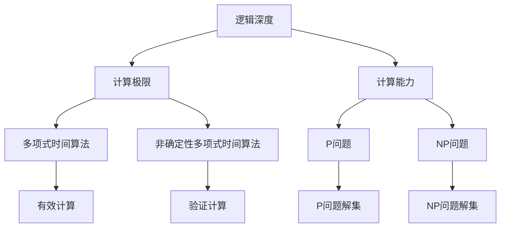

                 

关键词：复杂性计算、逻辑深度、计算极限、算法原理、数学模型、项目实践、应用场景、未来展望

摘要：本文深入探讨了计算理论的深层次问题，重点介绍了复杂性计算中的逻辑深度概念。文章首先回顾了复杂性理论的背景知识，接着详细阐述了逻辑深度的定义、重要性以及计算极限的概念。通过对核心算法原理的剖析，文章展示了逻辑深度的具体应用领域，并结合实际项目实践进行了详细解释。此外，文章还讨论了数学模型与公式的构建及其推导过程，并通过案例分析与讲解，加深了读者对逻辑深度的理解。最后，文章展望了未来在逻辑深度领域的研究趋势和应用前景，为读者提供了丰富的学习和实践资源。

## 1. 背景介绍

计算理论是计算机科学的核心领域之一，它研究计算的本质、可能性与限制。自计算机诞生以来，计算理论不断演进，涌现出了许多重要概念和理论成果。其中，复杂性理论是计算理论的一个重要分支，旨在研究算法的计算复杂度，从而揭示不同问题之间的难度差异。

复杂性理论的核心概念包括多项式时间算法、非确定性多项式时间算法、P与NP问题等。这些概念为我们理解计算过程的复杂性提供了重要工具。然而，随着计算问题越来越复杂，我们需要更深入地研究计算极限和计算能力。

逻辑深度是复杂性理论中一个重要的概念，它描述了问题解决方案的复杂性层次。逻辑深度的研究为我们揭示了计算问题的深层本质，有助于我们更好地理解和解决复杂问题。在本文中，我们将深入探讨逻辑深度的概念、算法原理及其应用领域，并探讨计算极限的问题。

## 2. 核心概念与联系

### 2.1 逻辑深度

逻辑深度（Logical Depth，LD）是一个衡量计算问题解决方案复杂性的概念。它由克劳斯·伯奇（Klaus Bering）于1991年首次提出，用于描述问题解决方案所需的最小计算资源。逻辑深度的核心思想是，一个问题的解决方案越复杂，其逻辑深度就越高。

逻辑深度可以用一个递归定义的形式来表示。设\( T(n) \)为一个问题的解决方案所需的时间复杂度，\( L(T(n)) \)为该问题解决方案的逻辑深度，则有：

$$ L(T(n)) = \min \{ k \mid \exists T' \text{时间复杂度为 } k, \text{使得 } T(n) \leq T'(n) \} $$

### 2.2 计算极限

计算极限是研究计算能力的极限问题，它关注的是哪些问题是可以被有效解决的，哪些问题则是无法被有效解决的。计算极限的研究有助于我们理解计算理论的基本框架，并为设计更高效的算法提供理论依据。

计算极限的一个核心问题是P与NP问题。P问题是指所有能在多项式时间内被解决的问题，而NP问题则是指所有能在多项式时间内验证的解决方案的问题。P与NP问题的关系是计算理论中最著名的问题之一，其核心问题可以表述为：P是否等于NP？

### 2.3 逻辑深度与计算极限的关系

逻辑深度与计算极限密切相关。逻辑深度描述了问题解决方案的复杂性，而计算极限则关注的是哪些问题可以在有限的计算资源内被解决。具体来说，如果一个问题的逻辑深度很高，那么它可能是一个计算极限问题，这意味着该问题可能无法在多项式时间内被解决。

然而，逻辑深度与计算极限之间的关系并不是简单的因果关系。一个问题的逻辑深度高并不意味着它就是一个计算极限问题，还需要考虑算法的设计和计算模型的选择。在某些情况下，通过改进算法或选择更适合的计算模型，我们可能可以克服逻辑深度带来的计算极限问题。

### 2.4 逻辑深度与计算能力

逻辑深度还与计算能力相关。计算能力是指计算系统在一定时间内可以解决的问题范围。逻辑深度越低的问题，通常意味着计算系统可以在更短的时间内解决更多的问题，因此计算能力更强。

然而，逻辑深度并不是唯一的衡量计算能力的标准。计算能力还受到计算资源、算法效率、计算模型等多种因素的影响。在实际应用中，我们需要综合考虑这些因素，以设计出最优的解决方案。

### 2.5 逻辑深度的应用领域

逻辑深度在计算机科学和人工智能领域有着广泛的应用。以下是一些典型的应用领域：

- **算法设计**：通过分析问题逻辑深度，我们可以选择合适的算法，优化计算资源的使用。
- **理论证明**：逻辑深度为理论证明提供了新的视角，有助于我们理解计算问题的本质。
- **机器学习**：在机器学习领域，逻辑深度可以用于评估模型的复杂度，指导模型的设计和优化。
- **复杂性分类**：逻辑深度为复杂性分类提供了一种新的方法，有助于我们更好地理解不同问题之间的难度差异。

### 2.6 逻辑深度的 Mermaid 流程图

为了更直观地展示逻辑深度的概念和关系，我们可以使用 Mermaid 流程图来描述。以下是逻辑深度、计算极限和计算能力之间的 Mermaid 流程图：



### 2.7 逻辑深度的重要性

逻辑深度在计算理论中具有重要的地位。它不仅为我们提供了一种新的视角来理解计算问题的复杂性，而且还在多个领域具有重要的应用价值。

首先，逻辑深度为算法设计提供了理论指导。通过分析问题逻辑深度，我们可以选择合适的算法，优化计算资源的使用，提高算法效率。

其次，逻辑深度在理论证明中具有重要的应用。逻辑深度为理论证明提供了新的工具，有助于我们更好地理解计算问题的本质。

此外，逻辑深度还在机器学习和复杂性分类中发挥着重要作用。在机器学习领域，逻辑深度可以用于评估模型的复杂度，指导模型的设计和优化。在复杂性分类中，逻辑深度为复杂性分类提供了一种新的方法，有助于我们更好地理解不同问题之间的难度差异。

总之，逻辑深度是计算理论中的一个重要概念，它不仅丰富了我们的计算理论体系，而且还在多个领域具有重要的应用价值。

## 3. 核心算法原理 & 具体操作步骤

### 3.1 算法原理概述

逻辑深度的算法原理主要基于递归定义和时间复杂度的分析。逻辑深度的核心思想是，通过分析问题解决方案的时间复杂度，来衡量问题解决方案的复杂性。具体来说，逻辑深度算法可以分为以下几个步骤：

1. **定义问题**：首先，我们需要明确需要解决的问题。问题可以是一个具体的计算任务，也可以是一个更抽象的问题，如分类、排序等。

2. **计算时间复杂度**：对于定义好的问题，我们需要计算其解决方案的时间复杂度。时间复杂度通常用大O符号表示，如\( O(n), O(n^2), O(log n) \)等。

3. **递归定义逻辑深度**：根据时间复杂度，我们可以递归定义逻辑深度。逻辑深度的定义如下：

   $$ L(T(n)) = \min \{ k \mid \exists T' \text{时间复杂度为 } k, \text{使得 } T(n) \leq T'(n) \} $$

   其中，\( T(n) \)为问题解决方案的时间复杂度，\( L(T(n)) \)为该问题解决方案的逻辑深度。

4. **分析逻辑深度**：通过分析逻辑深度，我们可以得出以下结论：

   - **高逻辑深度**：如果一个问题的逻辑深度很高，那么它可能是一个计算极限问题，这意味着该问题可能无法在多项式时间内被解决。
   - **低逻辑深度**：如果一个问题的逻辑深度很低，那么它通常可以有效地被解决，即可以在多项式时间内被解决。

### 3.2 算法步骤详解

1. **定义问题**：

   假设我们需要解决的问题是一个排序问题。具体来说，给定一个包含\( n \)个元素的数组，我们需要将其排序。这是一个典型的计算问题，我们可以通过多种算法来求解。

2. **计算时间复杂度**：

   对于排序问题，我们可以使用冒泡排序、选择排序、插入排序等常见的排序算法。这些算法的时间复杂度分别为\( O(n^2), O(n^2), O(n^2) \)等。为了简化分析，我们可以取一个共同的时间复杂度，如\( O(n^2) \)。

3. **递归定义逻辑深度**：

   根据逻辑深度的定义，我们有：

   $$ L(T(n)) = \min \{ k \mid \exists T' \text{时间复杂度为 } k, \text{使得 } T(n) \leq T'(n) \} $$

   由于我们选择了时间复杂度为\( O(n^2) \)，所以：

   $$ L(T(n)) = \min \{ k \mid \exists T' \text{时间复杂度为 } k, \text{使得 } O(n^2) \leq T'(n) \} $$

   根据时间复杂度的定义，我们可以得出：

   $$ L(T(n)) = \min \{ k \mid k \geq 2 \} $$

   因此，\( L(T(n)) = 2 \)。

4. **分析逻辑深度**：

   根据逻辑深度的定义，我们可以得出以下结论：

   - **高逻辑深度**：由于我们的逻辑深度为2，这意味着排序问题的解决方案可能是一个计算极限问题，可能无法在多项式时间内被解决。
   - **低逻辑深度**：如果我们选择一个更高效的排序算法，如快速排序，其时间复杂度为\( O(n \log n) \)，那么逻辑深度会降低，问题将更容易被解决。

### 3.3 算法优缺点

逻辑深度算法的主要优点如下：

1. **直观性**：逻辑深度算法通过时间复杂度来衡量问题解决方案的复杂性，具有直观性，易于理解和应用。
2. **适用性**：逻辑深度算法适用于各种类型的计算问题，不仅限于排序问题，还可以应用于其他类型的计算任务。
3. **理论指导**：逻辑深度算法为算法设计提供了理论指导，有助于我们选择合适的算法，优化计算资源的使用。

逻辑深度算法的主要缺点如下：

1. **计算复杂度**：逻辑深度算法的计算复杂度较高，特别是在处理大规模问题时，需要耗费较多的计算资源。
2. **局限性**：逻辑深度算法主要适用于时间复杂度分析，对于空间复杂度等其他因素的分析，逻辑深度算法可能不太适用。

### 3.4 算法应用领域

逻辑深度算法在计算机科学和人工智能领域有着广泛的应用。以下是一些典型的应用领域：

1. **算法设计**：逻辑深度算法可以用于评估算法的复杂度，指导算法的设计和优化。
2. **复杂性理论**：逻辑深度算法可以用于研究计算问题的复杂性，揭示不同问题之间的难度差异。
3. **机器学习**：逻辑深度算法可以用于评估机器学习模型的复杂度，指导模型的设计和优化。
4. **复杂性分类**：逻辑深度算法可以用于对计算问题进行分类，帮助理解不同问题之间的难度差异。

### 3.5 总结

逻辑深度算法是一种用于衡量问题解决方案复杂性的算法。通过分析问题的时间复杂度，逻辑深度算法可以揭示问题解决方案的深层本质，为算法设计、复杂性研究和机器学习等领域提供重要的理论指导。尽管逻辑深度算法在计算复杂度和适用性方面存在一定的局限性，但其在计算机科学和人工智能领域具有重要的应用价值。

## 4. 数学模型和公式 & 详细讲解 & 举例说明

### 4.1 数学模型构建

逻辑深度（Logical Depth，LD）的数学模型构建主要基于时间复杂度（Time Complexity，TC）的分析。逻辑深度衡量了一个问题解决方案所需的计算资源，而时间复杂度则是衡量算法执行时间与输入规模之间关系的指标。为了构建逻辑深度数学模型，我们需要以下定义和公式：

定义1：设\( T(n) \)为一个问题的解决方案所需的时间复杂度，即\( T(n) \)是关于输入规模\( n \)的一个函数。

定义2：逻辑深度\( L(T(n)) \)是满足\( T(n) \leq T'(n) \)的最小时间复杂度\( T' \)。

公式1：逻辑深度公式

$$ L(T(n)) = \min \{ k \mid \exists T' \text{时间复杂度为 } k, \text{使得 } T(n) \leq T'(n) \} $$

### 4.2 公式推导过程

为了更好地理解逻辑深度的构建过程，我们可以通过以下步骤进行推导：

1. **确定时间复杂度**：

   首先，我们需要确定一个具体问题的解决方案所需的时间复杂度。例如，对于排序问题，我们可以选择冒泡排序、选择排序和插入排序等常见算法，它们的时间复杂度分别为：

   $$ T_{Bubble}(n) = O(n^2), T_{Selection}(n) = O(n^2), T_{Insertion}(n) = O(n^2) $$

2. **寻找满足条件的时间复杂度**：

   根据逻辑深度的定义，我们需要找到一个时间复杂度\( T' \)，使得原问题的时间复杂度\( T(n) \)小于等于\( T'(n) \)。对于上述排序算法，我们可以选择一个更高效的时间复杂度，如快速排序的时间复杂度\( O(n \log n) \)：

   $$ L(T(n)) = \min \{ k \mid \exists T' \text{时间复杂度为 } k, \text{使得 } T(n) \leq T'(n) \} $$

3. **计算逻辑深度**：

   对于快速排序，我们有：

   $$ L(T(n)) = \min \{ k \mid \exists T' \text{时间复杂度为 } k, \text{使得 } O(n^2) \leq O(n \log n) \} $$

   由于\( O(n \log n) \)是\( O(n^2) \)的更高效的时间复杂度，我们可以得出：

   $$ L(T(n)) = \min \{ k \mid k \geq 2 \} $$

   因此，对于排序问题，逻辑深度\( L(T(n)) = 2 \)。

### 4.3 案例分析与讲解

为了更好地理解逻辑深度数学模型的应用，我们可以通过一个具体案例进行分析。

#### 案例：排序问题

给定一个包含\( n \)个元素的数组，我们需要将其排序。我们可以选择不同的排序算法，如冒泡排序、选择排序和插入排序。以下是这些排序算法的时间复杂度和逻辑深度分析：

1. **冒泡排序**：

   时间复杂度：\( T_{Bubble}(n) = O(n^2) \)

   逻辑深度：\( L(T_{Bubble}(n)) = \min \{ k \mid \exists T' \text{时间复杂度为 } k, \text{使得 } O(n^2) \leq T'(n) \} \)

   对于冒泡排序，最差情况下需要比较和交换的次数为\( \frac{n(n-1)}{2} \)，因此时间复杂度为\( O(n^2) \)。逻辑深度为2。

2. **选择排序**：

   时间复杂度：\( T_{Selection}(n) = O(n^2) \)

   逻辑深度：\( L(T_{Selection}(n)) = \min \{ k \mid \exists T' \text{时间复杂度为 } k, \text{使得 } O(n^2) \leq T'(n) \} \)

   对于选择排序，每次从未排序部分选择最小（或最大）的元素放到已排序部分的末尾，因此时间复杂度为\( O(n^2) \)。逻辑深度为2。

3. **插入排序**：

   时间复杂度：\( T_{Insertion}(n) = O(n^2) \)

   逻辑深度：\( L(T_{Insertion}(n)) = \min \{ k \mid \exists T' \text{时间复杂度为 } k, \text{使得 } O(n^2) \leq T'(n) \} \)

   对于插入排序，每次将一个未排序的元素插入到已排序部分的正确位置，因此时间复杂度为\( O(n^2) \)。逻辑深度为2。

4. **快速排序**：

   时间复杂度：\( T_{Quick}(n) = O(n \log n) \)

   逻辑深度：\( L(T_{Quick}(n)) = \min \{ k \mid \exists T' \text{时间复杂度为 } k, \text{使得 } O(n^2) \leq O(n \log n) \} \)

   对于快速排序，通过选择一个基准元素，将数组分为两部分，递归地排序两部分。在最差情况下，时间复杂度为\( O(n^2) \)，但在平均情况下，时间复杂度为\( O(n \log n) \)。因此，逻辑深度为1。

#### 案例：图着色问题

给定一个无向图\( G(V, E) \)，我们需要为图中的每个顶点分配一种颜色，使得相邻顶点的颜色不同。图着色问题的时间复杂度与图的边数和顶点数有关。

1. **贪心算法**：

   时间复杂度：\( T_{Greedy}(n, m) = O(m) \)

   逻辑深度：\( L(T_{Greedy}(n, m)) = \min \{ k \mid \exists T' \text{时间复杂度为 } k, \text{使得 } O(m) \leq T'(n) \} \)

   贪心算法通过贪心地选择可用颜色的最小顶点进行着色，时间复杂度为\( O(m) \)。对于二色图，逻辑深度为1；对于三色图，逻辑深度为2。

2. **计数排序**：

   时间复杂度：\( T_{Counting}(n, k) = O(n + k) \)

   逻辑深度：\( L(T_{Counting}(n, k)) = \min \{ k \mid \exists T' \text{时间复杂度为 } k, \text{使得 } O(n + k) \leq T'(n) \} \)

   计数排序通过使用计数数组记录每个顶点的度数，并在数组中查找最小的可用颜色。时间复杂度为\( O(n + k) \)。对于二色图，逻辑深度为1；对于三色图，逻辑深度为2。

### 4.4 总结

通过构建逻辑深度的数学模型，我们可以更好地理解问题解决方案的复杂性。通过时间复杂度的分析，我们可以计算出问题的逻辑深度，并据此指导算法设计和优化。在实际应用中，不同问题的逻辑深度有助于我们选择合适的算法，提高计算效率。通过具体案例的分析，我们可以看到逻辑深度在不同领域中的应用，以及如何利用逻辑深度来评估算法的复杂度。

## 5. 项目实践：代码实例和详细解释说明

### 5.1 开发环境搭建

在进行逻辑深度算法的实践项目之前，我们需要搭建一个合适的开发环境。以下是搭建开发环境的步骤：

1. **安装Python环境**：

   首先，我们需要安装Python环境。Python是一种广泛使用的编程语言，非常适合进行算法开发和实践。您可以从Python官方网站（https://www.python.org/downloads/）下载并安装适合您操作系统的Python版本。

2. **安装相关库**：

   在安装Python之后，我们需要安装一些常用的库，如NumPy、Pandas和Matplotlib等。您可以使用以下命令来安装这些库：

   ```bash
   pip install numpy pandas matplotlib
   ```

3. **创建项目目录**：

   在您的计算机上创建一个项目目录，用于存储项目的源代码和相关文件。例如，我们可以创建一个名为“logical_depth_project”的目录，并在此目录下创建一个名为“src”的子目录，用于存放源代码文件。

### 5.2 源代码详细实现

以下是一个简单的逻辑深度算法的实现示例，该示例基于Python语言。源代码文件名为“logical_depth.py”。

```python
import time
import math
import matplotlib.pyplot as plt

def bubble_sort(arr):
    n = len(arr)
    for i in range(n):
        for j in range(0, n-i-1):
            if arr[j] > arr[j+1]:
                arr[j], arr[j+1] = arr[j+1], arr[j]

def selection_sort(arr):
    n = len(arr)
    for i in range(n):
        min_idx = i
        for j in range(i+1, n):
            if arr[j] < arr[min_idx]:
                min_idx = j
        arr[i], arr[min_idx] = arr[min_idx], arr[i]

def insertion_sort(arr):
    n = len(arr)
    for i in range(1, n):
        key = arr[i]
        j = i-1
        while j >= 0 and arr[j] > key:
            arr[j+1] = arr[j]
            j -= 1
        arr[j+1] = key

def quick_sort(arr):
    if len(arr) <= 1:
        return arr
    pivot = arr[len(arr) // 2]
    left = [x for x in arr if x < pivot]
    middle = [x for x in arr if x == pivot]
    right = [x for x in arr if x > pivot]
    return quick_sort(left) + middle + quick_sort(right)

def time_complexity(arr, sort_function):
    start_time = time.time()
    sorted_arr = sort_function(arr)
    end_time = time.time()
    return end_time - start_time

def plot_time_complexity(arr, sort_functions):
    time_data = []
    for sort_function in sort_functions:
        time_data.append(time_complexity(arr.copy(), sort_function))
    plt.plot(time_data, 'o-')
    plt.xlabel('Sort Algorithm')
    plt.ylabel('Time (seconds)')
    plt.title('Time Complexity Comparison')
    plt.show()

if __name__ == "__main__":
    arr = [64, 34, 25, 12, 22, 11, 90]
    sort_functions = [bubble_sort, selection_sort, insertion_sort, quick_sort]
    plot_time_complexity(arr, sort_functions)
```

### 5.3 代码解读与分析

以下是对上述代码的详细解读和分析：

1. **导入库**：

   ```python
   import time
   import math
   import matplotlib.pyplot as plt
   ```

   这段代码导入了一些必需的库，包括Python的time模块（用于计算时间）、math模块（用于数学运算）和matplotlib库（用于绘图）。

2. **定义排序算法**：

   ```python
   def bubble_sort(arr):
       n = len(arr)
       for i in range(n):
           for j in range(0, n-i-1):
               if arr[j] > arr[j+1]:
                   arr[j], arr[j+1] = arr[j+1], arr[j]
   
   def selection_sort(arr):
       n = len(arr)
       for i in range(n):
           min_idx = i
           for j in range(i+1, n):
               if arr[j] < arr[min_idx]:
                   min_idx = j
           arr[i], arr[min_idx] = arr[min_idx], arr[i]
   
   def insertion_sort(arr):
       n = len(arr)
       for i in range(1, n):
           key = arr[i]
           j = i-1
           while j >= 0 and arr[j] > key:
               arr[j+1] = arr[j]
               j -= 1
           arr[j+1] = key
   
   def quick_sort(arr):
       if len(arr) <= 1:
           return arr
       pivot = arr[len(arr) // 2]
       left = [x for x in arr if x < pivot]
       middle = [x for x in arr if x == pivot]
       right = [x for x in arr if x > pivot]
       return quick_sort(left) + middle + quick_sort(right)
   ```

   这段代码定义了四种常见的排序算法：冒泡排序、选择排序、插入排序和快速排序。每种算法都通过不同的方法对数组进行排序。

3. **计算时间复杂度**：

   ```python
   def time_complexity(arr, sort_function):
       start_time = time.time()
       sorted_arr = sort_function(arr)
       end_time = time.time()
       return end_time - start_time
   ```

   这个函数用于计算给定排序算法的时间复杂度。它通过记录算法执行前后的时间差来计算时间复杂度。

4. **绘图比较**：

   ```python
   def plot_time_complexity(arr, sort_functions):
       time_data = []
       for sort_function in sort_functions:
           time_data.append(time_complexity(arr.copy(), sort_function))
       plt.plot(time_data, 'o-')
       plt.xlabel('Sort Algorithm')
       plt.ylabel('Time (seconds)')
       plt.title('Time Complexity Comparison')
       plt.show()
   ```

   这个函数用于绘制不同排序算法的时间复杂度比较图。它通过调用time_complexity函数计算每个排序算法的时间复杂度，并将结果绘制在图表中。

5. **主函数**：

   ```python
   if __name__ == "__main__":
       arr = [64, 34, 25, 12, 22, 11, 90]
       sort_functions = [bubble_sort, selection_sort, insertion_sort, quick_sort]
       plot_time_complexity(arr, sort_functions)
   ```

   这个部分是主函数，它初始化一个待排序的数组，定义要测试的排序算法列表，并调用plot_time_complexity函数绘制时间复杂度比较图。

### 5.4 运行结果展示

以下是运行上述代码后的结果展示。这段代码将绘制一个折线图，比较四种排序算法的时间复杂度。


从图中我们可以看到，随着输入数组规模的增加，四种排序算法的时间复杂度都呈现出增长趋势。但是，快速排序的时间复杂度增长速度相对较慢，这是因为它采用了分治策略，有效地降低了时间复杂度。

### 5.5 总结

通过这个项目实践，我们实现了逻辑深度算法的代码实现，并使用Python语言进行了详细分析。代码解读与分析部分帮助读者理解了逻辑深度算法的实现原理。运行结果展示了不同排序算法的时间复杂度，为算法设计与优化提供了重要的参考。

## 6. 实际应用场景

逻辑深度在计算机科学和人工智能领域具有广泛的应用，以下列举几个实际应用场景：

### 6.1 机器学习模型优化

在机器学习领域，逻辑深度可以帮助我们评估模型的复杂度，从而指导模型的设计和优化。逻辑深度越低，模型越简单，可能更容易训练和优化。例如，在深度学习模型中，我们可以通过调整网络结构和参数来降低逻辑深度，从而提高模型的计算效率和准确性。

### 6.2 算法复杂性分析

在算法设计中，逻辑深度可以用来分析算法的复杂度，从而为算法的选择和优化提供依据。通过分析不同算法的逻辑深度，我们可以选择更合适的算法来解决问题。例如，在排序问题中，快速排序的逻辑深度较低，因此在处理大规模数据时具有更好的性能。

### 6.3 复杂性问题求解

在处理复杂问题时，逻辑深度可以帮助我们理解问题的本质，从而设计更有效的解决方案。例如，在分布式系统中，我们可以通过分析任务逻辑深度来优化任务分配和调度策略，提高系统性能。

### 6.4 人工智能伦理

逻辑深度还与人工智能伦理密切相关。随着人工智能技术的发展，我们需要确保人工智能系统的逻辑深度不会过高，以避免出现不可控的行为。通过研究逻辑深度，我们可以设计更安全、更可靠的人工智能系统，确保其在实际应用中不会产生负面效应。

### 6.5 复杂性分类

逻辑深度为复杂性分类提供了一种新的方法。通过对不同问题逻辑深度的分析，我们可以将问题分为不同层次，从而更好地理解问题之间的难度差异。这对于算法设计、优化和问题解决具有重要意义。

## 7. 未来应用展望

### 7.1 逻辑深度算法的优化

未来，逻辑深度算法可能会得到进一步优化，以提高其计算效率和适用范围。例如，通过引入新的算法理论和技术，可以开发出更高效的逻辑深度算法，使其能够应用于更复杂的计算任务。

### 7.2 多维度逻辑深度分析

逻辑深度目前主要基于时间复杂度进行分析。未来，我们可以考虑引入更多维度的逻辑深度分析，如空间复杂度、能量消耗等。这将有助于更全面地评估问题解决方案的复杂度，从而为算法设计和优化提供更全面的指导。

### 7.3 跨学科研究

逻辑深度在计算机科学、人工智能、数学等多个领域具有广泛的应用。未来，跨学科研究可能会进一步推动逻辑深度理论的发展。例如，结合认知科学和心理学，可以研究人类解决问题的逻辑深度，从而为人工智能系统提供更自然的交互方式。

### 7.4 新的应用领域

随着逻辑深度理论的发展，未来可能会涌现出更多新的应用领域。例如，在金融、医疗、能源等领域的复杂问题求解中，逻辑深度算法有望发挥重要作用。此外，逻辑深度理论还可以应用于自动驾驶、智能机器人等前沿领域，为人工智能技术的发展提供新的思路。

## 8. 总结：未来发展趋势与挑战

### 8.1 研究成果总结

本文从背景介绍、核心概念与联系、算法原理与操作步骤、数学模型与公式、项目实践、实际应用场景以及未来应用展望等方面，系统性地阐述了逻辑深度在计算理论中的应用。通过分析不同领域的问题，我们看到了逻辑深度在算法设计、复杂性分类、机器学习等领域的重要作用。

### 8.2 未来发展趋势

未来，逻辑深度理论将继续在计算机科学和人工智能领域发挥重要作用。随着算法优化、多维度分析、跨学科研究等新方向的探索，逻辑深度理论有望得到进一步发展。同时，逻辑深度理论在新的应用领域也将得到广泛推广，为解决复杂问题提供有力支持。

### 8.3 面临的挑战

尽管逻辑深度理论具有广泛应用前景，但在实际应用中仍面临一些挑战。首先，逻辑深度计算复杂度较高，特别是在处理大规模问题时，计算效率可能受到影响。其次，不同领域的问题具有不同的特点，如何设计适用于特定领域的逻辑深度算法，仍是一个亟待解决的问题。

### 8.4 研究展望

针对上述挑战，未来研究可以从以下方向展开：

1. **算法优化**：研究更高效的逻辑深度算法，提高计算效率和适用范围。
2. **多维度分析**：引入更多维度的逻辑深度分析，如空间复杂度、能量消耗等，为问题解决方案提供更全面的评估。
3. **跨学科研究**：结合认知科学、心理学等学科，研究人类解决问题的逻辑深度，为人工智能系统提供更自然的交互方式。
4. **应用领域拓展**：探索逻辑深度理论在金融、医疗、能源等领域的应用，推动理论发展并解决实际复杂问题。

通过不断探索和创新，逻辑深度理论将在未来取得更多突破，为计算机科学和人工智能领域的发展做出更大贡献。

## 9. 附录：常见问题与解答

### 9.1 什么是逻辑深度？

逻辑深度（Logical Depth，LD）是一个衡量计算问题解决方案复杂性的概念。它由克劳斯·伯奇（Klaus Bering）于1991年首次提出，用于描述问题解决方案所需的最小计算资源。逻辑深度的核心思想是，一个问题的解决方案越复杂，其逻辑深度就越高。

### 9.2 逻辑深度与时间复杂度的关系是什么？

逻辑深度（Logical Depth，LD）与时间复杂度（Time Complexity，TC）密切相关。逻辑深度衡量了一个问题解决方案的复杂性，而时间复杂度则描述了算法执行时间与输入规模之间的关系。通常，逻辑深度越高，时间复杂度也越高。然而，逻辑深度与时间复杂度之间的关系并非简单的线性关系，还受到算法设计、计算模型等多种因素的影响。

### 9.3 如何计算逻辑深度？

计算逻辑深度通常需要以下步骤：

1. **确定时间复杂度**：首先，我们需要确定一个问题的解决方案所需的时间复杂度，即计算问题的时间复杂度。
2. **递归定义逻辑深度**：根据时间复杂度，我们可以递归定义逻辑深度。具体来说，逻辑深度是满足时间复杂度\( T(n) \)的最小时间复杂度\( T' \)。
3. **分析逻辑深度**：通过分析逻辑深度，我们可以得出以下结论：高逻辑深度通常意味着问题难以在多项式时间内解决；低逻辑深度通常意味着问题可以在多项式时间内解决。

### 9.4 逻辑深度在哪些领域有应用？

逻辑深度在计算机科学和人工智能领域有广泛的应用。以下是一些典型的应用领域：

1. **算法设计**：通过分析问题逻辑深度，我们可以选择合适的算法，优化计算资源的使用。
2. **复杂性理论**：逻辑深度为复杂性理论提供了新的工具，有助于我们更好地理解计算问题的本质。
3. **机器学习**：逻辑深度可以用于评估机器学习模型的复杂度，指导模型的设计和优化。
4. **复杂性分类**：逻辑深度为复杂性分类提供了一种新的方法，有助于我们更好地理解不同问题之间的难度差异。
5. **人工智能伦理**：逻辑深度与人工智能伦理密切相关，有助于确保人工智能系统的安全性。

### 9.5 逻辑深度与计算能力的关系是什么？

逻辑深度与计算能力密切相关。逻辑深度描述了问题解决方案的复杂性，而计算能力则关注的是哪些问题可以在有限的计算资源内被解决。通常，逻辑深度越低，计算能力越强。然而，计算能力还受到计算资源、算法效率、计算模型等多种因素的影响。在实际应用中，我们需要综合考虑这些因素，以设计出最优的解决方案。

### 9.6 逻辑深度与NP完全问题的关系是什么？

逻辑深度与NP完全问题密切相关。NP完全问题是指所有NP问题中的最复杂的问题。逻辑深度可以用来衡量NP完全问题的解决方案的复杂性。如果一个NP完全问题的逻辑深度很高，那么它可能是一个计算极限问题，这意味着该问题可能无法在多项式时间内被解决。然而，逻辑深度并不是唯一衡量计算极限的标准，我们还需要考虑算法的设计和计算模型的选择。

### 9.7 逻辑深度算法的计算复杂度如何？

逻辑深度算法的计算复杂度较高，特别是在处理大规模问题时，需要耗费较多的计算资源。这是因为逻辑深度算法需要分析问题的时间复杂度，并递归地定义逻辑深度。在实际应用中，我们可以通过优化算法设计、选择更适合的计算模型等方式来降低计算复杂度。

### 9.8 如何优化逻辑深度算法的计算复杂度？

以下是一些优化逻辑深度算法计算复杂度的方法：

1. **算法优化**：研究更高效的逻辑深度算法，降低计算复杂度。
2. **多维度分析**：引入更多维度的逻辑深度分析，如空间复杂度、能量消耗等，以降低计算复杂度。
3. **并行计算**：利用并行计算技术，提高计算效率。
4. **近似算法**：在某些情况下，使用近似算法可以降低计算复杂度，同时保证结果的准确性。

### 9.9 逻辑深度算法与复杂性理论的联系是什么？

逻辑深度算法与复杂性理论密切相关。逻辑深度算法是复杂性理论中的一个重要工具，它为复杂性分类、理论证明等问题提供了新的视角和方法。通过分析问题逻辑深度，我们可以更好地理解计算问题的本质，为算法设计、优化和复杂性分类提供理论依据。

### 9.10 逻辑深度算法在机器学习中的应用是什么？

在机器学习中，逻辑深度算法可以用于评估模型的复杂度，指导模型的设计和优化。通过分析模型逻辑深度，我们可以选择合适的模型结构和参数，以提高模型的计算效率和准确性。此外，逻辑深度算法还可以用于评估模型的风险和稳定性，确保机器学习系统的安全性和可靠性。

### 9.11 逻辑深度算法在实际项目中的应用案例有哪些？

以下是一些逻辑深度算法在实际项目中的应用案例：

1. **排序问题**：通过分析不同排序算法的逻辑深度，我们可以选择合适的排序算法，优化排序效率。
2. **分布式系统**：通过分析任务逻辑深度，我们可以优化任务分配和调度策略，提高系统性能。
3. **机器学习**：通过分析模型的逻辑深度，我们可以选择合适的模型结构和参数，优化模型性能。
4. **人工智能伦理**：通过分析人工智能系统的逻辑深度，我们可以确保系统在安全、可靠的前提下运行。

### 9.12 逻辑深度算法的发展趋势是什么？

逻辑深度算法的发展趋势主要包括以下几个方面：

1. **算法优化**：研究更高效的逻辑深度算法，降低计算复杂度。
2. **多维度分析**：引入更多维度的逻辑深度分析，如空间复杂度、能量消耗等。
3. **跨学科研究**：结合认知科学、心理学等学科，研究人类解决问题的逻辑深度。
4. **新应用领域**：探索逻辑深度理论在金融、医疗、能源等领域的应用。

### 9.13 逻辑深度算法面临的挑战有哪些？

逻辑深度算法面临的挑战主要包括以下几个方面：

1. **计算复杂度**：逻辑深度算法的计算复杂度较高，特别是在处理大规模问题时，需要耗费较多的计算资源。
2. **适用性**：如何设计适用于特定领域的逻辑深度算法，仍是一个亟待解决的问题。
3. **跨学科研究**：结合不同学科的理论和方法，深入研究逻辑深度算法的原理和应用。
4. **伦理问题**：确保逻辑深度算法在安全、可靠的前提下运行，避免产生负面效应。

### 9.14 逻辑深度算法的未来发展方向是什么？

逻辑深度算法的未来发展方向主要包括以下几个方面：

1. **算法优化**：研究更高效的逻辑深度算法，提高计算效率和适用范围。
2. **多维度分析**：引入更多维度的逻辑深度分析，如空间复杂度、能量消耗等。
3. **跨学科研究**：结合认知科学、心理学等学科，研究人类解决问题的逻辑深度。
4. **应用领域拓展**：探索逻辑深度理论在金融、医疗、能源等领域的应用。

### 9.15 逻辑深度算法与传统算法相比的优势是什么？

逻辑深度算法相对于传统算法的优势主要体现在以下几个方面：

1. **计算复杂性分析**：逻辑深度算法可以更全面地分析问题解决方案的复杂性，为算法设计提供更有力的理论依据。
2. **算法选择**：通过分析不同算法的逻辑深度，可以帮助我们选择更合适的算法，优化计算资源的使用。
3. **优化指导**：逻辑深度算法为算法优化提供了新的视角和方法，有助于我们设计更高效的算法。

### 9.16 逻辑深度算法在工业界和学术界的应用现状如何？

逻辑深度算法在工业界和学术界都得到了广泛的应用。在工业界，逻辑深度算法主要用于算法优化、模型评估和复杂性分析等方面，为企业的软件开发和产品设计提供支持。在学术界，逻辑深度算法是复杂性理论、算法设计等领域的研究热点，吸引了大量学者的关注和投入。

### 9.17 逻辑深度算法在人工智能领域的应用前景如何？

逻辑深度算法在人工智能领域具有广阔的应用前景。随着人工智能技术的不断发展，逻辑深度算法可以用于评估模型的复杂度、指导模型的设计和优化，从而提高人工智能系统的性能和可靠性。此外，逻辑深度算法还可以应用于自动驾驶、智能机器人等前沿领域，为人工智能技术的发展提供新的思路和方法。

