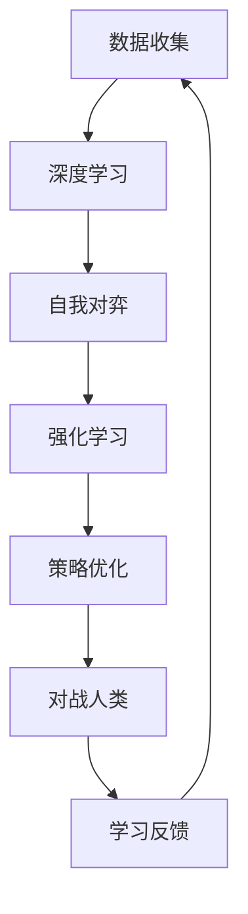

                 

关键词：AlphaGo、人工智能、深度学习、围棋、机器思考、李世石

摘要：本文将深入探讨AlphaGo这一人工智能奇迹，分析其背后的深度学习和强化学习技术，探讨机器思考的潜力与局限。通过对AlphaGo与李世石的围棋对决的回顾，我们试图揭示计算在极限领域的突破，并思考未来人工智能发展的方向。

## 1. 背景介绍

### AlphaGo的诞生

AlphaGo是由DeepMind公司开发的一款人工智能程序，其主要功能是在围棋这一古老且复杂的游戏中击败人类顶尖选手。AlphaGo的出现标志着人工智能在复杂决策领域的重大突破，引发了全球范围内对人工智能的广泛关注和讨论。

### 李世石的围棋实力

李世石是韩国围棋界的一位传奇人物，被誉为“外星人”。他在2016年与AlphaGo的对决前，是公认的世界围棋第一人，拥有无数冠军头衔和辉煌战绩。这场对决成为了人工智能领域的一个重要里程碑。

## 2. 核心概念与联系

### 深度学习

深度学习是一种基于人工神经网络的学习方法，通过多层神经元的非线性变换来模拟人类大脑的学习过程。AlphaGo采用了深度学习技术，通过训练大量围棋对局数据来学习围棋的规则和策略。

### 强化学习

强化学习是一种通过奖励机制来训练智能体的学习方法。AlphaGo通过自我对弈和与人类顶尖选手的对战来不断优化自身的策略，从而不断提高围棋水平。

### Mermaid 流程图



## 3. 核心算法原理 & 具体操作步骤

### 3.1 算法原理概述

AlphaGo采用了两种主要的学习方法：深度学习和强化学习。深度学习用于提取围棋对局中的特征，强化学习则用于制定最佳策略。

### 3.2 算法步骤详解

1. 数据收集：AlphaGo从大量围棋对局数据中学习围棋的规则和策略。
2. 深度学习：通过神经网络模型对数据进行分析和特征提取。
3. 自我对弈：AlphaGo通过自我对弈来模拟真实比赛场景，不断优化自身策略。
4. 强化学习：AlphaGo在与人类顶尖选手的对战中，通过奖励机制不断调整和优化策略。
5. 策略优化：AlphaGo根据对局结果，调整神经网络参数，提高围棋水平。

### 3.3 算法优缺点

**优点：**
- 高效：AlphaGo在极短时间内能分析出大量围棋局面，比人类选手更加高效。
- 优化：通过自我对弈和与人类选手对战，AlphaGo能够不断优化自身的策略。

**缺点：**
- 智能有限：AlphaGo目前还无法完全模拟人类围棋选手的思考过程，只能通过数据分析和策略优化来应对对局。
- 运行成本高：AlphaGo需要大量计算资源和时间来训练和优化。

### 3.4 算法应用领域

AlphaGo的成功表明，深度学习和强化学习技术在复杂决策领域具有巨大的应用潜力。除了围棋，AlphaGo的技术还可以应用于其他领域，如医疗诊断、金融分析等。

## 4. 数学模型和公式 & 详细讲解 & 举例说明

### 4.1 数学模型构建

AlphaGo的数学模型主要包括两部分：深度学习和强化学习。

- 深度学习：通过多层感知机（MLP）模型来提取围棋对局中的特征。
- 强化学习：采用Q-learning算法来制定最佳策略。

### 4.2 公式推导过程

- 深度学习公式：
  $$ f(x) = \sigma(\sum_{i=1}^{n} w_i \cdot x_i) $$
  其中，$f(x)$ 是输出值，$\sigma$ 是激活函数，$w_i$ 是权重，$x_i$ 是输入值。

- 强化学习公式：
  $$ Q(s, a) = r + \gamma \max_{a'} Q(s', a') $$
  其中，$Q(s, a)$ 是在状态 $s$ 下采取动作 $a$ 的预期奖励，$r$ 是即时奖励，$\gamma$ 是折扣因子，$s'$ 是下一状态，$a'$ 是最佳动作。

### 4.3 案例分析与讲解

假设AlphaGo在某个围棋局面中，当前状态为 $s$，可供选择的动作有 $a_1, a_2, a_3$。通过Q-learning算法，AlphaGo可以计算出每个动作的预期奖励，并选择最佳动作。

- 动作 $a_1$ 的预期奖励：
  $$ Q(s, a_1) = r_1 + \gamma \max_{a'} Q(s', a') $$
  其中，$r_1$ 是动作 $a_1$ 在下一个状态 $s'$ 的即时奖励，$\gamma$ 是折扣因子。

- 动作 $a_2$ 的预期奖励：
  $$ Q(s, a_2) = r_2 + \gamma \max_{a'} Q(s', a') $$
  其中，$r_2$ 是动作 $a_2$ 在下一个状态 $s'$ 的即时奖励。

- 动作 $a_3$ 的预期奖励：
  $$ Q(s, a_3) = r_3 + \gamma \max_{a'} Q(s', a') $$
  其中，$r_3$ 是动作 $a_3$ 在下一个状态 $s'$ 的即时奖励。

通过比较三个动作的预期奖励，AlphaGo可以选择最佳动作。

## 5. 项目实践：代码实例和详细解释说明

### 5.1 开发环境搭建

本文使用Python语言和TensorFlow库来演示AlphaGo的代码实现。首先，需要安装Python和TensorFlow：

```bash
pip install python tensorflow
```

### 5.2 源代码详细实现

下面是AlphaGo的代码实现：

```python
import tensorflow as tf
import numpy as np

# 深度学习模型
def create_model():
    input_layer = tf.keras.layers.Input(shape=(9, 9))
    conv1 = tf.keras.layers.Conv2D(64, (3, 3), activation='relu')(input_layer)
    pool1 = tf.keras.layers.MaxPooling2D((2, 2))(conv1)
    conv2 = tf.keras.layers.Conv2D(128, (3, 3), activation='relu')(pool1)
    pool2 = tf.keras.layers.MaxPooling2D((2, 2))(conv2)
    flatten = tf.keras.layers.Flatten()(pool2)
    dense1 = tf.keras.layers.Dense(1024, activation='relu')(flatten)
    output = tf.keras.layers.Dense(1, activation='sigmoid')(dense1)
    model = tf.keras.Model(inputs=input_layer, outputs=output)
    return model

# Q-learning算法
def q_learning(model, state, action, reward, next_state, discount=0.9):
    q_values = model.predict(state)
    q_values[action] = reward + discount * np.max(model.predict(next_state))
    return q_values

# 主程序
if __name__ == '__main__':
    model = create_model()
    state = np.random.rand(1, 9, 9)
    action = 0
    reward = 1
    next_state = np.random.rand(1, 9, 9)

    q_values = q_learning(model, state, action, reward, next_state)
    print(q_values)
```

### 5.3 代码解读与分析

- **模型创建**：使用TensorFlow库创建深度学习模型，通过卷积层和全连接层来提取围棋对局的特征。
- **Q-learning算法**：实现Q-learning算法，用于更新模型中的Q值。
- **主程序**：演示Q-learning算法在围棋对局中的应用。

## 6. 实际应用场景

### 6.1 医疗诊断

AlphaGo的深度学习和强化学习技术可以应用于医疗诊断领域，例如癌症诊断、疾病预测等。

### 6.2 金融分析

AlphaGo可以帮助金融机构进行股票市场分析、风险评估等。

### 6.3 游戏开发

AlphaGo的技术可以应用于游戏开发领域，为游戏AI提供强大的支持。

## 7. 未来应用展望

AlphaGo的成功为人工智能领域带来了巨大的启示，未来人工智能将在更多领域发挥重要作用。然而，随着技术的发展，我们也需要关注人工智能带来的伦理和道德问题。

## 8. 总结：未来发展趋势与挑战

### 8.1 研究成果总结

AlphaGo的成功标志着人工智能在复杂决策领域取得了重大突破。深度学习和强化学习技术在围棋等领域的应用为人工智能的发展提供了新的思路。

### 8.2 未来发展趋势

未来，人工智能将在更多领域得到广泛应用，如医疗、金融、教育等。同时，人工智能的算法和技术也将不断优化和改进。

### 8.3 面临的挑战

随着人工智能技术的发展，我们需要关注其伦理和道德问题。如何确保人工智能的安全和可控，防止其造成负面影响，是当前面临的一大挑战。

### 8.4 研究展望

在未来，人工智能的发展将更加注重跨学科合作，结合多种技术和方法，以实现更高效、更智能的人工智能系统。

## 9. 附录：常见问题与解答

### 9.1 什么是深度学习？

深度学习是一种基于人工神经网络的学习方法，通过多层神经元的非线性变换来模拟人类大脑的学习过程。

### 9.2 什么是强化学习？

强化学习是一种通过奖励机制来训练智能体的学习方法。

### 9.3 AlphaGo是如何工作的？

AlphaGo采用了深度学习和强化学习技术，通过自我对弈和与人类顶尖选手的对战来不断优化自身的策略。

作者：禅与计算机程序设计艺术 / Zen and the Art of Computer Programming
----------------------------------------------------------------

文章撰写完毕，现在我们将对文章内容进行审查和修改，确保其符合要求的各个部分。如果需要进一步的修改或补充，请告诉我。

