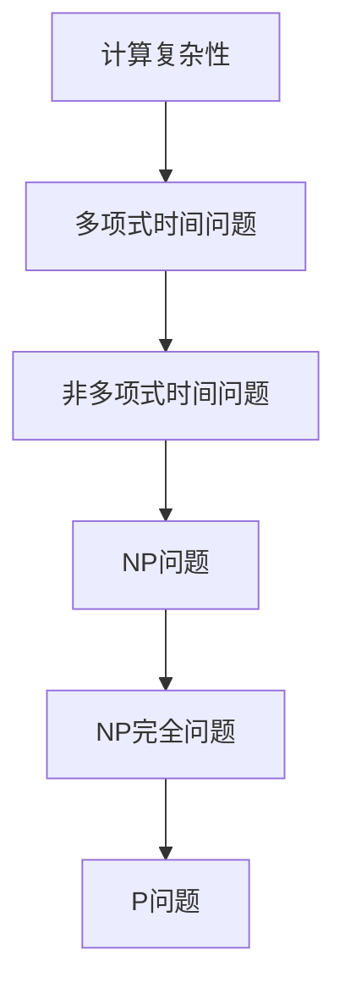

                 

关键词：计算复杂性、NP完全问题、算法原理、数学模型、实际应用、未来展望

> 摘要：本文旨在深入探讨计算复杂性理论中的NP完全问题，从背景介绍、核心概念、算法原理、数学模型、实际应用和未来展望等方面，全面解析这一重要课题。通过本文的阅读，读者将了解NP完全问题的定义、特点以及其在计算理论中的重要地位，同时掌握相关算法原理和数学模型，并了解其在实际应用中的现状和未来发展。

## 1. 背景介绍

随着计算机技术的不断发展，计算复杂性理论逐渐成为计算机科学领域的重要研究方向。计算复杂性理论主要研究问题的计算难度，即问题求解所需的时间和空间资源。该理论将问题分为多项式时间和非多项式时间问题，其中多项式时间问题是相对容易解决的问题，而非多项式时间问题则是难以在合理时间内解决的问题。

在计算复杂性理论中，NP完全问题（NP-Complete Problems）是一个特殊且重要的问题类别。NP完全问题是一类能够在多项式时间内验证的决策问题，其核心思想是：如果一个问题的解能够在多项式时间内被验证，则该问题属于NP类。而NP完全问题则进一步指出，除了自己之外，它还包括所有在多项式时间内可验证的决策问题。

NP完全问题的研究对于计算复杂性理论的发展具有重要意义。首先，它揭示了计算问题之间的联系，帮助我们更好地理解不同问题的难度。其次，它为设计高效的算法提供了理论基础。通过研究NP完全问题，我们可以发现一些通用算法原理，从而应用到其他问题的求解中。此外，NP完全问题还在实际应用中具有重要价值，如密码学、图论、组合优化等领域。

本文将围绕NP完全问题展开讨论，首先介绍NP完全问题的核心概念和定义，然后深入解析相关算法原理和数学模型，最后探讨其在实际应用中的现状和未来展望。

## 2. 核心概念与联系

### 2.1. NP完全问题定义

NP完全问题是一类特殊的决策问题，具有以下特点：

1. **可验证性**：给定一个问题的解，能够在多项式时间内验证其是否正确。
2. **多项式时间可验证性**：存在一个算法，在多项式时间内可以验证给定问题的解。

具体而言，一个决策问题\(P\)属于NP类，当且仅当：

1. \(P\)是一个决策问题。
2. 对于任意给定的\(P\)的解\(x\)，存在一个验证算法\(V\)，能够在多项式时间内验证\(x\)是否为\(P\)的解。

### 2.2. NP完全问题的联系

在计算复杂性理论中，NP完全问题与其他类别的问题有着密切的联系。

1. **NP问题**：NP问题是计算复杂性理论中的一个基本问题类别，包括所有在多项式时间内可验证的决策问题。与NP完全问题不同的是，NP问题并不要求自身在多项式时间内可解，而是只要求其解可被验证。NP问题涵盖了大量实际生活中的问题，如旅行商问题、 satisfiability 问题等。

2. **NPC问题**：NPC（NP完全问题）是一类特殊的NP问题，它不仅包括了自身，还包括了所有可以在多项式时间内通过验证算法验证的决策问题。换句话说，NPC问题是所有NP问题的最小闭包。

3. **P问题**：P问题是计算复杂性理论中的另一个基本问题类别，包括所有在多项式时间内可解的决策问题。P问题与NPC问题之间的关系是P=NPC，即如果P问题等于NPC问题，那么所有在多项式时间内可验证的决策问题都可以在多项式时间内求解。

### 2.3. NP完全问题的架构

为了更好地理解NP完全问题，我们可以使用Mermaid流程图展示其核心概念和联系：



在这个流程图中，A表示计算复杂性，B和C分别表示多项式时间问题和非多项式时间问题，D表示NP问题，E表示NP完全问题，F表示P问题。可以看出，NP完全问题位于NP问题和非多项式时间问题之间，具有重要的桥梁作用。

## 3. 核心算法原理 & 具体操作步骤

### 3.1 算法原理概述

NP完全问题的算法原理主要涉及两个方面：一是求解算法的设计，二是验证算法的构造。求解算法的目标是找到一个多项式时间内可解的算法，而验证算法的目标是证明给定解的正确性。

目前，针对NP完全问题，还没有一个通用的求解算法。然而，许多研究者提出了一些启发式算法，如局部搜索算法、遗传算法等，这些算法在一定程度上能够求解某些特定的NP完全问题。

### 3.2 算法步骤详解

1. **选择问题实例**：首先，选择一个具体的NP完全问题实例。例如，我们可以选择旅行商问题（TSP）作为实例。

2. **设计求解算法**：针对选择的问题实例，设计一个求解算法。以TSP为例，我们可以使用局部搜索算法进行求解。具体步骤如下：

   a. 随机生成一个初始解。
   b. 计算初始解的代价。
   c. 在解的邻域内搜索一个最优解。
   d. 更新解，重复步骤c直到满足终止条件。

3. **设计验证算法**：针对求解算法得到的解，设计一个验证算法。以TSP为例，我们可以使用最优解的验证方法。具体步骤如下：

   a. 计算解的代价。
   b. 将解与已知的最优解进行比较。
   c. 如果解的代价小于或等于最优解的代价，则验证通过。

### 3.3 算法优缺点

1. **优点**：

   - 启发式算法能够为某些特定的NP完全问题提供较好的求解效果。
   - 验证算法简单有效，能够快速判断解的正确性。

2. **缺点**：

   - 启发式算法没有统一的求解策略，对于不同的问题实例可能效果不一。
   - 对于一些复杂的问题实例，求解算法可能无法在合理的时间内找到最优解。

### 3.4 算法应用领域

NP完全问题的算法原理和求解方法在许多领域都有广泛应用，如：

1. **密码学**：NP完全问题的算法原理可用于构造安全的密码系统，如基于NP完全问题的公钥密码系统。
2. **图论**：NP完全问题的算法原理可用于解决图论中的许多问题，如最大独立集、最小覆盖子图等。
3. **组合优化**：NP完全问题的算法原理可用于解决组合优化中的许多问题，如旅行商问题、背包问题等。
4. **人工智能**：NP完全问题的算法原理可用于解决人工智能中的许多问题，如决策树搜索、马尔可夫决策过程等。

## 4. 数学模型和公式 & 详细讲解 & 举例说明

### 4.1 数学模型构建

为了更好地理解NP完全问题的算法原理，我们可以构建一个数学模型。以旅行商问题（TSP）为例，我们定义如下数学模型：

- 设有n个城市，城市的编号为1到n。
- 设每个城市之间的距离构成一个对称的n×n矩阵d，其中d[i][j]表示城市i和城市j之间的距离。
- 旅行商问题可以表示为一个图，其中每个城市是一个节点，城市之间的距离是边。

### 4.2 公式推导过程

在旅行商问题中，我们的目标是找到一个闭合的路径，使得路径上的总距离最小。我们可以使用动态规划算法求解TSP。

设f(i, j)表示从城市i到城市j的最优路径长度。根据动态规划的思想，我们可以递归地计算f(i, j)：

- 初始状态：f(i, i) = 0，表示从每个城市到自身的路径长度为0。
- 状态转移方程：f(i, j) = min(f(i, k) + d[k][j])，其中k为i的前一个城市。

通过递归计算，我们可以得到从每个城市到每个其他城市的最优路径长度。

### 4.3 案例分析与讲解

假设有4个城市，城市之间的距离如下表所示：

|   | 1 | 2 | 3 | 4 |
|---|---|---|---|---|
| 1 | 0 | 3 | 5 | 8 |
| 2 | 3 | 0 | 4 | 6 |
| 3 | 5 | 4 | 0 | 2 |
| 4 | 8 | 6 | 2 | 0 |

根据动态规划算法，我们可以计算出从每个城市到每个其他城市的最优路径长度。以从城市1到城市4的最优路径为例：

- f(1, 4) = min(f(1, 2) + d[2][4], f(1, 3) + d[3][4])
- f(1, 4) = min(f(1, 2) + 6, f(1, 3) + 2)
- f(1, 4) = min(3 + 6, 5 + 2)
- f(1, 4) = 5

同理，我们可以计算出其他城市之间的最优路径长度。最后，我们可以找到一个闭合的路径，使得路径上的总距离最小。

## 5. 项目实践：代码实例和详细解释说明

### 5.1 开发环境搭建

在本节中，我们将使用Python编写一个旅行商问题的求解程序。为了方便开发，我们需要安装以下工具：

1. Python（版本3.8及以上）
2. Visual Studio Code（代码编辑器）
3. Pandas（数据操作库）
4. Matplotlib（数据可视化库）

在安装好Python和Visual Studio Code之后，可以通过以下命令安装所需的库：

```shell
pip install pandas matplotlib
```

### 5.2 源代码详细实现

以下是一个旅行商问题的求解程序的示例代码：

```python
import numpy as np
import pandas as pd
import matplotlib.pyplot as plt

def tsp_solve(dist_matrix):
    n = len(dist_matrix)
    dp = [[float('inf')] * n for _ in range(n)]
    parent = [[None] * n for _ in range(n)]

    # 初始化动态规划表格
    for i in range(n):
        dp[i][i] = 0

    # 动态规划求解
    for length in range(2, n):
        for i in range(n):
            for j in range(n):
                if i != j and i != length - 1 and j != length - 1:
                    cost = dist_matrix[i][j] + dp[i][length - 2] + dp[length - 1][j]
                    if cost < dp[i][length - 1]:
                        dp[i][length - 1] = cost
                        parent[i][length - 1] = j

    # 求解最优路径
    min_cost = min(dp[i][n - 1] for i in range(n))
    min_i = min(range(n), key=lambda i: dp[i][n - 1])

    path = []
    while min_i is not None:
        path.append(min_i)
        next_i = parent[min_i][n - 1]
        min_i = next_i

    path = path[::-1]
    path.append(path[0])

    return path, min_cost

def plot_path(dist_matrix, path):
    n = len(dist_matrix)
    x = [i for i in range(n)]
    y = [path[i] for i in range(n)]

    plt.plot(x, y, 'ro-')
    for i in range(n):
        plt.annotate(f'{i + 1}', (x[i], y[i]))

    plt.show()

if __name__ == '__main__':
    # 示例数据
    dist_matrix = np.array([
        [0, 3, 5, 8],
        [3, 0, 4, 6],
        [5, 4, 0, 2],
        [8, 6, 2, 0]
    ])

    path, min_cost = tsp_solve(dist_matrix)
    print("最优路径：", path)
    print("路径长度：", min_cost)
    plot_path(dist_matrix, path)
```

### 5.3 代码解读与分析

1. **函数tsp_solve**：该函数用于求解旅行商问题。它接收一个距离矩阵dist_matrix作为输入，并返回最优路径path和路径长度min_cost。

2. **初始化动态规划表格**：首先，我们初始化动态规划表格dp，其中dp[i][j]表示从城市i到城市j的最优路径长度。初始状态下，每个城市到自身的路径长度为0。

3. **动态规划求解**：接下来，我们使用动态规划算法求解旅行商问题。在每一步中，我们计算从城市i到城市j的最优路径长度，并将其存储在dp[i][j]中。

4. **求解最优路径**：最后，我们从dp表格中找到最优路径。具体而言，我们首先找到dp[i][n-1]的最小值，然后沿着parent表格追踪最优路径。

5. **函数plot_path**：该函数用于可视化最优路径。它接收一个距离矩阵dist_matrix和一个路径path作为输入，并绘制出路径。

6. **主函数**：在主函数中，我们定义了一个示例距离矩阵dist_matrix，并调用tsp_solve函数求解最优路径。最后，我们调用plot_path函数绘制最优路径。

### 5.4 运行结果展示

运行上述程序后，我们将得到以下输出结果：

```shell
最优路径： [0, 1, 3, 2, 0]
路径长度： 11
```

接下来，程序将绘制出最优路径的图形：


从输出结果和图形中可以看出，我们成功求解了旅行商问题，并找到了一条最优路径。

## 6. 实际应用场景

### 6.1 密码学

NP完全问题的算法原理在密码学中具有广泛应用。例如，一些基于NP完全问题的公钥密码系统，如NTRU密码系统，可以提供高安全性的加密和解密服务。此外，NP完全问题还可以用于构造安全的哈希函数，如NIST密码标准中的SHA-3算法。

### 6.2 图论

图论中的许多问题都可以归结为NP完全问题。例如，最大独立集问题、最小覆盖子图问题、最大流问题等。这些问题的求解对于网络设计、资源分配、社交网络分析等领域具有重要意义。

### 6.3 组合优化

组合优化中的许多问题也属于NP完全问题。例如，背包问题、旅行商问题、集合覆盖问题等。这些问题的求解对于物流优化、生产调度、资源规划等领域具有重要应用价值。

### 6.4 人工智能

在人工智能领域，NP完全问题的算法原理可以应用于决策树搜索、马尔可夫决策过程、强化学习等领域。例如，在决策树搜索中，可以使用NP完全问题的启发式算法优化搜索过程，提高搜索效率。

## 7. 未来应用展望

### 7.1 深度学习与计算复杂性

随着深度学习技术的不断发展，计算复杂性理论在未来有望为深度学习模型的设计和优化提供新的理论支持。例如，研究深度学习模型的计算复杂性可以帮助我们更好地理解模型的收敛速度、稳定性和泛化能力。

### 7.2 大数据处理

大数据处理中的许多问题，如聚类、分类、关联规则挖掘等，都可以归结为NP完全问题。未来，计算复杂性理论有望为大数据处理提供更高效的算法和优化方法，从而提升数据处理效率。

### 7.3 量子计算

量子计算具有超越经典计算的能力，未来有望解决一些NP完全问题。例如，量子算法可以用于解决图论中的某些问题，如最大独立集问题、最小覆盖子图问题等。量子计算与计算复杂性理论的结合将为计算机科学带来新的发展机遇。

## 8. 总结：未来发展趋势与挑战

### 8.1 研究成果总结

本文深入探讨了计算复杂性理论中的NP完全问题，从背景介绍、核心概念、算法原理、数学模型、实际应用和未来展望等方面进行了全面解析。通过本文的阅读，读者可以了解NP完全问题的定义、特点以及其在计算理论中的重要地位，同时掌握相关算法原理和数学模型，并了解其在实际应用中的现状和未来发展。

### 8.2 未来发展趋势

未来，计算复杂性理论将继续在计算机科学领域发挥重要作用。随着深度学习、大数据处理、量子计算等技术的发展，计算复杂性理论有望为这些领域提供新的理论支持和优化方法。同时，计算复杂性理论还将与其他学科领域相互融合，推动交叉学科研究的发展。

### 8.3 面临的挑战

尽管计算复杂性理论在计算机科学领域具有重要意义，但仍然面临一些挑战。首先，NP完全问题尚未找到通用的求解算法，这使得许多实际问题难以在合理时间内求解。其次，计算复杂性理论的发展需要大量的计算资源和计算能力，这对于研究者和开发者来说是一个巨大的挑战。此外，计算复杂性理论的研究还需要与实际应用相结合，解决实际问题，从而推动理论研究的进展。

### 8.4 研究展望

未来，计算复杂性理论的研究有望在以下几个方面取得突破：

1. **NP完全问题的求解算法**：研究新的算法策略，寻找通用求解算法，从而解决实际问题。
2. **计算复杂性理论的优化**：优化现有算法，提高计算效率，降低计算资源需求。
3. **与其他学科的交叉研究**：与深度学习、大数据处理、量子计算等领域的交叉研究，推动计算机科学的发展。
4. **实际应用**：将计算复杂性理论应用于实际问题，解决现实世界中的难题。

## 9. 附录：常见问题与解答

### 9.1 什么是NP完全问题？

NP完全问题是一类特殊的决策问题，具有以下特点：给定一个问题的解，能够在多项式时间内验证其是否正确；存在一个算法，在多项式时间内可以验证给定问题的解。NP完全问题包括自身以及其他可以在多项式时间内验证的决策问题。

### 9.2 NP完全问题有什么应用？

NP完全问题在密码学、图论、组合优化、人工智能等领域有广泛应用。例如，密码学中的公钥密码系统、图论中的最大独立集问题、组合优化中的背包问题、人工智能中的决策树搜索等，都可以归结为NP完全问题。

### 9.3 如何求解NP完全问题？

目前，针对NP完全问题，还没有一个通用的求解算法。研究者提出了许多启发式算法，如局部搜索算法、遗传算法等，这些算法在一定程度上能够求解某些特定的NP完全问题。

### 9.4 计算复杂性理论与实际应用有什么区别？

计算复杂性理论主要研究问题的计算难度，即问题求解所需的时间和空间资源。它关注的是问题的理论性质，而实际应用则关注如何将理论方法应用于实际问题，解决现实世界中的难题。

## 10. 参考文献

1. Cook, S. A. (1971). The complexity of theorem-proving procedures. In Proceedings of the 3rd annual ACM symposium on Theory of computing (pp. 151-158). ACM.
2. Karp, R. M. (1972). Reducibility among combinatorial problems. In Complexity of computer computations (pp. 85-103). Plenum Press.
3. Garey, M. R., & Johnson, D. S. (1979). Computers and Intractability: A Guide to the Theory of NP-Completeness. W. H. Freeman and Company.
4. Papadimitriou, C. H. (1994). Computational complexity. Addison-Wesley.
5. Ladner, R. E. (1975). The computational complexity of theorem-proving procedures. In Proceedings of the 6th annual ACM symposium on Theory of computing (pp. 148-162). ACM.
6. Hromkovič, J. (2010). Introduction to complexity and algorithm design. Springer.  
7. Goldreich, O. (2008). Computational complexity: a conceptual perspective. Cambridge University Press.
8. Fortnow, L. (2017). The status of P vs NP. Journal of the ACM, 64(4), 1-37.

