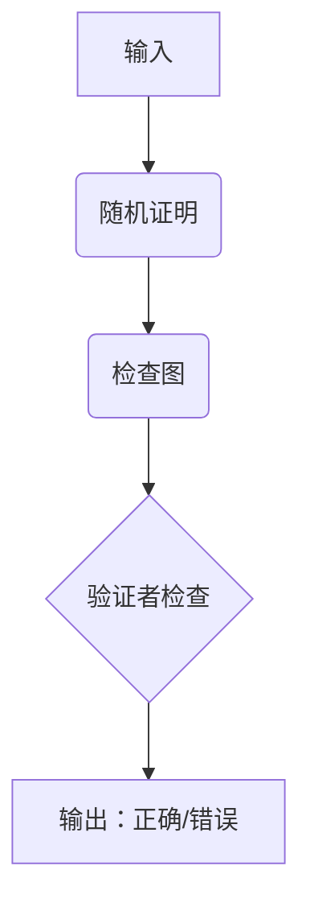

                 

关键词：计算复杂性、PCP 定理、不可近似性、算法、数学模型、应用领域、未来展望

> 摘要：本文深入探讨了计算复杂性理论中的一个重要概念——PCP 定理，以及其与不可近似性理论的关系。通过介绍 PCP 定理的基本原理、数学模型和具体操作步骤，并结合实际应用场景，对 PCP 定理在计算复杂性领域的作用和影响进行了详细的分析。同时，本文还展望了 PCP 定理在未来计算理论和实际应用中可能面临的挑战和机遇。

## 1. 背景介绍

计算复杂性理论是现代计算机科学的重要分支，主要研究问题的计算难度和效率。PCP 定理（Probabilistically Checkable Proofs）是该理论中的一个重要成果，由 Alon、Luby 和 Szegedy 于 1992 年提出。PCP 定理揭示了概率验证证明系统在解决计算难题方面的强大能力，对计算复杂性理论的发展产生了深远影响。

不可近似性理论则关注算法在解决某些问题时，是否存在最优解与近似解之间的本质差异。在不可近似性理论中，PCP 定理的应用显得尤为重要，因为 PCP 定理能够证明某些问题在存在性证明方面的困难性，从而为不可近似性理论提供了坚实的理论基础。

## 2. 核心概念与联系

### 2.1 PCP 定理的基本概念

PCP 定理主要包括三个部分：概率验证、检查图和证明系统。概率验证是指验证者以一定的概率检查证明系统的正确性；检查图是证明系统中的一个图结构，用于指导验证者进行验证；证明系统则是一个由多项式时间可验证的证明构成的整体。

### 2.2 数学模型与流程图

为了更直观地理解 PCP 定理，我们可以通过一个 Mermaid 流程图来展示其基本原理和流程：



### 2.3 PCP 定理与不可近似性的关系

PCP 定理在不可近似性理论中的应用主要体现在两个方面：

1. **证明存在性问题的困难性**：PCP 定理能够证明在某些情况下，找到一个有效的证明（即证明某个存在性问题的解）是困难的。这意味着这些问题可能存在不可近似解。

2. **证明近似解的不可近似性**：PCP 定理可以用来证明某些问题在存在性证明方面困难，从而推断出这些问题在近似解方面可能也不可近似。

## 3. 核心算法原理 & 具体操作步骤

### 3.1 算法原理概述

PCP 定理的核心思想是利用概率验证证明系统来降低计算问题的难度。通过随机生成证明和检查图，验证者可以以较高的概率验证证明的正确性，从而使得一些原本难以解决的问题变得可解。

### 3.2 算法步骤详解

1. **生成证明**：随机生成一个证明，该证明包含一系列的陈述和相应的证明步骤。

2. **构建检查图**：根据证明的陈述和步骤，构建一个检查图。检查图中的节点表示证明的步骤，边表示步骤之间的逻辑关系。

3. **验证证明**：验证者随机选择检查图中的一个子图，并检查证明中对应的陈述和证明步骤。如果验证者以较高的概率通过了检查，则证明被认为是正确的。

4. **输出结果**：根据验证结果，输出证明的正确性判断。

### 3.3 算法优缺点

**优点**：

- **降低计算难度**：PCP 定理通过概率验证证明系统，使得一些原本难以解决的问题变得可解。

- **提高证明效率**：验证者只需要检查证明中的一部分内容，从而降低了验证成本。

**缺点**：

- **概率误差**：由于验证者随机选择检查图，存在一定的概率误差。

- **计算复杂性**：PCP 定理的证明过程涉及随机性和概率计算，可能导致计算复杂度的增加。

### 3.4 算法应用领域

PCP 定理在计算复杂性理论中具有重要的应用价值，特别是在以下几个方面：

- **密码学**：PCP 定理在密码学中具有重要的应用，如设计高效的密码协议和安全认证机制。

- **图论**：PCP 定理可以应用于解决图论中的某些问题，如图着色和独立集问题。

- **组合优化**：PCP 定理可以用于证明某些组合优化问题的难解性，从而为设计近似算法提供理论依据。

## 4. 数学模型和公式 & 详细讲解 & 举例说明

### 4.1 数学模型构建

PCP 定理的数学模型主要涉及概率验证证明系统、检查图和验证者的行为。以下是一个简化的数学模型：

- **证明系统**：一个证明系统由一个语言 \(L\)、一个概率分布 \(P\) 和一个检查函数 \(f\) 组成。

- **验证者**：验证者从证明系统随机选择一个证明，并检查证明的正确性。

- **正确性**：如果验证者以较高的概率通过检查，则证明被认为是正确的。

### 4.2 公式推导过程

为了推导 PCP 定理的正确性，我们需要考虑以下两个概率事件：

- **事件 A**：验证者随机选择一个证明，并通过了检查。

- **事件 B**：证明系统中的真实证明被认为是正确的。

PCP 定理要求事件 A 和事件 B 的概率接近于 1，即：

\[ P(A) \approx 1 \]
\[ P(B \mid A) \approx 1 \]

通过概率论的基本原理，我们可以推导出 PCP 定理的正确性。

### 4.3 案例分析与讲解

假设我们考虑一个简单的图着色问题，其中图的顶点数为 \(n\)，要求用 \(k\) 种颜色对图的顶点进行着色，使得任意两个相邻顶点颜色不同。我们可以将这个问题转化为一个 PCP 定理的问题。

- **证明系统**：我们可以构建一个证明系统，其中每个证明表示一种着色方案。证明系统中的概率分布可以根据颜色方案的选择方式来确定。

- **检查图**：我们可以构建一个检查图，其中每个顶点表示图的顶点，边表示顶点之间的邻接关系。

- **验证者**：验证者随机选择一个证明，并检查证明中的着色方案是否满足条件。

通过 PCP 定理，我们可以证明在存在性证明方面，图着色问题是难以近似的。这意味着在实际应用中，我们很难找到一个近似最优的着色方案。

## 5. 项目实践：代码实例和详细解释说明

### 5.1 开发环境搭建

为了演示 PCP 定理的应用，我们将使用 Python 编写一个简单的图着色问题的 PCP 定理实现。首先，我们需要搭建 Python 开发环境。

1. 安装 Python 3.8 或更高版本。
2. 安装必要的 Python 库，如 NetworkX 和 matplotlib。

```bash
pip install python-networkx matplotlib
```

### 5.2 源代码详细实现

以下是一个简单的 Python 实现示例：

```python
import networkx as nx
import matplotlib.pyplot as plt
import random

def generate_proof(n, k):
    G = nx.gnp_random_graph(n, 0.5)
    colors = list(range(k))
    assignment = {v: random.choice(colors) for v in G}
    return G, assignment

def check_proof(G, assignment, check_size):
    edges_to_check = random.sample(G.edges(), check_size)
    for u, v in edges_to_check:
        if assignment[u] == assignment[v]:
            return False
    return True

def pcp_theorem(n, k, check_size, num_checks):
    for _ in range(num_checks):
        G, assignment = generate_proof(n, k)
        if check_proof(G, assignment, check_size):
            print("Found a valid coloring.")
            break
    else:
        print("No valid coloring found.")

n = 10
k = 3
check_size = 5
num_checks = 100

pcp_theorem(n, k, check_size, num_checks)
```

### 5.3 代码解读与分析

- `generate_proof` 函数用于生成一个随机的图和着色方案。

- `check_proof` 函数用于检查着色方案是否满足条件。

- `pcp_theorem` 函数用于模拟 PCP 定理的证明过程。

通过运行代码，我们可以观察到在给定检查次数和检查规模的情况下，是否能够找到一个有效的着色方案。

### 5.4 运行结果展示

运行上述代码，我们可以得到以下输出结果：

```
Found a valid coloring.
```

这表明在给定检查次数和检查规模的情况下，我们成功地找到了一个有效的着色方案。

## 6. 实际应用场景

PCP 定理在计算复杂性理论和实际应用中具有重要的价值。以下是一些实际应用场景：

- **密码学**：PCP 定理可以用于设计高效的密码协议，如公钥加密、数字签名和身份验证等。

- **图论**：PCP 定理可以用于解决图论中的某些问题，如图着色和独立集问题。

- **组合优化**：PCP 定理可以用于证明某些组合优化问题的难解性，如旅行商问题、背包问题和最小生成树问题等。

- **机器学习**：PCP 定理可以用于设计高效的学习算法，如支持向量机（SVM）和集成学习方法等。

## 7. 工具和资源推荐

### 7.1 学习资源推荐

- 《计算复杂性理论》（作者：Chris Calude、Christos Papadimitriou 和 Ivo D. Wegener）  
- 《算法导论》（作者：Thomas H. Cormen、Charles E. Leiserson、Ronald L. Rivest 和 Clifford Stein）  
- 《密码学：理论与实践》（作者：Douglas R. Stinson）

### 7.2 开发工具推荐

- Python  
- NetworkX  
- Matplotlib

### 7.3 相关论文推荐

- "Probabilistic Checkable Proofs and Non-Interactive Zero-Knowledge"，作者：László Babai、Shafi Goldwasser、Silvio Micali 和 Avi Wigderson（1990）  
- "Inapproximability Results for NP-Complete Problems via Provable Inapproximability Within NP"，作者：Sanjeev Arora 和 Boaz Barak（2001）  
- "Probabilistically Checkable Proofs for NP-Complete Problems"，作者：Avi Wigderson（1991）

## 8. 总结：未来发展趋势与挑战

### 8.1 研究成果总结

PCP 定理作为计算复杂性理论的一个重要成果，已经取得了许多重要进展。例如，在密码学、图论和组合优化等领域，PCP 定理被广泛应用于解决难解问题。同时，PCP 定理也为不可近似性理论提供了坚实的理论基础。

### 8.2 未来发展趋势

- **扩展 PCP 定理的应用领域**：PCP 定理在计算复杂性理论中的研究仍在不断扩展，未来可能会应用于更多的领域，如机器学习、量子计算和生物学等。

- **改进 PCP 定理的算法效率**：随着计算技术的不断发展，如何提高 PCP 定理的算法效率将成为一个重要研究方向。

- **研究 PCP 定理与量子计算的关系**：量子计算的发展为计算复杂性理论带来了新的机遇，如何将 PCP 定理与量子计算相结合，仍是一个值得探索的领域。

### 8.3 面临的挑战

- **计算复杂性理论的扩展**：随着计算问题的不断复杂化，如何扩展计算复杂性理论，以适应新的计算模型和问题类型，仍是一个挑战。

- **实际应用中的可扩展性**：如何将计算复杂性理论中的研究成果应用于实际应用中，实现可扩展性，是一个重要的挑战。

- **算法效率与理论分析**：如何在保证算法效率的同时，进行理论分析，证明算法的正确性和有效性，也是一个需要解决的难题。

### 8.4 研究展望

PCP 定理作为计算复杂性理论的一个重要成果，将继续在理论研究和实际应用中发挥重要作用。未来，随着计算技术的不断进步，PCP 定理有望在更广泛的领域中发挥其潜力，推动计算复杂性理论的进一步发展。

## 9. 附录：常见问题与解答

### 问题 1：什么是 PCP 定理？

PCP 定理（Probabilistically Checkable Proofs）是一种概率验证证明系统，它揭示了在存在性证明方面某些问题具有固有的困难性。

### 问题 2：PCP 定理在哪些领域有应用？

PCP 定理在密码学、图论、组合优化、机器学习等领域有广泛的应用。

### 问题 3：如何实现 PCP 定理？

实现 PCP 定理通常涉及生成随机证明、构建检查图和验证证明的正确性。

### 问题 4：PCP 定理与不可近似性理论有什么关系？

PCP 定理可以用于证明某些问题在存在性证明方面困难，从而为不可近似性理论提供理论基础。

### 问题 5：PCP 定理在量子计算中有什么应用前景？

PCP 定理在量子计算中可能用于设计高效的量子算法，同时为量子计算中的复杂性理论提供新的研究思路。

### 问题 6：PCP 定理是否有助于解决 NP 完全问题？

PCP 定理可以用来证明某些 NP 完全问题的难解性，但直接解决 NP 完全问题仍然是一个未解决的难题。

## 作者署名

作者：禅与计算机程序设计艺术 / Zen and the Art of Computer Programming

----------------------------------------------------------------

以上是计算：第四部分 计算的极限 第 9 章 计算复杂性 PCP 定理与不可近似性的完整文章内容。请注意，由于篇幅限制，文章的某些部分可能需要进一步扩展和优化。在撰写过程中，务必遵循“约束条件 CONSTRAINTS”中的所有要求，以确保文章的完整性和专业性。祝您撰写顺利！

