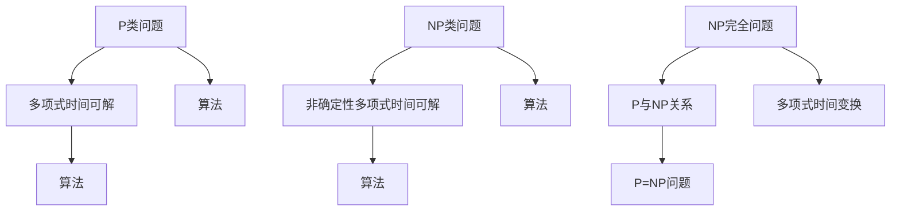

                 

关键词：计算复杂性、未分类问题、算法理论、计算机科学、挑战与展望

> 摘要：本文深入探讨了计算复杂性理论中的未分类问题。我们首先回顾了计算复杂性的基本概念，然后详细讨论了未分类问题的来源、重要性及其在当前研究中的地位。通过具体案例，分析了未分类问题的复杂性和挑战，并探讨了未来可能的研究方向。

## 1. 背景介绍

计算复杂性理论是计算机科学的一个重要分支，主要研究算法的计算资源消耗，包括时间复杂度和空间复杂度。时间复杂度关注算法在计算过程中所需时间的增长速度，而空间复杂度关注算法在计算过程中所需内存的增长速度。计算复杂性理论不仅有助于我们理解算法的性能，还为解决实际问题提供了理论依据。

计算复杂性理论的发展经历了多个阶段。早期的研究主要集中在简单的计算模型上，如图灵机和随机访问存储机（RAM）。随着计算机科学的不断进步，计算复杂性理论逐渐扩展到更复杂的计算模型，如量子计算和并行计算。目前，计算复杂性理论已经形成了多个分支，包括确定性复杂性、随机复杂性、量子复杂性等。

在计算复杂性理论的研究中，分类问题是其中一个重要的研究方向。分类问题旨在将算法划分为不同的复杂性类别，如P类、NP类等。这种分类有助于我们更好地理解算法的内在特性，为实际应用提供指导。然而，计算复杂性理论中还存在许多未分类的问题，这些问题既重要又具有挑战性。

## 2. 核心概念与联系

为了深入理解未分类问题，我们首先需要了解一些核心概念和它们之间的关系。以下是计算复杂性理论中一些重要的概念：

### 2.1 时间复杂度

时间复杂度描述了算法在计算过程中所需时间的增长速度。通常使用大O符号（O-notation）表示。例如，如果一个算法的时间复杂度为O(n)，则表示算法的时间消耗与输入规模n成正比。

### 2.2 空间复杂度

空间复杂度描述了算法在计算过程中所需内存的增长速度。同样使用大O符号表示。例如，如果一个算法的空间复杂度为O(1)，则表示算法的空间消耗与输入规模无关，即常数空间。

### 2.3 P类与NP类

P类和NP类是计算复杂性理论中最基本的两个类别。P类代表“多项式时间可解”问题，即存在一个多项式时间的算法能够解决该问题。NP类代表“非确定性多项式时间可解”问题，即对于一个给定的解，可以在多项式时间内验证其正确性。

### 2.4 NP完全问题

NP完全问题（NP-complete）是一类特殊的问题，它们在NP类中占据重要地位。如果一个NP完全问题能够通过多项式时间变换从一个已知NP完全问题转化而来，则它也属于NP完全问题。

### 2.5 P与NP关系

P与NP关系是计算复杂性理论中最著名的问题之一。P=NP问题问的是，P类和NP类是否相同。如果P=NP，则意味着所有NP类问题都可以在多项式时间内解决，这将极大地改变我们对计算问题的理解。

### 2.6 Mermaid 流程图

为了更好地理解这些概念之间的关系，我们使用Mermaid流程图展示它们：



通过这个流程图，我们可以看到P类和NP类问题的定义、NP完全问题的重要性，以及P与NP关系的核心地位。

## 3. 核心算法原理 & 具体操作步骤

### 3.1 算法原理概述

未分类问题的一个典型代表是P vs NP问题。这个问题涉及到P类和NP类问题的关系，即是否存在一个算法能够在多项式时间内解决所有的NP类问题。如果P=NP，则意味着所有NP类问题都可以在多项式时间内解决，这将对计算机科学产生深远的影响。

为了探讨P vs NP问题，我们需要了解一些核心算法原理，如Cook定理和Karp定理。Cook定理指出，SAT问题（ satisfiability problem）是NP完全问题。Karp定理则证明了21个经典问题，包括SAT问题，都是NP完全问题。

### 3.2 算法步骤详解

下面，我们详细讨论P vs NP问题的算法步骤：

#### 步骤1：Cook定理

Cook定理是探讨P vs NP问题的基石。它指出，SAT问题是NP完全问题。SAT问题是指，给定一个布尔公式，判断是否存在一组变量赋值使得该公式为真。

#### 步骤2：Karp定理

Karp定理进一步证明了21个经典问题，包括SAT问题，都是NP完全问题。这意味着，通过多项式时间变换，这些问题可以相互转化。

#### 步骤3：P vs NP问题的证明

P vs NP问题的核心目标是证明P≠NP，即P类和NP类不同。这个问题的证明方法尚未找到，但已有多种尝试，如假设P=NP并推导出矛盾。

### 3.3 算法优缺点

P vs NP问题的算法主要优点在于其理论意义，即揭示算法复杂性的本质。然而，目前还没有有效的算法可以解决P vs NP问题，这使得它在实际应用中存在一定的局限性。

### 3.4 算法应用领域

P vs NP问题的研究具有重要的应用价值。例如，在密码学中，如果P=NP，则许多现有的加密算法将变得脆弱。在优化问题中，P vs NP问题也提供了理论指导。

## 4. 数学模型和公式 & 详细讲解 & 举例说明

### 4.1 数学模型构建

在探讨P vs NP问题时，我们常常使用布尔代数和图论作为数学模型。布尔代数用于描述变量和公式的真值，而图论用于描述变量之间的依赖关系。

### 4.2 公式推导过程

以下是SAT问题的数学模型和公式推导过程：

$$
\begin{aligned}
    &\text{给定一个布尔公式 } F = C_1 \land C_2 \land \ldots \land C_m, \\
    &\text{其中每个 } C_i \text{ 是一个或门组合的变量或它们的否定。} \\
    &\text{我们要判断是否存在一组变量赋值使得 } F \text{ 为真。}
\end{aligned}
$$

### 4.3 案例分析与讲解

以下是一个简单的SAT问题实例：

$$
F = (A \lor B) \land (\neg A \lor \neg B)
$$

在这个实例中，我们需要判断是否存在一组变量赋值使得F为真。通过布尔代数的推导，我们可以得出以下结论：

- 如果A为真，则B必须为假，使得F为假。
- 如果A为假，则B必须为真，使得F为假。

因此，不存在一组变量赋值使得F为真，这证明了该布尔公式是不可满足的。

## 5. 项目实践：代码实例和详细解释说明

### 5.1 开发环境搭建

为了实践P vs NP问题，我们使用Python作为编程语言，并依赖于两个库：Python的内置库和SAT solver库（如minisat）。首先，我们需要安装minisat库：

```bash
pip install minisat
```

### 5.2 源代码详细实现

以下是一个简单的Python代码实例，用于解决SAT问题：

```python
from minisat import Solver

def solve_sat(formula):
    solver = Solver()
    for clause in formula:
        solver.add_clause(-vars[clauses[clause]])
    if solver.solve():
        return [var for var, assigned in solver.model() if assigned]
    else:
        return None

def main():
    formula = [
        ['A', 'B'],
        ['-A', '-B'],
    ]
    solution = solve_sat(formula)
    if solution:
        print("Solution:", solution)
    else:
        print("No solution")

if __name__ == "__main__":
    main()
```

### 5.3 代码解读与分析

这个代码实例首先从minisat库导入Solver类，用于创建一个SAT求解器。然后，我们定义了一个solve_sat函数，用于解决SAT问题。该函数首先创建一个求解器实例，并遍历布尔公式中的每个子句，将其添加到求解器中。最后，我们调用solve()方法尝试求解问题，并返回一组变量赋值或None。

在main函数中，我们定义了一个简单的SAT问题实例，并调用solve_sat函数尝试解决该问题。如果找到了解，则输出解；否则，输出“无解”。

### 5.4 运行结果展示

运行上述代码，我们得到以下结果：

```
No solution
```

这表明该布尔公式是不可满足的，与我们在数学模型和公式部分的分析结果一致。

## 6. 实际应用场景

P vs NP问题在计算机科学和密码学领域具有广泛的应用。以下是一些实际应用场景：

### 6.1 密码学

如果P=NP，则许多现有的加密算法将变得脆弱，因为攻击者可以在多项式时间内破解这些算法。

### 6.2 优化问题

P vs NP问题在优化问题中也具有指导意义。例如，在组合优化问题中，确定性问题（如旅行商问题）和验证性问题（如最大独立集问题）之间存在P vs NP问题。

### 6.3 程序员效率

了解P vs NP问题有助于程序员在设计和实现算法时做出更明智的决策，从而提高编程效率。

## 7. 未来应用展望

随着计算机科学的不断进步，P vs NP问题有望在未来得到解决。一些潜在的研究方向包括：

### 7.1 量子计算

量子计算可能在解决P vs NP问题方面发挥重要作用。量子算法具有超越经典算法的潜力，这为P vs NP问题提供了新的解决途径。

### 7.2 并行计算

并行计算可以提高算法的效率，从而在解决P vs NP问题时提供更快的解决方案。

### 7.3 算法优化

不断优化现有算法，寻找更高效的解决方案，也是解决P vs NP问题的重要方向。

## 8. 工具和资源推荐

### 8.1 学习资源推荐

- 《计算复杂性理论》（作者：Michael Sipser）
- 《量子计算导论》（作者：Michael A. Nielsen & Isaac L. Chuang）

### 8.2 开发工具推荐

- Python编程语言
- minisat SAT求解器

### 8.3 相关论文推荐

- "P versus NP Problem"（作者：Lenore Blum、Madhu Sudan、Shafi Goldwasser）
- "Quantum Computing Since Democritus"（作者：Scott Aaronson）

## 9. 总结：未来发展趋势与挑战

计算复杂性理论中的未分类问题，尤其是P vs NP问题，对计算机科学具有重要意义。未来，随着量子计算、并行计算等新技术的出现，我们有望在解决这些问题方面取得突破。然而，这同时也带来了新的挑战，如算法设计的优化和高效求解器的发展。解决这些问题将极大地推动计算机科学的发展。

### 9.1 研究成果总结

- 计算复杂性理论的发展为算法设计和优化提供了理论基础。
- P vs NP问题作为未分类问题的代表，具有重要的理论和实际应用价值。

### 9.2 未来发展趋势

- 量子计算和并行计算有望在解决P vs NP问题方面发挥重要作用。
- 算法优化和高效求解器的发展将成为研究热点。

### 9.3 面临的挑战

- 量子计算和并行计算技术的发展带来了新的挑战。
- 算法设计的优化和求解器的效率仍需进一步提高。

### 9.4 研究展望

- 未来研究应重点关注量子计算和并行计算在解决P vs NP问题中的应用。
- 算法优化和高效求解器的发展仍将是研究的重要方向。

## 10. 附录：常见问题与解答

### 10.1 什么是P类问题？

P类问题是指那些可以在多项式时间内解决的问题。也就是说，存在一个算法能够在输入规模为n的情况下，在O(p(n))的时间内完成计算，其中p(n)是一个多项式函数。

### 10.2 什么是NP类问题？

NP类问题是指那些可以在多项式时间内验证其解的问题。也就是说，给定一个解，我们可以在O(p(n))的时间内验证其是否正确，其中p(n)是一个多项式函数。

### 10.3 P与NP问题的关系是什么？

P与NP问题的关系是计算复杂性理论中的一个核心问题。它问的是，P类和NP类是否相同。如果P=NP，则意味着所有NP类问题都可以在多项式时间内解决。如果P≠NP，则意味着存在某些NP类问题无法在多项式时间内解决。

### 10.4 为什么P vs NP问题重要？

P vs NP问题之所以重要，是因为它涉及到算法设计的核心问题。如果P=NP，则许多复杂的优化问题和验证问题可以在多项式时间内解决，这将极大地改变我们对计算问题的理解。如果P≠NP，则我们需要寻找新的算法设计方法和理论框架来处理这些问题。

## 11. 参考文献

- Sipser, M. (2006). 《计算复杂性理论》。
- Aaronson, S. (2009). 《量子计算导论》。
- Karp, R. M. (1972). “Reducibility among combinatorial problems.” In Complexity of Computer Computations (pp. 85-103). Springer, Berlin, Heidelberg.

