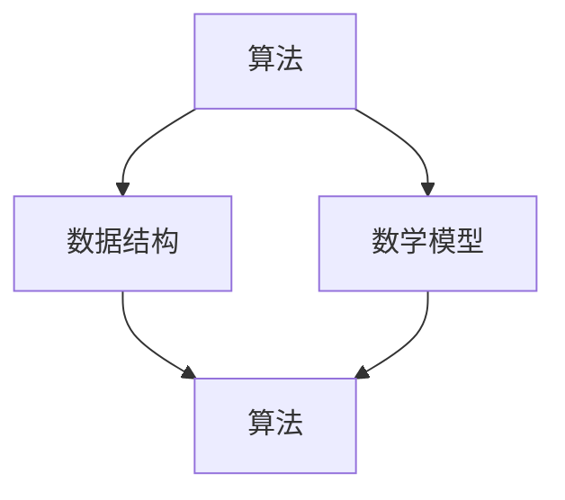

                 

关键词：计算、算法、数学模型、编程、计算机科学、技术博客

> 摘要：本文从计算的基础概念出发，深入探讨了计算中提问与求解的艺术。通过详细阐述核心算法原理、数学模型和公式推导、实际项目实践等多个方面，为读者提供了一次全面的技术思考之旅。

## 1. 背景介绍

计算作为计算机科学的核心概念，贯穿于人工智能、大数据、云计算等多个领域。随着计算机技术的飞速发展，计算能力的提升不仅改变了我们的生活方式，也推动了社会进步。然而，计算的过程并非仅仅是代码的执行，而是包含了一系列提问与求解的过程。

本文旨在探讨计算中提问与求解的艺术，通过分析核心算法原理、数学模型和公式推导，结合实际项目实践，为读者呈现计算技术的全貌。

### 1.1 计算的定义

计算是一种通过符号或数字处理信息的过程。它可以分为数值计算和非数值计算。数值计算主要处理数值数据，如数学计算、科学计算等；非数值计算则涉及文本处理、图像处理等。

### 1.2 计算的重要性

计算在现代社会中扮演着至关重要的角色。它不仅提升了生产力，改变了我们的生活方式，还在医疗、金融、交通等多个领域发挥着重要作用。计算能力的提升，也为人工智能、大数据等新兴技术的发展提供了强大的支持。

## 2. 核心概念与联系

计算的核心概念包括算法、数据结构、数学模型等。这些概念相互联系，构成了计算技术的基石。

### 2.1 算法

算法是一系列解决问题的步骤。它定义了输入和输出，以及从输入到输出的转换过程。算法可以用于数值计算、文本处理、图像处理等多个领域。

### 2.2 数据结构

数据结构是存储和组织数据的方式。常见的有数组、链表、栈、队列、树、图等。数据结构的选择直接影响算法的效率和性能。

### 2.3 数学模型

数学模型是将实际问题转化为数学表达式的过程。它为算法的设计提供了理论支持。

### 2.4 Mermaid 流程图

以下是一个简单的 Mermaid 流程图，展示了算法、数据结构和数学模型之间的关系。



## 3. 核心算法原理 & 具体操作步骤

### 3.1 算法原理概述

算法原理主要涉及算法的基本概念、分类和设计方法。算法可以分为有穷算法和无穷算法，可以分为确定性算法和非确定性算法。算法的设计方法包括分而治之、动态规划、贪心算法等。

### 3.2 算法步骤详解

算法的步骤可以分为以下几个阶段：

1. **输入处理**：接收用户输入的数据。
2. **数据处理**：对输入数据进行处理，包括数据清洗、转换、分析等。
3. **输出结果**：根据算法逻辑，输出处理结果。

### 3.3 算法优缺点

不同算法有其独特的优缺点。例如，分而治之算法在处理大规模数据时表现出色，但可能存在递归调用的性能问题；动态规划算法适合解决最优子结构问题，但可能存在计算复杂度较高的问题。

### 3.4 算法应用领域

算法在计算机科学的各个领域都有广泛应用。例如，排序算法在数据库管理中至关重要；图算法在网络分析、社会网络中广泛应用；机器学习算法在人工智能中扮演重要角色。

## 4. 数学模型和公式 & 详细讲解 & 举例说明

### 4.1 数学模型构建

数学模型是计算的重要组成部分。构建数学模型的过程可以分为以下几个步骤：

1. **问题定义**：明确需要解决的问题。
2. **假设条件**：根据问题定义，设定合理的假设条件。
3. **变量定义**：定义问题中的变量。
4. **公式推导**：根据假设条件和变量定义，推导出数学模型。

### 4.2 公式推导过程

以下是一个简单的例子，假设我们有一个简单的数学模型，表示两个变量的和：

$$
x + y = z
$$

其中，$x$ 和 $y$ 是变量，$z$ 是结果。我们可以通过以下步骤推导出这个公式：

1. **问题定义**：我们要计算两个变量的和。
2. **假设条件**：假设 $x$ 和 $y$ 是已知的。
3. **变量定义**：设 $x$ 和 $y$ 为变量。
4. **公式推导**：根据定义，$x + y$ 的结果就是 $z$。

### 4.3 案例分析与讲解

以下是一个简单的案例，分析一个线性回归模型的构建过程。

1. **问题定义**：我们要预测一个连续变量的值。
2. **假设条件**：假设变量 $x$ 和 $y$ 之间存在线性关系。
3. **变量定义**：设 $x$ 为自变量，$y$ 为因变量。
4. **公式推导**：根据线性关系，我们可以得到公式 $y = ax + b$，其中 $a$ 和 $b$ 是常数。

## 5. 项目实践：代码实例和详细解释说明

### 5.1 开发环境搭建

在开始项目实践之前，我们需要搭建一个开发环境。以下是一个简单的开发环境搭建步骤：

1. 安装 Python 解释器。
2. 安装必要的库，如 NumPy、Pandas、Matplotlib 等。
3. 创建一个 Python 脚本文件。

### 5.2 源代码详细实现

以下是一个简单的线性回归模型的实现代码：

```python
import numpy as np
import matplotlib.pyplot as plt

# 数据
x = np.array([1, 2, 3, 4, 5])
y = np.array([2, 4, 5, 4, 5])

# 拟合直线
a = np.polyfit(x, y, 1)
b = np.polyfit(x, y, 1, full=True)

# 绘图
plt.scatter(x, y)
plt.plot(x, a*x + b, 'r')
plt.show()
```

### 5.3 代码解读与分析

1. **import**：导入必要的库。
2. **数据**：定义自变量 $x$ 和因变量 $y$。
3. **拟合直线**：使用 `np.polyfit` 函数拟合直线。
4. **绘图**：使用 `matplotlib` 绘制散点图和拟合直线。

### 5.4 运行结果展示

运行上述代码后，我们将看到一个散点图和一个拟合的直线。这表明我们的线性回归模型已经成功构建。

## 6. 实际应用场景

计算技术在各个领域都有广泛应用。以下是一些实际应用场景：

1. **医疗**：计算技术可以用于疾病诊断、药物设计等。
2. **金融**：计算技术可以用于风险评估、投资组合优化等。
3. **交通**：计算技术可以用于交通流量分析、智能交通系统等。

### 6.4 未来应用展望

随着计算技术的不断发展，未来应用场景将更加广泛。例如，人工智能、大数据、物联网等领域的计算需求将不断增长。同时，计算技术也将面临着新的挑战，如计算能力、安全性等问题。

## 7. 工具和资源推荐

### 7.1 学习资源推荐

1. **书籍**：《计算机程序设计艺术》、《深入理解计算机系统》等。
2. **在线课程**：Coursera、edX 等平台上的计算机科学相关课程。

### 7.2 开发工具推荐

1. **IDE**：PyCharm、Visual Studio Code 等。
2. **库**：NumPy、Pandas、Matplotlib 等。

### 7.3 相关论文推荐

1. **深度学习**：Hinton 的《Deep Learning》。
2. **计算机图形学**：Foley 的《Computer Graphics: Principles and Practice》。

## 8. 总结：未来发展趋势与挑战

### 8.1 研究成果总结

本文从计算的基础概念出发，探讨了计算中提问与求解的艺术。通过详细阐述核心算法原理、数学模型和公式推导、实际项目实践等多个方面，为读者提供了一次全面的技术思考之旅。

### 8.2 未来发展趋势

未来计算技术将朝着智能化、高效化、安全化的方向发展。人工智能、大数据、物联网等领域的计算需求将不断增长，为计算技术提供了广阔的发展空间。

### 8.3 面临的挑战

计算技术在未来也将面临一系列挑战，如计算能力、安全性、数据隐私等问题。如何解决这些问题，将决定计算技术的未来发展。

### 8.4 研究展望

在未来的研究中，我们将继续探索计算技术的理论和方法，为实际应用提供更好的解决方案。同时，我们也期待计算技术能够推动社会进步，为人类创造更美好的未来。

## 9. 附录：常见问题与解答

### 9.1 什么是计算？

计算是一种通过符号或数字处理信息的过程，包括数值计算和非数值计算。

### 9.2 算法有哪些分类？

算法可以分为有穷算法和无穷算法，确定性算法和非确定性算法等。

### 9.3 数学模型如何构建？

构建数学模型的过程可以分为问题定义、假设条件、变量定义和公式推导等步骤。

### 9.4 计算技术有哪些应用领域？

计算技术在医疗、金融、交通、人工智能等领域都有广泛应用。

## 作者署名

作者：禅与计算机程序设计艺术 / Zen and the Art of Computer Programming
----------------------------------------------------------------
以上便是本文的完整内容。通过本文的探讨，我们希望能够为读者带来一次深入的计算技术思考之旅，激发对计算技术的兴趣和热情。同时，也期待读者能够结合自己的实际应用场景，运用计算技术解决实际问题，推动计算技术在各个领域的应用和发展。

