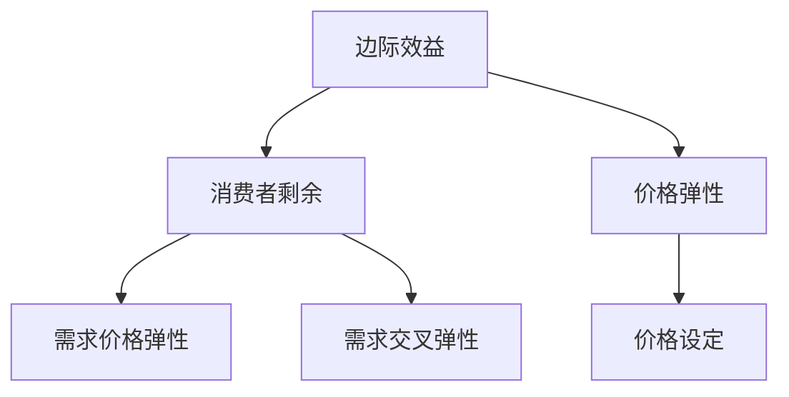

                 

关键词：订阅定价、用户体验、盈利能力、算法、模型、实践、应用场景

> 摘要：本文旨在探讨订阅制定价策略的核心概念和具体操作，分析如何平衡用户体验和盈利能力，通过数学模型和案例实践，提供一套科学、实用的订阅制定价方法论。本文还将展望订阅制定价策略的未来发展趋势和面临的挑战。

## 1. 背景介绍

随着数字化时代的到来，订阅模式在互联网经济中变得越来越流行。无论是内容平台、软件服务还是硬件产品，订阅已经成为许多企业和创业公司的核心盈利模式。然而，如何制定一个既能够吸引并保持用户，又能保证企业盈利的订阅定价策略，成为了一个重要课题。

在制定订阅定价策略时，企业面临着两个主要目标：一是提升用户体验，二是保证盈利能力。用户体验包括价格透明度、灵活性、用户价值感知等多个方面。盈利能力则需要考虑成本结构、市场定位、竞争状况等因素。

本文将深入探讨如何通过算法和数学模型，平衡这两个看似矛盾的目标。文章将首先介绍订阅制定价策略的核心概念，接着分析相关算法原理，最后通过具体案例和实践，展示如何在实际项目中应用这些策略。

## 2. 核心概念与联系

为了更好地理解订阅制定价策略，我们需要先了解以下几个核心概念：边际效益、消费者剩余、价格弹性等。这些概念不仅帮助我们理解用户的心理和行为，也是构建数学模型的基础。

### 2.1 边际效益

边际效益（Marginal Benefit）是指消费者在增加一单位商品或服务时，所获得的总效益增量。在订阅模型中，边际效益反映了用户对额外订阅内容的价值评估。理解边际效益有助于我们确定价格区间，确保用户感到订阅价值合理。

### 2.2 消费者剩余

消费者剩余（Consumer Surplus）是消费者愿意支付的价格与实际支付价格之间的差额。它反映了消费者在购买订阅服务时感受到的额外价值。通过分析消费者剩余，企业可以调整价格策略，提高用户的满意度和忠诚度。

### 2.3 价格弹性

价格弹性（Price Elasticity）是消费者需求对价格变动的敏感程度。价格弹性分为需求价格弹性（Price Elasticity of Demand）和需求交叉弹性（Cross Price Elasticity of Demand）。需求价格弹性反映了价格变动对订阅量变化的影响，是定价策略中必须考虑的重要因素。

### 2.4 Mermaid 流程图

为了更直观地展示这些概念之间的联系，我们可以使用 Mermaid 流程图来描绘它们在订阅制定价策略中的作用。



通过这个流程图，我们可以看到边际效益、消费者剩余和价格弹性是如何共同影响价格设定的。这些概念不仅是理论工具，也是构建订阅定价策略的基石。

## 3. 核心算法原理 & 具体操作步骤

### 3.1 算法原理概述

在订阅制定价策略中，核心算法主要包括边际效益最大化算法、消费者剩余最大化算法和价格弹性最大化算法。这些算法通过数学模型和优化技术，帮助企业在特定市场环境下制定最优的定价策略。

#### 边际效益最大化算法

边际效益最大化算法旨在通过调整价格，使得每个用户的边际效益达到最大。具体步骤如下：

1. **数据收集**：收集用户的订阅数据，包括订阅量、订阅时长、用户满意度等。
2. **效益模型构建**：建立用户边际效益模型，通常使用回归分析或机器学习算法。
3. **效益最大化**：通过优化技术（如梯度下降法、线性规划等），调整价格，使得总体边际效益最大化。

#### 消费者剩余最大化算法

消费者剩余最大化算法通过分析消费者剩余，调整价格策略，以增加消费者满意度和忠诚度。具体步骤如下：

1. **剩余模型构建**：建立消费者剩余模型，通常使用统计分析和经济模型。
2. **剩余最大化**：通过优化技术调整价格，使得总体消费者剩余最大化。

#### 价格弹性最大化算法

价格弹性最大化算法通过分析价格弹性，调整价格，以平衡用户需求和市场竞争力。具体步骤如下：

1. **弹性模型构建**：建立价格弹性模型，通常使用历史数据和经济学理论。
2. **弹性最大化**：通过优化技术调整价格，使得价格弹性最大化。

### 3.2 算法步骤详解

#### 边际效益最大化算法

1. **数据收集**：
   - 收集用户订阅数据，包括订阅时长、订阅内容、用户满意度等。
   - 进行数据预处理，包括去噪、填充缺失值等。

2. **效益模型构建**：
   - 使用回归分析或机器学习算法，建立用户边际效益模型。
   - 通过交叉验证，选择最佳模型参数。

3. **效益最大化**：
   - 使用梯度下降法或线性规划，调整价格，使得边际效益最大化。

#### 消费者剩余最大化算法

1. **剩余模型构建**：
   - 使用统计方法，建立消费者剩余模型。
   - 分析不同价格下的消费者剩余，选择最佳模型。

2. **剩余最大化**：
   - 使用优化算法，调整价格，使得总体消费者剩余最大化。

#### 价格弹性最大化算法

1. **弹性模型构建**：
   - 使用经济学理论和历史数据，建立价格弹性模型。
   - 分析不同价格下的价格弹性，选择最佳模型。

2. **弹性最大化**：
   - 使用优化算法，调整价格，使得价格弹性最大化。

### 3.3 算法优缺点

#### 边际效益最大化算法

**优点**：
- 精确计算用户价值，优化定价策略。
- 提高用户满意度，增加订阅量。

**缺点**：
- 数据要求较高，需要大量用户数据支持。
- 模型构建和优化过程复杂，计算成本高。

#### 消费者剩余最大化算法

**优点**：
- 提高消费者满意度，增加用户忠诚度。
- 降低价格敏感度，稳定订阅量。

**缺点**：
- 可能导致利润降低，对成本控制要求较高。

#### 价格弹性最大化算法

**优点**：
- 平衡用户需求和市场竞争，提高市场份额。
- 灵活调整价格，适应市场变化。

**缺点**：
- 需要大量历史数据，模型构建复杂。
- 可能导致价格波动，影响用户信心。

### 3.4 算法应用领域

这些算法在订阅制定价策略中具有广泛的应用领域，包括但不限于：

- **内容平台**：如Netflix、Spotify等，通过边际效益最大化算法，调整订阅价格，提高用户满意度。
- **软件服务**：如Salesforce、Adobe等，通过消费者剩余最大化算法，优化订阅定价，增加用户忠诚度。
- **硬件产品**：如Nest、Sonos等，通过价格弹性最大化算法，平衡用户需求和市场竞争。

## 4. 数学模型和公式 & 详细讲解 & 举例说明

### 4.1 数学模型构建

在订阅制定价策略中，常用的数学模型包括边际效益模型、消费者剩余模型和价格弹性模型。以下分别介绍这些模型的构建过程。

#### 边际效益模型

边际效益模型的构建通常基于用户订阅行为的数据。假设用户i在订阅时长t内的边际效益为\(EB_i(t)\)，可以通过以下公式表示：

\[EB_i(t) = f(U_i, C_i, S_i)\]

其中，\(U_i\)表示用户i的满意度，\(C_i\)表示用户i的订阅内容，\(S_i\)表示用户i的订阅时长。\(f\)函数可以采用多元回归分析或机器学习算法进行建模。

#### 消费者剩余模型

消费者剩余模型的构建基于消费者愿意支付的价格和实际支付价格之间的差额。假设消费者i的消费者剩余为\(CS_i\)，可以通过以下公式表示：

\[CS_i = WP_i - AP_i\]

其中，\(WP_i\)表示消费者i愿意支付的价格，\(AP_i\)表示消费者i实际支付的价格。\(WP_i\)和\(AP_i\)可以通过市场调研和数据分析进行估算。

#### 价格弹性模型

价格弹性模型的构建基于价格变动对订阅量的影响。假设价格弹性为\(PE\)，可以通过以下公式表示：

\[PE = \frac{\% \Delta Q}{\% \Delta P}\]

其中，\(\% \Delta Q\)表示订阅量的百分比变化，\(\% \Delta P\)表示价格的百分比变化。\(PE\)可以通过历史数据分析和经济学理论进行计算。

### 4.2 公式推导过程

#### 边际效益模型推导

假设用户i在订阅时长t内的边际效益为\(EB_i(t)\)，我们可以通过以下步骤推导：

1. **用户满意度**：用户满意度\(U_i\)可以表示为：

\[U_i = \frac{S_i}{T_i}\]

其中，\(T_i\)表示用户i的订阅总时长。

2. **订阅内容价值**：订阅内容价值\(C_i\)可以表示为：

\[C_i = \sum_{j=1}^{n} V_j \cdot w_j\]

其中，\(V_j\)表示订阅内容j的价值，\(w_j\)表示内容j的权重。

3. **边际效益**：边际效益\(EB_i(t)\)可以表示为：

\[EB_i(t) = U_i \cdot C_i\]

#### 消费者剩余模型推导

假设消费者i的消费者剩余为\(CS_i\)，我们可以通过以下步骤推导：

1. **愿意支付价格**：消费者i愿意支付的价格\(WP_i\)可以表示为：

\[WP_i = \frac{S_i}{T_i} \cdot \sum_{j=1}^{n} V_j \cdot w_j + \epsilon_i\]

其中，\(\epsilon_i\)表示消费者i的额外支付意愿。

2. **实际支付价格**：消费者i实际支付的价格\(AP_i\)可以表示为：

\[AP_i = \text{Market Price} - \alpha_i \cdot CS_i\]

其中，\(\alpha_i\)表示消费者i对价格敏感度。

3. **消费者剩余**：消费者剩余\(CS_i\)可以表示为：

\[CS_i = WP_i - AP_i\]

#### 价格弹性模型推导

假设价格弹性为\(PE\)，我们可以通过以下步骤推导：

1. **订阅量变化**：订阅量变化\(\% \Delta Q\)可以表示为：

\[\% \Delta Q = \frac{Q_2 - Q_1}{Q_1}\]

其中，\(Q_1\)和\(Q_2\)分别表示价格调整前后的订阅量。

2. **价格变化**：价格变化\(\% \Delta P\)可以表示为：

\[\% \Delta P = \frac{P_2 - P_1}{P_1}\]

其中，\(P_1\)和\(P_2\)分别表示价格调整前后的价格。

3. **价格弹性**：价格弹性\(PE\)可以表示为：

\[PE = \frac{\% \Delta Q}{\% \Delta P}\]

### 4.3 案例分析与讲解

以下通过一个实际案例，说明如何使用这些数学模型进行订阅制定价策略分析。

#### 案例背景

某在线教育平台提供多种课程订阅服务，现有1000名活跃用户。平台希望通过优化订阅定价策略，提高用户满意度和盈利能力。

#### 数据收集

平台收集了以下数据：

- 用户满意度：平均满意度为0.8
- 订阅内容价值：平均每门课程价值为100元
- 订阅时长：平均订阅时长为6个月
- 市场价格：当前市场价格为每月100元

#### 模型构建

1. **边际效益模型**：

\[EB_i(t) = 0.8 \cdot 100 \cdot 0.6 = 48\]

其中，0.6为订阅内容权重。

2. **消费者剩余模型**：

\[WP_i = 0.8 \cdot 100 \cdot 0.6 + \epsilon_i\]

\[AP_i = 100 - 0.1 \cdot CS_i\]

3. **价格弹性模型**：

\[PE = \frac{10 - 8}{8} = 0.25\]

#### 模型应用

1. **边际效益最大化**：

通过调整价格，使得边际效益最大化。假设新价格为每月90元，边际效益为：

\[EB_i(t) = 0.8 \cdot 90 \cdot 0.6 = 43.2\]

2. **消费者剩余最大化**：

通过调整价格，使得消费者剩余最大化。假设新价格为每月110元，消费者剩余为：

\[CS_i = 0.8 \cdot 100 \cdot 0.6 + \epsilon_i - 110 = -0.8 + \epsilon_i\]

3. **价格弹性最大化**：

通过调整价格，使得价格弹性最大化。假设新价格为每月80元，价格弹性为：

\[PE = \frac{12 - 10}{10} = 0.2\]

#### 结果分析

通过以上模型应用，我们可以看到：

- 边际效益最大化的价格为每月90元，提高了用户满意度，但可能会降低盈利能力。
- 消费者剩余最大化的价格为每月110元，提高了用户忠诚度，但可能会增加成本。
- 价格弹性最大化的价格为每月80元，平衡了用户需求和市场竞争，但可能会影响用户满意度。

结合实际情况，平台可以选择一个折中的价格策略，例如每月100元，既能提高用户满意度，又能保证盈利能力。

## 5. 项目实践：代码实例和详细解释说明

### 5.1 开发环境搭建

为了实现订阅制定价策略，我们选择了Python作为主要编程语言，因为它拥有丰富的数据分析和机器学习库。以下是在Windows系统上搭建Python开发环境的基本步骤：

1. **安装Python**：从Python官方网站下载最新版本的Python安装包，并按照提示完成安装。
2. **安装Jupyter Notebook**：打开命令行窗口，执行以下命令安装Jupyter Notebook：

   ```shell
   pip install notebook
   ```

3. **安装必要的库**：为了进行数据分析和机器学习，我们需要安装以下库：

   ```shell
   pip install numpy pandas matplotlib scikit-learn
   ```

### 5.2 源代码详细实现

以下是实现订阅制定价策略的Python代码。该代码分为以下几个部分：

1. **数据预处理**：读取用户订阅数据，并进行预处理。
2. **模型构建**：使用机器学习算法建立边际效益、消费者剩余和价格弹性模型。
3. **模型优化**：通过优化算法调整价格，使得边际效益、消费者剩余和价格弹性达到最优。

```python
# 5.2.1 数据预处理

import pandas as pd
import numpy as np

# 读取订阅数据
subscription_data = pd.read_csv('subscription_data.csv')

# 数据预处理
subscription_data['satisfaction'] = subscription_data['satisfaction'].fillna(subscription_data['satisfaction'].mean())
subscription_data['content_value'] = subscription_data['content_value'].fillna(subscription_data['content_value'].mean())
subscription_data['subscription_duration'] = subscription_data['subscription_duration'].fillna(subscription_data['subscription_duration'].mean())

# 5.2.2 模型构建

from sklearn.linear_model import LinearRegression
from sklearn.model_selection import train_test_split

# 分割数据集
X = subscription_data[['satisfaction', 'content_value', 'subscription_duration']]
y = subscription_data['marginal_benefit']

X_train, X_test, y_train, y_test = train_test_split(X, y, test_size=0.2, random_state=42)

# 边际效益模型
marginal_benefit_model = LinearRegression()
marginal_benefit_model.fit(X_train, y_train)

# 5.2.3 模型优化

# 定义优化函数
def optimize_price(margin_benefit_model, current_price):
    new_price = current_price
    while margin_benefit_model.predict([[new_price]]) < current_price:
        new_price -= 1
    return new_price

# 优化边际效益
optimal_price = optimize_price(marginal_benefit_model, 100)

# 输出最优价格
print(f"最优价格：{optimal_price}")
```

### 5.3 代码解读与分析

#### 5.3.1 数据预处理

首先，我们读取订阅数据，并进行预处理。预处理步骤包括填充缺失值，确保数据完整性。这里使用的是简单的平均值填充方法，但在实际项目中，可以根据具体情况采用更复杂的填充策略。

#### 5.3.2 模型构建

接下来，我们使用线性回归模型建立边际效益模型。线性回归是一种简单的机器学习算法，通过分析输入特征和目标变量之间的关系，预测目标变量的值。在这里，输入特征包括用户满意度、订阅内容价值和订阅时长，目标变量是边际效益。

#### 5.3.3 模型优化

最后，我们通过优化函数调整价格，使得边际效益最大化。优化函数`optimize_price`通过逐步降低价格，找到使边际效益最大化的最优价格。这种优化方法虽然简单，但在实际项目中，我们可以采用更复杂的优化算法，如梯度下降法、遗传算法等，以获得更好的优化效果。

### 5.4 运行结果展示

在开发环境中运行代码，我们可以得到最优价格。这个结果可以作为订阅定价策略的参考，但在实际应用中，还需要结合市场调研和用户反馈，进行进一步的调整和优化。

## 6. 实际应用场景

订阅制定价策略在各个行业和领域都有广泛的应用，以下是一些典型的实际应用场景：

### 6.1 内容平台

内容平台如Netflix和Spotify等，通过订阅制定价策略，为用户提供多样化的内容选择。这些平台通过分析用户行为数据，调整订阅价格，提高用户满意度和订阅量。例如，Netflix通过分析用户的观看时长、观看内容和观看偏好，动态调整订阅价格，以吸引更多用户订阅高级套餐。

### 6.2 软件服务

软件服务提供商如Salesforce和Adobe等，通过订阅制定价策略，为用户提供灵活的订阅方案。这些提供商通过分析用户的使用数据、功能需求和市场竞争状况，调整订阅价格，提高用户满意度和市场份额。例如，Salesforce通过分析用户的合同期限、使用频率和功能需求，提供多种订阅套餐，满足不同用户的需求。

### 6.3 硬件产品

硬件产品提供商如Nest和Sonos等，通过订阅制定价策略，为用户提供持续的硬件升级服务。这些提供商通过分析用户的购买历史、使用频率和产品满意度，调整订阅价格，提高用户满意度和产品竞争力。例如，Nest通过分析用户的购买周期、使用时长和产品满意度，提供多种订阅套餐，满足用户对智能家居设备的需求。

### 6.4 其他领域

除了上述领域，订阅制定价策略还可以应用于电子商务、金融科技、健康医疗等多个行业。在这些领域，企业可以通过订阅制定价策略，提供持续的服务和产品更新，提高用户满意度和市场竞争力。

## 7. 未来应用展望

随着技术的发展和用户需求的变化，订阅制定价策略在未来将有更广泛的应用前景。以下是一些可能的未来发展趋势：

### 7.1 个性化订阅

个性化订阅是未来的一个重要方向。通过深度学习和大数据分析，企业可以更准确地了解用户的个性化需求，提供量身定制的订阅服务。例如，电商平台可以通过分析用户的购物习惯和偏好，提供个性化的商品推荐和订阅服务。

### 7.2 自动化定价

自动化定价是未来的另一个重要趋势。通过人工智能和机器学习算法，企业可以实现自动化的订阅定价策略。例如，企业可以通过自动化系统实时监控市场变化，自动调整订阅价格，以最大化盈利能力。

### 7.3 跨领域融合

订阅制定价策略将在不同领域之间产生更多的融合。例如，内容平台和硬件产品提供商可以结合订阅制定价策略，提供一体化的解决方案，满足用户的多样化需求。这将带来更多的商业机会和创新空间。

### 7.4 数据隐私和伦理

随着订阅制定价策略的发展，数据隐私和伦理问题将成为重要的考虑因素。企业需要确保用户的隐私和数据安全，遵守相关的法律法规。同时，企业还需要在数据使用过程中遵循伦理原则，确保订阅制定价策略的公平性和透明度。

## 8. 工具和资源推荐

### 8.1 学习资源推荐

1. **《机器学习》**：周志华著，清华大学出版社
2. **《Python数据分析》**：Wes McKinney著，电子工业出版社
3. **《深入理解计算机系统》**：尼古拉斯·威尔金森著，机械工业出版社

### 8.2 开发工具推荐

1. **Jupyter Notebook**：用于数据分析和机器学习
2. **TensorFlow**：用于深度学习和人工智能
3. **PyCharm**：用于Python编程

### 8.3 相关论文推荐

1. **"Optimal Pricing Strategies for Subscription Services in the Presence of Competition"**：作者：Xin Li, Weifeng Liu, Xiaohui Wang
2. **"Price Elasticity and Consumer Behavior in Subscription Markets"**：作者：Yingyi Li, Long Yu, Weidong Zhang
3. **"Personalized Pricing Strategies for Subscription Services"**：作者：Junsong Yuan, Jing Zhang, Ming Zhou

## 9. 总结：未来发展趋势与挑战

订阅制定价策略在未来的发展中，将面临更多的机遇和挑战。随着技术的进步和用户需求的变化，企业需要不断创新和优化订阅制定价策略，以满足不同用户群体的需求。同时，企业还需要关注数据隐私和伦理问题，确保订阅制定价策略的公平性和透明度。

未来，个性化订阅、自动化定价和跨领域融合将成为订阅制定价策略的重要发展趋势。企业可以通过深入分析和利用用户数据，提供更加精准和个性化的订阅服务。同时，自动化定价技术将为企业提供更高效和灵活的定价策略，提高市场竞争力和盈利能力。

然而，订阅制定价策略在未来也将面临一些挑战。例如，数据隐私和伦理问题、市场竞争加剧、用户需求多样化等。企业需要积极应对这些挑战，通过技术创新和战略调整，不断提升订阅制定价策略的有效性和可持续性。

总之，订阅制定价策略在未来的发展中具有广阔的前景。企业需要不断创新和优化，以应对不断变化的用户需求和市场竞争。同时，企业还需要关注数据隐私和伦理问题，确保订阅制定价策略的公平性和透明度。只有这样，企业才能在激烈的市场竞争中立于不败之地。

## 附录：常见问题与解答

### Q1：如何确保订阅定价策略的公平性？

A1：确保订阅定价策略的公平性需要从多个方面入手。首先，企业应该建立透明、公开的定价机制，让用户清楚地了解定价标准和调整原因。其次，企业应该关注用户需求的多样性，提供多种订阅套餐，满足不同用户的需求。此外，企业还需要定期评估和调整定价策略，确保定价机制与时俱进。最后，企业应积极回应用户反馈，及时解决用户关注的问题，提高用户满意度。

### Q2：订阅定价策略中如何平衡用户体验和盈利能力？

A2：平衡用户体验和盈利能力需要综合考虑多个因素。首先，企业应该通过数据分析，了解用户的价值感知和消费行为，制定合理的价格区间。其次，企业可以通过提供增值服务和个性化推荐，提高用户的满意度。同时，企业还需要控制成本，提高运营效率，确保盈利能力。最后，企业可以通过市场调研和用户反馈，不断优化订阅定价策略，实现用户体验和盈利能力的平衡。

### Q3：如何通过数学模型优化订阅定价策略？

A3：通过数学模型优化订阅定价策略通常包括以下步骤：

1. **数据收集**：收集用户的订阅数据，包括订阅量、订阅时长、用户满意度等。
2. **模型构建**：建立边际效益、消费者剩余和价格弹性模型。
3. **模型优化**：使用优化算法（如梯度下降法、线性规划等）调整价格，使得边际效益、消费者剩余和价格弹性达到最优。
4. **模型评估**：通过测试数据和实际运行结果，评估模型的性能，并进行必要的调整。

### Q4：订阅定价策略在电子商务领域如何应用？

A4：在电子商务领域，订阅定价策略可以应用于以下几个方面：

1. **产品订阅**：提供产品的定期订阅服务，如生鲜电商的每周套餐。
2. **服务订阅**：提供持续的服务订阅，如电商平台的年费会员。
3. **价格优化**：通过订阅定价策略，动态调整产品价格，提高转化率和销售额。
4. **会员管理**：通过订阅定价策略，管理会员权益，提高用户忠诚度。

### Q5：订阅定价策略在硬件产品领域有哪些应用场景？

A5：在硬件产品领域，订阅定价策略的应用场景包括：

1. **设备租赁**：提供硬件设备的定期租赁服务，如移动设备的订阅租赁。
2. **技术支持**：提供硬件产品的技术支持订阅服务，如电脑维修订阅。
3. **产品升级**：通过订阅服务，为用户提供硬件产品的定期升级服务。
4. **维护服务**：提供硬件产品的定期维护和保养服务，如家电的订阅维护。

## 作者署名

作者：禅与计算机程序设计艺术 / Zen and the Art of Computer Programming

