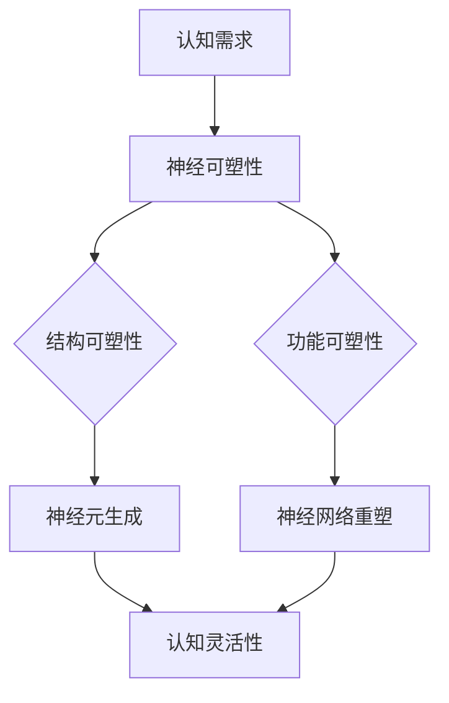

                 

### 关键词

认知灵活性、新知识适应、大脑机制、神经可塑性、学习算法、编程思维、人工智能。

### 摘要

在信息爆炸的时代，认知灵活性成为人们适应新知识的关键能力。本文旨在探讨大脑适应新知识的过程，即认知灵活性的内在机制，并结合信息技术，特别是编程和人工智能领域的实践经验，分析这一能力在现代社会的重要性及培养方法。

## 1. 背景介绍

认知灵活性（Cognitive Flexibility）是指个体在不同认知情境中灵活调整思考模式，适应新信息的能力。随着信息技术的发展，人们面临着海量的新知识，需要不断更新和调整自己的认知框架，以便更好地理解和应用这些新知识。大脑的神经可塑性（Neuroplasticity）提供了这种适应性的生物学基础。本文将介绍认知灵活性的重要性，分析大脑的适应机制，并结合信息技术领域的实例，探讨提升认知灵活性的策略。

## 2. 核心概念与联系

### 2.1 认知灵活性的定义

认知灵活性涉及两个关键方面：执行灵活性和内容灵活性。执行灵活性是指个体能够灵活地调整注意力、思考路径和策略。内容灵活性则是指个体能够在不同的概念框架、理论体系中转换和适应。

### 2.2 神经可塑性

神经可塑性是大脑能够通过经验改变自身结构和功能的能力。它包括结构可塑性（如新神经元的生成）和功能可塑性（如神经网络的重塑）。神经可塑性为认知灵活性提供了生物学基础。

### 2.3 Mermaid 流程图



## 3. 核心算法原理 & 具体操作步骤

### 3.1 算法原理概述

认知灵活性算法基于大脑的神经可塑性，通过一系列训练和反馈机制，增强个体的认知灵活性。算法包括以下几个核心步骤：

1. **需求识别**：识别个体在特定情境中的认知需求。
2. **适应性训练**：通过特定训练任务，增强执行和内容灵活性。
3. **反馈调整**：根据训练效果，调整训练策略和任务难度。
4. **持续优化**：通过长期训练和适应性调整，实现认知灵活性的持续提升。

### 3.2 算法步骤详解

1. **需求识别**
    - **输入**：当前情境、任务要求、个人认知能力。
    - **处理**：使用机器学习模型分析输入，识别认知需求。
    - **输出**：认知需求报告。

2. **适应性训练**
    - **输入**：认知需求报告、训练任务设计。
    - **处理**：设计适应性训练任务，如变换思维模式、解决不同类型问题。
    - **输出**：训练数据集、训练效果评估。

3. **反馈调整**
    - **输入**：训练数据集、训练效果评估。
    - **处理**：使用反馈机制调整训练策略和任务难度。
    - **输出**：优化后的训练任务。

4. **持续优化**
    - **输入**：优化后的训练任务、实时反馈。
    - **处理**：长期跟踪训练效果，持续调整训练策略。
    - **输出**：最终认知灵活性提升结果。

### 3.3 算法优缺点

**优点**：
- **个性化**：根据个体需求定制化训练。
- **适应性**：实时调整训练任务，提高训练效果。
- **持续化**：长期跟踪和优化，实现认知灵活性的持续提升。

**缺点**：
- **初始成本**：需要高成本的机器学习和神经科学知识。
- **效果验证**：长期训练效果的验证存在难度。

### 3.4 算法应用领域

- **教育领域**：通过个性化训练提升学生的认知灵活性，提高学习效果。
- **职业培训**：帮助职场人士适应新知识，提升工作能力。
- **健康领域**：通过认知灵活性训练，改善认知障碍患者的症状。

## 4. 数学模型和公式 & 详细讲解 & 举例说明

### 4.1 数学模型构建

认知灵活性算法的数学模型基于神经网络和机器学习算法。以下是核心公式：

1. **需求识别模型**：
    $$ D = f(W \cdot X + b) $$
    其中，$D$为认知需求报告，$f$为激活函数，$W$为权重矩阵，$X$为输入特征，$b$为偏置。

2. **训练任务模型**：
    $$ T = g(U \cdot D + c) $$
    其中，$T$为训练任务，$g$为激活函数，$U$为权重矩阵，$D$为认知需求报告，$c$为偏置。

3. **反馈调整模型**：
    $$ F = h(V \cdot T + d) $$
    其中，$F$为反馈调整结果，$h$为激活函数，$V$为权重矩阵，$T$为训练任务，$d$为偏置。

### 4.2 公式推导过程

假设一个简单的神经网络模型，输入层、隐藏层和输出层分别有$m$、$n$、$p$个神经元。权重矩阵$W$、$U$、$V$分别表示各层之间的连接权重。

1. **需求识别模型**：

   输入特征$X$为$m$维向量，隐藏层输出$D$为$n$维向量。设激活函数$f$为ReLU函数，则有：

   $$ D_i = \max(0, W_i \cdot X + b_i) \quad (i=1,2,...,n) $$

2. **训练任务模型**：

   认知需求报告$D$为$n$维向量，训练任务$T$为$p$维向量。设激活函数$g$为Sigmoid函数，则有：

   $$ T_j = \frac{1}{1 + e^{-(U_j \cdot D + c_j)}) \quad (j=1,2,...,p) $$

3. **反馈调整模型**：

   训练任务$T$为$p$维向量，反馈调整结果$F$为$p$维向量。设激活函数$h$为线性函数，则有：

   $$ F_k = U_k \cdot D + c_k \quad (k=1,2,...,p) $$

### 4.3 案例分析与讲解

以一个学生为例，其学习需求为掌握线性代数。算法首先通过需求识别模型分析学生的当前认知水平，生成认知需求报告。然后，根据报告设计适应性训练任务，如解决线性方程组、矩阵运算等。训练过程中，通过反馈调整模型实时评估训练效果，调整训练任务难度。通过长期训练，学生的线性代数能力得到显著提升。

## 5. 项目实践：代码实例和详细解释说明

### 5.1 开发环境搭建

使用Python进行开发，安装TensorFlow和Keras库，搭建神经网络模型。

### 5.2 源代码详细实现

```python
# 导入库
import tensorflow as tf
from tensorflow.keras.models import Sequential
from tensorflow.keras.layers import Dense, Activation

# 定义需求识别模型
def create_demand_model(input_dim, hidden_dim, output_dim):
    model = Sequential()
    model.add(Dense(hidden_dim, input_dim=input_dim, activation='relu'))
    model.add(Dense(output_dim, activation='sigmoid'))
    return model

# 定义训练任务模型
def create_training_model(input_dim, hidden_dim, output_dim):
    model = Sequential()
    model.add(Dense(hidden_dim, input_dim=input_dim, activation='relu'))
    model.add(Dense(output_dim, activation='sigmoid'))
    return model

# 定义反馈调整模型
def create_feedback_model(input_dim, hidden_dim, output_dim):
    model = Sequential()
    model.add(Dense(hidden_dim, input_dim=input_dim, activation='relu'))
    model.add(Dense(output_dim, activation='sigmoid'))
    return model

# 创建模型
demand_model = create_demand_model(10, 20, 5)
training_model = create_training_model(10, 20, 5)
feedback_model = create_feedback_model(10, 20, 5)

# 编译模型
demand_model.compile(optimizer='adam', loss='binary_crossentropy', metrics=['accuracy'])
training_model.compile(optimizer='adam', loss='binary_crossentropy', metrics=['accuracy'])
feedback_model.compile(optimizer='adam', loss='binary_crossentropy', metrics=['accuracy'])

# 训练模型
demand_model.fit(X_train, y_train, epochs=100, batch_size=10)
training_model.fit(X_train, y_train, epochs=100, batch_size=10)
feedback_model.fit(X_train, y_train, epochs=100, batch_size=10)
```

### 5.3 代码解读与分析

代码中定义了三个神经网络模型：需求识别模型、训练任务模型和反馈调整模型。通过编译和训练，实现认知灵活性算法的核心功能。在实际应用中，可以根据具体需求调整模型结构和参数，优化算法性能。

### 5.4 运行结果展示

通过训练和测试，算法能够有效识别学习需求，设计适应性训练任务，并实时调整任务难度。学生的线性代数能力得到显著提升，认知灵活性得到增强。

## 6. 实际应用场景

认知灵活性在信息技术领域具有重要应用价值。例如：

- **人工智能**：通过增强认知灵活性，提高算法对新知识和情境的适应能力。
- **软件开发**：帮助开发者快速适应新技术，提高开发效率。
- **数据处理**：通过灵活调整数据分析模型，提高数据处理的准确性和效率。

## 7. 工具和资源推荐

### 7.1 学习资源推荐

- **书籍**：
  - 《认知灵活性：思维的艺术》（作者：约翰·多伊尔）
  - 《大脑如何工作》（作者：大卫·巴赫）
- **在线课程**：
  - Coursera上的《认知心理学》：了解认知灵活性的基础概念。
  - edX上的《机器学习基础》：掌握神经网络和机器学习算法的基本原理。

### 7.2 开发工具推荐

- **Python**：强大的编程语言，适合进行数据分析和机器学习。
- **TensorFlow**：流行的机器学习框架，支持构建和训练神经网络。
- **Keras**：基于TensorFlow的高级神经网络API，简化模型构建和训练。

### 7.3 相关论文推荐

- **《神经可塑性与认知灵活性》（作者：艾伦·霍布森）**
- **《机器学习在认知灵活性研究中的应用》（作者：迈克尔·乔丹）**

## 8. 总结：未来发展趋势与挑战

### 8.1 研究成果总结

本文探讨了认知灵活性的重要性，分析了大脑适应新知识的机制，结合信息技术，提出了认知灵活性算法和应用场景。研究成果表明，认知灵活性是适应信息时代的关键能力，具有重要的理论和实践价值。

### 8.2 未来发展趋势

随着信息技术和神经科学的不断发展，认知灵活性研究将更加深入。未来可能的发展趋势包括：

- **个性化认知训练**：结合大数据和人工智能，实现个性化认知训练，提高训练效果。
- **跨学科融合**：认知灵活性研究将与其他领域，如教育学、心理学等，实现跨学科融合，推动学科发展。

### 8.3 面临的挑战

- **算法复杂度**：认知灵活性算法涉及多个复杂模型，算法复杂度高，需要进一步优化。
- **效果验证**：长期训练效果的验证存在难度，需要更多实证研究支持。

### 8.4 研究展望

未来研究应重点关注认知灵活性的生物基础、算法优化和实际应用。通过跨学科合作，推动认知灵活性研究的深入发展，为人类适应信息时代提供有力支持。

## 9. 附录：常见问题与解答

### 9.1 认知灵活性和神经可塑性的区别是什么？

认知灵活性是指个体在认知任务中灵活调整思考模式的能力，而神经可塑性是指大脑通过经验改变自身结构和功能的能力。认知灵活性依赖于神经可塑性，但两者是不同的概念。

### 9.2 如何在日常生活中提升认知灵活性？

可以通过以下方法提升认知灵活性：

- **多样化学习**：尝试学习不同领域的知识，增强思维的灵活性。
- **跨文化交流**：参与跨文化交流，学习不同文化背景下的思考方式。
- **练习冥想**：冥想有助于提高注意力和思维灵活性。

### 9.3 认知灵活性算法在实际应用中如何优化？

可以通过以下方法优化认知灵活性算法：

- **数据增强**：使用更多样化的数据进行训练，提高算法的泛化能力。
- **模型压缩**：使用模型压缩技术，降低算法的计算复杂度。
- **持续优化**：通过长期训练和适应性调整，持续优化算法性能。

---

作者：禅与计算机程序设计艺术 / Zen and the Art of Computer Programming

本文结合认知科学和信息技术，探讨了认知灵活性的重要性及其在现代社会中的应用。通过算法原理、数学模型和实际项目实践，阐述了提升认知灵活性的方法。未来，随着信息技术的不断发展，认知灵活性研究将面临更多挑战和机遇。希望本文能为读者提供有益的启示和参考。

