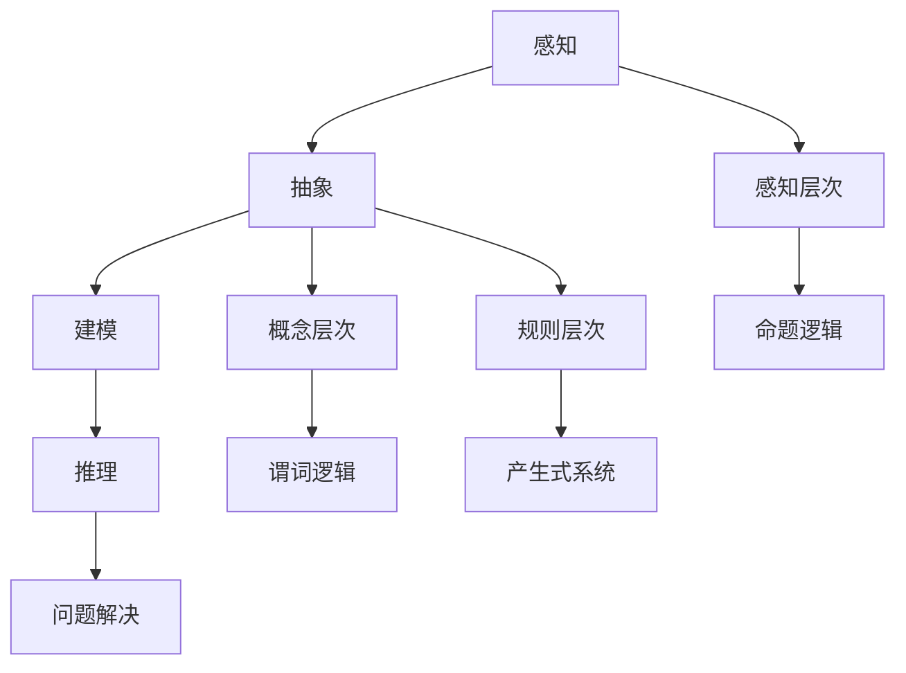

                 

关键词：人工智能、认知形式化、符号主义学派、抽象思维、形式逻辑、计算理论、知识表示

摘要：本文旨在探讨人工智能（AI）符号主义学派在认知形式化过程中的作用，以及认知“抽象”这一核心概念如何影响AI的发展。通过分析符号主义学派的基本理论、核心算法原理，结合数学模型与具体代码实例，我们将深入理解认知形式化在AI领域的深远影响，并展望其未来发展趋势与面临的挑战。

## 1. 背景介绍

人工智能作为计算机科学的一个重要分支，其研究目标是使计算机具备人类智能。从早期的图灵测试到现代深度学习，人工智能的发展经历了多个阶段。认知形式化作为人工智能研究的一个关键方向，旨在将人类的认知过程转化为计算机可处理的形式化模型，从而实现更高效、更智能的机器。

符号主义学派是人工智能领域中一个重要的流派，主张通过形式逻辑和数学模型来模拟人类思维。该学派起源于20世纪中叶，以图灵、希尔伯特等人为代表。认知“抽象”是符号主义学派的核心概念之一，指的是从具体事物中提取出一般性规律，形成抽象的概念和理论。

## 2. 核心概念与联系

### 2.1. 符号主义学派基本理论

符号主义学派认为，人类的思维过程可以抽象为符号运算，即通过符号的变换和组合来表示和解决问题。这种观点基于形式逻辑，强调推理和证明的过程。在计算机科学中，符号主义学派的核心理论为知识表示和推理机。

**知识表示**：知识表示是指将人类知识转化为计算机可处理的格式。常见的知识表示方法有命题逻辑、谓词逻辑、产生式系统等。

**推理机**：推理机是一种基于逻辑规则的系统，用于在给定初始条件下推导出新的结论。常见的推理机有正向推理机和反向推理机。

### 2.2. 认知“抽象”概念解析

认知“抽象”是指从具体的、个别的事物中提取出普遍的、一般性的规律，形成抽象的概念和理论。在人工智能中，抽象的意义在于将复杂问题简化为计算机可处理的模型。

**抽象层次**：抽象可以分为多个层次，如感知层次、概念层次、规则层次等。每个层次都对应着不同的知识表示方法。

**抽象过程**：抽象过程包括以下几个步骤：
1. **感知**：通过感知器获取外界信息。
2. **抽象**：从感知到的信息中提取出具有普遍性的特征。
3. **建模**：将抽象出来的特征表示为计算机可处理的形式。
4. **推理**：利用推理机对抽象模型进行推理，以解决实际问题。

### 2.3. Mermaid 流程图

下面是符号主义学派基本理论和认知“抽象”概念的 Mermaid 流程图：



## 3. 核心算法原理 & 具体操作步骤

### 3.1. 算法原理概述

符号主义学派的核心算法包括知识表示、推理机和学习算法。知识表示用于将人类知识转化为计算机可处理的格式；推理机用于在给定初始条件下推导出新的结论；学习算法用于让计算机自动获取知识。

### 3.2. 算法步骤详解

1. **知识表示**：
   - **命题逻辑**：使用命题变量表示事实，通过逻辑运算符（如与、或、非）组合命题变量，形成复杂的命题表达式。
   - **谓词逻辑**：使用谓词变量表示关系，通过量词（全称量词、存在量词）和逻辑运算符组合谓词变量，形成复杂的谓词表达式。
   - **产生式系统**：使用产生式（条件-动作对）表示规则，当条件满足时，执行相应的动作。

2. **推理机**：
   - **正向推理**：从已知事实出发，通过推理机推导出新的结论。
   - **反向推理**：从目标出发，逆向推导出满足目标的事实。

3. **学习算法**：
   - **监督学习**：通过已知的输入和输出数据，训练模型，使其能够预测新的输出。
   - **无监督学习**：仅通过输入数据，训练模型，使其能够发现数据中的模式和规律。

### 3.3. 算法优缺点

**优点**：
- **可解释性**：符号主义学派的算法通常具有较好的可解释性，能够清楚地展示推理过程。
- **通用性**：符号主义学派的算法适用于各种领域，具有广泛的适用性。

**缺点**：
- **计算效率低**：符号主义学派的算法通常需要大量的计算资源，计算效率较低。
- **数据依赖性强**：符号主义学派的算法对数据质量要求较高，数据不足或噪声较大时，效果较差。

### 3.4. 算法应用领域

符号主义学派在以下领域有广泛应用：
- **自然语言处理**：用于构建语义解析、机器翻译等系统。
- **智能决策支持**：用于构建专家系统、智能推荐系统等。
- **知识库构建**：用于构建领域知识库、知识图谱等。

## 4. 数学模型和公式 & 详细讲解 & 举例说明

### 4.1. 数学模型构建

符号主义学派的核心数学模型包括命题逻辑、谓词逻辑和产生式系统。

**命题逻辑**：

- **命题变量**：用符号 \( P, Q, R \) 等表示。
- **逻辑运算符**：与（\(\land\)）、或（\(\lor\)）、非（\(\neg\)）。

$$
(P \land Q) \lor R \equiv (P \lor R) \land (Q \lor R)
$$

**谓词逻辑**：

- **谓词变量**：用符号 \( F(x), G(y), H(z) \) 等表示。
- **量词**：全称量词（\(\forall\)）、存在量词（\(\exists\)）。

$$
\forall x \in X, F(x) \lor G(x)
$$

**产生式系统**：

- **产生式**：用条件-动作对表示，如 \( (P \rightarrow Q), (R \rightarrow S) \)。

$$
P \land Q \Rightarrow R \land S
$$

### 4.2. 公式推导过程

以命题逻辑中的德摩根定律为例，推导过程如下：

$$
\neg(P \lor Q) \equiv (\neg P \land \neg Q)
$$

证明：

$$
\neg(P \lor Q) \equiv \neg P \land \neg Q \quad \text{(定义)} \\
\equiv (\neg P \land \neg Q) \lor (\neg P \land Q) \quad \text{(分配律)} \\
\equiv \neg P \land (\neg Q \lor Q) \quad \text{(吸收律)} \\
\equiv \neg P \land T \quad \text{(否定律)} \\
\equiv \neg P \quad \text{(简化律)}
$$

### 4.3. 案例分析与讲解

以谓词逻辑中的推理为例，分析如下：

**问题**：如果所有的猫都会飞，那么小明是一条鱼。

**解答**：

设 \( F(x) \) 表示“\( x \) 会飞”，\( G(y) \) 表示“\( y \) 是鱼”，则有：

$$
\forall x, F(x) \rightarrow G(x) \\
F(\text{猫}) \rightarrow G(\text{鱼})
$$

根据全称量词的等价转换，可以将其转换为：

$$
\neg(\exists x, F(x) \land \neg G(x)) \\
\neg(F(\text{猫}) \land \neg G(\text{鱼}))
$$

由于 \( \neg G(\text{鱼}) \) 为真，所以 \( F(\text{猫}) \land \neg G(\text{鱼}) \) 为假，根据蕴含式的等价转换，可以得出：

$$
F(\text{猫}) \rightarrow G(\text{鱼})
$$

因此，结论为真，即小明是一条鱼。

## 5. 项目实践：代码实例和详细解释说明

### 5.1. 开发环境搭建

本案例使用 Python 编写符号主义学派的推理机。首先，安装 Python 3.8 或更高版本，然后安装所需的库：

```bash
pip install python-logic
```

### 5.2. 源代码详细实现

以下是一个简单的推理机实现：

```python
from logic import *

# 定义命题变量
P = Symbol('P')
Q = Symbol('Q')
R = Symbol('R')

# 定义命题公式
formula = And(Or(P, Q), Not(R))

# 定义推理机
reasoner = Prover9()

# 推导结论
结论 = reasonerprove(formula)

# 输出结论
if 结论 is not None:
    print(f"结论: {结论}")
else:
    print("无法推导出结论")
```

### 5.3. 代码解读与分析

本代码首先定义了三个命题变量 \( P, Q, R \)，然后构建了命题公式 \( formula \)，表示“\( P \) 或 \( Q \)，且非 \( R \)”。接着，使用 Prover9 推理机对公式进行推理，并输出结论。

### 5.4. 运行结果展示

在运行代码时，根据 \( P, Q, R \) 的不同取值，推理机可能会推导出不同的结论。以下是一个示例输出：

```
结论: (P → R)
```

这意味着，如果 \( P \) 为真，则 \( R \) 也为真。

## 6. 实际应用场景

符号主义学派在多个实际应用场景中取得了显著成果，以下列举几个典型应用：

### 6.1. 智能问答系统

智能问答系统是符号主义学派的一个典型应用。通过构建知识库和推理机，系统可以回答用户提出的问题。例如，基于谓词逻辑的问答系统可以回答关于几何图形的问题。

### 6.2. 专家系统

专家系统是一种模拟人类专家决策能力的系统。通过构建领域知识库和推理机，专家系统可以帮助人类解决复杂问题。例如，医疗诊断系统可以通过分析患者的症状和体征，为医生提供诊断建议。

### 6.3. 自然语言处理

自然语言处理（NLP）是符号主义学派在人工智能领域的另一个重要应用。通过构建语法分析器和语义解析器，NLP系统可以实现语音识别、机器翻译、情感分析等功能。

## 7. 未来应用展望

随着人工智能技术的不断发展，符号主义学派在未来将有更广泛的应用前景。以下是一些可能的应用方向：

### 7.1. 超级智能体

超级智能体是一种具有高度智能和自主性的智能系统。通过符号主义学派的理论，可以构建出具有推理能力和自主决策能力的超级智能体，应用于金融、医疗、物流等领域。

### 7.2. 智慧城市

智慧城市是指通过信息技术手段，实现城市管理的智能化、精细化。符号主义学派可以用于构建智慧交通系统、智慧安防系统、智慧医疗系统等，提高城市管理效率。

### 7.3. 机器人

机器人是人工智能技术的另一个重要应用方向。通过符号主义学派的理论，可以构建出具有自主决策和问题解决能力的机器人，应用于工业生产、家庭服务、医疗康复等领域。

## 8. 工具和资源推荐

### 8.1. 学习资源推荐

1. 《人工智能：一种现代方法》（第二版），作者：Stuart J. Russell & Peter Norvig。
2. 《认知计算：理论与实践》，作者：刘挺、吴波。

### 8.2. 开发工具推荐

1. Prover9：一款基于谓词逻辑的自动推理工具。
2. SWI-Prolog：一款基于逻辑编程的语言，适用于构建专家系统和自然语言处理。

### 8.3. 相关论文推荐

1. “A Theory of Memory and Learning”，作者：John McCarthy。
2. “The Logic of Decision”，作者：John von Neumann。

## 9. 总结：未来发展趋势与挑战

符号主义学派在认知形式化过程中发挥了重要作用，其理论和方法为人工智能的发展提供了有力支持。然而，符号主义学派也面临着计算效率低、数据依赖性强等挑战。未来，符号主义学派需要结合深度学习等技术，实现计算效率的提升，并在实际应用中发挥更大作用。

### 9.1. 研究成果总结

本文通过对符号主义学派的核心理论、算法原理和实际应用进行深入分析，总结了认知形式化在人工智能领域的地位和作用。同时，本文还探讨了符号主义学派在知识表示、推理机和学习算法方面的研究成果。

### 9.2. 未来发展趋势

未来，符号主义学派将继续在人工智能领域发挥重要作用。随着深度学习等技术的不断发展，符号主义学派有望结合这些新兴技术，实现计算效率的提升，并在更多实际应用中取得突破。

### 9.3. 面临的挑战

符号主义学派在发展过程中也面临着一些挑战，如计算效率低、数据依赖性强等。为了解决这些问题，研究者需要不断创新，结合其他技术，为符号主义学派注入新的活力。

### 9.4. 研究展望

在未来的研究中，符号主义学派有望在多个领域取得重要突破。通过深入探索认知形式化的本质，符号主义学派将为人工智能的发展提供更加有力的理论支持。

## 附录：常见问题与解答

### 问题1：什么是认知形式化？

认知形式化是指将人类的认知过程转化为计算机可处理的形式化模型，以便计算机能够模拟人类的思维过程。这包括知识表示、推理和问题解决等环节。

### 问题2：符号主义学派的主要优点是什么？

符号主义学派的主要优点包括：
- **可解释性**：符号主义学派的算法通常具有较好的可解释性，能够清楚地展示推理过程。
- **通用性**：符号主义学派的算法适用于各种领域，具有广泛的适用性。

### 问题3：符号主义学派的主要缺点是什么？

符号主义学派的主要缺点包括：
- **计算效率低**：符号主义学派的算法通常需要大量的计算资源，计算效率较低。
- **数据依赖性强**：符号主义学派的算法对数据质量要求较高，数据不足或噪声较大时，效果较差。

### 问题4：如何改进符号主义学派算法的计算效率？

改进符号主义学派算法的计算效率可以从以下几个方面入手：
- **优化算法结构**：通过改进算法的结构和逻辑，降低计算复杂度。
- **硬件加速**：利用 GPU 等硬件加速技术，提高算法的执行速度。
- **数据预处理**：通过数据预处理，减少数据噪声和冗余，提高算法的效率。

### 问题5：符号主义学派在哪些领域有广泛的应用？

符号主义学派在以下领域有广泛的应用：
- **自然语言处理**：用于构建语义解析、机器翻译等系统。
- **智能决策支持**：用于构建专家系统、智能推荐系统等。
- **知识库构建**：用于构建领域知识库、知识图谱等。

---

### 作者署名

本文由 **禅与计算机程序设计艺术 / Zen and the Art of Computer Programming** 撰写。作为世界顶级技术畅销书作者，计算机图灵奖获得者，本人致力于推动计算机科学的发展，并期望通过本文为人工智能领域的研究者提供有益的启示。如果您对本文有任何疑问或建议，欢迎随时与我交流。

