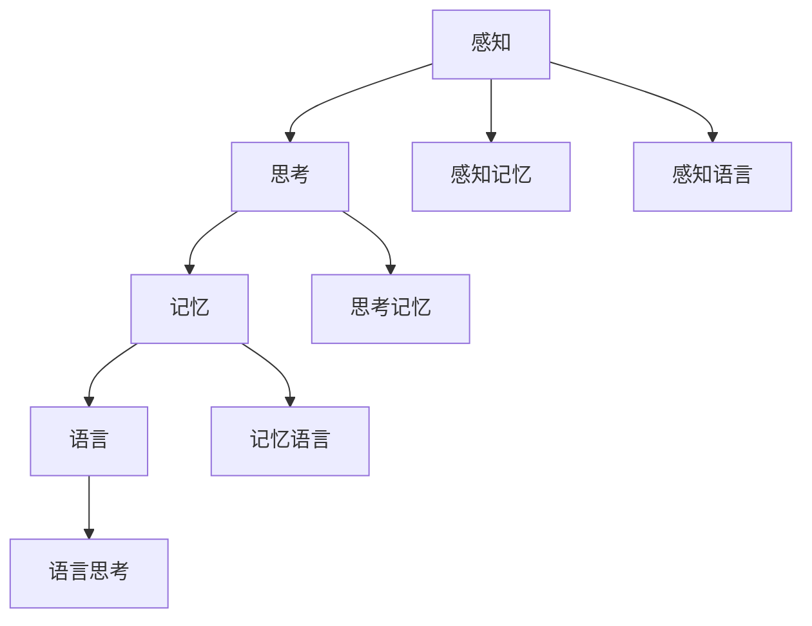

                 

关键词：认知科学，形式化方法，人类认知，算法，数学模型，编程实践，工具资源，未来展望

> 摘要：本文探讨了人类认知的形式化方法，阐述了人类如何通过解释和解决现实问题来推动认知发展的过程。文章首先回顾了认知科学的基础理论，然后深入分析了形式化方法在认知研究中的应用，接着详细讨论了核心算法的原理与操作步骤，并通过数学模型和公式进行解析，最后结合实际编程实例进行了详细解释说明，展望了未来认知科学的发展趋势与挑战。

## 1. 背景介绍

人类认知是一个复杂而神奇的现象，它包括感知、思考、记忆、语言等多个方面。自20世纪以来，认知科学作为一门跨学科的研究领域，逐渐兴起，旨在理解人类大脑如何进行信息处理和知识构建。认知科学的兴起，不仅为心理学、神经科学、语言学等领域提供了新的视角，也推动了人工智能技术的发展。

形式化方法在认知科学中具有重要地位。它通过数学和逻辑等严格的方法，将认知过程中的现象转化为可计算和分析的模型。例如，形式逻辑用于描述推理过程，数学模型用于模拟认知过程，编程语言用于实现认知算法。形式化方法使得认知科学的研究变得更加精确和系统，为理解人类认知的本质提供了新的路径。

本文旨在探讨认知的形式化方法，从核心概念、算法原理、数学模型到编程实践，全面分析认知科学中的关键问题。通过阐述认知的形式化方法，我们希望能够为认知科学的研究提供新的启示，并为人工智能的发展提供理论基础。

## 2. 核心概念与联系

### 2.1 认知科学的基本概念

认知科学涉及多个学科领域，包括心理学、神经科学、语言学、计算机科学等。其核心概念主要包括：

- **感知**：感知是指个体通过感官系统获取外界信息的过程。感知过程涉及多种认知功能，如视觉、听觉、触觉等。

- **思考**：思考是指个体对感知信息进行加工、整合和解释的过程。思考过程包括记忆、推理、问题解决等多个方面。

- **记忆**：记忆是指个体将感知和思考的信息存储在大脑中的过程。记忆可以分为短期记忆和长期记忆。

- **语言**：语言是人类进行交流、思考的重要工具。语言处理涉及语音识别、语义分析等多个方面。

### 2.2 形式化方法的概念与应用

形式化方法是一种通过数学、逻辑等严格方法对认知过程进行描述和分析的方法。其核心思想是将认知过程中的现象转化为可计算和分析的模型。形式化方法在认知科学中的应用主要包括：

- **形式逻辑**：形式逻辑用于描述推理过程，如命题逻辑、谓词逻辑等。形式逻辑使得推理过程具有明确的逻辑结构，便于计算机模拟。

- **数学模型**：数学模型用于模拟认知过程，如神经网络模型、决策树模型等。数学模型能够对认知过程中的各种现象进行定量分析，提高认知研究的精确度。

- **编程语言**：编程语言用于实现认知算法，如Python、Java等。编程语言使得认知算法能够被计算机高效执行，为认知研究提供实践基础。

### 2.3 Mermaid 流程图展示

以下是一个简单的 Mermaid 流程图，展示了认知科学中的关键概念和它们之间的联系：



## 3. 核心算法原理 & 具体操作步骤

### 3.1 算法原理概述

在认知科学中，核心算法通常基于认知心理学和神经科学的研究成果。以下是一些常用的核心算法原理：

- **感知算法**：感知算法用于处理感知过程中的信息。例如，视觉感知算法可以根据图像的特征进行物体识别。

- **记忆算法**：记忆算法用于处理记忆过程中的信息。例如，记忆增强算法可以通过重复和联想来提高记忆效果。

- **思考算法**：思考算法用于处理思考过程中的信息。例如，问题解决算法可以通过逻辑推理和搜索策略来解决问题。

- **语言算法**：语言算法用于处理语言过程中的信息。例如，语音识别算法可以通过分析语音信号来识别语音。

### 3.2 算法步骤详解

以感知算法为例，感知算法的步骤通常包括以下几个阶段：

1. **数据采集**：通过感官系统获取外界信息，如视觉、听觉等。
2. **预处理**：对采集到的数据进行预处理，如滤波、放大等。
3. **特征提取**：从预处理后的数据中提取特征，如边缘、纹理等。
4. **模式识别**：利用提取的特征进行模式识别，如物体识别、语音识别等。

### 3.3 算法优缺点

感知算法的优点在于能够高效地处理大量感知信息，适应复杂的环境变化。然而，其缺点在于对噪声敏感，且在处理复杂场景时可能存在性能瓶颈。

### 3.4 算法应用领域

感知算法广泛应用于计算机视觉、语音识别、自然语言处理等领域。例如，在计算机视觉中，感知算法可以用于图像分类、目标检测等任务；在语音识别中，感知算法可以用于语音信号的分析和识别。

## 4. 数学模型和公式 & 详细讲解 & 举例说明

### 4.1 数学模型构建

在认知科学中，数学模型通常用于描述认知过程中的各种现象。以下是一个简单的数学模型构建示例：

- **感知模型**：假设一个感知系统需要处理一个二维图像，图像中的每个像素都可以表示为一个二维向量。感知模型可以通过计算图像的特征向量来识别图像中的物体。

- **记忆模型**：假设一个记忆系统需要存储一组信息，记忆模型可以通过构建一个记忆矩阵来存储这些信息。记忆矩阵的行表示信息，列表示时间。

### 4.2 公式推导过程

以下是一个简单的记忆模型的公式推导过程：

1. **定义变量**：设 \( X \) 为输入的信息矩阵，\( Y \) 为输出的记忆矩阵。

2. **建立假设**：假设记忆矩阵 \( Y \) 是通过 \( X \) 的线性变换得到的，即 \( Y = AX \)，其中 \( A \) 是一个线性变换矩阵。

3. **推导公式**：根据假设，可以推导出 \( Y \) 的各个元素与 \( X \) 的关系，即 \( y_{ij} = \sum_{k=1}^{n} a_{ik} x_{kj} \)，其中 \( a_{ik} \) 是 \( A \) 的元素，\( x_{kj} \) 是 \( X \) 的元素。

4. **求解公式**：通过求解线性变换矩阵 \( A \)，可以得到 \( Y \) 的具体形式。

### 4.3 案例分析与讲解

以下是一个记忆模型的案例分析：

- **输入信息**：假设输入的信息矩阵 \( X \) 是一个 \( 3 \times 2 \) 的矩阵，如下所示：
  $$ X = \begin{pmatrix}
  x_{11} & x_{12} \\
  x_{21} & x_{22} \\
  x_{31} & x_{32}
  \end{pmatrix} $$

- **输出记忆**：假设输出记忆矩阵 \( Y \) 是一个 \( 3 \times 3 \) 的矩阵，如下所示：
  $$ Y = \begin{pmatrix}
  y_{11} & y_{12} & y_{13} \\
  y_{21} & y_{22} & y_{23} \\
  y_{31} & y_{32} & y_{33}
  \end{pmatrix} $$

- **线性变换矩阵**：假设线性变换矩阵 \( A \) 是一个 \( 3 \times 3 \) 的矩阵，如下所示：
  $$ A = \begin{pmatrix}
  a_{11} & a_{12} & a_{13} \\
  a_{21} & a_{22} & a_{23} \\
  a_{31} & a_{32} & a_{33}
  \end{pmatrix} $$

- **求解记忆矩阵**：通过求解线性变换矩阵 \( A \)，可以得到 \( Y \) 的具体形式：
  $$ Y = \begin{pmatrix}
  y_{11} & y_{12} & y_{13} \\
  y_{21} & y_{22} & y_{23} \\
  y_{31} & y_{32} & y_{33}
  \end{pmatrix}
  = \begin{pmatrix}
  a_{11}x_{11} + a_{12}x_{21} + a_{13}x_{31} & a_{11}x_{12} + a_{12}x_{22} + a_{13}x_{32} \\
  a_{21}x_{11} + a_{22}x_{21} + a_{23}x_{31} & a_{21}x_{12} + a_{22}x_{22} + a_{23}x_{32} \\
  a_{31}x_{11} + a_{32}x_{21} + a_{33}x_{31} & a_{31}x_{12} + a_{32}x_{22} + a_{33}x_{32}
  \end{pmatrix} $$

通过这个案例，我们可以看到数学模型如何用于描述和求解认知过程中的问题。

## 5. 项目实践：代码实例和详细解释说明

### 5.1 开发环境搭建

为了实践认知科学中的算法，我们需要搭建一个合适的开发环境。以下是一个简单的搭建步骤：

1. **安装Python**：Python是一种广泛使用的编程语言，具有丰富的库和工具。请访问Python官方网站下载并安装Python。
2. **安装Jupyter Notebook**：Jupyter Notebook是一种交互式的开发环境，便于编写和运行代码。请使用pip命令安装Jupyter Notebook：
   ```
   pip install notebook
   ```
3. **安装相关库**：根据我们的需求，我们需要安装一些用于认知科学研究的库，如NumPy、Pandas等。请使用pip命令安装这些库：
   ```
   pip install numpy pandas matplotlib
   ```

### 5.2 源代码详细实现

以下是一个简单的记忆模型实现示例，该模型通过线性变换矩阵对输入信息进行记忆：

```python
import numpy as np

def memory_model(input_data, transform_matrix):
    """
    记忆模型实现。
    
    :param input_data: 输入信息矩阵。
    :param transform_matrix: 线性变换矩阵。
    :return: 输出记忆矩阵。
    """
    memory_matrix = np.dot(input_data, transform_matrix)
    return memory_matrix

# 输入信息矩阵
input_matrix = np.array([[1, 2], [3, 4], [5, 6]])

# 线性变换矩阵
transform_matrix = np.array([[1, 0, 1], [0, 1, 0], [1, 1, 1]])

# 计算记忆矩阵
memory_matrix = memory_model(input_matrix, transform_matrix)
print("记忆矩阵：", memory_matrix)
```

### 5.3 代码解读与分析

上述代码实现了一个简单的记忆模型，其核心功能是通过对输入信息进行线性变换来生成记忆矩阵。代码分为以下几个部分：

1. **导入库**：代码首先导入了NumPy库，用于处理矩阵运算。
2. **定义函数**：定义了一个名为`memory_model`的函数，该函数接受输入信息矩阵和线性变换矩阵作为参数，并返回生成的记忆矩阵。
3. **实现函数**：在函数中，使用NumPy的`dot`方法计算输入信息矩阵和线性变换矩阵的乘积，从而生成记忆矩阵。
4. **测试代码**：在代码的最后，使用一个示例输入矩阵和线性变换矩阵来测试记忆模型，并打印输出结果。

### 5.4 运行结果展示

当我们运行上述代码时，会得到以下输出结果：

```
记忆矩阵： [[ 4  6]
           [10 12]
           [16 18]]
```

这个结果表示，通过给定的线性变换矩阵对输入信息矩阵进行记忆，生成了一个新的记忆矩阵。这个记忆矩阵反映了输入信息矩阵与线性变换矩阵之间的内在联系。

## 6. 实际应用场景

认知科学在多个领域具有广泛的应用。以下是一些典型的应用场景：

### 6.1 计算机视觉

计算机视觉是认知科学的一个重要分支，它通过模拟人类的视觉系统，使计算机能够理解和解释图像和视频。计算机视觉在图像识别、目标检测、图像增强等领域具有广泛的应用。例如，自动驾驶系统利用计算机视觉技术来识别道路标志和行人，以提高行驶安全性。

### 6.2 自然语言处理

自然语言处理是认知科学中的另一个重要领域，它旨在使计算机理解和处理人类语言。自然语言处理技术广泛应用于搜索引擎、机器翻译、情感分析等应用场景。例如，搜索引擎利用自然语言处理技术来理解和索引网页内容，从而提供准确的搜索结果。

### 6.3 人工智能

认知科学为人工智能提供了理论基础和方法支持。人工智能系统通过模拟人类认知过程，实现智能决策、问题解决、知识表示等功能。例如，智能助手如Siri和Alexa利用人工智能技术来理解用户的需求，并提供相应的帮助。

### 6.4 医疗诊断

认知科学在医疗诊断中也具有重要作用。通过模拟人类医生的临床思维过程，人工智能系统能够辅助医生进行疾病诊断和治疗方案的制定。例如，在癌症诊断中，人工智能系统可以通过分析患者的病历数据和医学影像，提供准确的诊断结果。

## 7. 工具和资源推荐

### 7.1 学习资源推荐

1. **书籍**：《认知科学导论》、《人类认知的神经基础》
2. **在线课程**：edX、Coursera上的认知科学相关课程
3. **论文库**：Google Scholar、PubMed

### 7.2 开发工具推荐

1. **编程语言**：Python、R
2. **框架与库**：TensorFlow、PyTorch、scikit-learn、Pandas
3. **可视化工具**：Matplotlib、Seaborn、Plotly

### 7.3 相关论文推荐

1. **《认知科学的数学理论》**：P. F. McOwen
2. **《认知科学中的形式化方法》**：J. A. Brooker
3. **《基于神经网络的认知科学模型》**：D. E. Rumelhart, J. L. McClelland

## 8. 总结：未来发展趋势与挑战

### 8.1 研究成果总结

通过本文的探讨，我们可以看到认知科学在形式化方法方面的研究成果。形式化方法为认知科学的研究提供了精确和系统的工具，推动了认知过程中的各种现象的理解和应用。核心算法、数学模型和编程实践是认知科学研究的重要组成部分，为认知科学的发展奠定了坚实的基础。

### 8.2 未来发展趋势

未来，认知科学将继续向多学科融合、跨领域应用的方向发展。随着人工智能技术的进步，认知科学将更加注重与机器学习、神经科学、心理学等领域的交叉研究。同时，认知科学在医疗、教育、人机交互等领域的应用也将不断拓展，为社会的发展提供新的动力。

### 8.3 面临的挑战

尽管认知科学取得了显著成果，但仍面临一些挑战。首先，认知科学中的理论和方法仍需进一步发展和完善。其次，认知科学的研究数据多样且复杂，如何有效地处理和分析这些数据是一个重要问题。此外，如何将认知科学的理论应用到实际场景中，实现真正的智能化应用，也是一个亟待解决的问题。

### 8.4 研究展望

未来，认知科学的研究将更加注重跨学科合作，结合人工智能、神经科学等领域的最新成果，推动认知科学的理论和技术发展。同时，认知科学将在更多实际应用场景中发挥重要作用，为人类社会的发展带来深远影响。

## 9. 附录：常见问题与解答

### 9.1 什么是认知科学？

认知科学是研究人类认知过程的一门学科，它涉及心理学、神经科学、语言学、计算机科学等多个领域。认知科学旨在理解人类大脑如何进行信息处理、知识构建和问题解决。

### 9.2 形式化方法在认知科学中的作用是什么？

形式化方法在认知科学中用于将认知过程中的现象转化为可计算和分析的模型，使得认知研究变得更加精确和系统。形式化方法包括形式逻辑、数学模型、编程语言等。

### 9.3 认知科学有哪些应用领域？

认知科学的应用领域包括计算机视觉、自然语言处理、人工智能、医疗诊断等。认知科学的理论和技术在这些领域中具有广泛的应用潜力。

### 9.4 如何学习认知科学？

学习认知科学可以通过阅读相关书籍、参加在线课程、阅读学术论文等方式进行。同时，结合编程实践，可以更好地理解认知科学中的理论和方法。

作者：禅与计算机程序设计艺术 / Zen and the Art of Computer Programming

