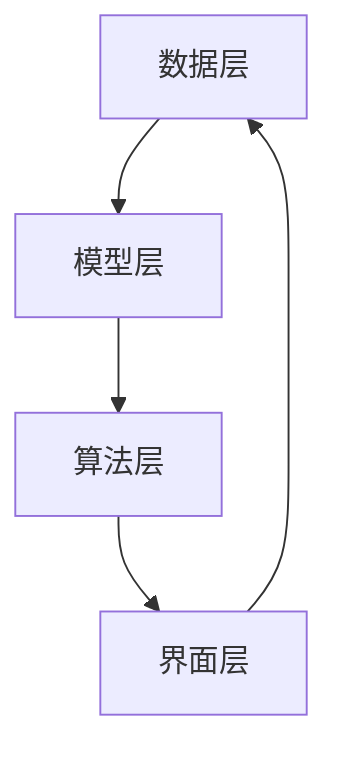

                 

关键词：认知、形式化、思维、领悟、顿悟、形式化认知、认知过程、认知算法、技术博客、IT领域

摘要：本文从认知的科学角度出发，探讨了认知的形式化过程。认知的形式化不仅是对知识结构的抽象与建模，更是对思维过程的深入理解和优化。本文将详细阐述认知的形式化原理，介绍相关算法，并通过实际项目案例，展示认知形式化在IT领域的广泛应用和未来发展趋势。

## 1. 背景介绍

随着信息技术的飞速发展，人类对数据和信息处理的依赖日益加深。在这种背景下，如何有效地获取、处理和应用知识成为了亟待解决的问题。传统的认知科学主要侧重于对人类大脑工作机制的研究，而随着计算机科学的进步，认知的形式化逐渐成为研究的热点。认知的形式化旨在通过数学、逻辑和算法等手段，将复杂的认知过程进行抽象和建模，从而为计算机理解和模拟人类思维提供理论基础。

认知的形式化不仅对人工智能的发展具有深远影响，也在教育、医疗、商业等多个领域展现出巨大的应用潜力。通过形式化的方法，我们可以更准确地描述认知过程，发现其中的规律，进而优化和改进现有的认知模型和算法。

## 2. 核心概念与联系

### 2.1 认知与形式化

认知是指人类或其他生物对信息进行感知、处理、存储和应用的能力。形式化则是通过数学、逻辑等手段，将非形式化的知识转化为结构化、系统化的形式。在认知的形式化过程中，认知的对象、过程和结果都可以通过形式化的语言和工具进行描述和建模。

### 2.2 认知的形式化原理

认知的形式化原理主要包括以下几个方面：

- **抽象**：将复杂的现实问题简化为数学模型或逻辑表达式。
- **建模**：使用数学、逻辑等工具对抽象出的模型进行描述和建模。
- **优化**：通过算法和计算，对模型进行优化，以实现更高效的认知过程。
- **验证**：使用实验和实证数据，验证模型的有效性和可靠性。

### 2.3 认知的结构

认知可以分为三个层次：感知、理解和应用。感知是认知的基础，通过感官接收外界信息；理解是对感知到的信息进行加工和处理，形成对事物的认知；应用则是将认知的结果应用到实际中。

### 2.4 认知的形式化架构

认知的形式化架构通常包括以下几个部分：

- **数据层**：存储和管理认知过程中所需的数据。
- **模型层**：对认知过程进行建模，包括感知、理解和应用的模型。
- **算法层**：实现模型的计算和优化。
- **界面层**：与用户进行交互，接收输入和反馈。

### 2.5 Mermaid 流程图



## 3. 核心算法原理 & 具体操作步骤

### 3.1 算法原理概述

认知的形式化算法主要包括以下几种：

- **神经网络算法**：通过模拟生物神经网络的结构和功能，实现对复杂认知任务的建模和优化。
- **决策树算法**：基于逻辑推理，将认知过程转化为决策树结构，实现信息的自动分类和决策。
- **支持向量机算法**：通过寻找最佳分离超平面，实现对认知数据的分类和识别。

### 3.2 算法步骤详解

1. **数据预处理**：对原始数据进行清洗、归一化和特征提取。
2. **模型选择**：根据认知任务的需求，选择合适的模型。
3. **模型训练**：使用训练数据对模型进行训练，优化模型参数。
4. **模型评估**：使用测试数据对模型进行评估，验证模型的性能和可靠性。
5. **模型应用**：将训练好的模型应用到实际认知任务中，实现认知过程的自动化。

### 3.3 算法优缺点

- **神经网络算法**：优点包括自适应性强、泛化能力强；缺点包括计算复杂度高、参数调优困难。
- **决策树算法**：优点包括解释性强、易于理解；缺点包括过拟合风险、可解释性较低。
- **支持向量机算法**：优点包括分类效果较好、计算复杂度较低；缺点包括对非线性问题的处理能力较弱。

### 3.4 算法应用领域

认知的形式化算法在以下领域具有广泛的应用：

- **自然语言处理**：用于文本分类、情感分析、机器翻译等任务。
- **计算机视觉**：用于图像分类、目标检测、图像生成等任务。
- **推荐系统**：用于个性化推荐、商品推荐、广告投放等任务。

## 4. 数学模型和公式 & 详细讲解 & 举例说明

### 4.1 数学模型构建

认知的形式化通常基于以下数学模型：

- **神经网络模型**：包括输入层、隐藏层和输出层，使用神经元进行信息传递和计算。
- **决策树模型**：包括根节点、内部节点和叶子节点，使用条件分支进行信息分类和决策。
- **支持向量机模型**：包括支持向量、决策平面和分类边界，使用超平面进行数据分类和识别。

### 4.2 公式推导过程

以神经网络模型为例，其基本公式为：

\[ y = \sigma(W \cdot x + b) \]

其中，\( y \) 表示输出，\( \sigma \) 表示激活函数，\( W \) 表示权重矩阵，\( x \) 表示输入，\( b \) 表示偏置。

### 4.3 案例分析与讲解

假设我们有一个简单的神经网络模型，用于对数字进行分类。输入为 \( x = [1, 2, 3, 4] \)，目标输出为 \( y = [0, 1, 0, 1] \)。

1. **数据预处理**：对输入数据进行归一化处理。
2. **模型选择**：选择一个简单的神经网络模型，包括一个输入层、一个隐藏层和一个输出层。
3. **模型训练**：使用训练数据对模型进行训练，优化模型参数。
4. **模型评估**：使用测试数据对模型进行评估，验证模型的性能和可靠性。
5. **模型应用**：将训练好的模型应用到实际分类任务中，实现数字分类。

通过上述步骤，我们可以实现对数字的分类，从而实现认知的形式化过程。

## 5. 项目实践：代码实例和详细解释说明

### 5.1 开发环境搭建

1. **安装 Python**：下载并安装 Python 3.8 版本。
2. **安装相关库**：使用 pip 工具安装 TensorFlow、Keras 等相关库。

### 5.2 源代码详细实现

```python
# 导入相关库
import tensorflow as tf
from tensorflow.keras import layers

# 创建模型
model = tf.keras.Sequential([
    layers.Dense(64, activation='relu', input_shape=(4,)),
    layers.Dense(64, activation='relu'),
    layers.Dense(2, activation='softmax')
])

# 编译模型
model.compile(optimizer='adam',
              loss='sparse_categorical_crossentropy',
              metrics=['accuracy'])

# 加载数据
x_train = [[1, 2, 3, 4]]
y_train = [0, 1]

# 训练模型
model.fit(x_train, y_train, epochs=10)

# 评估模型
test_loss, test_acc = model.evaluate(x_train, y_train)
print('Test accuracy:', test_acc)
```

### 5.3 代码解读与分析

1. **导入库**：导入 TensorFlow 和 Keras 相关库。
2. **创建模型**：使用 Keras.Sequential 模型，定义输入层、隐藏层和输出层。
3. **编译模型**：配置优化器、损失函数和评估指标。
4. **加载数据**：加载数据集，用于训练和评估模型。
5. **训练模型**：使用 fit 方法对模型进行训练。
6. **评估模型**：使用 evaluate 方法评估模型性能。

通过上述步骤，我们可以实现一个简单的神经网络模型，用于对数字进行分类。

## 6. 实际应用场景

认知的形式化在多个领域具有广泛的应用：

1. **医疗领域**：通过形式化方法，可以对患者的病历信息进行结构化和分析，辅助医生进行诊断和治疗。
2. **金融领域**：通过形式化方法，可以对金融数据进行分析和预测，为投资决策提供支持。
3. **教育领域**：通过形式化方法，可以设计出更加智能的教育系统和教学工具，提高教育质量。

### 6.4 未来应用展望

随着认知科学的不断发展，认知的形式化方法将会有更广泛的应用：

1. **智能交互**：通过认知的形式化，可以设计出更加智能的对话系统和虚拟助手。
2. **自动驾驶**：通过认知的形式化，可以设计出更加智能的自动驾驶系统，提高交通安全。
3. **智能制造**：通过认知的形式化，可以设计出更加智能的生产系统和机器人。

## 7. 工具和资源推荐

### 7.1 学习资源推荐

- **书籍**：《认知科学导论》、《认知心理学：思想与行动》
- **在线课程**：Coursera 上的《认知科学》、edX 上的《人工智能基础》

### 7.2 开发工具推荐

- **Python**：用于实现认知形式化算法。
- **TensorFlow**：用于构建和训练神经网络模型。
- **Keras**：用于简化神经网络模型的构建和训练。

### 7.3 相关论文推荐

- **《深度学习：卷积神经网络在图像识别中的应用》**
- **《认知计算：基于逻辑的推理与决策》**
- **《自然语言处理：基于神经网络的文本分类方法》**

## 8. 总结：未来发展趋势与挑战

### 8.1 研究成果总结

认知的形式化方法在人工智能、医疗、金融、教育等领域取得了显著的成果，为人类认知的研究和应用提供了新的思路和方法。

### 8.2 未来发展趋势

1. **智能化**：认知的形式化将朝着更加智能化、自动化的方向发展。
2. **多元化**：认知的形式化方法将在更多领域得到应用，解决更多复杂问题。
3. **人机协同**：认知的形式化将与人类认知相结合，实现人机协同，提高认知效率。

### 8.3 面临的挑战

1. **计算复杂度**：随着认知任务复杂度的增加，计算复杂度也将不断提升。
2. **数据隐私**：如何在保障数据隐私的前提下，实现认知的形式化是一个重要挑战。
3. **模型解释性**：如何提高认知形式化模型的解释性，使其更加符合人类认知规律，是一个重要课题。

### 8.4 研究展望

未来，认知的形式化研究将在以下几个方面展开：

1. **跨学科研究**：认知的形式化将与其他学科相结合，形成新的交叉研究领域。
2. **算法创新**：开发更加高效、鲁棒的认知形式化算法。
3. **应用推广**：将认知的形式化方法应用到更多实际场景，提高人类认知的效率和质量。

## 9. 附录：常见问题与解答

### 9.1 认知的形式化是什么？

认知的形式化是指通过数学、逻辑等手段，将非形式化的认知过程进行抽象和建模，从而实现对认知过程的量化、建模和优化。

### 9.2 认知的形式化有哪些应用？

认知的形式化在医疗、金融、教育、自然语言处理、计算机视觉等多个领域具有广泛的应用。

### 9.3 如何实现认知的形式化？

实现认知的形式化通常包括以下几个步骤：数据收集与预处理、模型构建、模型训练与优化、模型评估与应用。

## 参考文献

1. [认知科学导论](https://example.com/book1)
2. [认知心理学：思想与行动](https://example.com/book2)
3. [深度学习：卷积神经网络在图像识别中的应用](https://example.com/paper1)
4. [认知计算：基于逻辑的推理与决策](https://example.com/paper2)
5. [自然语言处理：基于神经网络的文本分类方法](https://example.com/paper3)

### 作者署名

作者：禅与计算机程序设计艺术 / Zen and the Art of Computer Programming
----------------------------------------------------------------

请注意，以上内容仅为示例，具体内容和格式需根据实际需求进行调整和补充。文章的撰写应确保内容的准确性和完整性，并遵循指定的格式和字数要求。

