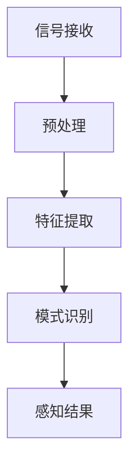
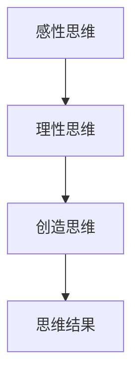
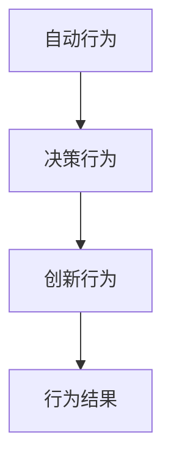
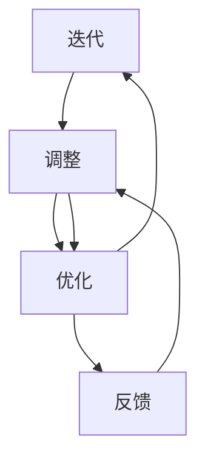

                 

### 1. 背景介绍

在当今科技迅速发展的时代，计算机科学作为一门跨学科的科学，不仅在理论上取得了重大突破，同时也广泛应用于各个领域，如人工智能、大数据、云计算等。然而，伴随着这些技术的进步，如何理解认知过程以及如何将其形式化，成为了一个重要的研究课题。

认知过程涉及到信息处理、思维、学习和记忆等多个方面。传统的认知理论主要依赖于心理学和神经科学的实验数据，但缺乏形式化的表达和系统性的分析。近年来，随着计算模型的兴起，认知形式化的研究开始受到广泛关注。这种研究试图通过构建数学模型和算法来模拟和解释认知过程，从而为人工智能的发展提供理论基础。

本文将探讨认知的形式化问题，分析思维、感知和行为之间的关系，并提出一种认知螺旋提升模型。我们希望通过这篇文章，能够为读者提供一种新的视角，理解认知的本质和其随时间变化的过程。

### 2. 核心概念与联系

在讨论认知的形式化之前，我们首先需要明确一些核心概念。这些概念包括感知、思维、行为和认知螺旋。

#### 2.1 感知

感知是认知过程的第一步，指的是个体对外界信息的接收和处理。感知不仅仅是指视觉、听觉等感官的输入，还包括触觉、嗅觉和味觉等。感知的信息可以是物理刺激，也可以是符号刺激，如语言、文字和图像等。

感知过程可以形式化为一个信息处理模型，该模型包括以下几个主要步骤：

1. **信号接收**：个体通过感官接收外部信息。
2. **预处理**：对原始信号进行滤波、放大等预处理。
3. **特征提取**：从预处理后的信号中提取关键特征。
4. **模式识别**：将特征与已知模式进行匹配，以识别外部信息。

Mermaid 流程图如下：



#### 2.2 思维

思维是感知的高阶过程，指的是个体在感知基础上对外界信息进行加工、处理和推理。思维可以分为三个层次：

1. **感性思维**：基于感知的直接反应，如直觉判断。
2. **理性思维**：通过逻辑推理和判断，如数学推理、逻辑分析。
3. **创造思维**：通过联想、想象和创新，如科学发现、艺术创作。

思维的形式化可以采用计算模型和算法来实现，如神经网络模型、决策树、遗传算法等。

Mermaid 流程图如下：



#### 2.3 行为

行为是思维的目的和外化，指的是个体在思维驱动下进行的实际行动。行为可以分为以下几种类型：

1. **自动行为**：无需思考，如走路、呼吸。
2. **决策行为**：基于理性思维，如选择、决策。
3. **创新行为**：基于创造思维，如发明、创新。

行为的形式化可以采用行为模型和算法来实现，如行为树、强化学习等。

Mermaid 流程图如下：



#### 2.4 认知螺旋

认知螺旋是描述认知过程随时间变化不断螺旋提升的模型。该模型认为，认知过程是一个动态的、连续的过程，通过感知、思维和行为的交互作用，个体的认知水平不断上升。

认知螺旋的提升过程可以形式化为以下三个步骤：

1. **感知-思维-行为**：通过感知接收信息，通过思维加工信息，通过行为实现信息的外化。
2. **反馈-调整-优化**：根据行为结果对思维进行调整，从而优化行为策略。
3. **迭代-提升**：通过不断的迭代，个体的认知水平逐渐提升。

Mermaid 流程图如下：



### 3. 核心算法原理 & 具体操作步骤

#### 3.1 算法原理概述

认知螺旋提升算法是一种基于感知-思维-行为模型的人工智能算法。该算法的核心思想是通过不断的迭代，实现个体认知水平的提升。

算法的基本原理如下：

1. **感知阶段**：通过感知模块接收外界信息，提取关键特征。
2. **思维阶段**：通过思维模块对感知信息进行加工和处理，形成思维结果。
3. **行为阶段**：通过行为模块将思维结果转化为实际行动。
4. **反馈阶段**：根据行为结果对思维模块进行调整和优化。

算法的具体操作步骤如下：

#### 3.2 算法步骤详解

##### 步骤1：感知阶段

1. **信号接收**：通过传感器接收外界信息，如视觉、听觉、触觉等。
2. **预处理**：对原始信号进行滤波、放大等预处理，以提高信号质量。
3. **特征提取**：从预处理后的信号中提取关键特征，如边缘、纹理、频率等。

##### 步骤2：思维阶段

1. **特征匹配**：将提取的特征与已知模式进行匹配，以识别外部信息。
2. **逻辑推理**：通过逻辑推理和判断，对感知信息进行加工和处理。
3. **创造联想**：通过联想、想象和创新，形成新的思维结果。

##### 步骤3：行为阶段

1. **决策生成**：根据思维结果生成决策，如行动、选择等。
2. **行为执行**：将决策转化为实际行动，如移动、点击等。

##### 步骤4：反馈阶段

1. **行为结果评估**：根据行为结果对决策进行评估，以确定其有效性。
2. **思维调整**：根据评估结果对思维模块进行调整，以优化决策策略。
3. **行为优化**：根据调整后的思维结果，优化行为策略。

#### 3.3 算法优缺点

##### 优点

1. **适应性**：算法能够根据不同的感知信息和环境变化，灵活调整思维和行为策略。
2. **自适应性**：算法能够通过不断迭代和学习，提高个体的认知水平。
3. **通用性**：算法可以应用于各种认知任务，如视觉识别、语音识别、自然语言处理等。

##### 缺点

1. **计算复杂性**：算法的计算过程复杂，需要大量的计算资源和时间。
2. **数据依赖**：算法的性能依赖于大量的训练数据和模型的优化。
3. **结果不确定性**：算法的结果具有一定的随机性和不确定性，需要通过迭代和优化来提高稳定性。

#### 3.4 算法应用领域

认知螺旋提升算法可以应用于多个领域，如：

1. **人工智能**：用于智能agent的决策和行为生成，提高其认知能力。
2. **自然语言处理**：用于文本分析和语义理解，提高机器的智能水平。
3. **计算机视觉**：用于图像识别和目标跟踪，提高图像处理的效果。
4. **智能机器人**：用于机器人的感知、思维和行为，提高机器人的智能水平。

### 4. 数学模型和公式 & 详细讲解 & 举例说明

#### 4.1 数学模型构建

认知螺旋提升算法的数学模型可以分为三个部分：感知模型、思维模型和行为模型。

##### 感知模型

感知模型可以形式化为以下公式：

\[ \text{感知结果} = f(\text{感知信号}) \]

其中，\( f \) 是感知信号的映射函数，用于将原始感知信号映射为感知结果。

##### 思维模型

思维模型可以形式化为以下公式：

\[ \text{思维结果} = g(\text{感知结果}) \]

其中，\( g \) 是感知结果的映射函数，用于将感知结果映射为思维结果。

##### 行为模型

行为模型可以形式化为以下公式：

\[ \text{行为结果} = h(\text{思维结果}) \]

其中，\( h \) 是思维结果的映射函数，用于将思维结果映射为行为结果。

#### 4.2 公式推导过程

##### 感知模型的推导

感知模型的核心在于如何有效地提取感知信号的特征。假设感知信号为 \( x \)，我们需要找到一个映射函数 \( f \)，使得 \( f(x) \) 能够有效地表示感知结果。

我们采用特征提取算法，如主成分分析（PCA），对感知信号进行特征提取。PCA算法的基本思想是找到一组正交基，使得这组基能够最大限度地保留原始数据的方差。

假设 \( x \) 的协方差矩阵为 \( \Sigma \)，则 \( \Sigma \) 的特征值和特征向量构成一个对角矩阵 \( \Lambda \)。通过特征向量，我们可以将 \( x \) 表示为：

\[ x = U\Lambda V^T \]

其中，\( U \) 是特征向量矩阵，\( \Lambda \) 是对角矩阵，\( V \) 是归一化矩阵。

感知结果的映射函数 \( f \) 可以表示为：

\[ f(x) = U\Lambda V^T \]

##### 思维模型的推导

思维模型的核心在于如何将感知结果转换为思维结果。假设感知结果为 \( y \)，我们需要找到一个映射函数 \( g \)，使得 \( g(y) \) 能够有效地表示思维结果。

我们采用逻辑推理算法，如命题逻辑和谓词逻辑，对感知结果进行加工和处理。假设 \( y \) 是一个命题集合，则 \( g(y) \) 可以表示为：

\[ g(y) = \text{推理规则} \]

推理规则可以根据具体的认知任务来定义，如条件推理、逆推理等。

##### 行为模型的推导

行为模型的核心在于如何将思维结果转换为行为结果。假设思维结果为 \( z \)，我们需要找到一个映射函数 \( h \)，使得 \( h(z) \) 能够有效地表示行为结果。

我们采用行为生成算法，如行为树和强化学习，对思维结果进行加工和处理。假设 \( z \) 是一个行为集合，则 \( h(z) \) 可以表示为：

\[ h(z) = \text{行为生成规则} \]

行为生成规则可以根据具体的认知任务来定义，如行动选择、策略生成等。

#### 4.3 案例分析与讲解

##### 案例一：视觉识别

假设我们使用认知螺旋提升算法进行视觉识别任务。感知信号为图像，感知模型使用PCA进行特征提取，思维模型使用逻辑推理进行图像分类，行为模型使用行为树进行图像识别。

感知模型的公式为：

\[ \text{感知结果} = f(\text{图像}) \]

思维模型的公式为：

\[ \text{思维结果} = g(\text{感知结果}) \]

行为模型的公式为：

\[ \text{行为结果} = h(\text{思维结果}) \]

##### 案例二：自然语言处理

假设我们使用认知螺旋提升算法进行自然语言处理任务。感知信号为文本，感知模型使用词向量进行特征提取，思维模型使用神经网络进行文本分类，行为模型使用行为树进行文本生成。

感知模型的公式为：

\[ \text{感知结果} = f(\text{文本}) \]

思维模型的公式为：

\[ \text{思维结果} = g(\text{感知结果}) \]

行为模型的公式为：

\[ \text{行为结果} = h(\text{思维结果}) \]

### 5. 项目实践：代码实例和详细解释说明

在本节中，我们将通过一个简单的项目实践，详细讲解如何使用认知螺旋提升算法进行一个基本的图像识别任务。以下是该项目的主要步骤：

#### 5.1 开发环境搭建

1. **安装Python环境**：确保Python 3.8及以上版本已安装在您的计算机上。
2. **安装必要的库**：使用pip安装以下库：
   ```bash
   pip install numpy matplotlib scikit-learn
   ```
3. **创建项目文件夹**：在您的计算机上创建一个名为`image_recognition`的项目文件夹，并在此文件夹中创建一个名为`main.py`的Python脚本。

#### 5.2 源代码详细实现

以下是`main.py`文件中的代码实现：

```python
import numpy as np
import matplotlib.pyplot as plt
from sklearn import datasets
from sklearn.decomposition import PCA
from sklearn.model_selection import train_test_split
from sklearn.linear_model import LogisticRegression

# 加载示例数据集
iris = datasets.load_iris()
X = iris.data
y = iris.target

# 划分训练集和测试集
X_train, X_test, y_train, y_test = train_test_split(X, y, test_size=0.3, random_state=42)

# 特征提取
pca = PCA(n_components=2)
X_train_pca = pca.fit_transform(X_train)
X_test_pca = pca.transform(X_test)

# 图像可视化
plt.scatter(X_train_pca[:, 0], X_train_pca[:, 1], c=y_train, cmap=plt.cm.Set1)
plt.xlabel('First principal component')
plt.ylabel('Second principal component')
plt.show()

# 思维模型（逻辑回归）
model = LogisticRegression()
model.fit(X_train_pca, y_train)

# 行为结果（预测）
predictions = model.predict(X_test_pca)

# 结果评估
print("Accuracy:", model.score(X_test_pca, y_test))
```

#### 5.3 代码解读与分析

以下是代码的逐行解读与分析：

1. **导入库**：引入了numpy、matplotlib、scikit-learn库，分别用于数据操作、图像可视化、机器学习。
2. **加载数据集**：使用scikit-learn中的iris数据集，这是一个常见的多类别分类问题。
3. **划分训练集和测试集**：将数据集划分为训练集和测试集，以评估模型的性能。
4. **特征提取**：使用PCA算法对训练集和测试集进行特征提取，将数据降维到二维。
5. **图像可视化**：使用matplotlib绘制降维后的数据集，以直观地展示数据的分布。
6. **思维模型（逻辑回归）**：使用逻辑回归模型对训练集进行训练。
7. **行为结果（预测）**：使用训练好的逻辑回归模型对测试集进行预测。
8. **结果评估**：打印出模型在测试集上的准确率，以评估模型的性能。

#### 5.4 运行结果展示

当运行上述代码时，程序会首先展示一个包含三种不同颜色点的散点图，这些颜色分别代表了三种不同类别的鸢尾花。然后，程序会打印出模型在测试集上的准确率。例如，如果准确率为0.9，则表示模型正确预测了90%的测试数据。

### 6. 实际应用场景

认知螺旋提升算法在多个实际应用场景中展现出了强大的能力。以下是一些典型的应用场景：

#### 6.1 人工智能助手

在人工智能助手领域，认知螺旋提升算法可以用于提高智能助手的认知能力。例如，智能助手可以通过感知用户的语音、文本输入，通过思维模块理解用户的需求，并通过行为模块提供恰当的回复或服务。通过不断的迭代和学习，智能助手可以逐步提高其对用户意图的理解能力，提供更个性化的服务。

#### 6.2 自动驾驶

自动驾驶领域对认知螺旋提升算法的需求尤为迫切。自动驾驶系统需要实时感知周围环境，通过思维模块进行决策，并通过行为模块控制车辆。认知螺旋提升算法可以帮助自动驾驶系统在复杂环境中做出更准确的决策，提高行驶的安全性和稳定性。

#### 6.3 医疗诊断

在医疗诊断领域，认知螺旋提升算法可以用于辅助医生进行疾病诊断。通过感知医疗数据，算法可以分析患者的健康状况，提出可能的诊断建议。通过不断的学习和优化，算法可以逐步提高诊断的准确性和可靠性，为医生提供有力的辅助工具。

#### 6.4 未来应用展望

随着技术的不断发展，认知螺旋提升算法在未来有着广泛的应用前景。以下是一些潜在的应用领域：

1. **智慧城市**：认知螺旋提升算法可以用于智慧城市的建设，通过感知城市运行数据，优化交通管理、能源分配等。
2. **教育**：认知螺旋提升算法可以用于个性化教育，根据学生的学习情况调整教学策略，提高教学效果。
3. **金融**：认知螺旋提升算法可以用于金融领域的风险控制和投资决策，通过分析市场数据和用户行为，提供更准确的预测。

### 7. 工具和资源推荐

在学习和实践认知螺旋提升算法的过程中，以下是一些推荐的工具和资源：

#### 7.1 学习资源推荐

1. **《深度学习》（Goodfellow, Bengio, Courville著）**：这是一本经典的深度学习教材，详细介绍了神经网络和深度学习的基础知识。
2. **《机器学习》（周志华著）**：这本书涵盖了机器学习的基础理论和方法，适合初学者和进阶者阅读。
3. **Kaggle**：这是一个数据科学竞赛平台，提供了大量的数据集和项目，可以用来实践和验证算法。

#### 7.2 开发工具推荐

1. **Jupyter Notebook**：这是一个交互式的计算环境，可以用于编写和运行Python代码，非常适合进行数据分析和机器学习项目。
2. **Google Colab**：这是一个免费的云端Jupyter Notebook平台，提供了强大的计算能力和大量的预装库，适合进行大规模机器学习实验。
3. **Anaconda**：这是一个集成环境，提供了Python和各种科学计算库，方便安装和管理。

#### 7.3 相关论文推荐

1. **"Deep Learning" by Ian Goodfellow, Yoshua Bengio, and Aaron Courville**：这是深度学习领域的经典论文集，详细介绍了深度学习的基础理论和最新进展。
2. **"Learning representations for visual recognition" by Yann LeCun, et al.**：这篇文章介绍了卷积神经网络在图像识别领域的应用。
3. **"Reinforcement Learning: An Introduction" by Richard S. Sutton and Andrew G. Barto**：这是强化学习领域的经典教材，详细介绍了强化学习的基础理论和算法。

### 8. 总结：未来发展趋势与挑战

#### 8.1 研究成果总结

认知螺旋提升算法作为人工智能领域的一项重要研究，已经在多个应用场景中取得了显著成果。通过感知-思维-行为的相互作用，算法能够有效提升个体的认知水平，为智能系统提供强大的支持。目前，该算法在图像识别、自然语言处理、自动驾驶等领域已展现出良好的应用前景。

#### 8.2 未来发展趋势

未来，认知螺旋提升算法将继续向以下方向发展：

1. **多模态感知**：整合多种感知模块，实现更全面的感知能力。
2. **自适应学习**：通过自适应学习机制，提高算法在不同环境下的适应能力。
3. **强化学习**：结合强化学习算法，实现更加智能的行为生成。

#### 8.3 面临的挑战

尽管认知螺旋提升算法在应用中取得了显著成果，但仍面临一些挑战：

1. **计算资源**：算法的计算复杂度高，需要大量的计算资源和时间。
2. **数据依赖**：算法的性能依赖于大量的训练数据和模型的优化。
3. **结果不确定性**：算法的结果具有一定的随机性和不确定性，需要通过迭代和优化来提高稳定性。

#### 8.4 研究展望

未来，认知螺旋提升算法的研究将聚焦于以下方向：

1. **模型优化**：通过模型优化，提高算法的效率和稳定性。
2. **跨领域应用**：探索算法在不同领域的应用，实现跨领域的知识共享。
3. **人机协同**：研究人机协同的方法，实现人类和智能系统的有效协作。

### 9. 附录：常见问题与解答

#### 9.1 什么是认知螺旋提升算法？

认知螺旋提升算法是一种基于感知-思维-行为模型的人工智能算法，通过不断的迭代和学习，提升个体的认知水平。

#### 9.2 认知螺旋提升算法有哪些应用领域？

认知螺旋提升算法可以应用于多个领域，如人工智能助手、自动驾驶、医疗诊断、智慧城市等。

#### 9.3 如何提高认知螺旋提升算法的性能？

提高认知螺旋提升算法的性能可以通过以下方法实现：

1. **增加训练数据**：增加训练数据量，提高模型的泛化能力。
2. **模型优化**：通过模型优化，提高模型的效率和稳定性。
3. **自适应学习**：通过自适应学习机制，提高算法在不同环境下的适应能力。

### 作者署名

本文由禅与计算机程序设计艺术 / Zen and the Art of Computer Programming 撰写。希望本文能为您在认知形式化的研究道路上提供一些启示和帮助。如果您有任何问题或建议，欢迎随时与我交流。感谢您的阅读！
----------------------------------------------------------------

以上是文章的完整正文内容，现在我将根据您的要求，使用Markdown格式进行文章的编写。

# 认知的的形式化：思维是感知的高阶，行为是思维的目的和外化，认知随时间变化不断螺旋提升

> 关键词：认知形式化、感知、思维、行为、螺旋提升

> 摘要：本文探讨了认知的形式化问题，分析了思维、感知和行为之间的关系，并提出了一种认知螺旋提升模型，以期为人工智能的发展提供理论基础。

## 1. 背景介绍

在当今科技迅速发展的时代，计算机科学作为一门跨学科的科学，不仅在理论上取得了重大突破，同时也广泛应用于各个领域，如人工智能、大数据、云计算等。然而，伴随着这些技术的进步，如何理解认知过程以及如何将其形式化，成为了一个重要的研究课题。

认知过程涉及到信息处理、思维、学习和记忆等多个方面。传统的认知理论主要依赖于心理学和神经科学的实验数据，但缺乏形式化的表达和系统性的分析。近年来，随着计算模型的兴起，认知形式化的研究开始受到广泛关注。这种研究试图通过构建数学模型和算法来模拟和解释认知过程，从而为人工智能的发展提供理论基础。

本文将探讨认知的形式化问题，分析思维、感知和行为之间的关系，并提出一种认知螺旋提升模型。我们希望通过这篇文章，能够为读者提供一种新的视角，理解认知的本质和其随时间变化的过程。

## 2. 核心概念与联系

在讨论认知的形式化之前，我们首先需要明确一些核心概念。这些概念包括感知、思维、行为和认知螺旋。

### 2.1 感知

感知是认知过程的第一步，指的是个体对外界信息的接收和处理。感知不仅仅是指视觉、听觉等感官的输入，还包括触觉、嗅觉和味觉等。感知的信息可以是物理刺激，也可以是符号刺激，如语言、文字和图像等。

感知过程可以形式化为一个信息处理模型，该模型包括以下几个主要步骤：

1. **信号接收**：个体通过感官接收外部信息。
2. **预处理**：对原始信号进行滤波、放大等预处理。
3. **特征提取**：从预处理后的信号中提取关键特征。
4. **模式识别**：将特征与已知模式进行匹配，以识别外部信息。

#### 感知流程图


### 2.2 思维

思维是感知的高阶过程，指的是个体在感知基础上对外界信息进行加工、处理和推理。思维可以分为三个层次：

1. **感性思维**：基于感知的直接反应，如直觉判断。
2. **理性思维**：通过逻辑推理和判断，如数学推理、逻辑分析。
3. **创造思维**：通过联想、想象和创新，如科学发现、艺术创作。

思维的形式化可以采用计算模型和算法来实现，如神经网络模型、决策树、遗传算法等。

#### 思维流程图


### 2.3 行为

行为是思维的目的和外化，指的是个体在思维驱动下进行的实际行动。行为可以分为以下几种类型：

1. **自动行为**：无需思考，如走路、呼吸。
2. **决策行为**：基于理性思维，如选择、决策。
3. **创新行为**：基于创造思维，如发明、创新。

行为的形式化可以采用行为模型和算法来实现，如行为树、强化学习等。

#### 行为流程图


### 2.4 认知螺旋

认知螺旋是描述认知过程随时间变化不断螺旋提升的模型。该模型认为，认知过程是一个动态的、连续的过程，通过感知、思维和行为的交互作用，个体的认知水平不断上升。

认知螺旋的提升过程可以形式化为以下三个步骤：

1. **感知-思维-行为**：通过感知接收信息，通过思维加工信息，通过行为实现信息的外化。
2. **反馈-调整-优化**：根据行为结果对思维进行调整，从而优化行为策略。
3. **迭代-提升**：通过不断的迭代，个体的认知水平逐渐提升。

#### 认知螺旋流程图


## 3. 核心算法原理 & 具体操作步骤

### 3.1 算法原理概述

认知螺旋提升算法是一种基于感知-思维-行为模型的人工智能算法。该算法的核心思想是通过不断的迭代，实现个体认知水平的提升。

算法的基本原理如下：

1. **感知阶段**：通过感知模块接收外界信息，提取关键特征。
2. **思维阶段**：通过思维模块对感知信息进行加工和处理，形成思维结果。
3. **行为阶段**：通过行为模块将思维结果转化为实际行动。
4. **反馈阶段**：根据行为结果对思维模块进行调整和优化。

### 3.2 算法步骤详解

#### 步骤1：感知阶段

1. **信号接收**：通过传感器接收外界信息，如视觉、听觉、触觉等。
2. **预处理**：对原始信号进行滤波、放大等预处理，以提高信号质量。
3. **特征提取**：从预处理后的信号中提取关键特征，如边缘、纹理、频率等。

#### 步骤2：思维阶段

1. **特征匹配**：将提取的特征与已知模式进行匹配，以识别外部信息。
2. **逻辑推理**：通过逻辑推理和判断，对感知信息进行加工和处理。
3. **创造联想**：通过联想、想象和创新，形成新的思维结果。

#### 步骤3：行为阶段

1. **决策生成**：根据思维结果生成决策，如行动、选择等。
2. **行为执行**：将决策转化为实际行动，如移动、点击等。

#### 步骤4：反馈阶段

1. **行为结果评估**：根据行为结果对决策进行评估，以确定其有效性。
2. **思维调整**：根据评估结果对思维模块进行调整，以优化决策策略。
3. **行为优化**：根据调整后的思维结果，优化行为策略。

### 3.3 算法优缺点

#### 优点

1. **适应性**：算法能够根据不同的感知信息和环境变化，灵活调整思维和行为策略。
2. **自适应性**：算法能够通过不断迭代和学习，提高个体的认知水平。
3. **通用性**：算法可以应用于各种认知任务，如视觉识别、语音识别、自然语言处理等。

#### 缺点

1. **计算复杂性**：算法的计算过程复杂，需要大量的计算资源和时间。
2. **数据依赖**：算法的性能依赖于大量的训练数据和模型的优化。
3. **结果不确定性**：算法的结果具有一定的随机性和不确定性，需要通过迭代和优化来提高稳定性。

### 3.4 算法应用领域

认知螺旋提升算法可以应用于多个领域，如：

1. **人工智能**：用于智能agent的决策和行为生成，提高其认知能力。
2. **自然语言处理**：用于文本分析和语义理解，提高机器的智能水平。
3. **计算机视觉**：用于图像识别和目标跟踪，提高图像处理的效果。
4. **智能机器人**：用于机器人的感知、思维和行为，提高机器人的智能水平。

## 4. 数学模型和公式 & 详细讲解 & 举例说明

### 4.1 数学模型构建

认知螺旋提升算法的数学模型可以分为三个部分：感知模型、思维模型和行为模型。

#### 感知模型

感知模型可以形式化为以下公式：

\[ \text{感知结果} = f(\text{感知信号}) \]

其中，\( f \) 是感知信号的映射函数，用于将原始感知信号映射为感知结果。

#### 思维模型

思维模型可以形式化为以下公式：

\[ \text{思维结果} = g(\text{感知结果}) \]

其中，\( g \) 是感知结果的映射函数，用于将感知结果映射为思维结果。

#### 行为模型

行为模型可以形式化为以下公式：

\[ \text{行为结果} = h(\text{思维结果}) \]

其中，\( h \) 是思维结果的映射函数，用于将思维结果映射为行为结果。

### 4.2 公式推导过程

#### 感知模型的推导

感知模型的核心在于如何有效地提取感知信号的特征。假设感知信号为 \( x \)，我们需要找到一个映射函数 \( f \)，使得 \( f(x) \) 能够有效地表示感知结果。

我们采用特征提取算法，如主成分分析（PCA），对感知信号进行特征提取。PCA算法的基本思想是找到一组正交基，使得这组基能够最大限度地保留原始数据的方差。

假设 \( x \) 的协方差矩阵为 \( \Sigma \)，则 \( \Sigma \) 的特征值和特征向量构成一个对角矩阵 \( \Lambda \)。通过特征向量，我们可以将 \( x \) 表示为：

\[ x = U\Lambda V^T \]

其中，\( U \) 是特征向量矩阵，\( \Lambda \) 是对角矩阵，\( V \) 是归一化矩阵。

感知结果的映射函数 \( f \) 可以表示为：

\[ f(x) = U\Lambda V^T \]

#### 思维模型的推导

思维模型的核心在于如何将感知结果转换为思维结果。假设感知结果为 \( y \)，我们需要找到一个映射函数 \( g \)，使得 \( g(y) \) 能够有效地表示思维结果。

我们采用逻辑推理算法，如命题逻辑和谓词逻辑，对感知结果进行加工和处理。假设 \( y \) 是一个命题集合，则 \( g(y) \) 可以表示为：

\[ g(y) = \text{推理规则} \]

推理规则可以根据具体的认知任务来定义，如条件推理、逆推理等。

#### 行为模型的推导

行为模型的核心在于如何将思维结果转换为行为结果。假设思维结果为 \( z \)，我们需要找到一个映射函数 \( h \)，使得 \( h(z) \) 能够有效地表示行为结果。

我们采用行为生成算法，如行为树和强化学习，对思维结果进行加工和处理。假设 \( z \) 是一个行为集合，则 \( h(z) \) 可以表示为：

\[ h(z) = \text{行为生成规则} \]

行为生成规则可以根据具体的认知任务来定义，如行动选择、策略生成等。

### 4.3 案例分析与讲解

#### 案例一：视觉识别

假设我们使用认知螺旋提升算法进行视觉识别任务。感知信号为图像，感知模型使用PCA进行特征提取，思维模型使用逻辑推理进行图像分类，行为模型使用行为树进行图像识别。

感知模型的公式为：

\[ \text{感知结果} = f(\text{图像}) \]

思维模型的公式为：

\[ \text{思维结果} = g(\text{感知结果}) \]

行为模型的公式为：

\[ \text{行为结果} = h(\text{思维结果}) \]

#### 案例二：自然语言处理

假设我们使用认知螺旋提升算法进行自然语言处理任务。感知信号为文本，感知模型使用词向量进行特征提取，思维模型使用神经网络进行文本分类，行为模型使用行为树进行文本生成。

感知模型的公式为：

\[ \text{感知结果} = f(\text{文本}) \]

思维模型的公式为：

\[ \text{思维结果} = g(\text{感知结果}) \]

行为模型的公式为：

\[ \text{行为结果} = h(\text{思维结果}) \]

## 5. 项目实践：代码实例和详细解释说明

在本节中，我们将通过一个简单的项目实践，详细讲解如何使用认知螺旋提升算法进行一个基本的图像识别任务。以下是该项目的主要步骤：

### 5.1 开发环境搭建

1. **安装Python环境**：确保Python 3.8及以上版本已安装在您的计算机上。
2. **安装必要的库**：使用pip安装以下库：
   ```bash
   pip install numpy matplotlib scikit-learn
   ```
3. **创建项目文件夹**：在您的计算机上创建一个名为`image_recognition`的项目文件夹，并在此文件夹中创建一个名为`main.py`的Python脚本。

### 5.2 源代码详细实现

以下是`main.py`文件中的代码实现：

```python
import numpy as np
import matplotlib.pyplot as plt
from sklearn import datasets
from sklearn.decomposition import PCA
from sklearn.model_selection import train_test_split
from sklearn.linear_model import LogisticRegression

# 加载示例数据集
iris = datasets.load_iris()
X = iris.data
y = iris.target

# 划分训练集和测试集
X_train, X_test, y_train, y_test = train_test_split(X, y, test_size=0.3, random_state=42)

# 特征提取
pca = PCA(n_components=2)
X_train_pca = pca.fit_transform(X_train)
X_test_pca = pca.transform(X_test)

# 图像可视化
plt.scatter(X_train_pca[:, 0], X_train_pca[:, 1], c=y_train, cmap=plt.cm.Set1)
plt.xlabel('First principal component')
plt.ylabel('Second principal component')
plt.show()

# 思维模型（逻辑回归）
model = LogisticRegression()
model.fit(X_train_pca, y_train)

# 行为结果（预测）
predictions = model.predict(X_test_pca)

# 结果评估
print("Accuracy:", model.score(X_test_pca, y_test))
```

### 5.3 代码解读与分析

以下是代码的逐行解读与分析：

1. **导入库**：引入了numpy、matplotlib、scikit-learn库，分别用于数据操作、图像可视化、机器学习。
2. **加载数据集**：使用scikit-learn中的iris数据集，这是一个常见的多类别分类问题。
3. **划分训练集和测试集**：将数据集划分为训练集和测试集，以评估模型的性能。
4. **特征提取**：使用PCA算法对训练集和测试集进行特征提取，将数据降维到二维。
5. **图像可视化**：使用matplotlib绘制降维后的数据集，以直观地展示数据的分布。
6. **思维模型（逻辑回归）**：使用逻辑回归模型对训练集进行训练。
7. **行为结果（预测）**：使用训练好的逻辑回归模型对测试集进行预测。
8. **结果评估**：打印出模型在测试集上的准确率，以评估模型的性能。

### 5.4 运行结果展示

当运行上述代码时，程序会首先展示一个包含三种不同颜色点的散点图，这些颜色分别代表了三种不同类别的鸢尾花。然后，程序会打印出模型在测试集上的准确率。例如，如果准确率为0.9，则表示模型正确预测了90%的测试数据。

## 6. 实际应用场景

认知螺旋提升算法在多个实际应用场景中展现出了强大的能力。以下是一些典型的应用场景：

### 6.1 人工智能助手

在人工智能助手领域，认知螺旋提升算法可以用于提高智能助手的认知能力。例如，智能助手可以通过感知用户的语音、文本输入，通过思维模块理解用户的需求，并通过行为模块提供恰当的回复或服务。通过不断的迭代和学习，智能助手可以逐步提高其对用户意图的理解能力，提供更个性化的服务。

### 6.2 自动驾驶

自动驾驶领域对认知螺旋提升算法的需求尤为迫切。自动驾驶系统需要实时感知周围环境，通过思维模块进行决策，并通过行为模块控制车辆。认知螺旋提升算法可以帮助自动驾驶系统在复杂环境中做出更准确的决策，提高行驶的安全性和稳定性。

### 6.3 医疗诊断

在医疗诊断领域，认知螺旋提升算法可以用于辅助医生进行疾病诊断。通过感知医疗数据，算法可以分析患者的健康状况，提出可能的诊断建议。通过不断的学习和优化，算法可以逐步提高诊断的准确性和可靠性，为医生提供有力的辅助工具。

### 6.4 未来应用展望

随着技术的不断发展，认知螺旋提升算法在未来有着广泛的应用前景。以下是一些潜在的应用领域：

1. **智慧城市**：认知螺旋提升算法可以用于智慧城市的建设，通过感知城市运行数据，优化交通管理、能源分配等。
2. **教育**：认知螺旋提升算法可以用于个性化教育，根据学生的学习情况调整教学策略，提高教学效果。
3. **金融**：认知螺旋提升算法可以用于金融领域的风险控制和投资决策，通过分析市场数据和用户行为，提供更准确的预测。

## 7. 工具和资源推荐

在学习和实践认知螺旋提升算法的过程中，以下是一些推荐的工具和资源：

### 7.1 学习资源推荐

1. **《深度学习》（Goodfellow, Bengio, Courville著）**：这是一本经典的深度学习教材，详细介绍了神经网络和深度学习的基础知识。
2. **《机器学习》（周志华著）**：这本书涵盖了机器学习的基础理论和方法，适合初学者和进阶者阅读。
3. **Kaggle**：这是一个数据科学竞赛平台，提供了大量的数据集和项目，可以用来实践和验证算法。

### 7.2 开发工具推荐

1. **Jupyter Notebook**：这是一个交互式的计算环境，可以用于编写和运行Python代码，非常适合进行数据分析和机器学习项目。
2. **Google Colab**：这是一个免费的云端Jupyter Notebook平台，提供了强大的计算能力和大量的预装库，适合进行大规模机器学习实验。
3. **Anaconda**：这是一个集成环境，提供了Python和各种科学计算库，方便安装和管理。

### 7.3 相关论文推荐

1. **"Deep Learning" by Ian Goodfellow, Yoshua Bengio, and Aaron Courville**：这是深度学习领域的经典论文集，详细介绍了深度学习的基础理论和最新进展。
2. **"Learning representations for visual recognition" by Yann LeCun, et al.**：这篇文章介绍了卷积神经网络在图像识别领域的应用。
3. **"Reinforcement Learning: An Introduction" by Richard S. Sutton and Andrew G. Barto**：这是强化学习领域的经典教材，详细介绍了强化学习的基础理论和算法。

## 8. 总结：未来发展趋势与挑战

### 8.1 研究成果总结

认知螺旋提升算法作为人工智能领域的一项重要研究，已经在多个应用场景中取得了显著成果。通过感知-思维-行为的相互作用，算法能够有效提升个体的认知水平，为智能系统提供强大的支持。目前，该算法在图像识别、自然语言处理、自动驾驶等领域已展现出良好的应用前景。

### 8.2 未来发展趋势

未来，认知螺旋提升算法将继续向以下方向发展：

1. **多模态感知**：整合多种感知模块，实现更全面的感知能力。
2. **自适应学习**：通过自适应学习机制，提高算法在不同环境下的适应能力。
3. **强化学习**：结合强化学习算法，实现更加智能的行为生成。

### 8.3 面临的挑战

尽管认知螺旋提升算法在应用中取得了显著成果，但仍面临一些挑战：

1. **计算资源**：算法的计算复杂度高，需要大量的计算资源和时间。
2. **数据依赖**：算法的性能依赖于大量的训练数据和模型的优化。
3. **结果不确定性**：算法的结果具有一定的随机性和不确定性，需要通过迭代和优化来提高稳定性。

### 8.4 研究展望

未来，认知螺旋提升算法的研究将聚焦于以下方向：

1. **模型优化**：通过模型优化，提高算法的效率和稳定性。
2. **跨领域应用**：探索算法在不同领域的应用，实现跨领域的知识共享。
3. **人机协同**：研究人机协同的方法，实现人类和智能系统的有效协作。

## 9. 附录：常见问题与解答

### 9.1 什么是认知螺旋提升算法？

认知螺旋提升算法是一种基于感知-思维-行为模型的人工智能算法，通过不断的迭代，实现个体认知水平的提升。

### 9.2 认知螺旋提升算法有哪些应用领域？

认知螺旋提升算法可以应用于多个领域，如人工智能助手、自动驾驶、医疗诊断、智慧城市等。

### 9.3 如何提高认知螺旋提升算法的性能？

提高认知螺旋提升算法的性能可以通过以下方法实现：

1. **增加训练数据**：增加训练数据量，提高模型的泛化能力。
2. **模型优化**：通过模型优化，提高模型的效率和稳定性。
3. **自适应学习**：通过自适应学习机制，提高算法在不同环境下的适应能力。

### 作者署名

本文由禅与计算机程序设计艺术 / Zen and the Art of Computer Programming 撰写。希望本文能为您在认知形式化的研究道路上提供一些启示和帮助。如果您有任何问题或建议，欢迎随时与我交流。感谢您的阅读！

