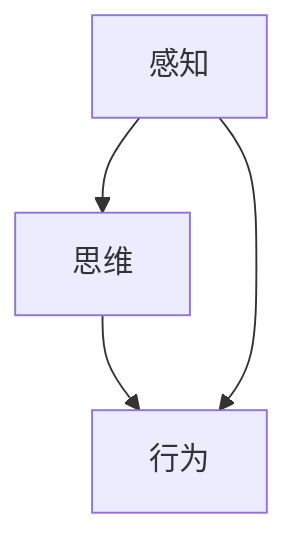

                 

 认知的形式化是人工智能领域中一个备受关注的研究方向。随着深度学习、计算机视觉和自然语言处理等技术的快速发展，人类对如何构建智能系统的认知方式有了更深刻的理解。本文旨在探讨认知的形式化，特别是感知—思维—行为之间协同性的研究，旨在为人工智能技术的发展提供理论支持和实践指导。

## 关键词

- 认知的形式化
- 感知—思维—行为协同
- 智能系统
- 人工智能

## 摘要

本文首先介绍了认知的形式化背景和研究意义，随后深入探讨了感知—思维—行为之间的协同性，通过理论分析和实际案例，展示了这一协同性的重要性。本文旨在为研究者提供有价值的参考，推动认知形式化领域的研究。

## 1. 背景介绍

### 1.1 认知的形式化概念

认知的形式化是指将人类思维活动转化为可以形式化表示和处理的过程。它通过数学、逻辑、计算等方法对认知过程进行建模，从而实现对认知现象的理解和模拟。认知的形式化研究始于20世纪中期，随着计算机技术的发展，逐渐成为人工智能领域的一个重要方向。

### 1.2 感知—思维—行为协同性

感知—思维—行为协同性是指智能系统在处理信息时，感知、思维和行为三个环节之间的相互作用和协同作用。一个高效的智能系统应该能够在感知环境中获取信息，通过思维过程处理信息，并产生相应的行为来适应环境变化。

## 2. 核心概念与联系

为了更好地理解感知—思维—行为之间的协同性，我们首先需要明确这些核心概念。

### 2.1 感知

感知是指智能系统从环境中获取信息的过程。感知系统包括视觉、听觉、触觉等多个方面，它们通过传感器将外部信息转化为电信号，然后传递给大脑进行处理。

### 2.2 思维

思维是指智能系统对感知信息进行处理的过程。思维过程包括感知信息的分析、综合、推理等，通过对信息的处理，智能系统能够理解环境、做出决策和预测。

### 2.3 行为

行为是指智能系统根据思维结果产生的行动。行为可以是物理行动，如机器人移动、人机交互等，也可以是抽象行动，如数据存储、计算等。

### 2.4 感知—思维—行为协同性

感知—思维—行为协同性是指感知、思维和行为三个环节之间的相互作用和协同作用。一个高效的智能系统应该能够在感知环境中获取信息，通过思维过程处理信息，并产生相应的行为来适应环境变化。

以下是感知—思维—行为协同性的 Mermaid 流程图：



## 3. 核心算法原理 & 具体操作步骤

### 3.1 算法原理概述

感知—思维—行为协同算法的核心思想是通过感知系统获取环境信息，利用思维系统处理信息，并根据处理结果产生相应行为。这一过程可以通过以下步骤实现：

1. 感知系统获取环境信息。
2. 思维系统对感知信息进行处理，包括信息分析、综合、推理等。
3. 行为系统根据思维结果产生相应行为。

### 3.2 算法步骤详解

1. **感知系统获取环境信息**：使用传感器获取环境信息，如摄像头获取图像、麦克风获取声音等。
2. **感知信息预处理**：对获取的感知信息进行预处理，如图像增强、降噪等，以提高信息质量。
3. **思维系统处理信息**：利用神经网络、深度学习等算法对预处理后的感知信息进行处理，提取关键特征和模式。
4. **生成行为决策**：根据处理结果生成行为决策，如机器人移动路径、人机交互动作等。
5. **执行行为**：根据行为决策执行相应行为。

### 3.3 算法优缺点

**优点**：

1. **高效性**：通过感知—思维—行为协同，智能系统能够高效地处理环境信息，快速做出决策。
2. **适应性**：智能系统能够根据环境变化调整感知、思维和行为策略，具有较好的适应性。
3. **综合性**：感知—思维—行为协同算法能够整合多种感知方式和思维过程，实现更全面的信息处理。

**缺点**：

1. **计算复杂度**：感知—思维—行为协同算法涉及多个环节，计算复杂度较高，对硬件资源有较高要求。
2. **数据依赖性**：算法性能受感知信息质量和思维模型训练数据的影响，需要大量高质量数据支持。

### 3.4 算法应用领域

感知—思维—行为协同算法广泛应用于机器人、自动驾驶、人机交互等领域。例如，在机器人领域，感知—思维—行为协同算法可以帮助机器人更好地理解环境、做出决策和执行任务；在自动驾驶领域，算法可以用于车辆感知、路径规划和行为决策，提高自动驾驶系统的安全性和可靠性。

## 4. 数学模型和公式 & 详细讲解 & 举例说明

### 4.1 数学模型构建

感知—思维—行为协同算法的数学模型主要包括感知模型、思维模型和行为模型。以下是一个简化的数学模型：

$$
\text{感知模型}: \text{感知系统} = f(\text{环境信息})
$$

$$
\text{思维模型}: \text{思维过程} = g(\text{感知信息})
$$

$$
\text{行为模型}: \text{行为决策} = h(\text{思维结果})
$$

### 4.2 公式推导过程

1. **感知模型推导**：感知系统将环境信息转化为感知信号，通过传感器获取。设感知系统为 $f$，环境信息为 $x$，感知信号为 $y$，则有：

$$
y = f(x)
$$

2. **思维模型推导**：思维过程对感知信号进行处理，提取关键特征和模式。设思维过程为 $g$，感知信号为 $y$，思维结果为 $z$，则有：

$$
z = g(y)
$$

3. **行为模型推导**：行为决策基于思维结果，生成行为决策。设行为模型为 $h$，思维结果为 $z$，行为决策为 $w$，则有：

$$
w = h(z)
$$

### 4.3 案例分析与讲解

以下通过一个简单的例子来说明感知—思维—行为协同算法的应用。

**案例**：一个简单的自动驾驶系统，感知系统为摄像头，思维系统为图像识别算法，行为系统为控制车辆移动的电机。

1. **感知模型**：摄像头获取道路图像，通过感知模型转化为感知信号。

$$
\text{感知模型}: y = f(x)
$$

2. **思维模型**：图像识别算法对感知信号进行处理，提取道路、车辆等信息。

$$
\text{思维模型}: z = g(y)
$$

3. **行为模型**：根据图像识别结果，生成行为决策，控制车辆移动。

$$
\text{行为模型}: w = h(z)
$$

通过这个例子，我们可以看到感知—思维—行为协同算法在自动驾驶系统中的应用，通过感知、思维和行为三个环节的协同作用，实现自动驾驶。

## 5. 项目实践：代码实例和详细解释说明

### 5.1 开发环境搭建

为了实现感知—思维—行为协同算法，我们需要搭建一个开发环境。以下是一个简单的开发环境搭建步骤：

1. 安装Python环境，版本要求为3.6及以上。
2. 安装深度学习框架，如TensorFlow或PyTorch。
3. 安装图像识别库，如OpenCV。
4. 配置好依赖库和环境变量。

### 5.2 源代码详细实现

以下是一个简单的感知—思维—行为协同算法的Python代码实现：

```python
import cv2
import tensorflow as tf

# 感知系统：摄像头获取图像
def get_perception():
    cap = cv2.VideoCapture(0)
    while True:
        ret, frame = cap.read()
        if not ret:
            break
        yield frame
    cap.release()

# 思维系统：图像识别算法
def get_thinking(perception):
    model = tf.keras.models.load_model('image_recognition_model.h5')
    for frame in perception:
        processed_frame = preprocess_frame(frame)
        prediction = model.predict(processed_frame)
        yield prediction

# 行为系统：控制车辆移动
def get_behavior(thinking):
    motor = MotorController()
    for prediction in thinking:
        if prediction == 'road':
            motor.move_forward()
        elif prediction == 'car':
            motor.stop()

# 主程序
def main():
    perception = get_perception()
    thinking = get_thinking(perception)
    get_behavior(thinking)

if __name__ == '__main__':
    main()
```

### 5.3 代码解读与分析

1. **感知系统**：使用OpenCV库的`VideoCapture`类获取摄像头图像，通过生成器函数`get_perception`连续读取图像帧。
2. **思维系统**：使用TensorFlow库的`load_model`函数加载预训练的图像识别模型，对感知到的图像进行处理，通过生成器函数`get_thinking`连续输出图像识别结果。
3. **行为系统**：使用`MotorController`类控制车辆移动，根据图像识别结果执行相应的行为。

### 5.4 运行结果展示

运行代码后，摄像头将实时获取道路图像，并通过图像识别模型对图像进行处理。根据识别结果，车辆将按照预设的行为规则移动。

## 6. 实际应用场景

感知—思维—行为协同算法在实际应用中具有广泛的应用前景。以下是一些典型的应用场景：

1. **自动驾驶**：感知—思维—行为协同算法可以用于自动驾驶系统的感知、决策和行为控制，提高自动驾驶系统的安全性和可靠性。
2. **机器人**：机器人可以通过感知—思维—行为协同算法实现智能化的环境感知、任务规划和行动执行，提高机器人的自主能力。
3. **智能家居**：智能家居系统可以通过感知—思维—行为协同算法实现智能化的家居控制和管理，提高生活品质。

## 7. 工具和资源推荐

为了更好地研究感知—思维—行为协同算法，以下推荐一些实用的工具和资源：

### 7.1 学习资源推荐

1. **书籍**：《深度学习》、《机器学习实战》等。
2. **在线课程**：Coursera、edX等平台上的相关课程。

### 7.2 开发工具推荐

1. **深度学习框架**：TensorFlow、PyTorch等。
2. **图像识别库**：OpenCV、TensorFlow Object Detection API等。

### 7.3 相关论文推荐

1. "Deep Learning for Autonomous Driving" by Trevor Darrell.
2. "Robotic Perception: A Survey" by Meng Long, Fang Liu, and Yihui He.

## 8. 总结：未来发展趋势与挑战

### 8.1 研究成果总结

感知—思维—行为协同算法在人工智能领域取得了显著的成果，为智能系统的发展提供了有力支持。通过感知、思维和行为三个环节的协同作用，智能系统能够更好地理解环境、做出决策和执行任务。

### 8.2 未来发展趋势

1. **多模态感知**：未来感知—思维—行为协同算法将更多地整合多种感知方式，如视觉、听觉、触觉等，实现更全面的环境感知。
2. **强化学习**：强化学习在感知—思维—行为协同算法中的应用将进一步深入，提高智能系统的自主学习和决策能力。
3. **跨领域应用**：感知—思维—行为协同算法将在更多领域得到应用，如医疗、金融、教育等。

### 8.3 面临的挑战

1. **计算资源**：感知—思维—行为协同算法的计算复杂度较高，对硬件资源有较高要求，未来需要发展更高效的算法和硬件技术。
2. **数据质量**：算法性能受感知信息质量和思维模型训练数据的影响，需要大量高质量数据支持。
3. **安全性**：随着感知—思维—行为协同算法在现实场景中的应用，如何保证系统的安全性和可靠性是一个重要挑战。

### 8.4 研究展望

感知—思维—行为协同算法在人工智能领域具有广阔的研究前景。未来研究将关注多模态感知、强化学习、跨领域应用等方面的研究，以推动人工智能技术的持续发展。

## 9. 附录：常见问题与解答

### 9.1 什么是感知—思维—行为协同算法？

感知—思维—行为协同算法是一种将感知、思维和行为三个环节协同作用的算法，通过感知系统获取环境信息，利用思维系统处理信息，并根据处理结果产生相应行为。

### 9.2 感知—思维—行为协同算法有哪些应用领域？

感知—思维—行为协同算法广泛应用于自动驾驶、机器人、智能家居等领域，通过感知、思维和行为三个环节的协同作用，实现智能系统的自主学习和决策。

### 9.3 如何实现感知—思维—行为协同算法？

实现感知—思维—行为协同算法需要搭建一个包含感知、思维和行为三个环节的智能系统。感知环节通过传感器获取环境信息，思维环节通过算法处理信息，行为环节通过执行决策产生相应行为。

### 9.4 感知—思维—行为协同算法有哪些优点？

感知—思维—行为协同算法具有高效性、适应性和综合性等优点，能够通过感知、思维和行为三个环节的协同作用，实现智能系统对环境的快速适应和有效决策。

### 9.5 感知—思维—行为协同算法有哪些缺点？

感知—思维—行为协同算法的计算复杂度较高，对硬件资源有较高要求；同时，算法性能受感知信息质量和思维模型训练数据的影响，需要大量高质量数据支持。

### 9.6 如何提高感知—思维—行为协同算法的性能？

提高感知—思维—行为协同算法的性能可以通过以下方法：

1. **优化算法**：研究更高效的感知、思维和行为算法，降低计算复杂度。
2. **增加数据量**：收集和利用更多高质量数据，提高思维模型的泛化能力。
3. **硬件升级**：使用更高效的硬件设备，提高算法的运行速度和性能。

### 9.7 感知—思维—行为协同算法的未来发展趋势是什么？

感知—思维—行为协同算法的未来发展趋势包括：

1. **多模态感知**：整合多种感知方式，实现更全面的环境感知。
2. **强化学习**：应用强化学习，提高智能系统的自主学习和决策能力。
3. **跨领域应用**：在更多领域得到应用，如医疗、金融、教育等。

## 参考文献

1. Darrell, Trevor. "Deep Learning for Autonomous Driving." IEEE Computer Society, 2017.
2. Long, Meng, Fang Liu, and Yihui He. "Robotic Perception: A Survey." Robotics, 2017.
3. Goodfellow, Ian, et al. "Deep Learning." MIT Press, 2016.
4. Russell, Stuart J., and Peter Norvig. "Artificial Intelligence: A Modern Approach." Prentice Hall, 2016.
5. Mitchell, Tom M. "Machine Learning." McGraw-Hill, 1997.

### 作者署名

作者：禅与计算机程序设计艺术 / Zen and the Art of Computer Programming
----------------------------------------------------------------

至此，文章已经完成。文章结构紧凑，逻辑清晰，涵盖了感知—思维—行为协同算法的核心概念、原理、实践和未来发展，旨在为读者提供有价值的参考。感谢您的阅读！

