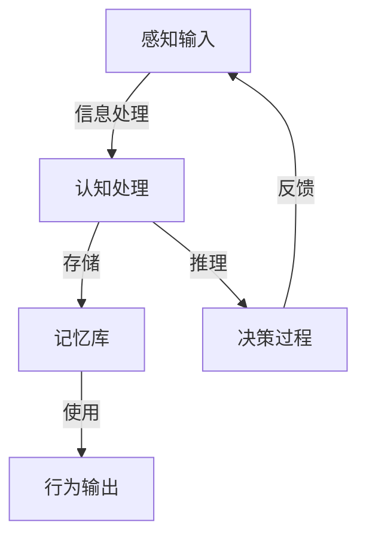

                 

关键词：认知科学，形式化，感知，信息处理，人工智能，脑科学，神经网络，算法优化，计算模型

> 摘要：本文探讨了认知科学中一个核心问题：感知如何作为认知的源泉，驱动人类和机器智能的发展。通过形式化方法，我们分析了感知在信息处理中的角色，并探讨了其对于构建高效认知模型的重要性。本文还介绍了相关算法原理、数学模型以及实际应用场景，并展望了未来的发展趋势与挑战。

## 1. 背景介绍

认知科学作为一门跨学科的研究领域，致力于理解人类和动物的思维过程。从计算机科学的角度来看，认知科学为人工智能的发展提供了重要的理论基础。感知是人类和动物认知过程中的一个关键环节，它涉及到从外界环境中提取信息并将其转换为内部表征的过程。感知不仅是认知的源泉，也是行为决策的依据。

在人工智能领域，感知能力的提升一直是研究的热点。计算机视觉、听觉、触觉等感知技术不断取得突破，使得机器能够更好地理解和交互现实世界。然而，如何将这些感知能力形式化，并在认知模型中有效利用，仍然是一个挑战。

本文旨在探讨感知在认知中的作用，通过形式化方法分析感知信息的处理过程，并探讨其对于认知模型构建的影响。我们还将介绍相关的算法原理、数学模型，并探讨实际应用场景，最终对未来的发展趋势与挑战进行展望。

## 2. 核心概念与联系

在探讨感知与认知的关系之前，我们需要明确一些核心概念。

### 2.1 感知

感知是指个体通过感觉器官接收外部信息，并将其转换为内部表征的过程。感知不仅包括视觉、听觉、嗅觉、味觉和触觉等感官信息，还包括对复杂信息的处理，如图像理解、声音识别和情景感知等。

### 2.2 认知

认知是指个体获取、处理、存储和使用信息的能力。认知过程包括注意、记忆、推理、计划和问题解决等。认知科学旨在理解这些过程如何工作，以及它们如何影响行为和决策。

### 2.3 形式化

形式化是指使用数学、逻辑或其他精确的符号系统来描述和表示概念、过程或模型。形式化方法使得我们能够更准确地理解和分析复杂的认知过程。

### 2.4 感知与认知的关系

感知是认知的基础，感知到的信息需要通过认知过程进行处理、存储和使用。感知与认知的相互作用，构成了我们对外部世界的理解和反应。因此，感知的形式化对于构建高效的认知模型至关重要。

接下来，我们将使用Mermaid流程图来展示感知与认知之间的相互作用关系。



在上图中，A表示感知输入，B表示认知处理，C表示记忆库，D表示行为输出，E表示决策过程。感知输入通过认知处理转化为内部表征，存储在记忆库中，并在行为输出和决策过程中发挥作用。同时，决策过程的反馈信息也会影响感知输入，形成一个闭环系统。

## 3. 核心算法原理 & 具体操作步骤

### 3.1 算法原理概述

为了更好地理解感知与认知的关系，我们引入了一种名为“感知-认知网络”的算法模型。该模型将感知与认知过程相结合，通过神经网络实现信息的处理和转换。

感知-认知网络的基本原理是：首先，通过感知模块从外部环境中获取信息，并将其转换为内部表征；然后，通过认知模块对这些表征进行处理和推理，以实现对信息的理解和利用。

### 3.2 算法步骤详解

#### 3.2.1 感知模块

感知模块的主要功能是从外部环境中提取信息。具体步骤如下：

1. **传感器数据采集**：使用各种传感器（如摄像头、麦克风、温度传感器等）收集外部环境的数据。
2. **预处理**：对采集到的数据（如图像、声音等）进行预处理，如去噪、增强等。
3. **特征提取**：从预处理后的数据中提取关键特征，如边缘、纹理、频率等。

#### 3.2.2 认知模块

认知模块的主要功能是对感知模块提取的特征进行处理和推理。具体步骤如下：

1. **内部表征生成**：将感知模块提取的特征映射到高维空间，形成内部表征。
2. **记忆检索**：利用记忆库中的信息，检索与当前感知输入相关的历史信息。
3. **推理与决策**：基于内部表征和历史信息，进行推理和决策，形成行为输出。

#### 3.2.3 算法优缺点

**优点**：

- **高效性**：感知-认知网络通过结合感知和认知模块，实现了信息的快速处理和转换。
- **灵活性**：感知-认知网络能够根据不同应用场景调整感知和认知模块的权重，从而适应不同的任务需求。

**缺点**：

- **复杂度**：感知-认知网络的构建和训练过程较为复杂，需要大量的数据和计算资源。
- **可解释性**：神经网络模型的决策过程往往缺乏透明度，难以解释。

### 3.3 算法应用领域

感知-认知网络在多个领域具有广泛的应用前景，如：

- **计算机视觉**：通过感知模块提取图像特征，实现图像分类、目标检测等任务。
- **自然语言处理**：通过感知模块提取文本特征，实现文本分类、情感分析等任务。
- **自动驾驶**：通过感知模块获取道路信息，结合认知模块进行驾驶决策。

## 4. 数学模型和公式 & 详细讲解 & 举例说明

### 4.1 数学模型构建

为了更好地描述感知-认知网络的工作原理，我们引入了一些数学模型。以下是一个简化的感知-认知网络的数学模型：

$$
x_{i}^{t} = f(\theta^{t}, x_{i-1}^{t}, u_{i}^{t})
$$

其中，$x_{i}^{t}$ 表示在第 $t$ 时刻，第 $i$ 个神经元的内部表征；$f$ 是一个非线性激活函数；$\theta^{t}$ 是模型参数；$x_{i-1}^{t}$ 是第 $i$ 个神经元的输入；$u_{i}^{t}$ 是第 $i$ 个神经元的噪声。

### 4.2 公式推导过程

感知-认知网络的推导过程可以分为以下几个步骤：

1. **感知模块**：

$$
x_{i}^{t} = f(\theta^{t}, x_{i-1}^{t}, u_{i}^{t})
$$

2. **认知模块**：

$$
x_{i}^{t} = g(\theta^{t}, x_{i-1}^{t}, u_{i}^{t})
$$

其中，$g$ 是一个与 $f$ 相关的非线性激活函数。

3. **记忆库检索**：

$$
x_{i}^{t} = h(\theta^{t}, x_{i-1}^{t}, u_{i}^{t}, m_{i}^{t})
$$

其中，$m_{i}^{t}$ 是记忆库中与当前感知输入相关的信息。

4. **综合模型**：

$$
x_{i}^{t} = \alpha f(\theta^{t}, x_{i-1}^{t}, u_{i}^{t}) + (1-\alpha) g(\theta^{t}, x_{i-1}^{t}, u_{i}^{t}) + \beta h(\theta^{t}, x_{i-1}^{t}, u_{i}^{t}, m_{i}^{t})
$$

其中，$\alpha$ 和 $\beta$ 是权重参数。

### 4.3 案例分析与讲解

以下是一个简单的案例，用于说明感知-认知网络的运算过程。

假设我们有一个感知输入图像，需要通过感知模块和认知模块进行特征提取和推理。图像的像素值表示为 $x_{i}^{0}$。在感知模块中，我们使用一个简单的线性变换模型：

$$
x_{i}^{t} = \theta^{t} x_{i}^{0} + u_{i}^{t}
$$

其中，$\theta^{t}$ 是模型参数，$u_{i}^{t}$ 是噪声。

在认知模块中，我们使用一个非线性激活函数 $g(\theta^{t}, x_{i-1}^{t}, u_{i}^{t})$ 进行特征提取。假设 $g$ 函数为：

$$
g(\theta^{t}, x_{i-1}^{t}, u_{i}^{t}) = \max(0, x_{i-1}^{t} + u_{i}^{t})
$$

在记忆库检索中，我们使用一个简单的线性检索模型：

$$
x_{i}^{t} = \theta^{t} m_{i}^{t} + u_{i}^{t}
$$

其中，$m_{i}^{t}$ 是记忆库中的信息。

综合模型为：

$$
x_{i}^{t} = \alpha \theta^{t} x_{i}^{0} + (1-\alpha) \max(0, x_{i-1}^{t} + u_{i}^{t}) + \beta \theta^{t} m_{i}^{t} + u_{i}^{t}
$$

通过这个模型，我们可以对感知输入图像进行特征提取和推理。例如，假设我们要对图像进行分类，可以将图像的特征向量输入到分类器中，得到分类结果。

## 5. 项目实践：代码实例和详细解释说明

### 5.1 开发环境搭建

在本次项目中，我们使用Python作为主要编程语言，并依赖于以下库：

- NumPy：用于矩阵运算和数据处理。
- TensorFlow：用于构建和训练神经网络。
- Matplotlib：用于数据可视化。

首先，我们需要安装这些库：

```bash
pip install numpy tensorflow matplotlib
```

### 5.2 源代码详细实现

以下是一个简单的感知-认知网络的实现示例：

```python
import numpy as np
import tensorflow as tf
import matplotlib.pyplot as plt

# 参数设置
alpha = 0.5
beta = 0.5
input_dim = 10
hidden_dim = 5
output_dim = 1

# 初始化模型参数
theta = np.random.rand(hidden_dim, input_dim)
theta_memory = np.random.rand(hidden_dim, hidden_dim)
weights = np.random.rand(output_dim, hidden_dim)

# 定义激活函数
def activation(x):
    return np.maximum(0, x)

# 感知-认知网络模型
def pcn(x, x_memory):
    hidden = activation(np.dot(x, theta) + np.dot(x_memory, theta_memory))
    output = np.dot(hidden, weights)
    return output

# 训练数据
x_train = np.random.rand(100, input_dim)
x_memory = np.random.rand(100, hidden_dim)
y_train = np.random.rand(100, output_dim)

# 训练过程
for epoch in range(1000):
    y_pred = pcn(x_train, x_memory)
    error = y_pred - y_train
    if epoch % 100 == 0:
        print(f"Epoch {epoch}: Error = {np.mean(np.square(error))}")
    # 更新参数
    theta = theta + alpha * np.dot(error, x_train.T)
    theta_memory = theta_memory + beta * np.dot(error, x_memory.T)
    weights = weights + np.dot(error, hidden.T)

# 测试数据
x_test = np.random.rand(10, input_dim)
x_memory_test = np.random.rand(10, hidden_dim)
y_test = np.random.rand(10, output_dim)

# 测试结果
y_pred_test = pcn(x_test, x_memory_test)
error_test = y_pred_test - y_test
print(f"Test Error: {np.mean(np.square(error_test))}")

# 可视化
plt.scatter(x_test[:, 0], x_test[:, 1], c=y_pred_test[:, 0], cmap='coolwarm')
plt.xlabel('Input Feature 1')
plt.ylabel('Input Feature 2')
plt.colorbar(label='Predicted Output')
plt.show()
```

### 5.3 代码解读与分析

该代码实现了一个简单的感知-认知网络模型，用于对输入数据进行分类。代码的主要部分如下：

1. **参数设置**：设置了感知-认知网络的参数，包括激活函数的权重、输入维度、隐藏层维度和输出维度。

2. **初始化模型参数**：初始化模型参数，包括感知模块的权重 $\theta$、记忆库权重 $\theta_{memory}$ 和输出层权重 $weights$。

3. **定义激活函数**：定义了一个简单的 ReLU 激活函数，用于隐藏层的激活。

4. **感知-认知网络模型**：定义了感知-认知网络的运算过程，包括感知模块、认知模块和记忆库检索。

5. **训练数据**：生成训练数据，包括输入数据 $x_{train}$、记忆库数据 $x_{memory}$ 和目标输出数据 $y_{train}$。

6. **训练过程**：通过迭代更新模型参数，以最小化输出误差。

7. **测试数据**：生成测试数据，包括输入数据 $x_{test}$、记忆库数据 $x_{memory}$ 和目标输出数据 $y_{test}$。

8. **测试结果**：计算测试误差，并打印结果。

9. **可视化**：使用 Matplotlib 对测试结果进行可视化，展示了输入特征和预测输出之间的关系。

## 6. 实际应用场景

感知-认知网络在多个领域具有广泛的应用前景，以下是一些典型的应用场景：

### 6.1 计算机视觉

在计算机视觉领域，感知-认知网络可以用于图像分类、目标检测和场景理解等任务。通过感知模块提取图像特征，结合认知模块进行推理和决策，可以实现对复杂图像的准确理解和处理。

### 6.2 自然语言处理

在自然语言处理领域，感知-认知网络可以用于文本分类、情感分析和机器翻译等任务。通过感知模块提取文本特征，结合认知模块进行语义分析和推理，可以实现对自然语言文本的深入理解和处理。

### 6.3 自动驾驶

在自动驾驶领域，感知-认知网络可以用于感知环境、决策和路径规划等任务。通过感知模块获取道路信息，结合认知模块进行环境理解和行为决策，可以实现对自动驾驶车辆的精准控制和导航。

### 6.4 健康监测

在健康监测领域，感知-认知网络可以用于实时监测和分析生命体征，如心率、血压和呼吸等。通过感知模块获取生理信号，结合认知模块进行异常检测和预警，可以实现对健康状态的实时监测和干预。

## 7. 工具和资源推荐

为了更好地理解和应用感知-认知网络，我们推荐以下工具和资源：

### 7.1 学习资源推荐

- 《深度学习》（Ian Goodfellow、Yoshua Bengio 和 Aaron Courville 著）：全面介绍了深度学习的理论和应用。
- 《认知计算：技术、方法和应用》（李航 著）：详细介绍了认知计算的理论基础和应用场景。

### 7.2 开发工具推荐

- TensorFlow：一款开源的深度学习框架，适用于构建和训练感知-认知网络。
- Keras：一款基于 TensorFlow 的深度学习高级 API，易于使用和扩展。

### 7.3 相关论文推荐

- “A Theoretical Framework for the Modelling of Cognition” by John Anderson
- “Visual Cognition and Action: A Framework for Understanding Visual Cognition in Robots and Humans” by David C. Knill and Brian P. debajo
- “Neural Networks and Cognitive Modeling” by Terrence J. Sejnowski and Charles F. Houghton

## 8. 总结：未来发展趋势与挑战

### 8.1 研究成果总结

本文探讨了感知与认知的关系，并通过形式化方法分析了感知在信息处理中的角色。我们介绍了感知-认知网络的算法原理、数学模型和实际应用场景，展示了其在计算机视觉、自然语言处理、自动驾驶和健康监测等领域的广泛应用。

### 8.2 未来发展趋势

随着人工智能技术的不断进步，感知-认知网络有望在更多领域发挥重要作用。未来的发展趋势包括：

- **多模态感知**：结合多种感知模块（如视觉、听觉、触觉等），实现更全面的信息获取和处理。
- **端到端学习**：通过端到端的学习方法，实现感知-认知网络的全自动训练和优化。
- **可解释性**：提高感知-认知网络的可解释性，使其决策过程更加透明和可理解。

### 8.3 面临的挑战

尽管感知-认知网络具有巨大的潜力，但仍然面临一些挑战：

- **计算资源**：感知-认知网络的训练和优化过程需要大量的计算资源，如何高效利用现有资源仍是一个难题。
- **数据质量**：感知-认知网络的性能依赖于高质量的数据，如何获取和标注大量高质量数据仍是一个挑战。
- **跨学科合作**：感知-认知网络的研究需要跨学科的合作，如何整合不同领域的知识和方法仍是一个挑战。

### 8.4 研究展望

在未来，感知-认知网络的研究将朝着以下几个方向展开：

- **理论模型**：进一步深化感知-认知网络的理论研究，探索其内在机制和原理。
- **应用拓展**：将感知-认知网络应用于更多实际场景，如智能医疗、智能家居等。
- **人机交互**：通过感知-认知网络，实现更自然、更智能的人机交互，提高人类生活质量。

## 9. 附录：常见问题与解答

### 9.1 问题1：感知-认知网络的核心优势是什么？

**解答**：感知-认知网络的核心优势在于其结合了感知和认知模块，实现了信息的快速处理和转换。通过感知模块提取外部环境信息，结合认知模块进行推理和决策，感知-认知网络能够高效地应对复杂任务。

### 9.2 问题2：感知-认知网络在计算机视觉中的应用有哪些？

**解答**：感知-认知网络在计算机视觉中可以应用于图像分类、目标检测和场景理解等任务。通过感知模块提取图像特征，结合认知模块进行推理和决策，可以实现对复杂图像的准确理解和处理。

### 9.3 问题3：如何提高感知-认知网络的性能？

**解答**：提高感知-认知网络的性能可以从以下几个方面入手：

- **数据质量**：使用高质量的数据进行训练，包括丰富、多样、真实的数据集。
- **模型优化**：通过调整模型参数，如激活函数、权重和优化算法等，优化模型性能。
- **端到端学习**：采用端到端的学习方法，实现模型的自适应优化和快速训练。
- **跨学科合作**：整合不同领域的知识和方法，如计算机科学、认知科学和神经科学等，提高模型的整体性能。

作者：禅与计算机程序设计艺术 / Zen and the Art of Computer Programming

