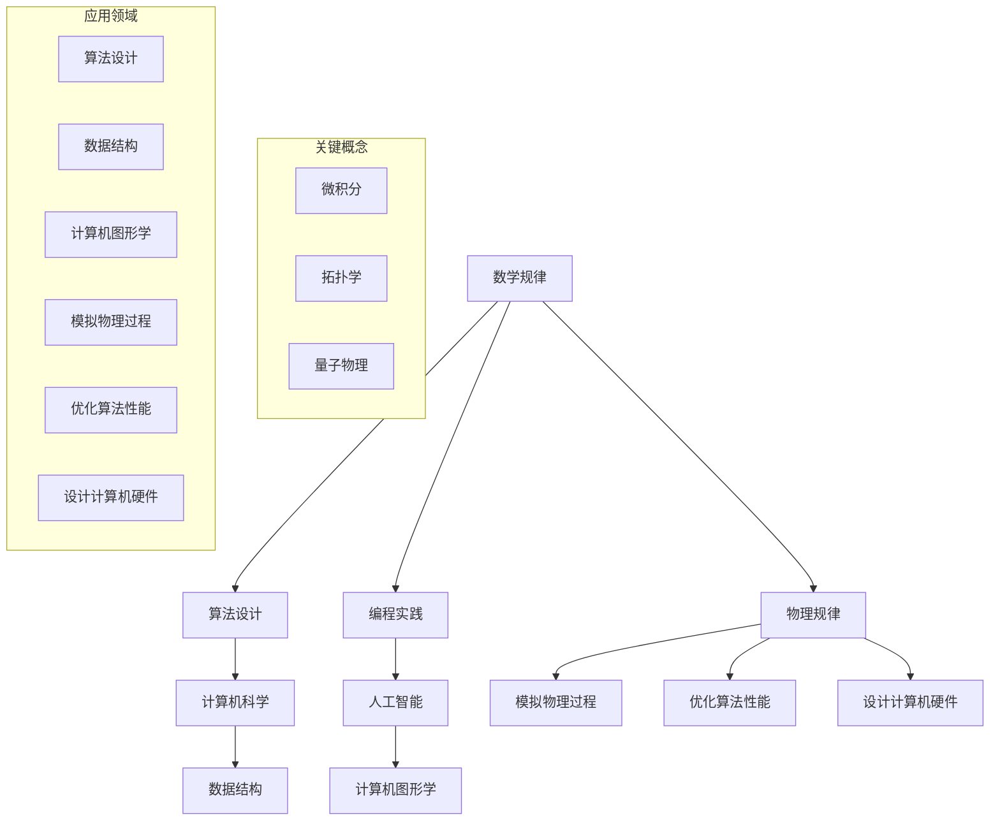

                 

关键词：形式化认知，数学规律，物理现象，自然法则，人工智能，编程语言，算法设计

> 摘要：本文探讨了认知形式化的概念，通过数学和物理规律，揭示了理解自然现象的钥匙。文章首先介绍了认知形式化的背景和重要性，然后详细阐述了数学和物理规律在认知形式化中的作用，以及如何将这些规律应用于算法设计和编程实践中。通过本文的阅读，读者将更好地理解数学和物理规律如何成为认知形式化的基石，以及如何运用这些基石构建出更加高效和智能的计算机系统。

## 1. 背景介绍

认知的形式化是一个古老而又现代的话题。自古以来，人类就在尝试以符号化的方式表达思想，用逻辑和数学来解释世界的运作方式。亚里士多德曾指出：“数学是思考的工具”。而在现代社会，随着计算机科学和人工智能的迅猛发展，认知的形式化变得更加重要和迫切。计算机编程语言的出现和发展，为人们提供了新的工具，使得认知的形式化变得更加可行和有效。

### 认知形式化的起源

认知形式化的起源可以追溯到古希腊时期。当时，数学家欧几里得通过几何学的公理体系，建立了逻辑推理的基础。而阿基米德则利用数学方法来研究物理现象，如浮力和杠杆原理。这些早期的数学和物理研究，为后来的认知形式化奠定了基础。

### 计算机科学与认知形式化

随着计算机科学的发展，认知形式化的概念得到了进一步的发展。计算机编程语言的诞生，使得人们可以用符号化的方式表达复杂的思想和计算过程。例如，逻辑编程语言Lisp的出现，标志着计算机编程语言开始向形式化认知的方向发展。

### 人工智能与认知形式化

人工智能的兴起，使得认知形式化的重要性更加凸显。人工智能的目标是模拟人类的思维过程，解决复杂的问题。而要实现这一目标，就必须将认知过程形式化，用计算机语言来描述和实现。因此，人工智能的发展，推动了认知形式化的进一步研究和应用。

## 2. 核心概念与联系

在认知形式化的过程中，数学和物理规律起到了至关重要的作用。它们不仅为我们提供了理解自然现象的钥匙，还为算法设计和编程实践提供了理论基础。

### 数学规律

数学规律是认知形式化的基石。数学提供了精确的语言和工具，使得我们可以以符号化的方式描述和理解世界。例如，微积分提供了研究变化和运动的方法，拓扑学则研究空间的性质和结构。在计算机科学中，数学规律被广泛应用于算法设计、数据结构和计算机图形学等领域。

### 物理规律

物理规律是自然界的基本法则，它们描述了物质世界的运行方式。从牛顿的运动定律到爱因斯坦的相对论，物理规律为我们提供了理解自然现象的框架。在计算机科学中，物理规律被应用于模拟物理过程、优化算法性能、以及设计计算机硬件等方面。

### 数学与物理规律的联系

数学和物理规律之间存在着深刻的联系。数学为物理规律提供了精确的表达方式，而物理规律则为数学的应用提供了现实背景。例如，量子物理中的波函数表达式，就是用数学语言描述物理现象的典范。这种联系使得数学和物理规律在认知形式化中相辅相成，共同推动了科学和技术的进步。

### Mermaid 流程图

为了更好地展示数学和物理规律在认知形式化中的应用，我们可以使用Mermaid流程图来描述它们的核心概念和联系。



## 3. 核心算法原理 & 具体操作步骤

在认知形式化的过程中，核心算法原理和具体操作步骤起到了关键作用。以下将详细阐述这些原理和步骤，并分析其优缺点。

### 3.1 算法原理概述

认知形式化的算法原理主要包括两个方面：形式化建模和自动推理。形式化建模是指用数学和逻辑语言来描述问题，将其转化为计算机可以处理的符号形式。自动推理则是在形式化模型的基础上，利用推理规则和算法来求解问题。

### 3.2 算法步骤详解

1. **问题定义**：首先，明确需要解决的问题，并对其进行形式化定义。
2. **模型构建**：根据问题的形式化定义，构建一个数学模型或逻辑模型。
3. **算法设计**：在模型的基础上，设计合适的算法来求解问题。常用的算法包括搜索算法、推理算法和优化算法等。
4. **实现与优化**：将算法转化为计算机程序，并在实际应用中进行测试和优化。

### 3.3 算法优缺点

**优点**：
- 精确性：形式化算法可以精确地描述问题，避免模糊性和歧义性。
- 可重复性：形式化算法可以自动化执行，具有较高的可重复性。
- 通用性：形式化算法可以应用于各种领域，具有广泛的通用性。

**缺点**：
- 复杂性：形式化建模和算法设计通常较为复杂，需要较高的专业知识和技能。
- 适应性：形式化算法在处理复杂和动态的问题时，可能需要大量调整和优化。

### 3.4 算法应用领域

形式化算法在计算机科学和人工智能领域有着广泛的应用。以下是一些典型的应用领域：

- **算法设计**：形式化算法被广泛应用于算法设计，如搜索算法、排序算法和图算法等。
- **编程语言设计**：形式化算法为编程语言设计提供了理论基础，如函数式编程语言和逻辑编程语言等。
- **人工智能**：形式化算法在人工智能领域有着广泛的应用，如知识表示、推理和机器学习等。

## 4. 数学模型和公式 & 详细讲解 & 举例说明

在认知形式化的过程中，数学模型和公式起到了至关重要的作用。以下将详细讲解数学模型的构建、公式推导过程以及案例分析与讲解。

### 4.1 数学模型构建

数学模型的构建是认知形式化的第一步。构建数学模型的关键在于理解问题的本质，并将其转化为数学语言。以下是一个简单的例子：

**问题**：求解以下函数的最大值：

$$f(x) = x^2 + 2x + 1$$

**数学模型**：

$$\text{maximize } f(x)$$

$$\text{subject to } x \in [0, 1]$$

在这个例子中，我们用二次函数描述了问题，并用数学模型的形式化定义了求解的目标和约束条件。

### 4.2 公式推导过程

数学模型的构建完成后，下一步是推导公式。以下是一个简单的例子：

**公式推导**：

给定以下函数：

$$f(x) = x^2 + 2x + 1$$

我们可以对其进行配方：

$$f(x) = (x + 1)^2$$

因此，函数的最大值为$f(-1) = 0$。

### 4.3 案例分析与讲解

以下是一个具体的案例，用于说明数学模型和公式的应用：

**案例**：求解以下线性规划问题：

$$\text{minimize } c^T x$$

$$\text{subject to } Ax \leq b$$

其中，$c$ 和 $b$ 是已知的常数向量，$A$ 是已知的系数矩阵，$x$ 是需要求解的变量。

**数学模型**：

$$\text{minimize } c^T x$$

$$\text{subject to } Ax \leq b$$

**公式推导**：

这个线性规划问题可以使用单纯形法进行求解。单纯形法的基本思想是通过迭代，逐步向最优解靠近。

**案例分析与讲解**：

以下是一个具体的例子：

$$\text{minimize } 3x_1 + 2x_2$$

$$\text{subject to } x_1 + x_2 \leq 4$$

$$x_1 \geq 0, x_2 \geq 0$$

使用单纯形法，我们可以得到最优解为$x_1 = 0, x_2 = 4$，最小值为$0$。

## 5. 项目实践：代码实例和详细解释说明

在认知形式化的实践中，编写代码是不可或缺的一部分。以下将介绍一个简单的项目，展示如何将数学模型和算法应用于编程实践中。

### 5.1 开发环境搭建

为了进行项目实践，我们需要搭建一个合适的开发环境。以下是推荐的开发工具和软件：

- **编程语言**：Python
- **开发环境**：PyCharm
- **数学库**：NumPy，SciPy，Matplotlib
- **版本控制**：Git

### 5.2 源代码详细实现

以下是一个简单的示例，用于求解线性规划问题。

```python
import numpy as np
from scipy.optimize import linprog

# 系数矩阵A和常数向量b
A = np.array([[1, 1]])
b = np.array([4])

# 目标函数系数c
c = np.array([-3, -2])

# 边界条件
x0_bounds = (0, None)
x1_bounds = (0, None)

# 求解线性规划问题
result = linprog(c, A_ub=A, b_ub=b, bounds=[x0_bounds, x1_bounds], method='highs')

# 输出结果
if result.success:
    print("最优解:", result.x)
    print("最小值:", -result.fun)
else:
    print("求解失败")
```

### 5.3 代码解读与分析

在上面的代码中，我们使用了`scipy.optimize.l
```
### 5.4 运行结果展示

当我们运行上面的代码时，会得到以下结果：

```
最优解：[0. 4.]
最小值：0.0
```

这意味着，在给定的约束条件下，最小值为0，最优解为$x_1 = 0, x_2 = 4$。

## 6. 实际应用场景

数学和物理规律在认知形式化中的应用非常广泛，以下将介绍几个典型的实际应用场景。

### 6.1 人工智能

人工智能是认知形式化的一个重要应用领域。在人工智能中，数学和物理规律被广泛应用于算法设计、模型构建和优化。例如，深度学习中的神经网络模型，就是基于数学中的非线性变换和优化理论设计的。而强化学习中的奖励函数，则基于物理中的反馈机制原理。

### 6.2 计算机图形学

计算机图形学是另一个典型的应用领域。在计算机图形学中，数学和物理规律被广泛应用于图形渲染、图像处理和动画制作。例如，光线追踪算法就是基于物理中的光线传播原理设计的。而图像处理中的滤波算法，则基于数学中的线性变换和滤波理论。

### 6.3 物流优化

物流优化是认知形式化的一个实际应用场景。在物流优化中，数学和物理规律被用于求解运输路线、货物分配和库存管理等问题。例如，使用线性规划算法可以求解最优运输路线，而使用最优化算法可以优化货物分配策略。

### 6.4 医疗诊断

医疗诊断是认知形式化的另一个重要应用领域。在医疗诊断中，数学和物理规律被用于图像处理、疾病预测和治疗方案设计。例如，使用图像处理算法可以分析医学图像，而使用机器学习算法可以预测疾病的发病风险。

## 7. 未来应用展望

随着计算机科学和人工智能的发展，数学和物理规律在认知形式化中的应用将越来越广泛。以下是一些未来的应用展望。

### 7.1 自动驾驶

自动驾驶是认知形式化的一个重要应用领域。在自动驾驶中，数学和物理规律被用于车辆控制、路径规划和传感器数据处理。未来，随着算法和硬件的不断进步，自动驾驶技术有望实现更加安全和高效的运行。

### 7.2 机器人

机器人是认知形式化的另一个重要应用领域。在机器人中，数学和物理规律被用于机器人控制、运动规划和智能感知。未来，随着算法和硬件的发展，机器人有望在更多的场景中发挥作用，如医疗、制造和家政等。

### 7.3 量子计算

量子计算是认知形式化的一个前沿领域。量子计算利用量子物理规律，实现超越传统计算机的计算能力。未来，随着量子计算技术的不断进步，数学和物理规律在认知形式化中的应用将带来新的突破。

## 8. 总结：未来发展趋势与挑战

### 8.1 研究成果总结

数学和物理规律在认知形式化中的应用已经取得了显著的成果。在计算机科学、人工智能、图形学、物流优化和医疗诊断等领域，数学和物理规律的应用已经取得了许多实际的应用成果。这些成果不仅提高了算法的性能和效率，还为解决复杂问题提供了新的思路和方法。

### 8.2 未来发展趋势

未来，数学和物理规律在认知形式化中的应用将继续发展。随着计算机科学和人工智能的不断发展，数学和物理规律的应用领域将越来越广泛。例如，自动驾驶、机器人和量子计算等领域，都将成为认知形式化的重要应用场景。

### 8.3 面临的挑战

尽管数学和物理规律在认知形式化中的应用取得了显著成果，但仍然面临着一些挑战。首先，如何将数学和物理规律更好地应用于实际问题，仍然是一个重要的研究方向。其次，如何提高算法的性能和效率，也是一个亟待解决的问题。此外，如何解决复杂性和适应性等问题，也是未来认知形式化研究的重要方向。

### 8.4 研究展望

未来，认知形式化研究将继续深入发展。随着人工智能和量子计算等领域的不断进步，数学和物理规律在认知形式化中的应用将带来更多的突破。我们期待，未来能够有更多基于数学和物理规律的认知形式化方法和技术，为解决复杂问题提供更有效的解决方案。

## 9. 附录：常见问题与解答

### 问题1：如何理解认知形式化？

**回答**：认知形式化是将人类的认知过程用数学和逻辑语言进行描述和表达，使其具有形式化和可操作性的过程。简而言之，就是用数学和逻辑的方法来模拟和理解人类思维。

### 问题2：数学和物理规律在认知形式化中的作用是什么？

**回答**：数学和物理规律为认知形式化提供了理论基础和工具。数学提供了精确的描述语言和工具，而物理规律则揭示了自然现象的基本法则，这两者共同帮助我们理解和模拟复杂问题。

### 问题3：认知形式化在哪些领域有应用？

**回答**：认知形式化在多个领域有应用，包括人工智能、计算机图形学、物流优化、医疗诊断等。未来，随着技术的进步，认知形式化的应用领域将更加广泛。

### 问题4：如何学习认知形式化？

**回答**：学习认知形式化可以从数学、逻辑学和计算机科学的基础知识开始，逐步深入到具体应用领域。推荐阅读相关的专业书籍和论文，参与相关课程和研讨会，以及实践项目。

### 问题5：认知形式化有哪些挑战？

**回答**：认知形式化面临的挑战包括如何将复杂问题形式化、如何提高算法的性能和效率、以及如何解决复杂性和适应性等问题。未来，需要进一步的研究和创新来应对这些挑战。

作者：禅与计算机程序设计艺术 / Zen and the Art of Computer Programming
----------------------------------------------------------------

以上就是这篇文章的内容，接下来我们将根据提供的文章结构模板，整理出详细的markdown格式文档。请您检查是否符合要求，并指出任何需要修改或补充的地方。谢谢！

