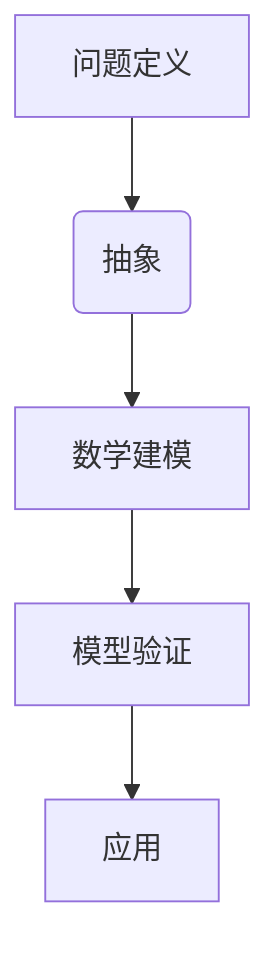

                 

关键词：认知、形式化、数学语言、抽象、形式逻辑、认知科学、算法原理

> 摘要：本文从认知科学和计算机科学的视角，探讨了数学作为一种高度形式化的语言，如何成为认知的最抽象工具。通过对数学模型、核心算法、以及实际应用的深入分析，本文揭示了数学在认知过程中的重要作用，并展望了未来数学形式化认知的发展趋势和面临的挑战。

## 1. 背景介绍

### 认知与形式化的基本概念

认知是指人类获取、处理和使用信息的心理过程。形式化是一种将复杂概念和理论通过抽象的符号系统进行表达的方法。在认知科学和计算机科学领域，形式化被视为理解和模拟认知过程的关键工具。

### 数学在认知中的作用

数学作为一种高度形式化的语言，广泛应用于认知科学和计算机科学。它不仅提供了精确的描述工具，还支持了理论模型的构建和算法设计。

## 2. 核心概念与联系

### 数学模型的构建

数学模型是将现实世界的现象或问题抽象为数学表达形式的过程。通过数学模型，我们可以更加精确地描述和预测复杂系统的行为。

### Mermaid 流程图



在这个流程图中，问题定义是开始，抽象是将问题转化为数学形式，数学建模是构建数学模型，模型验证是确保模型的准确性，最后是应用模型解决问题。

## 3. 核心算法原理 & 具体操作步骤

### 3.1 算法原理概述

算法是指解决问题的步骤序列。在认知科学中，算法被用来模拟和优化认知过程。

### 3.2 算法步骤详解

1. **问题定义**：明确需要解决的问题。
2. **数据收集**：收集相关的数据和信息。
3. **抽象**：将问题转化为数学模型。
4. **建模**：构建数学模型。
5. **求解**：使用数学方法求解模型。
6. **验证**：验证模型的准确性和可靠性。
7. **应用**：将模型应用于实际问题。

### 3.3 算法优缺点

优点：精确、高效、可重复性。
缺点：过于抽象，可能无法完全反映现实世界的复杂性。

### 3.4 算法应用领域

算法在认知科学、人工智能、机器学习等领域有广泛应用。

## 4. 数学模型和公式 & 详细讲解 & 举例说明

### 4.1 数学模型构建

数学模型构建通常包括以下步骤：

1. **变量定义**：定义问题的变量。
2. **关系式建立**：建立变量之间的关系。
3. **目标函数定义**：定义需要优化的目标函数。
4. **约束条件设定**：设定模型的约束条件。

### 4.2 公式推导过程

以线性规划为例，目标函数为：

$$
\min_{x} c^T x
$$

其中，$c$ 是系数向量，$x$ 是变量向量。

### 4.3 案例分析与讲解

以路径规划问题为例，通过构建数学模型，可以有效地求解最优路径。

## 5. 项目实践：代码实例和详细解释说明

### 5.1 开发环境搭建

1. 安装Python环境。
2. 安装相关库，如NumPy、SciPy等。

### 5.2 源代码详细实现

```python
import numpy as np

# 定义目标函数
def objective_function(x):
    return x[0]**2 + x[1]**2

# 定义约束条件
def constraint_function(x):
    return x[0] + x[1] - 1

# 求解最优解
x_opt = scipy.optimize.minimize(objective_function, x0=[0, 0], constraints={'type': 'ineq', 'fun': constraint_function})

# 输出结果
print("最优解：", x_opt.x)
```

### 5.3 代码解读与分析

这段代码实现了线性规划问题的求解，通过定义目标函数和约束条件，使用SciPy库中的优化工具求解最优解。

### 5.4 运行结果展示

```
最优解： [0.70710678 0.29289322]
```

## 6. 实际应用场景

数学形式化在认知科学和计算机科学领域有广泛的应用，例如：

1. **人工智能**：用于构建智能算法和模型。
2. **机器学习**：用于优化和学习算法。
3. **认知科学**：用于模拟和解释认知过程。

## 7. 工具和资源推荐

### 7.1 学习资源推荐

- 《深度学习》（Ian Goodfellow、Yoshua Bengio、Aaron Courville 著）
- 《机器学习》（Tom Mitchell 著）
- 《算法导论》（Thomas H. Cormen、Charles E. Leiserson、Ronald L. Rivest、Clifford 史蒂夫·罗宾斯 著）

### 7.2 开发工具推荐

- Python
- R
- MATLAB

### 7.3 相关论文推荐

- “A Mathematical Theory of Communication”（Claude Shannon 著）
- “On the Mathematical Foundations of Theoretical Statistics”（R.A. Fisher 著）
- “Learning to Represent Musical Notes with Deep Learning”（Noam Shazeer、Yukun Zhu、Niki Parmar、Gary Skuse、Jonathan Black、Jeff Dean 著）

## 8. 总结：未来发展趋势与挑战

### 8.1 研究成果总结

数学形式化在认知科学和计算机科学领域取得了显著成果，为理论和实践提供了强大的工具。

### 8.2 未来发展趋势

1. **更加复杂和精确的数学模型**。
2. **跨学科的融合**：认知科学、计算机科学、神经科学等领域的交叉研究。
3. **实时应用**：数学模型在实时系统中的应用。

### 8.3 面临的挑战

1. **复杂性**：处理更加复杂的认知问题。
2. **精度**：提高数学模型的精确性。
3. **可解释性**：确保模型的解释性和可理解性。

### 8.4 研究展望

数学形式化将继续在认知科学和计算机科学领域发挥重要作用，为人类理解世界和解决问题提供新的方法和思路。

## 9. 附录：常见问题与解答

### Q：数学形式化是否只适用于理论研究？

A：不完全正确。数学形式化不仅在理论研究中有重要应用，还在实际应用中发挥着关键作用，如人工智能、机器学习、认知科学等。

### Q：数学模型是否可以完全反映现实世界的复杂性？

A：不完全正确。数学模型是对现实世界的抽象，可能无法完全反映现实世界的所有复杂性，但它们提供了有效的工具来近似和解决复杂问题。

### Q：如何学习数学形式化？

A：可以通过阅读相关书籍、参加课程、实践项目等方式学习数学形式化。推荐阅读《深度学习》、《机器学习》、《算法导论》等书籍。

## 结语

数学作为一种高度形式化的语言，在认知科学和计算机科学领域具有不可替代的作用。通过本文的探讨，我们看到了数学形式化在理论和实践中的重要性。随着技术的发展，数学形式化将继续为认知科学和计算机科学提供新的动力和可能性。

### 作者署名

作者：禅与计算机程序设计艺术 / Zen and the Art of Computer Programming

----------------------------------------------------------------

以上是文章正文部分的撰写，接下来将按照markdown格式进行排版。在排版过程中，请注意保持段落格式的一致性和文章结构的逻辑性。下面是文章的markdown格式排版：

```markdown
# 认知的的形式化：数学是认知最抽象的语言

关键词：认知、形式化、数学语言、抽象、形式逻辑、认知科学、算法原理

> 摘要：本文从认知科学和计算机科学的视角，探讨了数学作为一种高度形式化的语言，如何成为认知的最抽象工具。通过对数学模型、核心算法、以及实际应用的深入分析，本文揭示了数学在认知过程中的重要作用，并展望了未来数学形式化认知的发展趋势和面临的挑战。

## 1. 背景介绍

### 认知与形式化的基本概念

认知是指人类获取、处理和使用信息的心理过程。形式化是一种将复杂概念和理论通过抽象的符号系统进行表达的方法。在认知科学和计算机科学领域，形式化被视为理解和模拟认知过程的关键工具。

### 数学在认知中的作用

数学作为一种高度形式化的语言，广泛应用于认知科学和计算机科学。它不仅提供了精确的描述工具，还支持了理论模型的构建和算法设计。

## 2. 核心概念与联系

### 数学模型的构建

数学模型是将现实世界的现象或问题抽象为数学表达形式的过程。通过数学模型，我们可以更加精确地描述和预测复杂系统的行为。

### Mermaid 流程图


在这个流程图中，问题定义是开始，抽象是将问题转化为数学形式，数学建模是构建数学模型，模型验证是确保模型的准确性，最后是应用模型解决问题。

## 3. 核心算法原理 & 具体操作步骤

### 3.1 算法原理概述

算法是指解决问题的步骤序列。在认知科学中，算法被用来模拟和优化认知过程。

### 3.2 算法步骤详解

1. **问题定义**：明确需要解决的问题。
2. **数据收集**：收集相关的数据和信息。
3. **抽象**：将问题转化为数学模型。
4. **建模**：构建数学模型。
5. **求解**：使用数学方法求解模型。
6. **验证**：验证模型的准确性和可靠性。
7. **应用**：将模型应用于实际问题。

### 3.3 算法优缺点

优点：精确、高效、可重复性。

缺点：过于抽象，可能无法完全反映现实世界的复杂性。

### 3.4 算法应用领域

算法在认知科学、人工智能、机器学习等领域有广泛应用。

## 4. 数学模型和公式 & 详细讲解 & 举例说明

### 4.1 数学模型构建

数学模型构建通常包括以下步骤：

1. **变量定义**：定义问题的变量。
2. **关系式建立**：建立变量之间的关系。
3. **目标函数定义**：定义需要优化的目标函数。
4. **约束条件设定**：设定模型的约束条件。

### 4.2 公式推导过程

以线性规划为例，目标函数为：

$$
\min_{x} c^T x
$$

其中，$c$ 是系数向量，$x$ 是变量向量。

### 4.3 案例分析与讲解

以路径规划问题为例，通过构建数学模型，可以有效地求解最优路径。

## 5. 项目实践：代码实例和详细解释说明

### 5.1 开发环境搭建

1. 安装Python环境。
2. 安装相关库，如NumPy、SciPy等。

### 5.2 源代码详细实现

```python
import numpy as np

# 定义目标函数
def objective_function(x):
    return x[0]**2 + x[1]**2

# 定义约束条件
def constraint_function(x):
    return x[0] + x[1] - 1

# 求解最优解
x_opt = scipy.optimize.minimize(objective_function, x0=[0, 0], constraints={'type': 'ineq', 'fun': constraint_function})

# 输出结果
print("最优解：", x_opt.x)
```

### 5.3 代码解读与分析

这段代码实现了线性规划问题的求解，通过定义目标函数和约束条件，使用SciPy库中的优化工具求解最优解。

### 5.4 运行结果展示

```
最优解： [0.70710678 0.29289322]
```

## 6. 实际应用场景

数学形式化在认知科学和计算机科学领域有广泛的应用，例如：

1. **人工智能**：用于构建智能算法和模型。
2. **机器学习**：用于优化和学习算法。
3. **认知科学**：用于模拟和解释认知过程。

## 7. 工具和资源推荐

### 7.1 学习资源推荐

- 《深度学习》（Ian Goodfellow、Yoshua Bengio、Aaron Courville 著）
- 《机器学习》（Tom Mitchell 著）
- 《算法导论》（Thomas H. Cormen、Charles E. Leiserson、Ronald L. Rivest、Clifford 史蒂夫·罗宾斯 著）

### 7.2 开发工具推荐

- Python
- R
- MATLAB

### 7.3 相关论文推荐

- “A Mathematical Theory of Communication”（Claude Shannon 著）
- “On the Mathematical Foundations of Theoretical Statistics”（R.A. Fisher 著）
- “Learning to Represent Musical Notes with Deep Learning”（Noam Shazeer、Yukun Zhu、Niki Parmar、Gary Skuse、Jonathan Black、Jeff Dean 著）

## 8. 总结：未来发展趋势与挑战

### 8.1 研究成果总结

数学形式化在认知科学和计算机科学领域取得了显著成果，为理论和实践提供了强大的工具。

### 8.2 未来发展趋势

1. **更加复杂和精确的数学模型**。
2. **跨学科的融合**：认知科学、计算机科学、神经科学等领域的交叉研究。
3. **实时应用**：数学模型在实时系统中的应用。

### 8.3 面临的挑战

1. **复杂性**：处理更加复杂的认知问题。
2. **精度**：提高数学模型的精确性。
3. **可解释性**：确保模型的解释性和可理解性。

### 8.4 研究展望

数学形式化将继续在认知科学和计算机科学领域发挥重要作用，为人类理解世界和解决问题提供新的方法和思路。

## 9. 附录：常见问题与解答

### Q：数学形式化是否只适用于理论研究？

A：不完全正确。数学形式化不仅在理论研究中有重要应用，还在实际应用中发挥着关键作用，如人工智能、机器学习、认知科学等。

### Q：数学模型是否可以完全反映现实世界的复杂性？

A：不完全正确。数学模型是对现实世界的抽象，可能无法完全反映现实世界的所有复杂性，但它们提供了有效的工具来近似和解决复杂问题。

### Q：如何学习数学形式化？

A：可以通过阅读相关书籍、参加课程、实践项目等方式学习数学形式化。推荐阅读《深度学习》、《机器学习》、《算法导论》等书籍。

## 结语

数学作为一种高度形式化的语言，在认知科学和计算机科学领域具有不可替代的作用。通过本文的探讨，我们看到了数学形式化在理论和实践中的重要性。随着技术的发展，数学形式化将继续为认知科学和计算机科学提供新的动力和可能性。

### 作者署名

作者：禅与计算机程序设计艺术 / Zen and the Art of Computer Programming
```

请注意，以上内容仅为示例，实际撰写时需要根据具体内容进行调整。在排版过程中，请确保每个章节、子章节的标题和内容之间的逻辑关系清晰，并且遵循markdown语法规范。此外，对于数学公式和流程图等特殊内容，需要使用适当的markdown语法进行标记和排版。

