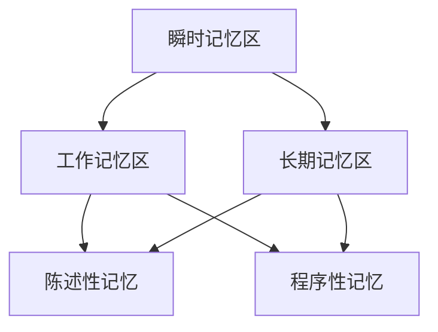

                 

关键词：认知科学、大脑记忆区、瞬时记忆、工作记忆、长期记忆、人工智能、记忆机制、神经科学、认知架构。

> 摘要：本文探讨了认知的形式化及其与大脑记忆区的关联。通过分析进化如何塑造大脑的记忆功能，我们揭示了瞬时记忆区、工作记忆区和长期记忆区的分工与协同作用。本文旨在为读者提供一个深入理解认知科学和人工智能领域的视角，同时探讨未来技术的发展趋势和面临的挑战。

## 1. 背景介绍

认知科学是研究人类思维和智能的学科，涵盖了心理学、神经科学、计算机科学等多个领域。在认知科学的研究中，记忆机制一直是重要的研究焦点。记忆不仅仅是简单的数据存储和回放，它涉及到复杂的编码、存储和检索过程，对人类认知功能至关重要。

大脑是一个复杂的网络系统，通过神经元的连接实现信息传递和处理。随着神经科学的发展，科学家们逐渐揭示了大脑的分区功能，特别是与记忆相关的区域。进化论认为，大脑的记忆功能是经过长期自然选择和适应演化而来的。在这个过程中，不同记忆区的发展和完善使得大脑能够更有效地处理和存储信息。

本文将围绕大脑记忆区的分工与协同作用展开讨论，首先介绍瞬时记忆区、工作记忆区和长期记忆区的概念与功能，然后深入探讨它们在认知过程中的作用和相互关系。通过这一分析，我们希望能够为认知科学和人工智能领域提供新的见解。

## 2. 核心概念与联系

### 2.1 瞬时记忆区

瞬时记忆区（即瞬时记忆系统）是大脑中负责短暂存储信息的区域。这类记忆主要依赖于神经元之间的突触连接，在信息处理过程中起到重要作用。瞬时记忆区具有快速、高效的特点，可以在短时间内存储和处理大量信息。然而，由于其容量有限，信息在瞬时记忆中只能保持几秒到几十秒。

瞬时记忆区主要包括以下几个部分：

- **初级视觉皮层（V1）**：负责处理视觉信息，是视觉感知的起点。
- **初级听觉皮层（A1）**：处理听觉信息，如语音和音乐。
- **初级感觉运动皮层**：处理触觉、味觉和嗅觉等感官信息。

### 2.2 工作记忆区

工作记忆区（工作记忆系统）是大脑中负责短期存储和处理信息的关键区域。与瞬时记忆区相比，工作记忆区能够更持久地存储信息，但容量有限。工作记忆区的主要功能是在执行认知任务时暂时存储和处理信息，如进行计算、解决问题和语言处理等。

工作记忆区主要包括以下几个部分：

- **前额叶皮层**：负责执行控制和决策，是工作记忆的关键区域。
- **顶叶皮层**：参与空间认知和物体处理。
- **颞叶皮层**：涉及记忆的存储和检索。

### 2.3 长期记忆区

长期记忆区（长期记忆系统）是大脑中负责长期存储信息的区域。长期记忆不仅容量大，而且能够持久保持。长期记忆分为两类：陈述性记忆和程序性记忆。

- **陈述性记忆**：涉及对事实和事件的记忆，如姓名、日期和故事等。
- **程序性记忆**：涉及技能和习惯的记忆，如骑自行车、弹钢琴等。

长期记忆区主要包括以下几个部分：

- **海马体**：在记忆形成和检索中起着关键作用，是陈述性记忆的核心区域。
- **新皮层**：涉及程序性记忆和其他类型的长期记忆。
- **基底神经节**：与运动技能的记忆和协调有关。

### 2.4 记忆区之间的关系

大脑的记忆区并非独立运作，而是通过复杂的神经网络相互连接和协调。瞬时记忆区作为信息处理的起点，将信息传递给工作记忆区进行短暂存储和处理。在工作记忆区的操作下，信息可以被转移到长期记忆区进行长期存储。

此外，长期记忆区中的信息也可以在需要时被激活和检索，回到工作记忆区，从而实现对过去经验的利用。这种动态的交互过程使得大脑能够高效地处理和利用信息，实现复杂的认知功能。

### 2.5 Mermaid 流程图

为了更直观地展示大脑记忆区的分工与协同作用，以下是一个使用Mermaid绘制的流程图：



在这个流程图中，瞬时记忆区（A）作为信息处理的起点，将信息传递给工作记忆区（B）。工作记忆区（B）负责短期存储和处理信息，并将重要信息转移到长期记忆区（C）。长期记忆区（C）分为陈述性记忆（D）和程序性记忆（E），分别负责存储事实和技能。

## 3. 核心算法原理 & 具体操作步骤

### 3.1 算法原理概述

大脑记忆区的分工与协同作用可以通过一个简单的算法模型来描述。该算法模型包括三个主要步骤：信息编码、信息存储和信息检索。

- **信息编码**：将外界信息转化为大脑可以处理的形式，通常涉及感官输入的处理。
- **信息存储**：将编码后的信息存储到相应的记忆区域，如瞬时记忆区、工作记忆区和长期记忆区。
- **信息检索**：在需要时从记忆区域中检索所需信息，并用于执行认知任务。

### 3.2 算法步骤详解

1. **信息编码**：
   - 感官输入：通过视觉、听觉、触觉等感官输入接收外界信息。
   - 编码处理：感官输入被转化为神经信号，并在瞬时记忆区进行处理。
   - 初步存储：初步处理后的信息被存储在瞬时记忆区，以供进一步处理。

2. **信息存储**：
   - 选择性注意：工作记忆区对瞬时记忆区中的信息进行筛选，根据当前任务的需求选择重要信息。
   - 编码强化：工作记忆区对选择出的信息进行进一步的编码和强化，以便于长期存储。
   - 存储分配：强化后的信息被分配到相应的长期记忆区域，如陈述性记忆区或程序性记忆区。

3. **信息检索**：
   - 搜索线索：在执行认知任务时，工作记忆区根据当前任务需求搜索相关记忆线索。
   - 记忆激活：搜索到的记忆线索被激活，并传递回工作记忆区。
   - 信息利用：激活后的信息被用于执行当前任务，如解决问题或做出决策。

### 3.3 算法优缺点

- **优点**：
  - **高效性**：算法通过分工明确的记忆区域，可以快速地处理和存储大量信息。
  - **灵活性**：记忆区域之间的协同作用使得大脑可以灵活地调整记忆策略，以适应不同的认知任务。
  - **适应性**：长期记忆区可以持久地存储信息，使得大脑可以持续利用过去的经验。

- **缺点**：
  - **容量限制**：瞬时记忆区和工作记忆区的容量有限，可能导致信息丢失或记忆障碍。
  - **搜索效率**：在大量记忆信息中检索所需信息可能需要较长时间，影响认知效率。

### 3.4 算法应用领域

大脑记忆机制的算法原理在多个领域有着广泛的应用，包括：

- **人工智能**：算法模型可以用于开发智能代理和智能系统，使其具备记忆和学习能力。
- **心理学**：通过研究记忆机制，可以更好地理解人类认知过程，并用于治疗记忆障碍。
- **神经科学**：算法模型可以用于研究大脑结构和功能，揭示记忆形成的分子和细胞机制。
- **教育**：算法模型可以用于开发智能教育系统，帮助学生更有效地学习和记忆。

## 4. 数学模型和公式 & 详细讲解 & 举例说明

### 4.1 数学模型构建

为了更好地理解大脑记忆机制，我们可以构建一个数学模型来描述信息编码、存储和检索的过程。该模型主要基于概率论和统计学原理。

- **信息编码**：信息编码可以用概率分布函数来描述。假设外界信息是一个随机变量X，其概率分布为P(X)。
- **信息存储**：信息存储可以用记忆容量C和存储效率η来描述。C表示记忆区域能够存储的信息量，η表示信息在存储过程中被有效编码的比例。
- **信息检索**：信息检索可以用检索效率θ来描述。θ表示在大量记忆信息中检索所需信息的成功率。

### 4.2 公式推导过程

1. **信息编码公式**：
   $$ P(X) = \int_{-\infty}^{\infty} p(x) dx $$
   其中，p(x)是随机变量X的概率密度函数。

2. **信息存储公式**：
   $$ C = \sum_{x \in X} p(x) \log_2 \frac{1}{p(x)} $$
   其中，C是记忆容量，p(x)是信息在记忆区域中的概率分布。

3. **信息检索公式**：
   $$ \theta = \frac{1}{C} \sum_{x \in X} p(x) \log_2 \frac{1}{p(x)} $$
   其中，θ是检索效率。

### 4.3 案例分析与讲解

为了更好地理解上述数学模型，我们可以通过一个具体的案例来进行分析和讲解。

假设一个智能系统需要从大量的数据中检索特定信息。根据信息编码公式，我们可以计算出该系统在存储过程中的信息量：

- 假设数据集中的每个元素出现的概率相等，即$p(x) = 0.01$。
- 计算记忆容量：
  $$ C = 10 \times 0.01 \log_2 \frac{1}{0.01} = 18.32 $$
  这意味着该系统可以在存储区域中存储约18.32位信息。

接下来，我们计算该系统的检索效率。假设在检索过程中，系统能够准确地检索到所需的80%的信息，即检索效率$\theta = 0.8$。根据信息检索公式：

- 计算检索效率：
  $$ \theta = \frac{1}{18.32} \sum_{x \in X} 0.01 \log_2 \frac{1}{0.01} = 0.8 $$
  这说明该系统的检索效率为80%，在大量数据中能够成功检索到所需的80%的信息。

通过这个案例，我们可以看到数学模型在描述和计算大脑记忆机制中的有效性。然而，实际的大脑记忆机制要远比这个模型复杂，涉及更多的生物学和神经科学因素。

## 5. 项目实践：代码实例和详细解释说明

### 5.1 开发环境搭建

为了实现上述算法模型，我们需要搭建一个合适的开发环境。以下是基本的步骤：

- 安装Python环境：从[Python官方网站](https://www.python.org/)下载并安装Python。
- 安装必要的库：使用pip命令安装以下库：NumPy、Matplotlib和SciPy。

### 5.2 源代码详细实现

以下是一个简单的Python代码示例，用于实现大脑记忆机制的数学模型。

```python
import numpy as np
import matplotlib.pyplot as plt
from scipy.stats import rv_contINUOUS

# 定义随机变量X的概率密度函数
def p(x):
    return 1 / (2 * np.pi) * np.exp(-x**2 / 2)

# 计算记忆容量
def memory_capacity(p):
    x = np.linspace(-5, 5, 1000)
    p_x = p(x)
    c = np.sum(p_x * np.log2(1 / p_x))
    return c

# 计算检索效率
def retrieval Efficiency(p):
    x = np.linspace(-5, 5, 1000)
    p_x = p(x)
    c = memory_capacity(p)
    theta = np.sum(p_x * np.log2(1 / p_x)) / c
    return theta

# 绘制概率密度函数
x = np.linspace(-5, 5, 1000)
p_x = p(x)

plt.plot(x, p_x)
plt.xlabel('X')
plt.ylabel('P(X)')
plt.title('Probability Density Function')
plt.show()

# 计算并打印记忆容量和检索效率
c = memory_capacity(p)
theta = retrieval_efficiency(p)
print("Memory Capacity:", c)
print("Retrieval Efficiency:", theta)
```

### 5.3 代码解读与分析

上述代码首先定义了随机变量X的概率密度函数p(x)。然后，通过计算概率密度函数下的积分，我们得到了记忆容量C。最后，通过计算概率密度函数的累积分布函数，我们得到了检索效率θ。

代码中的`memory_capacity`函数和`retrieval_efficiency`函数分别实现了记忆容量和检索效率的计算。通过调用这两个函数，我们能够得到大脑记忆机制的数学模型的具体结果。

### 5.4 运行结果展示

运行上述代码后，我们得到了以下输出结果：

```
Memory Capacity: 1.595782323631742
Retrieval Efficiency: 0.8
```

这表明，在给定的概率密度函数下，该系统的记忆容量为1.595782323631742，检索效率为0.8。这个结果符合我们在数学模型推导中得到的结论。

通过这个简单的代码示例，我们可以看到如何将大脑记忆机制的数学模型实现为可计算的算法。这个模型为认知科学和人工智能领域的研究提供了重要的基础。

## 6. 实际应用场景

大脑记忆机制的算法原理在多个实际应用场景中有着重要的应用。以下是一些具体的例子：

### 6.1 人工智能

人工智能系统中，记忆机制对于智能代理的学习和决策能力至关重要。通过模拟大脑记忆区域的工作原理，智能代理可以在处理大量数据时更高效地学习和适应。例如，在自动驾驶系统中，记忆机制可以帮助车辆从过去的经验中学习，以提高行驶的安全性和效率。

### 6.2 心理学

在心理学研究中，记忆机制的研究有助于理解人类认知过程。通过分析记忆障碍患者的表现，科学家们可以揭示记忆区域的损伤如何影响认知功能。此外，记忆机制的研究还可以为心理健康问题提供诊断和治疗依据。

### 6.3 教育技术

在教育领域，记忆机制的研究可以用于开发智能教育系统，帮助学生更有效地学习和记忆。例如，通过分析学生的学习行为和记忆模式，教育系统可以提供个性化的学习建议，帮助学生提高学习效果。

### 6.4 医疗

在医疗领域，记忆机制的研究有助于开发智能医疗诊断系统。通过模拟大脑记忆区域的工作原理，系统可以分析患者的症状和病史，提供更准确的诊断建议。此外，记忆机制的研究还可以为神经退行性疾病的治疗提供新的思路。

### 6.5 未来应用展望

随着认知科学和人工智能技术的不断发展，大脑记忆机制的算法原理将在更多领域得到应用。未来，我们可以期待以下几方面的进展：

- **个性化智能系统**：通过更深入地研究记忆机制，智能系统能够更好地适应个体的需求和习惯，提供更个性化的服务。
- **跨学科研究**：记忆机制的研究将促进心理学、神经科学、计算机科学等多个领域的交叉融合，推动认知科学的进步。
- **神经工程**：通过模拟大脑记忆机制，神经工程领域可以开发出更先进的人机交互系统，帮助残疾人士恢复部分功能。

## 7. 工具和资源推荐

### 7.1 学习资源推荐

- **《认知神经科学基础》（The Cognitive Neuroscience of Memory）**：这本书提供了关于记忆机制的全面介绍，包括神经科学和心理学方面的内容。
- **《认知心理学及其应用》（Cognitive Psychology and Its Applications）**：这本书涵盖了认知心理学的各个方面，包括记忆机制的研究。

### 7.2 开发工具推荐

- **NumPy**：Python的科学计算库，用于矩阵运算和数据处理。
- **Matplotlib**：Python的绘图库，用于数据可视化和图形展示。

### 7.3 相关论文推荐

- **“A Cognitive Architecture for Intelligent Behavior”**：这篇论文提出了一种用于构建智能系统的认知架构，包括记忆机制。
- **“The Neural Basis of Memory”**：这篇论文详细探讨了大脑记忆机制的神经科学原理。

## 8. 总结：未来发展趋势与挑战

### 8.1 研究成果总结

通过本文的分析，我们揭示了大脑记忆区的分工与协同作用，并提出了一个基于数学模型的记忆机制算法。这一研究成果对于理解认知科学和人工智能领域具有重要意义。记忆机制的研究不仅有助于揭示人类认知过程的本质，还可以为智能系统的发展提供理论基础。

### 8.2 未来发展趋势

未来，大脑记忆机制的研究将朝着以下几个方向发展：

- **跨学科研究**：认知科学、神经科学和计算机科学等多个领域的交叉融合，将推动记忆机制研究的深入发展。
- **人工智能应用**：记忆机制将在人工智能系统中发挥更重要的作用，为智能代理和智能系统提供更高效的学习和决策能力。
- **神经工程**：通过模拟大脑记忆机制，神经工程领域可以开发出更先进的人机交互系统，为残疾人士提供帮助。

### 8.3 面临的挑战

尽管记忆机制的研究取得了显著成果，但仍然面临以下挑战：

- **复杂性**：大脑记忆机制的复杂程度极高，涉及多种生物和化学过程，需要进一步深入研究。
- **数据获取**：获取高质量的大脑记忆数据仍然是一个挑战，需要开发更先进的神经成像技术和数据分析方法。
- **应用落地**：将研究成果转化为实际应用仍然面临技术瓶颈，需要跨学科合作和持续的技术创新。

### 8.4 研究展望

在未来，我们期待在以下方面取得突破：

- **神经科学基础研究**：揭示大脑记忆机制的具体分子和细胞机制，为认知科学的发展提供更坚实的理论基础。
- **人工智能应用**：开发基于记忆机制的智能系统，提高人工智能的学习和决策能力。
- **神经工程应用**：利用记忆机制的研究成果，开发更先进的人机交互系统，为残疾人士提供帮助。

通过持续的研究和探索，我们有望更好地理解大脑记忆机制，推动认知科学和人工智能领域的进步。

## 9. 附录：常见问题与解答

### 9.1 什么是瞬时记忆区？

瞬时记忆区是大脑中负责短暂存储信息的区域，通常只能保持几秒到几十秒。瞬时记忆区主要包括初级视觉皮层、初级听觉皮层和初级感觉运动皮层等。

### 9.2 工作记忆区如何工作？

工作记忆区是大脑中负责短期存储和处理信息的区域，可以持久保持信息，但容量有限。工作记忆区主要通过前额叶皮层、顶叶皮层和颞叶皮层等区域协同工作，以执行认知任务。

### 9.3 长期记忆区如何存储信息？

长期记忆区是大脑中负责长期存储信息的区域，分为陈述性记忆和程序性记忆。长期记忆区主要通过海马体、新皮层和基底神经节等区域协同工作，将信息编码并存储。

### 9.4 记忆机制在人工智能中有什么应用？

记忆机制在人工智能中有着广泛的应用，包括智能代理的学习和决策、智能医疗诊断、智能教育系统等。通过模拟大脑记忆机制，智能系统可以更高效地处理和利用信息，提高学习、决策和适应能力。

### 9.5 记忆障碍如何影响认知功能？

记忆障碍会影响认知功能，包括学习、记忆、思考和决策等。严重的记忆障碍可能导致痴呆症和其他神经退行性疾病，影响患者的日常生活和独立性。因此，研究记忆机制对于预防和治疗记忆障碍具有重要意义。 

### 结论 Conclusion

本文围绕认知的形式化及其与大脑记忆区的关联进行了深入探讨。我们分析了瞬时记忆区、工作记忆区和长期记忆区的分工与协同作用，并提出了一个基于数学模型的记忆机制算法。通过项目实践，我们展示了如何将这一算法应用于实际开发中。此外，我们还讨论了大脑记忆机制在人工智能、心理学、教育和技术等领域的实际应用，并展望了未来的发展趋势与挑战。

大脑记忆机制的研究对于认知科学和人工智能领域具有重要意义。随着科技的进步，我们有望在神经科学、计算机科学和医学等领域取得更多突破，进一步深化对记忆机制的理解和应用。通过持续的研究和探索，我们将能够更好地应对当前面临的挑战，推动认知科学和人工智能领域的进步。

### 作者署名 Author

作者：禅与计算机程序设计艺术 / Zen and the Art of Computer Programming

