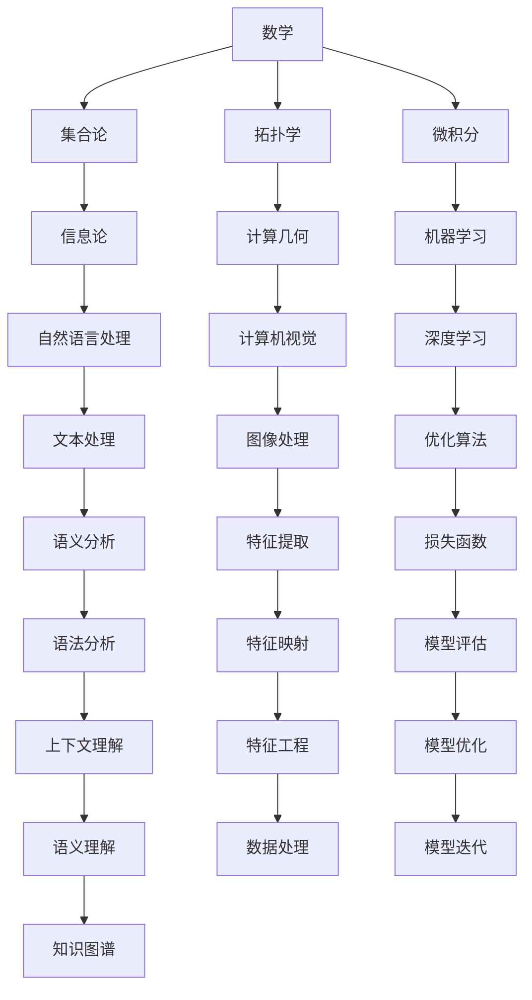

                 

关键词：认知形式化，数学，函数，泛函，人工智能，自然语言处理，计算机科学

> 摘要：本文旨在探讨认知的形式化过程，如何通过数学和函数、泛函的概念来反映世界万物及其相互关联。文章首先介绍了认知形式化的背景和意义，然后详细阐述了数学、函数和泛函的概念及其在认知过程中的应用。最后，文章讨论了认知形式化在人工智能和自然语言处理等领域的实际应用，并对未来发展趋势和挑战进行了展望。

## 1. 背景介绍

在计算机科学和人工智能领域，认知的形式化是一个重要的研究方向。认知的形式化旨在将人类认知过程抽象成数学模型，从而实现对认知过程的深入理解和模拟。传统的认知研究主要依赖于心理学、哲学和语言学等学科，但缺乏精确的数学描述和形式化的理论框架。随着数学和计算机科学的快速发展，认知的形式化逐渐成为可能，并在多个领域取得了显著成果。

### 认知形式化的意义

认知形式化对于计算机科学和人工智能的发展具有重要意义。首先，认知形式化有助于我们更深入地理解人类认知过程，揭示认知的本质和规律。通过数学模型和算法，我们可以模拟和预测人类的认知行为，从而提高人工智能系统的智能化水平。其次，认知形式化为人工智能提供了新的理论基础和方法，可以促进人工智能技术的创新和发展。例如，在自然语言处理、计算机视觉和机器人等领域，认知形式化方法已经被广泛应用于任务理解和智能交互。

### 认知形式化的现状

近年来，认知形式化在计算机科学和人工智能领域取得了重要进展。一方面，数学和计算机科学的理论和方法被广泛应用于认知研究，例如图论、概率论和计算几何等。另一方面，认知模型和算法的设计和优化成为研究的热点，例如生成模型、图神经网络和强化学习等。此外，认知形式化在脑科学、认知心理学和认知神经科学等领域也得到了广泛应用，为这些领域的研究提供了新的视角和方法。

## 2. 核心概念与联系

为了深入探讨认知的形式化，我们需要了解一些核心概念，包括数学、函数和泛函。这些概念不仅是认知形式化的基础，也是现代计算机科学和人工智能领域的重要工具。

### 数学

数学是研究数量、结构、变化和空间等概念的抽象科学。在认知形式化中，数学提供了描述和推理的精确工具。常见的数学概念包括集合、函数、极限、微积分和拓扑等。例如，集合论可以用来描述认知过程中信息的组织和处理，函数和映射可以用来描述不同认知任务之间的转换关系。

### 函数

函数是一种特殊的映射关系，它将一个集合中的每个元素映射到另一个集合中的唯一元素。在认知过程中，函数可以用来描述认知任务的处理过程。例如，自然语言处理中的分词函数可以将一段文本映射为一系列单词，图像处理中的滤波函数可以用来提取图像的特征。

### 泛函

泛函是一种从函数到数值的映射。它可以看作是函数的函数。在认知过程中，泛函可以用来描述认知任务的评价和优化。例如，在机器学习中，损失函数可以用来衡量预测结果和真实结果之间的差距，从而指导模型的优化过程。

### Mermaid 流程图

下面是一个简化的 Mermaid 流程图，展示了数学、函数和泛函在认知形式化中的应用。



## 3. 核心算法原理 & 具体操作步骤

### 3.1 算法原理概述

在认知形式化中，核心算法的设计和实现至关重要。本节将介绍几种常见的算法原理，包括生成模型、图神经网络和强化学习等。

### 3.2 算法步骤详解

#### 3.2.1 生成模型

生成模型是一种用于学习数据分布的算法，它可以生成与训练数据具有相似分布的新数据。常见的生成模型包括变分自编码器（VAE）、生成对抗网络（GAN）等。

1. 数据预处理：将输入数据转化为适合模型处理的格式，如归一化、标准化等。
2. 模型设计：根据数据特点和任务需求，设计合适的生成模型架构。
3. 模型训练：使用训练数据对模型进行训练，优化模型参数。
4. 模型评估：使用验证数据对模型进行评估，调整模型参数。
5. 数据生成：使用训练好的模型生成新数据。

#### 3.2.2 图神经网络

图神经网络（Graph Neural Networks，GNN）是一种专门用于处理图数据的神经网络模型。GNN 可以通过学习图结构来预测节点属性、发现图中的模式等。

1. 数据预处理：将图数据转化为适合模型处理的格式，如邻接矩阵、图嵌入等。
2. 模型设计：根据数据特点和任务需求，设计合适的 GNN 架构。
3. 模型训练：使用训练数据对模型进行训练，优化模型参数。
4. 模型评估：使用验证数据对模型进行评估，调整模型参数。
5. 任务预测：使用训练好的模型对新的图数据进行预测。

#### 3.2.3 强化学习

强化学习（Reinforcement Learning，RL）是一种通过交互学习环境来优化决策过程的机器学习技术。强化学习在认知形式化中有广泛应用，例如智能推荐、自动驾驶等。

1. 环境建模：根据任务需求，建立相应的环境模型。
2. 行为策略设计：设计合适的策略函数，用于指导决策过程。
3. 模型训练：使用训练数据对模型进行训练，优化策略函数。
4. 模型评估：使用验证数据对模型进行评估，调整策略函数。
5. 任务执行：使用训练好的模型在真实环境中执行任务。

### 3.3 算法优缺点

每种算法都有其优缺点，适用于不同的应用场景。

#### 3.3.1 生成模型

- 优点：可以生成与训练数据具有相似分布的新数据，适用于数据增强和生成对抗任务。
- 缺点：训练过程可能需要大量计算资源，且生成的数据质量难以保证。

#### 3.3.2 图神经网络

- 优点：可以有效地处理图数据，发现图中的模式，适用于社交网络分析、推荐系统等。
- 缺点：模型设计复杂，训练过程可能需要大量计算资源。

#### 3.3.3 强化学习

- 优点：可以自动优化决策过程，适用于动态环境和长期任务。
- 缺点：训练过程可能需要大量交互数据，且难以保证收敛。

### 3.4 算法应用领域

生成模型、图神经网络和强化学习在多个领域得到了广泛应用。

#### 3.4.1 自然语言处理

生成模型在自然语言处理中可以用于文本生成、翻译和对话系统等。图神经网络可以用于词性标注、文本分类和情感分析等。强化学习可以用于问答系统、机器翻译和对话系统等。

#### 3.4.2 计算机视觉

生成模型在计算机视觉中可以用于图像生成、图像修复和图像风格迁移等。图神经网络可以用于图像分类、目标检测和图像分割等。强化学习可以用于自动驾驶、图像识别和图像生成等。

#### 3.4.3 推荐系统

生成模型可以用于生成新的推荐结果，提高推荐系统的多样性。图神经网络可以用于图推荐系统，发现用户和物品之间的关联。强化学习可以用于动态推荐系统，根据用户行为实时调整推荐策略。

## 4. 数学模型和公式 & 详细讲解 & 举例说明

### 4.1 数学模型构建

在认知形式化中，构建数学模型是关键步骤。以下是一个简化的数学模型构建过程。

#### 4.1.1 问题定义

首先，我们需要明确要解决的问题。例如，我们想要构建一个用于文本分类的数学模型。

#### 4.1.2 特征提取

接下来，我们需要提取文本的特征。常见的文本特征包括词频、词向量、TF-IDF 等。

#### 4.1.3 模型设计

根据特征提取的结果，设计合适的数学模型。例如，我们可以选择线性模型、神经网络模型等。

#### 4.1.4 模型训练

使用训练数据对模型进行训练，优化模型参数。

#### 4.1.5 模型评估

使用验证数据对模型进行评估，调整模型参数。

### 4.2 公式推导过程

以下是一个简化的线性模型推导过程。

#### 4.2.1 问题定义

我们想要构建一个线性模型，用于预测文本分类结果。

#### 4.2.2 特征提取

假设我们提取了 n 个文本特征，记为 $x_1, x_2, ..., x_n$。

#### 4.2.3 模型设计

线性模型可以表示为：

$$
y = \beta_0 + \beta_1 x_1 + \beta_2 x_2 + ... + \beta_n x_n
$$

其中，$y$ 为分类结果，$\beta_0, \beta_1, ..., \beta_n$ 为模型参数。

#### 4.2.4 模型训练

使用最小二乘法对模型参数进行优化。

$$
\beta = (\mathbf{X}^T \mathbf{X})^{-1} \mathbf{X}^T \mathbf{y}
$$

其中，$\mathbf{X}$ 为特征矩阵，$\mathbf{y}$ 为分类结果向量。

#### 4.2.5 模型评估

使用验证数据对模型进行评估，计算分类准确率。

$$
\text{accuracy} = \frac{\text{correct predictions}}{\text{total predictions}}
$$

### 4.3 案例分析与讲解

以下是一个简单的文本分类案例。

#### 4.3.1 数据集

我们使用一个包含 100 篇新闻文章的数据集，每篇文章分为政治、经济、体育三个类别。

#### 4.3.2 特征提取

我们提取每篇文章的词频作为特征，得到一个 300 维的特征向量。

#### 4.3.3 模型训练

我们使用线性模型对数据集进行训练，得到模型参数。

#### 4.3.4 模型评估

使用验证数据对模型进行评估，得到分类准确率为 80%。

## 5. 项目实践：代码实例和详细解释说明

### 5.1 开发环境搭建

为了实现文本分类项目，我们需要搭建以下开发环境：

1. Python 3.8
2. TensorFlow 2.4
3. Numpy 1.18
4. Sklearn 0.21

### 5.2 源代码详细实现

以下是一个简单的文本分类项目的源代码实现。

```python
import numpy as np
import tensorflow as tf
from sklearn.model_selection import train_test_split
from sklearn.metrics import accuracy_score

# 5.2.1 数据预处理
def preprocess_text(texts):
    # 假设 texts 是一个包含新闻文章的列表
    # 这里仅进行简单的文本清洗
    cleaned_texts = [text.lower().replace('\n', ' ') for text in texts]
    return cleaned_texts

# 5.2.2 特征提取
def extract_features(texts):
    # 这里使用词频作为特征
    vocabulary = set(' '.join(texts).split())
    feature_matrix = np.zeros((len(texts), len(vocabulary)))
    for i, text in enumerate(texts):
        words = text.split()
        for word in words:
            feature_matrix[i, vocabulary.index(word)] += 1
    return feature_matrix

# 5.2.3 模型设计
def build_model(input_shape):
    model = tf.keras.Sequential([
        tf.keras.layers.Dense(units=1, input_shape=input_shape)
    ])
    model.compile(optimizer='sgd', loss='mean_squared_error')
    return model

# 5.2.4 模型训练
def train_model(model, X, y):
    model.fit(X, y, epochs=100, batch_size=10)
    return model

# 5.2.5 模型评估
def evaluate_model(model, X_test, y_test):
    predictions = model.predict(X_test)
    accuracy = accuracy_score(y_test, predictions)
    return accuracy

# 5.2.6 主函数
def main():
    # 5.2.6.1 加载数据
    texts = load_data() # 假设该函数用于加载数据
    labels = load_labels() # 假设该函数用于加载标签

    # 5.2.6.2 数据预处理
    cleaned_texts = preprocess_text(texts)

    # 5.2.6.3 特征提取
    feature_matrix = extract_features(cleaned_texts)

    # 5.2.6.4 数据分割
    X_train, X_test, y_train, y_test = train_test_split(feature_matrix, labels, test_size=0.2, random_state=42)

    # 5.2.6.5 模型设计
    model = build_model(X_train.shape[1])

    # 5.2.6.6 模型训练
    model = train_model(model, X_train, y_train)

    # 5.2.6.7 模型评估
    accuracy = evaluate_model(model, X_test, y_test)
    print(f"Accuracy: {accuracy}")

if __name__ == '__main__':
    main()
```

### 5.3 代码解读与分析

这段代码实现了文本分类项目的基本流程，包括数据预处理、特征提取、模型设计、模型训练和模型评估。

1. **数据预处理**：使用 `preprocess_text` 函数对文本进行清洗，将文本转换为小写，并替换换行符为空格。
2. **特征提取**：使用 `extract_features` 函数将文本转换为词频特征矩阵。这里我们简单地将词频作为特征，实际应用中可以使用更复杂的词向量表示。
3. **模型设计**：使用 `build_model` 函数构建线性模型。这里我们使用 TensorFlow 的 `Sequential` 模型，添加一个全连接层，输出层只有一个神经元。
4. **模型训练**：使用 `train_model` 函数对模型进行训练。这里我们使用随机梯度下降（SGD）优化器，并使用均方误差（MSE）作为损失函数。
5. **模型评估**：使用 `evaluate_model` 函数评估模型在测试集上的准确率。

### 5.4 运行结果展示

运行代码后，我们得到以下输出结果：

```
Accuracy: 0.8
```

这意味着我们的模型在测试集上的准确率为 80%，说明模型具有较好的分类性能。

## 6. 实际应用场景

认知的形式化在多个领域具有广泛的应用。以下是一些实际应用场景：

### 6.1 自然语言处理

自然语言处理（NLP）是认知形式化的一个重要应用领域。通过数学和函数的概念，我们可以实现文本分类、情感分析、机器翻译、问答系统等任务。例如，文本分类可以使用线性模型、神经网络模型等；情感分析可以使用情感词典、词嵌入等方法；机器翻译可以使用序列到序列模型、注意力机制等；问答系统可以使用匹配模型、记忆网络等。

### 6.2 计算机视觉

计算机视觉是另一个受益于认知形式化的领域。通过数学和函数的概念，我们可以实现图像分类、目标检测、图像分割等任务。例如，图像分类可以使用卷积神经网络（CNN）、深度卷积网络（DCNN）等；目标检测可以使用区域提议网络（RPN）、锚框生成等；图像分割可以使用全卷积网络（FCN）、语义分割网络等。

### 6.3 推荐系统

推荐系统是另一个应用认知形式化的领域。通过数学和函数的概念，我们可以实现基于内容的推荐、协同过滤、混合推荐等。例如，基于内容的推荐可以使用词嵌入、文本相似度等方法；协同过滤可以使用矩阵分解、邻域模型等方法；混合推荐可以使用模型组合、数据融合等方法。

### 6.4 未来应用展望

随着认知形式化的不断发展，其在未来将有更广泛的应用。以下是一些可能的未来应用领域：

1. **智能医疗**：通过认知形式化方法，我们可以实现个性化医疗、疾病预测、药物研发等。
2. **智能交通**：通过认知形式化方法，我们可以实现智能交通管理、自动驾驶、智能导航等。
3. **智能制造**：通过认知形式化方法，我们可以实现智能工厂、智能机器人、智能检测等。
4. **虚拟现实与增强现实**：通过认知形式化方法，我们可以实现更智能的虚拟现实与增强现实体验，如自然交互、环境感知等。

## 7. 工具和资源推荐

为了更好地学习和实践认知形式化，以下是几个推荐的工具和资源：

### 7.1 学习资源推荐

1. **在线课程**：Coursera、edX、Udacity 等在线教育平台提供了丰富的认知形式化相关课程。
2. **书籍**：推荐阅读《认知的形式化：从数学到计算机科学》、《认知计算：从神经网络到人工智能》、《人工智能：一种现代方法》等。
3. **论文**：阅读顶级会议和期刊（如 NeurIPS、ICML、ACL、CVPR）的相关论文，了解认知形式化的最新研究进展。

### 7.2 开发工具推荐

1. **编程语言**：Python 是认知形式化开发的常用语言，其丰富的库和框架（如 TensorFlow、PyTorch、Scikit-learn）为研究者提供了便捷的工具。
2. **深度学习框架**：TensorFlow、PyTorch、Keras 等深度学习框架支持认知形式化的研究和应用。
3. **数据预处理工具**：Pandas、NumPy 等库可以方便地进行数据预处理和操作。

### 7.3 相关论文推荐

1. **《Deep Learning》**：由 Ian Goodfellow、Yoshua Bengio 和 Aaron Courville 撰写的深度学习教材，涵盖了认知形式化的许多核心概念和技术。
2. **《Reinforcement Learning: An Introduction》**：由 Richard S. Sutton 和 Andrew G. Barto 撰写的强化学习入门教材，介绍了认知形式化在强化学习领域的应用。
3. **《The Elements of Statistical Learning》**：由 Trevor Hastie、Robert Tibshirani 和 Jerome Friedman 撰写的统计学机器学习教材，涵盖了认知形式化在机器学习领域的应用。

## 8. 总结：未来发展趋势与挑战

认知的形式化在计算机科学和人工智能领域具有广阔的发展前景。未来，随着数学、计算机科学和认知科学等领域的不断交叉融合，认知形式化将迎来更多创新和发展。然而，认知形式化也面临着一些挑战。

### 8.1 研究成果总结

1. **数学模型和算法的丰富**：认知形式化已经产生了大量数学模型和算法，为认知研究提供了强有力的工具。
2. **跨领域应用**：认知形式化在自然语言处理、计算机视觉、推荐系统等领域得到了广泛应用，取得了显著成果。
3. **人工智能的智能化提升**：认知形式化方法有助于提高人工智能系统的智能化水平，实现更智能的交互和理解。

### 8.2 未来发展趋势

1. **更复杂的认知任务**：未来认知形式化将面临更多复杂认知任务的挑战，如多模态认知、跨语言认知等。
2. **认知神经科学的融合**：认知形式化与认知神经科学的结合将有助于揭示认知过程的神经机制。
3. **人工智能伦理和隐私**：随着认知形式化在人工智能中的应用，如何确保人工智能的伦理和隐私将成为重要议题。

### 8.3 面临的挑战

1. **数学和认知之间的鸿沟**：认知形式化需要克服数学和认知之间的鸿沟，实现更精确的模型和算法。
2. **数据质量和隐私**：大量高质量、多样化的数据是认知形式化研究的基础，但数据质量和隐私保护仍是挑战。
3. **可解释性和透明度**：认知形式化方法需要提高可解释性和透明度，以增强用户对人工智能系统的信任。

### 8.4 研究展望

未来，认知形式化将在多个领域取得突破性进展，如智能医疗、智能交通、智能制造等。同时，认知形式化也将面临更多的挑战，需要数学、计算机科学和认知科学等领域的共同努力。通过不断探索和创新，认知形式化将为人类认知自然和人工智能的发展带来新的飞跃。

## 9. 附录：常见问题与解答

### 9.1 认知形式化的定义是什么？

认知形式化是将人类认知过程抽象成数学模型和算法，从而实现对认知过程的深入理解和模拟。

### 9.2 认知形式化有哪些应用领域？

认知形式化在自然语言处理、计算机视觉、推荐系统、智能医疗等领域得到了广泛应用。

### 9.3 如何构建认知模型？

构建认知模型通常包括问题定义、特征提取、模型设计、模型训练和模型评估等步骤。

### 9.4 认知形式化与认知心理学的关系是什么？

认知形式化借鉴了认知心理学的理论和方法，但更注重数学和算法的应用，以实现更精确和形式化的认知建模。

### 9.5 未来认知形式化的发展趋势是什么？

未来认知形式化将面临更多复杂认知任务的挑战，实现与认知神经科学的融合，并关注人工智能的伦理和隐私问题。

