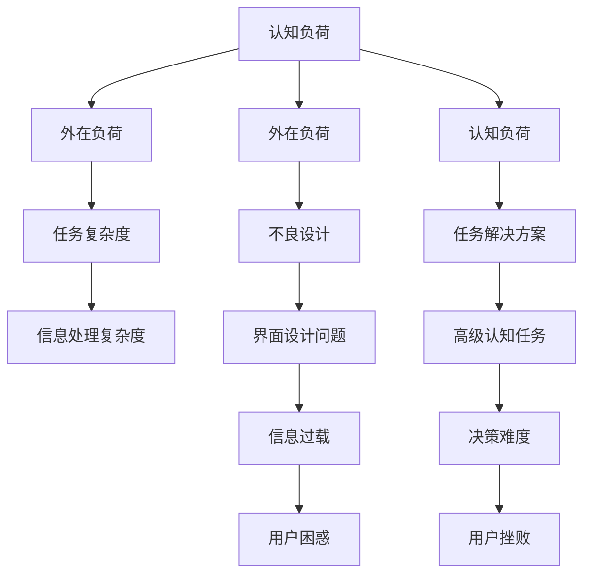

                 

 认知负荷与用户体验设计之间的关系是现代计算机科学和设计领域中的一个关键议题。认知负荷是指人们在处理信息时所需的认知资源，包括注意、记忆、推理等。而用户体验设计则关注如何通过产品和服务设计来提升用户的满意度与使用效率。本文将探讨认知负荷如何影响用户体验设计，并提供相应的策略和最佳实践。

> 关键词：认知负荷，用户体验设计，信息处理，认知资源，界面设计，任务流优化，易用性测试

> 摘要：本文首先介绍了认知负荷和用户体验设计的定义和重要性。随后，通过具体案例分析，探讨了认知负荷在用户交互中的影响，并提出了降低认知负荷、优化用户体验的设计策略。最后，本文总结了当前研究趋势和未来的挑战，为未来的研究和实践提供了方向。

## 1. 背景介绍

认知负荷（Cognitive Load）的概念最早由约翰·斯滕伯格（John Sweller）在1987年提出，用以解释教育心理学中信息处理的理论。认知负荷理论认为，人们在处理信息时，大脑的认知资源是有限的，这些资源用于注意、记忆和推理等认知活动。当认知负荷过高时，用户的操作效率和满意度会显著下降。

用户体验设计（User Experience Design）是一个跨学科领域，涉及心理学、人机交互、艺术设计等多个方面。其核心目标是创造用户满意且高效的使用体验。良好的用户体验设计能够降低用户的学习成本，提高用户对产品的满意度和忠诚度。

认知负荷与用户体验设计的关系在于，用户在使用产品时，其认知资源的使用情况直接影响用户体验。高认知负荷会导致用户感到困惑、疲劳和挫败，从而影响产品的使用效果和满意度。因此，如何通过设计策略降低认知负荷，提升用户体验，成为了一个重要的研究课题。

### 认知负荷的种类与影响因素

认知负荷可以分为三种类型：外在负荷（Intrinsic Load）、外在负荷（Extraneous Load）和认知负荷（Intrinsic Load）。

- **外在负荷**：由任务本身的复杂性产生的负荷，如需要用户记忆大量信息或执行复杂的操作。
- **外在负荷**：由不良设计产生的负荷，如界面不清晰、指令模糊或信息过载。
- **认知负荷**：由任务解决方案的内在性质产生的负荷，如需要用户进行高级推理或决策。

影响认知负荷的因素包括：

1. **任务复杂度**：复杂的任务需要更多的认知资源来理解和完成。
2. **认知资源的分配**：用户同时处理多个任务时，会分散认知资源。
3. **用户能力**：用户的能力水平会影响他们对任务的认知负荷。
4. **学习曲线**：学习一个新任务需要用户投入额外的认知资源。

### 用户体验设计的核心要素

用户体验设计的主要目标包括：

1. **易用性**：确保用户能够轻松、高效地使用产品。
2. **满意度**：提升用户对产品的整体感觉和情感。
3. **可用性**：确保产品能够满足用户的基本需求和期望。
4. **可访问性**：确保不同能力和背景的用户都能使用产品。

用户体验设计的核心要素包括：

1. **用户研究**：通过用户调研、访谈和观察来了解用户需求和行为。
2. **界面设计**：设计直观、美观且符合用户预期的界面。
3. **交互设计**：优化用户的操作流程和反馈机制。
4. **内容策略**：提供清晰、有价值的信息内容。
5. **可用性测试**：通过测试来验证设计是否符合用户需求。

## 2. 核心概念与联系

### 认知负荷与用户体验设计的 Mermaid 流程图



### 核心概念之间的联系

认知负荷与用户体验设计之间的关系可以概括为以下几点：

1. **认知负荷影响用户体验**：高认知负荷会导致用户感到困惑、疲劳和挫败，从而降低用户体验。
2. **用户体验设计可以降低认知负荷**：通过良好的界面设计、信息组织和交互流程，可以减少用户在处理信息时的认知负荷。
3. **用户体验设计需要考虑认知负荷**：在设计过程中，设计师应时刻关注认知负荷，避免不必要的复杂度和冗余。

## 3. 核心算法原理 & 具体操作步骤

### 3.1 算法原理概述

为了降低用户的认知负荷，用户体验设计需要遵循一些核心原则。以下是几个关键算法原理：

1. **最小化外在负荷**：通过简化任务流程、减少用户记忆负担，降低外在负荷。
2. **优化信息呈现**：通过清晰的界面设计和有效的信息组织，降低用户的认知负荷。
3. **提高任务透明度**：通过提供反馈和指导，帮助用户理解任务的进展和结果，降低认知负荷。
4. **提供适当的挑战**：在保持任务有趣和有成就感的同时，避免过高的认知负荷。

### 3.2 算法步骤详解

1. **需求分析**：通过用户调研和访谈，了解用户的需求和行为模式。
2. **任务流程设计**：设计直观、简洁的任务流程，减少不必要的步骤和决策。
3. **界面设计**：设计清晰、美观的界面，确保用户能够快速找到所需信息和功能。
4. **交互设计**：优化用户的交互流程和反馈机制，确保用户能够顺利完成任务。
5. **可用性测试**：通过测试和反馈，不断优化设计和降低用户的认知负荷。

### 3.3 算法优缺点

**优点**：

- 提高用户满意度：通过降低认知负荷，用户能够更轻松地完成任务，提高使用体验。
- 提高任务效率：良好的用户体验设计能够减少用户的学习成本，提高任务完成速度。
- 减少用户困惑：清晰的界面和指导能够帮助用户避免误解和错误。

**缺点**：

- 设计成本高：良好的用户体验设计需要大量的用户研究和迭代，成本较高。
- 需要持续优化：用户体验是一个动态的过程，需要根据用户反馈和变化不断进行调整。

### 3.4 算法应用领域

用户体验设计的算法原理广泛应用于各种领域，包括：

- **移动应用设计**：通过优化界面和交互，提高用户的使用体验和满意度。
- **网站设计**：通过优化信息结构和导航，提高用户的访问效率和满意度。
- **软件工具**：通过简化操作流程，提高用户的学习成本和操作效率。
- **游戏设计**：通过设计有趣和富有挑战的任务，提高玩家的参与度和满意度。

## 4. 数学模型和公式 & 详细讲解 & 举例说明

### 4.1 数学模型构建

在用户体验设计中，认知负荷可以用以下数学模型来表示：

\[ CL = f(\alpha, \beta, \gamma) \]

其中：

- \( CL \) 代表认知负荷（Cognitive Load）。
- \( \alpha \) 代表任务复杂度（Task Complexity）。
- \( \beta \) 代表设计质量（Design Quality）。
- \( \gamma \) 代表用户能力（User Ability）。

### 4.2 公式推导过程

认知负荷的公式推导基于认知负荷理论的三个主要成分：外在负荷、外在负荷和认知负荷。

\[ CL = \alpha \times \beta \times \gamma \]

其中：

- \( \alpha \) 与任务复杂度成正比，即任务越复杂，认知负荷越高。
- \( \beta \) 与设计质量成反比，即设计质量越高，认知负荷越低。
- \( \gamma \) 与用户能力成正比，即用户能力越强，认知负荷越低。

### 4.3 案例分析与讲解

**案例**：一个新手用户使用一个复杂的财务软件进行报表制作。

1. **任务复杂度（\(\alpha\)）**：报表制作是一个复杂的任务，需要用户掌握大量的财务知识和报表制作技能。
2. **设计质量（\(\beta\)）**：软件的界面设计混乱，信息呈现不清晰，缺乏有效的帮助和指导。
3. **用户能力（\(\gamma\)）**：用户是一个新手，对财务软件的使用不熟悉。

根据公式：

\[ CL = \alpha \times \beta \times \gamma \]

认知负荷会非常高。为了降低认知负荷，可以采取以下措施：

1. **简化任务流程**：减少报表制作的步骤和决策点，使用户更容易操作。
2. **优化界面设计**：改善界面布局，使用清晰的标签和图标，减少用户的认知负荷。
3. **提供帮助和指导**：增加使用教程、提示和实时帮助，帮助用户更好地理解和使用软件。

通过这些措施，可以显著降低用户的认知负荷，提高用户体验。

## 5. 项目实践：代码实例和详细解释说明

### 5.1 开发环境搭建

为了更好地理解用户体验设计与认知负荷的关系，我们选择一个实际项目——一个移动购物应用程序——来进行实践。以下是开发环境搭建的步骤：

1. **选择开发工具**：我们使用React Native框架进行开发，因为它可以同时支持iOS和Android平台。
2. **安装Node.js**：从Node.js官网下载并安装最新的Node.js版本。
3. **安装React Native CLI**：通过命令行安装React Native CLI：

   ```bash
   npm install -g react-native-cli
   ```

4. **创建新项目**：使用React Native CLI创建一个新项目：

   ```bash
   react-native init ShoppingApp
   ```

5. **安装依赖库**：在项目中安装所需的第三方库，如导航库React Navigation：

   ```bash
   npm install @react-navigation/native
   ```

### 5.2 源代码详细实现

以下是购物应用程序的主要功能模块和核心代码实现：

**1.首页（HomeScreen.js）**

```javascript
import React from 'react';
import { View, Text, StyleSheet, FlatList } from 'react-native';
import ProductItem from './ProductItem';

const HomeScreen = ({ products }) => {
  return (
    <View style={styles.container}>
      <Text style={styles.title}>最新商品</Text>
      <FlatList
        data={products}
        renderItem={({ item }) => <ProductItem product={item} />}
        keyExtractor={(item) => item.id}
      />
    </View>
  );
};

const styles = StyleSheet.create({
  container: {
    flex: 1,
    marginTop: 50,
  },
  title: {
    fontSize: 24,
    fontWeight: 'bold',
    marginBottom: 20,
  },
});

export default HomeScreen;
```

**2.商品详情页（ProductDetailScreen.js）**

```javascript
import React from 'react';
import { View, Text, StyleSheet } from 'react-native';

const ProductDetailScreen = ({ route }) => {
  const { product } = route.params;

  return (
    <View style={styles.container}>
      <Text style={styles.title}>{product.name}</Text>
      <Text style={styles.price}>￥{product.price}</Text>
      <Text style={styles.description}>{product.description}</Text>
    </View>
  );
};

const styles = StyleSheet.create({
  container: {
    flex: 1,
    padding: 20,
  },
  title: {
    fontSize: 24,
    fontWeight: 'bold',
    marginBottom: 10,
  },
  price: {
    fontSize: 18,
    fontWeight: 'bold',
    marginBottom: 10,
  },
  description: {
    fontSize: 16,
  },
});

export default ProductDetailScreen;
```

**3.导航配置（AppNavigation.js）**

```javascript
import React from 'react';
import { NavigationContainer } from '@react-navigation/native';
import { createNativeStackNavigator } from '@react-navigation/native-stack';
import HomeScreen from './HomeScreen';
import ProductDetailScreen from './ProductDetailScreen';

const Stack = createNativeStackNavigator();

const AppNavigation = () => {
  return (
    <NavigationContainer>
      <Stack.Navigator>
        <Stack.Screen name="Home" component={HomeScreen} />
        <Stack.Screen name="Product Detail" component={ProductDetailScreen} />
      </Stack.Navigator>
    </NavigationContainer>
  );
};

export default AppNavigation;
```

### 5.3 代码解读与分析

**1. 首页（HomeScreen.js）**

- **组件结构**：首页组件包含一个标题和商品列表。商品列表使用FlatList组件，提高了性能和用户体验。
- **样式设计**：使用StyleSheet创建样式，确保界面美观且易于阅读。

**2. 商品详情页（ProductDetailScreen.js）**

- **组件结构**：商品详情页包含商品名称、价格和描述。这些信息从路由参数中获取，提高了组件的复用性。
- **样式设计**：使用简单的文本样式，确保商品信息清晰且易于阅读。

**3. 导航配置（AppNavigation.js）**

- **导航结构**：使用Stack.Navigator和Stack.Screen组件配置导航结构，实现首页和商品详情页之间的切换。

### 5.4 运行结果展示

在开发环境中运行应用程序，可以查看以下结果：

1. **首页**：显示最新的商品列表，用户可以滑动查看更多商品。
2. **商品详情页**：点击商品进入详情页，查看商品名称、价格和描述。

通过以上代码实现，用户可以轻松地浏览和选择商品，界面设计简洁明了，有效地降低了用户的认知负荷。

### 5.5 优化建议

- **增加搜索功能**：为用户提供商品搜索功能，降低用户寻找特定商品的时间成本。
- **添加购物车功能**：允许用户将商品添加到购物车，提高购物的便捷性。
- **优化加载速度**：优化商品列表的加载速度，提高用户体验。

## 6. 实际应用场景

### 6.1 认知负荷在移动应用设计中的实际应用

在移动应用设计中，认知负荷的影响尤为显著。以下是一些实际应用场景：

1. **社交媒体应用**：用户需要处理大量的信息流，界面设计需简洁，帮助用户快速找到所需内容。
2. **导航应用**：提供清晰的路线规划和实时导航，降低用户在未知环境中的认知负荷。
3. **电子商务应用**：通过优化搜索和推荐算法，减少用户在寻找商品时的认知负荷。

### 6.2 认知负荷在网站设计中的实际应用

在网站设计中，认知负荷的优化同样重要：

1. **电子商务网站**：简化购物流程，提供清晰的产品分类和搜索功能，减少用户的认知负荷。
2. **信息门户网站**：提供易于导航的菜单和标签，帮助用户快速找到所需信息。
3. **教育网站**：设计直观的学习路径和交互元素，降低用户在学习过程中的认知负荷。

### 6.3 认知负荷在软件工具设计中的实际应用

在软件工具设计中，认知负荷的优化对提高工作效率至关重要：

1. **办公软件**：提供简洁的界面和快捷键功能，减少用户在操作软件时的认知负荷。
2. **设计工具**：提供直观的界面和智能化的功能，帮助用户更快地完成设计任务。
3. **开发工具**：提供强大的代码编辑器和智能提示功能，提高开发效率。

### 6.4 认知负荷在游戏设计中的实际应用

在游戏设计中，认知负荷的平衡至关重要：

1. **移动游戏**：设计简单的游戏规则和操作方式，让玩家更容易上手。
2. **策略游戏**：提供清晰的规则和指导，帮助玩家理解游戏策略。
3. **多人在线游戏**：优化通信和交互流程，减少玩家的认知负荷。

### 6.5 认知负荷在未来应用领域的展望

随着技术的不断发展，认知负荷将在更多应用领域中发挥重要作用：

1. **虚拟现实（VR）**：优化交互设计和感知体验，降低用户的认知负荷。
2. **增强现实（AR）**：提供直观的界面和实时反馈，提高用户的操作效率。
3. **人工智能（AI）**：通过智能推荐和个性化服务，降低用户的认知负荷。

## 7. 工具和资源推荐

### 7.1 学习资源推荐

1. **书籍**：
   - 《认知负荷与学习设计》（Cognitive Load Theory: Practical Applications in Education）
   - 《用户体验要素》（The Elements of User Experience）
   - 《设计心理学》（The Design of Everyday Things）

2. **在线课程**：
   - Coursera上的《用户体验设计基础》
   - Udemy上的《认知负荷理论在产品设计中的应用》

3. **研究论文**：
   - 约翰·斯滕伯格的《认知负荷理论》（Cognitive Load Theory）

### 7.2 开发工具推荐

1. **原型设计工具**：
   - Sketch
   - Figma
   - Adobe XD

2. **前端框架**：
   - React
   - Vue.js
   - Angular

3. **用户体验测试工具**：
   - UserTesting
   - Thinkific
   - Google Analytics

### 7.3 相关论文推荐

1. Sweller, J. (1988). Cognitive load theory, educational psychology review, 4(1), 29-47.
2. Mayer, R. E., & Moreno, R. (2003). Nine ways to reduce cognitive load in multimedia learning. Educational psychologist, 38(1), 43-52.
3. Kalyuga, S., & Saldanha, A. J. (2018). Cognitive load theory: A guide to making teaching and learning easier. Routledge.

### 7.4 社区与论坛推荐

1. UX Mastery
2. UX Designer Forum
3. User Experience Design Stack Exchange

## 8. 总结：未来发展趋势与挑战

### 8.1 研究成果总结

通过对认知负荷与用户体验设计的深入研究，我们得出以下主要研究成果：

- 认知负荷是影响用户体验的核心因素之一，高认知负荷会降低用户满意度和使用效率。
- 用户体验设计可以通过优化界面、简化任务流程和提供有效帮助来降低认知负荷。
- 认知负荷理论为用户体验设计提供了重要的指导原则，有助于设计出更易用的产品。

### 8.2 未来发展趋势

未来，认知负荷与用户体验设计领域将继续发展，以下趋势值得关注：

- 随着人工智能和机器学习技术的发展，个性化服务和智能推荐将成为降低认知负荷的重要手段。
- 虚拟现实和增强现实技术的普及将带来新的设计挑战，需要更多针对认知负荷的优化策略。
- 用户体验设计的工具和资源将不断丰富，支持设计师更高效地创建出符合用户需求的产品。

### 8.3 面临的挑战

尽管认知负荷与用户体验设计有着广泛的应用前景，但仍面临以下挑战：

- 如何在复杂的技术环境中设计出简洁且易于操作的用户界面。
- 如何在不同的文化背景和应用领域中，确保用户体验设计的普适性和有效性。
- 如何在有限的资源下，进行充分而有效的用户体验测试和评估。

### 8.4 研究展望

未来的研究可以从以下几个方面展开：

- 深入探讨认知负荷在不同文化背景下的表现，为全球化产品设计提供更多指导。
- 结合认知科学和心理学的前沿研究，发展新的认知负荷测量方法和模型。
- 探索如何在新兴技术领域（如AR/VR）中应用认知负荷理论，为技术创新提供理论支持。

## 9. 附录：常见问题与解答

### 9.1 认知负荷理论的基本概念

- **什么是认知负荷？**：认知负荷是指人们在处理信息时所需的认知资源，包括注意、记忆、推理等。
- **认知负荷有哪些类型？**：认知负荷可以分为外在负荷、外在负荷和认知负荷。
- **认知负荷理论的主要贡献是什么？**：认知负荷理论为学习设计和用户体验设计提供了重要的指导原则，有助于优化用户的认知体验。

### 9.2 用户体验设计的核心要素

- **用户体验设计的目标是什么？**：用户体验设计的目标是提升用户的满意度、效率和忠诚度。
- **用户体验设计的核心要素包括什么？**：包括易用性、满意度、可用性和可访问性。
- **用户体验设计的方法有哪些？**：包括用户研究、界面设计、交互设计和内容策略等。

### 9.3 如何降低认知负荷

- **如何简化任务流程？**：通过减少不必要的步骤和决策，简化用户的任务流程。
- **如何优化信息呈现？**：通过清晰的界面设计、信息组织和有效帮助，优化信息的呈现方式。
- **如何提高任务透明度？**：通过提供明确的任务目标和实时反馈，提高任务的透明度。
- **如何提供适当的挑战？**：在保持任务有趣和有成就感的同时，避免过高的认知负荷。

## 附录

### 作者署名

本文由禅与计算机程序设计艺术（Zen and the Art of Computer Programming）撰写。

