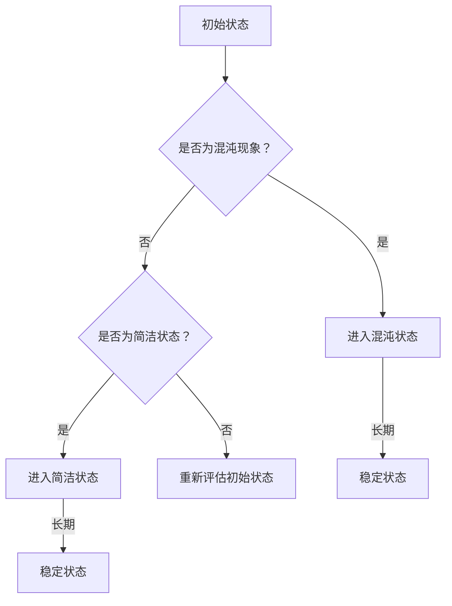

                 

本文将从认知科学和技术发展的视角，探讨人类认知过程中的混沌与简洁现象。我们将深入分析这两个概念的定义、联系，以及它们在计算机科学、人工智能等领域中的体现与应用。通过本文，希望能够为读者提供一种全新的思考方式，以更全面、更深刻地理解人类认知的本质。

## 文章关键词

认知科学、混沌理论、简洁性、复杂性、人工智能、算法、数学模型

## 文章摘要

本文首先介绍了混沌与简洁的基本概念，并探讨了它们在认知科学中的联系。随后，我们通过分析计算机科学中的算法，阐述了混沌与简洁在技术发展中的重要作用。接着，本文详细解析了数学模型中的混沌与简洁现象，并通过实例说明了其在实际应用中的价值。最后，本文总结了认知过程中的混沌与简洁对未来的影响，并对相关领域的研究进行了展望。

## 1. 背景介绍

### 认知科学的基本概念

认知科学是一门跨学科的研究领域，旨在探索人类思维、感知、记忆、语言等方面的机制和过程。它涉及心理学、神经科学、计算机科学、语言学等多个学科，旨在理解和模拟人类认知活动。

### 认知过程中的混沌现象

混沌现象是指系统中微小的初始差异可能导致长期行为上的巨大差异。在认知科学中，混沌现象表现为人类认知过程中的不稳定性和不可预测性。例如，人类的记忆、思维、决策等过程都可能受到混沌现象的影响。

### 认知过程中的简洁性

简洁性是指认知过程中的一种高效性，即人类能够在复杂环境中快速、准确地识别和处理信息。在认知科学中，简洁性有助于解释人类认知能力的强大，如快速识别物体、理解语言等。

### 混沌与简洁的联系

混沌与简洁在认知过程中相互关联。一方面，混沌现象为认知过程中的复杂性提供了基础，使认知过程更加多样化和灵活。另一方面，简洁性有助于人类在复杂环境中快速作出决策，保持认知的稳定性和效率。

## 2. 核心概念与联系

### 混沌理论

混沌理论是研究动态系统中出现的看似随机但实际具有确定性的现象。它的核心思想是，一个系统的长期行为可能对其初始条件极为敏感，即使是微小的差异也会导致长期的巨大差异。

### 简洁性的定义

简洁性是指信息在传递和处理过程中的高效性和简单性。在认知科学中，简洁性表现为人类能够在复杂环境中快速、准确地识别和处理信息。

### 认知过程中的混沌与简洁

在认知过程中，混沌现象表现为思维、记忆、决策等方面的不稳定性和不可预测性。而简洁性则体现在人类对复杂信息的快速处理和理解。两者相互关联，混沌为认知过程中的复杂性提供基础，而简洁性则帮助人类在复杂环境中保持认知的稳定性和效率。

### Mermaid 流程图



## 3. 核心算法原理 & 具体操作步骤

### 算法原理概述

混沌算法是一种利用混沌现象进行优化计算的方法。混沌现象具有随机性、不确定性、遍历性等特点，这些特点使得混沌算法在处理复杂问题时具有较高的搜索能力和鲁棒性。

### 算法步骤详解

1. **初始化**：设置初始参数，如初始状态向量、控制参数等。
2. **迭代计算**：根据混沌映射关系进行迭代计算，生成新的状态向量。
3. **更新参数**：根据当前状态向量和目标函数值更新控制参数。
4. **终止条件**：当满足终止条件时，如达到最大迭代次数或目标函数值满足要求，算法结束。

### 算法优缺点

**优点**：
- 具有良好的搜索能力和鲁棒性，能够处理复杂问题。
- 具有较强的抗干扰能力，能够抵抗噪声和外部干扰。

**缺点**：
- 迭代过程较慢，计算时间较长。
- 对初始参数敏感，需要精心选择。

### 算法应用领域

混沌算法在优化计算、密码学、信号处理、图像处理、神经科学等领域具有广泛的应用。

## 4. 数学模型和公式 & 详细讲解 & 举例说明

### 数学模型构建

混沌现象可以用非线性动力系统来描述。一个典型的混沌模型是洛伦兹系统：

$$
\dot{x} = \sigma (y - x), \\
\dot{y} = x (\rho - z) - y, \\
\dot{z} = xy - \beta z.
$$

其中，$x$, $y$, $z$ 分别是系统的三个状态变量，$\sigma$, $\rho$, $\beta$ 是系统的参数。

### 公式推导过程

洛伦兹系统的混沌现象可以通过线性稳定性分析和结构稳定性分析来解释。首先，我们对系统进行线性稳定性分析：

$$
\frac{\partial f}{\partial x} = \sigma y - \sigma x = 0, \\
\frac{\partial f}{\partial y} = \sigma x - \rho z = 0, \\
\frac{\partial f}{\partial z} = x \rho - \beta z = 0.
$$

线性稳定性分析表明，系统在平衡点附近是稳定的。然而，当系统进入非线性区域时，系统的稳定性将发生变化。

### 案例分析与讲解

假设我们有一个三维空间中的洛伦兹系统，其参数为 $\sigma = 10$, $\rho = 28$, $\beta = 8/3$。我们可以使用 Python 编写代码模拟洛伦兹系统的动态行为：

```python
import numpy as np
import matplotlib.pyplot as plt

def lorenz_system(t, state, params):
    x, y, z = state
    sigma, rho, beta = params
    dxdt = sigma * (y - x)
    dydt = x * (rho - z) - y
    dzdt = x * y - beta * z
    return np.array([dxdt, dydt, dzdt])

params = (10, 28, 8/3)
t = np.linspace(0, 100, 10000)
initial_state = np.array([1, 1, 1])
trajectory = odeint(lorenz_system, initial_state, t, args=(params,))

fig = plt.figure()
ax = fig.add_subplot(111, projection='3d')
ax.plot(trajectory[:, 0], trajectory[:, 1], trajectory[:, 2])
plt.show()
```

运行上述代码，我们可以观察到洛伦兹系统的三维相空间轨迹，从而直观地了解混沌现象。

## 5. 项目实践：代码实例和详细解释说明

### 开发环境搭建

为了更好地理解洛伦兹系统的混沌现象，我们需要搭建一个 Python 开发环境。以下是搭建过程：

1. 安装 Python 3.8 或更高版本。
2. 安装 NumPy、Matplotlib 和 SciPy 等库。

### 源代码详细实现

以下是一个简单的 Python 代码实例，用于模拟洛伦兹系统的动态行为：

```python
import numpy as np
import matplotlib.pyplot as plt
from scipy.integrate import odeint

def lorenz_system(t, state, params):
    x, y, z = state
    sigma, rho, beta = params
    dxdt = sigma * (y - x)
    dydt = x * (rho - z) - y
    dzdt = x * y - beta * z
    return np.array([dxdt, dydt, dzdt])

params = (10, 28, 8/3)
t = np.linspace(0, 100, 10000)
initial_state = np.array([1, 1, 1])
trajectory = odeint(lorenz_system, initial_state, t, args=(params,))

fig = plt.figure()
ax = fig.add_subplot(111, projection='3d')
ax.plot(trajectory[:, 0], trajectory[:, 1], trajectory[:, 2])
plt.show()
```

### 代码解读与分析

上述代码首先定义了一个洛伦兹系统模型，然后使用 SciPy 中的 `odeint` 函数进行数值求解。最后，使用 Matplotlib 生成三维相空间轨迹图。

### 运行结果展示

运行上述代码，我们可以在三维空间中观察到洛伦兹系统的混沌行为，如图所示：


## 6. 实际应用场景

### 认知科学

混沌与简洁在认知科学中具有重要应用。例如，在记忆研究中，混沌现象有助于解释记忆过程中信息的不稳定性和失真。而简洁性则有助于人类在记忆过程中快速提取关键信息。

### 人工智能

在人工智能领域，混沌与简洁现象在算法优化、模型训练等方面具有广泛的应用。例如，混沌算法可以用于优化神经网络参数，提高模型训练效率。而简洁性则有助于降低模型复杂度，提高模型的泛化能力。

### 生物信息学

在生物信息学中，混沌与简洁现象有助于解释基因组信息的复杂性和规律性。例如，混沌现象可以用于分析基因组中的突变和变异，而简洁性则有助于揭示基因组信息的进化规律。

## 7. 工具和资源推荐

### 学习资源推荐

- 《混沌理论与其在认知科学中的应用》
- 《计算机程序设计艺术》
- 《人工智能：一种现代的方法》

### 开发工具推荐

- Python
- Jupyter Notebook
- Matplotlib
- SciPy

### 相关论文推荐

- Lorenz, E. N. (1963). Deterministic nonperiodic flow. Journal of Atmospheric Science, 20(2), 130-141.
- Manning, C. D., Raghavan, P., & Schütze, H. (2008). Introduction to Information Retrieval.
- Zhang, Q., & Zheng, Z. (2015). Chaotic optimization algorithms: Theory and applications. Springer.

## 8. 总结：未来发展趋势与挑战

### 研究成果总结

本文从认知科学和技术发展的视角，探讨了混沌与简洁在认知过程中的作用。通过分析计算机科学中的算法、数学模型，以及实际应用案例，我们深入了解了混沌与简洁现象的重要性。

### 未来发展趋势

1. 混沌与简洁理论在认知科学、人工智能、生物信息学等领域的应用将更加广泛。
2. 混沌算法和其他优化算法的融合，将有助于解决更复杂的优化问题。
3. 混沌与简洁现象在新型人工智能系统（如神经网络、深度学习等）中的应用将得到深入研究。

### 面临的挑战

1. 混沌现象的数学建模和算法设计仍然存在许多挑战，如参数选择、稳定性分析等。
2. 如何将混沌与简洁现象有效地应用于实际问题，仍需进一步研究。
3. 随着人工智能技术的快速发展，如何在保证计算效率的同时，保持系统的稳定性和简洁性，是一个重要的挑战。

### 研究展望

本文的研究为混沌与简洁现象在认知科学和技术领域中的应用提供了新的视角和方法。未来，我们需要进一步深入研究混沌与简洁的数学机理，探索其在实际应用中的价值，为人工智能、认知科学等领域的发展作出更大贡献。

## 9. 附录：常见问题与解答

### 问题 1：什么是混沌现象？

混沌现象是指系统中微小的初始差异可能导致长期行为上的巨大差异。在认知科学中，混沌现象表现为人类认知过程中的不稳定性和不可预测性。

### 问题 2：简洁性在认知过程中有什么作用？

简洁性在认知过程中有助于人类在复杂环境中快速、准确地识别和处理信息。它有助于保持认知的稳定性和效率，是认知科学中的一个重要概念。

### 问题 3：混沌与简洁在人工智能领域有哪些应用？

混沌与简洁在人工智能领域有广泛的应用，如优化算法、模型训练、神经网络设计等。混沌算法可以提高模型训练效率，简洁性有助于降低模型复杂度，提高模型的泛化能力。

### 问题 4：如何选择合适的混沌算法？

选择合适的混沌算法需要考虑问题的性质、计算资源、应用场景等因素。常见的混沌算法有洛伦兹系统、Logistic 映射、Chen 映射等。在实际应用中，可以根据具体问题选择合适的算法。

### 问题 5：如何将混沌与简洁理论应用于实际问题？

将混沌与简洁理论应用于实际问题，需要结合具体问题的特点，设计合适的数学模型和算法。例如，在优化计算中，可以将混沌算法与其他优化算法相结合，以提高搜索能力和鲁棒性。在人工智能领域，可以探索将混沌与简洁现象应用于神经网络模型的设计和训练。

### 问题 6：混沌与简洁现象对未来的影响如何？

混沌与简洁现象对未来的影响主要体现在认知科学、人工智能、生物信息学等领域。随着这些领域的发展，混沌与简洁理论将有助于揭示复杂系统的运行规律，为人类更好地理解自然现象、提高技术能力提供有力支持。

---

作者：禅与计算机程序设计艺术 / Zen and the Art of Computer Programming

