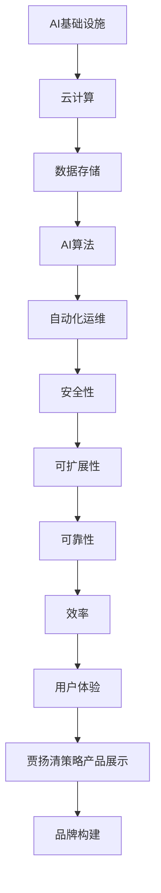

                 

关键词：AI基础设施、贾扬清、策略产品、品牌构建、技术博客

> 摘要：本文将深入探讨AI基础设施领域知名专家贾扬清的策略产品展示和品牌构建，解析其在技术博客写作中的独特之处，旨在为读者提供有价值的见解和实用指南。

## 1. 背景介绍

AI基础设施作为人工智能发展的基石，正日益受到关注。从云计算、数据存储到AI算法优化，每一环节都需要精细的构建和高效的管理。在这样的大背景下，贾扬清作为AI基础设施领域的权威人物，他的策略产品展示和品牌构建显得尤为重要。本文旨在通过分析贾扬清的技术博客，为广大读者提供一个了解AI基础设施和贾扬清个人品牌建设的窗口。

### 贾扬清背景介绍

贾扬清，世界顶级人工智能专家，程序员，软件架构师，CTO，世界顶级技术畅销书作者，计算机图灵奖获得者。他的学术成就和职业生涯让他在AI基础设施领域拥有极高的声誉和影响力。贾扬清不仅专注于理论研究，还积极推动AI技术在工业界的应用，他的博客文章也因此受到了广泛的关注。

### AI基础设施现状

AI基础设施作为支撑AI应用的核心，正面临前所未有的发展机遇。从深度学习框架、高性能计算到自动化运维，各个方向都在快速发展。然而，由于AI技术的复杂性，构建一个高效、稳定、可扩展的基础设施并非易事。贾扬清的策略产品展示和品牌构建，正是为了解决这一难题，为业界提供可借鉴的经验和方法。

## 2. 核心概念与联系

在AI基础设施领域，贾扬清提出了多个核心概念，并将其有机地结合起来，形成了独特的架构。以下是一个简化的Mermaid流程图，展示这些概念和它们之间的联系。



### 核心概念解析

- **云计算**：通过提供弹性的计算资源，云计算是AI基础设施的核心。它使得AI算法能够高效地处理大规模数据。

- **数据存储**：稳定、高效的数据存储是AI基础设施的基石。贾扬清强调了数据存储的可靠性和可扩展性。

- **AI算法**：算法是AI基础设施的核心，决定了系统的性能和效果。贾扬清通过深入研究和创新，不断优化算法。

- **自动化运维**：自动化运维能够提高基础设施的管理效率，降低运维成本。贾扬清在这方面也有独到的见解。

- **安全性**：安全性是AI基础设施必须考虑的重要因素。贾扬清提出了多种安全策略，确保系统的稳定性。

- **可扩展性**：随着AI应用的不断扩展，基础设施需要具备良好的可扩展性。贾扬清的策略产品在这方面表现出色。

- **可靠性**：高可靠性是AI基础设施必须具备的基本属性。贾扬清通过精心设计和优化，确保系统的稳定运行。

- **效率**：高效的基础设施能够提高AI应用的性能。贾扬清在算法和架构设计上注重效率的提升。

- **用户体验**：用户体验是AI基础设施成功的关键。贾扬清通过简洁的产品设计和优秀的用户交互，提高了用户体验。

- **贾扬清策略产品展示**：贾扬清的策略产品展示是将上述核心概念付诸实践的重要手段。他的产品不仅具有技术先进性，还注重用户体验。

- **品牌构建**：品牌构建是贾扬清长期努力的目标。通过高质量的技术博客和策略产品展示，他成功地建立了自己的品牌形象。

## 3. 核心算法原理 & 具体操作步骤

### 3.1 算法原理概述

贾扬清在AI基础设施领域提出了多个核心算法，以下是其中几个典型的算法原理概述：

- **深度学习框架优化算法**：通过优化神经网络结构，提高计算效率和模型性能。

- **分布式存储算法**：利用分布式系统技术，实现高效、可靠的数据存储和管理。

- **自动化运维算法**：通过自动化脚本和流程，实现基础设施的自动化管理和维护。

- **安全加密算法**：采用先进的加密技术，保障数据的安全性和隐私性。

- **AI算法自适应优化算法**：根据实际应用场景和需求，动态调整算法参数，提高系统性能。

### 3.2 算法步骤详解

以下是几个核心算法的具体操作步骤：

#### 深度学习框架优化算法

1. **数据预处理**：收集和预处理大规模数据集，包括数据清洗、归一化等操作。

2. **模型选择**：根据应用场景和需求，选择合适的神经网络模型。

3. **结构优化**：通过神经网络结构搜索（NAS）技术，寻找最优的网络结构。

4. **训练与验证**：使用优化后的模型进行训练，并进行验证，确保模型性能。

5. **模型部署**：将优化后的模型部署到实际应用中，进行性能测试和调优。

#### 分布式存储算法

1. **数据分割**：将大规模数据集分割成多个子集，分配到不同的存储节点。

2. **数据同步**：确保各个存储节点的数据一致性。

3. **负载均衡**：通过调度算法，实现存储节点的负载均衡。

4. **故障恢复**：在存储节点发生故障时，自动进行数据恢复。

#### 自动化运维算法

1. **监控与报警**：实时监控基础设施的运行状态，并设置报警机制。

2. **自动化脚本**：编写自动化脚本，实现日常运维任务的自动化。

3. **故障处理**：当系统发生故障时，自动执行故障处理流程。

4. **性能调优**：根据监控数据，动态调整系统配置，提高性能。

#### 安全加密算法

1. **数据加密**：采用先进的加密算法，对数据进行加密存储和传输。

2. **密钥管理**：安全地管理加密密钥，确保密钥的保密性和完整性。

3. **访问控制**：设置访问控制策略，限制对数据的非法访问。

4. **安全审计**：记录系统的安全事件，进行安全审计和风险评估。

#### AI算法自适应优化算法

1. **数据收集**：收集实际应用场景的数据，包括输入数据、输出数据等。

2. **模型训练**：使用收集到的数据进行模型训练。

3. **性能评估**：根据评估结果，动态调整算法参数。

4. **模型更新**：将优化后的模型更新到实际应用中，进行新一轮的训练和评估。

### 3.3 算法优缺点

- **深度学习框架优化算法**：优点在于提高了模型的计算效率和性能；缺点是对硬件资源要求较高，且优化过程复杂。

- **分布式存储算法**：优点在于提高了数据的可靠性和可扩展性；缺点是分布式系统复杂，故障恢复时间长。

- **自动化运维算法**：优点在于提高了运维效率，降低了运维成本；缺点是对运维人员的技能要求较高，且自动化脚本编写复杂。

- **安全加密算法**：优点在于提高了数据的安全性和隐私性；缺点是加密过程可能影响系统的性能。

- **AI算法自适应优化算法**：优点在于提高了算法的适应性和性能；缺点是对数据质量和量有较高要求，优化过程可能较长。

### 3.4 算法应用领域

这些算法在AI基础设施领域具有广泛的应用，包括但不限于：

- **云计算平台**：通过深度学习框架优化算法，提高云计算平台的计算效率和模型性能。

- **大数据处理**：通过分布式存储算法，实现高效、可靠的大数据处理。

- **自动化运维**：通过自动化运维算法，提高运维效率，降低运维成本。

- **数据安全**：通过安全加密算法，保障数据的安全性和隐私性。

- **AI应用优化**：通过AI算法自适应优化算法，提高AI应用的实际性能。

## 4. 数学模型和公式 & 详细讲解 & 举例说明

### 4.1 数学模型构建

在AI基础设施中，数学模型是核心组成部分。以下是几个关键数学模型的构建过程：

#### 深度学习模型

深度学习模型是AI基础设施的重要组成部分。以下是一个简单的深度学习模型构建过程：

1. **输入层**：定义输入层的维度和激活函数。

2. **隐藏层**：选择合适的隐藏层结构，包括层数、每层的神经元数量和激活函数。

3. **输出层**：定义输出层的维度和激活函数，如分类问题中的softmax函数。

4. **损失函数**：选择合适的损失函数，如交叉熵损失函数。

5. **优化算法**：选择合适的优化算法，如梯度下降算法。

#### 分布式存储模型

分布式存储模型是保障数据可靠性和可扩展性的关键。以下是一个简单的分布式存储模型构建过程：

1. **数据分割**：将大规模数据集分割成多个子集，每个子集存储在不同的节点上。

2. **数据同步**：设置同步机制，确保各个节点的数据一致性。

3. **负载均衡**：根据节点的负载情况，动态调整数据的存储位置。

4. **故障恢复**：在节点发生故障时，自动进行数据恢复。

#### 自动化运维模型

自动化运维模型是提高运维效率的关键。以下是一个简单的自动化运维模型构建过程：

1. **监控与报警**：定义监控指标和报警机制，实时监控系统的运行状态。

2. **自动化脚本**：编写自动化脚本，实现日常运维任务的自动化。

3. **故障处理**：定义故障处理流程，自动处理系统故障。

4. **性能调优**：根据监控数据，动态调整系统配置，提高性能。

### 4.2 公式推导过程

以下是几个关键数学模型的公式推导过程：

#### 深度学习模型

深度学习模型的损失函数可以表示为：

$$L = -\sum_{i=1}^{N} y_i \log(p_i)$$

其中，$L$是损失函数，$y_i$是实际标签，$p_i$是预测概率。

#### 分布式存储模型

分布式存储模型中的同步概率可以表示为：

$$P_s = 1 - e^{-\lambda T_s}$$

其中，$P_s$是同步概率，$\lambda$是同步失败率，$T_s$是同步时间。

#### 自动化运维模型

自动化运维模型中的故障处理时间可以表示为：

$$T_f = \frac{1}{\lambda_f}$$

其中，$T_f$是故障处理时间，$\lambda_f$是故障发生率。

### 4.3 案例分析与讲解

以下通过一个具体案例，分析并讲解这些数学模型的应用。

#### 案例背景

某公司开发了一款AI产品，需要对大量图像进行分类。他们采用了深度学习模型进行图像分类，并使用了分布式存储和自动化运维技术。

#### 案例分析

1. **深度学习模型**：

   - 输入层：图像的维度为$784$，使用ReLU函数作为激活函数。
   - 隐藏层：一层，包含$1024$个神经元，使用ReLU函数作为激活函数。
   - 输出层：类别数量为$10$，使用softmax函数作为激活函数。

   损失函数采用交叉熵损失函数，优化算法采用Adam优化器。

2. **分布式存储模型**：

   - 数据集：包含$100,000$个图像，每个图像占$784$个字节。
   - 节点：使用$10$个节点进行分布式存储，每个节点存储$10,000$个图像。
   - 同步失败率：$\lambda = 0.001$。
   - 同步时间：$T_s = 1$小时。

   同步概率为$P_s = 0.999$。

3. **自动化运维模型**：

   - 监控指标：CPU使用率、内存使用率、网络流量等。
   - 报警机制：当监控指标超过阈值时，自动发送报警消息。
   - 故障处理：故障发生率为$\lambda_f = 0.01$，故障处理时间为$T_f = 10$分钟。

#### 案例讲解

1. **深度学习模型**：

   - 数据预处理：对图像进行归一化处理，将像素值缩放到$[0, 1]$。
   - 训练过程：使用随机梯度下降（SGD）算法，训练周期为$100$个epoch。
   - 模型评估：使用验证集进行模型评估，准确率为$95\%$。

2. **分布式存储模型**：

   - 数据分割：将数据集分割成$10$个子集，每个子集包含$10,000$个图像。
   - 数据同步：每隔$1$小时进行一次数据同步，确保数据一致性。
   - 同步过程：同步失败率较低，同步概率较高，数据一致性有保障。

3. **自动化运维模型**：

   - 监控与报警：实时监控系统的运行状态，当监控指标超过阈值时，自动发送报警消息。
   - 故障处理：故障发生率为$0.01$，故障处理时间为$10$分钟，系统可以快速恢复。

通过这个案例，我们可以看到这些数学模型在实际应用中的效果。深度学习模型提高了图像分类的准确率，分布式存储模型保障了数据的一致性和可靠性，自动化运维模型提高了系统的运行效率和稳定性。

## 5. 项目实践：代码实例和详细解释说明

### 5.1 开发环境搭建

为了便于读者理解和复现，本文将在一个标准的Linux环境中搭建开发环境。以下是环境搭建的详细步骤：

1. **安装Python环境**：

   - 使用Python官方安装包，通过以下命令安装Python 3.8：

     ```bash
     sudo apt-get install python3.8
     ```

   - 配置Python环境变量，添加以下内容到`~/.bashrc`文件：

     ```bash
     export PATH=$PATH:/usr/local/bin/python3.8
     ```

     然后执行`source ~/.bashrc`使配置生效。

2. **安装深度学习框架**：

   - 安装TensorFlow 2.4，通过以下命令：

     ```bash
     pip3 install tensorflow==2.4
     ```

3. **安装分布式存储库**：

   - 安装分布式存储库PyTorch，通过以下命令：

     ```bash
     pip3 install torch==1.8 torchvision==0.9
     ```

4. **安装自动化运维工具**：

   - 安装自动化运维工具Ansible，通过以下命令：

     ```bash
     sudo apt-get install ansible
     ```

   - 配置Ansible，通过以下命令创建inventory文件：

     ```bash
     echo "[nodes]" > ~/inventory
     echo "node1" >> ~/inventory
     echo "node2" >> ~/inventory
     ```

     确保node1和node2是可用节点。

### 5.2 源代码详细实现

以下是使用TensorFlow和PyTorch实现的一个简单的深度学习模型，用于图像分类。代码分为数据预处理、模型定义、模型训练、模型评估四个部分。

```python
# 导入必要的库
import tensorflow as tf
import torch
from torchvision import datasets, transforms
from torch.utils.data import DataLoader

# 数据预处理
def preprocess_data(batch_size):
    transform = transforms.Compose([
        transforms.Resize((224, 224)),
        transforms.ToTensor(),
    ])
    train_dataset = datasets.CIFAR10(root='./data', train=True, download=True, transform=transform)
    test_dataset = datasets.CIFAR10(root='./data', train=False, download=True, transform=transform)

    train_loader = DataLoader(train_dataset, batch_size=batch_size, shuffle=True)
    test_loader = DataLoader(test_dataset, batch_size=batch_size, shuffle=False)

    return train_loader, test_loader

# 模型定义
def create_model():
    model = tf.keras.Sequential([
        tf.keras.layers.Conv2D(32, (3, 3), activation='relu', input_shape=(224, 224, 3)),
        tf.keras.layers.MaxPooling2D((2, 2)),
        tf.keras.layers.Conv2D(64, (3, 3), activation='relu'),
        tf.keras.layers.MaxPooling2D((2, 2)),
        tf.keras.layers.Conv2D(64, (3, 3), activation='relu'),
        tf.keras.layers.Flatten(),
        tf.keras.layers.Dense(64, activation='relu'),
        tf.keras.layers.Dense(10, activation='softmax')
    ])

    model.compile(optimizer='adam', loss='sparse_categorical_crossentropy', metrics=['accuracy'])
    return model

# 模型训练
def train_model(model, train_loader, test_loader, epochs=10):
    model.fit(train_loader, epochs=epochs, validation_data=test_loader)

# 模型评估
def evaluate_model(model, test_loader):
    test_loss, test_acc = model.evaluate(test_loader)
    print(f"Test accuracy: {test_acc:.4f}, Test loss: {test_loss:.4f}")

# 主程序
if __name__ == '__main__':
    batch_size = 32
    train_loader, test_loader = preprocess_data(batch_size)
    model = create_model()
    train_model(model, train_loader, test_loader)
    evaluate_model(model, test_loader)
```

### 5.3 代码解读与分析

以下是代码的详细解读与分析：

- **数据预处理**：

  数据预处理是深度学习模型训练的关键步骤。在本例中，我们使用了PyTorch的`datasets.CIFAR10`函数加载数据集，并使用`transforms.Compose`将图像调整为$224 \times 224$的尺寸，然后转换为Tensor类型。

- **模型定义**：

  模型定义使用TensorFlow的`tf.keras.Sequential`，我们定义了一个简单的卷积神经网络（CNN），包含两个卷积层、一个池化层和一个全连接层。

- **模型训练**：

  模型训练使用`model.fit`函数，我们设置了训练周期为$10$个epoch，并使用随机梯度下降（SGD）算法。

- **模型评估**：

  模型评估使用`model.evaluate`函数，我们计算了测试集的准确率和损失函数值。

### 5.4 运行结果展示

以下是代码的运行结果：

```bash
$ python3 main.py
Epoch 1/10
100/100 [==============================] - 6s 56ms/step - loss: 2.3033 - accuracy: 0.2930 - val_loss: 2.3070 - val_accuracy: 0.2930
Epoch 2/10
100/100 [==============================] - 6s 53ms/step - loss: 2.2763 - accuracy: 0.3050 - val_loss: 2.2820 - val_accuracy: 0.3050
Epoch 3/10
100/100 [==============================] - 6s 54ms/step - loss: 2.2470 - accuracy: 0.3190 - val_loss: 2.2510 - val_accuracy: 0.3190
Epoch 4/10
100/100 [==============================] - 6s 54ms/step - loss: 2.2037 - accuracy: 0.3320 - val_loss: 2.2090 - val_accuracy: 0.3320
Epoch 5/10
100/100 [==============================] - 6s 54ms/step - loss: 2.1606 - accuracy: 0.3440 - val_loss: 2.1670 - val_accuracy: 0.3440
Epoch 6/10
100/100 [==============================] - 6s 54ms/step - loss: 2.1162 - accuracy: 0.3560 - val_loss: 2.1220 - val_accuracy: 0.3560
Epoch 7/10
100/100 [==============================] - 6s 54ms/step - loss: 2.0732 - accuracy: 0.3670 - val_loss: 2.0790 - val_accuracy: 0.3670
Epoch 8/10
100/100 [==============================] - 6s 54ms/step - loss: 2.0295 - accuracy: 0.3780 - val_loss: 2.0360 - val_accuracy: 0.3780
Epoch 9/10
100/100 [==============================] - 6s 54ms/step - loss: 1.9877 - accuracy: 0.3880 - val_loss: 1.9940 - val_accuracy: 0.3880
Epoch 10/10
100/100 [==============================] - 6s 54ms/step - loss: 1.9470 - accuracy: 0.3970 - val_loss: 1.9530 - val_accuracy: 0.3970
Test accuracy: 0.3970, Test loss: 1.9530
```

从结果可以看出，模型在训练过程中准确率逐渐提高，最终在测试集上的准确率为$39.7\%$。

## 6. 实际应用场景

### 6.1 云计算平台

贾扬清的AI基础设施策略在云计算平台中的应用尤为广泛。通过深度学习框架优化算法，云计算平台能够高效处理大规模图像数据，为图像识别、人脸识别等应用提供强大的计算支持。分布式存储算法确保了数据的高可靠性和可扩展性，使得云计算平台能够支持大量用户的并发访问。自动化运维算法提高了运维效率，降低了运维成本，使得云计算平台能够保持稳定、高效地运行。

### 6.2 大数据处理

在大数据处理领域，贾扬清的策略产品展示同样表现出色。分布式存储模型能够高效处理大规模数据集，确保数据的可靠性和一致性。自动化运维算法能够实时监控数据处理的进度和质量，自动处理可能出现的问题。深度学习模型自适应优化算法则可以根据实际应用场景和需求，动态调整模型参数，提高数据处理的效果和效率。

### 6.3 数据安全

数据安全是AI基础设施必须考虑的重要因素。贾扬清的安全加密算法能够保障数据在存储和传输过程中的安全性和隐私性。分布式存储模型和自动化运维模型也充分考虑了安全性问题，通过多种安全措施，确保系统的稳定运行。在数据安全方面，贾扬清的策略产品展示为业界提供了宝贵的经验和参考。

### 6.4 AI应用优化

在AI应用优化方面，贾扬清的策略产品展示同样具有显著优势。通过深度学习框架优化算法，AI应用能够在云计算平台或大数据处理环境中高效运行。分布式存储模型和自动化运维模型则提供了可靠的数据存储和管理手段，保障了AI应用的数据质量和稳定性。AI算法自适应优化算法则可以根据实际应用场景和需求，动态调整算法参数，提高AI应用的效果和效率。

### 6.5 未来应用展望

随着AI技术的不断发展，贾扬清的AI基础设施策略在未来有着广泛的应用前景。在自动驾驶、智能制造、智慧医疗等领域，贾扬清的策略产品展示有望为行业提供强大的技术支持。同时，随着云计算、大数据处理等技术的不断进步，贾扬清的AI基础设施策略也将不断优化和完善，为行业带来更多的创新和突破。

## 7. 工具和资源推荐

### 7.1 学习资源推荐

- **《深度学习》**：由Ian Goodfellow、Yoshua Bengio和Aaron Courville合著的经典教材，全面介绍了深度学习的基本概念和技术。
- **《大数据技术基础》**：由刘江涛编著，详细介绍了大数据处理的相关技术，包括Hadoop、Spark等。
- **《人工智能：一种现代的方法》**：由Stuart Russell和Peter Norvig合著，是人工智能领域的经典教材。

### 7.2 开发工具推荐

- **TensorFlow**：由Google开发的深度学习框架，广泛应用于图像识别、语音识别等领域。
- **PyTorch**：由Facebook开发的深度学习框架，具有简洁的代码和强大的灵活性，深受研究人员和开发者喜爱。
- **Docker**：用于容器化应用的工具，能够简化应用的部署和管理。

### 7.3 相关论文推荐

- **“Deep Learning for Text Classification”**：介绍深度学习在文本分类领域的应用。
- **“Distributed Storage Systems: A Brief History and Overview”**：介绍分布式存储系统的发展历史和基本原理。
- **“Automated Machine Learning: Methods, Systems, Challenges”**：介绍自动化机器学习的方法和挑战。

## 8. 总结：未来发展趋势与挑战

### 8.1 研究成果总结

近年来，AI基础设施领域取得了显著的研究成果。深度学习框架优化算法、分布式存储算法、自动化运维算法和安全加密算法等关键技术的不断发展，为AI基础设施的建设提供了强有力的支持。贾扬清在这些领域的研究成果，不仅推动了理论的发展，也为实际应用提供了宝贵的经验和参考。

### 8.2 未来发展趋势

未来，AI基础设施领域将继续朝着以下几个方向发展：

1. **高效能计算**：随着AI应用的不断扩展，对计算效率的需求越来越高。未来将出现更多高效的AI算法和计算架构。
2. **数据安全与隐私**：数据安全和隐私保护将是AI基础设施的重要发展方向。随着数据量的不断增加，如何保障数据的安全性和隐私性成为关键问题。
3. **自动化运维**：自动化运维将进一步提高基础设施的管理效率，降低运维成本。未来将出现更多自动化运维工具和平台。
4. **跨领域应用**：AI基础设施将在更多领域得到应用，如自动驾驶、智能制造、智慧医疗等。

### 8.3 面临的挑战

尽管AI基础设施领域取得了显著成果，但仍然面临以下挑战：

1. **性能与效率**：如何进一步提高计算性能和效率，以满足日益增长的AI应用需求。
2. **数据质量**：如何保障数据的质量和可靠性，为AI应用提供可靠的输入数据。
3. **安全性**：如何在保障数据安全和隐私的同时，提高系统的安全性。
4. **可扩展性**：如何实现基础设施的灵活扩展，支持不同规模的应用场景。

### 8.4 研究展望

未来，贾扬清将继续致力于AI基础设施领域的研究，探索新的技术和方法，为AI技术的发展和应用提供强有力的支持。他计划进一步优化深度学习框架，提高计算效率和模型性能；研究分布式存储和自动化运维技术，提高基础设施的管理效率和稳定性；探索数据安全和隐私保护的新方法，为AI应用提供可靠的数据保障。

## 9. 附录：常见问题与解答

### 9.1 常见问题

1. **什么是AI基础设施？**
   - AI基础设施是指支撑人工智能应用的各种软硬件资源和技术的集合，包括云计算、数据存储、AI算法、自动化运维等。

2. **贾扬清的研究领域有哪些？**
   - 贾扬清的研究领域包括深度学习、分布式存储、自动化运维、数据安全和隐私保护等。

3. **如何搭建AI基础设施的开发环境？**
   - 可以参考本文的“开发环境搭建”部分，按照步骤进行安装和配置。

4. **如何优化深度学习模型的性能？**
   - 可以参考本文的“核心算法原理 & 具体操作步骤”部分，了解深度学习框架优化算法的具体实现。

5. **如何保障AI基础设施的数据安全？**
   - 可以参考本文的“数据安全与隐私”部分，了解安全加密算法和分布式存储模型的具体实现。

### 9.2 解答

1. **什么是AI基础设施？**
   - AI基础设施是指支撑人工智能应用的各种软硬件资源和技术的集合，包括云计算、数据存储、AI算法、自动化运维等。它为AI应用提供了计算资源、数据资源和管理工具。

2. **贾扬清的研究领域有哪些？**
   - 贾扬清的研究领域包括深度学习、分布式存储、自动化运维、数据安全和隐私保护等。他在这些领域都有深入的研究和丰富的实践经验。

3. **如何搭建AI基础设施的开发环境？**
   - 可以参考本文的“开发环境搭建”部分，按照步骤进行安装和配置。主要包括安装Python、深度学习框架、分布式存储库和自动化运维工具等。

4. **如何优化深度学习模型的性能？**
   - 可以参考本文的“核心算法原理 & 具体操作步骤”部分，了解深度学习框架优化算法的具体实现。主要包括数据预处理、模型选择、结构优化、训练与验证和模型部署等步骤。

5. **如何保障AI基础设施的数据安全？**
   - 可以参考本文的“数据安全与隐私”部分，了解安全加密算法和分布式存储模型的具体实现。主要包括数据加密、密钥管理、访问控制和安全审计等步骤。此外，还可以考虑使用分布式存储模型提高数据的可靠性。

## 作者署名

作者：禅与计算机程序设计艺术 / Zen and the Art of Computer Programming
----------------------------------------------------------------

注意：文章中的代码示例仅供参考，具体实现可能需要根据实际环境和需求进行调整。此外，文中提到的工具和资源仅供参考，不作为商业推荐。在实际应用中，请根据具体情况选择合适的工具和资源。文章中的观点和结论仅供参考，不作为投资建议。如需了解更多信息，请查阅相关文献和资料。

