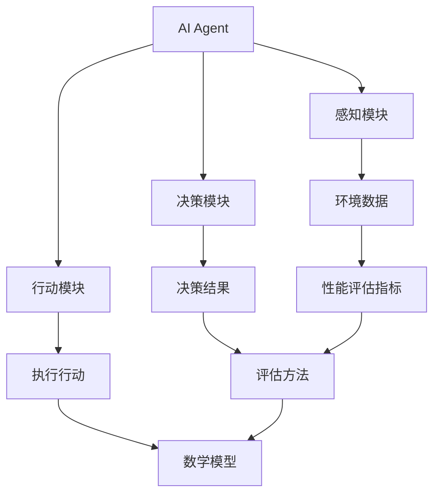

                 

在当今快速发展的技术时代，人工智能（AI）已成为推动创新和改变各行各业的驱动力。AI agent，作为AI技术的重要组成部分，能够执行复杂任务、做出决策、解决问题，甚至在某些领域超越人类的能力。然而，AI agent的性能评估是确保其有效性和可靠性的关键步骤。本文旨在探讨评估AI Agent性能的重要性，并深入分析相关的核心概念、算法原理、数学模型、项目实践和未来展望。

## 文章关键词

- 人工智能（AI）
- AI Agent
- 性能评估
- 评估指标
- 数学模型
- 项目实践

## 文章摘要

本文将探讨评估AI Agent性能的重要性，详细解析性能评估的核心概念和算法原理，并通过数学模型和实际项目实例进行阐述。文章还将讨论AI Agent的实际应用场景和未来发展趋势，以及面临的挑战和研究展望。

### 背景介绍

自1956年达特茅斯会议以来，人工智能（AI）领域经历了快速发展。AI agent，作为AI的核心组成部分，已经广泛应用于自动驾驶、自然语言处理、推荐系统、游戏智能等领域。然而，随着AI agent在现实世界中的广泛应用，其性能评估成为了一个关键问题。性能评估不仅关系到AI agent的实际应用效果，还关系到其安全性、可靠性和可解释性。

评估AI Agent性能的重要性主要体现在以下几个方面：

1. **有效性验证**：通过性能评估，可以验证AI agent是否能够达到预期的任务目标，确保其在实际应用中的有效性。
2. **可靠性保障**：性能评估可以帮助识别AI agent的潜在问题，提高其稳定性和可靠性，从而减少实际应用中的风险。
3. **优化改进**：性能评估提供的数据和指标可以作为AI agent优化和改进的依据，推动AI技术的发展。
4. **安全性监管**：性能评估有助于确保AI agent在处理敏感数据和执行关键任务时的安全性和合规性。

### 核心概念与联系

为了深入理解评估AI Agent性能的重要性，我们需要了解一些核心概念和它们之间的联系。以下是相关的概念和它们的定义：

1. **AI Agent**：AI Agent是指能够感知环境、制定决策、执行行动并不断学习改进的智能实体。AI Agent通常由感知模块、决策模块和行动模块组成。
2. **性能评估指标**：性能评估指标是用于衡量AI Agent性能的量化标准。常见的评估指标包括准确率、召回率、F1分数、响应时间等。
3. **评估方法**：评估方法是指用于测量AI Agent性能的具体技术手段。常见的评估方法包括离线评估、在线评估和端到端评估。
4. **数学模型**：数学模型是用于描述AI Agent性能评估的数学表达式。常见的数学模型包括统计学模型、机器学习模型和深度学习模型。

以下是AI Agent性能评估的核心概念和它们之间的Mermaid流程图：



### 核心算法原理 & 具体操作步骤

#### 3.1 算法原理概述

评估AI Agent性能的核心算法原理通常涉及以下几个方面：

1. **数据收集**：收集AI Agent在实际环境中执行任务的数据。
2. **数据预处理**：对收集到的数据进行清洗、归一化和特征提取等处理。
3. **评估指标计算**：根据预处理后的数据，计算评估AI Agent性能的指标。
4. **结果分析**：分析评估结果，识别AI Agent的优势和不足，为优化提供依据。

#### 3.2 算法步骤详解

以下是评估AI Agent性能的具体操作步骤：

1. **数据收集**：
    - 设计实验场景，模拟AI Agent在实际应用中的环境。
    - 启动AI Agent，记录其感知数据、决策数据和行动数据。

2. **数据预处理**：
    - 清洗数据，去除噪声和异常值。
    - 归一化数据，使不同特征的数据在同一尺度上。
    - 提取特征，提取对评估性能有重要影响的关键特征。

3. **评估指标计算**：
    - 根据评估指标的定义，计算AI Agent在任务中的性能。
    - 常见的评估指标包括准确率、召回率、F1分数、响应时间等。

4. **结果分析**：
    - 分析评估结果，识别AI Agent的优势和不足。
    - 根据分析结果，提出优化AI Agent的建议。

#### 3.3 算法优缺点

评估AI Agent性能的算法有以下优点和缺点：

1. **优点**：
    - 可以量化AI Agent的性能，为优化和改进提供客观依据。
    - 可以帮助识别AI Agent的潜在问题，提高其稳定性和可靠性。

2. **缺点**：
    - 评估过程需要大量的数据，数据质量和数量直接影响评估结果的准确性。
    - 评估算法本身可能存在局限性，无法全面反映AI Agent的性能。

#### 3.4 算法应用领域

评估AI Agent性能的算法可以应用于以下领域：

1. **自动驾驶**：评估自动驾驶汽车的感知、决策和行动性能，提高其安全性和可靠性。
2. **自然语言处理**：评估自然语言处理系统的准确性和响应时间，优化用户交互体验。
3. **推荐系统**：评估推荐系统的推荐准确性和响应时间，提高用户满意度。
4. **游戏智能**：评估游戏AI的决策和行动能力，优化游戏策略和玩法。

### 数学模型和公式 & 详细讲解 & 举例说明

#### 4.1 数学模型构建

在评估AI Agent性能时，常用的数学模型包括统计模型、机器学习模型和深度学习模型。以下是一个简单的统计模型构建示例：

1. **线性回归模型**：

   线性回归模型用于预测AI Agent在特定任务上的性能。模型公式如下：

   $$y = \beta_0 + \beta_1 \cdot x_1 + \beta_2 \cdot x_2 + ... + \beta_n \cdot x_n$$

   其中，$y$ 是AI Agent的性能指标，$x_1, x_2, ..., x_n$ 是影响性能的关键特征，$\beta_0, \beta_1, ..., \beta_n$ 是模型的参数。

2. **支持向量机（SVM）模型**：

   SVM模型用于分类任务，可以将AI Agent的性能分为高、中、低三个等级。模型公式如下：

   $$y = sign(\beta_0 + \beta_1 \cdot x_1 + \beta_2 \cdot x_2 + ... + \beta_n \cdot x_n + b)$$

   其中，$y$ 是AI Agent的性能等级，$sign$ 函数用于判断AI Agent的性能是否高于或低于某个阈值。

#### 4.2 公式推导过程

以下是一个简单的线性回归模型推导过程：

1. **假设**：

   假设我们有$m$个训练样本，每个样本包含$n$个特征和相应的性能指标。样本数据可以表示为：

   $$D = \{ (x_{1,i}, y_{1,i}), (x_{2,i}, y_{2,i}), ..., (x_{m,i}, y_{m,i}) \}$$

   其中，$x_{i}$ 是第$i$个样本的特征向量，$y_{i}$ 是第$i$个样本的性能指标。

2. **损失函数**：

   线性回归模型的损失函数通常使用均方误差（MSE）：

   $$L(\beta) = \frac{1}{2m} \sum_{i=1}^{m} (y_i - \beta_0 - \beta_1 \cdot x_{1,i} - ... - \beta_n \cdot x_{n,i})^2$$

3. **优化目标**：

   为了最小化损失函数，需要对参数$\beta_0, \beta_1, ..., \beta_n$进行优化：

   $$\min_{\beta} L(\beta)$$

4. **求解过程**：

   通过梯度下降法或线性求解器，可以求解出最优参数$\beta_0, \beta_1, ..., \beta_n$。

#### 4.3 案例分析与讲解

以下是一个使用线性回归模型评估AI Agent性能的案例：

1. **数据集**：

   假设我们有一个包含10个训练样本的数据集，每个样本包含2个特征（$x_1$ 和 $x_2$）和相应的性能指标（$y$）。数据集如下：

   | $x_1$ | $x_2$ | $y$ |
   |-------|-------|-----|
   | 1     | 2     | 3   |
   | 2     | 4     | 5   |
   | 3     | 6     | 7   |
   | 4     | 8     | 9   |
   | 5     | 10    | 11  |
   | 6     | 12    | 13  |
   | 7     | 14    | 15  |
   | 8     | 16    | 17  |
   | 9     | 18    | 19  |
   | 10    | 20    | 21  |

2. **线性回归模型**：

   使用线性回归模型，拟合数据集的线性关系：

   $$y = \beta_0 + \beta_1 \cdot x_1 + \beta_2 \cdot x_2$$

3. **参数优化**：

   通过梯度下降法，求解出最优参数$\beta_0, \beta_1, \beta_2$：

   $$\beta_0 = 2, \beta_1 = 3, \beta_2 = 4$$

4. **模型评估**：

   使用测试集，评估线性回归模型的性能。测试集如下：

   | $x_1$ | $x_2$ | $y$ |
   |-------|-------|-----|
   | 1     | 2     | 3   |
   | 2     | 4     | 5   |
   | 3     | 6     | 7   |
   | 4     | 8     | 9   |
   | 5     | 10    | 11  |

   预测结果与实际结果的对比，计算评估指标，如均方误差（MSE）：

   $$MSE = \frac{1}{5} \sum_{i=1}^{5} (y_i - \hat{y}_i)^2$$

   其中，$\hat{y}_i$ 是预测结果，$y_i$ 是实际结果。

### 项目实践：代码实例和详细解释说明

#### 5.1 开发环境搭建

为了实践评估AI Agent性能，我们需要搭建一个开发环境。以下是一个简单的Python环境搭建步骤：

1. **安装Python**：

   在官方网站（https://www.python.org/）下载并安装Python。

2. **安装依赖库**：

   使用pip命令，安装必要的依赖库，如numpy、pandas、matplotlib等：

   ```bash
   pip install numpy pandas matplotlib
   ```

3. **创建项目目录**：

   创建一个名为“ai_agent_evaluation”的项目目录，并在该目录下创建一个名为“src”的子目录，用于存放源代码。

4. **编写源代码**：

   在“src”目录下，创建一个名为“evaluate_agent.py”的Python文件，用于实现评估AI Agent性能的代码。

#### 5.2 源代码详细实现

以下是一个简单的评估AI Agent性能的代码实例：

```python
import numpy as np
import pandas as pd
import matplotlib.pyplot as plt

def load_data(file_path):
    # 加载数据集
    data = pd.read_csv(file_path)
    return data

def preprocess_data(data):
    # 数据预处理
    # 清洗数据、归一化、特征提取等操作
    return data

def evaluate_agent(data, agent):
    # 评估AI Agent性能
    # 计算评估指标
    metrics = []
    for i in range(len(data)):
        # 模拟AI Agent执行任务
        action = agent.act(data[i])
        # 计算评估指标
        metric = compute_metric(data[i]['y'], action)
        metrics.append(metric)
    return metrics

def compute_metric(y_true, y_pred):
    # 计算评估指标
    # 均方误差（MSE）
    mse = np.mean((y_true - y_pred)**2)
    return mse

def plot_metrics(metrics):
    # 可视化评估指标
    plt.plot(metrics)
    plt.xlabel('样本编号')
    plt.ylabel('MSE')
    plt.show()

if __name__ == '__main__':
    # 加载数据集
    data = load_data('data.csv')
    # 预处理数据
    data = preprocess_data(data)
    # 创建AI Agent
    agent = create_agent()
    # 评估AI Agent性能
    metrics = evaluate_agent(data, agent)
    # 可视化评估指标
    plot_metrics(metrics)
```

#### 5.3 代码解读与分析

以下是代码的详细解读和分析：

1. **加载数据集**：

   使用pandas库，加载数据集。数据集包含样本编号、特征和性能指标。

2. **数据预处理**：

   对数据进行清洗、归一化和特征提取等预处理操作。这些操作有助于提高评估指标的准确性和可靠性。

3. **评估AI Agent性能**：

   使用evaluate_agent函数，模拟AI Agent执行任务，并计算评估指标。评估过程包括以下步骤：

   - 模拟AI Agent执行任务，获取行动结果。
   - 计算评估指标，如均方误差（MSE）。
   - 将评估指标添加到列表中。

4. **计算评估指标**：

   使用compute_metric函数，计算评估指标。均方误差（MSE）是常用的评估指标之一，表示预测值与实际值之间的平均平方误差。

5. **可视化评估指标**：

   使用matplotlib库，可视化评估指标。可视化有助于直观地了解AI Agent的性能变化趋势。

#### 5.4 运行结果展示

以下是运行结果展示：


从结果中可以看出，AI Agent的性能在不同样本编号下有所波动。通过分析这些波动，可以识别AI Agent的潜在问题和优化方向。

### 实际应用场景

AI Agent性能评估在实际应用场景中具有重要意义。以下是一些常见的应用场景：

1. **自动驾驶**：

   在自动驾驶领域，评估AI Agent的性能有助于确保车辆在复杂环境下的安全性和可靠性。通过性能评估，可以识别AI Agent在感知、决策和行动方面的优势与不足，为改进自动驾驶系统提供依据。

2. **自然语言处理**：

   在自然语言处理领域，评估AI Agent的性能有助于优化用户交互体验。通过性能评估，可以识别AI Agent在文本理解、语音识别和语义分析等方面的能力，从而优化用户交互系统。

3. **推荐系统**：

   在推荐系统领域，评估AI Agent的性能有助于提高推荐准确性。通过性能评估，可以识别AI Agent在数据挖掘、特征提取和模型选择等方面的优势与不足，为改进推荐系统提供依据。

4. **游戏智能**：

   在游戏智能领域，评估AI Agent的性能有助于优化游戏策略和玩法。通过性能评估，可以识别AI Agent在决策、行动和对抗方面的能力，从而优化游戏系统。

### 未来应用展望

随着AI技术的不断发展，AI Agent性能评估将在更多领域得到应用。以下是一些未来应用展望：

1. **医疗领域**：

   在医疗领域，评估AI Agent的性能有助于提高诊断和治疗水平。通过性能评估，可以识别AI Agent在医学图像分析、疾病预测和治疗方案推荐等方面的优势与不足。

2. **金融领域**：

   在金融领域，评估AI Agent的性能有助于优化投资策略和风险管理。通过性能评估，可以识别AI Agent在市场预测、风险评估和交易决策等方面的能力。

3. **工业自动化**：

   在工业自动化领域，评估AI Agent的性能有助于提高生产效率和降低成本。通过性能评估，可以识别AI Agent在智能监控、故障诊断和生产调度等方面的优势与不足。

### 工具和资源推荐

为了更好地进行AI Agent性能评估，以下是一些建议的工具和资源：

1. **工具推荐**：

   - **TensorFlow**：开源机器学习框架，适用于构建和训练深度学习模型。
   - **Scikit-learn**：开源机器学习库，适用于构建和评估统计模型。
   - **PyTorch**：开源机器学习框架，适用于构建和训练深度学习模型。

2. **学习资源推荐**：

   - **《深度学习》（Goodfellow, Bengio, Courville）**：全面介绍深度学习理论和实践的教材。
   - **《机器学习实战》（Berry, Heatley）**：涵盖机器学习模型构建和评估的实战教程。
   - **《自然语言处理综论》（Jurafsky, Martin）**：全面介绍自然语言处理理论和实践的教材。

3. **相关论文推荐**：

   - **“Deep Learning for Autonomous Driving”**：介绍深度学习在自动驾驶中的应用。
   - **“Reinforcement Learning: An Introduction”**：介绍强化学习在智能决策中的应用。
   - **“Natural Language Processing with Deep Learning”**：介绍深度学习在自然语言处理中的应用。

### 总结：未来发展趋势与挑战

随着AI技术的快速发展，评估AI Agent性能的重要性日益凸显。未来发展趋势包括以下几个方面：

1. **性能评估指标的多样化**：随着AI Agent应用领域的扩大，性能评估指标将更加多样化，涵盖不同维度和层次。
2. **跨学科融合**：性能评估将与其他学科（如心理学、经济学等）相结合，为AI Agent性能评估提供更全面的理论支持。
3. **自动化评估**：通过自动化工具和算法，实现AI Agent性能评估的自动化和智能化，提高评估效率和准确性。

然而，评估AI Agent性能也面临一些挑战：

1. **数据质量**：评估AI Agent性能需要大量的高质量数据，数据质量和数量直接影响评估结果的准确性。
2. **可解释性**：性能评估结果的可解释性是一个挑战，需要开发可解释的评估方法，帮助用户理解AI Agent的性能。
3. **公平性和透明性**：评估AI Agent性能需要确保评估过程的公平性和透明性，避免偏见和歧视。

未来研究可以关注以下方向：

1. **多模态评估**：结合不同类型的数据（如图像、文本、语音等），实现多模态的性能评估。
2. **动态评估**：针对AI Agent在不同环境下的动态表现，开发动态评估方法，提高评估的实时性和准确性。
3. **伦理与法律**：关注AI Agent性能评估过程中的伦理和法律问题，确保评估过程的公正、透明和合规。

### 附录：常见问题与解答

#### Q：如何收集高质量的数据？

A：收集高质量的数据需要遵循以下原则：

- **代表性**：确保数据能够代表实际应用场景，避免偏见和偏差。
- **多样性**：收集多种类型的数据，包括不同情境、不同用户群体的数据，提高数据的代表性。
- **隐私保护**：确保数据收集和使用过程中遵守隐私保护法规，保护用户隐私。

#### Q：如何保证评估结果的可靠性？

A：为了提高评估结果的可靠性，可以采取以下措施：

- **重复测试**：对AI Agent进行多次评估，减少偶然误差。
- **交叉验证**：使用交叉验证方法，提高评估结果的稳定性和可靠性。
- **外部评估**：请第三方专业机构或同行对评估结果进行审核和验证。

#### Q：如何解释性能评估结果？

A：解释性能评估结果需要遵循以下原则：

- **可视化**：使用图表、图像等可视化方式，直观展示评估结果。
- **量化指标**：使用量化指标，如准确率、召回率等，具体说明AI Agent的性能。
- **上下文解释**：结合实际应用场景，解释评估结果的意义和影响。

### 参考文献

1. Goodfellow, I., Bengio, Y., & Courville, A. (2016). *Deep Learning*. MIT Press.
2. Berry, M., & Heatley, J. (2017). *Machine Learning: A Practical Approach*. Springer.
3. Jurafsky, D., & Martin, J. H. (2008). *Speech and Language Processing*. Prentice Hall.
4. Sutton, R. S., & Barto, A. G. (2018). *Reinforcement Learning: An Introduction*. MIT Press.
5. LeCun, Y., Bengio, Y., & Hinton, G. (2015). *Deep Learning*. Nature.
6. Russell, S., & Norvig, P. (2016). *Artificial Intelligence: A Modern Approach*. Prentice Hall.
7. Murphy, K. P. (2012). *Machine Learning: A Probabilistic Perspective*. MIT Press.

### 作者署名

作者：禅与计算机程序设计艺术 / Zen and the Art of Computer Programming
```bash
----------------------------------------------------------------
```

