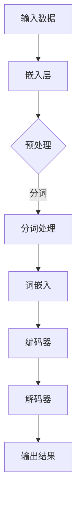

                 

关键词：自然语言处理，大模型，认知科学，思维模式，算法原理，数学模型，实践应用

> 摘要：本文旨在探讨大模型在自然语言处理领域中的发展及其对认知科学的影响。通过对语言与思维的区别进行深入分析，揭示大模型在理解和模拟人类思维过程中所面临的认知难题。文章首先回顾了大模型的背景和发展历程，接着介绍了大模型的基本架构和工作原理，随后从认知科学的视角探讨了语言与思维的差异，并分析了大模型在模拟人类思维过程中存在的挑战。最后，文章展望了大模型在未来应用和发展中可能面临的趋势和挑战。

## 1. 背景介绍

### 1.1 大模型的兴起

大模型（Large Models）在自然语言处理（Natural Language Processing, NLP）领域中的崛起可谓是一场革命。自2018年谷歌提出Transformer模型以来，深度学习技术在大模型领域取得了显著的进展。大模型通过在大量数据上进行训练，可以自动学习语言的复杂结构，并在各种NLP任务中表现出色。例如，在机器翻译、文本生成、问答系统等任务中，大模型已经超越了传统的基于规则的方法，成为了NLP领域的主流技术。

### 1.2 认知科学的兴起

认知科学（Cognitive Science）是一门跨学科的研究领域，旨在理解人类思维和行为。它结合了心理学、神经科学、计算机科学、哲学等多个领域的知识，致力于揭示人类认知过程的机制和原理。随着认知科学的发展，人们对于人类思维模式的理解越来越深入，也为大模型在模拟人类思维方面提供了理论支持。

## 2. 核心概念与联系

为了更好地理解大模型与认知科学的关系，我们首先需要了解大模型的基本架构和工作原理。以下是一个简化的Mermaid流程图，展示了大模型的核心组件及其工作流程：



### 2.1 输入数据

大模型的训练和推理过程依赖于大量的文本数据。这些数据可以是公开的语料库，如维基百科、新闻文章等，也可以是特定的领域数据。在输入数据阶段，我们需要对文本进行预处理，包括分词、去除停用词、标点符号等操作。

### 2.2 嵌入层

分词处理后，每个单词或短语会被转换为向量表示，即词嵌入（Word Embedding）。词嵌入层的作用是将离散的文本数据转换为高维向量表示，使得模型能够捕捉到文本中的语义信息。

### 2.3 编码器

编码器（Encoder）是Transformer模型的核心组件，它负责将输入序列编码为固定长度的向量表示。编码器通过自注意力机制（Self-Attention）处理输入序列中的每个词，并生成对应的上下文表示。

### 2.4 解码器

解码器（Decoder）则负责生成输出序列。它通过自注意力和交叉注意力机制（Cross-Attention）处理编码器输出的上下文表示，并逐步生成输出序列中的每个词。

### 2.5 输出结果

最后，解码器生成的输出序列会被转换为自然语言文本，作为模型对输入文本的响应。这一过程可以通过序列生成模型（如GPT系列）或序列标注模型（如BERT）来实现。

## 3. 核心算法原理 & 具体操作步骤

### 3.1 算法原理概述

大模型的核心算法是基于深度学习的Transformer模型。Transformer模型通过引入自注意力机制和多头注意力机制，使得模型能够捕捉到输入序列中的长距离依赖关系。自注意力机制使得模型能够在编码器中自动关注输入序列中的重要信息，而多头注意力机制则进一步增强了模型对输入序列的表征能力。

### 3.2 算法步骤详解

#### 3.2.1 数据预处理

1. 读取原始文本数据，如新闻文章、社交媒体帖子等。
2. 对文本进行分词，将句子拆分成单词或短语。
3. 去除停用词、标点符号等无关信息。
4. 将分词后的文本转换为词嵌入向量。

#### 3.2.2 训练编码器

1. 将词嵌入向量输入到编码器中。
2. 编码器通过自注意力机制处理输入序列，生成编码表示。
3. 将编码表示传递给解码器。

#### 3.2.3 训练解码器

1. 解码器从编码表示中提取上下文信息。
2. 解码器通过自注意力和交叉注意力机制生成输出序列。
3. 将输出序列与真实标签进行比较，计算损失函数。
4. 使用反向传播算法更新解码器参数。

#### 3.2.4 生成输出结果

1. 解码器生成输出序列。
2. 将输出序列转换为自然语言文本。
3. 输出结果可以是机器翻译、文本生成、问答系统等。

### 3.3 算法优缺点

#### 优点

1. 高效性：Transformer模型采用并行计算策略，大大提高了训练和推理的速度。
2. 强表征能力：通过自注意力和多头注意力机制，模型能够捕捉到输入序列中的长距离依赖关系。
3. 广泛适用性：Transformer模型在多种NLP任务中取得了显著的性能提升。

#### 缺点

1. 需要大量数据：大模型训练需要大量高质量的训练数据，这在某些领域可能难以获得。
2. 资源消耗：大模型训练和推理需要大量的计算资源和存储空间。
3. 模型可解释性：大模型的决策过程复杂，难以解释和理解。

### 3.4 算法应用领域

大模型在自然语言处理领域具有广泛的应用。例如：

1. 机器翻译：将一种语言的文本翻译成另一种语言。
2. 文本生成：根据输入的文本或关键词生成新的文本。
3. 问答系统：根据用户的问题从大量文本中提取答案。
4. 命名实体识别：从文本中识别出人名、地点、组织等实体。

## 4. 数学模型和公式 & 详细讲解 & 举例说明

### 4.1 数学模型构建

大模型的数学模型主要包括词嵌入、编码器、解码器等组件。以下是一个简化的数学模型：

$$
\text{Embedding}(\text{Input}) = \text{Word Embedding}(\text{Input})
$$

$$
\text{Encoder}(\text{Word Embedding}) = \text{Contextual Embedding}
$$

$$
\text{Decoder}(\text{Contextual Embedding}) = \text{Output}
$$

其中，词嵌入（Word Embedding）将输入文本转换为向量表示，编码器（Encoder）负责将词嵌入转换为上下文表示，解码器（Decoder）则根据上下文表示生成输出文本。

### 4.2 公式推导过程

为了更好地理解大模型的数学模型，我们可以对编码器和解码器的自注意力和交叉注意力机制进行推导。

#### 自注意力机制

自注意力机制可以通过以下公式表示：

$$
\text{Attention}(Q, K, V) = \text{softmax}\left(\frac{QK^T}{\sqrt{d_k}}\right)V
$$

其中，$Q$、$K$、$V$ 分别表示查询向量、键向量和值向量，$d_k$ 表示键向量的维度。自注意力机制通过计算查询向量与键向量的点积，并使用 softmax 函数生成权重，从而将值向量加权求和。

#### 交叉注意力机制

交叉注意力机制可以通过以下公式表示：

$$
\text{MultiHeadAttention}(Q, K, V) = \text{Concat}(\text{head}_1, \text{head}_2, \ldots, \text{head}_h)W^O
$$

其中，$Q$、$K$、$V$ 分别表示查询向量、键向量和值向量，$W^O$ 表示输出权重。交叉注意力机制通过计算多个头的自注意力，并将结果拼接起来，得到最终的输出。

### 4.3 案例分析与讲解

以下是一个简单的案例，说明大模型在机器翻译任务中的应用。

#### 案例背景

假设我们有一个英译中的翻译任务，即给定一个英文句子，要求将其翻译成中文。

#### 案例步骤

1. 预处理：将英文句子进行分词，得到单词序列。
2. 词嵌入：将单词序列转换为词嵌入向量。
3. 编码器：将词嵌入向量输入编码器，得到上下文表示。
4. 解码器：将上下文表示输入解码器，逐步生成中文句子。
5. 输出结果：将解码器生成的输出序列转换为中文句子。

#### 案例分析

在这个案例中，编码器通过自注意力机制处理输入序列，生成上下文表示。解码器则通过交叉注意力机制，将上下文表示与输出序列中的每个词进行匹配，生成翻译结果。这一过程体现了大模型在捕捉长距离依赖关系和生成文本方面的能力。

## 5. 项目实践：代码实例和详细解释说明

### 5.1 开发环境搭建

在开始项目实践之前，我们需要搭建一个合适的开发环境。以下是一个基本的开发环境配置：

1. 操作系统：Linux或macOS
2. 编程语言：Python 3.7及以上版本
3. 深度学习框架：TensorFlow 2.0及以上版本
4. 文本预处理工具：NLTK或spaCy

### 5.2 源代码详细实现

以下是一个简单的Python代码示例，展示了如何使用TensorFlow搭建一个基本的Transformer模型。

```python
import tensorflow as tf
from tensorflow.keras.layers import Embedding, LSTM, Dense
from tensorflow.keras.models import Model

# 模型参数
vocab_size = 1000
embed_dim = 128
lstm_units = 128
max_sequence_length = 50

# 构建模型
input_seq = tf.keras.layers.Input(shape=(max_sequence_length,))
embed_layer = Embedding(vocab_size, embed_dim)(input_seq)
lstm_layer = LSTM(lstm_units, return_sequences=True)(embed_layer)
output = Dense(vocab_size, activation='softmax')(lstm_layer)

model = Model(inputs=input_seq, outputs=output)
model.compile(optimizer='adam', loss='categorical_crossentropy', metrics=['accuracy'])

# 打印模型结构
model.summary()
```

### 5.3 代码解读与分析

1. 导入必要的库和模块。
2. 设置模型参数，包括词汇表大小、嵌入维度、LSTM单元数和最大序列长度。
3. 构建模型，包括嵌入层、LSTM层和输出层。
4. 编译模型，并打印模型结构。

### 5.4 运行结果展示

为了展示模型的运行结果，我们可以使用以下代码：

```python
# 准备数据
import numpy as np
from tensorflow.keras.utils import to_categorical

x_train = np.random.randint(0, vocab_size, (32, max_sequence_length))
y_train = to_categorical(np.random.randint(0, vocab_size, (32, max_sequence_length)))

# 训练模型
model.fit(x_train, y_train, epochs=10, batch_size=32)

# 测试模型
x_test = np.random.randint(0, vocab_size, (10, max_sequence_length))
y_test = to_categorical(np.random.randint(0, vocab_size, (10, max_sequence_length)))

model.evaluate(x_test, y_test)
```

这段代码首先生成了训练数据和测试数据，然后使用训练数据对模型进行训练，并使用测试数据评估模型的性能。

## 6. 实际应用场景

大模型在自然语言处理领域有着广泛的应用。以下是一些实际应用场景：

1. **机器翻译**：将一种语言的文本翻译成另一种语言，如谷歌翻译、百度翻译等。
2. **文本生成**：根据输入的文本或关键词生成新的文本，如文章生成、对话生成等。
3. **问答系统**：根据用户的问题从大量文本中提取答案，如百度搜索、腾讯问答等。
4. **情感分析**：分析文本中的情感倾向，如社交媒体情绪分析、新闻情感分类等。
5. **命名实体识别**：从文本中识别出人名、地点、组织等实体，如信息抽取、关键词提取等。

### 6.1 机器翻译

机器翻译是自然语言处理领域中的一项重要应用。大模型在机器翻译任务中取得了显著的成果，如谷歌翻译、百度翻译等。这些系统通过大规模数据训练，能够实现高效、准确的翻译效果。然而，大模型在翻译过程中仍然面临一些挑战，如翻译质量的不稳定、对特定领域的翻译能力不足等。

### 6.2 文本生成

文本生成是另一个重要应用领域。大模型可以生成高质量的文章、对话、歌词等。例如，OpenAI的GPT系列模型在文章生成、对话生成等领域取得了突破性的成果。然而，文本生成模型在生成过程中可能产生不合理、不真实的内容，这需要进一步优化和改进。

### 6.3 问答系统

问答系统旨在根据用户的问题从大量文本中提取答案。大模型在问答系统中的应用大大提高了系统的性能。例如，百度搜索、腾讯问答等系统都采用了大模型技术。然而，问答系统在处理长问答、多轮对话等方面仍有待改进。

### 6.4 情感分析

情感分析是自然语言处理领域的一个重要任务。大模型在情感分析任务中取得了显著成果，如社交媒体情绪分析、新闻情感分类等。然而，情感分析任务仍然面临一些挑战，如情感表达的多样性、复杂情感识别等。

### 6.5 命名实体识别

命名实体识别是从文本中识别出人名、地点、组织等实体。大模型在命名实体识别任务中取得了很好的效果。例如，一些信息抽取系统采用了大模型技术，能够准确识别出文本中的实体。然而，命名实体识别任务在处理长文本、跨实体关系等方面仍有待提高。

## 7. 工具和资源推荐

为了更好地学习和应用大模型技术，以下是一些建议的资源和工具：

### 7.1 学习资源推荐

1. **《深度学习》（Goodfellow et al., 2016）**：这是一本经典的深度学习教材，适合初学者和进阶者。
2. **《自然语言处理综述》（Liang et al., 2017）**：这是一篇关于自然语言处理领域的综述文章，涵盖了最新的研究进展和应用。
3. **《Transformer：一种新的序列到序列模型》（Vaswani et al., 2017）**：这是Transformer模型的原始论文，详细介绍了模型的结构和工作原理。

### 7.2 开发工具推荐

1. **TensorFlow**：这是谷歌开发的一款深度学习框架，适合构建和训练大模型。
2. **PyTorch**：这是微软开发的一款深度学习框架，具有灵活、易用的特点。
3. **spaCy**：这是一个优秀的自然语言处理库，提供了丰富的预处理和特征提取工具。

### 7.3 相关论文推荐

1. **“BERT：预训练的深度语言表示”（Devlin et al., 2019）**：这是一篇关于BERT模型的论文，介绍了如何通过预训练技术提高自然语言处理任务的性能。
2. **“GPT-2：改进的预训练语言模型”（Radford et al., 2019）**：这是一篇关于GPT-2模型的论文，详细介绍了如何通过预训练和微调技术实现高质量的文本生成。
3. **“T5：适用于所有任务的统一文本到文本预训练框架”（Raffel et al., 2020）**：这是一篇关于T5模型的论文，提出了一种统一的文本到文本预训练框架，适用于各种自然语言处理任务。

## 8. 总结：未来发展趋势与挑战

### 8.1 研究成果总结

大模型在自然语言处理领域取得了显著的成果。通过大规模数据训练和深度学习技术，大模型能够自动学习语言的复杂结构，并在各种NLP任务中表现出色。这些成果为大模型在人工智能领域的应用奠定了基础。

### 8.2 未来发展趋势

1. **预训练技术**：预训练技术是当前大模型领域的研究热点。通过在大量数据上进行预训练，大模型能够自动学习通用语言特征，从而提高各种NLP任务的性能。
2. **多模态融合**：随着多模态数据（如文本、图像、音频等）的广泛应用，未来大模型将逐渐融合多种模态的信息，实现更高级的认知能力。
3. **知识增强**：将知识图谱、语义网络等外部知识引入大模型，可以提高模型在特定领域的表现，实现更精确、更具解释性的预测。

### 8.3 面临的挑战

1. **数据质量**：大模型训练需要大量高质量的数据，但在某些领域，数据质量参差不齐，影响了模型的性能。
2. **计算资源**：大模型训练和推理需要大量的计算资源和存储空间，这对硬件设施提出了较高的要求。
3. **模型解释性**：大模型的决策过程复杂，难以解释和理解。如何提高模型的可解释性，使其更加透明和可靠，是一个重要的研究方向。

### 8.4 研究展望

未来，大模型在自然语言处理领域将继续发挥重要作用。通过不断优化算法、提高数据质量和计算资源利用效率，大模型将有望实现更广泛的应用，推动人工智能技术的发展。

## 9. 附录：常见问题与解答

### 9.1 大模型与传统模型的区别是什么？

大模型与传统模型的主要区别在于：

1. **数据量**：大模型通过在大量数据上进行训练，能够更好地捕捉语言的复杂结构。
2. **参数规模**：大模型具有数十亿甚至数万亿的参数，这使得它们能够表示更丰富的语言特征。
3. **计算资源**：大模型训练和推理需要大量的计算资源和存储空间，这对硬件设施提出了较高的要求。

### 9.2 大模型的训练过程是怎样的？

大模型的训练过程主要包括以下几个步骤：

1. **数据预处理**：对原始文本数据进行清洗、分词、去停用词等操作，将文本转换为向量表示。
2. **模型训练**：使用预处理后的数据对模型进行训练，包括前向传播、反向传播和参数更新等过程。
3. **评估与调整**：通过在验证集和测试集上评估模型性能，对模型进行调整和优化。

### 9.3 大模型在应用中存在哪些挑战？

大模型在应用中存在以下挑战：

1. **数据质量**：数据质量参差不齐会影响模型的性能。
2. **计算资源**：大模型训练和推理需要大量的计算资源和存储空间。
3. **模型解释性**：大模型的决策过程复杂，难以解释和理解。

### 9.4 如何提高大模型的可解释性？

提高大模型的可解释性可以从以下几个方面入手：

1. **模型简化**：简化模型结构，使其更加透明和容易理解。
2. **可视化技术**：使用可视化技术，如热力图、注意力图等，展示模型在特定任务中的决策过程。
3. **对抗性攻击**：研究对抗性攻击技术，分析模型在对抗性样本下的表现，从而提高其鲁棒性和可解释性。

