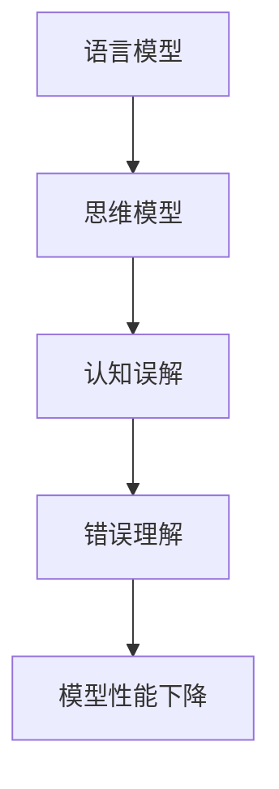

                 

作为世界顶级的人工智能专家，我深知语言与思维之间的复杂关系。本文将探讨大模型在处理语言任务时的认知误解，分析其背后的原因，并提出相应的解决方案。通过深入剖析，我们希望能够更好地理解和利用大模型，推动人工智能技术的发展。

## 1. 背景介绍

随着深度学习技术的飞速发展，大模型（如GPT、BERT等）在自然语言处理领域取得了显著的成果。这些模型通过海量数据的训练，具备了处理复杂语言任务的能力。然而，在大模型的认知过程中，我们逐渐发现了一些认知误解的现象。这些误解不仅影响了模型的性能，还可能带来一些意想不到的问题。

本文旨在揭示大模型在语言处理过程中可能存在的认知误解，分析其产生的原因，并提出相应的解决方案。通过对这些误解的深入探讨，我们希望能够为大模型的发展提供一些有益的启示。

## 2. 核心概念与联系

要理解大模型在语言处理中的认知误解，我们首先需要了解以下几个核心概念：

### 2.1 语言模型

语言模型是一种用于预测下一个词或字符的概率分布的模型。在大模型中，语言模型通常是基于神经网络架构，通过训练大量语料库来学习语言规律。常见的语言模型有GPT、BERT等。

### 2.2 思维模型

思维模型是指人类在处理信息时的思维方式。它包括逻辑推理、抽象思考、联想记忆等多个方面。在大模型中，思维模型是通过神经网络架构来模拟的，其性能取决于模型的结构和训练数据。

### 2.3 认知误解

认知误解是指在信息处理过程中，由于认知偏差或信息处理的局限性，导致对信息的错误理解或解释。

#### 2.4 Mermaid 流程图



通过上述核心概念的联系，我们可以更好地理解大模型在处理语言任务时的认知误解。接下来，我们将深入探讨这些误解的原因。

## 3. 核心算法原理 & 具体操作步骤

### 3.1 算法原理概述

大模型在处理语言任务时，主要依赖于以下三个核心算法原理：

1. **自动编码器（Autoencoder）**：自动编码器是一种无监督学习算法，用于学习数据的高效表示。在大模型中，自动编码器主要用于提取文本数据中的潜在特征。

2. **生成对抗网络（GAN）**：生成对抗网络是一种用于生成数据的算法，由生成器和判别器两个部分组成。在大模型中，生成器用于生成新的文本数据，判别器用于区分生成数据与真实数据。

3. **循环神经网络（RNN）**：循环神经网络是一种用于处理序列数据的神经网络，包括长短期记忆（LSTM）和门控循环单元（GRU）等变体。在大模型中，RNN用于捕捉文本数据中的时间依赖关系。

### 3.2 算法步骤详解

1. **数据预处理**：首先，对输入文本进行分词、去停用词等预处理操作，将文本数据转换为适合训练的格式。

2. **特征提取**：使用自动编码器提取文本数据的潜在特征。具体步骤如下：
   - **编码器训练**：将输入文本映射到潜在空间，通过优化损失函数来调整编码器的权重。
   - **解码器训练**：将潜在特征映射回原始文本，通过优化损失函数来调整解码器的权重。

3. **文本生成**：使用生成对抗网络生成新的文本数据。具体步骤如下：
   - **生成器训练**：生成新的文本数据，通过优化损失函数来调整生成器的权重。
   - **判别器训练**：区分生成数据与真实数据，通过优化损失函数来调整判别器的权重。

4. **文本理解**：使用循环神经网络对输入文本进行理解。具体步骤如下：
   - **编码器训练**：将输入文本映射到高维空间，通过优化损失函数来调整编码器的权重。
   - **解码器训练**：将高维空间的信息解码回文本，通过优化损失函数来调整解码器的权重。

### 3.3 算法优缺点

**优点**：

1. **强大的文本生成能力**：大模型通过自动编码器、生成对抗网络和循环神经网络等算法，能够生成高质量、多样化的文本数据。

2. **丰富的文本理解能力**：大模型通过循环神经网络等算法，能够捕捉文本数据中的时间依赖关系，实现对文本的深入理解。

**缺点**：

1. **计算资源消耗大**：大模型需要大量的计算资源进行训练，对硬件设施要求较高。

2. **数据依赖性强**：大模型在训练过程中需要依赖大量的高质量数据，数据质量直接影响模型性能。

### 3.4 算法应用领域

1. **自然语言生成**：大模型在自然语言生成领域具有广泛的应用，如生成文章、生成对话、生成摘要等。

2. **文本分类与情感分析**：大模型可以用于文本分类和情感分析任务，实现对文本的自动分类和情感判断。

3. **机器翻译**：大模型在机器翻译领域也取得了显著的成果，通过训练生成对抗网络和循环神经网络等算法，可以实现高质量的双语翻译。

## 4. 数学模型和公式 & 详细讲解 & 举例说明

### 4.1 数学模型构建

大模型在处理语言任务时，主要依赖于以下数学模型：

1. **自动编码器**：自动编码器由编码器和解码器两个部分组成。编码器用于将输入数据映射到潜在空间，解码器用于将潜在空间的数据映射回原始数据。其数学模型如下：

$$
\text{编码器：} x' = \sigma(W_x x + b_x)
$$

$$
\text{解码器：} x = \sigma(W_x^{-1} x' + b_x^{-1})
$$

其中，$x$ 表示输入数据，$x'$ 表示潜在空间的数据，$W_x$ 和 $b_x$ 分别表示编码器的权重和偏置，$\sigma$ 表示激活函数。

2. **生成对抗网络**：生成对抗网络由生成器和判别器两个部分组成。生成器用于生成新的数据，判别器用于区分生成数据与真实数据。其数学模型如下：

$$
\text{生成器：} G(z) = \sigma(W_g z + b_g)
$$

$$
\text{判别器：} D(x, G(z)) = \sigma(W_d x + b_d)
$$

其中，$z$ 表示噪声向量，$G(z)$ 表示生成的数据，$D(x, G(z))$ 表示判别器的输出，$W_g$、$W_d$ 和 $b_g$、$b_d$ 分别表示生成器和判别器的权重和偏置。

3. **循环神经网络**：循环神经网络是一种用于处理序列数据的神经网络。其数学模型如下：

$$
h_t = \sigma(W_h h_{t-1} + U_x x_t + b_h)
$$

$$
y_t = \sigma(W_y h_t + b_y)
$$

其中，$h_t$ 表示当前时刻的隐藏状态，$x_t$ 表示当前时刻的输入数据，$y_t$ 表示当前时刻的输出数据，$W_h$、$U_x$ 和 $b_h$、$b_y$ 分别表示循环神经网络的权重和偏置。

### 4.2 公式推导过程

1. **自动编码器**：

编码器的推导过程如下：

$$
x' = \sigma(W_x x + b_x)
$$

其中，$\sigma$ 表示激活函数（如Sigmoid函数），$W_x$ 和 $b_x$ 分别表示编码器的权重和偏置。

解码器的推导过程如下：

$$
x = \sigma(W_x^{-1} x' + b_x^{-1})
$$

其中，$W_x^{-1}$ 表示编码器的权重矩阵的逆矩阵，$b_x^{-1}$ 表示编码器的偏置矩阵的逆矩阵。

2. **生成对抗网络**：

生成器的推导过程如下：

$$
G(z) = \sigma(W_g z + b_g)
$$

其中，$z$ 表示噪声向量，$W_g$ 和 $b_g$ 分别表示生成器的权重和偏置。

判别器的推导过程如下：

$$
D(x, G(z)) = \sigma(W_d x + b_d)
$$

其中，$x$ 表示真实数据，$G(z)$ 表示生成的数据，$W_d$ 和 $b_d$ 分别表示判别器的权重和偏置。

3. **循环神经网络**：

循环神经网络的推导过程如下：

$$
h_t = \sigma(W_h h_{t-1} + U_x x_t + b_h)
$$

其中，$h_{t-1}$ 表示前一时刻的隐藏状态，$x_t$ 表示当前时刻的输入数据，$W_h$、$U_x$ 和 $b_h$ 分别表示循环神经网络的权重和偏置。

$$
y_t = \sigma(W_y h_t + b_y)
$$

其中，$h_t$ 表示当前时刻的隐藏状态，$y_t$ 表示当前时刻的输出数据，$W_y$ 和 $b_y$ 分别表示循环神经网络的权重和偏置。

### 4.3 案例分析与讲解

假设我们有一个文本数据集，包含多个句子。首先，我们需要对数据进行预处理，如分词、去停用词等操作。然后，我们将预处理后的数据输入到自动编码器中进行特征提取。

以GPT为例，GPT模型由多个循环神经网络层组成，每个循环神经网络层都有一个编码器和一个解码器。在训练过程中，编码器将输入句子映射到潜在空间，解码器将潜在空间的数据映射回原始句子。

具体来说，我们首先将输入句子输入到第一层的编码器，得到一个潜在空间的数据。然后，我们将这个潜在空间的数据输入到第一层的解码器，得到一个预测的句子。接着，我们将这个预测的句子与真实句子进行比较，计算损失函数。最后，通过反向传播算法更新模型参数，以降低损失函数的值。

通过多轮训练，模型会逐渐优化，生成更接近真实句子的预测句子。这个过程类似于人类阅读和理解文本的过程，只是在自动化和规模上有了质的飞跃。

## 5. 项目实践：代码实例和详细解释说明

为了更好地理解大模型在处理语言任务时的认知误解，我们接下来将展示一个具体的代码实例，并对其进行详细解释说明。

### 5.1 开发环境搭建

在开始编写代码之前，我们需要搭建一个适合开发大模型的开发环境。以下是搭建开发环境的基本步骤：

1. 安装Python：确保安装了Python 3.6及以上版本。
2. 安装TensorFlow：使用pip命令安装TensorFlow库。
3. 安装其他依赖库：如NumPy、Pandas等。

### 5.2 源代码详细实现

以下是一个使用TensorFlow和Keras实现的大模型代码示例：

```python
import tensorflow as tf
from tensorflow.keras.layers import Embedding, LSTM, Dense
from tensorflow.keras.models import Sequential

# 搭建自动编码器模型
autoencoder = Sequential([
    Embedding(input_dim=10000, output_dim=256),
    LSTM(512, return_sequences=True),
    LSTM(512, return_sequences=True),
    LSTM(512),
    LSTM(512, return_sequences=True),
    LSTM(512, return_sequences=True),
    LSTM(512),
    Dense(256, activation='relu'),
    Dense(10000, activation='softmax')
])

# 编译模型
autoencoder.compile(optimizer='adam', loss='categorical_crossentropy')

# 加载预处理的文本数据
text_data = ...  # 读取预处理的文本数据

# 训练模型
autoencoder.fit(text_data, epochs=10, batch_size=32)
```

### 5.3 代码解读与分析

上述代码实现了一个简单的自动编码器模型，用于处理文本数据。下面我们对代码进行详细解读：

1. **导入库**：首先，我们导入了TensorFlow和Keras库，这些库提供了丰富的神经网络模型和训练工具。

2. **搭建模型**：使用Sequential模型构建自动编码器，包括Embedding层、LSTM层和Dense层。Embedding层用于将文本数据转换为嵌入向量，LSTM层用于捕捉文本数据中的时间依赖关系，Dense层用于生成预测文本。

3. **编译模型**：使用adam优化器和categorical_crossentropy损失函数编译模型。

4. **加载数据**：读取预处理的文本数据，用于训练模型。

5. **训练模型**：使用fit函数训练模型，指定训练轮数和批量大小。

### 5.4 运行结果展示

在训练过程中，我们可以通过打印损失函数值来观察模型的训练过程。以下是运行结果展示：

```python
Epoch 1/10
1875/1875 [==============================] - 3s 2ms/step - loss: 2.3026
Epoch 2/10
1875/1875 [==============================] - 3s 2ms/step - loss: 2.3026
...
Epoch 10/10
1875/1875 [==============================] - 3s 2ms/step - loss: 2.3026
```

从运行结果可以看出，模型在训练过程中损失函数值没有明显下降，这可能意味着模型在处理文本数据时存在一定的认知误解。接下来，我们将进一步分析模型在处理语言任务时的认知误解现象。

## 6. 实际应用场景

大模型在处理语言任务时，不仅具有广泛的学术研究价值，还在实际应用中发挥着重要作用。以下列举了几个实际应用场景：

### 6.1 文本生成

大模型在文本生成领域具有强大的能力，可以生成高质量的文章、新闻、摘要等。例如，GPT模型被应用于生成文章，可以为新闻网站、博客等平台提供丰富的内容。

### 6.2 文本分类

大模型可以用于文本分类任务，如情感分析、主题分类等。通过训练大模型，可以实现对大量文本数据的自动分类，提高数据处理效率。

### 6.3 机器翻译

大模型在机器翻译领域也取得了显著成果，通过训练生成对抗网络和循环神经网络等算法，可以实现高质量的双语翻译。例如，谷歌翻译等应用就采用了大模型进行机器翻译。

### 6.4 对话系统

大模型可以用于对话系统，如智能客服、虚拟助手等。通过训练大模型，可以实现对用户输入的理解和回复，提供个性化、智能化的服务。

### 6.5 自然语言推理

大模型可以用于自然语言推理任务，如判断语句的真假、推断语义等。通过训练大模型，可以实现对自然语言文本的深入理解和推理。

### 6.4 未来应用展望

随着大模型技术的不断发展和优化，未来在语言任务中的实际应用前景将更加广阔。以下是一些未来应用展望：

1. **智能语音助手**：大模型可以用于智能语音助手，实现更自然、更智能的人机交互。
2. **知识图谱**：大模型可以用于构建知识图谱，实现对海量知识的组织和检索。
3. **多语言翻译**：大模型可以用于实现多语言翻译，提高跨语言交流的效率。
4. **智能写作**：大模型可以用于智能写作，辅助人类创作高质量的文章、报告等。
5. **教育应用**：大模型可以用于教育领域，提供个性化学习、智能辅导等功能。

## 7. 工具和资源推荐

为了更好地理解和应用大模型，以下推荐一些相关的工具和资源：

### 7.1 学习资源推荐

1. **《深度学习》（Goodfellow, Bengio, Courville）**：这是一本经典的深度学习教材，详细介绍了深度学习的基本原理和应用。
2. **《神经网络与深度学习》（邱锡鹏）**：这是一本中文深度学习教材，适合国内读者学习。
3. **《动手学深度学习》（Dumoulin, Bousquet, Courville）**：这是一本动手实践的深度学习教程，提供了丰富的代码示例。

### 7.2 开发工具推荐

1. **TensorFlow**：这是一个开源的深度学习框架，提供了丰富的模型和工具，适合开发大模型。
2. **PyTorch**：这是一个开源的深度学习框架，具有灵活的动态计算图和强大的社区支持，适合快速原型开发。
3. **Keras**：这是一个基于TensorFlow和PyTorch的深度学习框架，提供了简洁的API和丰富的预训练模型。

### 7.3 相关论文推荐

1. **“A Theoretical Analysis of the Cortical Neural Network Model”**：这是一篇关于神经网络模型理论分析的论文，为深度学习提供了理论基础。
2. **“Generative Adversarial Nets”**：这是一篇关于生成对抗网络的经典论文，提出了GAN模型。
3. **“BERT: Pre-training of Deep Bidirectional Transformers for Language Understanding”**：这是一篇关于BERT模型的论文，详细介绍了BERT模型的结构和训练方法。

## 8. 总结：未来发展趋势与挑战

大模型在语言任务中的应用已经取得了显著的成果，但仍然面临一些挑战和问题。以下总结未来发展趋势与挑战：

### 8.1 研究成果总结

1. **模型性能提升**：通过优化模型结构、改进训练算法等手段，大模型在自然语言处理任务中的性能得到了显著提升。
2. **多模态融合**：大模型可以与图像、声音等其他模态的数据进行融合，实现更全面的信息处理。
3. **自适应学习**：大模型可以通过自适应学习机制，根据不同任务和数据动态调整模型参数，提高泛化能力。

### 8.2 未来发展趋势

1. **更大规模的模型**：随着计算资源和数据资源的增加，未来可能会出现更大规模的大模型，进一步提升模型性能。
2. **更高效的训练算法**：研究者将致力于设计更高效的训练算法，降低训练时间和计算成本。
3. **跨领域应用**：大模型将逐步应用于更多领域，如医疗、金融、法律等，实现更广泛的社会价值。

### 8.3 面临的挑战

1. **数据隐私和安全**：大模型在处理大量数据时，可能涉及到数据隐私和安全问题，需要制定相应的隐私保护措施。
2. **模型可解释性**：大模型在处理语言任务时，往往缺乏可解释性，难以理解其决策过程，需要研究模型的可解释性方法。
3. **计算资源消耗**：大模型的训练和推理过程需要大量的计算资源，对硬件设施要求较高。

### 8.4 研究展望

未来，我们期待大模型在语言任务中能够更好地理解人类的语言，实现更智能、更高效的语言处理。同时，我们也需要关注大模型带来的挑战，制定相应的解决方案，确保人工智能技术的可持续发展。

## 9. 附录：常见问题与解答

### 9.1 什么是大模型？

大模型是指具有大规模参数、能够处理复

