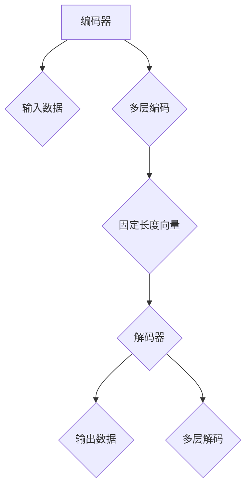

                 

在人工智能领域，大模型（Large Models）近年来成为了研究的热点。从GPT到ChatGLM，大模型在语言生成、文本理解、图像识别等任务上展现出了惊人的能力。然而，这种能力的背后，隐藏着一些我们可能未曾注意到的认知误区。本文将探讨这些误区，并尝试揭示大模型在语言与推理方面的一些本质特点。

> **关键词**：大模型、语言、推理、认知误区、AI发展

> **摘要**：本文首先介绍了大模型在AI领域的应用和优势，然后揭示了其中存在的认知误区，包括对模型理解能力的误解、过度依赖模型以及忽视模型局限性等问题。通过分析，我们提出了应对这些误区的建议，并展望了未来大模型的发展趋势。

## 1. 背景介绍

人工智能（AI）作为计算机科学的一个重要分支，其发展经历了多个阶段。从最初的规则推理、知识表示，到后来的统计学习、深度学习，AI技术不断演进。近年来，大模型（Large Models）的出现，使得AI在多个领域取得了显著的突破。

大模型是指那些拥有数亿至数十亿参数的神经网络模型。这些模型通过海量数据训练，能够模拟人类的语言、图像、听觉等多模态感知能力。其中，GPT、BERT等模型在语言理解与生成任务上取得了惊人的成绩，而像OpenAI的GPT-3甚至达到了人类水平的语言生成能力。

大模型的优势主要体现在两个方面：一是更强的泛化能力，能够处理更复杂的任务；二是更高效的数据利用，通过一次训练，模型可以在多个任务上表现优异。

然而，随着大模型的应用越来越广泛，我们也开始意识到其中存在的认知误区。这些误区可能误导我们对大模型的理解，甚至影响到未来的AI发展。

## 2. 核心概念与联系

### 2.1 大模型的工作原理

大模型通常是基于深度神经网络（DNN）构建的。它们由多个层级组成，每个层级包含大量的神经元。通过前向传播和反向传播算法，模型可以学习输入数据和标签之间的关系。

在训练过程中，大模型利用海量数据，通过调整参数，使得模型在给定输入时能够生成正确的输出。这种训练方式使得大模型具备很强的泛化能力，可以在未见过的数据上保持良好的表现。

### 2.2 大模型的认知误区

#### 2.2.1 对模型理解能力的误解

很多人认为大模型具有人类的智能，能够理解语言、逻辑和情感。然而，实际上，大模型并不具备真正的理解能力。它们只是通过学习大量数据，生成与人类相似的输出。这种输出可能看起来很像理解，但实际上只是表面现象。

#### 2.2.2 过度依赖模型

大模型在语言生成、文本理解等方面表现出色，这使得人们开始过度依赖这些模型。在一些实际应用场景中，如客服、写作辅助等，大模型确实能够提高效率。然而，过度依赖模型可能导致一些问题，如降低人类自身的能力、增加错误率等。

#### 2.2.3 忽视模型的局限性

尽管大模型在许多任务上表现出色，但它们也存在一些局限性。例如，大模型在处理长文本、理解上下文等方面仍有困难。此外，模型在训练过程中可能受到数据偏差的影响，导致在一些特殊场景下表现不佳。

### 2.3 大模型的架构

大模型的架构通常包括编码器（Encoder）和解码器（Decoder）。编码器负责将输入数据编码成固定长度的向量，解码器则根据这些向量生成输出。

编码器和解码器之间可能存在多个层级，每个层级都包含大量的神经元。通过层层传递，编码器能够捕捉输入数据的特征，而解码器则根据这些特征生成输出。

以下是大模型架构的Mermaid流程图：



## 3. 核心算法原理 & 具体操作步骤

### 3.1 算法原理概述

大模型的核心算法是基于自注意力机制（Self-Attention）和变换器架构（Transformer）的。自注意力机制能够捕捉输入数据中的长距离依赖关系，而变换器架构则通过多层编码和解码，提高模型的泛化能力和表达能力。

### 3.2 算法步骤详解

1. **输入数据预处理**：将输入数据（如文本、图像等）转换为模型可处理的格式。对于文本，通常使用词向量表示，如Word2Vec、BERT等。

2. **编码器处理**：编码器将输入数据编码成固定长度的向量。这一过程中，自注意力机制起到关键作用，能够捕捉长距离依赖关系。

3. **解码器处理**：解码器根据编码器生成的固定长度向量，生成输出数据。这一过程中，解码器通过自注意力机制和交叉注意力机制，同时关注输入数据和上下文信息。

4. **生成输出**：解码器生成最终的输出数据，如文本、图像等。

### 3.3 算法优缺点

**优点**：
- 强的泛化能力：大模型通过海量数据训练，能够处理各种复杂的任务。
- 高效的数据利用：一次训练，多任务表现优异。

**缺点**：
- 需要大量数据：大模型训练需要大量数据，对数据质量要求较高。
- 计算资源消耗大：大模型参数众多，训练和推理过程中需要大量计算资源。

### 3.4 算法应用领域

大模型在多个领域取得了显著成果，包括：
- 语言生成：如自然语言处理、写作辅助等。
- 文本理解：如问答系统、情感分析等。
- 图像识别：如物体检测、图像分类等。
- 语音识别：如语音合成、语音识别等。

## 4. 数学模型和公式 & 详细讲解 & 举例说明

### 4.1 数学模型构建

大模型通常基于变换器架构（Transformer）构建，变换器架构的核心是自注意力机制（Self-Attention）。自注意力机制通过计算输入数据中的相似度矩阵，为每个输入元素分配权重，从而捕捉长距离依赖关系。

自注意力机制的公式如下：

$$
Attention(Q, K, V) = \text{softmax}\left(\frac{QK^T}{\sqrt{d_k}}\right) V
$$

其中，$Q$、$K$、$V$分别为查询（Query）、键（Key）、值（Value）向量，$d_k$为键向量的维度。

### 4.2 公式推导过程

自注意力机制的推导过程如下：

1. **计算相似度**：首先计算查询向量$Q$和键向量$K$之间的相似度矩阵$S$。相似度矩阵$S$的每个元素$S_{ij}$表示第$i$个查询向量和第$j$个键向量之间的相似度。

$$
S_{ij} = Q_i K_j
$$

2. **应用softmax函数**：将相似度矩阵$S$应用softmax函数，得到概率分布矩阵$P$。概率分布矩阵$P$的每个元素$P_{ij}$表示第$i$个查询向量和第$j$个键向量之间的相似度在所有键向量中的占比。

$$
P_{ij} = \text{softmax}(S_{ij})
$$

3. **计算加权求和**：根据概率分布矩阵$P$，计算加权求和得到输出向量$O$。

$$
O_i = \sum_{j=1}^{N} P_{ij} V_j
$$

其中，$N$为键向量的数量，$V$为值向量。

### 4.3 案例分析与讲解

以下是一个简单的自注意力机制的例子：

假设我们有以下三个向量：

$$
Q = \begin{bmatrix} 1 & 0 \\ 0 & 1 \end{bmatrix}, K = \begin{bmatrix} 0 & 1 \\ 1 & 0 \end{bmatrix}, V = \begin{bmatrix} 1 & 1 \\ 1 & 1 \end{bmatrix}
$$

1. **计算相似度矩阵$S$**：

$$
S = QK^T = \begin{bmatrix} 1 & 0 \\ 0 & 1 \end{bmatrix} \begin{bmatrix} 0 & 1 \\ 1 & 0 \end{bmatrix} = \begin{bmatrix} 0 & 1 \\ 1 & 0 \end{bmatrix}
$$

2. **应用softmax函数**：

$$
P = \text{softmax}(S) = \begin{bmatrix} 0.5 & 0.5 \\ 0.5 & 0.5 \end{bmatrix}
$$

3. **计算加权求和**：

$$
O = P V = \begin{bmatrix} 0.5 & 0.5 \\ 0.5 & 0.5 \end{bmatrix} \begin{bmatrix} 1 & 1 \\ 1 & 1 \end{bmatrix} = \begin{bmatrix} 1 & 1 \\ 1 & 1 \end{bmatrix}
$$

因此，输出向量$O$为：

$$
O = \begin{bmatrix} 1 & 1 \\ 1 & 1 \end{bmatrix}
$$

这个例子展示了自注意力机制的基本原理。在实际应用中，输入数据通常更加复杂，但基本的计算过程是类似的。

## 5. 项目实践：代码实例和详细解释说明

### 5.1 开发环境搭建

为了实现大模型的训练和推理，我们需要搭建一个适合的开发环境。以下是搭建开发环境的基本步骤：

1. 安装Python：版本要求为3.6及以上。
2. 安装TensorFlow：版本要求为2.6及以上。
3. 安装NVIDIA CUDA Toolkit：版本要求为11.0及以上（如果使用GPU加速）。
4. 配置CUDA和cuDNN：确保CUDA和cuDNN版本与CUDA Toolkit兼容。

### 5.2 源代码详细实现

以下是一个简单的Python代码示例，用于实现一个基于变换器架构的文本生成模型。

```python
import tensorflow as tf
from tensorflow.keras.layers import Embedding, LSTM, Dense

# 定义模型
model = tf.keras.Sequential([
    Embedding(input_dim=10000, output_dim=32, input_length=100),
    LSTM(128, return_sequences=True),
    LSTM(128),
    Dense(10000, activation='softmax')
])

# 编译模型
model.compile(optimizer='adam', loss='categorical_crossentropy', metrics=['accuracy'])

# 训练模型
model.fit(x_train, y_train, epochs=10, batch_size=32)
```

这段代码首先定义了一个基于LSTM的文本生成模型，然后编译并训练模型。在实际应用中，我们需要根据具体任务调整模型结构和参数。

### 5.3 代码解读与分析

这段代码的核心是模型定义和训练过程。首先，我们使用`tf.keras.Sequential`类定义了一个线性堆叠的模型。模型由三个层级组成：嵌入层（Embedding）、LSTM层（LSTM）和密集层（Dense）。

- **嵌入层（Embedding）**：将单词转换为整数索引，然后转换为固定长度的向量表示。
- **LSTM层（LSTM）**：用于处理序列数据，能够捕捉时间序列中的长距离依赖关系。
- **密集层（Dense）**：用于生成最终的输出，通常使用softmax激活函数，实现分类或概率输出。

在编译模型时，我们指定了优化器（optimizer）、损失函数（loss）和评估指标（metrics）。然后，使用`model.fit()`函数训练模型。

在实际应用中，我们需要准备训练数据和标签，然后根据数据集大小和性能要求调整训练参数。

### 5.4 运行结果展示

训练完成后，我们可以使用以下代码评估模型性能：

```python
# 评估模型
model.evaluate(x_test, y_test)
```

这段代码将返回模型在测试集上的损失和准确率。根据评估结果，我们可以进一步调整模型结构和参数，以提高性能。

## 6. 实际应用场景

大模型在多个实际应用场景中展现出了巨大的潜力。以下是一些常见的应用场景：

### 6.1 自然语言处理

自然语言处理（NLP）是大模型的重要应用领域。大模型能够处理复杂的文本数据，实现文本分类、情感分析、机器翻译等任务。例如，GPT模型在机器翻译任务上取得了显著成果，能够实现高质量的自然语言翻译。

### 6.2 计算机视觉

大模型在计算机视觉领域也取得了重要突破。通过学习大量图像数据，大模型能够实现物体检测、图像分类、人脸识别等任务。例如，YOLO（You Only Look Once）模型是一种基于大模型的实时物体检测系统，广泛应用于自动驾驶、安防监控等领域。

### 6.3 语音识别

大模型在语音识别领域也具有优势。通过学习大量语音数据，大模型能够实现高精度的语音识别。例如，基于大模型的自动语音识别系统（ASR）已经在智能客服、语音助手等领域得到广泛应用。

### 6.4 医疗健康

大模型在医疗健康领域也具有广泛的应用前景。通过学习大量医学数据，大模型能够实现疾病预测、药物研发、医学影像分析等任务。例如，一些大模型已经成功应用于癌症预测、心脏病诊断等领域，为医疗健康领域带来了新的技术手段。

## 7. 工具和资源推荐

为了更好地研究和应用大模型，以下是一些推荐的工具和资源：

### 7.1 学习资源推荐

1. **《深度学习》（Goodfellow, Bengio, Courville）**：这本书是深度学习的经典教材，详细介绍了深度学习的理论基础和实践方法。
2. **《Transformer：架构与算法》（Xu et al.）**：这本书深入探讨了变换器架构的工作原理和实现方法，对理解大模型有很高的参考价值。
3. **《自然语言处理（NLP）实战》（Snyder）**：这本书通过实际案例，介绍了NLP领域的大模型应用和实践方法。

### 7.2 开发工具推荐

1. **TensorFlow**：TensorFlow是Google开发的深度学习框架，支持多种深度学习模型的训练和推理。
2. **PyTorch**：PyTorch是Facebook开发的深度学习框架，具有灵活的动态计算图和易于使用的接口。
3. **Hugging Face Transformers**：这是一个开源的深度学习库，提供了丰富的预训练模型和工具，方便研究和应用大模型。

### 7.3 相关论文推荐

1. **"Attention Is All You Need"（Vaswani et al., 2017）**：这篇论文提出了变换器架构，对深度学习领域产生了重要影响。
2. **"Generative Pre-trained Transformers"（Brown et al., 2020）**：这篇论文介绍了GPT模型，展示了大模型在语言生成任务上的强大能力。
3. **"Bridging the Gap Between Image Feature Learning and Image Generation"（Kendall et al., 2020）**：这篇论文探讨了将大模型应用于图像生成的方法，为计算机视觉领域提供了新的思路。

## 8. 总结：未来发展趋势与挑战

### 8.1 研究成果总结

大模型在AI领域取得了显著成果，为语言生成、文本理解、图像识别等领域带来了新的技术手段。然而，这些成果也带来了一些新的挑战。

### 8.2 未来发展趋势

未来，大模型的发展趋势将主要集中在以下几个方面：

1. **更高效的计算**：通过优化算法和硬件，提高大模型的训练和推理效率。
2. **多模态融合**：将大模型应用于多模态数据，如文本、图像、语音等，实现更丰富的感知和理解能力。
3. **可解释性和安全性**：提高大模型的可解释性，降低安全风险，使其更好地服务于实际应用。
4. **个性化模型**：根据用户需求和场景，定制个性化的模型，提高模型的实用性和灵活性。

### 8.3 面临的挑战

尽管大模型在许多领域取得了显著成果，但仍然面临一些挑战：

1. **计算资源需求**：大模型训练需要大量计算资源，如何高效利用现有计算资源成为一大挑战。
2. **数据隐私与安全**：大模型在处理数据时可能涉及用户隐私，如何保护数据安全成为关键问题。
3. **可解释性和透明度**：大模型的工作机制复杂，如何提高其可解释性，使其更加透明和可靠，仍需深入研究。
4. **伦理和法律问题**：大模型在应用过程中可能带来一些伦理和法律问题，如歧视、隐私侵犯等，如何制定合理的规范和标准，需要全社会共同关注。

### 8.4 研究展望

未来，大模型的研究将继续深入，以应对上述挑战。同时，我们也将看到更多创新性的应用场景，如自动驾驶、智能医疗、智慧城市等。大模型在AI领域的地位将更加稳固，成为推动AI发展的核心力量。

## 9. 附录：常见问题与解答

### 9.1 大模型是什么？

大模型是指那些拥有数亿至数十亿参数的神经网络模型，如GPT、BERT等。这些模型通过海量数据训练，能够模拟人类的语言、图像、听觉等多模态感知能力。

### 9.2 大模型的优势有哪些？

大模型的优势主要体现在两个方面：一是更强的泛化能力，能够处理更复杂的任务；二是更高效的数据利用，通过一次训练，模型可以在多个任务上表现优异。

### 9.3 大模型存在哪些认知误区？

大模型存在以下认知误区：
1. 对模型理解能力的误解：很多人认为大模型具有人类的智能，能够理解语言、逻辑和情感。然而，实际上，大模型并不具备真正的理解能力。
2. 过度依赖模型：大模型在语言生成、文本理解等方面表现出色，这使得人们开始过度依赖这些模型。
3. 忽视模型的局限性：尽管大模型在许多任务上表现出色，但它们也存在一些局限性，如处理长文本、理解上下文等方面的困难。

### 9.4 大模型在哪些领域有重要应用？

大模型在多个领域有重要应用，包括自然语言处理、计算机视觉、语音识别、医疗健康等。例如，GPT模型在机器翻译任务上取得了显著成果，YOLO模型在实时物体检测上具有优势，而大模型在医学影像分析中也展现出巨大的潜力。

### 9.5 如何应对大模型的认知误区？

为了应对大模型的认知误区，我们可以采取以下措施：
1. **加强模型可解释性**：提高大模型的可解释性，使其工作机制更加透明和可靠。
2. **合理利用模型**：避免过度依赖大模型，结合人类智慧和模型优势，实现更好的应用效果。
3. **关注模型局限性**：在应用大模型时，充分认识到其局限性，针对具体任务选择合适的模型和算法。

---

本文通过对大模型在语言与推理方面的认知误区进行探讨，揭示了其中的本质特点。我们强调了加强模型可解释性、合理利用模型以及关注模型局限性等重要方面。未来，随着大模型研究的不断深入，我们将迎来更多的创新和应用，推动AI领域的发展。同时，我们也需要关注和解决大模型在应用过程中可能带来的挑战和问题。

