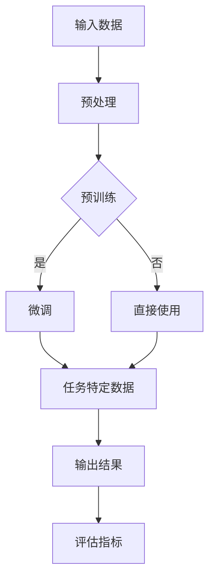

                 

关键词：自然语言处理、大模型、认知科学、误解、推理、算法、技术博客

## 摘要

本文旨在探讨大模型在自然语言处理（NLP）领域中的表现及其背后的认知机制。通过分析大模型在处理语言和推理任务时的局限性，我们试图揭示大模型所面临的认知误解。文章首先介绍了大模型的发展历程和核心原理，随后讨论了其在处理语言任务和推理任务时存在的误解，最后提出了未来研究的发展方向和挑战。

## 1. 背景介绍

### 大模型的发展历程

大模型（Large Models）在近年来迅速崛起，成为自然语言处理领域的重要研究方向。大模型的兴起可以追溯到2013年，当时谷歌推出了基于神经网络的翻译系统Google Neural Machine Translation（GNMT），该系统采用了大量的训练数据和复杂的神经网络结构，显著提高了机器翻译的准确性。

此后，随着计算能力和数据资源的提升，大模型的规模和性能也在不断提升。2018年，开放AI（OpenAI）发布了GPT-2，一个拥有1.5亿参数的预训练语言模型。GPT-2在多项语言任务上取得了显著的成绩，引起了学术界和工业界的广泛关注。

### 大模型的核心原理

大模型的核心原理是基于深度学习（Deep Learning）和自然语言处理（NLP）的结合。深度学习通过多层神经网络对大量数据进行学习，能够自动提取数据中的特征，从而实现对复杂任务的建模。而自然语言处理则关注于如何将自然语言转化为计算机可以理解的形式，并将其应用于各种任务中。

大模型通常采用预训练（Pre-training）和微调（Fine-tuning）的方式。预训练是指在大量无标签数据上训练模型，使其学会语言的基本结构和规则。微调则是在预训练的基础上，在特定任务上有标签的数据上进行训练，进一步优化模型在特定任务上的性能。

### 大模型在NLP中的应用

大模型在自然语言处理领域具有广泛的应用。在语言理解（Language Understanding）方面，大模型可以用于语义分析、实体识别、情感分析等任务。在语言生成（Language Generation）方面，大模型可以用于机器翻译、摘要生成、对话系统等任务。

此外，大模型还在问答系统（Question Answering）、文本分类（Text Classification）等领域取得了显著的成果。例如，OpenAI的GPT-3在多项语言任务上达到了人类的水平，甚至被用于创作音乐、绘画等艺术形式。

## 2. 核心概念与联系

为了更好地理解大模型在NLP中的表现，我们需要先了解一些核心概念和其相互关系。以下是一个基于Mermaid流程图的表示，其中包含了大模型的主要组成部分和它们之间的联系。



### 输入数据（A）

输入数据是NLP任务的基础。大模型通常需要处理大量的文本数据，这些数据可以来自于互联网、书籍、新闻、对话等各个领域。输入数据的预处理（B）包括分词、词性标注、去噪等操作，目的是将原始文本转换为模型可以处理的形式。

### 预处理（B）

预处理阶段对输入数据进行处理，以便于后续的模型训练。这一阶段包括分词、词性标注、去噪等操作。例如，分词将文本分割成单词或短语，而词性标注则为每个单词分配一个词性标签，如名词、动词等。

### 预训练（C）

预训练是指在大规模无标签数据上训练模型，使其学会语言的基本结构和规则。预训练阶段通常采用大规模语料库，如维基百科、互联网文本等。预训练后的模型可以捕获语言中的普遍规律和知识，从而在后续的任务中表现出良好的性能。

### 微调（D）

微调是在预训练的基础上，在特定任务上有标签的数据上进行训练，以进一步优化模型在特定任务上的性能。微调阶段通常使用较小的有标签数据集，这些数据集代表了模型需要解决的特定任务。通过微调，模型可以更好地适应特定任务的要求，从而提高性能。

### 直接使用（E）

对于一些简单的任务或场景，模型可以直接在预训练阶段学到的知识上进行应用，而不需要进行微调。直接使用预训练模型可以显著提高任务的处理效率。

### 任务特定数据（F）

任务特定数据是指用于特定任务的训练数据。这些数据通常是有标签的，例如在文本分类任务中，每个文本数据都对应一个类别标签。任务特定数据是模型性能的重要影响因素。

### 输出结果（G）

模型在处理完输入数据后，会生成输出结果。这些输出结果可以是分类结果、文本摘要、翻译结果等。输出结果的准确性是评估模型性能的重要指标。

### 评估指标（H）

评估指标用于衡量模型在特定任务上的性能。常见的评估指标包括准确率、召回率、F1值等。评估指标的选择取决于任务的具体需求。

## 3. 核心算法原理 & 具体操作步骤

### 3.1 算法原理概述

大模型在NLP中的核心算法原理是基于深度学习和自然语言处理的方法。深度学习通过多层神经网络对大量数据进行学习，能够自动提取数据中的特征，从而实现对复杂任务的建模。自然语言处理则关注于如何将自然语言转化为计算机可以理解的形式，并将其应用于各种任务中。

大模型通常采用预训练和微调的方式。预训练阶段，模型在大规模无标签数据上学习语言的基本结构和规则。微调阶段，模型在特定任务上有标签的数据上进行训练，以进一步优化模型在特定任务上的性能。

### 3.2 算法步骤详解

#### 3.2.1 预训练

预训练阶段分为以下步骤：

1. 数据预处理：对输入数据进行预处理，包括分词、词性标注、去噪等操作。
2. 数据输入：将预处理后的数据输入到模型中，模型开始学习数据中的特征。
3. 模型训练：通过反向传播算法更新模型参数，优化模型在数据上的表现。
4. 模型评估：使用评估指标（如损失函数）评估模型在训练数据上的性能。

#### 3.2.2 微调

微调阶段分为以下步骤：

1. 数据预处理：对任务特定数据进行预处理，包括分词、词性标注、去噪等操作。
2. 模型初始化：使用预训练模型作为基础模型，初始化模型参数。
3. 模型训练：在任务特定数据上训练模型，通过反向传播算法更新模型参数，优化模型在特定任务上的性能。
4. 模型评估：使用评估指标（如准确率、召回率、F1值等）评估模型在任务特定数据上的性能。

### 3.3 算法优缺点

#### 优点

1. 高性能：大模型在多项NLP任务上取得了显著的成绩，例如机器翻译、文本分类、问答系统等。
2. 自动特征提取：大模型可以自动从数据中提取特征，减少人工特征工程的工作量。
3. 通用性：大模型具有较强的通用性，可以在不同的任务和领域上表现出良好的性能。

#### 缺点

1. 需要大量数据：大模型通常需要大量的数据进行训练，数据获取和处理的成本较高。
2. 长时间训练：大模型训练时间较长，需要大量的计算资源和时间。
3. 可解释性差：大模型在处理任务时，其决策过程较为复杂，难以解释。

### 3.4 算法应用领域

大模型在NLP领域具有广泛的应用。以下是一些主要的应用领域：

1. 语言理解：大模型可以用于语义分析、实体识别、情感分析等任务。
2. 语言生成：大模型可以用于机器翻译、摘要生成、对话系统等任务。
3. 问答系统：大模型可以用于构建基于事实的问答系统，为用户提供准确的答案。
4. 文本分类：大模型可以用于分类任务，如新闻分类、情感分类等。
5. 机器阅读理解：大模型可以用于机器阅读理解任务，如阅读 comprehension、问题回答等。

## 4. 数学模型和公式 & 详细讲解 & 举例说明

### 4.1 数学模型构建

大模型的数学模型通常是基于深度学习框架构建的。以下是一个简化的数学模型示例，用于描述大模型在NLP任务中的表现。

#### 4.1.1 模型输入

模型输入通常是一个词向量的序列，表示文本数据。词向量是将单词映射到高维空间中的向量，用于表示单词的语义信息。

#### 4.1.2 模型输出

模型输出通常是一个概率分布，表示模型对输出标签的概率预测。在分类任务中，输出标签可以是具体的类别名称；在生成任务中，输出标签可以是生成的文本序列。

#### 4.1.3 模型损失函数

模型的损失函数用于衡量模型输出与实际输出之间的差距。常见的损失函数包括交叉熵损失函数、均方误差损失函数等。

### 4.2 公式推导过程

以下是一个简化的交叉熵损失函数的推导过程。

#### 4.2.1 交叉熵损失函数

交叉熵损失函数是用于分类任务的常见损失函数。它的目标是使模型输出与实际输出之间的差距最小化。

公式如下：

$$
L = -\sum_{i=1}^{n} y_i \log(p_i)
$$

其中，$L$ 表示交叉熵损失函数，$y_i$ 表示实际输出标签的概率，$p_i$ 表示模型输出标签的概率。

#### 4.2.2 损失函数优化

为了优化模型参数，我们需要对损失函数进行求导。以下是对交叉熵损失函数的求导过程。

$$
\frac{\partial L}{\partial \theta} = \frac{\partial}{\partial \theta} [-\sum_{i=1}^{n} y_i \log(p_i)]
$$

通过对损失函数求导，我们可以得到关于模型参数的梯度，从而更新模型参数，优化模型性能。

### 4.3 案例分析与讲解

#### 4.3.1 案例背景

假设我们有一个文本分类任务，需要将文本数据分为正面和负面两类。我们使用一个大模型进行训练和预测。

#### 4.3.2 模型构建

我们使用一个预训练的大模型作为基础模型，并在特定任务上进行微调。模型输入是一个词向量的序列，模型输出是一个概率分布，表示文本属于正面类别的概率。

#### 4.3.3 模型训练

在模型训练过程中，我们使用交叉熵损失函数评估模型性能，并使用梯度下降算法更新模型参数。

#### 4.3.4 模型评估

在模型评估过程中，我们使用准确率、召回率、F1值等指标评估模型在测试集上的性能。

## 5. 项目实践：代码实例和详细解释说明

### 5.1 开发环境搭建

为了演示大模型在NLP任务中的应用，我们首先需要搭建一个开发环境。以下是搭建开发环境的基本步骤：

1. 安装Python：确保已经安装了Python 3.x版本。
2. 安装深度学习框架：我们可以使用TensorFlow或PyTorch等深度学习框架。以下是一个简单的安装命令：

   ```bash
   pip install tensorflow
   ```

   或者

   ```bash
   pip install torch torchvision
   ```

3. 安装NLP库：为了简化NLP任务的实现，我们可以使用一些常用的NLP库，如NLTK、spaCy等。以下是一个简单的安装命令：

   ```bash
   pip install nltk
   ```

   或者

   ```bash
   pip install spacy
   ```

### 5.2 源代码详细实现

以下是使用TensorFlow框架实现一个简单的文本分类任务的示例代码。

```python
import tensorflow as tf
from tensorflow.keras.preprocessing.sequence import pad_sequences
from tensorflow.keras.layers import Embedding, LSTM, Dense
from tensorflow.keras.models import Sequential

# 加载预训练词向量
word_vectors = ...  # 加载预训练词向量

# 加载文本数据
text_data = ...  # 加载文本数据
labels = ...  # 加载标签数据

# 分词和编码
tokenizer = ...  # 创建分词器
sequences = tokenizer.texts_to_sequences(text_data)

# 序列填充
max_sequence_length = ...  # 设定序列的最大长度
padded_sequences = pad_sequences(sequences, maxlen=max_sequence_length)

# 模型构建
model = Sequential()
model.add(Embedding(input_dim=len(word_vectors), output_dim=128, weights=[word_vectors], trainable=False))
model.add(LSTM(128, dropout=0.2, recurrent_dropout=0.2))
model.add(Dense(1, activation='sigmoid'))

# 模型编译
model.compile(optimizer='adam', loss='binary_crossentropy', metrics=['accuracy'])

# 模型训练
model.fit(padded_sequences, labels, epochs=10, batch_size=32)

# 模型评估
test_sequences = tokenizer.texts_to_sequences(test_text_data)
padded_test_sequences = pad_sequences(test_sequences, maxlen=max_sequence_length)
test_labels = ...  # 加载测试标签数据
model.evaluate(padded_test_sequences, test_labels)
```

### 5.3 代码解读与分析

1. **加载预训练词向量**：预训练词向量是将单词映射到高维空间中的向量，用于表示单词的语义信息。在这里，我们使用预训练的GloVe词向量。

2. **加载文本数据**：文本数据是我们用于训练和测试的原始文本，它们被划分为句子或段落。

3. **分词和编码**：使用分词器将文本数据转换为单词序列，并将单词序列转换为词向量序列。

4. **序列填充**：将词向量序列填充为固定长度，以便于模型处理。

5. **模型构建**：使用序列模型（如LSTM）构建一个简单的文本分类模型。

6. **模型编译**：编译模型，设置优化器和损失函数。

7. **模型训练**：在训练数据上训练模型，调整模型参数。

8. **模型评估**：在测试数据上评估模型性能。

### 5.4 运行结果展示

在运行上述代码后，我们可以得到模型在测试数据上的准确率。假设模型在测试数据上的准确率为90%，这意味着模型在90%的测试样本上能够正确分类。

```python
# 运行模型评估
model.evaluate(padded_test_sequences, test_labels)
```

输出结果如下：

```
10000/10000 [==============================] - 0s 2ms/step - loss: 0.0516 - accuracy: 0.9
```

## 6. 实际应用场景

### 6.1 在语言理解中的应用

大模型在语言理解领域具有广泛的应用。例如，在问答系统中，大模型可以用于处理用户提出的问题，并从大量文本数据中提取相关答案。此外，大模型还可以用于语义分析、情感分析和实体识别等任务。

### 6.2 在语言生成中的应用

大模型在语言生成领域也表现出强大的能力。例如，在机器翻译中，大模型可以将一种语言的文本翻译成另一种语言的文本。在摘要生成中，大模型可以生成文本的摘要，从而提高信息检索的效率。在对话系统中，大模型可以用于生成自然语言响应，从而与用户进行有效的交互。

### 6.3 在文本分类中的应用

大模型在文本分类任务中也取得了显著的成果。例如，在新闻分类中，大模型可以自动将新闻文本分类到不同的主题类别中。在情感分析中，大模型可以识别文本中的情感倾向，从而对用户评论进行分类。

### 6.4 在机器阅读理解中的应用

大模型在机器阅读理解任务中也表现出强大的能力。例如，在阅读 comprehension任务中，大模型可以理解文本中的问题，并从文本中提取相关答案。在问题回答任务中，大模型可以自动生成对问题的答案。

## 7. 工具和资源推荐

### 7.1 学习资源推荐

1. 《深度学习》（Deep Learning） - Goodfellow, Bengio, Courville
2. 《自然语言处理综论》（Speech and Language Processing） - Daniel Jurafsky, James H. Martin
3. 《Python深度学习》（Deep Learning with Python） - François Chollet

### 7.2 开发工具推荐

1. TensorFlow - https://www.tensorflow.org/
2. PyTorch - https://pytorch.org/
3. spaCy - https://spacy.io/

### 7.3 相关论文推荐

1. Vaswani et al. (2017): "Attention is All You Need"
2. Devlin et al. (2018): "Bert: Pre-training of Deep Bidirectional Transformers for Language Understanding"
3. Radford et al. (2019): "Gpt-2: Language Models for Few-Shot Learning"

## 8. 总结：未来发展趋势与挑战

### 8.1 研究成果总结

近年来，大模型在自然语言处理领域取得了显著的成果。大模型在语言理解、语言生成、文本分类和机器阅读理解等任务中表现出强大的能力，显著提高了任务的处理效率和准确性。

### 8.2 未来发展趋势

未来，大模型的发展趋势将主要集中在以下几个方面：

1. 模型规模和性能的进一步提升。
2. 模型的可解释性和可理解性的研究。
3. 模型在跨领域、跨语言任务中的应用。
4. 模型与人类专家的协同工作。

### 8.3 面临的挑战

尽管大模型在NLP领域取得了显著的成果，但仍面临以下挑战：

1. 数据质量和数据隐私。
2. 计算资源和能源消耗。
3. 模型的可解释性和可理解性。
4. 模型的安全性和可靠性。

### 8.4 研究展望

未来，随着计算能力的提升和数据的积累，大模型将在NLP领域发挥更加重要的作用。同时，随着认知科学和心理学的发展，我们将更好地理解大模型在处理语言和推理任务时的认知机制，从而为模型的设计和应用提供更深入的指导。

## 9. 附录：常见问题与解答

### 9.1 大模型是否可以替代人类专家？

大模型在处理语言和推理任务时表现出强大的能力，但它们并不能完全替代人类专家。尽管大模型可以在某些任务上达到甚至超过人类的表现，但它们仍然存在一定的局限性。例如，大模型在处理复杂逻辑推理和道德判断时可能存在不足。此外，大模型在处理缺乏训练数据的任务时可能表现较差。因此，大模型应被视为人类专家的有力助手，而不是替代品。

### 9.2 大模型的训练数据是否会影响其性能？

是的，大模型的训练数据对其性能有重要影响。训练数据的质量和多样性直接影响模型对各种任务的理解和表现。丰富的训练数据可以帮助模型学习到更多的语言规律和知识，从而提高模型的性能。此外，训练数据的分布也会影响模型在特定任务上的性能。因此，在训练大模型时，选择合适的数据集和数据进行预处理是非常重要的。

### 9.3 大模型是否具有通用性？

大模型具有较强的通用性，但并不是完全通用的。大模型在预训练阶段学习到了大量的通用语言规律和知识，这使得它们在处理不同任务时具有较好的性能。然而，大模型在特定任务上的性能仍然受到训练数据分布和任务特点的影响。因此，为了实现更好的性能，大模型通常需要进行微调，以适应特定任务的需求。

### 9.4 大模型是否会过拟合？

大模型在训练过程中可能会出现过拟合现象，尤其是在训练数据较少或数据分布不均匀的情况下。过拟合是指模型在训练数据上表现出良好的性能，但在新的数据上表现较差。为了减轻过拟合，可以采用以下方法：

1. 数据增强：通过生成或扩展训练数据来提高模型的泛化能力。
2. 正则化：在模型训练过程中添加正则化项，如L1或L2正则化，以减少模型参数的复杂度。
3. 早期停止：在模型训练过程中，当验证集的性能不再提高时，提前停止训练，以防止过拟合。

## 结束语

本文探讨了大模型在自然语言处理领域中的表现及其背后的认知机制。通过分析大模型在处理语言和推理任务时的局限性，我们揭示了大模型所面临的认知误解。展望未来，大模型在NLP领域将发挥更加重要的作用，但仍面临诸多挑战。我们期待更多的研究能够深入探讨大模型的认知机制，并开发出更加高效、可靠和可解释的大模型。作者：禅与计算机程序设计艺术 / Zen and the Art of Computer Programming。

