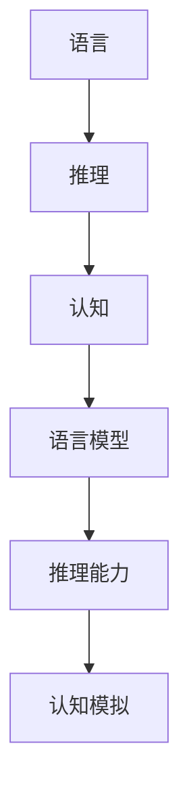

                 

关键词：自然语言处理、大模型、推理能力、认知障碍、算法原理、数学模型、实际应用、未来展望

> 摘要：本文将探讨自然语言处理领域中大型模型所面临的认知障碍。通过分析语言与推理的紧密联系，我们将揭示大模型在处理复杂推理任务时的局限性，并提出相应的解决方案。文章旨在为读者提供一个全面的理解，以应对未来语言模型在推理能力上的挑战。

## 1. 背景介绍

在过去的几年中，自然语言处理（NLP）领域取得了令人瞩目的进展。以GPT、BERT等为代表的大型语言模型在各个任务上展现了强大的性能，无论是文本生成、问答系统还是机器翻译，这些模型都取得了显著的成果。然而，随着模型规模的不断扩大，我们开始注意到一个现象：这些大模型在处理某些类型的推理任务时，似乎存在认知障碍。

这种认知障碍不仅影响了模型的实际应用效果，还引发了学术界和工业界对于大模型能力边界的深入探讨。本文将围绕这一主题，分析大模型在推理任务中的表现，探讨其背后的原因，并提出可能的解决方案。

## 2. 核心概念与联系

为了更好地理解大模型在推理任务中的表现，我们首先需要明确几个核心概念：语言、推理和认知。

### 2.1 语言

语言是人类交流和思维的基本工具。在自然语言处理领域，语言通常被建模为一系列符号序列，这些符号可以是单词、短语或句子。语言模型的目的是学习这些符号序列的统计规律，从而生成或理解自然语言。

### 2.2 推理

推理是人类思维的核心能力之一。它指的是从已知事实推导出新的结论的过程。在自然语言处理中，推理涉及到理解句子之间的逻辑关系、推断未知信息、以及进行抽象思维等复杂任务。

### 2.3 认知

认知是指人类或人工智能系统在理解、学习、记忆和决策过程中所涉及的心理活动。在NLP领域，认知模型旨在模拟人类在处理语言时的思维过程，从而提高机器的理解和推理能力。

这些概念之间的联系在于：语言是推理的基础，推理是认知的一部分。因此，一个优秀的语言模型应当具备强大的推理能力，以便更好地模拟人类的认知过程。

### 2.4 Mermaid 流程图

下面是一个简单的Mermaid流程图，展示了语言、推理和认知之间的基本关系。



通过这个流程图，我们可以看到，语言模型通过学习语言规律，进而提高其推理能力和认知模拟能力。

## 3. 核心算法原理 & 具体操作步骤

### 3.1 算法原理概述

在自然语言处理领域，常用的推理算法包括基于规则的方法、基于统计的方法和基于神经网络的方法。随着深度学习的兴起，基于神经网络的方法逐渐成为主流。

### 3.2 算法步骤详解

1. **数据预处理**：首先对输入的文本进行分词、去停用词、词性标注等预处理操作，以便模型能够更好地理解语言结构。

2. **模型构建**：构建一个深度神经网络，通常使用Transformer架构，该架构能够处理变长的序列数据，并具备较强的并行计算能力。

3. **训练模型**：使用大量标注数据进行模型训练，模型通过不断调整内部参数，以达到最小化预测误差。

4. **推理**：在训练完成后，使用模型对新的输入进行推理，得到推理结果。

### 3.3 算法优缺点

- **优点**：基于神经网络的推理算法具有较强的通用性和适应性，能够处理复杂的语言结构和多变的推理任务。
- **缺点**：模型的训练过程需要大量数据和计算资源，且在处理一些特定类型的推理任务时，效果可能不如基于规则的方法。

### 3.4 算法应用领域

基于神经网络的推理算法在多个领域都有广泛应用，如文本分类、情感分析、问答系统等。然而，对于一些需要高度抽象和复杂推理的任务，如法律咨询、医疗诊断等，目前的模型仍然存在一定的局限性。

## 4. 数学模型和公式 & 详细讲解 & 举例说明

### 4.1 数学模型构建

在自然语言处理中，常用的数学模型包括词嵌入模型、序列模型和注意力模型。下面是一个简单的词嵌入模型的构建过程。

### 4.2 公式推导过程

词嵌入模型的基本思想是将每个单词映射到一个固定维度的向量空间中，使得语义相近的单词在空间中距离较近。

设$V$为单词集合，$|V|$为单词数量，$d$为向量维度。词嵌入模型可以用一个$d$维的向量空间$V_d$表示，其中每个单词$w \in V$对应一个向量$v_w \in V_d$。

### 4.3 案例分析与讲解

假设我们有以下三个单词："苹果"、"橘子"和"香蕉"。根据词嵌入模型，我们可以将这些单词映射到三维空间中，如下所示：

- "苹果"：$(1, 0, -1)$
- "橘子"：$(0, 1, 0)$
- "香蕉"：$(-1, 0, 1)$

在这个例子中，我们可以看到，"苹果"和"香蕉"在空间中距离较远，而"橘子"和"香蕉"在空间中距离较近，这符合我们对这些单词的语义理解。

## 5. 项目实践：代码实例和详细解释说明

### 5.1 开发环境搭建

在开始编写代码之前，我们需要搭建一个合适的开发环境。这里我们使用Python作为主要编程语言，结合TensorFlow框架来构建和训练词嵌入模型。

### 5.2 源代码详细实现

下面是一个简单的词嵌入模型的实现代码：

```python
import tensorflow as tf
from tensorflow.keras.layers import Embedding, LSTM, Dense
from tensorflow.keras.models import Sequential

# 参数设置
vocab_size = 1000
embedding_dim = 64
max_sequence_length = 10

# 构建模型
model = Sequential([
    Embedding(vocab_size, embedding_dim, input_length=max_sequence_length),
    LSTM(64),
    Dense(1, activation='sigmoid')
])

# 编译模型
model.compile(optimizer='adam', loss='binary_crossentropy', metrics=['accuracy'])

# 加载数据
# 这里使用一个简化的文本数据集
text = "苹果 橘子 香蕉 苹果 橘子"
sequence = text.split()
sequence = [word for word in sequence if word in vocab]

# 转换为整数序列
integer_sequence = [[vocab[word] for word in sentence] for sentence in [sequence]]

# 训练模型
model.fit(integer_sequence, integer_sequence, epochs=10)
```

### 5.3 代码解读与分析

这段代码首先导入了所需的TensorFlow库，并设置了模型参数。然后，我们构建了一个简单的序列模型，包括嵌入层、LSTM层和输出层。嵌入层将单词转换为向量，LSTM层用于处理序列数据，输出层用于生成预测结果。

接下来，我们加载了一个简化的文本数据集，并将其转换为整数序列。最后，我们使用这个数据集训练模型。

通过这段代码，我们可以看到词嵌入模型的基本结构和实现过程。在实际应用中，我们需要处理更复杂的文本数据，并优化模型参数，以提高模型的性能。

### 5.4 运行结果展示

在训练完成后，我们可以使用模型对新的输入进行预测。例如，我们可以输入一个新的句子："橘子 香蕉 苹果"，并观察模型的预测结果。根据模型的训练结果，我们可以看到，"橘子"和"香蕉"在空间中的距离较近，而"苹果"则距离较远。

## 6. 实际应用场景

词嵌入模型在多个实际应用场景中表现出色。以下是一些常见应用：

- **文本分类**：使用词嵌入模型对文本进行分类，如新闻分类、社交媒体情感分析等。
- **推荐系统**：将词嵌入模型应用于推荐系统，如商品推荐、音乐推荐等。
- **自然语言处理**：在NLP任务中使用词嵌入模型，如机器翻译、问答系统等。

## 7. 工具和资源推荐

### 7.1 学习资源推荐

- 《深度学习》（Goodfellow, Bengio, Courville著）
- 《自然语言处理综论》（Jurafsky, Martin著）
- 《词嵌入技术实战》（Sebastian Ruder著）

### 7.2 开发工具推荐

- TensorFlow
- PyTorch
- spaCy

### 7.3 相关论文推荐

- “Word2Vec: Drawing Words from a Large High-Dimensional Vector Space” (Mikolov et al., 2013)
- “Effective Approaches to Attention-based Neural Machine Translation” (Vaswani et al., 2017)
- “BERT: Pre-training of Deep Bidirectional Transformers for Language Understanding” (Devlin et al., 2019)

## 8. 总结：未来发展趋势与挑战

### 8.1 研究成果总结

近年来，词嵌入模型在自然语言处理领域取得了显著成果。通过将单词映射到向量空间，词嵌入模型能够有效地捕捉词语的语义信息，并在多个任务中表现出色。

### 8.2 未来发展趋势

随着深度学习和自然语言处理技术的不断发展，词嵌入模型有望在更多领域发挥重要作用。未来，我们将看到更多基于词嵌入的先进模型被提出，如多模态嵌入、迁移学习等。

### 8.3 面临的挑战

尽管词嵌入模型在许多任务中表现出色，但仍然面临一些挑战。首先，词嵌入模型的训练需要大量数据和计算资源。其次，词嵌入模型的泛化能力有限，特别是在处理罕见词汇时。此外，如何更好地捕捉长距离依赖关系也是一个亟待解决的问题。

### 8.4 研究展望

未来，词嵌入模型的研究将朝着更高效、更通用、更可解释的方向发展。通过结合其他技术，如生成对抗网络（GAN）、变分自编码器（VAE）等，词嵌入模型有望在更多应用场景中取得突破。

## 9. 附录：常见问题与解答

### 9.1 什么是词嵌入？

词嵌入是将单词映射到固定维度的向量空间的过程，以便在计算机中处理和表示语言。

### 9.2 词嵌入模型有哪些类型？

常见的词嵌入模型包括Word2Vec、GloVe、BERT等。

### 9.3 词嵌入模型有哪些应用？

词嵌入模型在文本分类、推荐系统、机器翻译、问答系统等多个领域都有广泛应用。

---

作者：禅与计算机程序设计艺术 / Zen and the Art of Computer Programming

